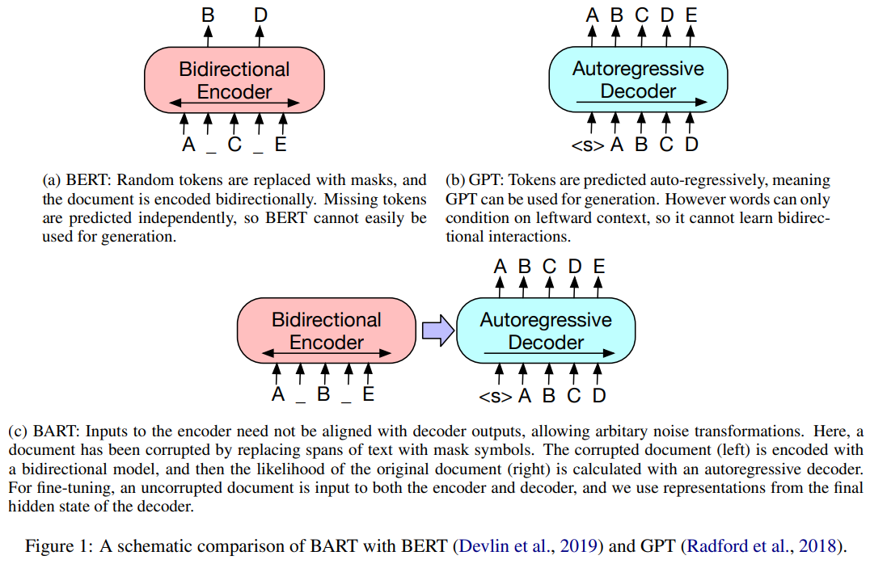
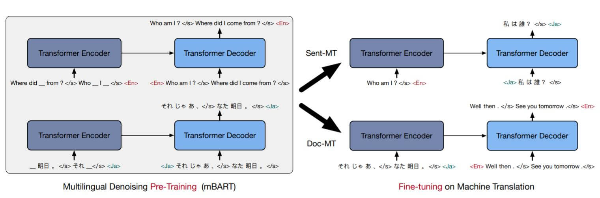

# MBART

## BART

BERT+GPT

transformers的MBartTokenizer，MBartForConditionalGeneration

BART采用的是**标准Transformer**结构,**输入数据**和**训练目标**和Transformer**完全不一样**.

BART使用的是类似BERT的**Denoising AutoEncoder**的形式来训练的, 即**模型需要对被添加噪声的数据去噪, 恢复出原始数据.**

BART允许对原始数据做**任意形式**的噪声干扰, 作者提出了五种可行的添加噪声的方式:

- **Token Masking**: 与BERT打`[Mask]`的策略完全相同.

- **Token Deletion**: 直接随机删除某些Token.

- **Text Infilling**: 同时选中多个连续的Token, 仅替换成一个`[Mask]`, 或者在原始数据中随机插入Mask Token(即使没有数据缺失). 模型不知道`[Mask]`对应的是多少个Token, 也不知道`[Mask]`是否有效. 这就要求模型有强大的学习能力.

- **Sentence Permutation**: 将一个文档中的句子之间的顺序打乱.

- **Document Rotation**: 从文档中随机选定一个Token作为整个文档的起始Token, 对文档Rotation. 该方法令模型能识别文档的起始Token.

**Text Infilling**效果最好，**Rotation**和**Permutation**不好

在输入加噪的数据后, BART先通过Encoder双向编码, 再通过Decoder用自回归极大似然解码, 恢复出原始序列

**Loss Function**就是reconstruction loss, 也就是decoder的输出和原文ground truth之间的cross entropy

BART在预训练后, 需要对下游任务微调. 对于不同的任务, BART有不同的使用方法:

- **Sequence Classification**: 对序列分类任务, Encoder和Decoder以相同的数据输入, 利用Decoder的最后一次输出代表整个句子的表示, 类似于BERT中的`[CLS]`. 只不过BART是有Decoder的, 所以需要让Decoder的输出作为整个句子的表示.

- **Token Classification**: 对于Token分类任务, Encoder和Decoder也以相同的数据输入, BART也将Decoder中所对应Token的输出作为分类的隐藏状态.
- **Sequence Generation**: 对于序列生成任务, BART直接适应生成任务, 对Encoder和Decoder微调即可. 该类任务包括文本摘要, 问答等.encoder输入数据，decoder生成输出
- **Machine Translation**: 机器翻译任务比较特殊, 因为它的任务输入和输出是两种不同的语言. 结合先前在机器翻译上的研究, 额外添加一个专门用于外语映射的Encoder(例如其他语言映射到英语)将有助于模型性能的提升. 所以BART需要训练一个新的Encoder来将源语言与目标语言语义空间对齐, 来替代掉BART原来的Word Embedding, 在完成对齐后, BART将把源语言转换为目标语言, 与Transformer保持一致.

训练分为了两个阶段:

1.  一阶段中, 对BART的大多数参数冻结, 只更新随机初始化的源语言Encoder, BART的位置编码, BART Encoder的第一层Self - Attention投影矩阵.
2.  二阶段中, 对整个BART(包含后来添加的Encoder)中的所有参数做少次迭代.

作者做了各不同预训练目标的模型的效果对比, 这些模型并不是原始论文中的模型, 而是作者或多或少调整过的. 其中所使用的模型分别类似于:

- Language Model: GPT.
- Permuted Language Model: XLNet.
- Masked Language Mode: BERT.
- Multitask Masked Language Model: UniLM.
- Masked Seq - to - Seq: MASS.

实验结果如下:

从实验中看到, 使用Text Infilling的效果非常好, 只使用Document Rotation和Sentence Shuffling的效果比较差. 并且, 预训练的有效性高度取决于任务, 自回归式的模型有利于解决生成类任务

## mBART

**mBART**(**M**ultilingual **B**idirectional and **A**uto - **R**egressive **T**ransformers)是BART的**多语言**版本, 用于处理不同语言之间的**机器翻译**问题

预训练阶段延续了BART的做法, 仍然采用**Denoising AutoEncoder**的方法令mBART的每条数据在**单语言**内训练. 目标是将单语言文本加噪干扰后再恢复回来. 作者采取了两种BART中的加噪方式:

- **Sentence Permutation**: 打乱句子和句子之间的顺序.
- **Word - Span masking**: 连续的Mask掉一些内容, 并且只用一个`[Mask]`替换.

除此外, mBART的初衷是多语言模型, 必须将语种的信息加入. 在文本输入结束后, 在句子末尾处需要加上句子结尾标识`<\s>`和对应语言的标识`[LID]`

微调阶段才针对机器翻译任务训练. 用`[LID]`替换Decoder原来的第一个输入`[Start]`, 表明要翻译成哪个语种.

Sentence Level MT和Document Level MT的主要区别就在于文本的长度不同, Document Level MT更困难一些.

上述方法概括为下图:

左侧为预训练阶段, 每条数据使用单语言文本并加噪, mBART将其恢复为原来的单语言文本. 右侧为微调阶段, 针对某两种语言之间做微调, 输入为源语言, 期望输出为目标语言, Decoder的首次输入为目标语言的`<LID>`

作者额外提出了一种新的语言迁移的无监督机器翻译方式.

常见的的反向翻译示意图如下:

先用预训练权重初始化翻译模型, 然后对目标语言到源语言的翻译模型做训练, 生成源语言的文本作为扩充数据, 再将之前的平行语料和新生成源语言的文本共同作为训练数据, 训练源语言到目标语言的模型.

而作者提出的语言迁移方法如下:

直接在预训练阶段就注入多语言的平行语料, 使得模型能学习到不同语种之间潜在的共性, 在Fine Tuning后, 直接就能应对相似语种的翻译任务

## 参考资料

[https://zhuanlan.zhihu.com/p/366525006](https://zhuanlan.zhihu.com/p/366525006)

[https://adaning.github.io/posts/1394.html](https://adaning.github.io/posts/1394.html)

