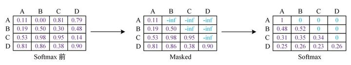
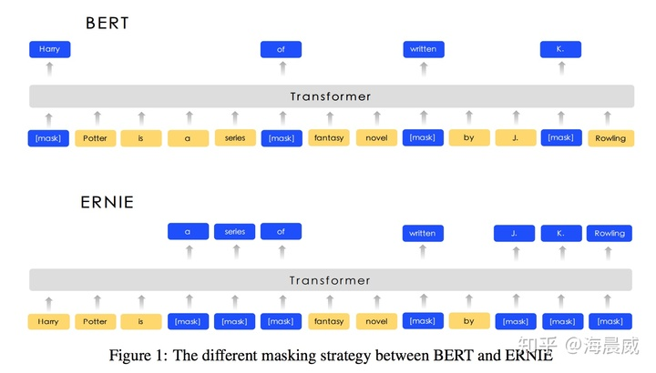
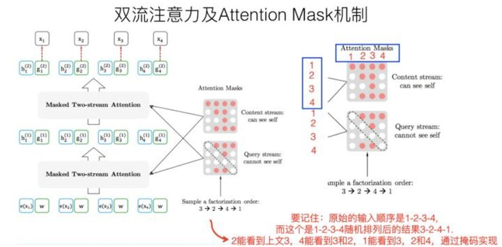
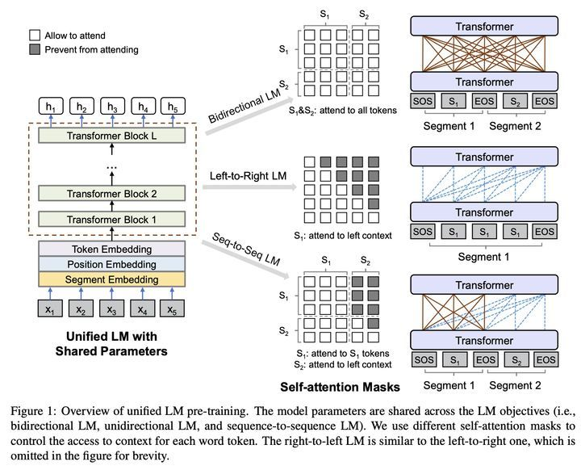

Mask的作用：

- 处理非定长序列
  - RNN中的Mask
  - Attention中Mask
- 防止标签泄露

  - Transformer中的Mask
  - BERT中的Mask
  - XLNet中的Mask

1、padding mask：处理非定长序列，区分padding和非padding部分，如在RNN等模型和Attention机制中的应用等
2、sequence mask：防止标签泄露，如：Transformer decoder中的mask矩阵，BERT中的[Mask]位，XLNet中的mask矩阵等
PS：padding mask 和 sequence mask非官方命名

## 处理非定长序列

### **RNN中的Mask**

对于RNN等模型，本身是可以直接处理不定长数据的，因此它不需要提前告知 sequence length，如下是pytorch下的LSTM定义：

```python3
nn.LSTM(input_size, hidden_size, *args, **kwargs)
```

但是在实践中，为了 batch 训练，一般会把不定长的序列 padding 到相同长度，再用 mask 去区分非 padding 部分和 padding 部分。

区分的目的是使得RNN只作用到它实际长度的句子，而不会处理无用的 padding 部分，这样RNN的输出和隐状态都会是对应句子实际的最后一位。另外，对于token级别的任务，也可以通过mask去忽略 padding 部分对应的loss。

不过，在 pytorch 中，对 mask 的具体实现形式不是mask矩阵，而是通过一个句子长度列表来实现的，但本质一样。实现如下，sentence_lens 表示的是这个batch中每一个句子的实际长度。**[参考](https://zhuanlan.zhihu.com/p/34418001)**

```python3
embed_input_x_packed = pack_padded_sequence(embed_input_x, sentence_lens, batch_first=True)
encoder_outputs_packed, (h_last, c_last) = self.lstm(embed_input_x_packed)
encoder_outputs, _ = pad_packed_sequence(encoder_outputs_packed, batch_first=True)
```

btw，在 pytorch 的 Embedding 和 Loss 中也有对 padding 值的设置：

```python3
# padding_idx (int, optional): If given, pads the output with the embedding vector at 
# `padding_idx` (initialized to zeros) whenever it encounters the index.
embedding = nn.Embedding(vocab_size, embed_dim, padding_idx=0)

# ignore_index (int, optional): Specifies a target value that is ignored
# and does not contribute to the input gradient.
criterion = nn.CrossEntropyLoss(ignore_index=0)
```

关于不同深度学习框架对变长序列的处理可以参考：[NLP中各框架对变长序列的处理全解](https://zhuanlan.zhihu.com/p/161972223)

### **Attention中Mask**

在 Attention 机制中，同样需要忽略 padding 部分的影响，这里以transformer encoder中的self-attention为例：

self-attention中，Q和K在点积之后，需要先经过mask再进行softmax，因此，对于要屏蔽的部分，mask之后的输出需要为负无穷，这样softmax之后输出才为0。

```python3
def attention(query, key, value, mask=None, dropout=None):
    "Compute 'Scaled Dot Product Attention'"
    d_k = query.size(-1)
    scores = torch.matmul(query, key.transpose(-2, -1)) \
             / math.sqrt(d_k)
    if mask is not None:
        scores = scores.masked_fill(mask == 0, -1e9) # mask步骤，用 -1e9 代表负无穷
    p_attn = F.softmax(scores, dim = -1)
    if dropout is not None:
        p_attn = dropout(p_attn)
    return torch.matmul(p_attn, value), p_attn
```

**[代码参考](https://link.zhihu.com/?target=http%3A//nlp.seas.harvard.edu/2018/04/03/attention.html%23attention)**

## **防止标签泄露**

在语言模型中，常常需要从上一个词预测下一个词，但如果要在LM中应用 self attention 或者是同时使用上下文的信息，要想不泄露要预测的标签信息，就需要 mask 来“遮盖”它。不同的mask方式，也对应了一篇篇的paper，这里选取典型的几个。

### **Transformer中的Mask**

Transformer 是包括 Encoder和 Decoder的，Encoder中 self-attention 的 padding mask 如上，而 Decoder 还需要防止标签泄露，即在 t 时刻不能看到 t 时刻之后的信息，因此在上述 padding mask的基础上，还要加上 sequence mask。

sequence mask 一般是通过生成一个上三角为0的矩阵来实现的，上三角区域对应要mask的部分。

在Transformer 的 Decoder中，先不考虑 padding mask，一个包括四个词的句子[A,B,C,D]在计算了相似度scores之后，得到下面第一幅图，将scores的上三角区域mask掉，即替换为负无穷，再做softmax得到第三幅图。这样，比如输入 B 在self-attention之后，也只和A，B有关，而与后序信息无关。

因为在softmax之后的加权平均中: B' = 0.48*A+0.52*B，而 C，D 对 B'不做贡献。



**[图片参考](https://link.zhihu.com/?target=https%3A//baijiahao.baidu.com/s%3Fid%3D1652093322137148754%26wfr%3Dspider%26for%3Dpc)**

实际应用中，Decoder 需要结合 padding mask 和 sequence mask，下面在pytorch框架下以一个很简化的例子展示 Transformer 中 的两种 Mask。

```text
import torch

def padding_mask(seq, pad_idx):
    return (seq != pad_idx).unsqueeze(-2)   # [B, 1, L]

def sequence_mask(seq):
    batch_size, seq_len = seq.size()
    mask = 1- torch.triu(torch.ones((seq_len, seq_len), dtype=torch.uint8),diagonal=1)
    mask = mask.unsqueeze(0).expand(batch_size, -1, -1)  # [B, L, L]
    return mask

def test():
    # 以最简化的形式测试Transformer的两种mask
    seq = torch.LongTensor([[1,2,0]]) # batch_size=1, seq_len=3，padding_idx=0
    embedding = torch.nn.Embedding(num_embeddings=3, embedding_dim=10, padding_idx=0)
    query, key = embedding(seq), embedding(seq)
    scores = torch.matmul(query, key.transpose(-2, -1))

    mask_p = padding_mask(seq, 0)
    mask_s = sequence_mask(seq)
    mask_decoder = mask_p & mask_s # 结合 padding mask 和 sequence mask

    scores_encoder = scores.masked_fill(mask_p==0, -1e9) # 对于scores，在mask==0的位置填充
    scores_decoder = scores.masked_fill(mask_decoder==0, -1e9)

test()
```

对应的各mask值为：

```text
# mask_p
[[[1 1 0]]]
# mask_s
[[[1 0 0]
  [1 1 0]
  [1 1 1]]]
# mask_decoder
[[[1 0 0]
  [1 1 0]
  [1 1 0]]]
```

可以看到 mask_decoder 的第三列为0 ，对应padding mask，上三角为0，对应sequence mask。

对于Decoder，在batch训练时会同时需要padding mask和sequence mask。

在测试时为单例，仅需要加上sequence mask，这样可以固定住每一步生成的词，让前面生成的词在self-attention时不会包含后面词的信息，这样也使测试和训练保持了一致。

不过，在测试过程中，预测生成的句子长度逐步增加，因此每一步都会要生成新的sequence mask矩阵的，是维度逐步增加的下三角方阵。

### **BERT中的Mask**

BERT实际上是Transformer的Encoder，为了在语言模型的训练中，使用上下文信息又不泄露标签信息，采用了Masked LM，简单来说就是随机的选择序列的部分token用 [Mask] 标记代替。



BERT之后，也有不少在Mask的范围和形式上做文章的，比如：ERNIE，但大同小异，不多赘述。

而XLNet的Mask操作就非常的巧(nan)妙(dong)，如下。

### **XLNet中的Mask**

XLNet通过**Permutation Language Modeling**实现了不在输入中加[Mask]标记，同样可以利用上下文信息，关键的操作就是下面所示的 Attention Mask 机制。



但并不是那么好理解，要理解XLNet中的Mask，一定要先看张俊林老师的：**[XLNet:运行机制及和Bert的异同比较](https://zhuanlan.zhihu.com/p/70257427)**，再来看下面的内容。上图也是引自该文，这里再引用一句我认为非常关键的一段话：

> 在Transformer内部，通过Attention掩码，从X的输入单词里面，也就是Ti的上文和下文单词中，随机选择i-1个，放到Ti的上文位置中，把其它单词的输入通过Attention掩码隐藏掉，于是就能够达成我们期望的目标（当然这个所谓放到Ti的上文位置，只是一种形象的说法，其实在内部，就是通过Attention Mask，把其它没有被选到的单词Mask掉，不让它们在预测单词Ti的时候发生作用，如此而已。看着就类似于把这些被选中的单词放到了上文Context_before的位置了）

对于排列序列：3->2->4->1，通过 Attention Mask，在 self-attention 的加权平均计算中，以上图中的$$E_{2'}$$为例：

self-attention 计算之后Content stream中的 $$E_{2'}=a_2E_2+a_3E_3$$，其中$E_2$表示第2个词对应的向量，其他同理。这样在$E_{2'}$中就看到了它的下文$E_3$，就好像是把$E_3$放到了它的上文位置一样，但实际顺序并没有改变。

**在评论中有一个非常好的问题**：为什么不直接在attention掩码矩阵中只把当前的单词掩盖住来获取上下文的特征呢？直接mask住左上到右下的对角线构建双向语言模型不行吗？

这个问题并非一两句话能够很好的解释，因此，针对这个问题，在下面这篇文章中对XLNet中的Attention Mask再做了一些延展，可参考：

[海晨威：XLNet 中神奇的 Attention Mask](https://zhuanlan.zhihu.com/p/324744784)


### **UniLM中的Mask**

UniLM (Unified Language Model)，从它的名字就足以见它的野心。而它也确实仅用Mask，就让BERT可以同时构建双向语言模型，单向语言模型和seq2seq语言模型。

其实，上面三种LM的差异，就在于训练时能利用哪些信息，具体实现上，UniLM就通过Mask来控制信息的利用，语言模型的学习上，和BERT一样，还是通过完形填空，预测被mask位去学习。下图很形象的展示了上述三种LM：



上图的中间展示的就是不同LM的Self-Attention Mask 矩阵（没有考虑 padding mask，仅有sequence mask，假设被mask位为0）：

**双向语言模型：**和BERT一样，可以是一句或两句话，全1的mask矩阵，即可以看到上下文所有信息

**单向语言模型：**仅一句话，从左到右预测的话是上三角为0的mask矩阵，仅能看到上文

**seq2seq语言模型：**需要两句话，第一句话可以看到本身所有信息，但看不到第二句话任何信息；第二句话可以看到第一句话所有信息，本身只能看到上文。所以它的mask矩阵包括四个部分，从左到右，从上到下分别是：全0，全1，全0，上三角为1。

上面三种LM中，最巧妙地是seq2seq语言模型，在不改变BERT原有结构的情况下，做到了类seq2seq的形式，充分利用第一句的信息，去帮助第二句的预测，可以很好地提升BERT在NLG方面的效果，论文中的实验效果也验证了这点。

## 参考资料

[NLP 中的Mask全解](https://zhuanlan.zhihu.com/p/139595546)