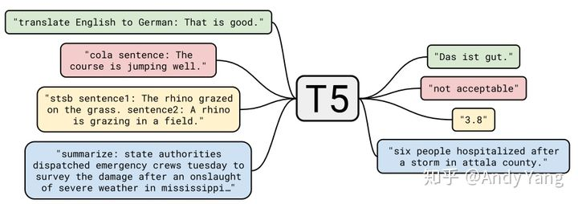
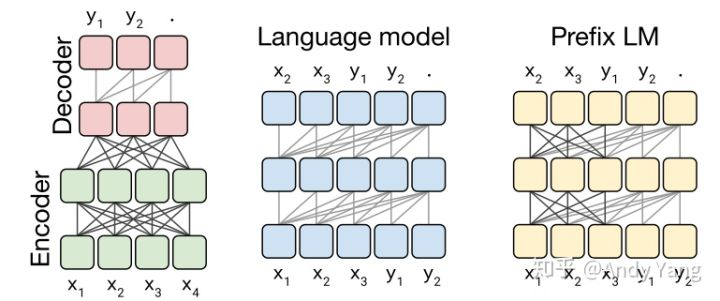
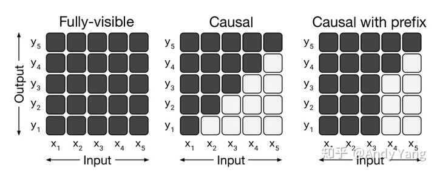
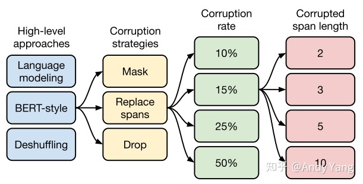

# T5

### Intro

T5：**Transfer Text-to-Text Transformer** 的简写

编码器-解码器 Transformer 实现大致遵循 Vaswani 等人提出的原版 Transformer 架构。

它最重要作用是给**整个 NLP 预训练模型领域提供了一个通用框架**，把所有任务都转化成一种形式。**将所有 NLP 任务都转化成 Text-to-Text （文本到文本）任务**。

比如英德翻译，只需将训练数据集的输入部分前加上“translate English to German（给我从英语翻译成德语）” 就行。假设需要翻译"That is good"，那么先转换成 "translate English to German：That is good." 输入模型，之后就可以直接输出德语翻译 “Das ist gut.”

再比如情感分类任务，输入"sentiment：This movie is terrible!"，前面直接加上 “sentiment：”，然后就能输出结果“negative（负面）”。

最神奇的是，对于需要输出连续值的 STS-B（文本语义相似度任务），居然也是直接输出文本，而不是加个连续值输出头。以每 0.2 为间隔，从 1 到 5 分之间分成 21 个值作为输出分类任务。比如上图中，输出 3.8 其实不是数值，而是一串文本，之所以能进行这样的操作，应该完全赖于 T5 模型强大的容量。

通过这样的方式就能将 NLP 任务都转换成 Text-to-Text 形式，也就可以**用同样的模型，同样的损失函数，同样的训练过程，同样的解码过程来完成所有 NLP 任务**。其实这个思想之前 GPT2 论文里有提，上斯坦福 cs224n 时 Socher 讲的 The Natural Language Decathlon 也有提。

### **Data：C4 （Bomb!）**

作者从 Common Crawl（一个公开的网页存档数据集，每个月大概抓取 20TB 文本数据） 里清出了 750 GB 的训练数据，然后取名为 ” Colossal Clean Crawled Corpus （超大型干净爬取数据）“，简称 C4，论作者取名之恶趣味。

大概清理过程如下：

- 只保留结尾是正常符号的行；
- 删除任何包含不好的词的页面，具体词表参考**[List-of-Dirty-Naughty-Obscene-and-Otherwise-Bad-Words](https://link.zhihu.com/?target=https://github.com/LDNOOBW/List-of-Dirty-Naughty-Obscene-and-Otherwise-Bad-Words)**库（笔者按：宝藏库，到里面转了一圈，看了看熟悉的几门语言，瞬间涨了不少新姿势 ）；
- 包含 Javascript 词的行全去掉；
- 包含编程语言中常用大括号的页面；
- 任何包含”lorem ipsum（用于排版测试）“的页面；
- 连续三句话重复出现情况，保留一个。

### **Architecture：The Best One**

首先作者们先对预训练模型中的多种模型架构（Transformer）进行了比对，最主要的模型架构可以分成下面三种。

第一种，**Encoder-Decoder 型**，即 Seq2Seq 常用模型，分成 Encoder 和 Decoder 两部分，对于 Encoder 部分，输入可以看到全体，之后结果输给 Decoder，而 Decoder 因为输出方式只能看到之前的。此架构代表是 MASS（今年WMT的胜者），而 BERT 可以看作是其中 Encoder 部分。

第二种， 相当于上面的 **Decoder 部分**，当前时间步只能看到之前时间步信息。典型代表是 GPT2 还有最近 CTRL 这样的。

第三种，**Prefix LM（Language Model） 型**，可看作是上面 Encoder 和 Decoder 的融合体，一部分如 Encoder 一样能看到全体信息，一部分如 Decoder 一样只能看到过去信息。最近开源的 UniLM 便是此结构。

上面这些模型架构都是 Transformer 构成，之所以有这些变换，主要是**对其中注意力机制的 Mask 操作**。

Casual是一种常见的掩码机制，有从左到右和从右到做两种，当前点仅能看到改点之前的信息，看不到后面的信息，如果要看到两个方向的信息只能将两个信息concat（如BiLSTM模型），GPT就是采用这种掩码机制。Casual prefix可以看成是Casual的扩展，应该有些常见prefix固定，UniLM采用这种掩码机制。那有没有一种机制能建模时同时看两边，Fully-visible就属于这类。在Fully-visible之前大部分模型都是选择Casual这种，所以个人觉得Bert采用Fully-visible还是很有创新意义。

通过实验作者们发现，在提出的这个 Text-to-Text 架构中，Encoder-Decoder 模型效果最好。于是乎，就把它定为 T5 模型，因此**所谓的 T5 模型其实就是个 Transformer 的 Encoder-Decoder 模型**。

### **Objectives：Search，Search，Search**

之后是对预训练目标的大范围探索，具体做了哪些实验，下面这张图就能一目了然。

总共从四方面来进行比较。

第一个方面，**高层次方法（自监督的预训练方法）对比**，总共三种方式。

1. **语言模型式**，就是 GPT-2 那种方式，从左到右预测；
2. **BERT-style 式**，就是像 BERT 一样将一部分给破坏掉，然后还原出来；
3. Deshuffling （顺序还原）式，就是将文本打乱，然后还原出来。

其中发现 Bert-style 最好，进入下一轮。

第二方面，对文本一部分进行**破坏时的策略**，也分三种方法。

1. **Mask 法**，如现在大多模型的做法，将被破坏 token 换成特殊符如 [M]；
2. **replace span（小段替换）法**，可以把它当作是把上面 Mask 法中相邻 [M] 都合成了一个特殊符，每一小段替换一个特殊符，提高计算效率；
3. **Drop 法**，没有替换操作，直接随机丢弃一些字符。

此轮获胜的是 **Replace Span 法**，类似做法如 SpanBERT 也证明了有效性。

当当当，进入下一轮。

第三方面，到底该**对文本百分之多少进行破坏**呢，挑了 4 个值，10%，15%，25%，50%，最后发现 BERT 的 **15%** 就很 ok了。这时不得不感叹 BERT 作者 Devlin 这个技术老司机直觉的厉害。

接着进入更细节，第四方面，因为 Replace Span 需要决定**对大概多长的小段进行破坏**，于是对不同长度进行探索，2，3，5，10 这四个值，最后发现 **3** 结果最好。

终于获得了完整的 T5 模型，还有它的训练方法。

- Transformer Encoder-Decoder 模型；
- BERT-style 式的破坏方法；
- Replace Span 的破坏策略；
- 15 %的破坏比；
- 3 的破坏时小段长度。

到此基本上 T5 预训练就大致说完了，之后是些细碎探索。

### **Datasets**

接着作者们拿着 C4 数据集做了各种实验，比如说从里面分出各种类型的数据集，单独训练 T5 模型，之后看在下游任务的表现，发现一些情况**领域内的预训练数据可以增强下游任务**（想当然的）。而 C4 完整数据集因为数据太多太杂，可能反而不如这种领域内较少数据集。

还有从 C4 中抽出不同量数据做实验，发现**数据少时，模型会记住数据所以之后表现会比较差**（这个也是想当然）。

C4（Colossal Clean Crawled Corpus）数据集达到750G，但从实验结果上看，RealNews-like（35G）和WebText-like（17G），效果相差不是很多，这表明并不是增大数据量就可以快速提升效果，应该是存在一个阈值，达到一定量后后面增长会比较缓慢。在dataset size部分也基本验证了这一观点。出现这一现象可能有两种原因：一是现有模型不够复杂，现有数据已使其饱和，因此需要一个更大更复杂的模型，这种可能性比较小，毕竟模型参数已达到110亿；另一种是现有语料的信息量已到一个瓶颈，模型已基本学得差不多，增大语料样本并不能带来信息量的增加，如果是这种情况，那是个好事情，说明语言的信息组合也是有限的，某种程度也是可枚举的。

### **Training：Multi-Task Learning**

作者们之后又针对 MTDNN 给 T5 做了一系列类似训练，在一堆监督和非监督数据上进行预训练。

结果发现，只要**混合训练比例调得OK，和前面说的非监督预训练性能差不多**。

### **Scaling：bigger is better?**

接着又做了当放大模型某方面规模的相关实验，分别是增大模型，增大数据，还有在一定资源限制下的集成。

结论是，当**这些因素放大时对性能都有提高，但其中大模型是最必要的**。

### **Models**

最后就是结合上面所有实验结果，训练了不同规模几个模型，由小到大：

- Small，Encoder 和 Decoder 都只有 6 层，隐维度 512，8 头；
- Base，相当于 Encoder 和 Decoder 都用 BERT-base；
- Large，Encoder 和 Decoder 都用 BERT-large 设置，除了层数只用 12 层；
- 3B（Billion）和11B，层数都用 24 层，不同的是其中头数量和前向层的维度。

11B 的模型最后在 GLUE，SuperGLUE，SQuAD，还有 CNN/DM 上取得了 SOTA，而 WMT 则没有。看了性能表之后，我猜想之所以会有 3B 和 11B 模型出现，主要是为了刷榜。看表就能发现

比如说 GLUE，到 3B 时效果还并不是 SOTA，大概和 RoBERTa 评分差不多都是 88.5，而把模型加到 11B 才打破 ALBERT 的记录。然后其他实验结果也都差不多，3B 时还都不是 SOTA，而是靠 11B 硬拉上去的。除了 WMT 翻译任务，可能感觉差距太大，要拿 SOTA 代价过大，所以就没有再往上提。根据这几个模型的对比，可以发现**即使是容量提到 11B，性能提升的间隔还是没有变缓**，**因此我认为再往上加容量还是有提升空间**。

### 参考资料

[T5 模型：NLP Text-to-Text 预训练模型超大规模探索](https://zhuanlan.zhihu.com/p/88438851)

[Google预训练语言模型T5](https://zhuanlan.zhihu.com/p/88727133)

