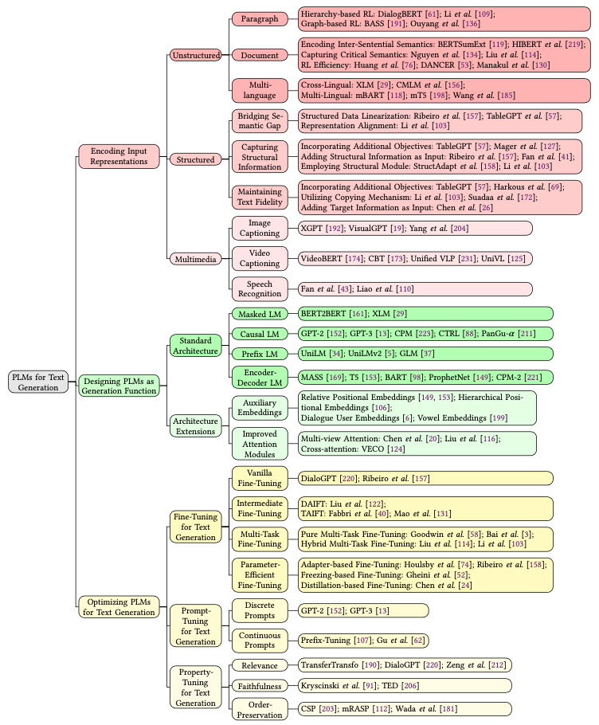
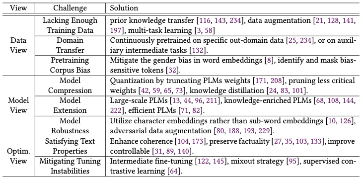
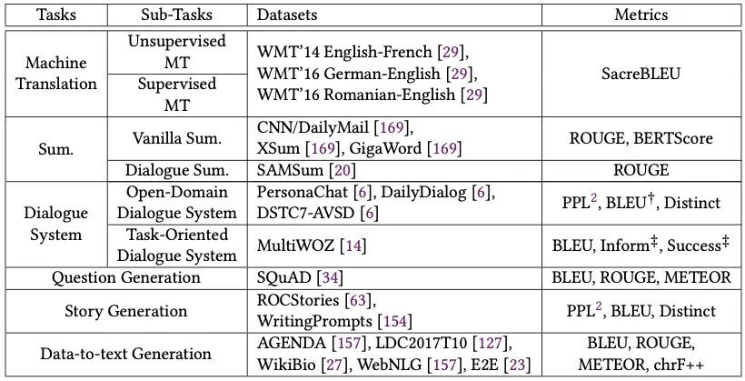

> 本文由 [简悦 SimpRead](http://ksria.com/simpread/) 转码， 原文地址 [mp.weixin.qq.com](https://mp.weixin.qq.com/s/JSlz-FOogp0As2aH3EsdhA)

一篇人大出品的 37 页文本生成综述：

```
A Survey of Pretrained Language Models Based Text Generation
https://arxiv.org/abs/2201.05273


```

虽然综述读起来累些，但多读综述有利于知识体系的梳理。而且 **NLP 领域的综述读多了会发现，很多优化方法都是想通的**，也能提供一些新的思路。

这篇文章从把文本生成的方法分成了三类：输入编码、模型设计、优化方法。同时也从数据、模型、优化层面给出了下面我们就顺着文章的思路，梳理一下最近几年文本生成领域的进展。



如何编码输入  

=========

这部分其实跟 NLU 任务都是一样的，想要做好预测，首先要对输入进行充分理解。本文主要从输入形态进行了划分。

非结构化文本
------

**Paragraph-level**

1.  Hierarchy-based：先对句子进行编码，再用一个编码器进行对句子表示进行聚合
    
2.  Graph-based：相比于上面的序列化层次编码，图学习的方法可以更好地对不相邻的句子进行聚合
    

**Document-level**

1.  同样使用层次化的方法
    
2.  抽取关键信息：层次化方法自下而上，难免引入噪声，而更重要的是抓住整个文档的主题信息，可以用 topic model 或者设置更高级别的目标去做
    
3.  提升效率：当文本过长时，可以使用局部注意力、稀疏注意力去提升效率，编码更长的内容
    

**多语言**

1.  Cross-lingual：跨语言的思想是在整个语料上生成 subword，并用一套 embedding 和 encoder 去编码多种语言，可以参考 XLM
    
2.  Multi-lingual：多语言的思想是多套 embedding 共用一个 encoder，可以参考 mBART、mT5
    

结构化输入
-----

结构化输入在知识图谱的应用场景下很常见，编码器主要面临着三个问题。

**预训练是用非结构化文本，而当前输入的是结构化文本，如何消除这个 Gap？**

1.  预处理：把结构化数据拼成序列输入，比如「胡歌 - 职业 - 演员」变成「胡歌的职业是演员」
    
2.  通过图学习或其他编码器，把输入变成 embedding 在喂给预训练模型，比如清华 ERNIE
    

**上述方法消除了 Gap，但也丧失了结构带来的重要信息，如何保持这些特征呢？**

1.  通过加入新的目标，比如表格化的输入，让模型去预测每个数据的字段名，强迫模型编码进这些信息
    
2.  直接把结构化信息加到输入里，比如上面的三元组例子，可以变成「<\S> 胡歌 </S><\P > 职业 </P><\O > 演员 </O>」
    
3.  利用可以编码结构信息的 encoder，比如图神经网络
    

**一些场景下（比如报表生成），如何保持输出数据与输入的一致性？**

1.  加入额外的训练目标，去检测输入输出的一致性
    
2.  使用 Copy 机制：pointer-generator 是比较经典的方法
    
3.  在输入侧加入更多限制，让模型学习到这些强 pattern
    

多模态输入
-----

多模态输入可玩的就多了，在这方面也有不少的研究，这里的难点主要是通过各种任务，让文本和多模态输入对齐。或者在无监督的情况下，让多模态的表示和文本表示在同一个空间。

如何设计预训练模型
=========

经典结构
----

**Masked Language Model**

MLM 模型和生成任务的预训练目标不一致，所以很少被用在生成任务上，当然也有研究 [1] 把 BERT、RoBERTa、GPT2 三个模型混合起来去做生成，用 BERT 初始化 encoder 和 decoder，效果竟然还不错。

在 MLM 任务的启发下，整个 19 年里生成模型也曾出不穷，变化不同的结构去做类似 MLM 的自监督任务。

**Causal Language Model**

单向语言模型就不用多说了，GPT 系列是经典中的经典，当然还有 CTRL 等条件生成模型也不错。但由于这类模型本身从左到右的限制，在文本摘要、翻译这种需要双向信息的任务上表现欠佳。

**Prefix Language Model**

这类模型十分优雅，兼具双向编码和单向解码，比如 UniLM 系列、GLM。不过研究显示 [](https://arxiv.org/abs/1910.10683 “Exploring the Limits of Transfer Learning with a Unified Text-to-Text Transformer”)，比起经典的 encoder-decoder 结构还是稍稍逊色。

**Encoder-Decoder Language Model**

这类模型各个都比较能打，比如 MASS、ProphNet、BART，不过我用下来还是觉得 T5 比较强。

结构扩展
----

生成式预训练模型的结构基本局限于上述四种，但他们本身还存在一些问题，文中列举了两类，跟 NLU 任务的优化点差不多：

1.  附加 Embedding：位置编码一直都是 Transformer 的一个小弱项，针对这个问题，T5、UniLMv2 都加入了相对位置编码。另外在诗歌生成任务中，还可以升华成层次位置编码 [2]，去指示句子内或者句子间的位置。还可以参考 segment 编码，在对话场景去区分不同说话人，或者多语言场景区分不同语言
    
2.  注意力机制：在 encoder-decoder 结构中，存在着用来连接它们的 cross-attention，这个模块也能进行优化，可以加入图神经网络、门控机制等
    

如何优化生成模型
========

Fine-tuning
-----------

**精调最主要的问题就是监督数据太少了，作者提供了一些通用 trick 迅速帮忙提升效果，对 NLG 和 NLU 都很有用**。

1.  Intermediate Fine-tuning：利用一个中间任务，先对预训练模型进行精调。这个方法又分为两种，第一种是 Domain adaption，先在与目标相同的领域上进行精调，最简单的就是直接 MLM，如果有标注数据更好。但如果任务简单（比如二分类）就要小心了，别太过拟合，可能会降低表示的质量。第二种是 Task adaption，在与目标相同的任务上进行精调，这个方法我一直用，在文本匹配上百发百中
    
2.  Multi-task Fine-tuning：也是 GLUE 刷榜的场景技巧，防止过拟合十分有效，任务目标可以和最终的相同也可以不同，也可以当做一个 intermediate 任务，不过效果不是一直都好，需要耐心调教
    
3.  Parameter-Efficient Fine-tuning：在当今的大模型时代下，别说预训练了，可能精调都调不起。尤其是生成任务需要更强的预训练模型。所以作者就提供了这种优化思路，第一种是在结构里增加一些 adapter，比如在 Transformer 里增加一个 FFN，映射到很低的维度再映射回去，精调时只更新 adapter 的参数。第二种是 freeze 掉部分子网络，比如有研究发现 cross-attention 很重要，那就只更新这部分参数。第三种是蒸馏。
    

Prompt-tuning
-------------

Prompt 是今年最热的 NLP 方向了，最初是 GPT2 发起的，在输入中加入对任务的描述，比如「把下面的句子翻译成英文：XX」，这样一个生成模型就可以同时做过个任务。不过最初这种形式很依赖人工设计的 prompt，所以之后的研究者也提出了 AutoPrompt 等自动发现模版的方法。

再演变到后来就是参数化的 Continuous Prompt，利用这些模版初始化一些 token，然后直接精调这些 token 的 embedding。参数化模版的优点是：

1.  解除了手工自然语言模版的限制
    
2.  让模版变得可以调节优化，不受预训练模型 embedding 的限制
    

这类研究可以参考 Prompt-tuning、P-tuning 等。

Property-Tuning
---------------

文本生成由于其任务的天性，使得文本可控变得十分重要。Property-tuning 的目的就是限制生成结果的一些性质：

1.  Relevance：一方面可以通过增加其他目标函数去提升相关性，另一方法也可以从训练入手，比如有的方法会通过 TF-IDF 选择 mask 哪些词，强迫模型生成更相关的结果
    
2.  Faithfulness：在文本摘要任务中比较重要，避免生成结果与输入相差太大，可以加入主题模型等 loss 进行约束
    
3.  Order：在翻译、复述中比较重要，可以设计特殊的任务，让模型学习如何对齐输入与输出
    

其他挑战
====

除了上述的优化方法外，作者还从数据、模型、优化三个层面列出了文本生成的一些其他挑战，解决方案很多上面都提到了：



评价指标  

=======

1.  N-Gram Overlap：BLEU、ROUGE、METEOR、ChrF++
    
2.  Divesity：Distinct
    
3.  Semantic Similarity：BERTScore
    



总结
==

本文主要分享了预训练时代下的文本生成方法，当然还有一些方向没有涉及，比如跟 decoder 更相关的解码策略、非自回归生成等。整体读下来体系还是挺清晰的，也推荐同学们没事儿多读读综述，即使是已经熟悉的领域，也还可能有一些模型、方法不太熟悉，知识体系完善后对平时的思路会有很多帮助。

### 参考资料

[1]Leveraging Pre-trained Checkpoints for Sequence Generation Tasks: _https://aclanthology.org/2020.tacl-1.18.pdf_

[2]Rigid Formats Controlled Text Generation: _https://aclanthology.org/2020.acl-main.68.pdf_