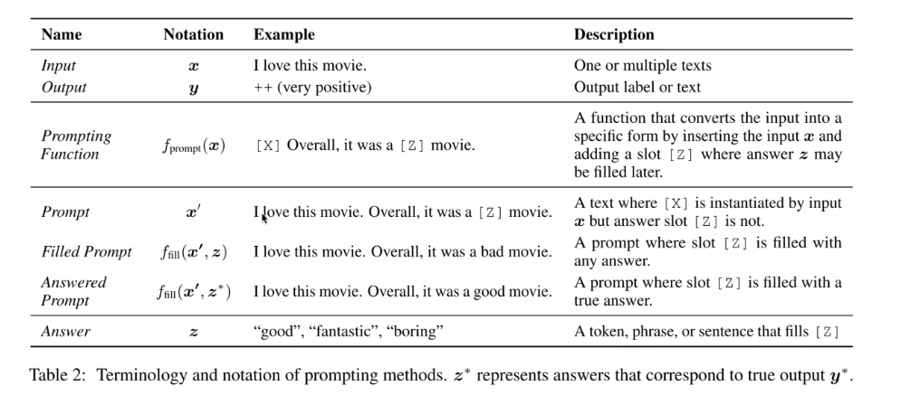
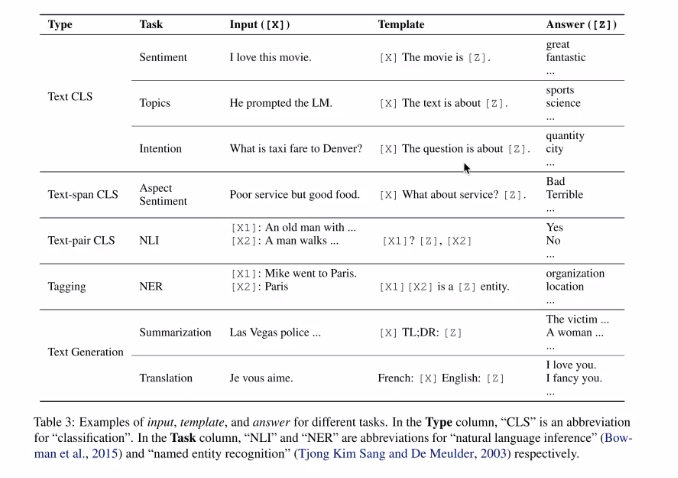
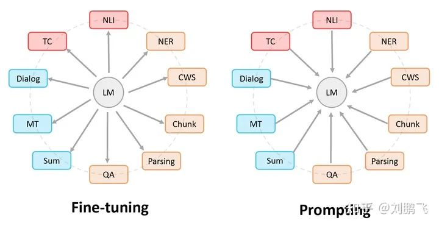
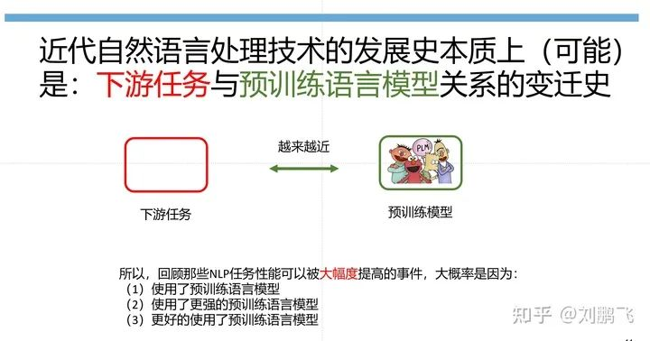

# Prompt

## NLP发展的四个范式是什么？

我们将近代NLP技术的发展总结为四种范式，分别为：

- P1. 非神经网络时代的完全监督学习 （Fully Supervised Learning, Non-Neural Network）

- P2. 基于神经网络的完全监督学习 (Fully Supervised Learning, Neural Network)

- P3. 预训练，精调范式 (Pre-train, Fine-tune)

- P4. 预训练，提示，预测范式（Pre-train, Prompt, Predict）

在这种不同范式变迁过程中，有些东西是不变的，把它们挖掘出来就很有意思，比如：

#### 规律1：每个范式都会涉及繁琐的，需要人来参与（提供先验）的工程（engineering）

*   **P1 非神经网络时代的完全监督学习「特征工程（Feature Engineering）：** 」 我们要进行“无聊“的特征模板定义环节

*   **P2 基于神经网络的完全监督学习「结构工程 （Architecture Engineering）：** 」 神经网络虽然解放手动配置特征模板所需要的人力，但是是以需要人工去设计合适网络结构为代价的。因此，在这样的研究范式下，研究人员花了很多时间在探究最适配下游任务的结构偏置（Structural Bias）。比如是使用“卷积循环变形金刚（Transformer）网络“，还是使用”卷积变形金刚（Transformer）循环网络“。

*   **P3 预训练，精调范式「目标函数挖掘 （Objective Engineering）：** 」 这个过程研究者往往是通过引入额外的目标函数到预训练语言模型上，以便让其更适配下游任务。这个过程有时候也需要些网络结构的挖掘，但相比较而言，不是这个范式的主旋律，一个实际的原因在于：（1）预训练过程本身费时，过度的结构偏置（structural bias）探索开销过大；（2）精调的过程中，很多时候 预训练语言模型本身提供的知识已经可以让大家“忘记”使用卷积神经网络和循环神经网络的差异。

*   **P4 预训练，提示，预测范式「Prompt挖掘工程：** 」 在这个过程我们往往不对预训练语言模型改动太多，我们希望是通过对合适prompt的利用将下游任务建模的方式重新定义。

> **「规律1的应用：」** 因为有规律1的存在，我们可以更加辩证的看待新的范式，这句话的价值体现在两个场景：（1） 当我们使用新范式的方法的时候，能够意识到它带来的优异性能是以某种“人力”牺牲（需要一些人工设计加持）为代价的，而如何让这种人力代价将到最低，往往就是新范式里需要解决的核心问题。（2） **「当我们某个瞬间突然有些“神奇”的想法，它与现在的主流解决思路很不相同，可是实现它又需要一些很琐碎的操作，那么这个时候，恭喜你，因为你很有可能在接近一个新的范式（或者新的解决框架），假如存在上帝视角的话，可能那个“神”在看着你，期待着你坚持下去，因为你将会给这个领域的发展带来与众不同和进步。」** 当然，从有想法到真正把它实现出来会成为另一个关键点，而决定能否做成的因素中，比较重要的可能是：信心，坚持，对领域的理解，以及实现能力。

#### 规律2：新范式带来的收益可以让我们暂时“忽略”那些额外需要的人力代价

不过这里值得注意的是，关于“收益”的定义并不唯一，它不只是被定义为某个任务性能的提升，还可以是“帮我们做一些过去框架不能做的事情”，或者是新的研究场景。

比如，无论是神经网络早期在NLP的应用，或者是Seq2Seq 早期在翻译上的应用，都没有在性能上讨得便宜（相比于传统统计方法），可是这种颠覆性的想法给了我们太多可以想象的空间（比如既然翻译可以用Seq2Seq，那么其他任务是不是也可以这样呢？那么NLP任务解决框架就可以被统一了吗？）

**「当我们回顾P(N) 逐渐 取代 P(N-1)的过程 （这里P是指上面定义的范式）我们突然理解」** ：

*   P1->P2: 虽然我们常常吐槽神经网络调参如炼丹，可是也在享受着不用手工配置模板，就能够得到还不错甚至更好结果的福利。与其说“炼丹“，**「我觉得神经网络的训练更像是“陶艺”，而传统的特征工程更像是“炼丹”，因为它对原材料（特征）的选择以及加入丹炉的顺序（特征组合）的要求几乎非常苛刻」** 。

（大家可以感受下，炼丹和陶艺的过程：
*   [https://zhidao.baidu.com/question/936545101298430372.html](https://zhidao.baidu.com/question/936545101298430372.html)

*   [https://zhidao.baidu.com/question/458169192374974725.html）](https://zhidao.baidu.com/question/458169192374974725.html）)

*   P2->P3: 虽然探究“哪一种损失函数引入到预训练语言模型中更适配下游任务”比较无聊，但比起排列组合各种网络结构，却不一定能获得好性能而言，前者似乎还行。

*   P3->P4: 虽然prompt的定义很繁琐，但是如果有个方法可以帮你回答“BERT效果都那么好了 ，我还研究个啥“这个问题，那它也挺有吸引力。并且，Prompt Learning激活了很多新的研究场景，比如小样本学习，这显然可以成为那些GPU资源受限研究者的福音。当然，**「我理解Prompt Learning最重要的一个作用在于给我们prompt（提示）了NLP发展可能的核心动力是什么。这个大家如果感兴趣，可以关注后续更新。」** 

> **「规律2的应用：」** > 可以帮助我们区分“伪范式“与”真范式“。如果新的建模体系实现的代价过于复杂，或者是收益甚微，那么他可能不是比较有前景的范式了。

## Prompt Learning到底是什么

Prompt Learning是指对输入文本信息按照特定模板进行处理，把任务重构成一个更能充分利用预训练语言模型处理的形式。

比如，假如我要判断“我喜欢这个电影" 这句话的情感（“正面" 或者 "负面"），原有的任务形式是把他看成一个分类问题

- 输入：我喜欢这个电影

- 输出：“正面" 或者 "负面"

而如果用Prompt Learning去解决的话，任务可以变成“完形填空"，

- 输入：我喜欢这个电影，整体上来看，这是一个 __ 的电影

- 输出：“有趣的" 或者 "无聊的"

着色输入就是将输入文本按照特定模板进行处理，而这样做的目的是为了更适配预训练语言模型的形式。例如，BERT的预训练就是采用这种类似完型填空的形式。（所以Prompt Leaning的应用还需要对各种预训练语言模型本身特点有深刻的理解，这个我们在论文里（第三小节 ）给了非常详细的描述，告诉大家不同预训练语言模型适配什么样的Prompting场景）

Prompt的做法，从任务形式来说可以分为两种：

1. 续写Prefix：用在GPT2-3那种单向LM预训练模型上，输入「好好学习，翻译成英文：」，输出「good good study」

2. 完形填空：用在BERT那种MLM式预训练模型上，比如情感分类任务可以输入「这个饼不错，太X了」，输出「棒」

#### （1）Prompt Learning所涉及的技术似乎过去不少工作都有涉及？

> 没错，不管是对输入的模板化处理，还是任务重构的操作，这都不是什么新鲜的事情。我们在论文的第9小节有很详细比较与Prompt Learning相关的一些（八个）“老“的研究话题，比如”Query Reformulation“，比如 “QA-based Task Reformulation”。

#### （2）既然过去的工作都有涉及，为什么现在的Prompt Learning是一个新范式？

> 其实如果我们看上面对Prompt Learning的表述，这里面隐含了个不容易被发现的假设，即> **「“预训练语言模型的知识真的很丰富，为了更好的利用它，我们愿意不惜以重构任务为代价（因为对任务重构本身涉及很多选择决策，需要人来参与）。」** > 这说明，Prompt Learning 的范式里 “任务重构”目的非常明确，即更好的利用预训练语言模型。而这一点，就可以和过去“Query reformulation/QA-based Task reformulation“工作区分开。原因很简单，因为，那个时候的NLP技术还不存在一个这么强大的预训练语言模型让我们为了”迎合“它而去把任务进行重构。

#### （3）Prompt Learning蕴含的假设（“预训练语言模型的知识真的很丰富，为了更好的利用它，我们愿意不惜以重构任务为代价）成立吗？

> 它不一定成立，尤其是在预训练语言模型比较弱的时候，比如，早期的一些上下文无关的词向量模型，为它而重构任务可能是一件得不偿失的事情（这同时也回答了上面一个问题，为什么Prompt Learning会在这时候入场）。而从BERT以来，这种上下文相关的预训练模型，他们不仅包含了丰富知识，另一个重要的点在于他们本身已经是个完整的小个体（比如，有输入层，特征提取层，输出层），这意味着在我们给不同下游任务设计模型的时候，拥有了这样一种可能性：不用设计新的网络层，而是完全利用预训练语言模型的网络结构。而为了达到这个目的需要做出一些改变，而这个改变就是利用prompt重构任务的输入。

## 发生在第三个阶段的的语言模型Fine-tuning范式和第四个范式的Prompting范式有什么关系？

图中，圆形表示预训练语言模型，矩形框表示的是各种下游NLP任务。那么，**「我们就有这样一句话：大家都是希望让 预训练语言模型和下游任务靠的更近，只是实现的方式不一样」** ，

> **「Fine-tuning中：是预训练语言模型“迁就“各种下游任务。」**  具体体现就是上面提到的通过引入各种辅助任务loss，将其添加到预训练模型中，然后继续pre-training，以便让其更加适配下游任务。总之，这个过程中，预训练语言模型做出了更多的牺牲。> **「Prompting中，是各种下游任务“迁就“预训练语言模型。」**  具体体现也是上面介绍的，我们需要对不同任务进行重构，使得它达到适配预训练语言模型的效果。总之，这个过程中，是下游任务做出了更多的牺牲。

**「诚然，一个更加和谐的状态应该是大家“互相让步“，相信读到这，大家心中应该有些不错的ideas了。」** 

Prompting 本身不是目的，它是一种实现让下游任务和预训练语言模型更加接近的途径，如果我们有其它更好的方式，那就可以引领下一个范式。

Zero/Few shot下效果很好

相比于大模型的finetune，prompt需要tune的代价小（只需要tune embedding层）

## Instruction Tuning

1. 带女朋友去了一家餐厅，她吃的很开心，这家餐厅太__了！

2. 判断这句话的情感：带女朋友去了一家餐厅，她吃的很开心。选项：A=好，B=一般，C=差

**Prompt就是第一种模式，Instruction就是第二种。**

Prompt tuning:针对每个任务，单独生成prompt模板（hard prompt or soft prompt），然后在每个任务上进行full-shot微调与评估，其中预训练模型参数是freeze的。

Instruction Tuning：针对每个任务，单独生成instruction（hard token），通过在若干个full-shot任务上进行微调，然后在具体的任务上进行评估泛化能力（zero shot)，其中预训练模型参数是unfreeze的。Instruction Tuning和Prompt方法的核心一样，就是去发掘语言模型本身具备的知识。而他们的不同点就在于，Prompt是去激发语言模型的补全能力，比如给出上半句生成下半句、或者做完形填空，都还是像在做language model任务，而Instruction Tuning则是激发语言模型的理解能力，通过给出更明显的指令，让模型去理解并做出正确的反馈。

[FLAN](../Alignment/FLAN/FLAN.md)

[T0](../T0/T0.md)

[InstructGPT](../LLMs/InstructGPT/InstructGPT.md)

[SuperNaturalInstructions](../Benchmark/NaturalInstructions/SuperNaturalInstructions.md)

目前Instruction Tuning比较一致的实验结论是随着训练任务的数量、instruction数量和模型规模增大，泛化效果越好.

## 参考资料

[近代自然语言处理技术发展的“第四范式”](https://zhuanlan.zhihu.com/p/395115779)(刘鹏飞）

**http://pretrain.nlpedia.ai/** 

[2021年，Pre-train+finetune还是“新”范式吗？乘风破浪的Prompt-base methods](https://zhuanlan.zhihu.com/p/391606045)

[Prompt-based Language Models：模版增强语言模型小结](https://zhuanlan.zhihu.com/p/366771566)

[NLP新宠——浅谈Prompt的前世今生](https://zhuanlan.zhihu.com/p/399295895)

prefix-tuning：[https://zhuanlan.zhihu.com/p/386073664](https://zhuanlan.zhihu.com/p/386073664)

[https://spaces.ac.cn/archives/8295](https://spaces.ac.cn/archives/8295)

[打开模型Zero-Shot新范式：Instruction Tuning](https://mp.weixin.qq.com/s/1qsaT0AVlNjhQJR8z8PAGA)

prompt工程指南： https://github.com/promptslab/Awesome-Prompt-Engineering

[比OpenAI官方提示词指南更全，这26条黄金准则让LLM性能飙升50%以上](https://mp.weixin.qq.com/s/F746iulLAt04mwveXTgncw)

[GitHub - verazuo/jailbreak\_llms: [CCS'24] A dataset consists of 15,140 ChatGPT prompts from Reddit, Discord, websites, and open-source datasets (including 1,405 jailbreak prompts).](https://github.com/verazuo/jailbreak_llms)

[GPT-4 提示词冠军如何写 prompt：CO-STAR 框架、文本分段、系统提示](https://mp.weixin.qq.com/s/GiQ1iIavCfLLTso6jhppvw)

