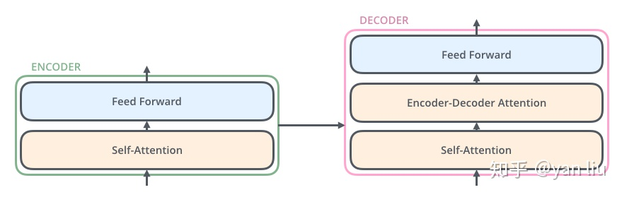

摘要：

- Transformer由且仅由self-Attenion和Feed Forward Neural Network组成。
- Encoder：6层，每一层有2个sublayer：多头自注意力机制和position-wise FCFN。LayerNorm(x + Sublayer(x))。所有sublayer和embedding layer是输出维度都是512
- Decoder：6层，每一层有3个sublayer，比encoder多了个基于encoder层输出的多头注意力层+LN。且decoder的self-attention做了mask，防止attend to序列后面的位置。

Transformer模型来自论文[Attention Is All You Need](https://arxiv.org/abs/1706.03762)。这个模型最初是为了提高机器翻译的效率，它的Self-Attention机制和Position Encoding可以替代RNN。

## 模型概览

作者采用Attention机制的原因是考虑到RNN（或者LSTM，GRU等）的计算限制为是顺序的，也就是说RNN相关算法只能从左向右依次计算或者从右向左依次计算，这种机制带来了两个问题：

1. **时间片t 的计算依赖t-1时刻的计算结果，这样限制了模型的并行能力；**
2. **顺序计算的过程中信息会丢失，尽管LSTM等门机制的结构一定程度上缓解了长期依赖的问题，但是对于特别长期的依赖现象,LSTM依旧无能为力。**

[Transformer](https://arxiv.org/abs/1706.03762) 是一个完全基于注意力机制（Attention mechanism）的模块，对比 RNN（Recurrent Neural Network），当输入的句子是长句子时，RNN 可能会遗忘之前句子中出现的字词，而 Transformer 的注意力机制使得句子中重要的字词的权重增大，从而保证不会被遗忘（将序列中的任意两个位置之间的距离缩小为一个常量）。并且 Transformer 另一个巨大的优势在于，它可以使用并行的方法运行计算，从而加快了速度。

Transformer 的具体结构如下图：


来自：https://doc.shiyanlou.com/courses/uid214893-20190806-1565074908805

对于机器翻译来说，它的输入是源语言(法语)的句子，输出是目标语言(英语)的句子。

**Transformer(或者任何的NMT系统)都可以分成Encoder和Decoder两个部分。**

再展开一点，Encoder由很多(6个)结构一样的Encoder堆叠(stack)而成，Decoder也是一样。

每一个Encoder的输入是下一层Encoder输出，最底层Encoder的输入是原始的输入(法语句子)；Decoder也是类似，但是最后一层Encoder的输出会输入给每一个Decoder层，这是Attention机制的要求。


每一层的Encoder都是相同的结构，它由一个Self-Attention层和一个前馈网络(全连接网络)组成。在 Encoder 中：

1. Input 经过 embedding 后，要做 positional encodings，
2. 然后是 Multi-head attention，
3. 再经过 position-wise Feed Forward，
4. 每个子层之间有残差连接。

每一层的Decoder也是相同的结构，它除了Self-Attention层和全连接层之外还多了一个普通的Attention层，这个Attention层使得Decoder在解码时会考虑最后一层Encoder所有时刻的输出。在 Decoder 中，

1. 如上图所示，也有 positional encodings，Multi-head attention 和 FFN，子层之间也要做残差连接，
2. 但比 encoder 多了一个 Masked Multi-head attention，
3. 最后要经过 Linear 和 softmax 输出概率。

## 结构分析

**输入的句子是一个词(ID)的序列，我们首先通过Embedding（Word2Vec等词嵌入方法）把它变成一个连续稠密的向量。**论文中使用的词嵌入的维度为512.

Embedding之后的序列会输入Encoder。在最底层的block中，x将直接作为Transformer的输入，而在其他层中，输入则是上一个block的输出。

- 首先经过Self-Attention层得到一个加权之后的特征向量Z
- 然后再经过全连接层Feed Forward Neural Network。**这个全连接有两层，第一层的激活函数是ReLU，第二层是一个线性激活函数**，可以表示为：


上图表示计算z1, z2, ...需要用到所有的x1, x2, ...，而计算r1只需要用到z1。

Decoder的结构如图所示，它和encoder的不同之处在于Decoder多了一个Encoder-Decoder Attention，两个Attention分别用于计算输入和输出的权值：

1. Self-Attention：**当前翻译和已经翻译的前文之间的关系**；
2. Encoder-Decoder Attention：**当前翻译和编码的特征向量之间的关系**。




## Self-Attention

Self-Attention用Encoder在编码一个词的时候会考虑句子中所有其它的词，从而确定怎么编码当前词。

**对于输入的每一个向量(第一层是词的Embedding，其它层是前一层的输出)，我们首先需要生成3个新的向量Q、K和V，分别代表查询(Query)向量、Key向量和Value向量，长度均为64。输入向量组成的矩阵乘以不同的矩阵变换就得到Q、K、V。三个矩阵的维度都是512x64.**

self-attention详见[Attention](../Attention/Attention.md)

注意力头的维度是默认64.

注意每个Self-Attention层都会加一个残差连接（目的是解决深度学习中的退化问题），然后是一个LayerNorm层。

## Multi-Head Attention

前面定义的一组Q、K和V可以让一个词attend to相关的词，我们可以定义多组Q、K和V，它们分别可以关注不同的上下文。多层叠加的 Self-Attention 组成了 Multi-Head Attention。

3个地方用了multi-head attention

- encoder-decoder attention层，query来自前一个deocder层，key和value来自encoder的输出
- encoder的self-attenion层
- decoder的self-attention层

## Decoder

Decoder和Encoder是类似的，区别在于它多了一个Encoder-Decoder Attention层。

Decoder的输入分为两类：一种是训练时的输入，一种是预测时的输入。

训练时的输入就是已经准备好对应的target数据。例如翻译任务，Encoder输入"Tom chase Jerry"，Decoder输入"汤姆追逐杰瑞"。

预测时的输入，一开始输入的是起始符，然后每次输入是上一时刻Transformer的输出。例如，输入""，输出"汤姆"，输入"汤姆"，输出"汤姆追逐"，输入"汤姆追逐"，输出"汤姆追逐杰瑞"，输入"汤姆追逐杰瑞"，输出"汤姆追逐杰瑞"结束。

与Encoder的Multi-Head Attention计算原理一样，只是多加了一个mask码。mask 表示掩码，它对某些值进行掩盖，使其在参数更新时不产生效果。**Transformer 模型里面涉及两种 mask，分别是 padding mask 和 sequence mask。**为什么需要添加这两种mask码呢？

1.padding mask

什么是 padding mask 呢？因为每个批次输入序列长度是不一样的。也就是说，我们要对输入序列进行对齐。具体来说，就是给在较短的序列后面填充 0。但是如果输入的序列太长，则是截取左边的内容，把多余的直接舍弃。因为这些填充的位置，其实是没什么意义的，所以我们的attention机制不应该把注意力放在这些位置上，所以我们需要进行一些处理。

具体的做法是，把这些位置的值加上一个非常大的负数(负无穷)，这样的话，经过 softmax，这些位置的概率就会接近0！

2.sequence mask

sequence mask 是为了使得 decoder 不能看见未来的信息。对于一个序列，在 time_step 为 t 的时刻，我们的解码输出应该只能依赖于 t 时刻之前的输出，而不能依赖 t 之后的输出。因此我们需要想一个办法，把 t 之后的信息给隐藏起来。**这在训练的时候有效，因为训练的时候每次我们是将target数据完整输入进decoder中地，预测时不需要，预测的时候我们只能得到前一时刻预测出的输出。**

那么具体怎么做呢？也很简单：产生一个上三角矩阵，上三角的值全为0。把这个矩阵作用在每一个序列上，就可以达到我们的目的。

在Encoder中的Multi-Head Attention也是需要进行mask地，只不过Encoder中只需要padding mask即可，而Decoder中需要padding mask和sequence mask。

Add＆Normalize也与Encoder中一样，接下来就到了Decoder中第二个Multi-Head Attention，这个Multi-Head Attention又与Encoder中有一点点不一样。

**基于Encoder-Decoder 的Multi-Head Attention**

Encoder中的Multi-Head Attention是基于Self-Attention地，Decoder中的第二个Multi-Head Attention就只是基于Attention，**它的输入Query来自于Masked Multi-Head Attention的输出，Keys和Values来自于Encoder中最后一层的输出**。

**为啥Decoder中要搞两个Multi-Head Attention呢？**

我个人理解是第一个Masked Multi-Head Attention是为了得到之前已经预测输出的信息，相当于记录当前时刻的输入之间的信息的意思。第二个Multi-Head Attention是为了通过当前输入的信息得到下一时刻的信息，也就是输出的信息，是为了表示当前的输入与经过encoder提取过的特征向量之间的关系来预测输出。

经过了第二个Multi-Head Attention之后的Feed Forward Network与Encoder中一样，然后就是输出进入下一个decoder，如此经过6层decoder之后到达最后的输出层。


由于在机器翻译中，解码过程是一个顺序操作的过程，也就是当解码第k个特征向量时，我们只能看到第k-1及其之前的解码结果，论文中把这种情况下的multi-head attention叫做masked multi-head attention。

## 损失层

解码器解码之后，解码的特征向量经过一层激活函数为softmax的全连接层之后得到反映每个单词概率的输出向量。此时我们便可以通过CTC等损失函数训练模型了。


## 位置编码(Positional Encoding)

注意：这是Transformer原始论文使用的位置编码方法，而在BERT模型里，使用的是简单的可以学习的Embedding，和Word Embedding一样，只不过输入是位置而不是词而已。

我们的目的是用Self-Attention替代RNN，RNN能够记住过去的信息，这可以通过Self-Attention“实时”的注意相关的任何词来实现等价(甚至更好)的效果。RNN还有一个特定就是能考虑词的顺序(位置)关系，一个句子即使词完全是相同的但是语义可能完全不同，比如”北京到上海的机票”与”上海到北京的机票”

为了解决这个问题，我们需要引入位置编码，也就是t时刻的输入，除了Embedding之外(这是与位置无关的)，我们还引入一个向量，这个向量是与t有关的，我们把**Embedding和位置编码向量加起来作为模型的输入**。

位置编码有很多方法，其中需要考虑的一个重要因素就是**需要它编码的是相对位置的关系**。比如两个句子：”北京到上海的机票”和”你好，我们要一张北京到上海的机票”。显然加入位置编码之后，两个北京的向量是不同的了，两个上海的向量也是不同的了，但是我们期望Query(北京1)\*Key(上海1)却是等于Query(北京2)\*Key(上海2)的。


 


## LayerNorm

在神经网络进行训练之前，都需要对于输入数据进行Normalize归一化，目的有二：1，能够加快训练的速度。2.提高训练的稳定性。

Batch Normalization，这个技巧能够让模型收敛的更快。但是Batch Normalization有一个问题——**它需要一个minibatch的数据，而且这个minibatch不能太小(比如1)**。另外一个问题就是**它不能用于RNN，因为同样一个节点在不同时刻的分布是明显不同的**。当然有一些改进的方法使得可以对RNN进行Batch Normalization，比如论文[Recurrent Batch Normalization](https://arxiv.org/abs/1603.09025)

Transformer里使用了另外一种Normalization技巧，叫做Layer Normalization。

假设我们的输入是一个minibatch的数据，我们再假设每一个数据都是一个向量，则输入是一个矩阵，每一行是一个训练数据，每一列都是一个特征。**BatchNorm是对每个特征进行Normalization，而LayerNorm是对每个样本的不同特征进行Normalization，因此LayerNorm的输入可以是一行(一个样本)。**

BN是对于相同的维度进行归一化，但是咱们NLP中输入的都是词向量，一个300维的词向量，单独去分析它的每一维是没有意义地，在每一维上进行归一化也是适合地，因此这里选用的是LN。


因为LayerNorm的每个样本都是独立计算的，因此minibatch可以很小甚至可以是1。实验证明LayerNorm不仅在普通的神经网络中有效，而且对于RNN也非常有效。

BatchNorm看起来比较直观，我们在数据预处理也经常会把输入Normalize成均值为0，方差为1的数据，只不过它引入了可以学习的参数使得模型可以更加需要重新缓慢(不能剧烈)的调整均值和方差。而LayerNorm似乎有效奇怪，比如第一个特征是年龄，第二个特征是身高，把一个人的这两个特征求均值和方差似乎没有什么意义。论文里有一些讨论，都比较抽象。当然把身高和年龄平均并没有什么意义，但是对于其它层的特征，我们通过平均”期望”它们的取值范围大体一致，也可能使得神经网络调整参数更加容易，如果这两个特征实在有很大的差异，模型也可以学习出合适的参数让它来把取值范围缩放到更合适的区间。

**为什么不用BN而用LN？**

因为在这里我们数据规范化的对象的维度一般都是（batch_size, seq_lenth, 512）,如果是BN，归一化的对象是整个一批数据（可以理解为是对batch_size这一维度）进行归一化，因为每一条数据里都可能会有padding补充的0元素，导致一个BN下来，整个数据的均值会降低，数据分布也就改变了。如果是LN。它是针对于每一条数据的（可以看作是seq_lenth这一维度），一行行的归一化不会包含padding进来的0，这样数据的分布也就能不被改变。

而为什么在图像处理中，可以用BN，因为图像的每一个像素点都有值，没有padding 0带来的问题。所以可以用BN。

## 残差连接

每个Self-Attention层都会加一个残差连接，然后是一个LayerNorm层。


下图展示了更多细节：输入x1,x2经self-attention层之后变成z1,z2，然后和残差连接的输入x1,x2加起来，然后经过LayerNorm层输出给全连接层。全连接层也是有一个残差连接和一个LayerNorm层，最后再输出给上一层。


加入残差块X的目的是为了防止在深度神经网络训练中发生退化问题，**退化的意思就是深度神经网络通过增加网络的层数，Loss逐渐减小，然后趋于稳定达到饱和，然后再继续增加网络层数，Loss反而增大。**

**为什么深度神经网络会发生退化？**

举个例子：假如某个神经网络的最优网络层数是18层，但是我们在设计的时候并不知道到底多少层是最优解，本着层数越深越好的理念，我们设计了32层，那么32层神经网络中有14层其实是多余地，我们要想达到18层神经网络的最优效果，必须保证这多出来的14层网络必须进行恒等映射，恒等映射的意思就是说，输入什么，输出就是什么，可以理解成F(x)=x这样的函数，因为只有进行了这样的恒等映射咱们才能保证这多出来的14层神经网络不会影响我们最优的效果。

但现实是神经网络的参数都是训练出来地，要想保证训练出来地参数能够很精确的完成F(x)=x的恒等映射其实是很困难地。多余的层数较少还好，对效果不会有很大影响，但多余的层数一多，可能结果就不是很理想了。这个时候大神们就提出了ResNet 残差神经网络来解决神经网络退化的问题。

**残差块是什么？**


上图就是构造的一个残差块，可以看到X是这一层残差块的输入，也称作F(X)为残差，X为输入值，F(X)是经过第一层线性变化并激活后的输出，该图表示在残差网络中，第二层进行线性变化之后激活之前，F(X)加入了这一层输入值X，然后再进行激活后输出。在第二层输出值激活前加入X，这条路径称作shortcut连接。

**为什么添加了残差块能防止神经网络退化问题呢？**

咱们再来看看添加了残差块后，咱们之前说的要完成恒等映射的函数变成什么样子了。是不是就变成h(X)=F(X)+X，我们要让h(X)=X，那么是不是相当于只需要让F(X)=0就可以了，这里就巧妙了！神经网络通过训练变成0是比变成X容易很多地，因为大家都知道咱们一般初始化神经网络的参数的时候就是设置的[0,1]之间的随机数嘛。所以经过网络变换后很容易接近于0。举个例子：


假设该网络只经过线性变换，没有bias也没有激活函数。我们发现因为随机初始化权重一般偏向于0，那么经过该网络的输出值为[0.6 0.6]，很明显会更接近与[0 0]，而不是[2 1]，相比与学习h(x)=x，模型要更快到学习F(x)=0。

并且ReLU能够将负数激活为0，过滤了负数的线性变化，也能够更快的使得F(x)=0。这样当网络自己决定哪些网络层为冗余层时，使用ResNet的网络很大程度上解决了学习恒等映射的问题，用学习残差F(x)=0更新该冗余层的参数来代替学习h(x)=x更新冗余层的参数。

这样当网络自行决定了哪些层为冗余层后，通过学习残差F(x)=0来让该层网络恒等映射上一层的输入，使得有了这些冗余层的网络效果与没有这些冗余层的网络效果相同，这样很大程度上解决了网络的退化问题。

## 优缺点

**优点**：（1）虽然Transformer最终也没有逃脱传统学习的套路，Transformer也只是一个全连接（或者是一维卷积）加Attention的结合体。但是其设计已经足够有创新，因为其抛弃了在NLP中最根本的RNN或者CNN并且取得了非常不错的效果，算法的设计非常精彩，值得每个深度学习的相关人员仔细研究和品位。（2）Transformer的设计最大的带来性能提升的关键是将任意两个单词的距离是1，这对解决NLP中棘手的长期依赖问题是非常有效的。（3）Transformer不仅仅可以应用在NLP的机器翻译领域，甚至可以不局限于NLP领域，是非常有科研潜力的一个方向。（4）算法的并行性非常好，符合目前的硬件（主要指GPU）环境。

**缺点**：（1）粗暴的抛弃RNN和CNN虽然非常炫技，但是它也使模型丧失了捕捉局部特征的能力，RNN + CNN + Transformer的结合可能会带来更好的效果。（2）Transformer失去的位置信息其实在NLP中非常重要，而论文中在特征向量中加入Position Embedding也只是一个权宜之计，并没有改变Transformer结构上的固有缺陷。 #td 

## 代码

```python
class EncoderDecoder(nn.Module):
	"""
	标准的Encoder-Decoder架构。这是很多模型的基础
	"""
	def __init__(self, encoder, decoder, src_embed, tgt_embed, generator):
        #初始化函数中有5个参数，分别是编码器对象，解码器对象,源数据嵌入函数，目标数据嵌入函数，以及输出部分的类别生成器对象.
		super(EncoderDecoder, self).__init__()
		# encoder和decoder都是构造的时候传入的，这样会非常灵活
		self.encoder = encoder
		self.decoder = decoder
		# 源语言和目标语言的embedding
		self.src_embed = src_embed  # input embedding module(input embedding + positional encode)
		self.tgt_embed = tgt_embed  # ouput embedding module
		# generator后面会讲到，就是根据Decoder的隐状态输出当前时刻的词
		# 基本的实现就是隐状态输入一个全连接层，全连接层的输出大小是词的个数
		# 然后接一个softmax变成概率。
		self.generator = generator  # output generation module
	
	def forward(self, src, tgt, src_mask, tgt_mask):
		# 首先调用encode方法对输入进行编码，然后调用decode方法解码
        "Take in and process masked src and target sequences."
        #在forward函数中，有四个参数，source代表源数据，target代表目标数据,source_mask和target_mask代表对应的掩码张量,在函数中，将source source_mask传入编码函数，得到结果后与source_mask target 和target_mask一同传给解码函数
		return self.decode(self.encode(src, src_mask), src_mask, tgt, tgt_mask)
	
	def encode(self, src, src_mask):
		# 调用encoder来进行编码，传入的参数embedding的src和src_mask
        #编码函数，以source和source_mask为参数,使用src_embed对source做处理，然后和source_mask一起传给self.encoder
		return self.encoder(self.src_embed(src), src_mask)
	
	def decode(self, memory, src_mask, tgt, tgt_mask):
		# 调用decoder
        #解码函数，以memory即编码器的输出，source_mask target target_mask为参数,使用tgt_embed对target做处理，然后和source_mask,target_mask,memory一起传给self.decoder
		return self.decoder(self.tgt_embed(tgt), memory, src_mask, tgt_mask)
    
    
#将线性层和softmax计算层一起实现，因为二者的共同目标是生成最后的结构
#因此把类的名字叫做Generator，生成器类
class Generator(nn.Module):
	# 根据Decoder的隐状态输出一个词
	# d_model是Decoder输出的大小，vocab是词典大小
	def __init__(self, d_model, vocab):
		super(Generator, self).__init__()
        #首先就是使用nn中的预定义线性层进行实例化，得到一个对象self.proj等待使用
        #这个线性层的参数有两个，就是初始化函数传进来的两个参数：d_model，vocab_size
		self.proj = nn.Linear(d_model, vocab)
	
	# 全连接再加上一个softmax
	def forward(self, x):
        #前向逻辑函数中输入是上一层的输出张量x,在函数中，首先使用上一步得到的self.proj对x进行线性变化,然后使用F中已经实现的log_softmax进行softmax处理。
		return F.log_softmax(self.proj(x), dim=-1)
    
    
def clones(module, N):
	# 克隆N个完全相同的SubLayer，使用了copy.deepcopy
	return nn.ModuleList([copy.deepcopy(module) for _ in range(N)])


class Encoder(nn.Module):
	"Encoder是N个EncoderLayer的stack"
	def __init__(self, layer, N):
		super(Encoder, self).__init__()
		# layer是一个SubLayer，我们clone N个
		self.layers = clones(layer, N)
		# 再加一个LayerNorm层
		self.norm = LayerNorm(layer.size)
	
	def forward(self, x, mask):
		"逐层进行处理"
		for layer in self.layers:
			x = layer(x, mask)
		# 最后进行LayerNorm，后面会解释为什么最后还有一个LayerNorm。
		return self.norm(x)
    
    
class LayerNorm(nn.Module):
	def __init__(self, features, eps=1e-6):
        #初始化函数有两个参数，一个是features,表示词嵌入的维度,另一个是eps它是一个足够小的数，在规范化公式的分母中出现,防止分母为0，默认是1e-6。
		super(LayerNorm, self).__init__()
        #根据features的形状初始化两个参数张量a2，和b2，第一初始化为1张量，也就是里面的元素都是1，第二个初始化为0张量，也就是里面的元素都是0，这两个张量就是规范化层的参数。因为直接对上一层得到的结果做规范化公式计算，将改变结果的正常表征，因此就需要有参数作为调节因子，使其即能满足规范化要求，又能不改变针对目标的表征，最后使用nn.parameter封装，代表他们是模型的参数
		self.a_2 = nn.Parameter(torch.ones(features))
		self.b_2 = nn.Parameter(torch.zeros(features))
        #把eps传到类中
		self.eps = eps
	
	def forward(self, x):
        #输入参数x代表来自上一层的输出，在函数中，首先对输入变量x求其最后一个维度的均值，并保持输出维度与输入维度一致，接着再求最后一个维度的标准差，然后就是根据规范化公式，用x减去均值除以标准差获得规范化的结果。
        #最后对结果乘以我们的缩放参数，即a2,*号代表同型点乘，即对应位置进行乘法操作，加上位移参b2，返回即可
		mean = x.mean(-1, keepdim=True)
		std = x.std(-1, keepdim=True)
		return self.a_2 * (x - mean) / (std + self.eps) + self.b_2
    
    
class SublayerConnection(nn.Module):
	"""
	LayerNorm + sublayer(Self-Attenion/Dense) + dropout + 残差连接
	为了简单，把LayerNorm放到了前面，这和原始论文稍有不同，原始论文LayerNorm在最后。
	"""
	def __init__(self, size, dropout):
		super(SublayerConnection, self).__init__()
		self.norm = LayerNorm(size)
		self.dropout = nn.Dropout(dropout)
	
	def forward(self, x, sublayer):
		"sublayer是传入的参数，参考DecoderLayer，它可以当成函数调用，这个函数的有一个输入参数"
        # ？？？ #td 
        # 原paper的方案
        #sublayer_out = sublayer(x)
        #x_norm = self.norm(x + self.dropout(sublayer_out))

        # 稍加调整的版本
        sublayer_out = sublayer(x)
        sublayer_out = self.dropout(sublayer_out)
        x_norm = x + self.norm(sublayer_out)
        return x_norm
    
        # 还有这个方案
		return x + self.dropout(sublayer(self.norm(x)))
    
    
class EncoderLayer(nn.Module):
	"EncoderLayer由self-attn和feed forward组成"
	def __init__(self, size, self_attn, feed_forward, dropout):
		super(EncoderLayer, self).__init__()
		self.self_attn = self_attn
		self.feed_forward = feed_forward
		self.sublayer = clones(SublayerConnection(size, dropout), 2)
		self.size = size  # embedding's dimention of model, 默认512

	def forward(self, x, mask):
		"Follow Figure 1 (left) for connections."
        # attention sub layer
		x = self.sublayer[0](x, lambda x: self.self_attn(x, x, x, mask))
        # feed forward sub layer
		return self.sublayer[1](x, self.feed_forward)
    
    
class Decoder(nn.Module): 
	def __init__(self, layer, N):
		super(Decoder, self).__init__()
        #首先使用clones方法克隆了N个layer，然后实例化一个规范化层，因为数据走过了所有的解码器层后最后要做规范化处理。
		self.layers = clones(layer, N)
		self.norm = LayerNorm(layer.size)
	
	def forward(self, x, memory, src_mask, tgt_mask):
        #forward函数中的参数有4个，x代表目标数据的嵌入表示，memory是编码器层的输出，source_mask，target_mask代表源数据和目标数据的掩码张量，然后就是对每个层进行循环，当然这个循环就是变量x通过每一个层的处理，得出最后的结果，再进行一次规范化返回即可。
        for layer in self.layers:
		for layer in self.layers:
			x = layer(x, memory, src_mask, tgt_mask)
		return self.norm(x)
    
    
class DecoderLayer(nn.Module):
	"Decoder包括self-attn, src-attn, 和feed forward "
	def __init__(self, size, self_attn, src_attn, feed_forward, dropout):
        #初始化函数的参数有5个，分别是size，代表词嵌入的维度大小，同时也代表解码器的尺寸，第二个是self_attn，多头自注意力对象，也就是说这个注意力机制需要Q=K=V，第三个是src_attn,多头注意力对象，这里Q!=K=V，第四个是前馈全连接层对象，最后就是dropout置0比率
		super(DecoderLayer, self).__init__()
		self.size = size
		self.self_attn = self_attn
		self.src_attn = src_attn
		self.feed_forward = feed_forward
        #按照结构图使用clones函数克隆三个子层连接对象
		self.sublayer = clones(SublayerConnection(size, dropout), 3)
	
	def forward(self, x, memory, src_mask, tgt_mask): 
        #forward函数中的参数有4个，分别是来自上一层的输入x，来自编码器层的语义存储变量memory，以及源数据掩码张量和目标数据掩码张量，将memory表示成m之后方便使用。
		m = memory
        #将x传入第一个子层结构，第一个子层结构的输入分别是x和self-attn函数，因为是自注意力机制，所以Q,K,V都是x，最后一个参数时目标数据掩码张量，这时要对目标数据进行遮掩，因为此时模型可能还没有生成任何目标数据。
        #比如在解码器准备生成第一个字符或词汇时，我们其实已经传入了第一个字符以便计算损失，但是我们不希望在生成第一个字符时模型能利用这个信息，因此我们会将其遮掩，同样生成第二个字符或词汇时，模型只能使用第一个字符或词汇信息，第二个字符以及之后的信息都不允许被模型使用。
		x = self.sublayer[0](x, lambda x: self.self_attn(x, x, x, tgt_mask))
        #接着进入第二个子层，这个子层中常规的注意力机制，q是输入x;k,v是编码层输出memory，同样也传入source_mask，但是进行源数据遮掩的原因并非是抑制信息泄露，而是遮蔽掉对结果没有意义的padding。
		x = self.sublayer[1](x, lambda x: self.src_attn(x, m, m, src_mask))
        #最后一个子层就是前馈全连接子层，经过它的处理后就可以返回结果，这就是我们的解码器结构
		return self.sublayer[2](x, self.feed_forward)
    
    
def subsequent_mask(size):
    #生成向后遮掩的掩码张量，参数size是掩码张量最后两个维度的大小，它最后两维形成一个方阵
	"Mask out subsequent positions."
	attn_shape = (1, size, size)
    #然后使用np.ones方法向这个形状中添加1元素，形成上三角阵
	subsequent_mask = np.triu(np.ones(attn_shape), k=1).astype('uint8')
    #最后将numpy类型转化为torch中的tensor，内部做一个1- 的操作。这个其实是做了一个三角阵的反转，subsequent_mask中的每个元素都会被1减。
    #如果是0，subsequent_mask中的该位置由0变成1
    #如果是1，subsequect_mask中的该位置由1变成0
	return torch.from_numpy(subsequent_mask) == 0


```

掩码：掩代表遮掩，码就是我们张量中的数值，它的尺寸不定，里面一般只有0和1；代表位置被遮掩或者不被遮掩。

掩码的作用：在transformer中，掩码主要的作用有两个，一个是屏蔽掉无效的padding区域，一个是屏蔽掉来自“未来”的信息。Encoder中的掩码主要是起到第一个作用，Decoder中的掩码则同时发挥着两种作用。

屏蔽掉无效的padding区域：我们训练需要组batch进行，就以机器翻译任务为例，一个batch中不同样本的输入长度很可能是不一样的，此时我们要设置一个最大句子长度，然后对空白区域进行padding填充，而填充的区域无论在Encoder还是Decoder的计算中都是没有意义的，因此需要用mask进行标识，屏蔽掉对应区域的响应。

屏蔽掉来自未来的信息：我们已经学习了attention的计算流程，它是会综合所有时间步的计算的，那么在解码的时候，就有可能获取到未来的信息，这是不行的。因此，这种情况也需要我们使用mask进行屏蔽。

Attention

```python
def attention(query, key, value, mask=None, dropout=None):
    #首先取query的最后一维的大小，对应词嵌入维度
	d_k = query.size(-1)
    #按照注意力公式，将query与key的转置相乘，这里面key是将最后两个维度进行转置，再除以缩放系数得到注意力得分张量scores
	scores = torch.matmul(query, key.transpose(-2, -1)) \
		/ math.sqrt(d_k)
    #接着判断是否使用掩码张量
	if mask is not None:
        #使用tensor的masked_fill方法，将掩码张量和scores张量每个位置一一比较，如果掩码张量则对应的scores张量用-1e9这个置来替换
		scores = scores.masked_fill(mask == 0, -1e9)
	#对scores的最后一维进行softmax操作，使用F.softmax方法，这样获得最终的注意力张量
    p_attn = F.softmax(scores, dim = -1)
	#之后判断是否使用dropout进行随机置0
    if dropout is not None:
		p_attn = dropout(p_attn)
	#最后，根据公式将p_attn与value张量相乘获得最终的query注意力表示，同时返回注意力张量
    return torch.matmul(p_attn, value), p_attn


class MultiHeadedAttention(nn.Module):
	def __init__(self, h, d_model, dropout=0.1):
        #在类的初始化时，会传入三个参数，h代表头数，d_model代表词嵌入的维度，dropout代表进行dropout操作时置0比率，默认是0.1
		super(MultiHeadedAttention, self).__init__()
        #在函数中，首先使用了一个测试中常用的assert语句，判断h是否能被d_model整除，这是因为我们之后要给每个头分配等量的词特征，也就是embedding_dim/head个
		assert d_model % h == 0
		# We assume d_v always equals d_k
        #得到每个头获得的分割词向量维度d_k
		self.d_k = d_model // h
        #传入头数h
		self.h = h
        #创建linear层，通过nn的Linear实例化，它的内部变换矩阵是embedding_dim x embedding_dim，然后使用，为什么是四个呢，这是因为在多头注意力中，Q,K,V各需要一个，最后拼接的矩阵还需要一个，因此一共是四个
		self.linears = clones(nn.Linear(d_model, d_model), 4)
        #self.attn为None，它代表最后得到的注意力张量，现在还没有结果所以为None
		self.attn = None
		self.dropout = nn.Dropout(p=dropout)
	
	def forward(self, query, key, value, mask=None): 
        #前向逻辑函数，它输入参数有四个，前三个就是注意力机制需要的Q,K,V，最后一个是注意力机制中可能需要的mask掩码张量，默认是None
		if mask is not None:
            # Same mask applied to all h heads.
            #使用unsqueeze扩展维度，代表多头中的第n头
			# 所有h个head的mask都是相同的 
			mask = mask.unsqueeze(1)
		#接着，我们获得一个batch_size的变量，他是query尺寸的第1个数字，代表有多少条样本
        nbatches = query.size(0)
		
		# 1) 首先使用线性变换，然后把d_model分配给h个Head，每个head为d_k=d_model/h 
        # 1) Do all the linear projections in batch from d_model => h x d_k 
        # 首先利用zip将输入QKV与三个线性层组到一起，然后利用for循环，将输入QKV分别传到线性层中，做完线性变换后，开始为每个头分割输入，这里使用view方法对线性变换的结构进行维度重塑，多加了一个维度h代表头，这样就意味着每个头可以获得一部分词特征组成的句子，其中的-1代表自适应维度，计算机会根据这种变换自动计算这里的值，然后对第二维和第三维进行转置操作，为了让代表句子长度维度和词向量维度能够相邻，这样注意力机制才能找到词义与句子位置的关系，从attention函数中可以看到，利用的是原始输入的倒数第一和第二维，这样我们就得到了每个头的输入
		query, key, value = \
			[l(x).view(nbatches, -1, self.h, self.d_k).transpose(1, 2)	
				for l, x in zip(self.linears, (query, key, value))]
		
		# 2) 使用attention函数计算
        # 2) Apply attention on all the projected vectors in batch. 
        # 得到每个头的输入后，接下来就是将他们传入到attention中，这里直接调用我们之前实现的attention函数，同时也将mask和dropout传入其中
		x, self.attn = attention(query, key, value, mask=mask, 
			dropout=self.dropout)
		
		# 3) 把8个head的64维向量拼接成一个512的向量。然后再使用一个线性变换(512,521)，shape不变。 
        # 3) "Concat" using a view and apply a final linear. 
        # 通过多头注意力计算后，我们就得到了每个头计算结果组成的4维张量，我们需要将其转换为输入的形状以方便后续的计算，因此这里开始进行第一步处理环节的逆操作，先对第二和第三维进行转置，然后使用contiguous方法。这个方法的作用就是能够让转置后的张量应用view方法，否则将无法直接使用，所以，下一步就是使用view重塑形状，变成和输入形状相同。
		x = x.transpose(1, 2).contiguous() \
			.view(nbatches, -1, self.h * self.d_k)
		#最后使用线性层列表中的最后一个线性变换得到最终的多头注意力结构的输出
        return self.linears[-1](x)
```

全连接sublayer

```python
class PositionwiseFeedForward(nn.Module): 
	def __init__(self, d_model, d_ff, dropout=0.1):
        #初始化函数有三个输入参数分别是d_model，d_ff，和dropout=0.1，第一个是线性层的输入维度也是第二个线性层的输出维度，因为我们希望输入通过前馈全连接层后输入和输出的维度不变，第二个参数d_ff就是第二个线性层的输入维度和第一个线性层的输出，最后一个是dropout置0比率。
		super(PositionwiseFeedForward, self).__init__()
		self.w_1 = nn.Linear(d_model, d_ff)
		self.w_2 = nn.Linear(d_ff, d_model)
		self.dropout = nn.Dropout(dropout)
	
	def forward(self, x):
        #输入参数为x，代表来自上一层的输出，首先经过第一个线性层，然后使用F中的relu函数进行激活，之后再使用dropout进行随机置0，最后通过第二个线性层w2，返回最终结果
		return self.w_2(self.dropout(F.relu(self.w_1(x))))
    
    
class Embeddings(nn.Module):
	def __init__(self, d_model, vocab):
        """
        类的初始化函数
        d_model：指词嵌入的维度
        vocab:指词表的大小
        """
		super(Embeddings, self).__init__()
        #之后就是调用nn中的预定义层Embedding，获得一个词嵌入对象self.lut
		self.lut = nn.Embedding(vocab, d_model)
        #最后就是将d_model传入类中
		self.d_model = d_model
	
	def forward(self, x):
        """
        Embedding层的前向传播逻辑
        参数x：这里代表输入给模型的单词文本通过词表映射后的one-hot向量
        将x传给self.lut并与根号下self.d_model相乘作为结果返回
        """
		return self.lut(x) * math.sqrt(self.d_model)
    
    
    
class PositionalEncoding(nn.Module): 
	def __init__(self, d_model, dropout, max_len=5000):
        """
        位置编码器类的初始化函数
        
        共有三个参数，分别是
        d_model：词嵌入维度
        dropout: dropout触发比率
        max_len：每个句子的最大长度
        """
		super(PositionalEncoding, self).__init__()
		self.dropout = nn.Dropout(p=dropout)
		
		# Compute the positional encodings once in log space.
        # 注意下面代码的计算方式与公式中给出的是不同的，但是是等价的，你可以尝试简单推导证明一下。
        # 这样计算是为了避免中间的数值计算结果超出float的范围，
		pe = torch.zeros(max_len, d_model)
		position = torch.arange(0, max_len).unsqueeze(1)
		div_term = torch.exp(torch.arange(0, d_model, 2) *
			-(math.log(10000.0) / d_model))
		pe[:, 0::2] = torch.sin(position * div_term)
		pe[:, 1::2] = torch.cos(position * div_term)
		pe = pe.unsqueeze(0)
		self.register_buffer('pe', pe)

	def forward(self, x):
		x = x + Variable(self.pe[:, :x.size(1)], requires_grad=False)
		return self.dropout(x)
```

完整模型

```python
def make_model(src_vocab, tgt_vocab, N=6, 
		d_model=512, d_ff=2048, h=8, dropout=0.1): 
    """
    构建模型
    params:
        src_vocab:
        tgt_vocab:
        N: 编码器和解码器堆叠基础模块的个数
        d_model: 模型中embedding的size，默认512
        d_ff: FeedForward Layer层中embedding的size，默认2048
        h: MultiHeadAttention中多头的个数，必须被d_model整除
        dropout:
    """
	c = copy.deepcopy
	attn = MultiHeadedAttention(h, d_model)
	ff = PositionwiseFeedForward(d_model, d_ff, dropout)
	position = PositionalEncoding(d_model, dropout)
	model = EncoderDecoder(
		Encoder(EncoderLayer(d_model, c(attn), c(ff), dropout), N),
		Decoder(DecoderLayer(d_model, c(attn), c(attn), c(ff), dropout), N),
		nn.Sequential(Embeddings(d_model, src_vocab), c(position)),
		nn.Sequential(Embeddings(d_model, tgt_vocab), c(position)),
		Generator(d_model, tgt_vocab))
	
	# 随机初始化参数，这非常重要
	for p in model.parameters():
		if p.dim() > 1:
			nn.init.xavier_uniform(p)
	return model
```

## 参考资料

[Transformer图解（by李理）](http://fancyerii.github.io/2019/03/09/transformer-illustrated/)

[Transformer代码阅读（by李理）](http://fancyerii.github.io/2019/03/09/transformer-codes/)

[NLP预训练家族 | Transformer-XL及其进化XLNet](https://mp.weixin.qq.com/s/_xZpg5WDInqGKur1AGxI1Q)

[详解Transformer （Attention Is All You Need）](https://zhuanlan.zhihu.com/p/48508221)

[史上最小白之Transformer详解](https://blog.csdn.net/Tink1995/article/details/105080033)（小白友好）

[图解什么是 Transformer](https://www.jianshu.com/p/e7d8caa13b21)（大部分是很火的那篇英文文章内容）

[Transformer代码完全解读！](https://mp.weixin.qq.com/s/MfV2QU-C3bj1tQuEllWchg)

[LayerNorm是Transformer的最优解吗？](https://blog.csdn.net/xixiaoyaoww/article/details/105384623)（有一篇论文将Transfomer的LN换成了BN）

[Transformer 看这一篇就够了](https://blog.csdn.net/rongsenmeng2835/article/details/110511294)

[transformer 为什么使用 layer normalization，而不是其他的归一化方法？](https://www.zhihu.com/question/395811291)

[transformer面试题的简单回答](https://zhuanlan.zhihu.com/p/363466672)

[Transformer细节整理](https://www.jianshu.com/p/89ce327e957c)

[答案解析(1)—史上最全Transformer面试题：灵魂20问帮你彻底搞定Transformer](https://zhuanlan.zhihu.com/p/149799951)

[碎碎念：Transformer的细枝末节](https://zhuanlan.zhihu.com/p/60821628)（很细节的内容，很少有文章讲到） #td 

