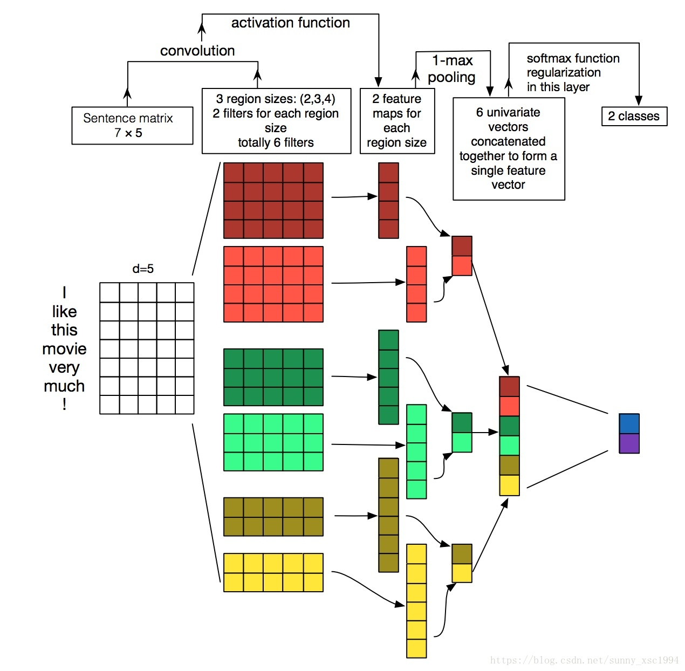

# Pytorch

## 安装

[https://pytorch.org/](https://pytorch.org/)  官网点击操作系统等配置获取安装命令

## 数据生成

查看数据的维度大小：`a.size()`

和numpy的各种数据生成的方法很像。

标准正态分布：`torch.randn(num_examples, num_inputs, dtype=torch.float32)`

tensor转numpy类型：`a.numpy()`

numpy转tensor类型：`torch.tensor(a)`

转成long类型：`torch.LongTensor([0, 1, 2, 3])`


根据index选择数据，0表示按行选，1表示按列选：`features.index_select(0, j)`

torch.mm 和 torch.mul 的区别？ torch.mm是矩阵相乘，torch.mul是按元素相乘

torch.manual_seed(1)的作用？ 设置随机种子，使实验结果可以复现

## 梯度

使用backward()函数反向传播计算tensor的梯度时，并不计算所有tensor的梯度，而是只计算满足这几个条件的tensor的梯度：1.类型为叶子节点、2.requires_grad=True、3.依赖该tensor的所有tensor的requires_grad=True。

所有的tensor都有.requires_grad属性,可以设置这个属性：`x = tensor.ones(2,4,requires_grad=True)`

如果想改变这个属性，就调用tensor.requires_grad_()方法：`x.requires_grad_(False)`

参考：https://zhuanlan.zhihu.com/p/85506092

### sgd梯度下降

```py
def sgd(params, lr, batch_size): 
    for param in params:
        param.data -= lr * param.grad / batch_size # ues .data to operate param without gradient track
```

param.data和 param 共享同一块数据，和param的计算历史无关，且其requires_grad = False

如果只是使用参数本身，那么在这个sgd参数更新其实可能也会变成网络结构的一部分，这时候网络就不是线性回归了，而使用.data可能就是隔断了梯度传导，让这里只是一个参数数值更新。

在损失函数进行求梯度时，为了保证参数值正常更新的同时又不影响梯度的计算，即使用param.data可以将更新的参数独立于计算图，阻断梯度的传播，当训练结束就可以得到最终的模型参数值。

参考：https://www.boyuai.com/elites/course/cZu18YmweLv10OeV/video/Rosi4tliobRSKaSVcsRx_

https://zhuanlan.zhihu.com/p/38475183

**optimizer.zero_grad()的作用？**使梯度置零，防止不同batch得到的梯度累加


## 常用函数解析

### torch.cat

C=torch.cat((A,B),0)就表示按维数0（行）拼接A和B，也就是竖着拼接，A上B下。此时需要注意：列数必须一致，即维数1数值要相同，这里都是3列，方能列对齐。拼接后的C的第0维是两个维数0数值和，即2+4=6.

C=torch.cat((A,B),1)就表示按维数1（列）拼接A和B，也就是横着拼接，A左B右。此时需要注意：行数必须一致，即维数0数值要相同，这里都是2行，方能行对齐。拼接后的C的第1维是两个维数1数值和，即3+4=7.

### Conv1d一维卷积

- in_channels(int) – 输入信号的通道。在文本分类中，即为词向量的维度

- out_channels(int) – 卷积产生的通道。有多少个out_channels，就需要多少个1维卷积

- kernel_size(int or tuple) - 卷积核的尺寸，卷积核的大小为(k,)，第二个维度是由in_channels来决定的，所以实际上卷积大小为kernel_size*in_channels

- stride(int or tuple, optional) - 卷积步长

- padding (int or tuple, optional)- 输入的每一条边补充0的层数

- dilation(int or tuple, `optional``) – 卷积核元素之间的间距

- groups(int, optional) – 从输入通道到输出通道的阻塞连接数

- bias(bool, optional) - 如果bias=True，添加偏置

举个例子:

```Python
conv1 = nn.Conv1d(in_channels=256，out_channels=100,kernel_size=2)
input = torch.randn(32,35,256)
# batch_size x text_len x embedding_size -> batch_size x embedding_size x text_len
input = input.permute(0,2,1)
out = conv1(input)
print(out.size())

```


这里32为batch_size，35为句子最大长度，256为词向量

再输入一维卷积的时候，需要将32x35x256变换为32x256x35，因为一维卷积是在最后维度上扫的，最后out的大小即为：32x100x（35-2+1）=32x100x34。因为out_channels=100，有100个卷积核，相当于提取了100个特征。拼起来就是100。最后一个维度根据卷积核的size和输入维度计算出来的。



[https://blog.csdn.net/sunny_xsc1994/article/details/82969867](https://blog.csdn.net/sunny_xsc1994/article/details/82969867)

### DataLoader就是用来包装所使用的数据，每次抛出一批数据

### keras.preprocessing.sequence.pad_sequences(sequences, maxlen=None, dtype='int32', padding='pre', truncating='pre', value=0.0)将多个序列截断或补齐为相同长度

- sequences: 列表的列表，每一个元素是一个序列。

- maxlen: 整数，所有序列的最大长度。

- dtype: 输出序列的类型。 要使用可变长度字符串填充序列，可以使用 object。

- padding: 字符串，'pre' 或 'post' ，在序列的前端补齐还是在后端补齐。

- truncating: 字符串，'pre' 或 'post' ，移除长度大于 maxlen 的序列的值，要么在序列前端截断，要么在后端。

- value: 浮点数，表示用来补齐的值。

- 返回Numpy 矩阵，尺寸为 (len(sequences), maxlen)。

### RandomSampler

- data_source: 数据集

- num_samples: 指定采样的数量，默认是所有。

- replacement: 若为True，则表示可以重复采样，即同一个样本可以重复采样，这样可能导致有的样本采样不到。所以此时我们可以设置num_samples来增加采样数量使得每个样本都可能被采样到。

### squeeze

squeeze的用法主要就是对数据的维度进行压缩或者解压。

先看torch.squeeze() 这个函数主要对数据的维度进行压缩，去掉维数为1的的维度，比如是一行或者一列这种，一个一行三列（1,3）的数去掉第一个维数为一的维度之后就变成（3）行。squeeze(a)就是将a中所有为1的维度删掉。不为1的维度没有影响。a.squeeze(N) 就是去掉a中指定的维数为一的维度。还有一种形式就是b=torch.squeeze(a，N) a中去掉指定的定的维数为一的维度。

再看torch.unsqueeze()这个函数主要是对数据维度进行扩充。给指定位置加上维数为一的维度，比如原本有个三行的数据（3），在0的位置加了一维就变成一行三列（1,3）。a.squeeze(N) 就是在a中指定位置N加上一个维数为1的维度。还有一种形式就是b=torch.squeeze(a，N) a就是在a中指定位置N加上一个维数为1的维度

### TensorDataset

TensorDataset 可以用来对 tensor 进行打包，就好像 python 中的 zip 功能。该类通过每一个 tensor 的第一个维度进行索引。因此，该类中的 tensor 第一维度必须相等。

### tokenizer.encode

tokenizer.encode 分词并且将词转换成id

- 只保留max_length=510-2（除去[cls][sep]）个token

- add_special_tokens=True将句子转化成对应模型（比如bert有cls和sep）的输入形式。

### view

**.view的用法**，比如a.view(1,6)，a.view(b.size())

把原先tensor中的数据按照行优先的顺序排成一个一维的数据（这里应该是因为要求地址是连续存储的），然后按照参数组合成其他维度的tensor。比如说是不管你原先的数据是[[[1,2,3],[4,5,6]]]还是[1,2,3,4,5,6]，因为它们排成一维向量都是6个元素，所以只要view后面的参数一致，得到的结果都是一样的。

参数如果是-1就代表这个位置由其他位置的数字来推断。a.view(1, -1)，-1代表的维度由a的维度和1推断出来，比如a tensor的数据个数是6，那么-1就代表6。

[Pytorch的nn.DataParallel](https://zhuanlan.zhihu.com/p/102697821)


## 教程

[https://pytorch.apachecn.org/docs/1.4/4.html](https://pytorch.apachecn.org/docs/1.4/4.html)

