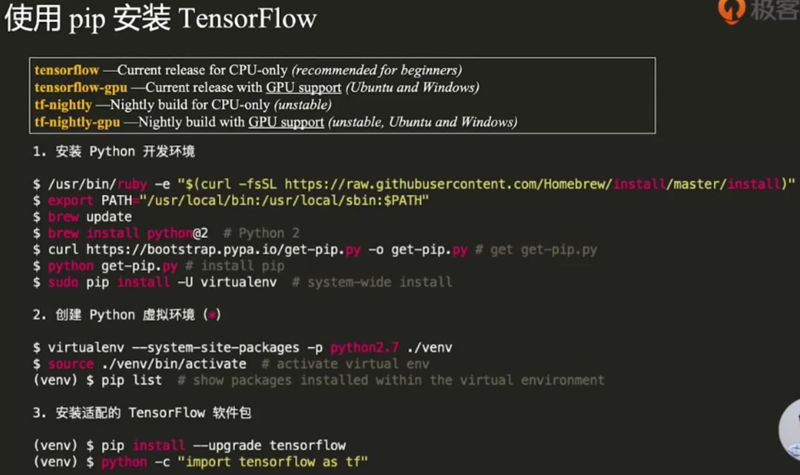
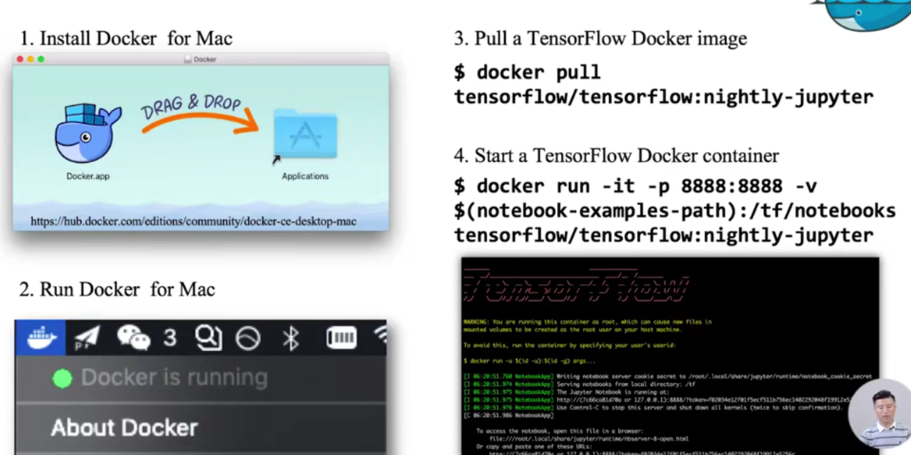

## 环境搭建

python2.7



```python
import tensorflow as tf
hello = tf.constant("Hello TensorFlow")
sess = tf.Session()
print(sess.run(hello))
```

Jupyter Notebook 交互式开发环境

安装：

```python
pip install jupyter
# venv环境
python -m ipykernel install --user --name=venv
```

Docker容器中使用



-it表示交互式，-p端口映射，使得本机端口可以访问容器端口

-v挂载目录，本机目录映射到容器目录

## TensorFlow模块


