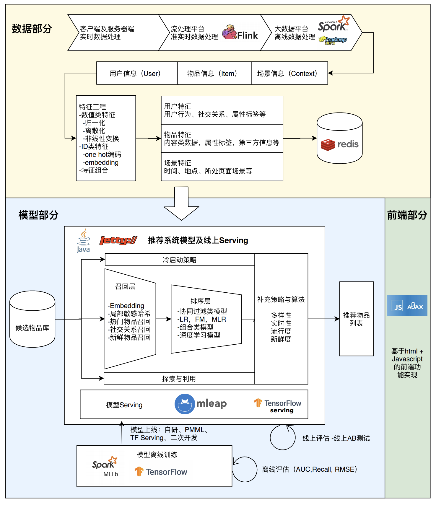
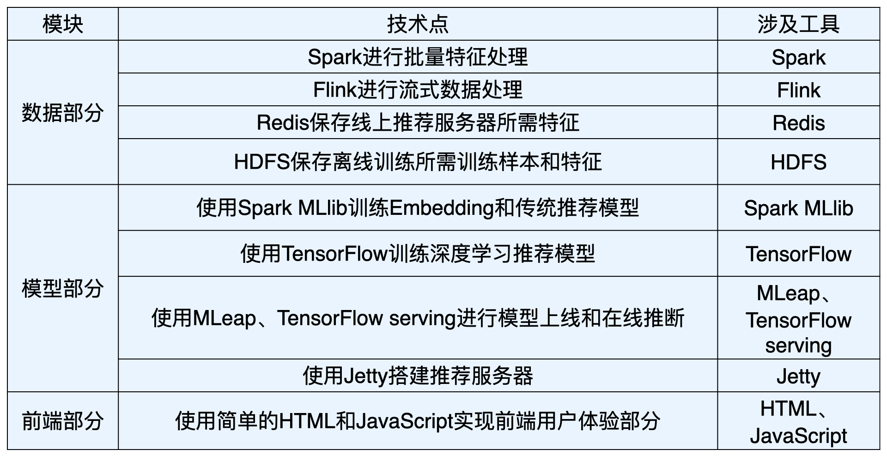

# SparrowRecSys
SparrowRecSys是一个电影推荐系统，名字SparrowRecSys（麻雀推荐系统），取自“麻雀虽小，五脏俱全”之意。项目是一个基于maven的混合语言项目，同时包含了TensorFlow，Spark，Jetty Server等推荐系统的不同模块。希望你能够利用SparrowRecSys进行推荐系统的学习，并有机会一起完善它。

## 基于SparrowRecSys的实践课程
受极客时间邀请开设 [深度学习推荐系统实战](http://gk.link/a/10lyE) 课程，详细讲解了SparrowRecSys的所有技术细节，覆盖了深度学习模型结构，模型训练，特征工程，模型评估，模型线上服务及推荐服务器内部逻辑等模块。

## 环境要求
* Java 8
* Scala 2.11
* Python 3.6+
* TensorFlow 2.0+

## 快速开始
将项目用IntelliJ打开后，找到`RecSysServer`，右键点选`Run`，然后在浏览器中输入`http://localhost:6010/`即可看到推荐系统的前端效果。

1. 安装 IDEA。下载 IDE，安装 IDEA 后，打开 IDEA；
2. 在 IDEA 中打开项目。选择 File->Open-> 选择 git clone 到的项目根目录，就可以把项目导入到 IDEA；
3. 配置 maven project。我们在 IDEA 的项目结构树的 pom.xml 上点击右键，设置为 maven project（最新的 IDE 版本也可能不用）就可以了；
4. 配置 SDK。Sparrow Recsys 使用了 Java8，Scala2.11 的编译环境，你可以在 File->Project Structure->Project 中配置 Java SDK，并在 Global Libraries 中配置 Scala SDK（如果没有安装，点加号选择Scala SDK可以Download）；
5. 运行推荐服务器。我们找到类文件 class RecSysServer（com.wzhe.sparrowrecsys.online.RecSysServer），右键点击 -> run；
6. 打开 Sparrow Recsys 首页，在浏览器中输入http://localhost:6010/ ，当看到 Sparrow RecSys 首页的时候，就说明你整个配置和安装成功了。

因为 IDEA 默认不支持 Python 的编译，所以我们需要为它安装 Python 插件。具体的安装路径是点击顶部菜单的 IntelliJ IDEA -> Preferences -> Plugins -> 输入 Python -> 选择插件 Python Community Edition 进行安装。

## 项目数据
项目数据来源于开源电影数据集[MovieLens](https://grouplens.org/datasets/movielens/)，项目自带数据集对MovieLens数据集进行了精简，仅保留1000部电影和相关评论、用户数据。全量数据集请到MovieLens官方网站进行下载，推荐使用MovieLens 20M Dataset。

MovieLens 的数据集包括三部分，分别是 movies.csv（电影基本信息数据）、ratings.csv（用户评分数据）和 links.csv（外部链接数据）。

- movies 表是电影的基本信息表，它包含了电影 ID（movieId）、电影名（title）、发布年份以及电影类型（genres）等基本信息。
- ratings 表包含了用户 ID（userId）、电影 ID（movieId）、评分（rating）和时间戳（timestamp）等信息。
- links 表包含了电影 ID（movieId）、IMDB 对应电影 ID（imdbId）、TMDB 对应电影 ID（tmdbId）等信息。其中，imdb 和 tmdb 是全球最大的两个电影数据库。因为 links 表包含了 MovieLens 电影和这两个数据库 ID 之间的对应关系，所以，我们可以根据这个对应关系来抓取电影的其他相关信息，这也为我们大量拓展推荐系统特征提供了可能。

## SparrowRecSys技术架构
SparrowRecSys技术架构遵循经典的工业级深度学习推荐系统架构，包括了离线数据处理、模型训练、近线的流处理、线上模型服务、前端推荐结果显示等多个模块。以下是SparrowRecSys的架构图：

涉及技术点

## SparrowRecSys实现的深度学习模型

* Word2vec (Item2vec)
* DeepWalk (Random Walk based Graph Embedding)
* Embedding MLP
* Wide&Deep
* Nerual CF
* Two Towers
* DeepFM
* DIN(Deep Interest Network)

## 相关论文
* [[FFM] Field-aware Factorization Machines for CTR Prediction (Criteo 2016)](https://github.com/wzhe06/Ad-papers/blob/master/Classic%20CTR%20Prediction/%5BFFM%5D%20Field-aware%20Factorization%20Machines%20for%20CTR%20Prediction%20%28Criteo%202016%29.pdf)  
* [[GBDT+LR] Practical Lessons from Predicting Clicks on Ads at Facebook (Facebook 2014)](https://github.com/wzhe06/Ad-papers/blob/master/Classic%20CTR%20Prediction/%5BGBDT%2BLR%5D%20Practical%20Lessons%20from%20Predicting%20Clicks%20on%20Ads%20at%20Facebook%20%28Facebook%202014%29.pdf)  
* [[PS-PLM] Learning Piece-wise Linear Models from Large Scale Data for Ad Click Prediction (Alibaba 2017)](https://github.com/wzhe06/Ad-papers/blob/master/Classic%20CTR%20Prediction/%5BPS-PLM%5D%20Learning%20Piece-wise%20Linear%20Models%20from%20Large%20Scale%20Data%20for%20Ad%20Click%20Prediction%20%28Alibaba%202017%29.pdf)  
* [[FM] Fast Context-aware Recommendations with Factorization Machines (UKON 2011)](https://github.com/wzhe06/Ad-papers/blob/master/Classic%20CTR%20Prediction/%5BFM%5D%20Fast%20Context-aware%20Recommendations%20with%20Factorization%20Machines%20%28UKON%202011%29.pdf)  
* [[DCN] Deep & Cross Network for Ad Click Predictions (Stanford 2017)](https://github.com/wzhe06/Ad-papers/blob/master/Deep%20Learning%20CTR%20Prediction/%5BDCN%5D%20Deep%20%26%20Cross%20Network%20for%20Ad%20Click%20Predictions%20%28Stanford%202017%29.pdf)  
* [[Deep Crossing] Deep Crossing - Web-Scale Modeling without Manually Crafted Combinatorial Features (Microsoft 2016)](https://github.com/wzhe06/Ad-papers/blob/master/Deep%20Learning%20CTR%20Prediction/%5BDeep%20Crossing%5D%20Deep%20Crossing%20-%20Web-Scale%20Modeling%20without%20Manually%20Crafted%20Combinatorial%20Features%20%28Microsoft%202016%29.pdf)  
* [[PNN] Product-based Neural Networks for User Response Prediction (SJTU 2016)](https://github.com/wzhe06/Ad-papers/blob/master/Deep%20Learning%20CTR%20Prediction/%5BPNN%5D%20Product-based%20Neural%20Networks%20for%20User%20Response%20Prediction%20%28SJTU%202016%29.pdf)  
* [[DIN] Deep Interest Network for Click-Through Rate Prediction (Alibaba 2018)](https://github.com/wzhe06/Ad-papers/blob/master/Deep%20Learning%20CTR%20Prediction/%5BDIN%5D%20Deep%20Interest%20Network%20for%20Click-Through%20Rate%20Prediction%20%28Alibaba%202018%29.pdf)  
* [[ESMM] Entire Space Multi-Task Model - An Effective Approach for Estimating Post-Click Conversion Rate (Alibaba 2018)](https://github.com/wzhe06/Ad-papers/blob/master/Deep%20Learning%20CTR%20Prediction/%5BESMM%5D%20Entire%20Space%20Multi-Task%20Model%20-%20An%20Effective%20Approach%20for%20Estimating%20Post-Click%20Conversion%20Rate%20%28Alibaba%202018%29.pdf)  
* [[Wide & Deep] Wide & Deep Learning for Recommender Systems (Google 2016)](https://github.com/wzhe06/Ad-papers/blob/master/Deep%20Learning%20CTR%20Prediction/%5BWide%20%26%20Deep%5D%20Wide%20%26%20Deep%20Learning%20for%20Recommender%20Systems%20%28Google%202016%29.pdf)  
* [[xDeepFM] xDeepFM - Combining Explicit and Implicit Feature Interactions for Recommender Systems (USTC 2018)](https://github.com/wzhe06/Ad-papers/blob/master/Deep%20Learning%20CTR%20Prediction/%5BxDeepFM%5D%20xDeepFM%20-%20Combining%20Explicit%20and%20Implicit%20Feature%20Interactions%20for%20Recommender%20Systems%20%28USTC%202018%29.pdf)  
* [[Image CTR] Image Matters - Visually modeling user behaviors using Advanced Model Server (Alibaba 2018)](https://github.com/wzhe06/Ad-papers/blob/master/Deep%20Learning%20CTR%20Prediction/%5BImage%20CTR%5D%20Image%20Matters%20-%20Visually%20modeling%20user%20behaviors%20using%20Advanced%20Model%20Server%20%28Alibaba%202018%29.pdf)  
* [[AFM] Attentional Factorization Machines - Learning the Weight of Feature Interactions via Attention Networks (ZJU 2017)](https://github.com/wzhe06/Ad-papers/blob/master/Deep%20Learning%20CTR%20Prediction/%5BAFM%5D%20Attentional%20Factorization%20Machines%20-%20Learning%20the%20Weight%20of%20Feature%20Interactions%20via%20Attention%20Networks%20%28ZJU%202017%29.pdf)  
* [[DIEN] Deep Interest Evolution Network for Click-Through Rate Prediction (Alibaba 2019)](https://github.com/wzhe06/Ad-papers/blob/master/Deep%20Learning%20CTR%20Prediction/%5BDIEN%5D%20Deep%20Interest%20Evolution%20Network%20for%20Click-Through%20Rate%20Prediction%20%28Alibaba%202019%29.pdf)  
* [[DSSM] Learning Deep Structured Semantic Models for Web Search using Clickthrough Data (UIUC 2013)](https://github.com/wzhe06/Ad-papers/blob/master/Deep%20Learning%20CTR%20Prediction/%5BDSSM%5D%20Learning%20Deep%20Structured%20Semantic%20Models%20for%20Web%20Search%20using%20Clickthrough%20Data%20%28UIUC%202013%29.pdf)  
* [[FNN] Deep Learning over Multi-field Categorical Data (UCL 2016)](https://github.com/wzhe06/Ad-papers/blob/master/Deep%20Learning%20CTR%20Prediction/%5BFNN%5D%20Deep%20Learning%20over%20Multi-field%20Categorical%20Data%20%28UCL%202016%29.pdf)  
* [[DeepFM] A Factorization-Machine based Neural Network for CTR Prediction (HIT-Huawei 2017)](https://github.com/wzhe06/Ad-papers/blob/master/Deep%20Learning%20CTR%20Prediction/%5BDeepFM%5D%20A%20Factorization-Machine%20based%20Neural%20Network%20for%20CTR%20Prediction%20%28HIT-Huawei%202017%29.pdf)  
* [[NFM] Neural Factorization Machines for Sparse Predictive Analytics (NUS 2017)](https://github.com/wzhe06/Ad-papers/blob/master/Deep%20Learning%20CTR%20Prediction/%5BNFM%5D%20Neural%20Factorization%20Machines%20for%20Sparse%20Predictive%20Analytics%20%28NUS%202017%29.pdf)  

## 其他相关资源
* [Papers on Computational Advertising](https://github.com/wzhe06/Ad-papers)  
* [Papers on Recommender System](https://github.com/wzhe06/Ad-papers)  
* [CTR Model Based on Spark](https://github.com/wzhe06/SparkCTR)  
