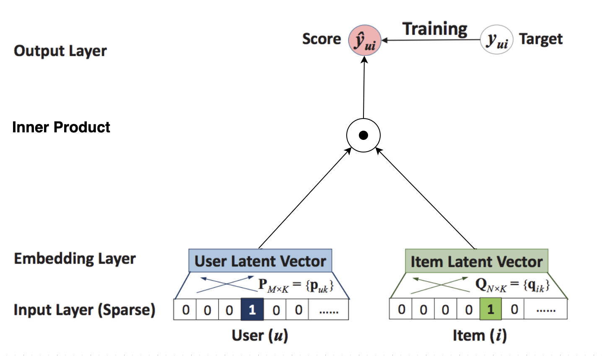

## 协同过滤的过程

绿色“点赞”的标志表示好评，用红色“踩”的标志表示了差评

在共现矩阵中，每个用户对应的行向量其实就可以当作一个用户的 Embedding 向量。可以用来计算用户相似度。

我们假设的是“目标用户与其相似用户的喜好是相似的”，根据这个假设，我们可以利用相似用户的已有评价对目标用户的偏好进行预测。最常用的方式是，利用用户相似度和相似用户评价的加权平均值，来获得目标用户的评价预测

在获得用户 u 对不同物品的评价预测后，最终的推荐列表根据评价预测得分进行排序即可得到。到这里，我们就完成了协同过滤的全部推荐过程。

## 矩阵分解

协同过滤相比深度学习模型的弊端日益显现出来，因为它是通过直接利用非常稀疏的共现矩阵进行预测的，所以模型的泛化能力非常弱，遇到历史行为非常少的用户，就没法产生准确的推荐结果了。

矩阵分解进一步加强了协同过滤的泛化能力，它把协同过滤中的共现矩阵分解成了用户矩阵和物品矩阵，从用户矩阵中提取出用户隐向量，从物品矩阵中提取出物品隐向量，再利用它们之间的内积相似性进行推荐排序。如果用神经网络的思路来理解矩阵分解，它的结构图就是图 2 这样的。

因为矩阵分解是利用非常简单的内积方式来处理用户向量和物品向量的交叉问题的，所以，它的拟合能力也比较弱。

图 2 中的输入层是由用户 ID 和物品 ID 生成的 One-hot 向量，Embedding 层是把 One-hot 向量转化成稠密的 Embedding 向量表达，这部分就是矩阵分解中的用户隐向量和物品隐向量。输出层使用了用户隐向量和物品隐向量的内积作为最终预测得分，之后通过跟目标得分对比，进行反向梯度传播，更新整个网络。

把矩阵分解神经网络化之后，把它跟 Embedding+MLP 以及 Wide&Deep 模型做对比，我们可以一眼看出网络中的薄弱环节：矩阵分解在 Embedding 层之上的操作好像过于简单了，就是直接利用内积得出最终结果。这会导致特征之间还没有充分交叉就直接输出结果，模型会有欠拟合的风险。

## NeuralCF

code: https://github.com/hexiangnan/neural_collaborative_filtering

2017 年，新加坡国立的研究者提出了NeuralCF（神经网络协同过滤），对矩阵分解进行了改进，它的结构图是图 3 这样的。NeuralCF 大大提高了协同过滤算法的泛化能力和拟合能力。

NeuralCF 用一个多层的神经网络替代掉了原来简单的点积操作。这样就可以让用户和物品隐向量之间进行充分的交叉，提高模型整体的拟合能力。

## 参考资料

深度学习推荐系统实战 [深度学习推荐系统实战](../深度学习推荐系统实战.md)

