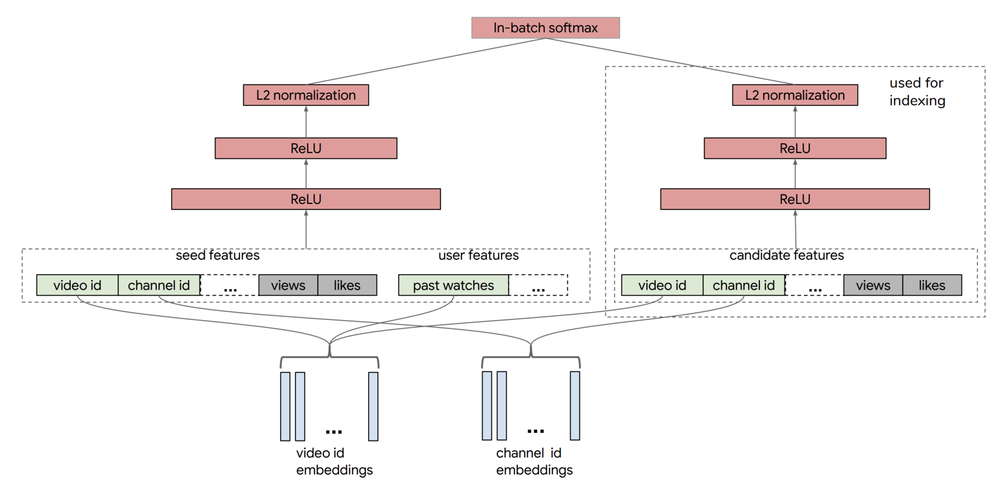

NeuralCF[NeuralCF](../协同过滤/协同过滤.md#NeuralCF)的模型结构之中，蕴含了一个非常有价值的思想，就是我们可以把模型分成用户侧模型和物品侧模型两部分，然后用互操作层把这两部分联合起来，产生最后的预测得分。

这里的用户侧模型结构和物品侧模型结构，可以是简单的 Embedding 层，也可以是复杂的神经网络结构，最后的互操作层可以是简单的点积操作，也可以是比较复杂的 MLP 结构。但只要是这种物品侧模型 + 用户侧模型 + 互操作层的模型结构，我们把它统称为“双塔模型”结构。

对于 NerualCF 来说，它只利用了用户 ID 作为“用户塔”的输入特征，用物品 ID 作为“物品塔”的输入特征。事实上，我们完全可以把其他用户和物品相关的特征也分别放入用户塔和物品塔，让模型能够学到的信息更全面。比如说，YouTube 在构建用于召回层的双塔模型时，就分别在用户侧和物品侧输入了多种不同的特征，如图 5 所示。

我们看到，YouTube 召回双塔模型的用户侧特征包括了用户正在观看的视频 ID、频道 ID（图中的 seed features）、该视频的观看数、被喜欢的次数，以及用户历史观看过的视频 ID 等等。物品侧的特征包括了候选视频的 ID、频道 ID、被观看次数、被喜欢次数等等。在经过了多层 ReLU 神经网络的学习之后，双塔模型最终通过 softmax 输出层连接两部分，输出最终预测分数。

在实际工作中，双塔模型最重要的优势就在于它易上线、易服务。

你注意看一下物品塔和用户塔最顶端的那层神经元，那层神经元的输出其实就是一个全新的物品 Embedding 和用户 Embedding。我们就可以把 u(x) 和 v(y) 存入特征数据库，这样一来，线上服务的时候，我们只要把 u(x) 和 v(y) 取出来，再对它们做简单的互操作层运算就可以得出最后的模型预估结果了！

所以使用双塔模型，我们不用把整个模型都部署上线，只需要预存物品塔和用户塔的输出，以及在线上实现互操作层就可以了。如果这个互操作层是点积操作，那么这个实现可以说没有任何难度，这是实际应用中非常容易落地的，也是工程师们喜闻乐见的，这也正是双塔模型在业界巨大的优势所在。正是因为这样的优势，双塔模型被广泛地应用在 YouTube、Facebook、百度等各大公司的推荐场景中，持续发挥着它的能量。