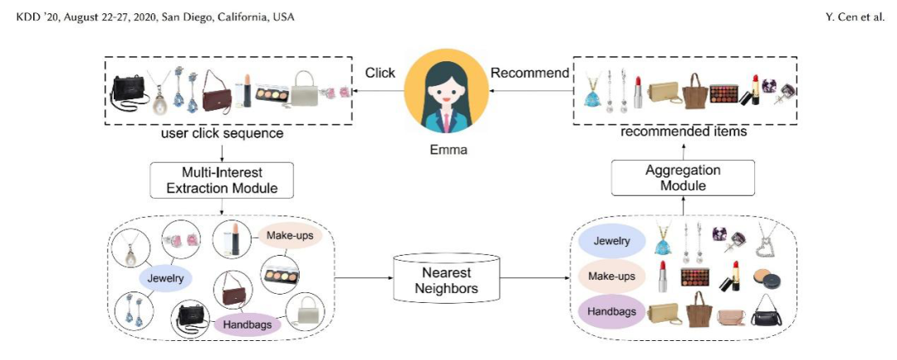

# 召回

召回的策略与算法：策略包括考虑内容关联的频繁项集挖掘Apriori等、考虑用户与内容相关性的召回itemCF等、基于协同过滤的召回SVD等；算法包括将内容变为embedding后再进行近邻检索的item2vec和node2vec、应用内容理解的CDML召回以及近年来兴起的GNN召回等。

## 多兴趣召回

多兴趣召回技术类似其他召回技术都依赖着用户过往的历史行为，但不同点在于多兴趣召回技术可以学习到用户的多个兴趣表示，将个性化推荐的“千人千面”升级为“千人万面”，每一个兴趣表示都能根据最近邻搜索得到相应的视频成为召回源。一方面，多兴趣召回技术符合多数用户拥有不同志趣和爱好的现实情况，能够让推荐结果精准且丰富，能够防止内容同质化带来观感疲劳；另一方面，除了挖掘用户的已有兴趣，多兴趣召回技术不断挖掘出用户自己从未发现的潜在新兴趣，防止传统推荐算法造成的“信息茧房”现象。

### 聚类多兴趣召回

聚类多兴趣召回的主要优点在于不用训练复杂的神经网络，只需利用线上其他深度学习的embedding即可形成多个兴趣向量（例如较为成熟的node2vec，item2vec等video embedding空间），时间和空间代价都较小。主要理论依据为KDD2020提出的兴趣聚类方法PinnerSage。（是不是和PinSage名字很像，但它与图神经网络没有太大关系）。

PinnerSage聚类多兴趣召回是传统ii召回基础上结合聚类方法的新型策略。传统的ii召回中往往有两种做法：1，选择用户短期历史行为的每个视频，进行多次ANN查找选出近邻视频，这样的做法不仅时间成本高而且推出视频同质化严重。2，将用户短期历史行为的所有视频embedding进行pooling形成代表用户的user embedding，再进行ANN近邻查找，这样的方式能一定程度的融合信息减少时间空间代价，但很容易造成信息损失， pooling出的embedding很可能差了十万八千里。

PinnerSage则取两者之长，对用户历史行为中的视频进行聚类分组，pooling形成多个兴趣向量。聚类既避免了多次ANN带来的压力，也能一定程度上避免信息损失。PinnerSage 聚类多兴趣召回分为两步走：

**a. 聚类过程** 。如图所示，对用户观看过的所有视频进行聚类操作，Pinnersage聚类采用了hierarchical clustering聚类方法，并不需要像K-Means设置初始类别数，而是首先将每一个视频均看作一类，接下来每两类开始合并，若合并后组内variance增加最少则可以将两类合并为一类，直到variance超过阈值即停止。

**b. 取出embedding过程** 。PinnerSage依然不对类内视频embedding 取平均，而是选择类内的一个视频embedding作为类（兴趣簇）的代表，该视频embedding需满足与类内所有视频embedding距离之和最小。再利用这些代表用户兴趣的embedding们进行ANN即可。

聚类多兴趣召回通过简单的策略便形成了用户多个兴趣，时间代价较少。但由于依赖其他算法形成的embedding空间，学习到的多个兴趣embedding很容易有偏，推出内容趋于高热难以满足个性化。

### MOE多兴趣召回

双塔模型是业界比较主流的召回模型，但是双塔模型在实际场景中效果有限。因此爱奇艺团队将双塔中的用户侧的塔结构进行修改，引入类似于MOE的结构，提取多个向量表示用户潜在的兴趣，从而获得了极大提升。其中MOE是多目标学习中使用广泛的经典结构，根据数据进行分离训练多个专家模型，爱奇艺最终将多个专家模型的输出作为用户兴趣向量，通过与视频侧提取的向量分别计算内积得到最相似的一个用户向量参与损失的计算。

MOE多塔结构如图所示，左边为用户侧MOE多塔部分，右边为视频侧单塔部分。模型的实现细节包括：

a. 用户侧的输入主要是用户的偏好序列，包括用户偏好的视频id序列、上传者id序列与内容标签(tag)序列，序列特征经过embedding处理与average pooling操作后得到不同的向量，拼接之后组成MOE多塔的输入，经过MOE多塔计算后得到多个向量表示用户潜在的多个兴趣。

b. 视频侧为单塔结构，输入为用户交互过的视频id、上传者id与内容标签(tag)特征，经过embedding提取和拼接之后使用单塔结构提取信息。

c. 在loss计算上，由于召回是从千万级的视频库中寻找出用户可能感兴趣的几百条视频，因此实际样本中负样本空间十分巨大。为了增加模型对负样本的筛选能力和提升模型负采样的效率，爱奇艺在模型中使用batch内负采样，将batch内其他样本作为当前样本的负样本，同时使用focal loss损失函数来提升模型对难样本的识别能力。

经过修改之后的MOE多塔模型上线之后，单召回源的点击率和人均观看时长得到极大提升（全端CTR提升0.64%，召回源推出视频CTR比全端高出28%，展均播放时长比全端高出45%）。

经过修改之后的MOE多塔模型上线之后，单召回源的点击率和人均观看时长得到极大提升。但是MOE多塔共享底层的输入，仅仅使用简单的DNN网络提取不同的向量，导致多个塔之间的区分度比较低，多向量中冗余较多难以优化；此外用户序列特征中实际包含的位置信息对用户比较重要，当前模型难以利用。

### 单激活多兴趣召回

单激活多兴趣召回从19年开始便被工业界使用，其中最绕不开的是阿里提出的MIND，其利用胶囊网络对用户序列进行动态路由收集多兴趣的方法在测试集上取得爆炸效果，激起了整个工业界对多兴趣网络的探索热情。随刻推荐团队也进行了探索。

4.1 单激活多兴趣召回初版

基于MIND等网络的启发，爱奇艺团队进行了单激活多兴趣网络的初版探索，网络结构如图所示。在MIND网络中，采用了胶囊网络来抓取用户的兴趣，胶囊网络可以很好的同时捕捉观看的序列顺序信息和视频间的相关性，但由于结构较为复杂计算开销较大，且观看顺序仅单个维度即可表示不需要网络对位置信息太过敏感，因此团队选择transformer结构进行代替以保证训练速度。

大致流程为：

a. 截取用户观看视频id序列{V1,…VN}作为sample，第N+1个视频作为target输入网络，经过video embedding层后形成embedding序列E={E1,E2,..EN}。

b. E经过transformer构造的兴趣抽取层得到多个兴趣向量M，取|Mi|最大的兴趣向量与target视频的embedding进行sampled softmax loss负采样，因此每次训练实际上只激活一个通道的兴趣向量。

c. 模型训练好后在推理阶段，取出用户所有兴趣向量，逐个进行ANN检索得到召回结果。

初版虽然结构简单，但上线后效果较好，极大提升消费指标、视频覆盖度和多样性。然而初版也存在着不同兴趣向量召回结果重复度较高、特征较少、即时性差等问题，因此也产生了多个版本的演变。

**4.2 disagreement-regularzation多兴趣召回** 

4.2中兴趣向量间无任何约束，因此容易出现兴趣向量过于相似的问题，因此在损失函数上需要施加正则项。鉴于初版多兴趣召回主要部分为transformer，团队在不改变网络结构的情况下使用三种正则函数进行探索。

如图所示，分别对学习到的视频embedding(公式1)，Attention(公式2)，兴趣向量（公式3）进行正则化约束。在实际生产环境中发现，直接对兴趣向量进行正则化约束能达到最优效果。

**4.3 容量动态化多兴趣召回** 

不同用户往往呈现不同的兴趣发散性，因此兴趣向量数应该是一个弹性指标而非超参数，在4.1与4.2的基础上，如图所示在网络结构中引入兴趣激活记录表。

训练过程中每当用户有任何兴趣向量被激活时，记录表均会记录这次激活。推理阶段，回溯激活表情况，将用户未激活或激活较少的兴趣向量剔除，以达到兴趣数动态化的目的，从而匹配不同用户兴趣发散性存在差异的现实情况。

**4.4 多模态特征多兴趣召回** 

4.1-4.3中，多兴趣召回仅使用到视频id特征，学习效果依然有限，因此在后续版本的发展中，将上传者和内容标签(tag)融入训练成为主要方向。如图所示，为网络主要结构。

Transformer部分与4.1-4.3中大致相同，不同点在于训练样本加入上传者和内容标签(tag)特征后经过embedding和pooling部分再进入transformer中。值得注意的有两点：

1. loss部分依然只对视频id的embedding进行负采样（与MIND等结构不同），这样的目的是让视频id的全部embedding可以进入负采样中，而不用折中使用batch内负采样，能够让最终推理阶段主要使用video id embedding更加精准（推理阶段ANN部分不会使用tag与uploader）。

2. 一个视频往往有多个内容标签(tag)，因此在对内容标签(tag)做embedding时需要对所有内容标签(tag)做embedding操作后进行一次pooling。

**4.5小结** 

如4.1-4.4所示，单激活多兴趣网络进行了多次演变过程，一次次改进后的应用带来了非常显著的效果，全端CTR显著提升2%，全端时长提升1.5%，人均播放提升1.5%；特别是在推出视频的多样性上，直接提升4%以上。

同时作为一个老少皆宜的内容平台，在爱奇艺一直存在着以家庭为单位，不同年龄段用户使用同一账号的情况，因此同一账号下的历史行为往往来自各个年龄阶段，用户历史行为的复杂性给推荐带来了难题。而单激活多兴趣网络的兴趣向量在学习过程的采样中具随机性、在数学呈现上具正交性，这就使得兴趣向量的搜索范围能够召回不同年龄段所喜爱的海量视频。

### 总结

多兴趣召回依然有可以优化的方向：

1. 在行为序列的选取上，大部分的多兴趣策略与网络依然只考虑到用户的观看历史，如果能够运用事件知识图谱，将用户在平台上的搜索、订阅等行为一起纳入训练数据中，应该可以抓取用户更多的兴趣与倾向。

2. 在负反馈信息的处理上，多兴趣召回尚无应对之策。视频中的许多点踩、消极评论、不喜欢、取消关注等行为尚且未融入到多兴趣召回中，这些信息对指导兴趣网络的也至关重要，后期该方向将成为重点工作。

3. 在用户的静态信息与偏好特征的整合上，亦有很大的应用空间。这部分特征的组合能够很好地和排序目标对齐，提升召回源质量和排序效果上限。

## 参考资料：

[千人万面，奇妙自见：爱奇艺短视频推荐技术中多兴趣召回技术的演变](https://mp.weixin.qq.com/s/T2G8L820haEbvXgryvEWHg)

AdityaPal, et al. PinnerSage: Multi-Modal User Embedding Framework for Recommendations at Pinterest. KDD 2020

Jiaqi Ma, et al. Modeling Task Relationships in Multi-task Learning with Multi-gate Mixture-of-Experts. KDD 2018

Yukuo Cen, et al. Controllable Multi-Interest Framework for Recommendation.KDD 2020.

Chao Li, et al.Multi-Interest Network with Dynamic Routing for Recommendation at Tmall. CIKM 2019.

Jian Li, et al. Multi-Head Attention with Disagreement Regularization. EMNLP 2018

