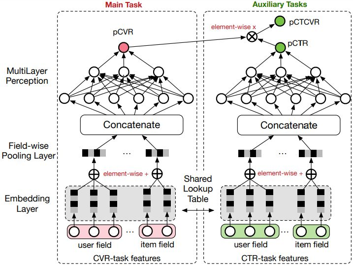
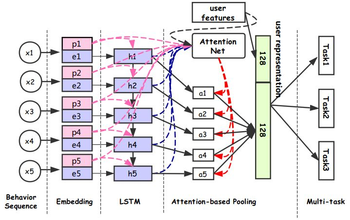
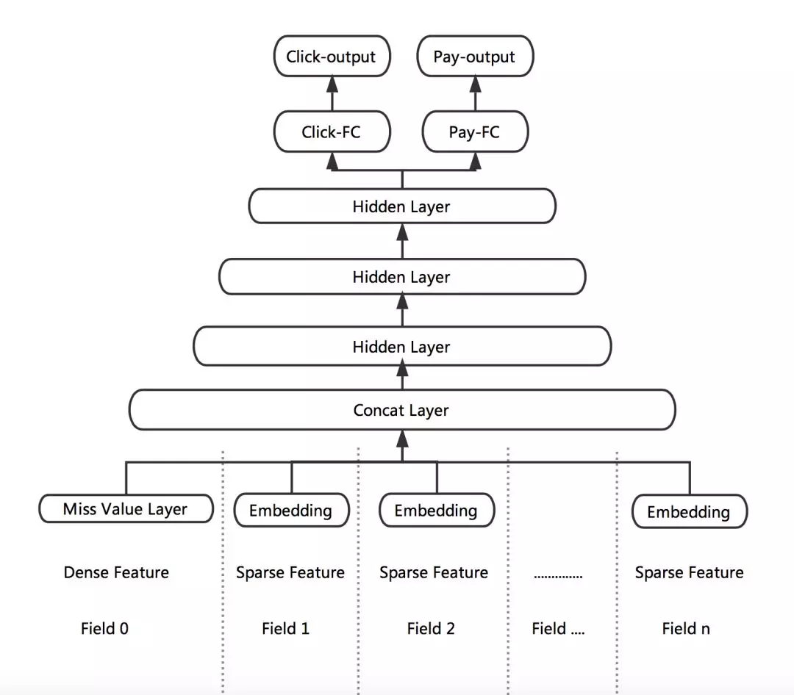
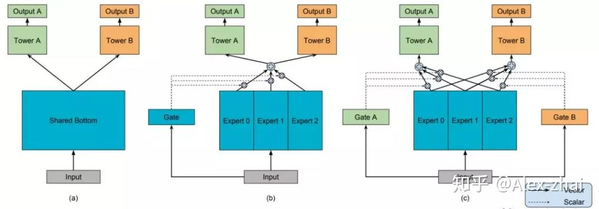
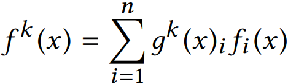
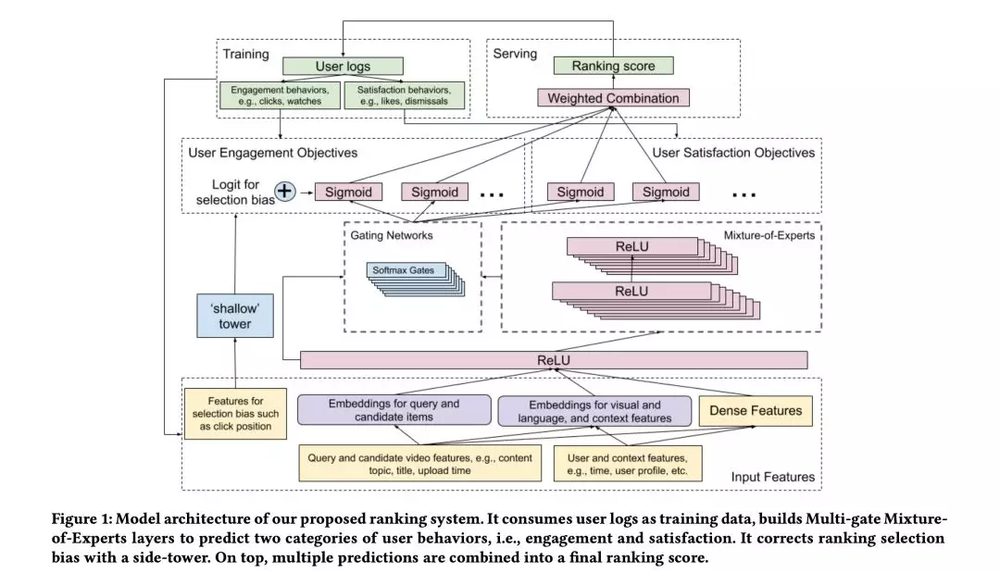
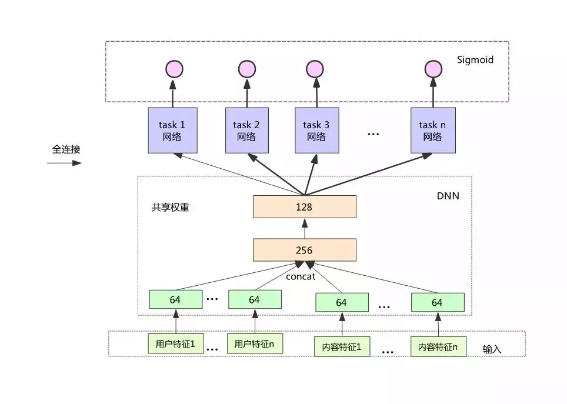
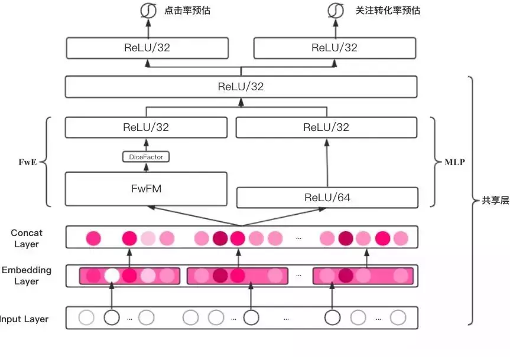

# 多任务Multi-task&推荐

我们在优化推荐效果的时候，很多时候不仅仅需要关注CTR指标，同时还需要优化例如CVR（转化率）、视频播放时长、用户停留时长、用户翻页深度、关注率、点赞率这些指标。那么一种做法是对每个任务单独使用一个模型来优化，但是这样做的缺点显而易见，需要花费很多人力。其实很多任务之间都是存在关联性的，比如CTR和CVR。那么能不能使用一个模型来同时优化两个或多个任务呢？其实这就是Multi-task多任务的定义。

1.**阿里ESMM：**Entire Space Multi-Task Model: An Effective Approach for Estimating Post-Click Conversion Rate

CVR是指从点击到购买的转化，传统的CVR预估会存在两个问题：样本选择偏差和稀疏数据**。**

样本选择偏差是指模型用的是用户点击的样本来训练，但是预测却用的是整个样本空间。数据稀疏问题是指用户点击到购买的样本太少。因此阿里提出了ESMM模型来解决上述两个问题：主要借鉴多任务学习的思路，引入两个辅助学习任务，分别用来拟合pCTR和pCTCVR。

ESMM模型由两个子网络组成，左边的子网络用来拟合pCVR，右边的子网络用来拟合pCTR，同时，两个子网络的输出相乘之后可以得到pCTCVR。因此，该网络结构共有三个子任务，分别用于输出pCTR、pCVR和pCTCVR。

1. 阿里DUPN：Perceive Your Users in Depth: Learning Universal User Representations from Multiple E-commerce Tasks

多任务学习的优势：可共享一部分网络结构，比如多个任务共享embedding参数。学习到的用户、商品embedding向量可迁移到其它任务中。

多任务模型DUPN分为行为序列层、Embedding层、LSTM层、Attention层、下游多任务层。

文中也提到了两点多任务模型的使用技巧：

- 天级更新模型：随着时间和用户兴趣的变化，ID特征的Embedding需要不断更新，但每次都全量训练模型的话，需要耗费很长的时间。通常的做法是每天使用前一天的数据做增量学习，这样一方面能使训练时间大幅下降；另一方面可以让模型更贴近近期数据。

- 模型拆分：由于CTR任务是point-wise的，如果有1w个物品的话，需要计算1w次结果，如果每次都调用整个模型的话，其耗费是十分巨大的。其实User Reprentation只需要计算一次就好。因此我们会将模型进行一个拆解，使得红色部分只计算一次，而蓝色部分可以反复调用红色部分的结果进行多次计算。

3. [美团“猜你喜欢”深度学习排序模型](https://link.zhihu.com/?target=https://tech.meituan.com/2018/03/29/recommend-dnn.html)

根据业务目标，将点击率和下单率拆分出来，形成两个独立的训练目标，分别建立各自的Loss Function，作为对模型训练的监督和指导。DNN网络的前几层作为共享层，点击任务和下单任务共享其表达，并在BP阶段根据两个任务算出的梯度共同进行参数更新。网络在最后一个全连接层进行拆分，单独学习对应Loss的参数，从而更好地专注于拟合各自Label的分布。

**Google MMoE** 

有两个技巧可借鉴下：

- Missing Value Layer：缺失的特征可根据对应特征的分布去自适应的学习出一个合理的取值。

- KL-divergence Bound：通过物理意义将有关系的Label关联起来，比如p(点击) * p(转化) = p(下单)。加入一个KL散度的Bound，使得预测出来的p(点击) * p(转化)更接近于p(下单)。但由于KL散度是非对称的，即KL(p||q) != KL(q||p)，因此真正使用的时候，优化的是KL(p||q) + KL(q||p)。

4.Google MMoE： [Modeling Task Relationships in Multi-task Learning with Multi-gate Mixture-of-Experts](https://link.zhihu.com/?target=http://delivery.acm.org/10.1145/3230000/3220007/p1930-ma.pdf)

- 模型(a)最为常见，两个任务直接共享模型的bottom部分，只在最后处理时做区分，图(a)中使用了Tower A和Tower B，然后分别接损失函数。

- 模型(b)是常见的多任务学习模型。将input分别输入给三个Expert，但三个Expert并不共享参数。同时将input输出给Gate，Gate输出每个Expert被选择的概率，然后将三个Expert的输出加权求和，输出给Tower，有点attention的感觉。

- 模型(c)是作者新提出的方法，对于不同的任务，模型的权重选择是不同的，所以作者为每个任务都配备一个Gate模型。对于不同的任务，特定的Gate k的输出表示不同的Expert被选择的概率，将多个Expert加权求和，得到$f^k(x)$，并输出给特定的Tower模型，用于最终的输出。

其中g（x）表示gate门的输出，为多层感知机模型，简单的线性变换加softmax层。

**5. 阿里 ESM2** 

Conversion Rate Prediction via Post-Click Behaviour Modeling

**6. YouTube 多目标排序系统** 

Recommending What Video to Watch Next: A Multitask Ranking System

本文主要解决了视频推荐场景下普遍存在的两个问题：

❶ 视频推荐中的多任务目标。比如不仅需要预测用户是否会观看外，还希望去预测用户对于视频的评分，是否会关注该视频的上传者，是否会分享到社交平台等。

❷ 偏置信息。比如用户是否会点击和观看某个视频，并不一定是因为他喜欢，可能仅仅是因为它排在推荐页的最前面，这会导致训练数据产生位置偏置的问题。

从上图可知，整个模型需要预测两大类目标，分别是：

❶ Engagement objectives：主要预测用户是否点击和观看视频的时长。其中通过二分类模型来预测用户的点击行为，而通过回归模型来预测用户观看视频的时长。

❷ Satisfaction objectives：主要预测用户在观看视频后的反馈。其中使用二分类模型来预测用户是否会点击喜欢该视频，而通过回归模型来预测用户对于视频的评分。

7.知乎推荐页 Ranking 模型

上图是知乎在推荐场景下使用的多目标模型，预测的任务包括点击率、收藏率、点赞率、评论率等，共 8 个目标。可以看出知乎的做法也是底层 embedding 和 DNN 前几层权重设置成共享。损失函数可设置成这几个 task 的简单线性加权和。上线后线上性能：点击率基本不变，而其他的几个指标，比如点赞，收藏大幅提升。

**8. 美图推荐排序多任务** 

模型结构：

[https://mmbiz.qpic.cn/mmbiz_png/zHbzQPKIBPhwFAlqnU0ePjAd4Dlz0r5gg3o2mqldVnTET3iaicwPEwdUBeSCoUaI3JjbiaXdYIBhf1kPicIgHRBteA/640?wx_fmt=png&tp=webp&wxfrom=5&wx_lazy=1&wx_co=1](https://mmbiz.qpic.cn/mmbiz_png/zHbzQPKIBPhwFAlqnU0ePjAd4Dlz0r5gg3o2mqldVnTET3iaicwPEwdUBeSCoUaI3JjbiaXdYIBhf1kPicIgHRBteA/640?wx_fmt=png&tp=webp&wxfrom=5&wx_lazy=1&wx_co=1)

如上图，Multi-task NFwFM 模型的前几个隐层是共享的。在最后即将预估多个目标时通过全连接层进行拆分，各自学习对应任务的参数，从而专注地拟合各自任务。在线上预估时，因为模型尺寸没有变化，推理效率和线上的点击率预估模型一致。考虑到我们是在点击率任务的基础上同时优化关注转化率，融合公式上体现为优先按照点击率排序再按照曝光→关注的转化率排序。Multi-task NFwFM 已在美图秀秀社区首页 Feeds 推荐、相关推荐下滑流全量上线。首页 Feeds 点击率+1.93%，关注转化率+2.90%，相关推荐下滑流人均浏览时长+10.33%，关注转化率+9.30%。

最后总结下现在多任务学习模型的主要使用方式：

❶ 底层 embedding 和 mlp 参数共享，上层演化出各个任务的分支，最后 loss 函数是各个任务的简单加权和。

❷ 通过多任务之间的关系来建模出新的 loss 函数，比如阿里的 ESSM，ESSM2。

❸ 通过 Multi-gate Mixture-of-Experts ( MMoE ) 这种特殊的多任务结构来学习出不同任务的权重，比如 YouTube 的多任务模型。

参考资料

[多任务学习在推荐算法中的应用](https://mp.weixin.qq.com/s/4e7gwpP3XHBAMNX9M0nRgw)

