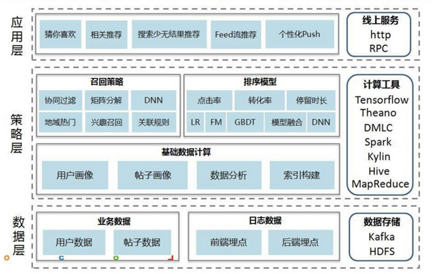
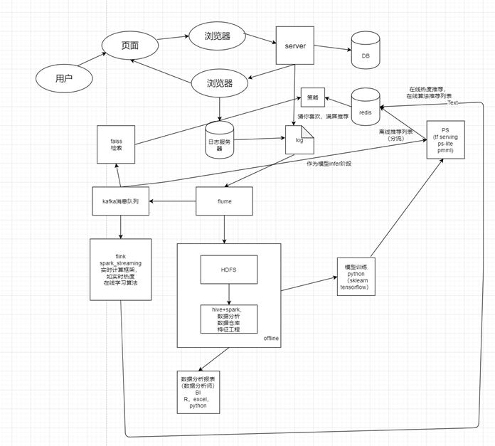
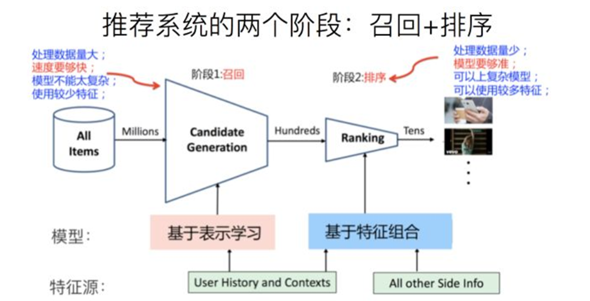
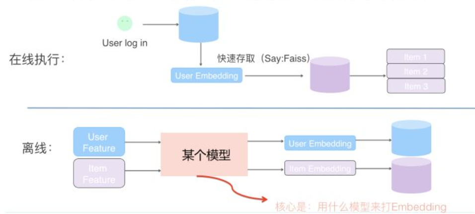
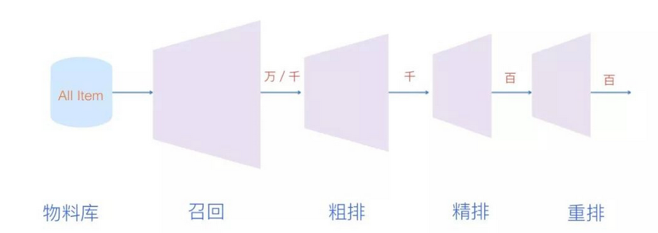
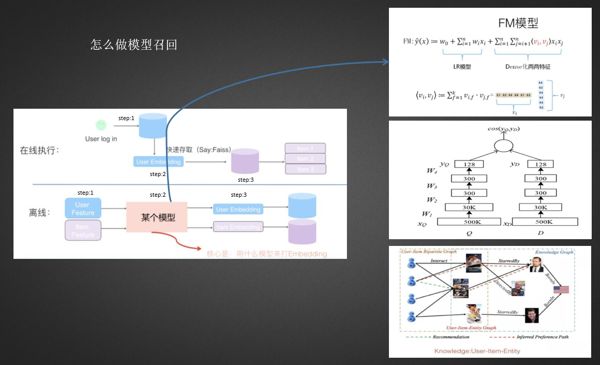
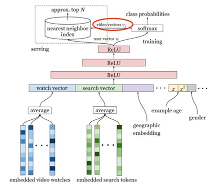
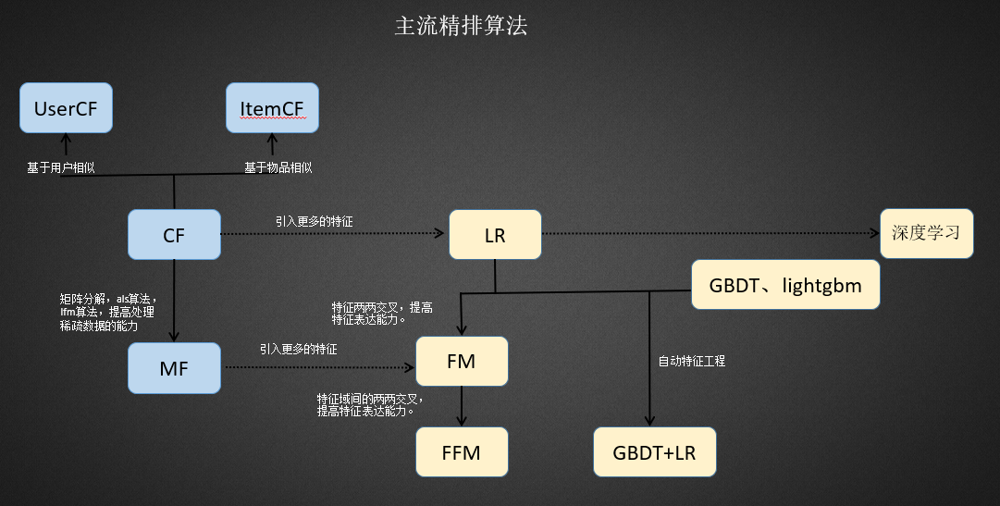
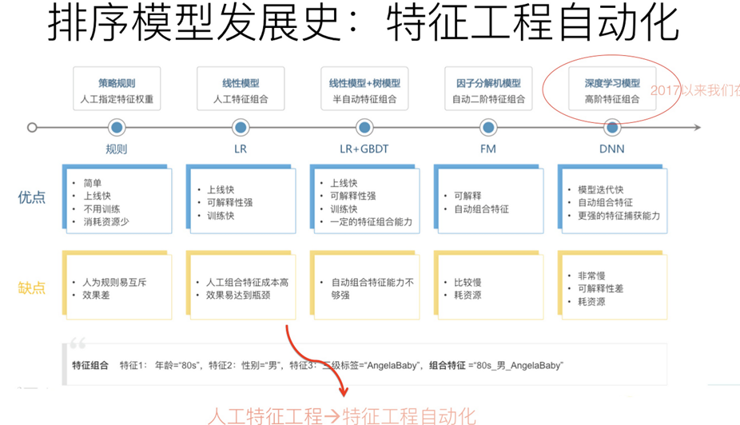

# 推荐介绍

主流推荐系统架构

[Python](https://www.wolai.com/eMRx6xeCtsRSXhPjuKcMX9)

召回的目的：从千万级别的item中为每个用户抽取数千、百个item进行推荐。

召回计算方式：离线 凌晨计算，定时更新召回列表。

召回工具：spark hive  flink（实时召回）。

召回方式：多路召回。

召回列表存储:  线上hbase、redis。

多路召回：策略为主，不同业务场景召回路线不一样，每一路的召回数量也不一样。

为什么要多路召回：让物品从不同来源被召回，满足用户兴趣的多样性，以及推荐结果的完备性。

- 兴趣标签召回：在用户注册信息的时候很多app都有询问用户兴趣的选项。此时需要的是从物品的自身标签中去计算与用户兴趣标签的匹配度，然后进行topk个召回。

- 兴趣topic召回：对用户兴趣进行打分，比如用户兴趣有90%时间在阅读军事，10%在阅读政治。

- 兴趣实体召回：兴趣实体指的是由算法分析用户历史浏览，对其关注的人、物体进行算法抽取，抽取最感兴趣的topk个实体。然后当新的物品来之后，看物品与用户兴趣实体是否匹配。

- 基于协同过滤：分为基于用户的协同过滤和基于物品的协同过滤两条召回路。

- 热度召回：根据新闻的曝光量，点击量，已经点击率做筛选，三者均满足要求的新闻进入新闻热度池，作为热度召回的来源，热度池需要实时维护更新（flink, streaming)。

- 基于模型的召回：youtube、dssm、fm、grapsage。为什么引入模型召回：综合更多信息。每一路相当于一个单特征模型。

粗排融合：当多路召回结束后，每一路都会召回若干物品,且都有顺序。

目的：如何将多路召回结果，融合为一个有序列表？

策略：

1.业务重要度排序：实时>CB>模型 那么要排4个：（c、d、e、b）

2.加权平均：比如基于专家定义：实时：0.5，cb：0.3，模型：0.2。 $score(c)=0.5*0.5+0.3*0.5+0.2*0.9/(0.5+0.3+0.2)$

3.动态加权法：每隔一段时间动态更新每一路的权重。

第一天是：实时：0.5，cb：0.3，模型：0.2。

第二天是：实时：0.4，cb：0.5，模型：0.1。

4.模型打分：离线基于模型计算好各路的召回权重，然后一样做加权召回。

多路融合存在的问题：

1.多路的权重不好确定

2.多路的召回数量不好确定

3.多路召回的并发先后顺序

4.单路特征召回==单特征模型

5.每一路的衡量指标怎么确定

是否有一个大一统的方法，直接将物品塞入一个黑盒，就可以得到最终的物品列表。且最终列表自动做了权重、数量。——基于模型的召回。

youtube 模型召回工程：

需要在百万量级的视频规模下对用户进行个性化推荐。

考虑到在线推理延迟问题，对特别复杂的网络尤其是深度学习进行推荐就是一个难题。因此将整个网络构建分为两个流程：

1.用候选生成模型完成快速视频筛选，相当于召回。

2.用该模型更换目标完成精排序。

粗排阶段不足之处：

- 排序不够精确，没有引入更多的side info。

- **粗排阶段基本都是离线算好的，对用户的即时性捕捉不到位。** 

- **粗排使用推荐系统初期，当海量数据来临，需要靠精排做更个性化的排序，增加用户粘性。** 

精排要干什么：

- **用到更多特征，你能想到业务特征都可以做。** 

- **精排模型可以用复杂的深度学习算法** 。

- **精排离线训练，在线排序。** 

LR、xgb阶段：大量的人工特征，此时属于推荐系统精排的机器学习阶段。

引入fm、ffm等自动交叉、filed交叉自动构建特征塞入模型。

从wide&deep开启深度学习与推荐的道路。deepfm、DCN、pnn....主要增加特征的高阶交叉，使得模型可以拟合更高阶特征。

着重建模在用户兴趣、行为捕捉模型、多任务、多模态的模型中。din、dien、bst、mmoe、essm...

精排模型如何上线

- **召回** ：离线召回后，不经过粗排直接去重存入hbase、redis中。实时召回：通过flink等实时召回存hbase、redis。

- **模型离线训练** ：固定一天的凌晨，增量训练或者重新训练模型，用于第二天的业务支持。

- **开启模型服务** ：基于模型预测服务开启，监听模型更新文件是否更新，打日志更新模型文件。

- **模型在线推理** ：当模型中包含了用户实行为序列后，就需要用户在线推理了，从redis中直接基于用户id拿用户近期行为历史，然后进行预测。此处为了减小服务端压力，如果模型比较小，可以将模型每天部署到客户端。

**1.pmml** 上线

当模型离线训练好后，提供pmml文件，可以实现跨平台小模型（10mb以内）上线。

[https://github.com/jpmml/](https://github.com/jpmml/)

**2.**模型拆解

加模型用户侧

物品测最上层emb拆解，离线存特征，线上实现lr等轻量级模型。

**3.tfserving** 

基于tf写的模型，可以用Docker建立serving的api，进行线上推理。

**4.**自研模型

基于java、cpp复现模型，实现在线推理部分。

精排训练策略及部署

召回：离线训练，离线召回。也存在部分实时召回。

精排:  根据训练的时间间隔分为离线训练、近线训练、在线学习（ftrl 在线凸优化 冯杨）。

离线训练：

模型可以复杂、天\周 级别训练、一般天级别的训练，需要等今天的数据落地后进行加工、训练，这个过程一般随时数据量越大持续时间越长，需要做好时间的把控。

近线训练:

小时级别的训练。工程性要求很强。模型不易太复杂。特征拼接尽量简单。

1.一般是增量学习。

2.做好离线评估，始终保证auc最高的上线。

3.小心计算堆积。

4.提前算好数据训练时间。

在线学习:

模型始终在训练

FTRL

1.线上特征别做大规模的join操作。提前备好特征存入redis中。

2.防止模型飘逸。

3.小心计算堆积。

4.提前算好数据训练时间。

[https://github.com/Angel-ML/angel/blob/master/docs/algo/ftrl_lr_spark.md](https://github.com/Angel-ML/angel/blob/master/docs/algo/ftrl_lr_spark.md)

## 参考资料

[小白都能懂的推荐算法入门（三）FM、类别特征以及Embedding](https://mp.weixin.qq.com/s/yZA1CdgRo-X2MwKYiCAFjQ)

[详解 Wide & Deep 结构背后的动机](https://zhuanlan.zhihu.com/p/53361519)

[工业推荐场景的深度学习排序模型实践](https://zhuanlan.zhihu.com/p/114409227)

