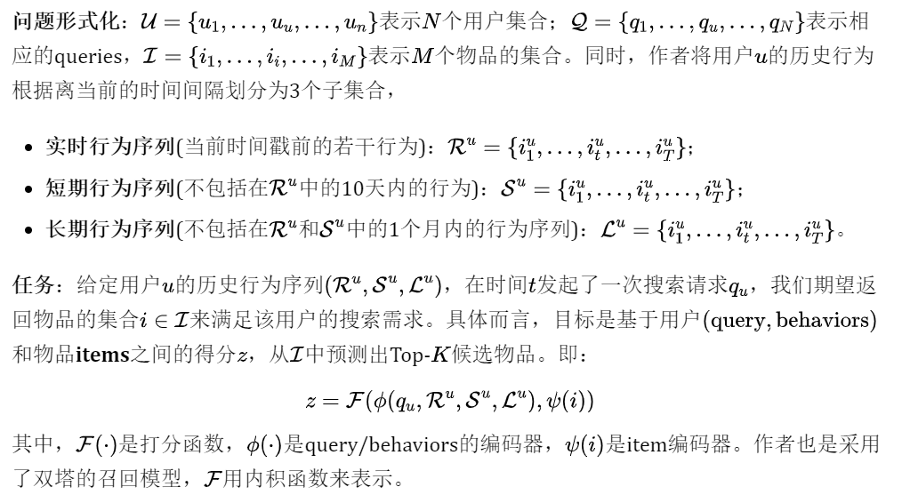
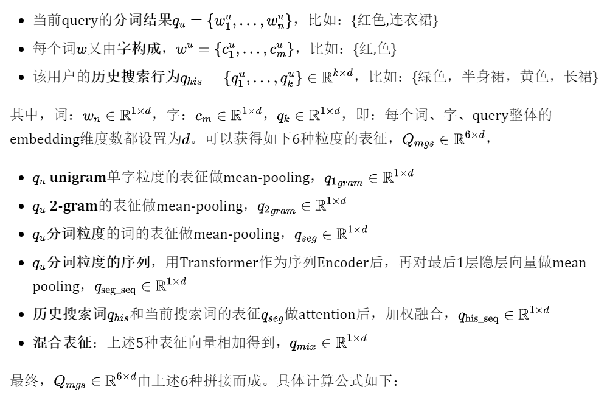
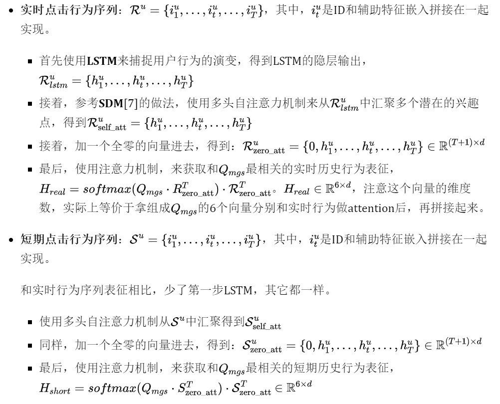
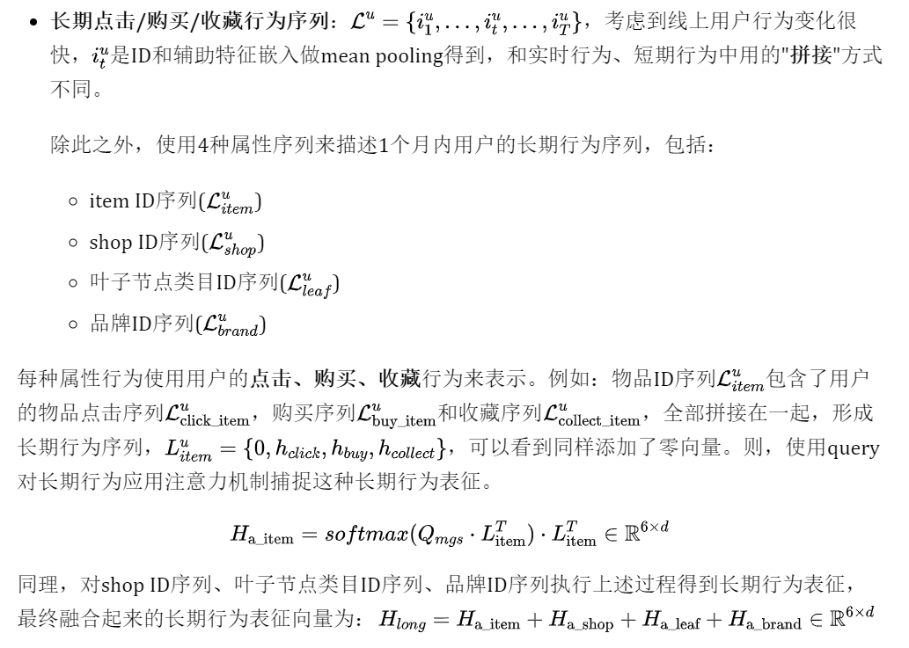
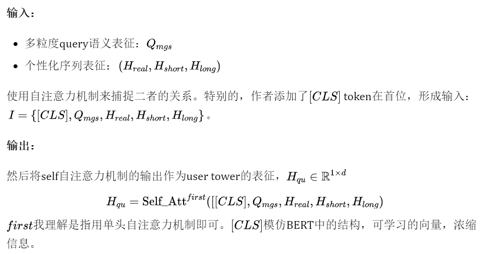
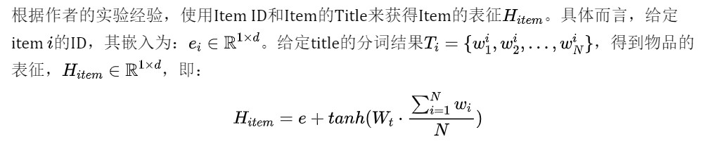
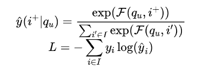
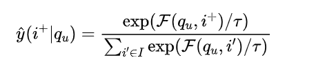
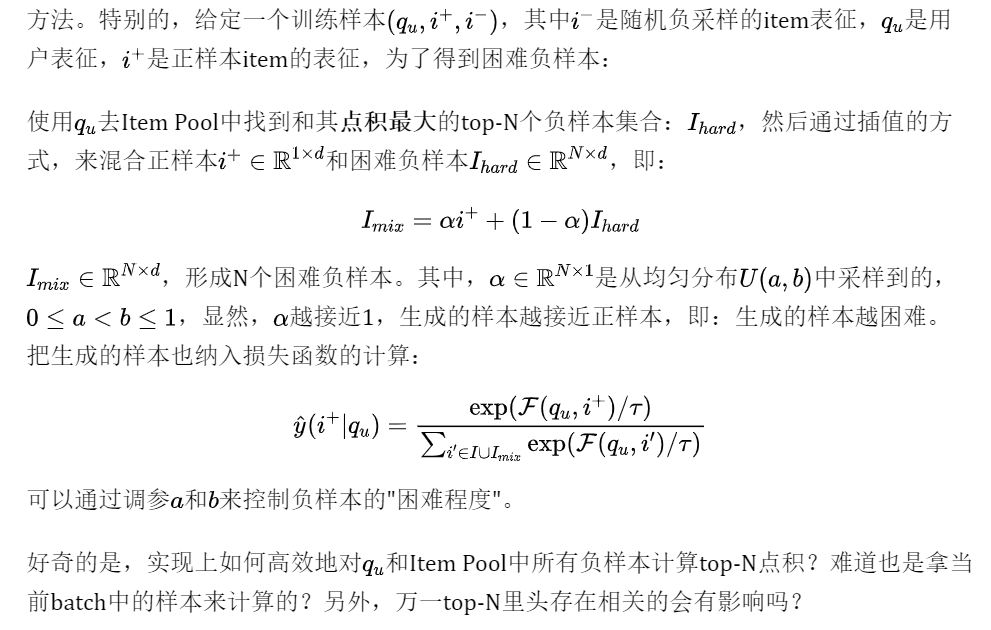

KDD'21 的 Applied Data Science Track 中，淘宝搜索发表的一篇 EBR 文章 [9]：**Embedding-based Product Retrieval in Taobao Search**。论文要讨论的几大问题提前预览下：  

*   搜索场景中，query 如何**充分地进行语义表征**？电商平台的 query 通常是短 query，如何对有限长度的 query 进行充分的语义表征？
    
*   搜索场景中，**用户历史行为序列如何建模**？如何防止**引入和当前 query 无关的历史行为**导致相关性问题？
    
*   搜索场景中，基于向量的检索系统 (EBR) 如何**保证相关性**？EBR 是基于向量的检索，不是完全匹配的检索，很容易检索到和当前 query 不相关的商品，那么该如何保证相关性？
    

下面按照 **Motivation，Solution，Evaluation 和 Summarization** 来介绍。

1.Motivation
=============

**研究对象**：电商平台的商品搜索引擎 (product search engines)。

**整体淘宝搜索系统包括四阶段**：match-prerank-rank-rerank，召回，粗排，精排，重排。本文重点在于召回。

淘宝商品搜索系统

**挑战**：电商平台的文本通常较短，没有语法结构，因此要考虑海量的用户历史行为。基于词匹配 (lexical matching) 的搜索引擎(倒排索引)，性能好、可控性强，尽管存在一些语义鸿沟问题，但仍被广泛的应用在现有的搜索引擎架构中。但是，这种搜索引擎无法有效区分**相同 query 下**， 不同用户的**兴趣差异**，无法捕捉用户**个性化**的特征。因此，如何**高效**地检索出【最相关】、【最能够满足用户需求】**的商品，权衡**【query 语义】和【用户个性化历史行为】之间的关系，是电商平台主要的挑战。

**工业界经典的 EBR 系统文章有，**

**电商平台：**

*   [1] **亚马逊**：Priyanka Nigam, Yiwei Song, Vijai Mohan, Vihan Lakshman, Weitian Ding, Ankit Shingavi, Choon Hui Teo, Hao Gu, and Bing Yin. 2019. **Semantic product search**. In Proceedings of the 25th ACM SIGKDD International Conference on Knowledge Discovery & Data Mining. 2876–2885.
    
*   [2] **京东**：Han Zhang, Songlin Wang, Kang Zhang, Zhiling Tang, Yunjiang Jiang, Yun Xiao, Weipeng Yan, and Wen-Yun Yang. 2020. **Towards Personalized and Semantic Retrieval: An End-to-End Solution for E-commerce Search via Embedding Learning**. arXiv preprint arXiv:2006.02282 (2020).
    

**其它：**

*   [3]**Facebook**：Jui-Ting Huang, Ashish Sharma, Shuying Sun, Li Xia, David Zhang, Philip Pronin, Janani Padmanabhan, Giuseppe Ottaviano, and Linjun Yang. 2020. **Embedding-based retrieval in facebook search**. In Proceedings of the 26th ACM SIGKDD International Conference on Knowledge Discovery & Data Mining. 2553–2561.
    
*   [4] **百度**：Miao Fan, Jiacheng Guo, Shuai Zhu, Shuo Miao, Mingming Sun, and Ping Li. 2019. **MOBIUS: towards the next generation of query-ad matching in baidu’s sponsored search**. In Proceedings of the 25th ACM SIGKDD International Conference on Knowledge Discovery & Data Mining. 2509–2517.
    
*   [5]**Google**：Tao Wu, Ellie Ka-In Chio, Heng-Tze Cheng, Yu Du, Steffen Rendle, Dima Kuzmin, Ritesh Agarwal, Li Zhang, John Anderson, Sarvjeet Singh, et al. 2020. **Zero-Shot Heterogeneous Transfer Learning from Recommender Systems to Cold-Start Search Retrieval.** In Proceedings of the 29th ACM International Conference on Information & Knowledge Management. 2821–2828.
    

作者指出上述大多数文章**避重就轻**，只强调在指标上提升很多，却没有说明**向量召回会降低相关性**，引入很多相关性的 CASE。

作者也部署了向量检索系统在淘宝搜索中，观察了很长一段时间，有几个发现：

*   短期效果很好；长期来看，基于 embedding 的方法由于不是词匹配，即：缺乏【**完整匹配** (exact match)】query 所有 terms 的能力，很容易造成相关性 BAD CASE。
    
*   **为了能够保证相关性**，作者采用了一个相关性控制模块，来对检索到的商品做过滤。控制模块对 EBR 检索后的结果，做进一步的完整匹配过滤，只保留那些能够**完整匹配**结构化字段的商品，给到后续的排序阶段。作者统计了下，这几乎会过滤掉 30% 的商品，即：30% 的商品相关性较低，被过滤的商品既耗费计算资源，又不能够参与到后续精排，导致本来可以进入后续排序的相关性商品无法进入排序，整体指标下降。
    
*   因此，本文的主要目标是期望基于向量的模型能够检索到**更多相关的商品**，**有更多相关的商品**能够参与到后续排序阶段中，从而在保证相关性的前提下，提高整个系统的线上指标。
    

**这篇文章的核心贡献总结如下：**

*   **模型**：提出了一种**多粒度深度语义商品检索模型** (Multi-Grained Deep Semantic Product Retrieval (MGDSPR) Model)，能够动态地捕捉用户搜索语义和个性化交互历史行为的关系，兼顾**语义**和**个性化**。
    
*   **训练和推理的一致性**：为了保证训练和推理的一致性，使得模型具备全局比较能力，除了使用随机负采样外，作者还采用了 softmax 交叉熵损失函数，而不是 hinge pairwise 损失函数，因为后者只具备局部比较能力。
    
*   **相关性保证**：提出了两种不需要额外训练过程，就能够保证检索到更多相关商品的方法。1. 即：**在 softmax 基础上引入温度参数**，对用户隐式反馈 (点击数据) 进行相关性噪声的平滑。2. **混合正样本和随机负样本**来产生 " **相关性增强** " 的困难负样本。进一步，作者采用了**相关性控制模块**来保证 EBR 系统的相关性。
    
*   **实验和分析**：在真实的工业级数据上，阐明了 MGDSPR 的有效性。进一步分析了 MGDSPR 对**搜索系统每个阶段**的影响，介绍了应用向量检索在商品搜索过程中的宝贵经验。
    

2.Solution
===========

先介绍下**整体的网络框架结构**：

MGDSPR 网络结构

典型的**双塔结构**，在 user tower 部分做的比较重，item tower 部分做的比较轻量。user tower 输出的用户表征向量和 item tower 输出的物品表征向量做点积得到预测值，再使用 sampled softmax 损失函数在全局 item pool 中进行优化。其中，

*   **user tower** 包含三个重量的部分，
    
    分别对应图中 user tower 的左侧、中间和上半部分。
    
    *   query 语义表征；
    
    *   用户实时、短期、长期历史行为序列个性化表征；
    
    *   以及二者如何融合起来的组件。
    
*   **item tower** 包含三个轻量的部分，
    
    *   item ID；
    
    *   item 的辅助信息；
    
    *   以及二者如何融合起来的组件。
    
*   **优化**：
    
    *   sampled softmax 损失函数。
    
    *   优化策略：温度参数对训练集进行噪声平滑、在 embedding 空间生成困难负样本。

下面将分别围绕上述三个部分 user tower， item tower 和优化方法展开，最后介绍系统架构。

2.1  User Tower
---------------

### 2.1.1 多粒度语义单元 (Multi-Granular Semantic Unit)

淘宝搜索的 query 通常是中文。经过 query 分词后，每个分词结果的长度通常小于 3。因此，作者提出了一种【**多粒度语义单元**】来多粒度地挖掘 query 语义。具体而言，输入：

其中，Trm即为 Transformer，$q_{his}$的计算同$q_{seg}$。

可以看到，作者从两个方面来充分地对 query 进行语义表征，**由此可以回答开篇的第一个问题**，query 如何**充分地进行语义表征**？

*   query **字面上的组织方式多样**：字粒度，2-gram 粒度，词粒度。
    
*   query 的**表征方法多样**：pooling，transformer，concat，addition 等。
    

当然，只讲结果，没有讲为什么这么做。有点过于经验性 / 实验性驱动，而不是问题 / 动机驱动。

### 2.1.2 用户行为注意力机制 (User Behaviors Attention)

用户行为包括：用户的**实时、短期或长期**的点击或者购买行为。用户u在时刻t点击 item i，用$i^u_t$来表示。对于物品$i^u_t$的表征向量，首先使用 ID 和 side information(叶子类目、一级类目、品牌和所属店铺) 做嵌入，然后对得到的嵌入向量**做 pooling 或者拼接在一起。**

不同于广告和推荐场景中常用的 **target-item 注意力机制** (如 DIN，DIEN 等)，此处使用 query 注意力机制来捕捉**用户历史行为**和**当前 query** 的**语义相关性**。目的是发现哪些**历史行为**和本次 query **相关**，来**丰富用户在当前 query 下的语义 / 意图表征**。比如：历史购买行为，篮球鞋、裙子，此次搜索 query 是红裙，显然篮球鞋历史行为 (可能送人的) 对此次 query 毫无帮助，直接引入还会带来噪声，而裙子历史行为对此次 query 是有帮助的。

具体而言，在搜索场景中，用户的**历史行为**和**当前 query** 可能**都无关**，参考 [6] 的做法，作者加了一个**全零的向量**到用户的**行为数据**中，来消除**潜在噪声**和解决**用户历史行为和当前 query 可能完全无关**的情况。

**个人认为这个优化点非常巧妙，**如果不加全零向量，模型无论如何都会**强制关注到至少一个行为，**这在历史行为**和当前 query 都无关**的时候**，**显然是噪声**。**加了零向量后，在**完全无关**的时候，模型 **attend 到这个零向量**即可**，**不会引入额外的噪声。个人认为这个优化点在**搜索场景中至关重要**，也是和推荐场景差别较大的地方，鲜有论文会提到这点。

接下来介绍如何融合用户的**实时行为、短期行为和长期行为。**

**由此可以回答开篇的第二个问题**，query 注意力机制而非 target-item 注意力机制以及引入零向量，能够保证捕捉和 query 相关的历史行为信息。

### 2.1.3 语义表征和个性化行为表征融合 (Fusion of Semantics and Personalization)

2.2 Item Tower
--------------

其中，Wt是可学习的变换矩阵。作者表示，通过实验发现，使用 LSTM、Transformer 等来捕捉 title 上下文感知的表征，其效果还不如上述简单的 mean-pooling。给出的理由是：大部分的 title 由关键词堆叠而成，且缺乏语法结构。个人理解，可能想说字面上的语义信息足够凸显，上下文信号较弱，不需要复杂的模型来捕捉语义。

2.3 Loss Function
-----------------

为了保证训练时的样本空间和在线推理时的样本空间一致，大部分工作会使用随机负采样的方法。但是这些工作都采用了 pairwise hinge loss 作为损失函数，只能进行局部的比较，和在线推理时需要的全局比较不一致。为此，作者使用了 softmax 交叉熵损失函数，具体而言，给定正样本$i^+$，

I是全部的 item 集合。实际上就是 softmax 交叉熵损失，然后因为I的数量很大，使用 sampled softmax 来优化即可。此处没有太大的创新点。在 sampled softmax 中，仍然需要负样本，参考 [2] 京东的做法，作者使用同一个 batch 内的其它样本作为当前正样本$i^+$的负样本对，这个效果和使用随机任意的样本作为负样本差不多，而前者还能省不少计算资源。

接着，为了提高 EBR 系统的相关性，增加更多相关性的样本进入后续的排序阶段。作者提出了两种优化策略，

*   **对训练集中的样本进行噪声平滑**：作者引入了温度参数。此处也没有什么太大的创新点。τ无穷小时，相当于拟合 one-hot 分布，无限拉大正样本和负样本之间的差距；τ无穷大时，相当于拟合均匀分布，无视正样本还是负样本。作者认为，训练集中用户的点击和购买行为包含有不少噪声数据，不仅受到 query-product 相关性的影响，也受到图片、价格、用户偏好等诸多因素的影响，即用户点击 / 购买的 item 不一定和 query 相关，如果一味地拟合点击 / 购买行为，可能会带来很多相关性问题，因此引入温度参数来平滑，温度参数参数越大，则平滑的作用越明显，让模型不去过分关注点击样本，也花点 "心思" 去关注没有点击但是可能是相关的样本。形如：
    
    
    
* **生成相关性增强的困难负样本**：先前有些工作 [8] 会引入额外的人工标注数据来提升 EBR 模型的相关性。和这些工作不同，作者提出了一种在 embedding 空间自动生成困难负样本的方法。

  

**由此可以回答开篇的第三个问题**，通过引入温度参数进行噪声平滑以及生成困难负样本来保证 EBR 系统的相关性。

2.4 系统架构
--------

最后，我们来欣赏下淘宝搜索引擎的系统架构。

淘宝搜索引擎架构

**搜索的整个过程如下：**

*   用户发起一次请求
    
*   触发多通道检索系统，形成未排序的商品集合
    
*   基于倒排索引的文本匹配
    
*   基于 Item 的协同过滤
    
*   **基于向量的检索**
    
*   多阶段排序
    
*   粗排
    
*   **相关性排序**
    
*   精排
    
*   重排
    
*   混排：商品、广告、多模态内容
    

本文重点在基于向量的检索：

*   **离线**：使用分布式 Tensorflow 对过去 **1 周内**的搜索日志数据进行训练，**天级更新**模型参数。
    
*   **部署**：item tower 离线算好所有 product 的向量，并存在 ANN 索引系统里，product 量级巨大，分片存，共 6 列，借助层次聚类算法做量化降低存储开销 (实际上猜测就是 Faiss)；query/user network 做实时 serving。实际检索的时候，能够实现类似布尔检索系统的高效检索。笔者当时针对 Facebook[3] 的文章，花了很长的时间做调研和理解，详细地写过一篇 ANN 检索的底层工程实现细节，感兴趣的可以参考下，语义向量召回之 ANN 检索：[语义向量召回之 ANN 检索](http://mp.weixin.qq.com/s?__biz=MzU0MDA1MzI0Mw==&mid=2247483783&idx=1&sn=2b510e0c24b5d9774d7ec144ddaed319&chksm=fb3e5a13cc49d3055562d06897f3dda1f92e865263928f98a3be91359d22416e44fdd7991ff0&scene=21#wechat_redirect)。
    
*   **性能**：实时检索 9600 个 item。98% 的 item 在 10ms 内能检索完，即：98 线为 10ms。很强的性能了。
    

部署

还有个很重要的相关性模块还没有介绍。开篇提到过，EBR 检索系统在**个性化和模糊匹配方面做的很好**，但是相关性上缺点也很大。归根结底在于，EBR 不是完全匹配的方式，在搜索里，其实就是指不是 Term Query。也即，结构化检索，比如品牌，颜色，类型等结构化字段，这些结构化字段能够很大程度上保证相关性。但是 EBR 却做不到这点。

比如：用户检索阿迪达斯运动鞋，那么完全匹配查询能够去检索品牌：阿迪达斯，类目：运动鞋；但是 EBR 可能在 embedding 空间检索到耐克运动鞋，这显然是不相关的，会影响用户的体验。

因此，作者在 ANN 结果的后面，又加了层相关性控制模块，对 query 进行了查询理解，识别出品牌、类目等意图，然后对 item 的 title 中也挖掘出品牌、类目等结构化字段，然后用这些查询理解的意图对 item 做 term query，过滤掉未命中这些结构化字段取值的 item。

作者还提到，Facebook[3] 的文章是通过 EBR 系统来弥补基于完全匹配的检索系统在个性化、模糊匹配上的不足；而淘宝搜索相关性控制模块的出发点相反，是通过基于完全匹配的检索系统来提升 EBR 系统的**相关性**。总之，二者相辅相成。

3.Evaluation
=============

离线实验以及实现细节也是工业界文章的核心亮点，值得大家好好品。

3.1 Settings
------------

*   **离线指标**：
    
*   Recall@K。用户点击或者购买的 item 作为 ground truth，去预测 Top-K Item。作者提到，在检索阶段，用 AUC 做离线指标时，和线上的 GMV 指标无法保持一致，而召回指标则可以。
    
*   $P_{good}$。相关性指标，Top-K 结果中有多少个结果和 query 强相关，即：相关 item 的数量比例。是否相关的 label 不是人工标注的，而是采用了一个很强的相关性模型 (在单独的人工标注数据集上的 AUC 能够达到 **0.915**) 来打标。
    
*   $Num_{prank}, Num_{rank}$。衡量 EBR 检索系统对各个阶段的影响指标。即：预测的 Top-K Item 中，有多少个**和 query** **相关**的 Item 会进入后续的各个排序环节，进入越多，说明相关性保证的越好。
    
*   **在线指标**：
    
*   `GMV = #pay amount.`
    
*   线上相关性标注指标，$P_{good}$展示给用户的 item 中，和 query 相关的 item 的数量占比，$P_{good}$和$P_{h\_good}$，前者用模型打标，后者外包标注。
    
*   **实现细节**：
    
*   **网络结构：**
    
*   实时行为序列最大长度 50，长短期行为序列最大长度都是 100，超过的 mask 掉，使用带 mask 机制的 attention 实现即可。
    
*   user tower, item tower, LSTM 等结构的隐层维度数为 128。
    
*   实时行为中，LSTM 结构 2 层，dropout=0.2，LSTM 之间加残差连接，自注意力机制头的数量是 8。
    
*   **训练：**
    
*   batch 大小为 256。
    
*   困难负样本中，均匀分布 a 和 b 的值为 0.4，0.6；生成的困难负样本数量为 684。
    
*   温度参数。
    
*   随机初始化所有参数。
    
*   AdaGrad，初始学习率 0.1。
    
*   梯度裁剪，当梯度的 L2 范数超过 3 时做裁剪。
    
*   **配置：**
    
*   分布式机器学习平台，20 个参数服务器，100 个 GPU 作为 worker，配置是 Tesla P100。
    
*   训练时间：3500 万步，耗时 54 小时。
    
*   **数据集，**
    
    淘宝真实的搜索行为数据集，2020 年 12 月连续 8 天的点击和购买日志，过滤掉了作弊用户行为。
    
    全量的候选 item 的数量级是 1 亿，和线上真实推断时的候选集保持一致。
    
*   **训练集**：前 7 天作为训练集，约 47 亿条（item 维度的）。
    
*   **测试集**；从第 8 天中，随机从搜索系统数据中抽 100W 条数据；从推荐系统数据中抽 50W 条购买数据。
    

3.2 离线对比实验
----------

*   **Baseline**：$\alpha$-DNN，MLP 结构，很强的 baseline。静态特征，统计特征，序列特征做 pooling 作为输入。(怎么训练的没说清楚，二分类还是本文的训练方法？)
    
*   **MGDSPR**：本文的方法，如上文所述。作者提到一点，加入统计特征到 MGDSPR 中，recall 指标并没有提升。挺神奇的，可能行为序列信息捕捉地足够好，不需要过多统计特征。
    
    对比实验
    

提升还是挺大的，尤其是相关性样本的占比，以及进入粗排的相关性 item 的数量，说明 EBR 提前考虑了相关性后，在相关性控制模块中不会被过滤太多不相关的 ITEM，有更多的相关 ITEM 进入后续的排序环节。

3.3 消融实验
--------

几大组件，唯一没说清楚的是，不使用 mgs, trm 等时，用的什么做 baseline？拼接？

*   mgs：2.1.1 中提出的多粒度语义单元，对 recall 和相关性指标都有用。
    
*   trm：2.1.3 中的语义表征和个性化行为表征做融合，对 recall 和相关性指标都有用。
    
*   τ：2.3 中的温度参数。对召回指标负向，但是对相关性指标提升非常显著。
    
*   $I_{mix}$，对召回指标负向，对相关性指标帮助大。
    

消融实验

看了消融实验，对召回指标帮助大的是 mgs 和 trm；对相关性指标帮助大的是温度参数和困难负样本。

3.4 Online A/B Test
-------------------

线上 A/B 实验

有挺大的线上指标提升。

其它的分析实验比较常规，总结下来就是：

*   softmax 收敛速度比 pairwise loss 快，recall 指标也高不少。
    
*   温度参数和困难负样本对相关性的提升很大。
    

4.Summarization
===============

总体而言，这篇文章干货很多，细读会发现很多细节。有几大亮点，

*   **多粒度语义单元**，对 query 语义的多粒度挖掘和表征，值得在搜索场景中尝试。
    
*   **用户行为序列在搜索场景中的建模方法**，query attentive 而不是 target-item attentive 以及零向量的引入是最大亮点，长短期融合等也值得实践。
    
*   **EBR 系统对相关性的保证**，softmax 损失函数 + 温度参数；在 embedding 空间生产困难负样本。
    

**个人认为还有几个疑问没解释清楚：**

*   **多粒度语义单元结构如此复杂**，里头每个组件都是有效的吗？过于 empirically/experimentally 实验驱动，而不是问题驱动。
    
*   **困难负样本生成的时候**，如何高效地对所有 Item 求点积最大的 top-N？这里头 Top-N 是否有可能存在和当前 query 相关的 item，是否会产生负面影响？
    
*   **相关性模块**：EBR 和完全匹配的 Term Query 结果取交集保证相关性，那和直接用完全匹配做召回相比，增益在哪里？我理解这种只可能在**完全匹配召回**的候选集合 item 数量远大于排序候选集合 item 数量的时候才有效，EBR 提前考虑了个性化因素，能够防止满足个性化需求的 item 无法进入排序阶段。
    
*   **实验的一些细节**，baseline 的训练方式没说清楚。消融实验中，不使用那 4 个组件时，模型用什么方式替代没说清楚。
    

不过总的来说，同以往的 EBR 文章一样，值得细读和实践！

这是 KDD 21 工业界文章的第一篇分享，更多 KDD 21 工业界文章参见下文，[KDD2021| 工业界搜推广 nlp 论文整理](http://mp.weixin.qq.com/s?__biz=MzU0MDA1MzI0Mw==&mid=2247485942&idx=1&sn=8dd2ba17e8b2c95b77e53a21a1fbb046&chksm=fb3e5262cc49db744cc098389da789f028642c01b449f9ccde702d98678b5be42713f0b9ab8e&scene=21#wechat_redirect)。

* * *

References  

=============

[1] Priyanka Nigam, Yiwei Song, Vijai Mohan, Vihan Lakshman, Weitian Ding, Ankit Shingavi, Choon Hui Teo, Hao Gu, and Bing Yin. 2019. **Semantic product search**. In Proceedings of the 25th ACM SIGKDD International Conference on Knowledge Discovery & Data Mining. 2876–2885.

[2] Han Zhang, Songlin Wang, Kang Zhang, Zhiling Tang, Yunjiang Jiang, Yun Xiao, Weipeng Yan, and Wen-Yun Yang. 2020. **Towards Personalized and Semantic Retrieval: An End-to-End Solution for E-commerce Search via Embedding Learning**. arXiv preprint arXiv:2006.02282 (2020).

[3] Jui-Ting Huang, Ashish Sharma, Shuying Sun, Li Xia, David Zhang, Philip Pronin, Janani Padmanabhan, Giuseppe Ottaviano, and Linjun Yang. 2020. **Embedding-based retrieval in facebook search**. In Proceedings of the 26th ACM SIGKDD International Conference on Knowledge Discovery & Data Mining. 2553–2561.

[4] Miao Fan, Jiacheng Guo, Shuai Zhu, Shuo Miao, Mingming Sun, and Ping Li. 2019. **MOBIUS: towards the next generation of query-ad matching in baidu’s sponsored search**. In Proceedings of the 25th ACM SIGKDD International Conference on Knowledge Discovery & Data Mining. 2509–2517.

[5] Tao Wu, Ellie Ka-In Chio, Heng-Tze Cheng, Yu Du, Steffen Rendle, Dima Kuzmin, Ritesh Agarwal, Li Zhang, John Anderson, Sarvjeet Singh, et al. 2020. **Zero-Shot Heterogeneous Transfer Learning from Recommender Systems to Cold-Start Search Retrieval.** In Proceedings of the 29th ACM International Conference on Information & Knowledge Management. 2821–2828.

[6] Qingyao Ai, Daniel N Hill, SVN Vishwanathan, and W Bruce Croft. 2019. **A zero attention model for personalized product search**. In Proceedings of the 28th ACM International Conference on Information & Knowledge Management. 379–388.

[7] Fuyu Lv, Taiwei Jin, Changlong Yu, Fei Sun, Quan Lin, Keping Yang, and Wilfred Ng. 2019. SDM: **Sequential deep matching model for online large-scale recommender system**. In Proceedings of the 28th ACM International Conference on Information & Knowledge Management. 2635–2643.

[8] Thanh V Nguyen, Nikhil Rao, and Karthik Subbian. 2020. **Learning Robust Models for e-Commerce Product Search**. arXiv preprint arXiv:2005.03624 (2020).

[9] **Embedding-based Product Retrieval in Taobao Search**: https://arxiv.org/abs/2106.09297

# 参考资料

https://mp.weixin.qq.com/s/qJ0IRGnCndPyhdu514dMXA