# 爱奇艺搜索排序算法实践

[https://www.iqiyi.com/v_ht1oevcbiw.html](https://www.iqiyi.com/v_ht1oevcbiw.html)

搜索场景

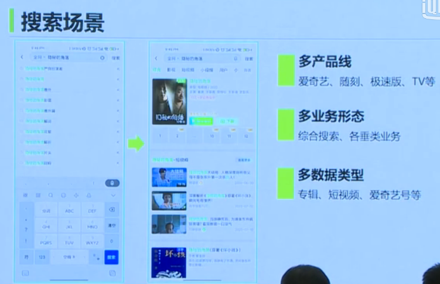

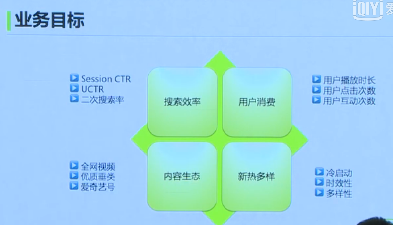

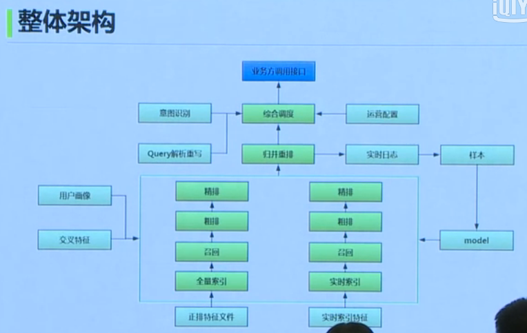

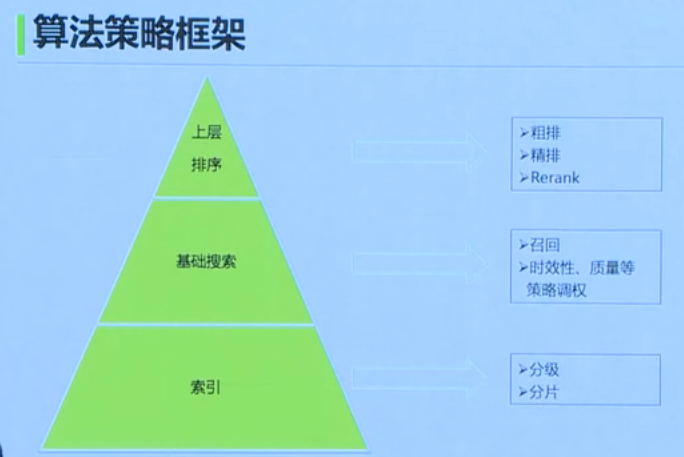

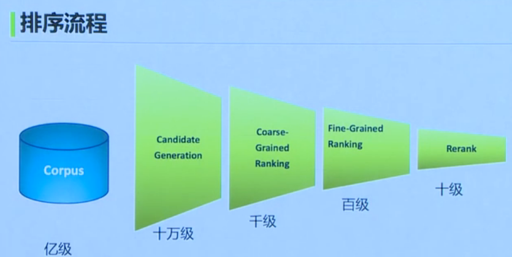

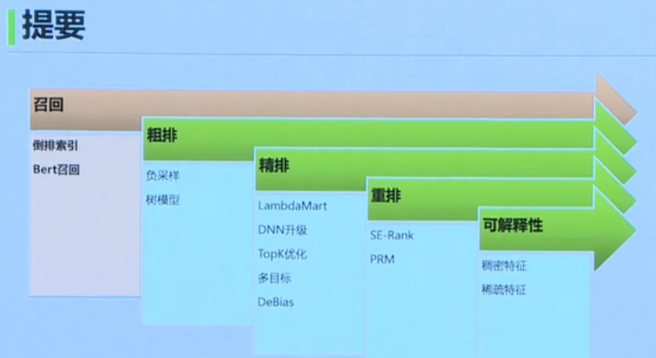

召回

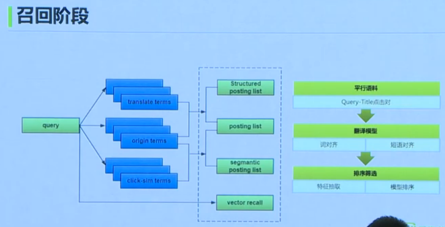

点击相似的term：用二部图

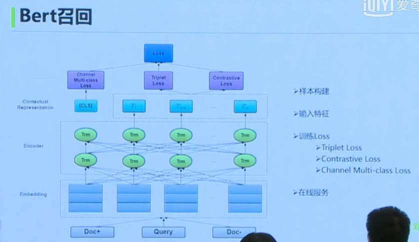

排行较低的Doc作为负样本，。。。

词序列，Doc title；翻译；导演等

粗排

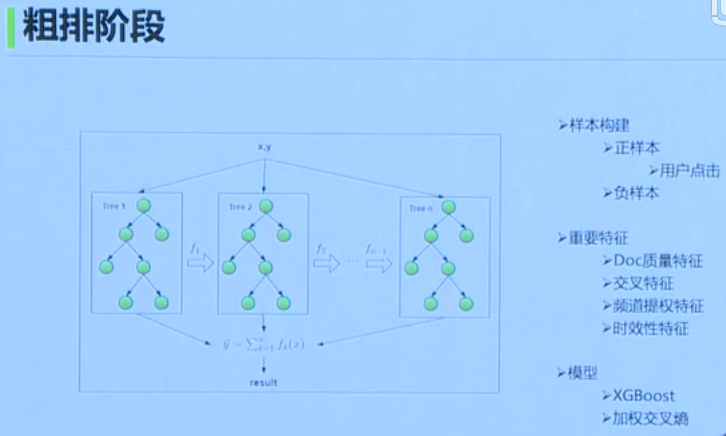

精排

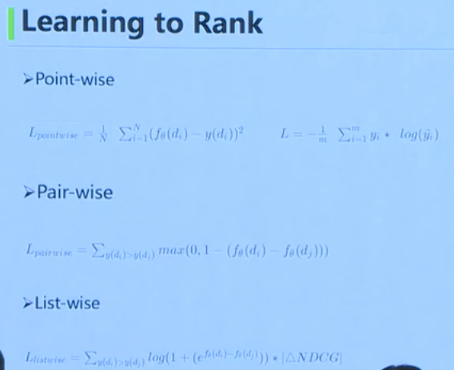

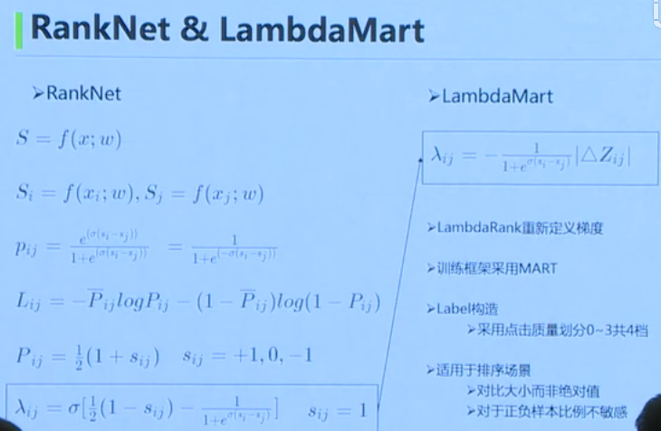

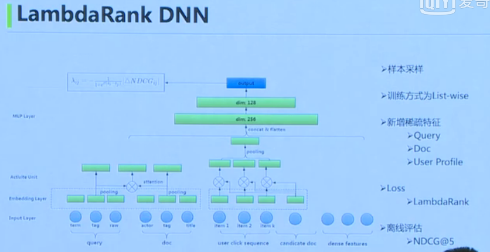

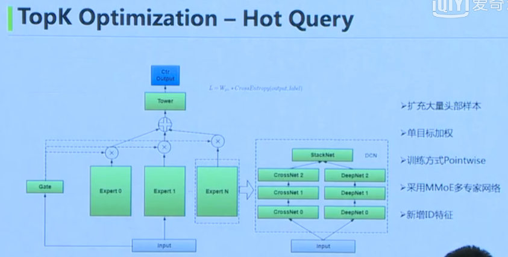

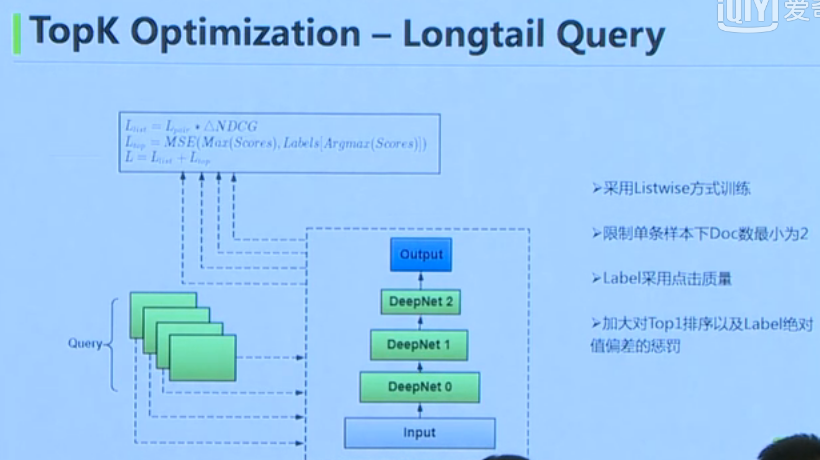

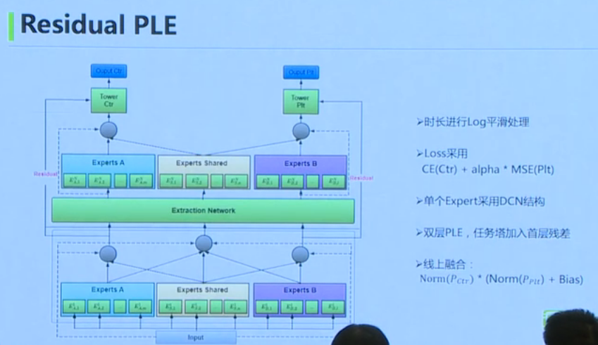

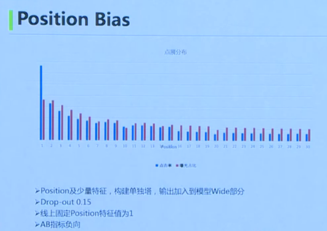

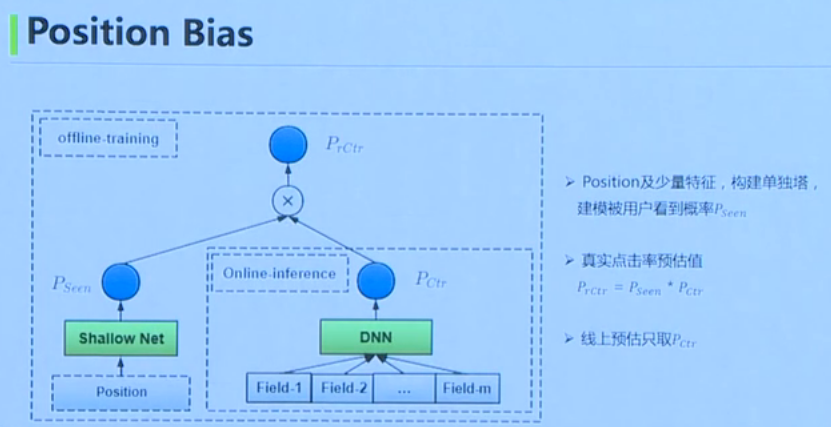

重排

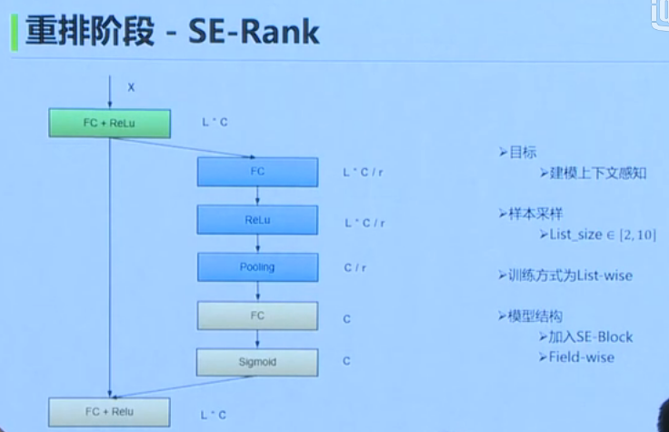

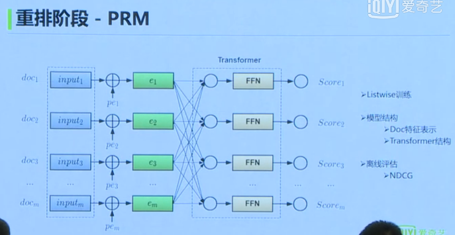

可解释性

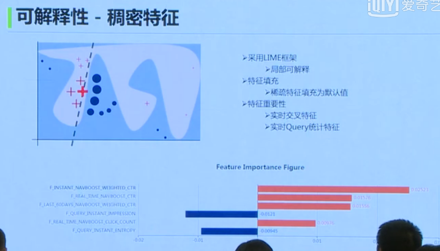

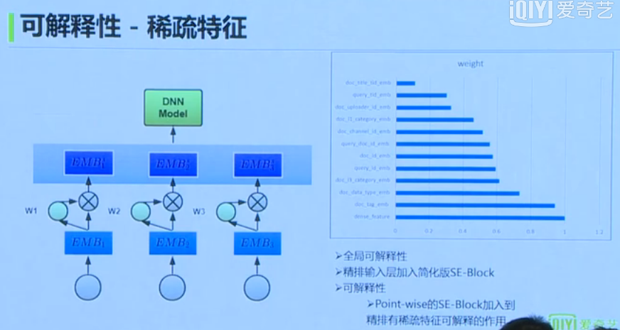

