# 搜索

## Query理解是什么

Query理解是对用户检索串分析、理解用户意图的过程，是一个标准的自然语言处理的任务。自然语言理解是一个非常复杂的过程，一方面体现在多词一义（同一种需求有若干种不同的表达）；另一方面体现在一词多义（苹果可能是水果，也可能是iphone手机）。现有自然语言理解的大量工作也都致力于解决多词一义和一词多义这两个问题。

下面以一个query为例介绍query理解的操作：

|Query|蚊帐的失恋33天在线观看|
|---|---|
|Query纠错（qc）|文章的失恋33天在线观看|
|切词|文章 / 的 / 失恋 / 33天 / 在线 / 观看|
|Phrase|失恋33天|
|NER|文章（人名）；失恋33天（电影）|
|词权重|文章 0.45 / 的 0.04 / 失恋 0.82/ 33天 0.91 /在线 0.24/ 观看 0.22|
|一查非必留|的 在线  => 文章失恋33天换看|
|二查非必留|文章 的 在线 观看 => 失恋33天|
|同义词|在线观看 => 在线播放|
|时新性（qfrd）|0.2（时新性一般）|
|Query改写|放映失恋33天、文章的失恋三十三天|
|Query意图|影视 - 播放|
|Query商业价值|0.68（商业价值高）|
|topic model|娱乐，电影|

从上文中看出实现搜索引擎“更懂你”，并不是很容易的事情，简单的一个query需要大量模块的分析和计算。query理解不仅帮助理解用户意图，同时对文档的召回和排序骑着重要的基础作用。

## 召回

召回是对于输入query，能够高效的获取query相关的候选doc集合。召回对于搜索引擎起着致命性的作用。因为一旦相关的doc不能够被召回，即使后面的相关性排序做好的再好，也是徒劳。尤其在doc资源不是很丰富的搜索场景下，召回更是一个比较明显的问题。

**首先面临的问题是索引粒度问题**。我们知道召回是通过倒排索引求交得到的，当以词为粒度，粒度较细，召回的文章的数目较多，但也可能由于倒排过长把一些相关的结果误截断；当以更大的phrase粒度，粒度较粗，召回的文章相对更相关，但也容易造成召回的结果过少。

**其次召回要能够保证有一定的召回文章数**。query大部分模块都是为了解决召回问题，比如非必留，同义词，纠错。这是因为query和doc往往会存在描述不一致的问题。比如query是“如何考取广大的研究生？”，但大部分doc都是讲广州大学的研究生。因此需要将广大同义成广州大学才能正确的召回一些相关文章。用户query也会存在一些错误query，比如刘德花，这时系统需要将query纠错成“刘德华”，才能正确的召回一些相关文章。用户query也会存在和doc不是完全匹配的情况，尤其是对于长query，比如“无问西东电影的主演是谁？”，如果要求原搜索串完全命中，可能导致召回结果数过少或零结果。这里分析“电影”是一个冗余的信息，“是谁”是一个不重要的词，其参不参与倒排的求交并不影响召回doc的相关性，这时召回时可以直接把这2个词直接丢掉。

**最后召回要保证结果的多样性。**尤其是对于短query。因为相比于长query，短query往往是一些实体，召回doc数往往不是关键问题，用户也希望有一些惊喜的结果，避免搜索结构都是一些类似或重复结果。query事件扩展，query改写都是为了解决召回的多样性问题。比如当用户输入“武汉大学”，如果只是返回一些武汉大学的百科、高考录取信息，可能对用户并没有什么吸引力。这是如果能将武汉大学能和最近比较热的“武汉大学 樱花”、“武汉大学 和服”关联起来，可能会有侧重召回扩展内容相关的doc，增加结果多样性。

前面讲的召回还主要都是基于字面召回，深度学习的发展使得语义召回是现在研究的热点和流行的方法。其思路是分为将query和doc表示成embedding，然后基于embedding计算得到一些相似的doc。这种召回方式虽然能够召回一些相关doc，但其不能保证一些最相关的文章被一定会被召回回来。一方面语义会漂移，另一方面embedding模型往往是黑盒模型，很难debug。

召回问题不仅在搜索里至关重要，在推荐，广告中同样是一个关键问题。并且不同应用的侧重点不太一样，比如搜索中更侧重召回doc的数量，推荐中更侧重召回结果的多样性。因此做好召回是保证后续模块的第一步。

## 相关性

相关性是为了计算query和返回doc的相关程度，也就是doc中的内容是不是满足用户query的需求。因此相关性计算就需要**充分的理解query和doc**。比如从quey角度，需要知道query中的哪些词比较重要，有没有实体成分，意图是什么？是要找药品的介绍还是要找药品的购买网站？query的时效性如何？是要找最新的事件新闻还是一般的事件介绍？从doc角度来看，需要理解doc的话题类型，doc的核心词，doc的文本质量，是否是标题党，是否是推销、广告、色情等页面？

充分的理解query和doc是非常有难度的，更进一步去计算query和doc相关性计算也存在很大挑战，比如以下几种场景：

1） query是歧义的，当用户搜索苹果时，是要找水果还是要找苹果手机？

2） query的意图不完全体现在term的匹配上，比如用户搜索“北京到上海的火车票”，doc“北京到上海的火车票的乘车体验”，虽然query完全紧邻命中doc，但用户要找的是火车票购买，并不是该doc；

3） query和doc的mismatched term对相关性也有很大的影响，而传统的相关性计算只考虑了matched term对相关性的贡献；  

4） query和doc很多时候需要从语义维度来判断是否相关，比如query“苹果手机多少钱？”和“iphone xs max的官方标价？”；

从计算场景来看，query是变化的，需要在线动态计算，因此通常都是一些简单快速的方法，做轻一些；doc相对静态的，偏离线运算，因此可以使用很复杂的模型事先把doc的相关属性计算好，做重一些。

从计算方法来看，主要分为**字面相关性和语义相关性**两个维度。字面相关性主要是根据term的匹配度来计算相关性，一个不足是无法处理一词多义或者多词一义，并且会忽略词之间的顺序，常用的方法是BM25方法。语义相关性是近些年来研究的热点，像SVD，Topic Model，Embedding等等都是为了计算query的doc和语义相关性。其核心思想在于分别将query和doc标称一个低位稠密向量，然后用其cosine距离表示其相似性。Emedding是最近常用的方法，类似word2vec，doc2vec，sent2vec，lstm等等。不过embedding最早出现的还是word embedding，在word的embedding表示上效果比较好。如何学习长文本、有oov的文本的embedding一直没有得到很好的解决。最近比较流行的bert进行了相关实验，效果也没有想象中的好。语义相关性的另外一个缺点是不太具有解释性，出现badcase只能大概猜个可能的原因。虽然embedding是个趋势，但字面相关性仍然是一个不可或缺的模块，起个断后的作用。

相关性模块扩展开来，可以认为是任意两个item的相关性计算。比如推荐是为了计算user和item的相关性，广告是为了计算user和ad的相关性。因此做好相关性计算是保证用户体验最核心的一步。

## 搜索排序

搜索排序不等于相关性排序

**1. 时效性**：当用户在阿里发财报的当天去搜“阿里财报”时，之前发布的财报旧文章从相关性上来说肯定没问题，而用户是想了解最新的财报，所以需要有限把新文章排到前面，这里称为时新性维度，其是衡量搜索引擎对突发性、周期性事件的快速响应程度。时效性检索在总搜索次数中可能占大头，毕竟都是热点事件导流的搜索需求。

**2. 权威性**：耳熟能详的PageRank便是为此而生，更泛的去理解，权威性可以理解成内容质量，如果用户看了一篇高质量的文章、权威的官方解答，相比于看了一篇标题党文章，其体验肯定是截然不同，这里称为权威性，其实是衡量搜索引擎对内容质量的理解程度 。同时内容质量也影响着搜索生态是否能健康发展，百度医疗搜索便是一个活生生的例子。

**3. 多样性**：多样性又可分为话题多样性和资源类型多样性。

- 话题多样性指当用户输入泛query时，其特点是无明显意图，但存在较多潜在意图。比如搜“糖尿病“，比较理想结果是top结果把关于糖尿病的病因、症状、预防、药物...等都能覆盖，则是一个好的话题多样性。
- 资源类型多样性是指，相比于都是文章类的结果，混合着文章、视频、音频等的搜索结果用户体验会更好。

**4. 场景性**：场景性则是具体搜索业务绑定的，也可理解成规则调序。比如置顶、插入在固定位置、根据检索和资源类型预定义一些槽位映射等。尤其当出现类似新冠肺炎的突发事件时，短时间排序模型很难立即调整，通常需要规则调序先顶上。

时效性、权威性和多样性的前提都是必须保证满足相关性。

- 相关性排序保证相关>不相关，
- 时效性排序保证相关&新>相关&旧>不相关；
- 权威性排序保证相关&高质量>相关&低质量>不相关；
- 多样性排序保证相关&多样>相关&重复>不相关。

搜索排序是个相互影响的复杂系统，不能通过一个端对端模型就能解决。

## Query词权重方法

query词权重（term weighting）是为了计算query分词后，每个term的重要程度。常用的指标是tf*idf（query中term的tf大部分为1），即一个term的出现次数越多，表明信息量越少，相反一个term的次数越少，表明信息量越多。但是term的重要程度并不是和term的出现次数呈严格单调关系，并且idf缺乏上下文语境的考虑（比如“windows”在“windows应用软件”中比较重要，而在“windows xp系统iphone xs导照片”的重要性就比较低）。词权重计算作为一种基础资源在文本相关性，丢词等任务中有着重要作用，其优化方法主要分为下面三类：

**1）基于语料统计**

**2）基于点击日志**

**3）基于有监督学习**

### 基于语料统计

**一、imp（importance的缩写）**

idf的一个缺点是仅仅依靠词频比较，imp从在query中的重要性占比基础上，采用迭代的计算方式优化词的静态赋权，其计算过程如下：

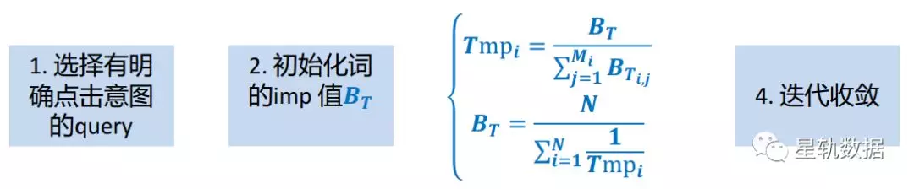

其中BT为term的imp值，初始值可设为1，Tmp_i是query中的第i个term的重要性占比，N指所有包含第i个term的query数目。

**二、DIMP（Dynamic imp）**

idf和imp的一个共同缺点是其都是静态的赋权。DIMP根据query的上下文计算每个term的动态赋权，其主要假设是任意query中的词权重可以由相关query 的词权重来计算，计算过程可分为两部分：

**1） 自顶向下的query树构建**

根据实际场景中采用不同的构建方法，这里介绍一种在搜索中的做法。如下图，给定query作为根节点，首先获取query的相关query作为第二层节点，在第二层的基础上，枚举相关query的子query作为第三层节点，最后一层为分词后的term节点。因此query树种的节点都是不同粒度的文本串，边都是文本串间的相关关系。在拍卖词推荐任务中，用户query都是比较短的关键词，其可以通过拍卖词间的共同购买关系构建对应的query树。

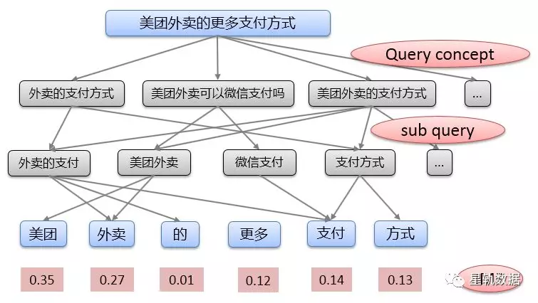

**2） 自底向上的term weight计算**

在生成query树后，叶节点的term可以赋上静态imp值，然后自底向上的计算query中的某个term的权重，其递归计算公式如下：

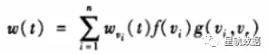

在imp向上传播中，不同的中间节点和边对词权重的贡献度是不一样的。因此需要一种策略去考虑节点和边的权重。同样不同的场景也有不同的计算方法，对应到上述公式中，分别对应叶子节点的初始权重，中间非叶子节点的权重，边的权重。

| | | |
|---|---|---|
| |节点|边|
|普通搜索|qv或satisfy=log（search）*（click/search）|两个query间的相似度或query间共点击次数；|
|拍卖词推荐|拍卖词的购买次数|两个拍卖词的共同购买次数|

下表给出不同词权重方式的对比结果，从结果可以看出，IMP和DIMP相比于IDF的weight更合理一些。但是DIMP存在部分query的树因此数据比较稀疏长尾很难建立有意义的query树。实际业务中，可以先尝试imp值，在场景合适的情况下，可以尝试DIMP方法。

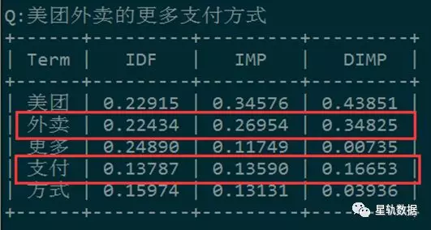

### 基于点击日志

点击日志在搜索、nlp任务中起着不可或缺的作用。点击日志是系统独有数据，区别于公开数据，是系统的有效反馈数据。几乎所有的搜索、nlp任务都可以见到点击日志的影子。

基于点击日志的词权重计算方法，其主要假设是长query的中term的权重可以由短query中的term的权重近似计算得到。假设要求Query：奔驰 汽车 发电 机 故障 怎么 办？中每个term的权重。如果能够分别知道子片段中哪个term比较重要，发电 机 故障、汽车 发电 机 故障、奔驰 汽车 故障、奔驰 汽车，那么query中的term权重可以由这些子片段中term的权重推导得到。问题转化成求frag中的词权重p(term|frag)和词丢弃概率pvte(term|frag)。

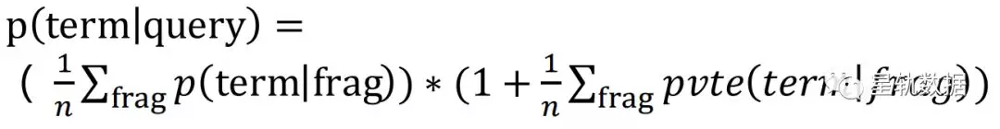

p(term|frag)是子片段frag中term的权重，表示term在子片段的权重越高，那么term在query的权重就越高；  

pvte(term|frag)是子片段frag中term的丢弃概率，表示term在子片段中越不重要，那么term在query中就越不重要；

p(term|frag)和pvte(term|frag)的计算方式比较类似，下面以“奔驰 汽车”为例介绍下p(term|frag)的计算方法：

**1) p(term|frag)**：如下图，对于“奔驰 汽车”，首先找到包含该frag的query集合，如果term在这些query中的权重比较重要，那么term在该frag中的权重也会比较大，此时问题转化成计算query中的term的权重p(term|frag)；

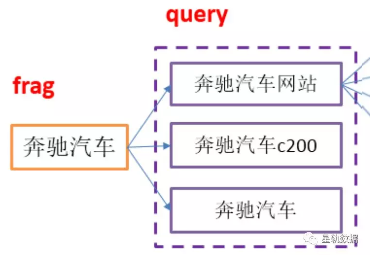

**2）p(term|query)**：如下图，给定query，首先获取query的相关query集合(称为qanchor)，那么在qanchor集合中出现次数较多的term一般会是query中比较重要的term。问题转化成寻找query的qanchor，也就是计算query的qanchor的相似度p(qanchor|query)。

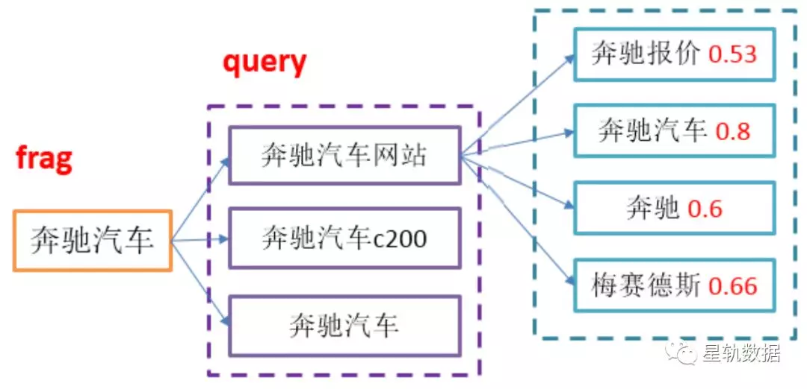

**3）p(qanchor|query)**：这里的计算方式就比较灵活，可以抽象成两个短文本的语义相似性计算。一种方式根据query-doc的点击信息计算query和qanchor的相似度，即query和qanchor的点击doc分布越相似，query的qanchor的相关性就越大。

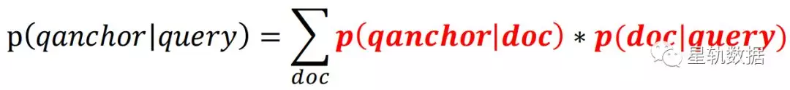

最后根据依次计算得到的条件概率值反推去求query中的term的权重。这种方法的优势是完全依赖点击日志，因为点击日志是实时更新，因此很适合离线滚动更新p(term|frag)，然后近实时的影响在线query中term权重计算。

### 基于有监督学习

有监督学习相比于无监督学习的效果一般会更好，但也存在需要大量标注样本、模型难以更新，结果难以debug的等问题。有监督学习一般有样本构造、特征表示、模型训练、模型评估四部分。

**1）样本构造**

样本构造之前需要定义任务的形式。如果把词权重看成分类任务，则可以按二分类（term重要为1，不重要0）或者多分类（term的重要等级）进行标注；如果是排序任务，则可以按pair-wise去标注样本，即标注两个term间那个term更重要；如果是回归任务，则需要标注每个term的权重。但是人工标注需要大量的时间，并且可能存在模棱两可的情况，因此可以采用自动的方法去构建样本。这里介绍一种基于百度元搜的回归方法，去拟合query中的词在搜索结果里的term recall weight，

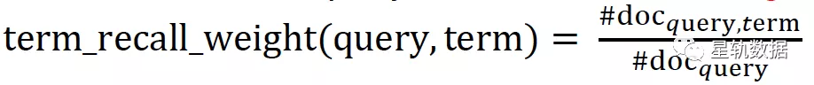

#doc(query)指搜索结果中doc数目，#doc(query,term)是搜索结果中包含term的doc数目。

**2）特征表示**

特征表示现在比较流行的是embedding表示，在该任务中，可以分为把query和term表示低维embedding向量，然后用query embedding和term embedding的距离表示成向量，如下图，term和query距离比较近，则表示该term比较重要，相反比较远，则没有那么重要。

fea(term,query) = embedding(term) - embedding(query)

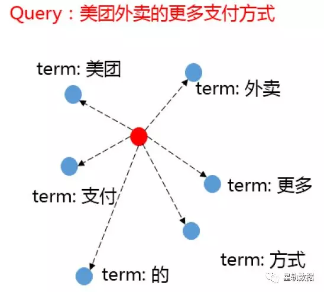

**3）模型训练**

因为是回归任务，这里可以采用linear regression或者GBRT，不过不同的模型对效果的影响并不大，因为任务的瓶颈还是在于样本构造和特征表示。

**4）模型评估**

模型评估一般分为直接评估和间接评估。直接评估采用模型本身的准确率或者人工评测，间接评估通常把词权重作为一种中间结果用于某个任务里面，通过任务的评价指标来反应词权重的质量。

### beyond 词粒度

前文介绍的词权重方法都是预测单个term的权重，在实际使用中，可能也需要某个短语或n-gram的权重，比如query”我 的 前 半生 在线 观看“，可能也需要知道”我 的 前 半生“的权重，虽然从单个term角度来看，每个term的重要性都不大，但从整体来看，”我的前半生“的权重还是比较大的。

因此在idf的基础上，针对n-gram可以基于语料统计计算一个ngram-idf，相比于idf，ngram-idf可以在同一维度空间比较任意长度n-gram的重要性。这是因为idf计算中受限于ngram长度的影响，ngram越长，其出现次数越少，计算出的idf就越高。但是idf的高低和ngram长度并无直接关系，ngram-idf的计算中引入其他计算因子减轻了长度的影响。

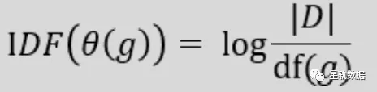

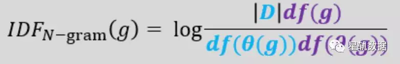

上图给出了ngram-idf的计算方式，对于ngram g，df(g)表示g紧邻出现在语料中的次数，df(\thea(g))表示g非紧邻出现在语料中的次数，要求在一定窗口内。公式前半部分类似于idf的计算，表示ngram出现的次数越少，ngram的信息量就越大；后半部分表示ngram在文本紧邻和非紧邻出现的次数越接近，ngram的内凝度就越大。两者组成了ngram的重要性。ngram-idf在计算过程中，一个挑战是如何基于大规模语料统计ngram在预定义窗口内非紧邻出现的次数。

# Query意图方法

### 基于片段意图

现有搜索系统主要基于关键词匹配的方式返回搜索结果。通常query 比较短且歧义大， 使得按关键词匹配可能返回一些不相关的文档，不能真实反映用户真实需求。 比如 query“乡村爱情 10”， doc“一段发生在美丽乡村里的爱情”，虽然 query和doc 完全字面匹配，但是从语义来看，doc并不和query相关。 因此理解query 的意图是搜索中一个重要的模块。 一方面从意图角度计算query和doc匹配度，缓解字面匹配的问题，另一方面可以帮助触发相应意图的 box。

现有 query 意图识别方法主要分为两种，一种是挖掘意图规则和模版，比如符合模版 “**在线电影观看”的 query 存在视频意图。 这种方法识别准确率高，但覆盖率不足，同时挖掘模版也是一个繁琐的过程，发现和制定模版需要较多的人工参与， 很难实现自动化。另一种方法把意图识别当作一个短文本分类，提取bag of words特征或者语义特征，然后利用贝叶斯模型或 CNN 模型对 query 按照预定义意图类别进行分类。这种方法有一定的泛化性，但是需要大量的标注数据样本，模型更新也比较困难。而且存在很多短 query，比如“周杰伦”， “回头太难”， 提取字面特征太过稀疏， 语义特征不够准确， 很难通过分类正确的识别出意图， 尤其是多意图。

本文基于现有意图识别方法的优缺点，提出一种基于query片段的意图识别方法，把 query意图识别转化成意图片段的离线挖掘问题，减轻了在线计算复杂度，并且通过意图片段更新可以很快速的解决新query的意图识别。意图片段在一定程度上类似模板，但相比模板挖掘方法更加简单，泛化性更好。

比如要计算query“信用卡取现手续费？”的意图，如果知道query的成分片段的意图，如“信 用卡”，“信用卡提现”，“信用卡手续费”的意图分布，那么query的意图可以由这些片段的意图分布推导得到。其中片段是指query分词后，任意n个词的有序组合，词之间不要求在query中紧邻出现。此时问题转成如何离线计算意图片段的意图分布。

**1） 离线片段意图挖掘**

首先获取片段在搜索上的结果，下图给出了片段“信用卡取现”在百度的结果：

分析搜索结果，我们可以从两方面来判断片段的意图分布。一方面很多url都有明显意图的，比如图中的“[51credit.com](http://51credit.com)”，“[finance.qq.com](http://finance.qq.com)”，如果能够知道url对应的意图，那么从url角度可以计算和目标意图类的url意图匹配度𝑢𝑟𝑙_𝑚𝑎𝑡𝑐ℎ；另一方面，可以从返回的doc标题来计算每个doc标题和目标意图类的语义相似性𝑡𝑖𝑡𝑙𝑒_𝑚𝑎𝑡𝑐ℎ。最后通过𝑢𝑟𝑙_𝑚𝑎𝑡𝑐ℎ和𝑡𝑖𝑡𝑙𝑒_𝑚𝑎𝑡𝑐ℎ 来计算片段在每个意图类上的得分。其中frag指片段，c为目标意图类，𝑓𝑟𝑎𝑔_𝑞𝑣指片段的qv，用于衡量片段的热度，w1和w2分别是两部分的加权系数。

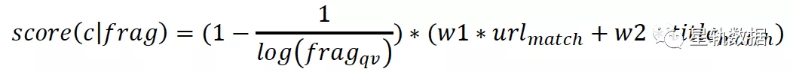

下面具体介绍如何计算𝑢𝑟𝑙_𝑚𝑎𝑡𝑐ℎ和𝑡𝑖𝑡𝑙𝑒_𝑚𝑎𝑡𝑐ℎ。

a) 𝑢𝑟𝑙_𝑚𝑎𝑡𝑐ℎ

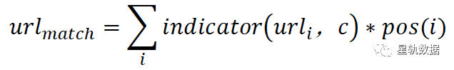

其中，𝑖𝑛𝑑𝑖𝑐𝑎𝑡𝑜𝑟(𝑢𝑟𝑙_𝑖，𝑐)是一个0-1函数，表示如果𝑢𝑟𝑙_𝑖是属于意图类c，则为1，反之为0，𝑝𝑜𝑠(𝑖)为位置惩罚函数。这里的url只需要挖掘每个意图类中头部的一些url即可。

b) 𝑡𝑖𝑡𝑙𝑒_𝑚𝑎𝑡𝑐ℎ 

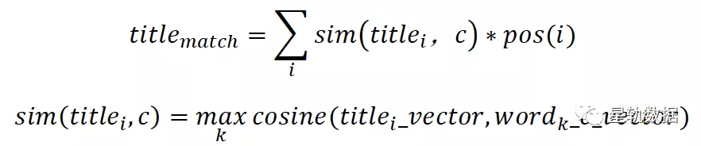

在𝑠𝑖𝑚(𝑡𝑖𝑡𝑙𝑒𝑖 , 𝑐)计算中，对于每个意图c类，挖掘意图类c中最相关的一批词。基于word2vec，分别计算doc标题和c类中的每个词向量的余弦相似度，然后取最大的作为doc标题和目标意图c的语义相似性，𝑝𝑜𝑠(𝑖)为位置惩罚函数。

**2） 在线query意图推导**

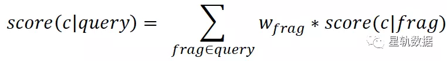

通过query片段的意图分布加权求和，可以计算query在意图类上的得分，其中𝑤_𝑓𝑟𝑎𝑔是片段的重要性。接着需要将得分转化成意图类上的概率分布，相比于直接求比例，这里引入每个意图类中的片段最大得分做归一化，解决每个意图类上得分都很低时，概率计算不置信问题。比如query在3个意图类abc上的score都为0.1，不平滑时p(a|query)=0.33，如果采用下述公式进行平滑，则p(a|query)=0.074，相比于不平滑计算的概率更加合理。其中𝛼调节平滑比例。

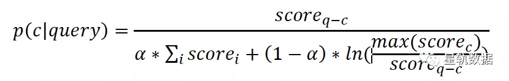

**3） 高频query意图挖掘**

上面的方法主要是根据搜索展现进行挖掘。对于高频query，其点击信息比较丰富，点击相比展现更能反映用户的意图。因此对于高频query，在拥有用户点击数据的情况下可以统计其点击的url分布来计算其意图分布。

**4） 专有实体补充**

枚举生成的query片段覆盖率不全，还可以引入每个意图类特有的一些实体资源增加覆盖率。比如，购物意图类中的商品名，品牌名等，音乐意图类中的歌手，歌曲，专辑等。

### 基于文本分类

相比于文章，80%的query通常都是短文本，同时意图的类别比较多都对准确的query意图分类提出了挑战：  

- 缺少标注数据集，同时人工标注样本成本较高，需要尽可能自动化构造样本并减少人的参与；
- 短文本造成特征比较稀疏，需要引入外部资源来补充和丰富query的特征表示；
- query存在强实体词误导分类准确性，比如包含“宝宝”的query大概率被分成母婴类，即使是非母婴意图的query“亲亲我的宝贝”、“天线宝宝”等；

介绍具体优化思路前，先给出一些较难的query及误识别类别：

- 面朝大海、春暖花开 - 旅游
- 医生表情包  - 医疗
- 怎么恢复聊天记录 - 健康
- 华侨城集团招聘  - 旅游
- 烧烤店爆炸 - 美食

下图给出了query意图分类的一般流程，相比于模型的选择，意图分类的瓶颈更在于如何获取标注样本和进行特征扩展。因此本文重点从样本获取、特征扩展这两点介绍一些优化意图分类的方法。

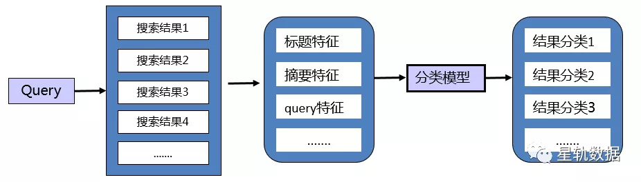

**一、样本获取**

1.  **百度元搜**：抓取query在百度的搜索结果，根据结果项的内容（url、站点名）可对query意图自动标注，这种方法不依赖于私有资源（如点击日志），同时百度展示结果已经融合很多先验信息，对有歧义的短实体query有自动消歧的作用。

如上图，从query“无问西东电影”结果中的标题和url可看出其意图是影视，同时位于右侧的知识图谱展示（“大话天仙”、“前任2”）也可以看成影视意图的正例。

2.  **点击日志**：搜索点击日志记录用户搜索的展示和点击结果，其点击行为相比于百度元搜中的展示行为更能反映query的意图，因此可类似的分析点击doc的url和标题来生成一些有标注的query意图样本。这种方法需要能获取到用户点击日志，在冷启动阶段采用百度元搜的方式是个更好的选择。

3.  **数据增强**：数据增强在深度学习模型中经常被采用的方法，有利于提高样本的多样性、不仅仅是重采样达到正负例的平衡、针对性构造一些难区分的样本。本文介绍一种基于类别特征词数据增强方法，首先挖掘一批类别特征词（比如医疗中的“医生、增生、疾病、预防”，然后找出包含特征词的一些query同时基于元搜结果获取query的意图结果，此时可有偏的选取一批非医疗类意图的query来增强医疗意图的负例，比如“医生表情包”是表情包/图片意图、“城野医生”是美容意图，“吉格斯医生”是影视意图，这样更能丰富样本的多样性和特征词的上下文模式，缓解强实体词对意图分类的影响。实际增强中，可针对性的选取一些易混淆的冲突类别，比如“游戏”和“旅游”，“游戏”和“军事”。

**二、特征扩展**

1.  **短文本**：query大部分都是短文本，尤其是头部query，其信息量少并且存在较多的歧义性，使得很难只从文本本身信息推断其主要意图。通常做法是对query去扩充文本，扩充文本的方式有很多种，常用的做法是基于元搜的结果或点击日志作为query的文本扩展，此外还有查询知识图谱的相关节点来扩展，比如搜“城野医生”可获取相关节点“森田药妆”、“资生堂”等节点。最后基于扩充的文本进行特征抽取来表示query。

2.  **内容型实体**：query中包含大量的内容实体，比如“爱情公寓资源”中的“公寓”，这种内容实体对意图识别无意义，并且会干扰模型的学习。常用的做法是采用知识嵌入的方法，首先根据知识图谱来识别“爱情公寓”，将“爱情公寓”替换成_ENTITY_特殊标记，然后再进行模型学习。

## 评测方法

搜索系统由多个不同作用的模块组成，多模块相互配合和兜底最终返回用户看到的结果。如何评测搜索系统的好坏是个比较关键的问题。工业界主要从单点模块评测和整体系统评测两个角度分别评测，前者更看中技术指标、后者更看中业务指标。

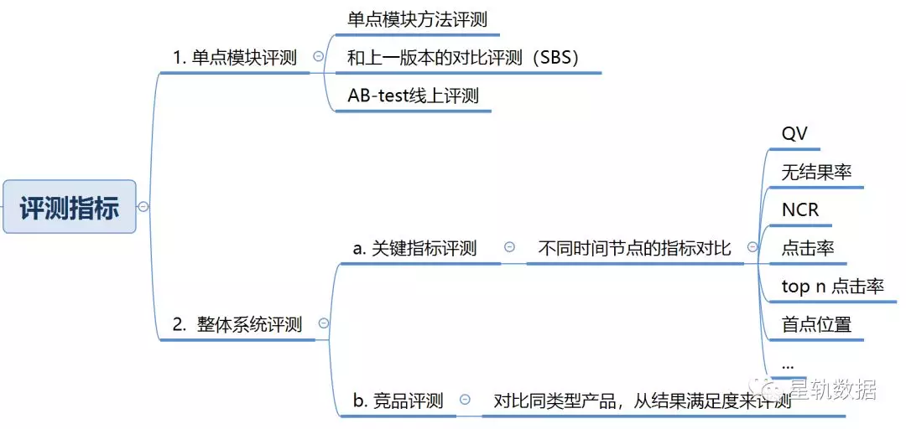

**一、搜索单点优化评测**

主要为了判断单个模块优化后，效果提升有多少，可不可以上线？  

- **单点模块方法评测**
	每个模块都采用合适的模型方法，此时可通过构建一个标准测试集获取一些模型的指标来评价。比如要取识别query中的实体，可利用在标准测试集上的准确率、召回率、F1来评价。又如做LTR的排序，通常选取MAP和NDCG指标。
- **和上一版本的对比评测**
	- diff率：主要衡量单个模块优化的影响面，比如优化同义词后造成了多少百分比的query和上一版本同义结果不一样；
	- 胜出率：常用的方法称为SBS评测，评测人员对比新旧版本的结果，并标记“好”、“坏”、“一样好”、“一样坏”，胜出率 = （好+（一样好+一样坏）/2）/ALL。一般胜出率大于55%说明影响是正向的。
- **AB-test**
	上面两种评测需要人参与标注或评测，不可避免存在一些主观因素存。AB-test相对是一种比较客观的指标，通过划分不同的流量给新旧版本，然后观察目标指标一定时间（搜索比较看中的是点击率、无点率，首点位置等），最后通过指标的变化来判断优化是正向还是负向。一般先划分小部分流量用于小流量实验，小流量验证有效性后，再全流量上线。

**二、系统整体评测**

- **关键指标评测**
	根据统计搜索点击日志来生成一些不同时间节点版本的指标对比报表，如QV，无结果率，NCR，点击率，top n点击率，首点位置等。通过观察大盘指标的对比，可以比较清楚掌握业务的发展和问题。
- **竞品评测**
	此外如果有竞品，比如做医疗搜索，可以和是搜狗明医、微信医疗等系统对比。由于不同产品背后的doc资源是不一样的，因此往往从结果满足度来评测，即搜索结果是否满足query的需求。

## 架构设计

搜索系统由多个不同作用的模块组成，多个模块相互配合和兜底返回用户看到的结果。如何设计搜索系统的架构是个比较关键的问题。本文介绍一种工业界常见的搜索架构设计，其思路同样可用于推荐系统、计算广告中等任务中。因为这三类任务本质上都可以分为**召回+排序**两个过程。下图给出了在一次完整的搜索流程中，各个子模块是怎样相互调用和作用的：

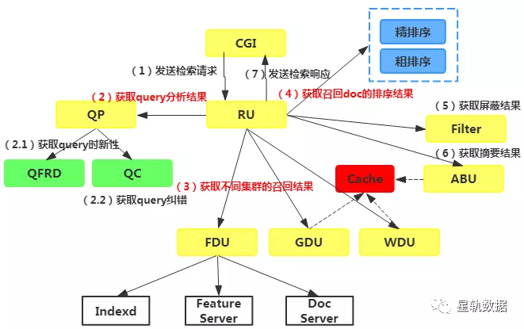

首先是前端CGI负责接收用户的检索请求，发送至RU模块（ROOT UNIT）。RU是一个总控模块，负责和其它模块的调用交互。接着RU会请求QP（QUERY PROCESSER）模块获取query的分析结果，生成检索下发项（不止一个），也可以看成是确定检索策略的过程。在QP模块中又会分别去调用QC和QFRD模块去获取query的时新性和纠错结果。然后RU利用QP生成的检索策略去索引集群中求交召回，这里索引集群分为三种类型，分别是FDU（Fresh Doc Unit）存储一些比较新的文章，GDU存储一些优质的文章，WDU存储全量的文章。这样设计的原因是当全量文章比较多时会对检索造成比较大的压力，实际使用中优先召回GDU中的doc。每个索引集群下面又连着feature server（获取离线计算的doc特征，用于排序计算）和doc server（获取doc的正文）。RU获取召回结果后，会将召回doc送入到排序模块依次做粗排序（query-doc的单点排序）和精排序（query-doc list的整体排序）。后者相比于前者减少了候选doc的数量，可采用更为负责的特征。排序完成后，RU会请求Filter模块过滤一些非法信息。最后通过ABU获取摘要和飘红结果用于搜索结果的展示。其中cache模块的加入可以缩短命中cache的query检索耗时。

## Query纠错

### 原理

query纠错（qc）是搜索系统中感知较明显的模块，从产品形态上并不陌生，也比较影响用户体验。从技术角度，纠错是query分析中难度比较大的模块，类似小型搜索系统，其可以分为两个阶段，一个是召回，即获取可能正确的候选纠错串，其次是排序，在候选纠错串中挑选纠错概率最大的作为纠错结果。

如果把纠错当成一个黑盒，其输入可称为原串：用户query（q），输出可称为纠错串：纠错后的query（r）。纠错算法就是选出r使得q纠成r的概率最大，用贝叶斯公式表示就是：

**argmax p(r|q)**
**= argmax p(q|r)p(r)/p(q)**
**= argmax p(q|r)p(r)**

所以纠错可以分解成：  

p(q|r)：计算原串到纠错串的转移概率，常见方法有编辑距离，q和r的共点击概率，以及分别抽取q和r的相应特征，用模型预测p(q|r)等；

p(r)：衡量纠错串作为正常query的概率，比如语言模型，高频query，实体知识库等，即如果r的语言模型得分很高或者是个搜索次数比较多的query，其作为正确纠错串的概率就越大。

纠错后续的流程和不同方法大都是围绕着这两个概率来计算。

还有个问题是纠错是和资源相关的，如果某个错误query下的资源很多，虽然能正确纠成正确的query，但此时也可能不会去纠错。所以**p(q|r)、p(r)、p(q)**在纠错中都会使用。由此可见，纠错是个比较复杂的系统，后续将分别介绍以下内容：

1、文本错误类型

2、纠错结果类型

3、纠错的召回方法

4、片段纠错

5、生成式纠错

6、先检后纠  

7、纠错如何用于排序

### 文本错误类型

首先看下为什么会出现query错误。常见的输入方式是拼音输入法，用户输入拼音，输入法提示候选词，由于误选或无需要候选词时，query就有可能出错。尤其当新的网络词汇出现时，如"耗子尾汁"，或者一些陌生的词，如"芈月传"，很多人都知道其拼音，实际哪些字并不确定。此外，通过复制粘贴来搜索，也可能导致搜索query不完整或带入无关字符。

关于纠错类型，最常见的是query中存在错别字，比如“尿酸高通风 -> 尿酸高痛风”。除此之外还会存在多字、少字、顺序交换、中英文混拼，中文拼音混拼等错误类型。下面列举一些常见的错误类型：

1、少字：微信跳一 -> 微信跳一跳

2、多字：微信跳一跳跳 -> 微信跳一跳

3、错字：微信 挑一挑 -> 微信跳一跳

4、拼音：tiaoyitiao -> 跳一跳

5、中英文混拼：held住 -> hold住 

6、中文拼音混拼：跳yi跳 -> 跳一跳

7、知识错误：南山平安金融中心 -> 福田平安金融中心

8、音转：灰机 -> 飞机

...

这里有个细节值得注意，是否是错误还和是否被很多人来用有关，比如“西红柿首富”先验看是个错的电影名，正确的应该是“西虹市首富”，但是由于最开始的很多用户、自媒体都使用了“西红柿首富”，反而使得其是个正常的query，现在百度也专门有个“西红柿首富”的电影词条。这种问题对具体的纠错处理以及纠错应用都有比较大的影响。

从前面结果来看，qc的错误类型是非常多的，并且比较细，使得准确完成这些纠错本身就是个很困难的事情，所以对不同query，纠错系统产生的纠错结果的置信度也不一样。因此考虑到置信度，会对纠错结果标记为不同的纠错类型，并且影响下游的搜索策略和结果展示。

### 纠错结果类型

不同的纠错结果类型，对排序的影响不同，同时前端的展示方式也不同。

纠错是搜索召回阶段的一个模块，利用纠错后query去召回一些可能的相关文章，在排序阶段去和未纠错query召回结果做融合，通常是采用按页整体插入的方式。取决于原query召回doc数、纠错query召回doc数等后验，使用纠错的方式也不同，不同的使用方式也导致了不同的纠错结果类型，主要分为：

**1、全纠错**：搜索结果都是纠错query的，但在页面展示时依然保留给用户“仍然搜索yyy”的提示，用户可以选择不纠错。

**2、混合纠错**：索结果是原query和纠错query的混排，给用户纠错提示。以一定的置信度下发纠错串和原串，由搜索模块决定使用哪个串还是说两个串都是用并返回两部分的结果，最终在页面展示提示，通常使用了纠错串则是“包含xxx结果。仍然搜索yyy”，使用了原串则是“是否想要搜索xxx”；

**3、提示纠错**：不参与排序，给用户纠错提示，最多有3个相关纠错。

因此qc结果类型分类其实也是依据置信度来分类，非常置信的用全纠错，不置信的用提示纠错，介于两者中间的用混合纠错。

纠错是个挑战非常大的模块，也会存在一些错误结果，主要分为三类：  

| | |
|---|---|
|错纠|shixiong -> 师兄  (尸兄)  [视频] laobing ->  烙饼  (老兵)  [视频]|
|漏纠|罗绮 ->  罗琦 lqyjjl -> 恋曲一九九零 老子今天不上班 ->  老子明天不上班 pround foryou -> pround of you 变形记 湖南卫视 ->  变形计 湖南卫视|
|过纠|cup ->  cpu  [视频] 百分摔跤 -> 百分摔角 [应用] 海上车 -> 海上列车|

## 新趋势

**1、多模态搜索**

从网页端到手机端，获取用户多模态的输入（图片、语音、视频等）变得更为容易，像主流的app都已提供语音、相机等入口。同时5G时代的来临，数据传输速度更快，相比于只使用若干个关键词的文本搜索表达方式，表达能力更丰富的多模态输入作为一种自然+高效的形态会越来越流行、越方便。同时多模态输入，所见即所得，一方面缓解用户不知道如何用关键词来表达自己的需求，一方面也缓解了搜索引擎理解复杂query的难度。当然这里也会产生一些新的技术挑战。比如语音搜索中，如何更好的方言语音识别，口语化语音识别；视频搜索中，如何准确理解每个像素的重要性和语义，类似文本中理解每个词的词权重和语义，分词就类似图像中的物体检测和识别。像微信识物，淘宝拍照搜索都属于这种，但是目前流量并不大，优化的空间也比较大。多模态搜索始于4g，繁荣5g智能时代。

**2、更语义搜索**

相比于关键字搜索，语义搜索则是透过现象看本质，也是一种更精准的搜索，也是一种不仅仅只看title的搜索，理解doc的文本在搜索会越来越重要。比如搜索“梦字去掉林是什么”，语义搜索则是直接出现“夕”，而不仅仅只是返回一些词重叠的标题。结合产品形态，具体有以下几点：

1）语义排序：传统的搜索方式都是基于关键词对结果进行排序，而基于 Transformer 的语义排序引擎则能够理解文本背后的含义。

2）语义摘要：相关性只是一方面，搜索结果中的标题和摘要也非常重要。好的标题和摘要能够让用户“一眼”看出结果是不是自己想要的。

3）语义高亮：语义高亮的简单理解是：给一段搜索结果画重点，并用文字加粗的形式进行展示。通过语义高亮，用户可以直接获得所需的答案，或者通过快速扫描结果页面就可以查找到所需的文档，甚至直接获得一段摘要。

4）语义问答：疑问句查询是搜索引擎经常遇到的搜索方式，这背后用户往往想要优先获得一个简短、确切的答案，而不是文档。语义搜索可以通过机器学习阅读语料库中的所有文档，然后进行总结，并将答案置顶展示。

**3、多轮搜索**

传统的搜索虽说有session的说法，但是对于每个query大都是还是独立处理的。搜索体验中，经常会碰到一些很难在一次搜索中得到满足，通常要多次换不同的query才会得到想要的答案。类似现在比较火热的虚拟人，后面的产品形式可能搜索即对话，对话即搜索，一切以满足用户的需求为主。目前有一些类似作用的产品形态，比如结合query意图知识的多伦hint，比如搜索“拉萨布达拉宫介绍”，则给出“布达拉宫门票预约”“大昭寺小昭寺攻略”这样的hint。在医疗中，有一种特殊的预问诊形态，通过多轮交互尽可能的全面收集用户的疾病信息，帮助后面的分析和诊断。这里通过对多轮的query及上下文理解用户的精准需求是个挑战。

## 参考资料

 [Query理解 - 搜索引擎“更懂你”](http://mp.weixin.qq.com/s?__biz=MzU2OTQyOTMxOQ==&mid=2247483877&idx=1&sn=d7f60d0f7ba5d4122b3540adeb697a35&chksm=fcff9dcdcb8814dbf2d20972564667f889f594ac2a72f211a8bb9240d74a154a0c0d48f21386&scene=21#wechat_redirect)

[搜索排序 = 相关性排序？](http://mp.weixin.qq.com/s?__biz=MzU2OTQyOTMxOQ==&mid=2247484004&idx=1&sn=ffe6aa4d596980b831b694593ca108d4&chksm=fcff9e4ccb88175a04d0ae886d86b8d3a20315d33c48783525482982a48cea2036e3d655cde3&scene=21#wechat_redirect)

[搜索引擎的两大问题（1） - 召回](http://mp.weixin.qq.com/s?__biz=MzU2OTQyOTMxOQ==&mid=2247483883&idx=1&sn=2dee1b5f92e1553436a40848cfb1fde4&chksm=fcff9dc3cb8814d5d8e4aaae302fa0e1e37723a0ff0c51a26b1d3f1a1790eae753c7e1ce80be&scene=21#wechat_redirect)  

[搜索引擎的两大问题（2） - 相关性](http://mp.weixin.qq.com/s?__biz=MzU2OTQyOTMxOQ==&mid=2247483887&idx=1&sn=0b49e2631f9a6922a7b82aa6687a5aa4&chksm=fcff9dc7cb8814d14b87a88021c13f3374b75d9dadee7f80e358c0eb2ffd8205136206dfc27e&scene=21#wechat_redirect)

[Query词权重方法（1） - 基于语料统计](http://mp.weixin.qq.com/s?__biz=MzU2OTQyOTMxOQ==&mid=2247483896&idx=1&sn=323b96761c4ee9697294bce84558da1f&chksm=fcff9dd0cb8814c63af8af21a0d550761d10d06dffcadce2b97cd8053ea54771664e941cd78f&scene=21#wechat_redirect)

[Query词权重方法（2）- 基于点击日志](http://mp.weixin.qq.com/s?__biz=MzU2OTQyOTMxOQ==&mid=2247483907&idx=1&sn=f67aa2bdafd26d926658fed7f75993f2&chksm=fcff9e2bcb88173d607f9bd9de77c68e63e502bf4046ad217fc92f292ffa1389a7448a3188ed&scene=21#wechat_redirect)

[Query词权重方法（3）- 基于有监督学习](http://mp.weixin.qq.com/s?__biz=MzU2OTQyOTMxOQ==&mid=2247483914&idx=1&sn=6d9a63f367d023a8729f8eb3e350bc14&chksm=fcff9e22cb881734b807858e8165103df4712fd8bf0e1421fb63120839a041061662a7d4f9b9&scene=21#wechat_redirect)

[Query词权重方法（4）- beyond 词粒度](http://mp.weixin.qq.com/s?__biz=MzU2OTQyOTMxOQ==&mid=2247483921&idx=1&sn=6382ee8b7e4697565bf060c03db4cd14&chksm=fcff9e39cb88172f33eb88346bf467b56e3c55e0cac97634f1d0b4c665d9a4fe37fcb171d118&scene=21#wechat_redirect)

[Query意图方法（1）- 基于片段意图](http://mp.weixin.qq.com/s?__biz=MzU2OTQyOTMxOQ==&mid=2247483932&idx=1&sn=bc61da25a6760a528bb31ebdbfb6c33a&chksm=fcff9e34cb8817229b5501e06a6cb81a9ad4ba29117b08da10380e07524c2d95c124b0e23b63&scene=21#wechat_redirect)  

[Query意图方法（2）- 基于文本分类](http://mp.weixin.qq.com/s?__biz=MzU2OTQyOTMxOQ==&mid=2247483965&idx=1&sn=70fefa6fe5e58c4e997ca28fb3d534dc&chksm=fcff9e15cb881703fe2c7636e9d2d862e94d124ccf0ab6cfd0f56c54fd615cf35ef06329166e&scene=21#wechat_redirect)

[搜索系统的评测方法](http://mp.weixin.qq.com/s?__biz=MzU2OTQyOTMxOQ==&mid=2247483971&idx=1&sn=0b34e2b139a32c2bb12852781cd7af27&chksm=fcff9e6bcb88177d2db70212c37144353a92da818fd1223fea67ec6eda68d462d58c05fbe6c0&scene=21#wechat_redirect)  

[搜索系统的架构设计](http://mp.weixin.qq.com/s?__biz=MzU2OTQyOTMxOQ==&mid=2247483982&idx=1&sn=558dad1cad220241f40d892d5682f319&chksm=fcff9e66cb881770c52a0c08b302121b7bac0af2dd13784302804024ab93b30fe2213ba0731d&scene=21#wechat_redirect)

[Embedding搜索能代替文本搜索吗？](http://mp.weixin.qq.com/s?__biz=MzU2OTQyOTMxOQ==&mid=2247484029&idx=1&sn=bf116eeac389684238298eb7789fccbc&chksm=fcff9e55cb881743ad63d224d9f3acf5633dff0c8fd687dd1b0121a268300ccae550c00efc6f&scene=21#wechat_redirect)

[说一说视频搜索](http://mp.weixin.qq.com/s?__biz=MzU2OTQyOTMxOQ==&mid=2247484065&idx=1&sn=276b76987c4b67a7e7ef35d4eb1f6c4d&chksm=fcff9e89cb88179f6e7e95a26c2788d1a022ef58da799b98f5bac8c1158cbdd72a1d4329b11d&scene=21#wechat_redirect)

[Query纠错（1） - 原理](http://mp.weixin.qq.com/s?__biz=MzU2OTQyOTMxOQ==&mid=2247484077&idx=1&sn=ba238cd24da12e89716b6115f85d707d&chksm=fcff9e85cb881793f7d4fd4ef4e01604d3a6152f30c5d1ffa7812c71b345d87d4ae15b1d0aa2&scene=21#wechat_redirect)

[Query纠错（2） - 文本错误类型](http://mp.weixin.qq.com/s?__biz=MzU2OTQyOTMxOQ==&mid=2247484087&idx=1&sn=9839e9afae22ef539dc7cd7d9aeb5e39&chksm=fcff9e9fcb881789943ed8c40b56737bdbac209e60a85f6f803b0cd094a24b4acf777779e0d9&scene=21#wechat_redirect)

[Query纠错（3）- 纠错结果类型](http://mp.weixin.qq.com/s?__biz=MzU2OTQyOTMxOQ==&mid=2247484105&idx=1&sn=d7a6c0d4af2b6ebd28d69ab987190548&chksm=fcff9ee1cb8817f75b08f3b310d312942cfc6c7786ebf7b4482553e19d39be40ec3c3dfc7c91&scene=21#wechat_redirect)

[搜索的一些新趋势](https://mp.weixin.qq.com/s/9T8J3O_OnmNOIk040cjUEA)

