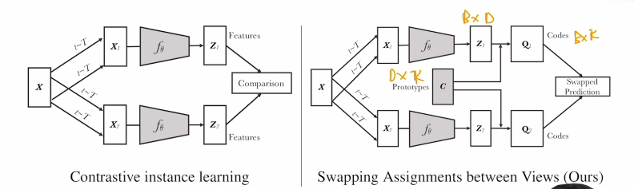

来源：李沐视频

视频链接：https://www.bilibili.com/video/BV19S4y1M7hm

论文链接在：https://github.com/mli/paper-reading/

# 第一阶段：百花齐放

## InstDisc

Unsupervised Feature Learning via Non-Parametric Instance Discrimination

个体判别任务

把每张图片看成一个类别，学习每张图片的特征

使用CNN

从memory bank里抽负样本，memory bank里存着所有的特征

## InvaSpread

Unsupervised Embedding Learning via Invariant and Spreading Instance Feature

个体判别任务

一个batch里所有的非正样本都是负样本。这样可以做端到端训练，只用一个编码器。

## CPC

Representation Learning with Contrastive Predictive Coding

一个编码器+自回归模型

## CMC

Contrastive Multiview Coding

数据集：NYU RGBD，有四个视角

正样本是多个视角的

使用多个编码器

之后的clip也是类似的思想

# 第二阶段：CV双雄

## MoCov1

模型：Res50

可以看做是InstDisc的改进

证明了无监督训练可以比有监督的预训练好

论文写作水平高

## SimCLRv1

不同的数据增强

g函数（mlp）的增加直接提升了10个点。

InvaSpread可以看做是这个的前身

## MoCov2

 在smiclr启发下，mocov1加上mlp proj，更多的数据增强。

## SimCLRv2

更大的模型

加深proj，2层最好

动量编码器

## SwAV

聚类+对比学习，multi-crop

效果非常好

# 第三阶段：不用负样本

## BYOL

负样本是为了防止模型坍塌（什么都没有学到）

把匹配问题换成预测问题，自己预测自己

目标函数是MSE loss

有意思的解释博客：understanding self-supervised and contrastive learning with BYOL

batchnorm起了关键作用，是隐式的对比学习。

## SimSiam

化繁为简

不需要负样本，不需要大的batchsize，不需要动量编码器

stop gradient

MoCo V2 下游任务迁移好用

BYOL分类任务好

# 第四阶段：基于Transformer

## MoCov3

研究如何使得ViT（vision transformer）训练更稳定

## DINO

