自监督学习主要是利用辅助任务(pretext)从大规模的无监督数据中人为构造监督信息，学习到对下游任务有价值的表征。

与监督学习相比，自监督学习的监督信息是人为构造的。

自监督学习的流程

- 训练(Pretrain)：人为设计pretext，在大规模无监督数据中构造监督信息，得到预训练模型
- 测试(Fine-tuning)：评估自监督学习预训练模型的表征能力，通过下游任务性能测试自监督算法的有效性

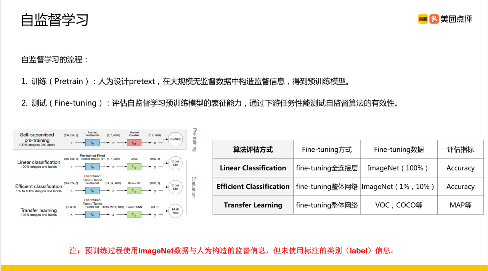

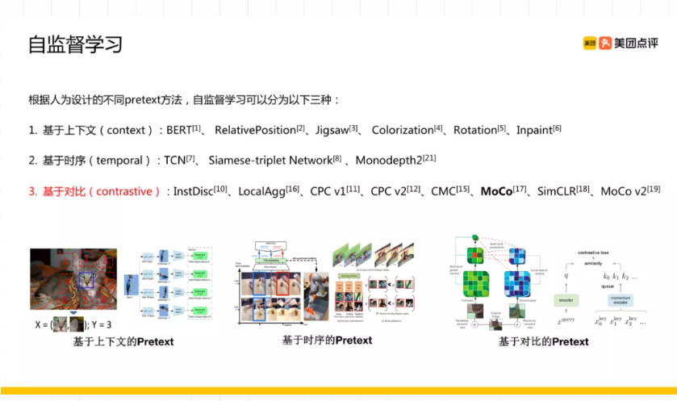

根据人为设计的不同Pretext方法，自监督学习可以分为以下三种

- 基于上下文：BERT, RelativePosition, Jigsaw, Colorization, Rotation, Inpaint
- 基于时序：TCN, Siamese-triplet Network, Monodepth
- 基于对比：InstDisc, LocalAgg, CPC v1, CPC v2, CMC, Moco, SimCLR, Moco v2

## **基于上下文（Context based）**

基于数据自身的上下文信息可以构造很多任务。以拼图的方式构造pretext，比如将一张图分成9个部分，通过预测这几个部分的相对位置来产生损失；以抠图的方式构造pretext，随机将图片的一部分删掉，用剩余的部分预测扣掉的部分；预测图片的颜色，比如输入图像的灰度图，预测图片的色彩。

### **《Rethinking Data Augmentation: Self-Supervision and Self-Distillation》**

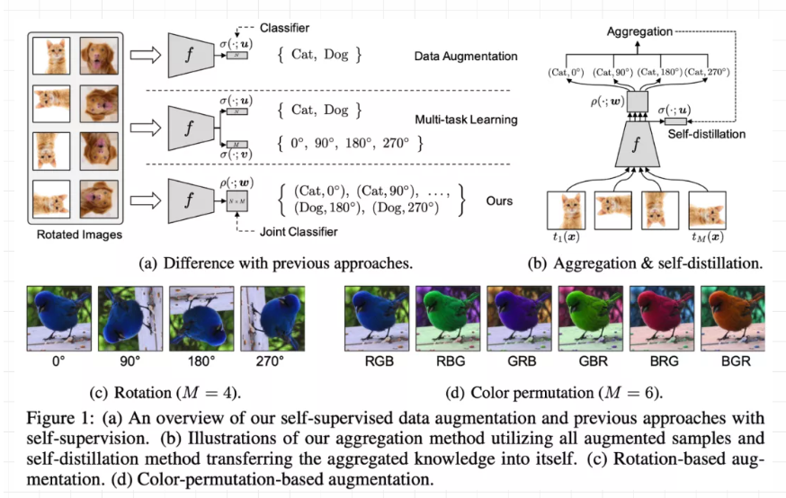

**Data augmentation and self-supervision**

Data Augmentation相关的方法会对通过对原始图片进行一些变换（颜色、旋转、裁切等）来扩充原始训练集合，提高模型泛化能力；

Multi-task learning将正常分类任务和self-supervised learning的任务（比如旋转预测）放到一起进行学习。

作者指出通过data augmentation或者multi-task learning等方法的学习强制特征具有一定的不变性，会使得学习更加困难，有可能带来性能降低。

因此，作者提出将分类任务的类别和self-supervised learning的类别组合成更多类别(例如 (Cat, 0),(Cat,90)等)，用一个损失函数进行学习。

**Self-distillation from aggregation**

在学习的过程中限制不同旋转角度的平均特征表示和原始图片的特征表示尽可能接近，这里使用KL散度作为相似性度量。

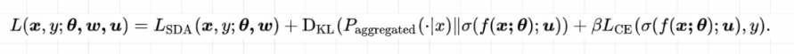

第一项和第二项分别对应图a和图b，第三项是正常的分类交叉熵损失，作为一个辅助loss。

### **《S4L: Self-Supervised Semi-Supervised Learning》**

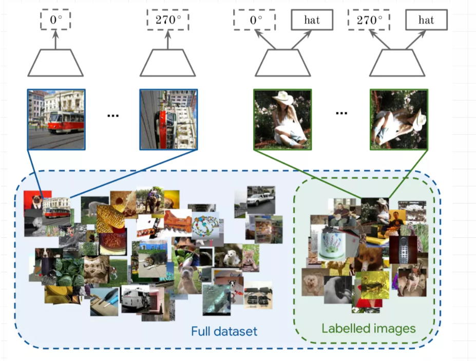

自监督和半监督学习（大量数据没有标签，少量数据有标签）也可以进行结合，对于无标记的数据进行自监督学习（旋转预测），和对于有标记数据，在进行自监督学习的同时利用联合训练的想法进行有监督学习。通过对 imagenet 的半监督划分，利用 10% 或者 1% 的数据进行实验，最后分析了一些超参数对于最终性能的影响。

对于标记数据来说，模型会同时预测旋转角度和标签，对于无标签数据来说，只会预测其旋转角度，预测旋转角度”可以替换成任何其它无监督task（作者提出了两个算法，一个是 S^4L-Rotation，即无监督损失是旋转预测任务；另一个是S^4L-Exemplar，即无监督损失是基于图像变换（裁切、镜像、颜色变换等）的triplet损失）

总的来说，需要借助于无监督学习，为无标注数据创建一个pretext task，这个pretext task能够使得模型利用大量无标注学习一个好的feature representation

## **基于时序（Temporal based）**

在视频等场景，不同样本间也有基于时序约束。**，比如视频相邻帧的相似性、物体多个视觉的视频帧。**

### **《Time-Contrastive Networks: Self-Supervised Learning from Video》**

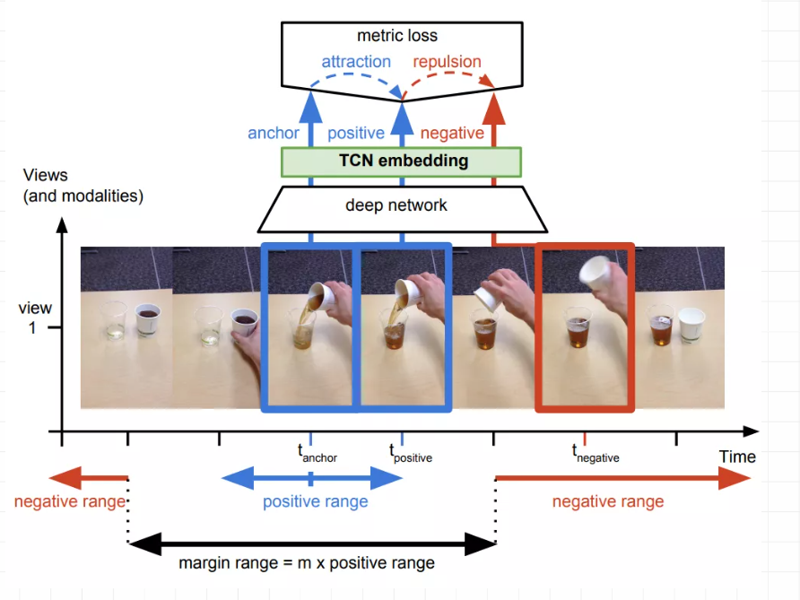

对于视频中的每一帧，其实存在着特征相似的概念，可以认为相邻帧特征是相似的，而相隔较远的视频帧是不相似的，通过构建这种position和negative的样本来进行自监督约束。

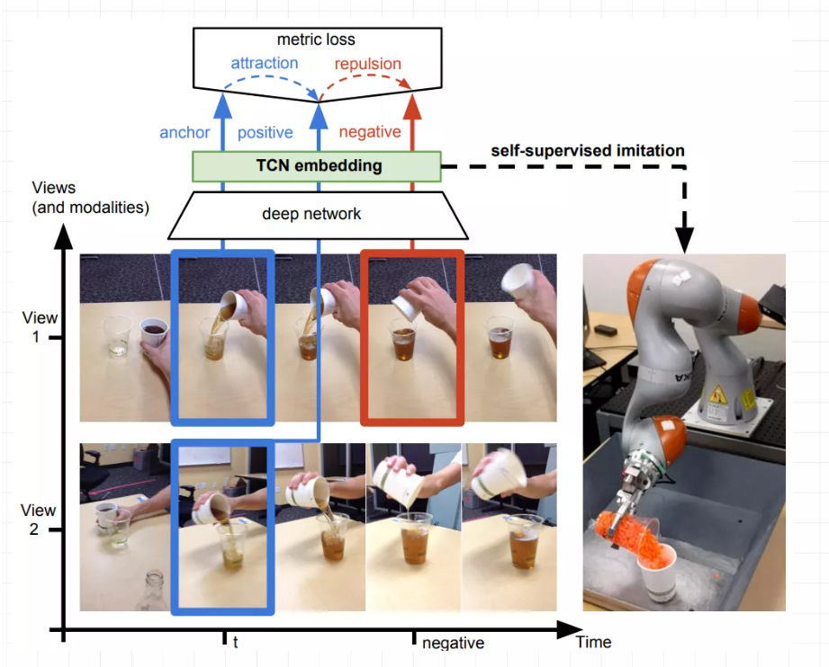

对于同一个物体的拍摄是可能存在多个视角（multi-view），对于多个视角中的同一帧，可以认为特征是相似的，对于不同帧可以认为是不相似的。

### **《Unsupervised Learning of Visual Representations Using Videos》**

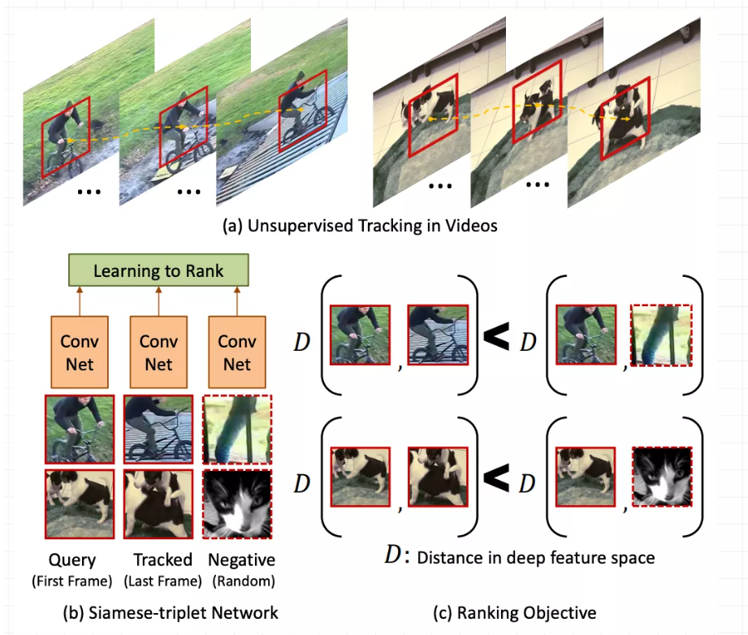

基于无监督追踪方法，首先在大量的无标签视频中进行无监督追踪，获取大量的物体追踪框。那么对于一个物体追踪框在不同帧的特征应该是相似的，而对于不同物体的追踪框中的特征应该是不相似的。

### **《Shuffle and learn: unsupervised learning using temporal order verification》**

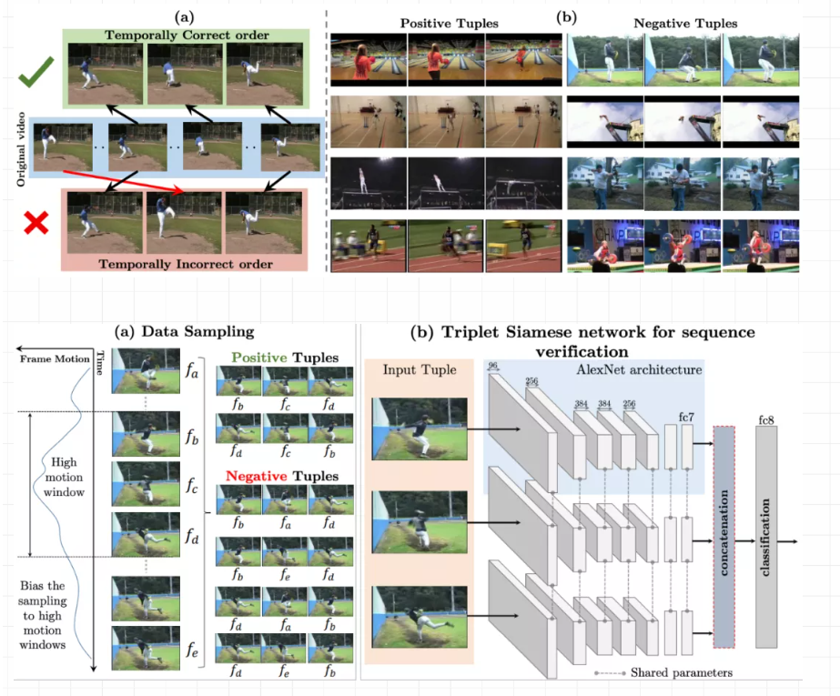

基于顺序约束的方法，可以从视频中采样出正确的视频序列和不正确的视频序列，构造成正负样本对然后进行训练。简而言之，就是设计一个模型，来判断当前的视频序列是否是正确的顺序。

## **基于对比（Contrastive based）**

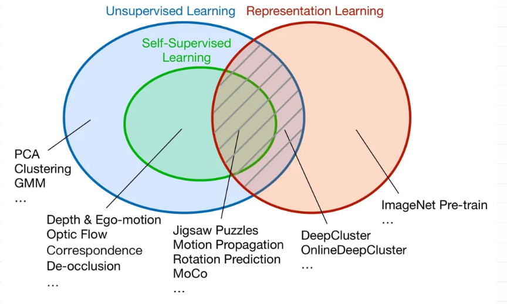

通过学习对两个事物的相似或不相似进行编码来构建表征，即**通过构建正负样本，然后度量正负样本的距离来实现自监督学习**。核心思想样本和正样本之间的相似度远远大于样本和负样本之间的相似度，**类似Triplet模式**。

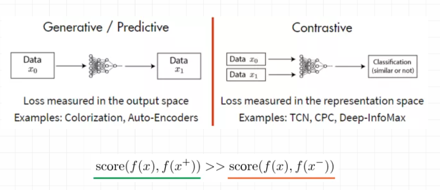

1. score 是度量函数，评价两个特征间的相似性。𝑥通常称为“**anchor**” 数据。

2. 为了优化 anchor 数据和其正负样本的关系，可以使用点积的方式构造距离函数，然后构造一个 softmax 分类器，以正确分类正样本和负样本。

3. 这应该鼓励相似性度量函数（点积）将较大的值分配给正例，将较小的值分配给负例。

### **《Learning deep representations by mutual information estimation and maximization》**

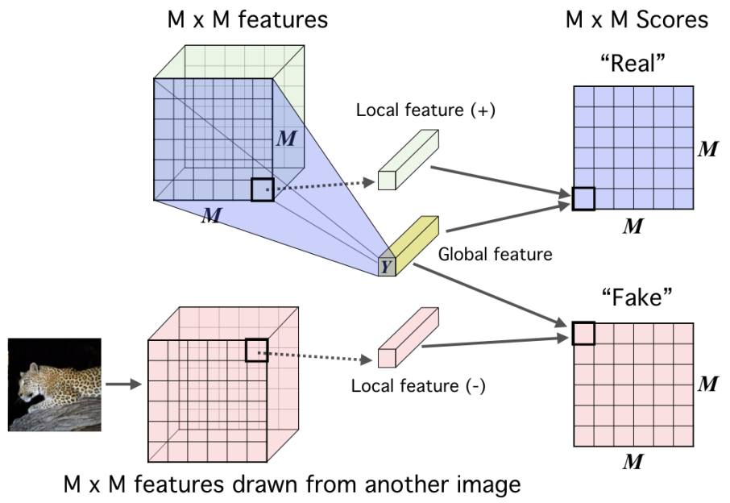

Deep InfoMax 通过利用图像中的局部结构来学习图像表示，对比任务是对一对图像中的全局特征和局部特征进行分类。

全局特征是CNN的最终输出，局部特征是编码器中的中间层的输出。每个局部特征图都有一个有限的感受野。

对于一个 anchor image 𝑥，𝑓(𝑥)是来自一幅图像的全局特征，正样本𝑓(𝑥+)是相同图像的局部特征，负样本𝑓(𝑥−)是不同图像的局部特征。

本文探讨的简单思想是训练一个表示学习函数，即编码器，以最大化其输入和输出之间的互信息（MI）。作者以一种类似于对抗自动编码器的方式，将MI最大化和先验匹配结合起来，根据期望的统计特性约束表示。

为了得到一个更适合分类的表示，作者将图像的高层表示与局部patch之间的平均MI值最大化。

### **《Representation Learning with Contrastive Predictive Coding》**

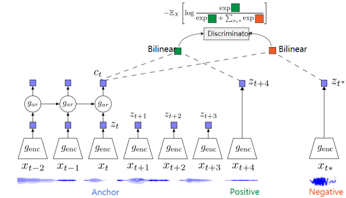

CPC是一个基于对比约束的自监督框架，可以适用于文本、语音、视频、图像等任何形式数据的对比方法（图像可以看作为由像素或者图像块组成的序列）。

CPC通过对多个时间点共享的信息进行编码来学习特征表达，同时丢弃局部信息。这些特征被称为“慢特征”：随时间不会快速变化的特征。比如说：视频中讲话者的身份，视频中的活动，图像中的对象等。

CPC 主要是利用自回归的想法，对相隔多个时间步长的数据点之间共享的信息进行编码来学习表示，这个表示 c_t 可以代表融合了过去的信息，而正样本就是这段序列 t 时刻后的输入，负样本是从其他序列中随机采样出的样本。CPC的主要思想就是基于过去的信息预测的未来数据，通过采样的方式进行训练。

### **Moco《Momentum Contrast for Unsupervised Visual Representation Learning》**

基于对比的自监督学习其实就是训练一个编码器然后在一个大的字典里确保和对应的key是相似的，和其它的是不相似的。

传统上字典的大小就是batch-size，由于算力的影响不能设置过大，因此很难应用大量的负样本。因此效率较低。

本文采用队列来存储这个字典，在训练过程中，每一个新batch完成编码后进入队列，最老的那个batch的key出队列，字典的大小与batchsize实现分离，这样可用的字典大小就可以远远大于batchsize，负样本的数目就会大大扩增，效率得到大幅提升。

动量更新主要是为了解决字典这部分数据在反向传播的时候更新参数的问题，因为反向传播需要在队列中所有的样本中进行传播。在这里作者使用了一种动量更新的方式缓慢平滑的更新参数：

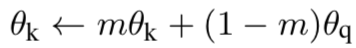

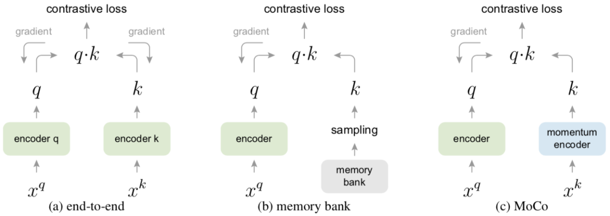

a) 传统方法-端到端，这种方式query和key用两个encoder，然后两个参数是都进行更新的，但这种方式你的字典大小就是mini-batch的大小。

b) 采用一个较大的memery bank存储较大的字典（存储所有的样本），但是每次进行query之后才会对memory进行更新，所以每次采样得到的query可能是很多步骤之前编码的的向量，这样就丢失了一致性。

c) 使用queue，每次query之后都删除最早的batch的样本，然后将最新的batch更新入队，这样就巧妙的缓解了memory-bank一致性的问题。同时利用队列可以保存远大于batchsize的样本，这样也解决了end-to-end的batch-size的耦合问题。

### **SimCLR《A Simple Framework for Contrastive Learning of Visual Representations》**

**是什么使对比预测任务能够学习有用的表示？**

1） 数据增强的组合在定义有效的预测任务方面起着关键作用；

2） 在表示和对比损失之间引入一个可学习的非线性变换，大大提高了学习表示的质量。

3） 与有监督学习相比，对比学习可以从更大的batch和更多的训练步骤中获益。

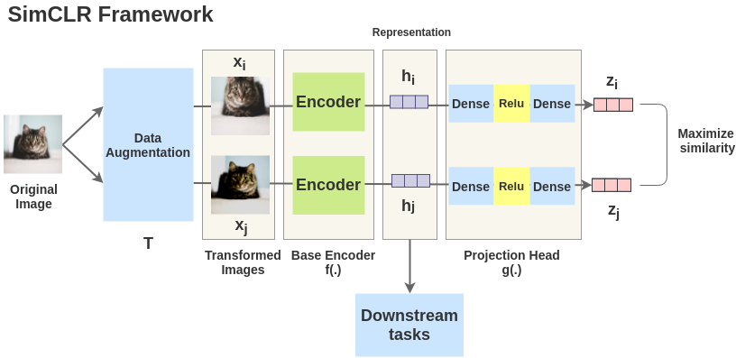

取一幅图像对其进行随机变换，得到一对增广图像x_i和x_j。该对中的每个图像都通过编码器以获得图像的表示。然后用一个非线性全连通层来获得图像表示z，其任务是最大化相同图像的z_i和z_j两种表征之间的相似性。

**随机数据增强模块**：随机剪裁之后Resize到同一尺寸，接着是随机颜色扰动，随机高斯模糊。**随机剪裁和颜色扰动的组合对获得好性能至关重要**。

用于从增强后的数据样本中提取表征向量的神经网络基础编码器。该框架能够无限制的适用不同的网络框架。作者们采用简单通用的ResNet。

神经网络projection head g()，用来将表征映射到对比损失应用的空间。

**对比损失函数**，用于对比预测任务。给定一个包含正样本对的数据集，对比预测任务目标是识别出正样本对。

## 参考资料

[业界干货 | 图解自监督学习，从入门到专家必读的九篇论文](https://mp.weixin.qq.com/s/Cb9jkzRmdXi6BQhDEoxRWw)