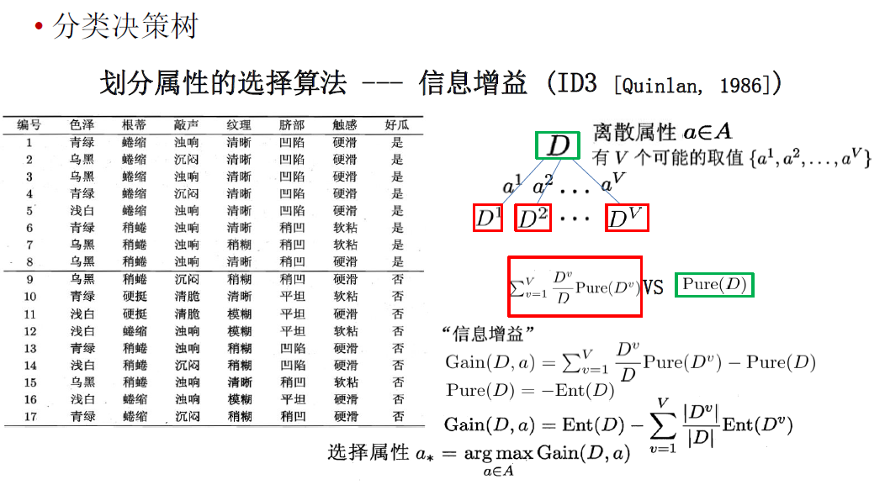
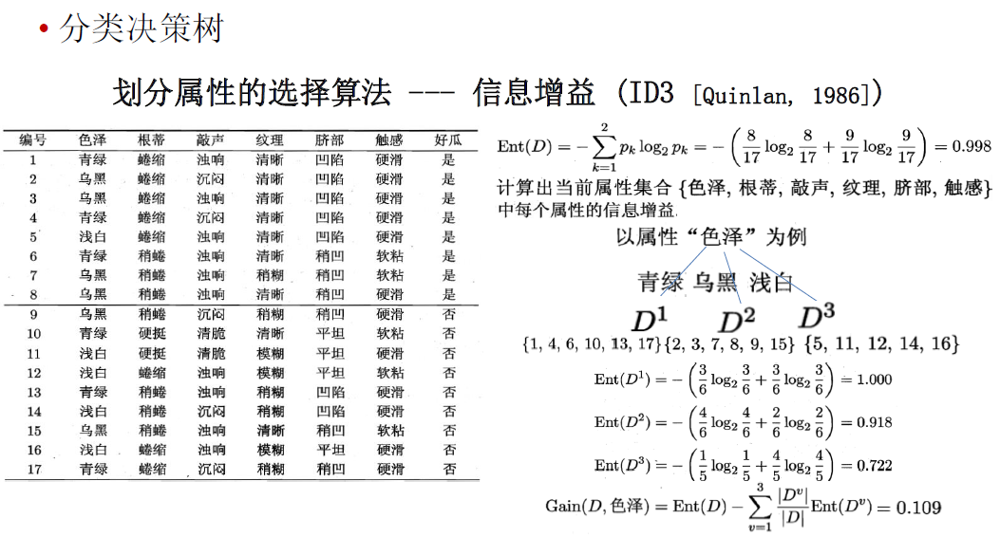
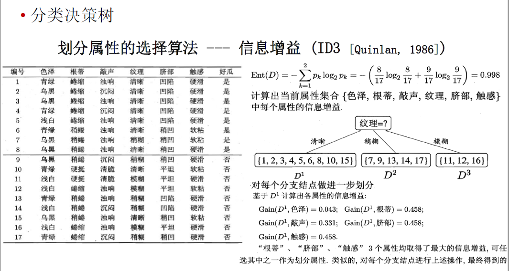
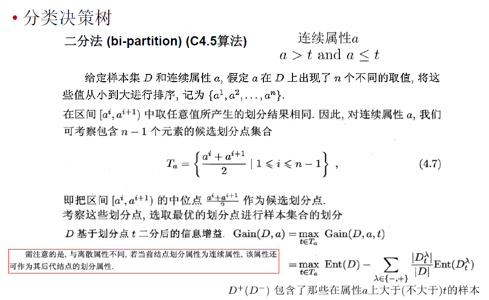

# 分类决策树

构造决策树的基本思想是随着树深度的增加，节点的熵迅速地降低。熵降低的速度越快越好，这样我们有望得到一棵高度最矮的决策树。

当系统的信息熵降为0时，就没有必要再往下构造决策树了，此时叶子节点都是纯的——这是理想情况。最坏情况下，决策树的高度为属性(决策变量)的个数，叶子节点不纯(这意味着我们要以一定的概率来作出决策)。

决策树各个部分的定义

什么时候会产生叶子节点？

P(几率越大)——不确定性越小

评价函数：$C(T)=\sum_{r\in leaf}N_t·H(t)$，其中H(t)是熵或者基尼系数。希望这个评价函数越小越好，类似于损失函数

## 信息增益

## 增益率

增益率对可取值数目较少的属性有所偏好。

所以C4.5算法并不是直接选择增益率最大的候选划分属性，而是使用了一个启发式：先从候选划分属性中找出信息增益高于平均水平的属性，再从中选择增益率最高的。

## 基尼指数

## 二分法（C4.5算法）

# 分类与回归树CART

分类：决策区域的区域R中正类所占比例

回归：决策区域的区域R中训练样本的均值

# 过拟合问题

# 剪枝

决策树中避免过拟合的策略

剪枝prunning

预剪枝
在决策树生成过程中，对每个节点在划分前先进行估计
若当前节点的划分不能带来决策树**泛化性能的提升**，则停止划分并将当前节点标记为叶节点

后剪枝
先从训练集生成一颗完整的决策树
然后自底向上地对非叶节点进行考察
若将该节点对应的子树替换成叶节点能够带来决策树**泛化性能的提升**，则将该子树替换为叶节点

采用留出法，即预留一部分数据用作验证集

预剪枝

降低过拟合风险

减少了训练和测试开销
有欠拟合的风险（有些分支的当前划分虽不能提高泛化性能，但在此基础上的后续划分可能导致泛化性能显著提高，但却被预剪枝“贪心”地剪掉了）

后剪枝

后剪枝通常比预剪枝保留了更多的分支。经验上来看，后剪枝已经能够一定程度避免决策树过拟合的风险，又不会有过多的欠拟合的风险。故泛化性能往往优于预剪枝操作。

然而后剪枝操作的训练开销比较大。（后剪枝过程是在生成完全决策树之后进行的，并且要自底向上地对树中的所有非叶结点进行逐一考察）

