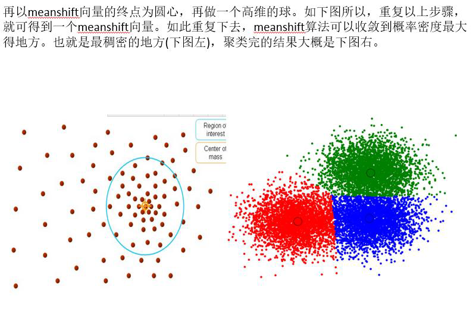

聚类 Clustering

# 什么是聚类

监督学习：发现数据属性和类别属性之间的关联模式。并通过利用这些模式用来预测未知数据实例的类别属性。

无监督学习：数据没有目标属性。发现数据中存在的内在结构。

聚类（Clustering）是一种发现数据中的相似群（聚类，clusters）的技术。

聚类是一个将数据集中在某些方面相似的数据成员进行分类组织的过程。

一个聚类就是一些数据实例的集合，这个集合中的元素彼此相似；与其他聚类中的元素不同。

**聚类的应用**

聚类既可以作为一个单独过程，用于找寻数据内在的分布结构。也可以作为分类等其他学习任务的前驱过程。

实例1：在营销学中，对客户进行分割，为每组客户指定一个套营销策略，也是采用聚类来完成。

实例2：在生物学上，聚类能用于推导植物和动物的分类，对基因进行分类，获得对种群中固有结构的认识。

事实上，聚类是数据挖掘技术中应用最广泛的技术之一。
发展历史长，应用领域广泛。比如：医学类、心理学、植物学、社会学、生物学、营销学。近年来，在线文档的快速发展，文本聚类研究成为关注的重点。对给定文本，需要根据它们内容的相似性来进行组织。建立一个主题层次。

**聚类的形式定义**


**影响聚类算法效果的主要原因有：（　）？**

```
特征选取
模式相似性测度
分类准则
已知类别的样本质量
```

正确答案为A B  C。这道题的答案可以从网上找到。http://www.docin.com/p-756247716.html

D之所以不正确，是因为聚类是对无类别的数据进行聚类，不使用已经标记好的数据。

# 聚类算法概述

**聚类算法**

- 原型聚类
- 层次聚类
- 密度聚类

**距离函数**（相似性或相异性）：度量两个数据点（对象）的相似程度。
**聚类评价**

- 类内差异（聚类内部距离）：最小化
- 类间差异（聚类外部距离）：最大化

聚类结果的质量与**算法、距离函数和应用领域**有很大关系。

## K-均值算法


选择正确的K值 https://byteacademy.co/blog/k-means-clustering/

弯管法  **Elbow Method** 

弯管法允许我们通过视觉辅助对 K 值做出判定。我们试着将我们的数据分解成不同数量的 K 簇，并根据相应的 W（Ck）画出每个 K 簇类型。

$W(C_k)=\frac1{|C_k|}\sum_{i,i'\in C_k}\sum_{j=1}^p{(x_{ij}-x_{i'j})}^2$

 

选择W(Ck)值下降最快的地方对应的K值，这里选择K=2

**Silhouette Method/Analysis** 

Silhouette Analysis可以用来学习结果簇之间的间隔距离。Silhouette coefficient度量了一个簇中的每个点和其邻居簇中的点有多接近，因此可以用来评估例如簇的个数这样的参数。取值范围[-1,1].如果这个相关系数接近1说明样本和邻居簇距离很远，0说明样本在两个相邻簇的决策边界上/很接近决策边界，负值说明样本可能分配到了错误的簇。

一个样本的Silhouette coefficient=(b-a)/max(a,b)，b是样本和最近的簇(不是样本所属簇)之间的距离，a是平均簇内距离/方差。

http://scikit-learn.org/stable/auto_examples/cluster/plot_kmeans_silhouette_analysis.html

==**k-means中的邻近度函数**==

1、曼哈顿距离： 质心：中位数。目标函数：最小化对象到其簇质心的距离和

2、平方欧几里德距离。质心：均值。目标函数：最小化对象到其簇质心的距离的平方和

3、余弦。质心：均值。最大化对象与其质心的余弦相似度和

4、Bregman 散度。质心：均值。目标函数：最小化对象到其簇质心的Bregman散度和

==使用K均值聚类时需要注意的地方==

**1. 输入数据一般需要做缩放，如标准化。**

原因很简单，K均值是建立在距离度量上的，因此不同变量间如果维度差别过大，可能会造成少数变量“施加了过高的影响而造成垄断”。

**2. 如果输入数据的变量类型不同，部分是数值型（numerical），部分是分类变量（categorical），需要做特别处理。**

方法1是将分类变量转化为数值型，但缺点在于如果使用独热编码（one hot encoding）可能会导致数据维度大幅度上升，如果使用标签编码（label encoding）无法很好的处理数据中的顺序（order）。方法2是对于数值型变量和分类变量分开处理，并将结果结合起来，具体可以参考Python的实现[1]，如K-mode和K-prototype。

**3. 输出结果非固定，多次运行结果可能不同。**

首先要意识到K-means中是有随机性的，从初始化到收敛结果往往不同。一种看法是强行固定随机性，比如设定sklearn中的random state为固定值。另一种看法是，如果你的K均值结果总在大幅度变化，比如不同簇中的数据量在多次运行中变化很大，那么K均值不适合你的数据，不要试图稳定结果 [2]。

我个人倾向于后者的看法，K均值虽然易懂，但效果一般，如果多次运行的结果都不稳定，不建议使用K均值。

**4. 运行时间往往可以得到优化，选择最优的工具库。**

基本上现在的K均值实现都是K-means++，速度都不错。但当数据量过大时，依然可以使用其他方法，如MiniBatchKMeans [3]。上百万个数据点往往可以在数秒钟内完成聚类，推荐Sklearn的实现。

**5. 高维数据上的有效性有限。**

建立在距离度量上的算法一般都有类似的问题，那就是在高维空间中距离的意义有了变化，且并非所有维度都有意义。这种情况下，K均值的结果往往不好，而通过划分子空间的算法（sub-spacing method）效果可能更好。

**6. 运行效率与性能之间的取舍。**

但数据量上升到一定程度时，如>10万条数据，那么很多算法都不能使用。最近读到的一篇对比不同算法性能随数据量的变化很有意思 [4]。在作者的数据集上，当数据量超过一定程度时仅K均值和HDBSCAN可用。

## **总结**

因此不难看出，K均值算法最大的优点就是运行速度快，能够处理的数据量大，且易于理解。但缺点也很明显，就是算法性能有限，在高维上可能不是最佳选项。

一个比较粗浅的结论是，在数据量不大时，可以优先尝试其他算法。当数据量过大时，可以试试HDBSCAN。仅当数据量巨大，且无法降维或者降低数量时，再尝试使用K均值。

一个显著的问题信号是，如果多次运行K均值的结果都有很大差异，那么有很高的概率K均值不适合当前数据，要对结果谨慎的分析。

此外无监督聚类的评估往往不易，基本都是基于使用者的主观设计，如sklearn中提供的Silhouette Coefficient和 Calinski-Harabaz Index [5]。更多关于无监督学习如何评估可以参考 [6]。

K均值算法有大量变体。如k-medoids 算法[Kaufman and Rousseeuw, 1987] 强制原型向量必为训练样本， k-modes 算法[Hua吗， 1998] 可处理离散属性， Fuzzy C -means (简称FCM) [Bezdek, 1981]则是"软聚类" (soft clustering) 算法，允许每个样本以不同程度同时属于多个原型。**K均值类算法仅在凸形簇结构上效果较好。（凸形簇结构即形式“椭球”的簇结构）。**若采用某种Bregman 距离，则可显著增强此类算法对更多类型簇结构的适用性。引入核技巧则可得到核k 均值(kernel k-means)算法，这与谱聚类(spectral clustering) 有密切联系[Dhillon et al., 2004]，后者可看作在拉普拉斯特征映射(Laplacian Eigenmap) 降维后执行k 均值聚类.聚类簇数k 通常需由用户提供，有一些启发式用于自动确定k，但常用的仍是基于不同k 值多次运行后选取最佳结果.

------

[1] nicodv/kmodes

[2] Changes of clustering results after each time run in Python scikit-learn

[3] sklearn.cluster.MiniBatchKMeans - scikit-learn 0.19.1 documentation

[4] Benchmarking Performance and Scaling of Python Clustering Algorithms

[5] 2.3. Clustering - scikit-learn 0.19.1 documentation

[6] 微调：一个无监督学习算法，如何判断其好坏呢?

## 学习向量量化(LVQ)

与k 均值算法类似，"学习向量量化" (Learning Vector Quantization，简称LVQ)也是试图找到一组原型向量来刻画聚类结构， 但与一般聚类算法不同的是， LVQ 假设数据样本带有类别标记，学习过程利用样本的这些监督信息来辅助聚类.

LVQ算法如下，每个原型向量代表一个聚类簇，两个原型向量可以代表同一个簇。算法第一行先对原型向量初始化，例如可以对第q个簇，可从对应的同类别样本中随机选取一个作为原型向量。在每一轮选代中，算法随机选取一个有标记训练样本，找出与其距离最近的原型向量，井根据两者的类别标记是否一致来对原型向量进行相应的更新（若类别相同，向该样本的方向靠拢，距离减小为  ，否则远离，距离增大为  ）.在第12 行中，若算法的停止条件已满足(例如己达到最大迭代轮数，或原型向量更新很小甚至不再更新)，则将当前原型向量作为最终结果返回.


## 基于高斯混合分布的聚类

高斯混合模型GMM，用EM算法解


高斯混合聚类的基本假设是：样本的生成过程是由高斯混合分布给出的，也就是说，有若干个（多元）高斯分布，每个分布对应一个被选择的概率，基于这个被选择的概率和若干个分布产生了样本。**如果能知道每个样本是由哪个高斯分布产生的，就知道这个样本属于哪个簇了**。所以聚类问题转化为判断样本主要是由哪个高斯分布产生的。

具体来说，如果已知选择每个混合成分的先验概率和每个混合成分产生每个样本的概率，要求的是给定样本属于每个混合成分的后验概率，选择后验概率最大的那个作为样本的簇。但其实已知条件不足，两个概率都是未知的，需要进行参数估计，可采用极大似然估计法。


2-12：基于EM算法对参数进行迭代更新

停止条件的设定可以是：1. 达到最大迭代论述，或似然函数LL(D)增长小于阈值

14-17：根据高斯混合分布确定簇划分

## 密度聚类

密度聚类亦称"基于密度的聚类" (density-based clustering) ，此类算法假设聚类结构能**通过样本分布的紧密程度确定**.通常情形下，密度聚类算法从样本密度的角度来考察样本之间的可连接性，并基于可连接样本不断扩展聚类簇以获得最终的聚类结果.


### DBSCAN


DBSCAN（全称Density-Based Spatial Clustering of Applications with Noise） 是一种著名的密度聚类算法，它基于一组"邻域" (neighborhood)参数  来刻画样本分布的紧密程度.给定数据集  ，定义下面几个概念：


核心对象：如果对象的Eps邻域至少包含最小数目MinPts的对象，则称该对象为核心对象。
边界点：边界点不是核心点，但落在某个核心点的邻域内。
噪音点：既不是核心点，也不是边界点的任何点

DBSCAN对簇的定义：


那么，如何从数据集D中找出满足以上性质的聚类簇呢？实际上，若x为核心对象，由x密度可达的所有样本组成的集合记为  ，则不难证明X即为满足连接性与最大性的簇。

于是，DBSCAN 算法先任选数据集中的一个核心对象为"种子" (seed) ,再由此出发确定相应的聚类簇，算法描述如图所示.在第1 ~7 行中，算法先根据给定的邻域参数  找出所有核心对象;然后在第10~24 行中，以任一核心对象为出发点，找出由其密度可达的样本生成聚类簇，直到所有核心对象均被访问过为止.


## 层次聚类

层次聚类(hierarchical clustering)试图在不同层次对数据集进行划分，从而形成树形的聚类结构. 数据集的划分可采用**"自底向上"的聚合策略**，也可采用**"自顶向下" 的分拆策略**.

**AGNES**（AGglomerative NESting的缩写） 是一种采用自底向上聚合策略的层次聚类算法.它先将数据集中的每个样本看作一个初始聚类簇，然后在算法运行的每一步中找出距离最近的两个聚类簇进行合并，该过程不断重复，直至达到预设的聚类簇个数.这里的关键是如何计算聚类簇之间的距离.实际上，每个簇是一个样本集合，因此，只需采用关于集合的某种距离即可.例如，给定聚类簇  与  ，可通过下面的式子来计算距离:

显然，最小距离由两个簇的最近样本决定，最大距离由两个簇的最远样本决定，而平均距离则由两个簇的所有样本共同决定.当聚类簇距离由  计算时，AGNES算法被相应地称为**“单链接”**（single-linkage）、**“全链接”**（complete-linkage）或**“均链接”**（average-linkage）算法。

AGNES算法描述如图所示。在第1-9 行，算法先对仅含一个样本的初始聚类簇和相应的距离矩阵进行初始化;然后在第11-23 行， AGNES 不断合并距离最近的聚类簇，并对合并得到的聚类簇的距离矩阵进行更新;上述过程不断重复，直至达到预设的聚类簇数.


一个例子：


和AGNES相反，DIANA是采用自顶向下的分拆策略。AGNES 和DIANA 都不能对己合并或己分拆的聚类簇进行回溯调整，常用的层次聚类算法如BIRCH [Zhang et al., 1996] 、ROCK [Guha et al., 1999] 等对此进行了改进.

## MEAN-SHIFT





