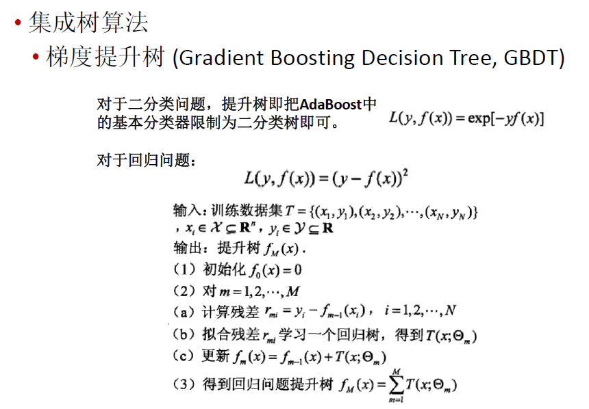

GBDT的思想可以用一个通俗的例子解释，假如有个人30岁，我们首先用20岁去拟合，发现损失有10岁，这时我们用6岁去拟合剩下的损失，发现差距还有4岁，第三轮我们用3岁拟合剩下的差距，差距就只有一岁了。如果我们的迭代轮数还没有完，可以继续迭代下面，每一轮迭代，拟合的岁数误差都会减小。

从上面的例子看这个思想还是蛮简单的，但是有个问题是这个损失的拟合不好度量，损失函数各种各样，怎么找到一种通用的拟合方法呢？

## 负梯度拟合

## GBDT回归算法

## GBDT分类算法

GBDT的分类算法从思想上和GBDT的回归算法没有区别，但是由于样本输出不是连续的值，而是离散的类别，导致我们无法直接从输出类别去拟合类别输出的误差。

为了解决这个问题，主要有两个方法，一个是用指数损失函数，此时GBDT退化为Adaboost算法。另一种方法是用类似于逻辑回归的对数似然损失函数的方法。也就是说，我们用的是类别的预测概率值和真实概率值的差来拟合损失。而对于对数似然损失函数，我们又有二元分类和多元分类的区别。

### 二元GBDT分类算法

### 多元GBDT分类算法

## GBDT常用损失函数

对于分类算法，其损失函数一般有对数损失函数和指数损失函数两种:

对于回归算法，常用损失函数有如下4种:

## GBDT的正则化

和Adaboost一样，我们也需要对GBDT进行正则化，防止过拟合。GBDT的正则化主要有三种方式。

第二种正则化的方式是通过子采样比例（subsample）。取值为(0,1]。注意这里的子采样和随机森林不一样，随机森林使用的是放回抽样，而这里是不放回抽样。如果取值为1，则全部样本都使用，等于没有使用子采样。如果取值小于1，则只有一部分样本会去做GBDT的决策树拟合。选择小于1的比例可以减少方差，即防止过拟合，但是会增加样本拟合的偏差，因此取值不能太低。推荐在[0.5, 0.8]之间。

使用了子采样的GBDT有时也称作随机梯度提升树(Stochastic Gradient Boosting Tree, SGBT)。由于使用了子采样，程序可以通过采样分发到不同的任务去做boosting的迭代过程，最后形成新树，从而减少弱学习器难以并行学习的弱点。

 第三种是对于弱学习器即CART回归树进行正则化剪枝。

## 小结

GBDT主要的优点有：

1）可以灵活处理各种类型的数据，包括连续值和离散值。

2）在相对少的调参时间情况下，预测的准确率也可以比较高。这个是相对SVM来说的。

3）使用一些健壮的损失函数，对异常值的鲁棒性非常强。比如 Huber损失函数和Quantile损失函数。

GBDT的主要缺点有：

1)由于弱学习器之间存在依赖关系，难以并行训练数据。不过可以通过自采样的SGBT来达到部分并行。

## 参考资料

[梯度提升树(GBDT)原理小结](https://www.cnblogs.com/pinard/p/6140514.html)
