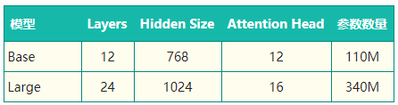
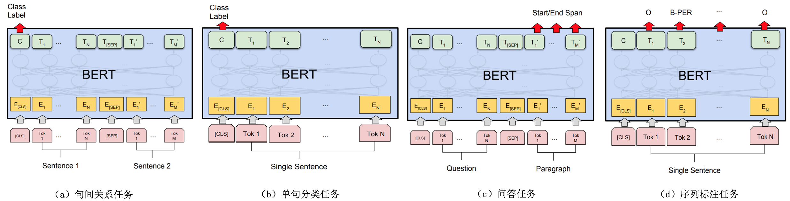
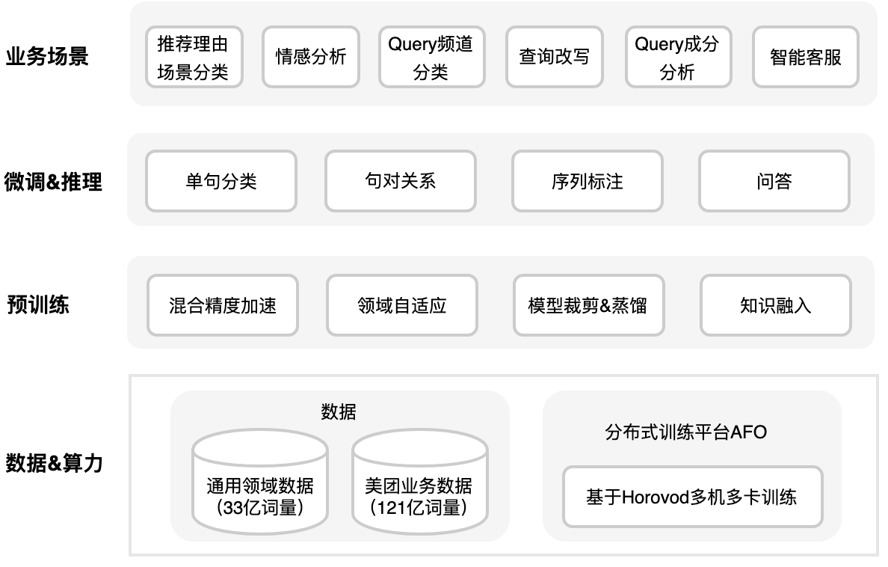

# BERT

# BERT

[BERT](https://arxiv.org/abs/1810.04805) 全称为 Bidirectional Encoder Representations from Transformer，是谷歌在 2018 年 10 月发布的语言表示模型。BERT 通过维基百科和书籍语料组成的庞大语料进行了预训练，使用时只要根据下游任务进行输出层的修改和模型微调训练，就可以得到很好的效果。BERT 发布之初，就在 GLUE、MultiNLI、SQuAD 等评价基准和数据集上取得了超越当时最好成绩的结果。

## BERT结构详解

根据参数设置的不同，Google 论文中提出了Base和Large两种BERT模型。



BERT 的整体结构如下图所示，其是以 Transformer 为基础构建的，使用 WordPiece 的方法进行数据预处理，最后通过 MLM 任务和下个句子预测任务进行预训练的语言表示模型。下面我们从 BERT 的结构：Transformer 出发，来一步步详细解析一下 BERT。

[https://doc.shiyanlou.com/courses/uid522453-20190919-1568876896467](https://doc.shiyanlou.com/courses/uid522453-20190919-1568876896467)

Transformer部分参考：

[Transformer](../Transformer/Transformer.md)

### 输入表示

针对不同的任务，BERT模型的输入可以是单句或者句对。对于每一个输入的Token，它的表征由其对应的词表征（Token Embedding）、段表征（Segment Embedding）和位置表征（Position Embedding）相加产生，如图所示：


BERT模型的输入表示

- 对于英文模型，使用了Wordpiece模型来产生Subword从而减小词表规模；对于中文模型，直接训练基于字的模型。

- 模型输入需要附加一个起始Token，记为[CLS]，对应最终的Hidden State（即Transformer的输出）可以用来表征整个句子，用于下游的分类任务。

- 模型能够处理句间关系。为区别两个句子，用一个特殊标记符[SEP]进行分隔，另外针对不同的句子，将学习到的Segment Embeddings 加到每个Token的Embedding上。

- 对于单句输入，只有一种Segment Embedding；对于句对输入，会有两种Segment Embedding。

### **分词方法 WordPiece** 

BERT 在对数据预处理时，使用了 WordPiece 的方法，WordPiece 从字面意思理解就是把字词拆成一片一片的。

举个例子来讲，如 look，looked，looking 这三个词，它们其实有同样的意思，但如果我们以词作为单位，那它们就会被认为成不同的词。在英语中这样的情况十分常见，所以为了解决这个问题，WordPiece 会把这三个词拆分成 look，look 和 ##ed，look 和 ##ing，这个方法把词本身和时态表示拆分开，不但能够有效减少词表的大小，提高效率，还能够提升词的区分度。

不过，这个方法对中文是无效的，因为在中文中每个字都是最小的单位，不像英文使用空格分词，并且许多词还能够进一步拆分，所以对中文使用 WordPiece 就相当于按字分割，这也是 BERT 的中文预训练模型的一个局限。因此，尽管 BERT 中文预训练模型效果很好，但也还存在可以改进的空间。有一些研究者就从这个角度出发对中文 BERT 进行了改进，如这篇论文：[中文全词覆盖 BERT](https://arxiv.org/abs/1906.08101) ，研究者在预训练的数据处理过程中将原 BERT 中 WordPiece 的分词方法换成了中文分词的方法，然后对词整体添加掩膜，最后进行预训练。在中文数据集测试上，使用这个改进后的预训练模型的测试结果优于使用原版 BERT 的中文预训练模型的测试结果。

## **BERT 预训练模型** 

BERT 在预训练阶段的两个任务：遮蔽语言模型（Masked Language Model（MLM））和句子预测任务（Next Sentence Prediction（NSP））。这两个任务使得 BERT 学到了对自然语言的理解。

### **遮蔽语言模型** 

与常见的训练从左向右语言模型（Left-To-Right Language Model）的预训练任务不同，BERT 是以训练遮蔽语言模型（Masked Language Model）作为预训练目标，具体来说就是把输入的语句中的字词随机用 `[Mask]` 标签覆盖，然后训练模型结合被覆盖的词的左侧和右侧上下文进行预测。可以看出，BERT 的做法与从左向右语言模型只通过左侧语句预测下一个词的做法相比，**遮蔽语言模型能够生成同时融合了左、右上下文的语言表示。这种做法能够使 BERT 学到字词更完整的语义表示** 。

这样做会产生两个缺点：

- （1）会造成预训练和微调时的不一致，因为在微调时[MASK]总是不可见的；
- （2）由于每个Batch中只有15%的词会被预测，因此模型的收敛速度比起单向的语言模型会慢，训练花费的时间会更长。

对于第一个缺点的解决办法是，把80%需要被替换成[MASK]的词进行替换，10%的随机替换为其他词，10%保留原词。由于Transformer Encoder并不知道哪个词需要被预测，哪个词是被随机替换的，这样就强迫每个词的表达需要参照上下文信息。对于第二个缺点目前没有有效的解决办法，但是从提升收益的角度来看，付出的代价是值得的。

BERT 的论文中提到，增加掩膜的具体方式为：先对语句进行 WordPiece 分割，分割后选择句中 15% 的字符，例如选择到了第 i 字符，接下来：

1. 以 80% 的概率使用 `[Mask]` 替换。

2. 以 10% 的概率使用一个随机的字符替换。

3. 以 10% 的概率不进行操作。

下面我们使用在 PyTorch-Transformers 模型库中封装好的 `BERTForMaskedLM()` 类来实际看一下 BERT 在预训练后对遮蔽字的预测效果。首先，需要安装 PyTorch-Transformers。

```
!pip install pytorch-transformers==1.0  # 安装 PyTorch-Transformers
```

[PyTorch-Transformers](https://github.com/huggingface/pytorch-transformers) 是一个以 PyTorch 深度学习框架为基础构建的自然语言处理预训练模型库，早前称之为 `pytorch-pretrained-bert`，如今已正式成为独立项目。

使用 PyTorch-Transformers 模型库，先设置好准备输入模型的例子，使用 `BertTokenizer()` 建立分词器对象对原句进行分词，然后对照词表将词转换成序号。

```python
import torch
from pytorch_transformers import BertTokenizer

model_name = 'bert-base-chinese'  # 指定需下载的预训练模型参数

# BERT 在预训练中引入了 [CLS] 和 [SEP] 标记句子的开头和结尾
samples = ['[CLS] 中国的首都是哪里？ [SEP] 北京是 [MASK] 国的首都。 [SEP]']  # 准备输入模型的语句

tokenizer = BertTokenizer.from_pretrained(model_name)
# 分词
tokenized_text = [tokenizer.tokenize(i) for i in samples]
# 将每个词映射到词典下标
input_ids = [tokenizer.convert_tokens_to_ids(i) for i in tokenized_text]
input_ids = torch.LongTensor(input_ids)
input_ids
```


接下来使用 `BertForMaskedLM()` 建立模型，并将模型设置模型成验证模式。由于 BERT 模型体积很大，且托管在外网，所以本次先从网盘下载链接：[https://pan.baidu.com/s/1afwmZEXZUFnmSwm6eEvmyg](https://pan.baidu.com/s/1afwmZEXZUFnmSwm6eEvmyg)提取码：qkuc

```python
from pytorch_transformers import BertForMaskedLM

# 读取预训练模型
model = BertForMaskedLM.from_pretrained(model_name, cache_dir="./")
model.eval()
```


此时，我们已经准备好了待输入的语句和预训练模型，接下来需要做的就是让模型去预测的覆盖的词的序号。

```python
outputs = model(input_ids)
prediction_scores = outputs[0]
prediction_scores.shape
```


最后找到预测值中最大值对应的序号，然后通过 `tokenizer.convert_ids_to_tokens()` 在词表中查找，转换成对应的字。

```python
import numpy as np

sample = prediction_scores[0].detach().numpy()
pred = np.argmax(sample, axis=1)

tokenizer.convert_ids_to_tokens(pred)[14]
```


输出结果应该是：

```
中
```


可以看到，最后的预测结果是正确的的，说明 BERT 真的对语言有了理解。

### **句子预测任务** 

为了训练一个理解句子间关系的模型，引入一个下一句预测任务。这一任务的训练语料可以从语料库中抽取句子对包括两个句子A和B来进行生成，其中50%的概率B是A的下一个句子，50%的概率B是语料中的一个随机句子。NSP任务预测B是否是A的下一句。NSP的目的是获取句子间的信息，这点是语言模型无法直接捕捉的。

Google的论文结果表明，这个简单的任务对问答和自然语言推理任务十分有益，但是后续一些新的研究[15]发现，去掉NSP任务之后模型效果没有下降甚至还有提升。

下面我们使用 PyTorch-Transformers 库中的句子预测模型进行，观察一下输出结果。

首先构造输入样本，然后进行分词和词向序号的转换。

```python
samples = ["[CLS]今天天气怎么样？[SEP]今天天气很好。[SEP]", "[CLS]小明今年几岁了？[SEP]小明爱吃西瓜。[SEP]"]
tokenizer = BertTokenizer.from_pretrained(model_name)
tokenized_text = [tokenizer.tokenize(i) for i in samples]
input_ids = [tokenizer.convert_tokens_to_ids(i) for i in tokenized_text]
input_ids = torch.LongTensor(input_ids)
input_ids
```


构造句子的分段 id，按照上下句分别标为 `0` 和 `1`。

```python
segments_ids = [[0, 0, 0, 0, 0, 0, 0, 0, 0, 0, 1, 1, 1, 1, 1, 1, 1, 1],
                [0, 0, 0, 0, 0, 0, 0, 0, 0, 0, 1, 1, 1, 1, 1, 1, 1, 1]]

segments_tensors = torch.tensor(segments_ids)
segments_tensors
```


接下来使用 `BertForNextSentencePrediction()` 初始化模型，再加载 BERT 的预训练参数。

```python
from pytorch_transformers import BertForNextSentencePrediction

model = BertForNextSentencePrediction.from_pretrained(
    model_name, cache_dir="./")
model.eval()
```


最后将样本输入模型进行预测，输出模型的预测结果。

```python
outputs = model(input_ids)
seq_relationship_scores = outputs[0]
seq_relationship_scores
```


```python
sample = seq_relationship_scores.detach().numpy()
pred = np.argmax(sample, axis=1)
pred
```


最终的输出结果应该是：`[0, 1]`。

`0` 表示是上下句关系，`1` 表示不是上下句关系。因此从上面结果可以看到，模型预测第一个句子对是上下句关系，第二个句子对不是，对于这两个样本 BERT 的预测正确。

我们通过两个例子来看 BERT 的效果，都是非常理想的。实际上，BERT 效果好的原因主要有两点：

1. 使用的双向的 Transformer 结构学习到左、右两侧上下文语境。

2. 使用完整的文档语料训练而不是打乱的句子，配合下个句子预测任务，从而学习到了捕捉很长的连续语句中的信息的能力。

## **BERT Finetune** 

当使用 BERT 完成文本分类时，通常有 2 种方案：

1. 从预训练好的 BERT 模型中提取特征向量，即 Feature Extraction 方法。

2. 将下游任务模型添加到 BERT 模型之后，然后使用下游任务的训练集对进行训练，即 Fine-Tuning 方法。

通常 Fine-Tuning 方法更常被人们使用，因为通过结合下游任务的数据集进行微调从而调整预训练模型参数，使模型能够更好捕捉到下游任务的数据特征。

**Fine-tuning 的优势** 

在本教程中，我们将使用BERT来训练一个文本分类器。具体来说，我们将采取预训练的 BERT 模型，在末端添加一个未训练过的神经元层，然后训练新的模型来完成我们的分类任务。为什么要这样做，而不是训练一个特定的深度学习模型（CNN、BiLSTM等）？

1. 更快速的开发。首先，预训练的 BERT 模型权重已经编码了很多关于我们语言的信息。因此，训练我们的微调模型所需的时间要少得多——就好像我们已经对网络的底层进行了广泛的训练，只需要将它们作为我们的分类任务的特征，并轻微地调整它们就好。事实上，作者建议在特定的 NLP 任务上对 BERT 进行微调时，**只需要 2-4 个 epochs 的训练**（相比之下，从头开始训练原始 BERT 或 LSTM 模型需要数百个 GPU 小时）。

2. 更少的数据。此外，也许同样重要的是，预训练这种方法，允许我们在一个比从头开始建立的模型所需要的数据集小得多的数据集上进行微调。从零开始建立的 NLP 模型的一个主要缺点是，我们通常需要一个庞大的数据集来训练我们的网络，以达到合理的精度，这意味着我们必须投入大量的时间和精力在数据集的创建上。通过对 BERT 进行微调，我们现在可以在更少的数据集上训练一个模型，使其达到良好的性能。

3. 更好的结果最后，这种简单的微调程过程（通常在 BERT 的基础上增加一个全连接层，并训练几个 epochs）被证明可以在广泛的任务中以最小的调节代价来实现最先进的结果：分类、语言推理、语义相似度、问答问题等。与其实现定制的、有时还很难理解的网络结构来完成特定的任务，不如使用 BERT 进行简单的微调，也许是一个更好的（至少不会差）选择。

BERT 要求我们：

1. 在句子的句首和句尾添加特殊的符号

&ensp;&ensp;&ensp;&ensp;1. 在每个句子的结尾，需要添加特殊的 [SEP] 符号。在以输入为两个句子的任务中（例如：句子 A 中的问题的答案是否可以在句子 B 中找到），该符号为这两个句子的分隔符。

&ensp;&ensp;&ensp;&ensp;2. 在分类任务中，我们需要将 [CLS] 符号插入到每个句子的开头。这个符号有特殊的意义，BERT 包含 12 个 Transformer 层，每层接受一组 token 的 embeddings 列表作为输入，并产生相同数目的 embeddings 作为输出（当然，它们的值是不同的）。**最后一层 transformer 的输出，只有第 1 个 embedding（对应到 [CLS] 符号）会输入到分类器中。你也许会想到对最后一层的 embeddings 使用一些池化策略，但没有必要。**因为 BERT 就是被训练成只使用 [CLS] 来做分类，它会把分类所需的一切信息编码到 [CLS] 对应的 768 维 embedding 向量中，相当于它已经为我们做好了池化工作。

2. 给句子填充 or 截断，使每个句子保持固定的长度。

&ensp;&ensp;&ensp;&ensp;1. 所有句子必须被填充或截断到固定的长度，句子最大的长度为 512 个 tokens。

&ensp;&ensp;&ensp;&ensp;2. 填充句子要使用 [PAD] 符号，它在 BERT 词典中的下标为 0

&ensp;&ensp;&ensp;&ensp;3. 句子的最大长度配置会影响训练和评估速度。

3. 用 “attention mask” 来显示的区分填充的 tokens 和非填充的 tokens。

&ensp;&ensp;&ensp;&ensp;1. “Attention Mask” 是一个只有 0 和 1 组成的数组，标记哪些 tokens 是填充的（0），哪些不是的（1）。掩码会告诉 BERT 中的 “Self-Attention” 机制不去处理这些填充的符号。

在微调过程中，BERT 的作者建议使用以下超参 (from Appendix A.3 of the **BERT paper** ):：

- 批量大小：16, 32
- 学习率（Adam）：5e-5, 3e-5, 2e-5
- epochs 的次数：2, 3, 4

### 常见任务

**双句分类任务**。两句拼起来，加上[CLS]和[SEP]，直接取[CLS]位置输出向量预测，进行 finetune。

**单句分类任务**。直接拿单句，前面加入[CLS]输入，之后同样取[CLS]位置输出来预测，进行 finetune。

**问答（QA）任务**。将问题和答题所需上下文分别作为上句与下句，加入[CLS]和[SEP]特殊符，之后通过在上下文部分预测答案所在位置开头(Start)与结尾(End)，进行 finetune。

**单句标注任务**。类似单句分类，先加入[CLS]，但是最后取其他位置输出，预测相应标注，进行 finetune。


## BERT之灵魂拷问

### **为什么BERT比ELMo效果好？** 

从网络结构以及最后的实验效果来看，BERT比ELMo效果好主要集中在以下几点原因：

(1).LSTM抽取特征的能力远弱于Transformer

(2).拼接方式双向融合的特征融合能力偏弱(没有具体实验验证，只是推测)

(3).其实还有一点，BERT的训练数据以及模型参数均多余ELMo，这也是比较重要的一点

### **ELMo和BERT的区别是什么？** 

ELMo模型是通过语言模型任务得到句子中单词的embedding表示，以此作为补充的新特征给下游任务使用。因为ELMO给下游提供的是每个单词的特征形式，所以这一类预训练的方法被称为“Feature-based Pre-Training”。而BERT模型是“基于Fine-tuning的模式”，这种做法和图像领域基于Fine-tuning的方式基本一致，下游任务需要将模型改造成BERT模型，才可利用BERT模型预训练好的参数。

### **BERT有什么局限性？** 

从XLNet论文中，提到了BERT的两个缺点，分别如下：

- BERT在第一个预训练阶段，假设句子中多个单词被Mask掉，这些被Mask掉的单词之间没有任何关系，是条件独立的，然而有时候这些单词之间是有关系的，比如”New York is a city”，假设我们Mask住”New”和”York”两个词，那么给定”is a city”的条件下”New”和”York”并不独立，因为”New York”是一个实体，看到”New”则后面出现”York”的概率要比看到”Old”后面出现”York”概率要大得多。

&ensp;&ensp;&ensp;&ensp;- 但是需要注意的是，这个问题并不是什么大问题，甚至可以说对最后的结果并没有多大的影响，因为本身BERT预训练的语料就是海量的(动辄几十个G)，所以如果训练数据足够大，其实不靠当前这个例子，靠其它例子，也能弥补被Mask单词直接的相互关系问题，因为总有其它例子能够学会这些单词的相互依赖关系。

- BERT的在预训练时会出现特殊的[MASK]，但是它在下游的fine-tune中不会出现，这就出现了预训练阶段和fine-tune阶段不一致的问题。其实这个问题对最后结果产生多大的影响也是不够明确的，因为后续有许多BERT相关的预训练模型仍然保持了[MASK]标记，也取得了很大的结果，而且很多数据集上的结果也比BERT要好。但是确确实实引入[MASK]标记，也是为了构造自编码语言模型而采用的一种折中方式。

另外还有一个缺点，是BERT在分词后做[MASK]会产生的一个问题，为了解决OOV的问题，我们通常会把一个词切分成更细粒度的WordPiece。BERT在Pretraining的时候是随机Mask这些WordPiece的，这就可能出现只Mask一个词的一部分的情况，例如：


probability这个词被切分成"pro"、”#babi”和”#lity”3个WordPiece。有可能出现的一种随机Mask是把”#babi” Mask住，但是”pro”和”#lity”没有被Mask。这样的预测任务就变得容易了，因为在”pro”和”#lity”之间基本上只能是”#babi”了。这样它只需要记住一些词(WordPiece的序列)就可以完成这个任务，而不是根据上下文的语义关系来预测出来的。类似的中文的词”模型”也可能被Mask部分(其实用”琵琶”的例子可能更好，因为这两个字只能一起出现而不能单独出现)，这也会让预测变得容易。

为了解决这个问题，很自然的想法就是词作为一个整体要么都Mask要么都不Mask，这就是所谓的Whole Word Masking。这是一个很简单的想法，对于BERT的代码修改也非常少，只是修改一些Mask的那段代码。

## 源码解析

BERT 模型对 Self-Attention 的实现代码片段：

```python
# 取自 hugging face 团队实现的基于 pytorch 的 BERT 模型
class BERTSelfAttention(nn.Module):
    # BERT 的 Self-Attention 类
    def __init__(self, config):
        # 初始化函数
        super(BERTSelfAttention, self).__init__()
        if config.hidden_size % config.num_attention_heads != 0:
            raise ValueError(
                "The hidden size (%d) is not a multiple of the number of attention "
                "heads (%d)" % (config.hidden_size, config.num_attention_heads))
        self.num_attention_heads = config.num_attention_heads
        self.attention_head_size = int(config.hidden_size / config.num_attention_heads)
        self.all_head_size = self.num_attention_heads * self.attention_head_size

        self.query = nn.Linear(config.hidden_size, self.all_head_size)
        self.key = nn.Linear(config.hidden_size, self.all_head_size)
        self.value = nn.Linear(config.hidden_size, self.all_head_size)

    def transpose_for_scores(self, x):
        # 调整维度，转换为 (batch_size, num_attention_heads, hidden_size, attention_head_size)
        new_x_shape = x.size()[:-1] + (self.num_attention_heads, self.attention_head_size)
        x = x.view(*new_x_shape)
        return x.permute(0, 2, 1, 3)

    def forward(self, hidden_states):
        # 前向传播函数
        mixed_query_layer = self.query(hidden_states)
        mixed_key_layer = self.key(hidden_states)
        mixed_value_layer = self.value(hidden_states)

        query_layer = self.transpose_for_scores(mixed_query_layer) 
        key_layer = self.transpose_for_scores(mixed_key_layer)
        value_layer = self.transpose_for_scores(mixed_value_layer)

        # 将"query"和"key"点乘，得到未经处理注意力值
        attention_scores = torch.matmul(query_layer, key_layer.transpose(-1, -2))
        attention_scores = attention_scores / math.sqrt(self.attention_head_size)

        # 使用 softmax 函数将注意力值标准化成概率值
        attention_probs = nn.Softmax(dim=-1)(attention_scores)

        context_layer = torch.matmul(attention_probs, value_layer)
        context_layer = context_layer.permute(0, 2, 1, 3).contiguous()
        new_context_layer_shape = context_layer.size()[:-2] + (self.all_head_size,)
        context_layer = context_layer.view(*new_context_layer_shape)
        return context_layer
```


参照Transformer 的结构，在 Multi-Head Attention 之后是 Add & Norm，将经过注意力机制计算后的向量和原输入相加并归一化，进入 Feed Forward Neural Network，然后再进行一次和输入的相加并完成归一化。

## 工业实践

### 知识融入

BERT在自然语言理解任务上取得了巨大的成功，但也存在着一些不足。

**其一是常识（Common Sense）的缺失。**人类日常活动需要大量的常识背景知识支持，BERT学习到的是样本空间的特征、表征，可以看作是大型的文本匹配模型，而大量的背景常识是隐式且模糊的，很难在预训练数据中进行体现。

**其二是缺乏对语义的理解。**模型并未理解数据中蕴含的语义知识，缺乏推理能力。在美团点评搜索场景中，需要首先对用户输入的Query进行意图识别，以确保召回结果的准确性。比如，对于“宫保鸡丁”和“宫保鸡丁酱料”两个Query，二者的BERT语义表征非常接近，但是蕴含的搜索意图却截然不同。前者是菜品意图，即用户想去饭店消费，而后者则是商品意图，即用户想要从超市购买酱料。在这种场景下，BERT模型很难像正常人一样做出正确的推理判断。

为了处理上述情况，美团尝试在MT-BERT预训练过程中融入知识图谱信息。

BERT在进行语义建模时，主要聚焦最原始的单字信息，却很少对实体进行建模。具体地，BERT为了训练深层双向的语言表征，采用了Masked LM（MLM）训练策略。该策略类似于传统的完形填空任务，即在输入端，随机地“遮蔽”掉部分单字，在输出端，让模型预测出这些被“遮蔽”的单字。模型在最初并不知道要预测哪些单字，因此它输出的每个单字的嵌入表示，都涵盖了上下文的语义信息，以便把被“掩盖”的单字准确的预测出来。

BERT模型通过字的搭配（比如“全X德”），很容易推测出被“掩盖”字信息（“德”），但这种做法只学习到了实体内单字之间共现关系，并没有学习到实体的整体语义表示。因此，我们使用Knowledge-aware Masking的方法来预训练MT-BERT。具体的做法是，输入仍然是字，但在随机”遮蔽”时，不再选择遮蔽单字，而是选择“遮蔽”实体对应的词。这需要我们在预训练之前，对语料做分词，并将分词结果和图谱实体对齐。

### 模型轻量化

为了减少模型响应时间，满足上线要求，业内主要有三种模型轻量化方案。

- 低精度量化。在模型训练和推理中使用低精度（FP16甚至INT8、二值网络）表示取代原有精度（FP32）表示。

- 模型裁剪和剪枝。减少模型层数和参数规模。

- 模型蒸馏。通过知识蒸馏方法[22]基于原始BERT模型蒸馏出符合上线要求的小模型。

图8展示了基于BERT模型微调可以支持的任务类型，包括句对分类、单句分类、问答（机器阅读理解）和序列标注任务。

1. 句对分类任务和单句分类任务是句子级别的任务。预训练中的NSP任务使得BERT中的“[CLS]”位置的输出包含了整个句子对（句子）的信息，我们利用其在有标注的数据上微调模型，给出预测结果。

2. 问答和序列标注任务都属于词级别的任务。预训练中的MLM任务使得每个Token位置的输出都包含了丰富的上下文语境以及Token本身的信息，我们对BERT的每个Token的输出都做一次分类，在有标注的数据上微调模型并给出预测。



### **单句分类** 

**细粒度情感分析** 

为了更全面更真实的描述商家各属性情况，细粒度情感分析需要判断评论文本在各个属性上的情感倾向（即正面、负面、中立）。为了优化美团点评业务场景下的细粒度情感分析效果，NLP中心标注了包含6大类20个细粒度要素的高质量数据集，标注过程中采用严格的多人标注机制保证标注质量，并在AI Challenger 2018细粒度情感分析比赛中作为比赛数据集验证了效果，吸引了学术界和工业届大量队伍参赛。

针对细粒度情感分析任务，我们设计了基于MT-BERT的多任务分类模型，模型结构如图9所示。模型架构整体分为两部分：一部分是各情感维度的参数共享层（Share Layers），另一部分为各情感维度的参数独享层（Task-specific Layers）。其中参数共享层采用了MT-BERT预训练语言模型得到文本的上下文表征。MT-BERT依赖其深层网络结构以及海量数据预训练，可以更好的表征上下文信息，尤其擅长提取深层次的语义信息。 参数独享层采用多路并行的Attention+Softmax组合结构，对文本在各个属性上的情感倾向进行分类预测。通过MT-BERT优化后的细粒度情感分析模型在Macro-F1上取得了显著提升。


图9 基于MT-BERT的多任务细粒度情感分析模型架构

细粒度情感分析的重要应用场景之一是大众点评的精选点评模块，如图10所示。精选点评模块作为点评App用户查看高质量评论的入口，其中精选点评标签承载着结构化内容聚合的作用，支撑着用户高效查找目标UGC内容的需求。细粒度情感分析能够从不同的维度去挖掘评论的情感倾向。基于细粒度情感分析的情感标签能够较好地帮助用户筛选查看，同时外露更多的POI信息，帮助用户高效的从评论中获取消费指南。


**Query意图分类** 

在美团点评的搜索架构中，Deep Query Understanding（DQU）都是重要的前置模块之一。对于用户Query，需要首先对用户搜索意图进行识别，如美食、酒店、演出等等。我们跟内部的团队合作，尝试了直接使用MT-BERT作为Query意图分类模型。为了保证模型在线Inference时间，我们使用裁剪后的4层MT-BERT模型（MT-BERT-MINI，MBM模型）上线进行Query意图的在线意图识别，取得的业务效果如图11所示：


图11 MBM模型的业务效果

同时对于搜索日志中的高频Query，我们将预测结果以词典方式上传到缓存，进一步减少模型在线预测的QPS压力。MBM累计支持了美团点评搜索17个业务频道的Query意图识别模型，相比原有模型，均有显著的提升，每个频道的识别精确度都达到95%以上。MBM模型上线后，提升了搜索针对Query文本的意图识别能力，为下游的搜索的召回、排序及展示、频道流量报表、用户认知报表、Bad Case归因等系统提供了更好的支持。

**推荐理由场景化分类** 

推荐理由是点评搜索智能中心数据挖掘团队基于大众点评UGC为每个POI生产的自然语言可解释性理由。对于搜索以及推荐列表展示出来的每一个商家，我们会用一句自然语言文本来突出商家的特色和卖点，从而让用户能够对展示结果有所感知。

对于不同的业务场景，对推荐理由会有不同的要求。在外卖搜索场景下，用户可能更为关注菜品和配送速度，不太关注餐馆的就餐环境和空间，这种情况下只保留符合外卖场景的推荐理由进行展示。同样地，在酒店搜索场景下，用户可能更为关注酒店特色相关的推荐理由（如交通是否方便，酒店是否近海近景区等）。

我们通过内部合作，为业务方提供符合不同场景需求的推荐理由服务。推荐理由场景化分类，即给定不同业务场景定义，为每个场景标注少量数据，我们可以基于MT-BERT进行单句分类微调

### **句间关系** 

句间关系任务是对两个短语或者句子之间的关系进行分类，常见句间关系任务如自然语言推理（Natural Language Inference, NLI）、语义相似度判断（Semantic Textual Similarity，STS）等。Query改写是在搜索引擎中对用户搜索Query进行同义改写，改善搜索召回结果的一种方法。Query改写可以在不改变用户意图的情况下，尽可能多的召回满足用户意图的搜索结果，提升用户的搜索体验。对改写后Query和原Query做语义一致性判断，只有语义一致的Query改写对才能上线生效。

### **序列标注** 

给定一个序列，对序列中的每个元素做一个标记，或者说给每一个元素打一个标签，如中文命名实体识别、中文分词和词性标注等任务都属于序列标注的范畴。命名实体识别（Named Entity Recognition，NER），是指识别文本中具有特定意义的实体，主要包括人名、地名、机构名、专有名词等，以及时间、数量、货币、比例数值等文字。

在美团点评业务场景下，NER主要需求包括搜索Query成分分析，UGC文本中的特定实体（标签）识别/抽取，以及客服对话中的槽位识别等。NLP中心和酒店搜索算法团队合作，基于MT-BERT微调来优化酒店搜索Query成分分析任务。酒店Query成分分析任务中，需要识别出Query中城市、地标、商圈、品牌等不同成分，用于确定后续的召回策略。

在酒店搜索Query成分分析中，我们对标签采用“BME”编码格式，即对一个实体，第一个字需要预测成实体的开始B，最后一个字需要预测成实体的结束E，中间部分则为M。以图13中酒店搜索Query成分分析为例，对于Query “北京昆泰酒店”，成分分析模型需要将“北京”识别成地点，而“昆泰酒店”识别成POI。MT-BERT预测高频酒店Query成分后通过缓存提供线上服务，结合后续召回策略，显著提升了酒店搜索的订单转化率。

## bert-as-service的简单使用

1.安装bert-as-service，这是一个可以利用bert模型将句子映射到固定长度向量的服务

`pip install bert-serving-server`

`pip install bert-serving-client`

注意该服务tensorflow的最低版本为1.10，tensorflow2暂不支持

下载bert预训练模型：

[https://github.com/google-research/bert#pre-trained-models](https://github.com/google-research/bert#pre-trained-models)

2.在终端用命令启动服务

`bert-serving-start -model_dir bert_chinese/`

3.在Python中调用如下命令

```JavaScript
from bert_serving.client import BertClient
bc = BertClient() 
vec = bc.encode(['一二三四五六七八', '今天您吃了吗？']) 
print(vec) 
```

## Pytorch使用BERT

参考项目Bert-Chinese-Text-Classification-Pytorch

```python
import torch
import torch.nn as nn
# from pytorch_pretrained_bert import BertModel, BertTokenizer
from pytorch_pretrained import BertModel, BertTokenizer


class Config(object):

    """配置参数"""
    def __init__(self, dataset):
        self.model_name = 'bert'
        self.train_path = dataset + '/data/train.txt'                                # 训练集
        self.dev_path = dataset + '/data/dev.txt'                                    # 验证集
        self.test_path = dataset + '/data/test.txt'                                  # 测试集
        self.class_list = [x.strip() for x in open(
            dataset + '/data/class.txt', encoding='utf-8').readlines()]                                # 类别名单
        self.save_path = dataset + '/saved_dict/' + self.model_name + '.ckpt'        # 模型训练结果
        self.device = torch.device('cuda' if torch.cuda.is_available() else 'cpu')   # 设备

        self.require_improvement = 1000                                 # 若超过1000batch效果还没提升，则提前结束训练
        self.num_classes = len(self.class_list)                         # 类别数
        self.num_epochs = 5                                             # epoch数
        self.batch_size = 64                                           # mini-batch大小
        self.pad_size = 32                                              # 每句话处理成的长度(短填长切)
        self.learning_rate = 5e-5                                       # 学习率
        self.bert_path = './bert_pretrain'
        self.tokenizer = BertTokenizer.from_pretrained(self.bert_path)
        self.hidden_size = 768


class Model(nn.Module):

    def __init__(self, config):
        super(Model, self).__init__()
        self.bert = BertModel.from_pretrained(config.bert_path)
        for param in self.bert.parameters():
            param.requires_grad = True
        self.fc = nn.Linear(config.hidden_size, config.num_classes)

    def forward(self, x):
        context = x[0]  # 输入的句子
        mask = x[2]  # 对padding部分进行mask，和句子一个size，padding部分用0表示，如：[1, 1, 1, 1, 0, 0]
        _, pooled = self.bert(context, attention_mask=mask, output_all_encoded_layers=False)
        out = self.fc(pooled)
        return out
```

### BERT-CNN
```python
class Model(nn.Module):  
  
    def __init__(self, config):  
        super(Model, self).__init__()  
        self.bert = BertModel.from_pretrained(config.bert_path)  
        for param in self.bert.parameters():  
            param.requires_grad = True  
 self.convs = nn.ModuleList(  
            [nn.Conv2d(1, config.num_filters, (k, config.hidden_size)) for k in config.filter_sizes])  
        self.dropout = nn.Dropout(config.dropout)  
  
        self.fc_cnn = nn.Linear(config.num_filters * len(config.filter_sizes), config.num_classes)  
  
    def conv_and_pool(self, x, conv):  
        x = F.relu(conv(x)).squeeze(3)  
        x = F.max_pool1d(x, x.size(2)).squeeze(2)  
        return x  
  
    def forward(self, x):  
        context = x[0]  # 输入的句子  
 mask = x[2]  # 对padding部分进行mask，和句子一个size，padding部分用0表示，如：[1, 1, 1, 1, 0, 0]  
 encoder_out, text_cls = self.bert(context, attention_mask=mask, output_all_encoded_layers=False)  
        out = encoder_out.unsqueeze(1)  
        out = torch.cat([self.conv_and_pool(out, conv) for conv in self.convs], 1)  
        out = self.dropout(out)  
        out = self.fc_cnn(out)  
        return out
```

### BERT-DPCNN

```python
class Model(nn.Module):

    def __init__(self, config):
        super(Model, self).__init__()
        self.bert = BertModel.from_pretrained(config.bert_path)
        for param in self.bert.parameters():
            param.requires_grad = True
        # self.fc = nn.Linear(config.hidden_size, config.num_classes)
        self.conv_region = nn.Conv2d(1, config.num_filters, (3, config.hidden_size), stride=1)
        self.conv = nn.Conv2d(config.num_filters, config.num_filters, (3, 1), stride=1)
        self.max_pool = nn.MaxPool2d(kernel_size=(3, 1), stride=2)
        self.padding1 = nn.ZeroPad2d((0, 0, 1, 1))  # top bottom
        self.padding2 = nn.ZeroPad2d((0, 0, 0, 1))  # bottom
        self.relu = nn.ReLU()
        self.fc = nn.Linear(config.num_filters, config.num_classes)

    def forward(self, x):
        context = x[0]  # 输入的句子
        mask = x[2]  # 对padding部分进行mask，和句子一个size，padding部分用0表示，如：[1, 1, 1, 1, 0, 0]
        encoder_out, text_cls = self.bert(context, attention_mask=mask, output_all_encoded_layers=False)
        x = encoder_out.unsqueeze(1)  # [batch_size, 1, seq_len, embed]
        x = self.conv_region(x)  # [batch_size, 250, seq_len-3+1, 1]

        x = self.padding1(x)  # [batch_size, 250, seq_len, 1]
        x = self.relu(x)
        x = self.conv(x)  # [batch_size, 250, seq_len-3+1, 1]
        x = self.padding1(x)  # [batch_size, 250, seq_len, 1]
        x = self.relu(x)
        x = self.conv(x)  # [batch_size, 250, seq_len-3+1, 1]
        while x.size()[2] > 2:
            x = self._block(x)
        x = x.squeeze()  # [batch_size, num_filters(250)]
        x = self.fc(x)
        return x
```

### BERT-RCNN

```python
class Model(nn.Module):

    def __init__(self, config):
        super(Model, self).__init__()
        self.bert = BertModel.from_pretrained(config.bert_path)
        for param in self.bert.parameters():
            param.requires_grad = True
        self.lstm = nn.LSTM(config.hidden_size, config.rnn_hidden, config.num_layers,
                            bidirectional=True, batch_first=True, dropout=config.dropout)
        self.maxpool = nn.MaxPool1d(config.pad_size)
        self.fc = nn.Linear(config.rnn_hidden * 2 + config.hidden_size, config.num_classes)

    def forward(self, x):
        context = x[0]  # 输入的句子
        mask = x[2]  # 对padding部分进行mask，和句子一个size，padding部分用0表示，如：[1, 1, 1, 1, 0, 0]
        encoder_out, text_cls = self.bert(context, attention_mask=mask, output_all_encoded_layers=False)
        out, _ = self.lstm(encoder_out)
        out = torch.cat((encoder_out, out), 2)
        out = F.relu(out)
        out = out.permute(0, 2, 1)
        out = self.maxpool(out).squeeze()
        out = self.fc(out)
        return out
```


### BERT-RNN

```python
class Model(nn.Module):

    def __init__(self, config):
        super(Model, self).__init__()
        self.bert = BertModel.from_pretrained(config.bert_path)
        for param in self.bert.parameters():
            param.requires_grad = True
        self.lstm = nn.LSTM(config.hidden_size, config.rnn_hidden, config.num_layers,
                            bidirectional=True, batch_first=True, dropout=config.dropout)
        self.dropout = nn.Dropout(config.dropout)
        self.fc_rnn = nn.Linear(config.rnn_hidden * 2, config.num_classes)

    def forward(self, x):
        context = x[0]  # 输入的句子
        mask = x[2]  # 对padding部分进行mask，和句子一个size，padding部分用0表示，如：[1, 1, 1, 1, 0, 0]
        encoder_out, text_cls = self.bert(context, attention_mask=mask, output_all_encoded_layers=False)
        out, _ = self.lstm(encoder_out)
        out = self.dropout(out)
        out = self.fc_rnn(out[:, -1, :])  # 句子最后时刻的 hidden state
        return out
```


## **BERT** 情感分类实践

下面使用 Fine-Tuning 方法应用 BERT 预训练模型进行情感分类任务。

首先，下载一个 [情感分类数据集](https://mlln.cn/2018/10/11/%E4%B8%AD%E6%96%87%E6%83%85%E6%84%9F%E5%88%86%E6%9E%90%E8%AF%AD%E6%96%99%E5%BA%93%E5%A4%A7%E5%85%A8-%E5%B8%A6%E4%B8%8B%E8%BD%BD%E5%9C%B0%E5%9D%80/)，我们已经提前下载好并放在网盘中。

```python
# 读取数据文件
with open('./negdata.txt', 'r', encoding='utf-8') as f:
    neg_data = f.read()
with open('./posdata.txt', 'r', encoding='utf-8') as f:
    pos_data = f.read()

neg_datalist = neg_data.split('\n')
pos_datalist = pos_data.split('\n')
print(len(neg_datalist), len(pos_datalist))

# 1 表示正面的评论，0 表示负面的评论
import numpy as np
dataset = np.array(pos_datalist + neg_datalist)
labels = np.array([1] * len(pos_datalist) + [0] * len(neg_datalist))
print(len(dataset))  # 共 3000 条数据

# 样本随机排列
np.random.seed(10)
mix_index = np.random.choice(3000, 3000)
dataset = dataset[mix_index]
labels = labels[mix_index]

# 训练集和验证集
TRAINSET_SIZE = 2500
EVALSET_SIZE = 500

train_samples = dataset[:TRAINSET_SIZE]  # 2500 条数据
train_labels = labels[:TRAINSET_SIZE]
eval_samples = dataset[TRAINSET_SIZE:TRAINSET_SIZE+EVALSET_SIZE]  # 500 条数据
eval_labels = labels[TRAINSET_SIZE:TRAINSET_SIZE+EVALSET_SIZE]

# 作用是把标签转换成 one-hot 的表示形式
def get_dummies(l, size=2):
    res = list()
    for i in l:
        tmp = [0] * size
        tmp[i] = 1
        res.append(tmp)
    return res

# 使用PyTorch提供的 DataLoader() 构建训练集数据集表示，TensorDataset() 构建训练集数据迭代器。
from torch.utils.data import DataLoader, TensorDataset

tokenized_text = [tokenizer.tokenize(i) for i in train_samples]
input_ids = [tokenizer.convert_tokens_to_ids(i) for i in tokenized_text]
input_labels = get_dummies(train_labels)  # 使用 get_dummies 函数转换标签

for j in range(len(input_ids)):
    # 将样本数据填充至长度为 512
    i = input_ids[j]
    if len(i) != 512:
        input_ids[j].extend([0]*(512 - len(i)))

# 构建数据集和数据迭代器，设定 batch_size 大小为 4
train_set = TensorDataset(torch.LongTensor(input_ids),
                          torch.FloatTensor(input_labels))
train_loader = DataLoader(dataset=train_set,
                          batch_size=4,
                          shuffle=True)

# 验证集做一样的操作
tokenized_text = [tokenizer.tokenize(i) for i in eval_samples]
input_ids = [tokenizer.convert_tokens_to_ids(i) for i in tokenized_text]
input_labels = eval_labels

for j in range(len(input_ids)):
    i = input_ids[j]
    if len(i) != 512:
        input_ids[j].extend([0]*(512 - len(i)))

eval_set = TensorDataset(torch.LongTensor(input_ids),
                         torch.FloatTensor(input_labels))
eval_loader = DataLoader(dataset=eval_set,
                         batch_size=1,
                         shuffle=True)

# 检查是否机器有 GPU，如果有就在 GPU 运行，否则就在 CPU 运行
device = torch.device("cuda" if torch.cuda.is_available() else "cpu")
print(device)

import torch.nn as nn
import torch.nn.functional as F
from pytorch_transformers import BertModel

# 构建一个用于分类的类，加入 BERT 模型，在 BERT 模型下加入一个 Dropout 层用于防止过拟合，和一个 Linear 全连接层。
class fn_cls(nn.Module):
    def __init__(self):
        super(fn_cls, self).__init__()
        self.model = BertModel.from_pretrained(model_name, cache_dir="./")
        self.model.to(device)
        self.dropout = nn.Dropout(0.1)
        self.l1 = nn.Linear(768, 2)

    def forward(self, x, attention_mask=None):
        outputs = self.model(x, attention_mask=attention_mask)
        x = outputs[1]  # 取池化后的结果 batch * 768
        x = x.view(-1, 768)
        x = self.dropout(x)
        x = self.l1(x)
        return x

# 损失函数，优化器
from torch import optim

cls = fn_cls()
cls.to(device)
cls.train()

criterion = nn.BCELoss()
sigmoid = nn.Sigmoid()
optimizer = optim.Adam(cls.parameters(), lr=1e-5)

# 构建预测函数，用于计算预测结果
def predict(logits):
    res = torch.argmax(logits, 1)
    return res
```


构建训练函数并开始训练。这里需要说一下，因为 GPU 内存的限制，训练集的 batch_size 设为了 4，这样的 batch_size 过小，使得梯度下降方向不准，引起震荡，难以收敛。所以，在训练时使用了梯度积累的方法，即计算 8 个小批次的梯度的平均值来更新模型，从而达到了 32 个小批次的效果。

```python
from torch.autograd import Variable
import time

pre = time.time()

accumulation_steps = 8
epoch = 3

for i in range(epoch):
    for batch_idx, (data, target) in enumerate(train_loader):
        data, target = Variable(data).to(device), Variable(
            target.view(-1, 2)).to(device)

        mask = []
        for sample in data:
            mask.append([1 if i != 0 else 0 for i in sample])
        mask = torch.Tensor(mask).to(device)
        
        output = cls(data, attention_mask=mask)
        pred = predict(output)

        loss = criterion(sigmoid(output).view(-1, 2), target)

        # 梯度积累
        loss = loss/accumulation_steps
        loss.backward()

        if((batch_idx+1) % accumulation_steps) == 0:
            # 每 8 次更新一下网络中的参数
            optimizer.step()
            optimizer.zero_grad()

        if ((batch_idx+1) % accumulation_steps) == 1:
            print('Train Epoch: {} [{}/{} ({:.0f}%)]\tLoss:{:.6f}'.format(
                i+1, batch_idx, len(train_loader), 100. *
                batch_idx/len(train_loader), loss.item()
            ))
        if batch_idx == len(train_loader)-1:
            # 在每个 Epoch 的最后输出一下结果
            print('labels:', target)
            print('pred:', pred)

print('训练时间：', time.time()-pre)
```


训练结束后，可以使用验证集观察模型的训练效果。

```python
from tqdm import tqdm_notebook as tqdm

cls.eval()

correct = 0
total = 0

for batch_idx, (data, target) in enumerate(tqdm(eval_loader)):
    data = data.to(device)
    target = target.long().to(device)

    mask = []
    for sample in data:
        mask.append([1 if i != 0 else 0 for i in sample])
    mask = torch.Tensor(mask).to(device)

    output = cls(data, attention_mask=mask)
    pred = predict(output)

    correct += (pred == target).sum().item()
    total += len(data)

# 准确率应该达到百分之 90 以上
print('正确分类的样本数：{}，样本总数：{}，准确率：{:.2f}%'.format(
    correct, total, 100.*correct/total))

```


训练结束后，还可以随意输入一些数据，直接观察模型的预测结果。

```python
test_samples = ['东西很好，好评！', '东西不好，差评！']

cls.eval()
tokenized_text = [tokenizer.tokenize(i) for i in test_samples]
input_ids = [tokenizer.convert_tokens_to_ids(i) for i in tokenized_text]
input_ids = torch.LongTensor(input_ids).cuda()

mask = torch.ones_like(input_ids).to(device)

output = cls(input_ids, attention_mask=mask)
pred = predict(output)
print(pred)
```


## 参考资料

1. [Pytorch——BERT 预训练模型及文本分类](https://www.cnblogs.com/wwj99/p/12283799.html)（介绍了语言模型和词向量、BERT结构详解、BERT文本分类）

2. [【译】BERT Fine-Tuning 指南（with PyTorch）](https://zhuanlan.zhihu.com/p/143209797)（翻译的文章，在代码实践部分写的很详细，参考性强，2020年文章）

3. [美团BERT的探索和实践](https://tech.meituan.com/2019/11/14/nlp-bert-practice.html)（预训练语言模型简介、BERT介绍、美团训练加速、加入美团点评业务语料进行预训练、融入知识图谱、业务实践等，见下图）

4. [基于BERT fine-tuning的中文标题分类实战](https://zhuanlan.zhihu.com/p/72448986)（BERT多分类，2019年文章）

5. [一起读Bert文本分类代码 (pytorch篇 一）](https://zhuanlan.zhihu.com/p/56103665)，[一起读Bert文本分类代码 (pytorch篇 二）](https://zhuanlan.zhihu.com/p/56155191)共五篇（质量一般）

6. [关于BERT的若干问题整理记录](https://zhuanlan.zhihu.com/p/95594311)（BERT的基本原理是什么，BERT是怎么用Transformer的，BERT的训练过程是怎么样的，为什么BERT比ELMo效果好？ELMo和BERT的区别是什么，BERT的输入和输出分别是什么，针对句子语义相似度/多标签分类/机器翻译翻译/文本生成的任务，利用BERT结构怎么做fine-tuning，BERT应用于有空格丢失或者单词拼写错误等数据是否还是有效？有什么改进的方法，BERT的embedding向量如何的来的，BERT模型为什么要用mask？它是如何做mask的？其mask相对于CBOW有什么异同点，BERT的两个预训练任务对应的损失函数是什么，词袋模型到word2vec改进了什么？word2vec到BERT又改进了什么）




http://fancyerii.github.io/2019/03/09/bert-theory/

http://fancyerii.github.io/2019/03/09/bert-codes/
