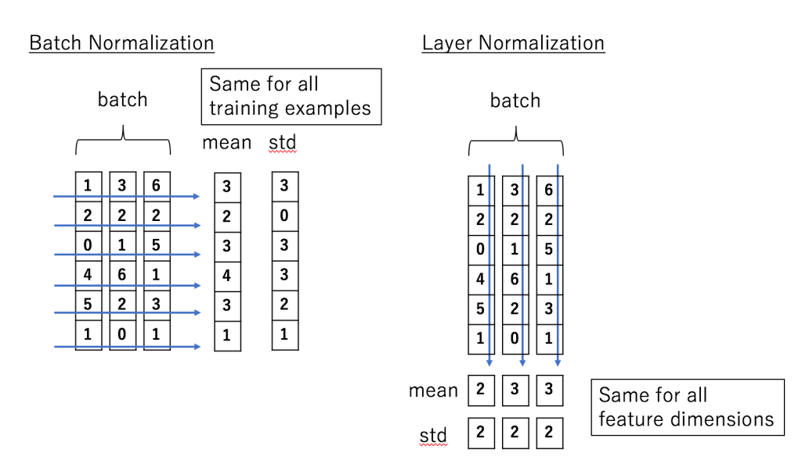
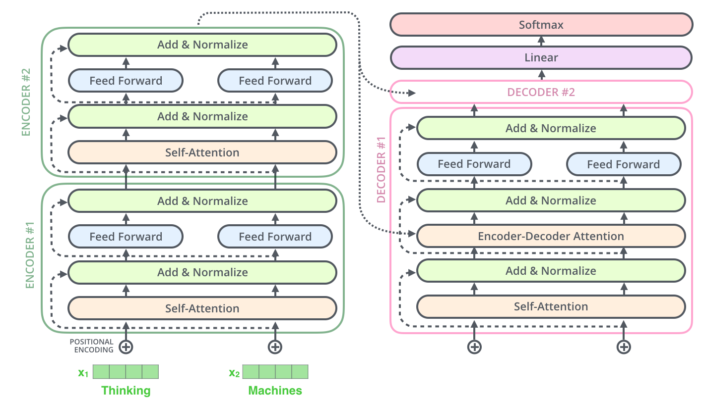

Transformer模型来自论文[Attention Is All You Need](https://arxiv.org/abs/1706.03762)。这个模型最初是为了提高机器翻译的效率，它的Self-Attention机制和Position Encoding可以替代RNN。

### 模型概览

对于机器翻译来说，它的输入是源语言(法语)的句子，输出是目标语言(英语)的句子。

Transformer(或者任何的NMT系统)都可以分成Encoder和Decoder两个部分。

再展开一点，Encoder由很多(6个)结构一样的Encoder堆叠(stack)而成，Decoder也是一样。

每一个Encoder的输入是下一层Encoder输出，最底层Encoder的输入是原始的输入(法语句子)；Decoder也是类似，但是最后一层Encoder的输出会输入给每一个Decoder层，这是Attention机制的要求。


每一层的Encoder都是相同的结构，它由一个Self-Attention层和一个前馈网络(全连接网络)组成。

每一层的Decoder也是相同的结构，它除了Self-Attention层和全连接层之外还多了一个普通的Attention层，这个Attention层使得Decoder在解码时会考虑最后一层Encoder所有时刻的输出。

输入的句子是一个词(ID)的序列，我们首先通过Embedding把它变成一个连续稠密的向量。

Embedding之后的序列会输入Encoder，首先经过Self-Attention层然后再经过全连接层


上图表示计算z1, z2, ...需要用到所有的x1, x2, ...，而计算r1只需要用到z1。

### Self-Attention

Self-Attention用Encoder在编码一个词的时候会考虑句子中所有其它的词，从而确定怎么编码当前词。

对于输入的每一个向量(第一层是词的Embedding，其它层是前一层的输出)，我们首先需要生成3个新的向量Q、K和V，分别代表查询(Query)向量、Key向量和Value向量。Q表示为了编码当前词，需要去注意(attend to)其它(其实也包括它自己)的词，我们需要有一个查询向量。而Key向量可以认为是这个词的关键的用于被检索的信息，而Value向量是真正的内容。

输入向量组成的矩阵乘以不同的矩阵变换就得到Q、K、V。

单个向量的计算分解：


### Multi-Head Attention

前面定义的一组Q、K和V可以让一个词attend to相关的词，我们可以定义多组Q、K和V，它们分别可以关注不同的上下文。

对于输入矩阵(time_step, num_input)，每一组Q、K和V都可以得到一个输出矩阵Z(time_step, num_features)。

但是后面的全连接网络需要的输入是一个矩阵而不是多个矩阵，因此我们可以把多个head输出的Z按照第二个维度拼接起来，但是这样的特征有一些多，因此Transformer又用了一个线性变换(矩阵WO)对它进行了压缩。


### 位置编码(Positional Encoding)

注意：这是Transformer原始论文使用的位置编码方法，而在BERT模型里，使用的是简单的可以学习的Embedding，和Word Embedding一样，只不过输入是位置而不是词而已。

我们的目的是用Self-Attention替代RNN，RNN能够记住过去的信息，这可以通过Self-Attention“实时”的注意相关的任何词来实现等价(甚至更好)的效果。RNN还有一个特定就是能考虑词的顺序(位置)关系，一个句子即使词完全是相同的但是语义可能完全不同，比如”北京到上海的机票”与”上海到北京的机票”

为了解决这个问题，我们需要引入位置编码，也就是t时刻的输入，除了Embedding之外(这是与位置无关的)，我们还引入一个向量，这个向量是与t有关的，我们把Embedding和位置编码向量加起来作为模型的输入。

位置编码有很多方法，其中需要考虑的一个重要因素就是需要它编码的是相对位置的关系。比如两个句子：”北京到上海的机票”和”你好，我们要一张北京到上海的机票”。显然加入位置编码之后，两个北京的向量是不同的了，两个上海的向量也是不同的了，但是我们期望Query(北京1)*Key(上海1)却是等于Query(北京2)*Key(上海2)的。

### LayerNorm

Batch Normalization，这个技巧能够让模型收敛的更快。但是Batch Normalization有一个问题——它需要一个minibatch的数据，而且这个minibatch不能太小(比如1)。另外一个问题就是它不能用于RNN，因为同样一个节点在不同时刻的分布是明显不同的。当然有一些改进的方法使得可以对RNN进行Batch Normalization，比如论文[Recurrent Batch Normalization](https://arxiv.org/abs/1603.09025)

Transformer里使用了另外一种Normalization技巧，叫做Layer Normalization。

假设我们的输入是一个minibatch的数据，我们再假设每一个数据都是一个向量，则输入是一个矩阵，每一行是一个训练数据，每一列都是一个特征。BatchNorm是对每个特征进行Normalization，而LayerNorm是对每个样本的不同特征进行Normalization，因此LayerNorm的输入可以是一行(一个样本)。



因为LayerNorm的每个样本都是独立计算的，因此minibatch可以很小甚至可以是1。实验证明LayerNorm不仅在普通的神经网络中有效，而且对于RNN也非常有效。

BatchNorm看起来比较直观，我们在数据预处理也经常会把输入Normalize成均值为0，方差为1的数据，只不过它引入了可以学习的参数使得模型可以更加需要重新缓慢(不能剧烈)的调整均值和方差。而LayerNorm似乎有效奇怪，比如第一个特征是年龄，第二个特征是身高，把一个人的这两个特征求均值和方差似乎没有什么意义。论文里有一些讨论，都比较抽象。当然把身高和年龄平均并没有什么意义，但是对于其它层的特征，我们通过平均”期望”它们的取值范围大体一致，也可能使得神经网络调整参数更加容易，如果这两个特征实在有很大的差异，模型也可以学习出合适的参数让它来把取值范围缩放到更合适的区间。

### 残差连接

每个Self-Attention层都会加一个残差连接，然后是一个LayerNorm层。


下图展示了更多细节：输入x1,x2经self-attention层之后变成z1,z2，然后和残差连接的输入x1,x2加起来，然后经过LayerNorm层输出给全连接层。全连接层也是有一个残差连接和一个LayerNorm层，最后再输出给上一层。


Decoder和Encoder是类似的，如下图所示，区别在于它多了一个Encoder-Decoder Attention层，这个层的输入除了来自Self-Attention之外还有Encoder最后一层的所有时刻的输出。Encoder-Decoder Attention层的Query来自下一层，而Key和Value则来自Encoder的输出。



## 代码

```python
class EncoderDecoder(nn.Module):
	"""
	标准的Encoder-Decoder架构。这是很多模型的基础
	"""
	def __init__(self, encoder, decoder, src_embed, tgt_embed, generator):
		super(EncoderDecoder, self).__init__()
		# encoder和decoder都是构造的时候传入的，这样会非常灵活
		self.encoder = encoder
		self.decoder = decoder
		# 源语言和目标语言的embedding
		self.src_embed = src_embed
		self.tgt_embed = tgt_embed
		# generator后面会讲到，就是根据Decoder的隐状态输出当前时刻的词
		# 基本的实现就是隐状态输入一个全连接层，全连接层的输出大小是词的个数
		# 然后接一个softmax变成概率。
		self.generator = generator
	
	def forward(self, src, tgt, src_mask, tgt_mask):
		# 首先调用encode方法对输入进行编码，然后调用decode方法解码
		return self.decode(self.encode(src, src_mask), src_mask, tgt, tgt_mask)
	
	def encode(self, src, src_mask):
		# 调用encoder来进行编码，传入的参数embedding的src和src_mask
		return self.encoder(self.src_embed(src), src_mask)
	
	def decode(self, memory, src_mask, tgt, tgt_mask):
		# 调用decoder
		return self.decoder(self.tgt_embed(tgt), memory, src_mask, tgt_mask)
    
    
class Generator(nn.Module):
	# 根据Decoder的隐状态输出一个词
	# d_model是Decoder输出的大小，vocab是词典大小
	def __init__(self, d_model, vocab):
		super(Generator, self).__init__()
		self.proj = nn.Linear(d_model, vocab)
	
	# 全连接再加上一个softmax
	def forward(self, x):
		return F.log_softmax(self.proj(x), dim=-1)
    
    
def clones(module, N):
	# 克隆N个完全相同的SubLayer，使用了copy.deepcopy
	return nn.ModuleList([copy.deepcopy(module) for _ in range(N)])


class Encoder(nn.Module):
	"Encoder是N个EncoderLayer的stack"
	def __init__(self, layer, N):
		super(Encoder, self).__init__()
		# layer是一个SubLayer，我们clone N个
		self.layers = clones(layer, N)
		# 再加一个LayerNorm层
		self.norm = LayerNorm(layer.size)
	
	def forward(self, x, mask):
		"逐层进行处理"
		for layer in self.layers:
			x = layer(x, mask)
		# 最后进行LayerNorm，后面会解释为什么最后还有一个LayerNorm。
		return self.norm(x)
    
    
class LayerNorm(nn.Module):
	def __init__(self, features, eps=1e-6):
		super(LayerNorm, self).__init__()
		self.a_2 = nn.Parameter(torch.ones(features))
		self.b_2 = nn.Parameter(torch.zeros(features))
		self.eps = eps
	
	def forward(self, x):
		mean = x.mean(-1, keepdim=True)
		std = x.std(-1, keepdim=True)
		return self.a_2 * (x - mean) / (std + self.eps) + self.b_2
    
    
class SublayerConnection(nn.Module):
	"""
	LayerNorm + sublayer(Self-Attenion/Dense) + dropout + 残差连接
	为了简单，把LayerNorm放到了前面，这和原始论文稍有不同，原始论文LayerNorm在最后。
	"""
	def __init__(self, size, dropout):
		super(SublayerConnection, self).__init__()
		self.norm = LayerNorm(size)
		self.dropout = nn.Dropout(dropout)
	
	def forward(self, x, sublayer):
		"sublayer是传入的参数，参考DecoderLayer，它可以当成函数调用，这个函数的有一个输入参数"
		return x + self.dropout(sublayer(self.norm(x)))
    
    
class EncoderLayer(nn.Module):
	"EncoderLayer由self-attn和feed forward组成"
	def __init__(self, size, self_attn, feed_forward, dropout):
		super(EncoderLayer, self).__init__()
		self.self_attn = self_attn
		self.feed_forward = feed_forward
		self.sublayer = clones(SublayerConnection(size, dropout), 2)
		self.size = size

	def forward(self, x, mask):
		"Follow Figure 1 (left) for connections."
		x = self.sublayer[0](x, lambda x: self.self_attn(x, x, x, mask))
		return self.sublayer[1](x, self.feed_forward)
    
    
class Decoder(nn.Module): 
	def __init__(self, layer, N):
		super(Decoder, self).__init__()
		self.layers = clones(layer, N)
		self.norm = LayerNorm(layer.size)
	
	def forward(self, x, memory, src_mask, tgt_mask):
		for layer in self.layers:
			x = layer(x, memory, src_mask, tgt_mask)
		return self.norm(x)
    
    
class DecoderLayer(nn.Module):
	"Decoder包括self-attn, src-attn, 和feed forward "
	def __init__(self, size, self_attn, src_attn, feed_forward, dropout):
		super(DecoderLayer, self).__init__()
		self.size = size
		self.self_attn = self_attn
		self.src_attn = src_attn
		self.feed_forward = feed_forward
		self.sublayer = clones(SublayerConnection(size, dropout), 3)
	
	def forward(self, x, memory, src_mask, tgt_mask): 
		m = memory
		x = self.sublayer[0](x, lambda x: self.self_attn(x, x, x, tgt_mask))
		x = self.sublayer[1](x, lambda x: self.src_attn(x, m, m, src_mask))
		return self.sublayer[2](x, self.feed_forward)
    
    
def subsequent_mask(size):
	"Mask out subsequent positions."
	attn_shape = (1, size, size)
	subsequent_mask = np.triu(np.ones(attn_shape), k=1).astype('uint8')
	return torch.from_numpy(subsequent_mask) == 0


```

Attention

```python
def attention(query, key, value, mask=None, dropout=None):
	d_k = query.size(-1)
	scores = torch.matmul(query, key.transpose(-2, -1)) \
		/ math.sqrt(d_k)
	if mask is not None:
		scores = scores.masked_fill(mask == 0, -1e9)
	p_attn = F.softmax(scores, dim = -1)
	if dropout is not None:
		p_attn = dropout(p_attn)
	return torch.matmul(p_attn, value), p_attn


class MultiHeadedAttention(nn.Module):
	def __init__(self, h, d_model, dropout=0.1):
		super(MultiHeadedAttention, self).__init__()
		assert d_model % h == 0
		# We assume d_v always equals d_k
		self.d_k = d_model // h
		self.h = h
		self.linears = clones(nn.Linear(d_model, d_model), 4)
		self.attn = None
		self.dropout = nn.Dropout(p=dropout)
	
	def forward(self, query, key, value, mask=None): 
		if mask is not None:
			# 所有h个head的mask都是相同的 
			mask = mask.unsqueeze(1)
		nbatches = query.size(0)
		
		# 1) 首先使用线性变换，然后把d_model分配给h个Head，每个head为d_k=d_model/h 
		query, key, value = \
			[l(x).view(nbatches, -1, self.h, self.d_k).transpose(1, 2)	
				for l, x in zip(self.linears, (query, key, value))]
		
		# 2) 使用attention函数计算
		x, self.attn = attention(query, key, value, mask=mask, 
			dropout=self.dropout)
		
		# 3) 把8个head的64维向量拼接成一个512的向量。然后再使用一个线性变换(512,521)，shape不变。 
		x = x.transpose(1, 2).contiguous() \
			.view(nbatches, -1, self.h * self.d_k)
		return self.linears[-1](x)
```

全连接sublayer

```python
class PositionwiseFeedForward(nn.Module): 
	def __init__(self, d_model, d_ff, dropout=0.1):
		super(PositionwiseFeedForward, self).__init__()
		self.w_1 = nn.Linear(d_model, d_ff)
		self.w_2 = nn.Linear(d_ff, d_model)
		self.dropout = nn.Dropout(dropout)
	
	def forward(self, x):
		return self.w_2(self.dropout(F.relu(self.w_1(x))))
    
    
class Embeddings(nn.Module):
	def __init__(self, d_model, vocab):
		super(Embeddings, self).__init__()
		self.lut = nn.Embedding(vocab, d_model)
		self.d_model = d_model
	
	def forward(self, x):
		return self.lut(x) * math.sqrt(self.d_model)
    
    
    
class PositionalEncoding(nn.Module): 
	def __init__(self, d_model, dropout, max_len=5000):
		super(PositionalEncoding, self).__init__()
		self.dropout = nn.Dropout(p=dropout)
		
		# Compute the positional encodings once in log space.
		pe = torch.zeros(max_len, d_model)
		position = torch.arange(0, max_len).unsqueeze(1)
		div_term = torch.exp(torch.arange(0, d_model, 2) *
			-(math.log(10000.0) / d_model))
		pe[:, 0::2] = torch.sin(position * div_term)
		pe[:, 1::2] = torch.cos(position * div_term)
		pe = pe.unsqueeze(0)
		self.register_buffer('pe', pe)

	def forward(self, x):
		x = x + Variable(self.pe[:, :x.size(1)], requires_grad=False)
		return self.dropout(x)
```

完整模型

```python
def make_model(src_vocab, tgt_vocab, N=6, 
		d_model=512, d_ff=2048, h=8, dropout=0.1): 
	c = copy.deepcopy
	attn = MultiHeadedAttention(h, d_model)
	ff = PositionwiseFeedForward(d_model, d_ff, dropout)
	position = PositionalEncoding(d_model, dropout)
	model = EncoderDecoder(
		Encoder(EncoderLayer(d_model, c(attn), c(ff), dropout), N),
		Decoder(DecoderLayer(d_model, c(attn), c(attn), c(ff), dropout), N),
		nn.Sequential(Embeddings(d_model, src_vocab), c(position)),
		nn.Sequential(Embeddings(d_model, tgt_vocab), c(position)),
		Generator(d_model, tgt_vocab))
	
	# 随机初始化参数，这非常重要
	for p in model.parameters():
		if p.dim() > 1:
			nn.init.xavier_uniform(p)
	return model
```


### 参考资料

http://fancyerii.github.io/2019/03/09/transformer-illustrated/

http://fancyerii.github.io/2019/03/09/transformer-codes/