R-Drop: Regularized Dropout for Neural Networks

概要：将“Dropout两次”的思想用到了有监督任务中，在每个 mini-batch 中，每个数据样本过两次带有 Dropout 的同一个模型，R-Drop 再使用 KL-divergence 约束两次的输出一致。实验表明，该方法在多个任务上都有不错的表现。

代码：https://github.com/dropreg/R-Drop

该文章由苏州大学 NLP 和微软亚研合作完成

MC-Drop

## Dropout

防止过拟合的正则化手段之一。

dropout是指在深度学习网络的训练过程中，对于神经网络单元，按照一定的概率将其暂时从网络中丢弃。

Dropout可以防止过拟合；类似于集成学习，可以提高模型效果。

## 整体框架

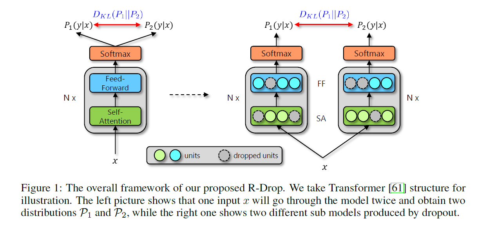

## 方法

### 损失函数

概念定义

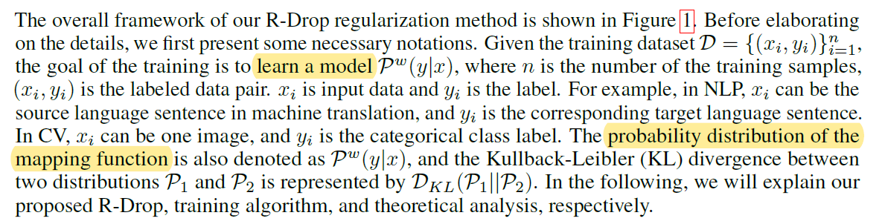

假设损失函数是负对数似然损失（negative log-likelihood loss）

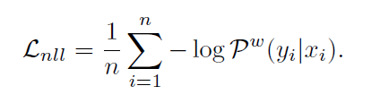

根据上图的框架，计算两个输出的KL散度（目的是让不同模型的输出尽量一致）

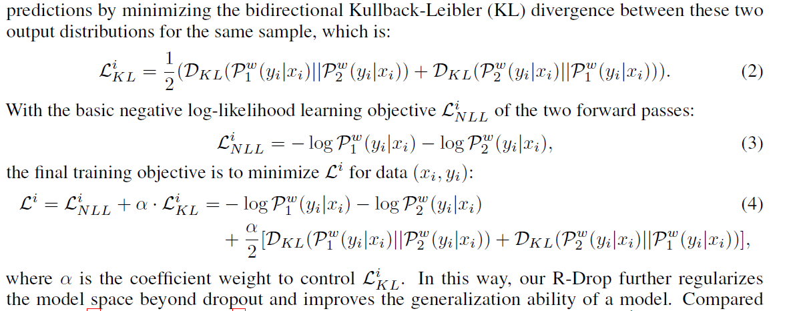

既可以防止过拟合（缩小解空间，从而减少求出过拟合解的可能性），又能提高模型的泛化能力。

实验发现alpha=5最好，不过也跟任务有关，取决于过拟合发生的可能性。

### 训练算法

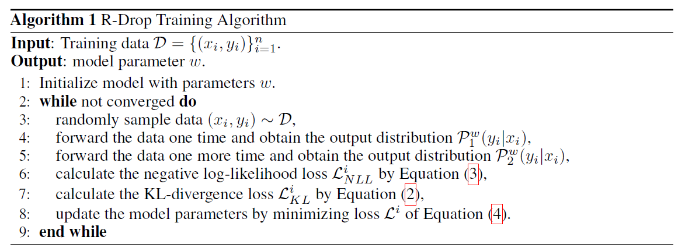

实现的时候，为了减少训练成本，we repeat the input once and concatenate them ([x; x]) in the same mini-batch to forward once

（两个分布使用相同的dropout值，试过不同的，不如相同的好）

类似于增大batch size为2倍，导致每一步的计算成本增加了。

比起其它的正则化方法，R-Drop的收敛需要更多训练，但是最终的最优点会更好。

尝试过每k步使用R-Drop，以提高训练效率，k={1,2,5,10}。效果不好，虽然k越大收敛越快，但是不能收敛到好的最优点。

### 理论分析

感兴趣的可以看论文，不细讲

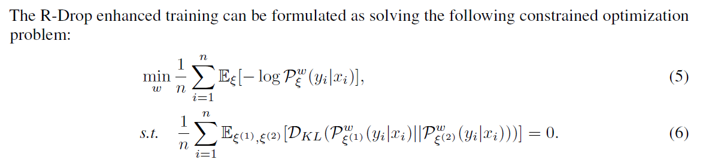

我们训练的是不同Dropout的融合模型，预测的时候用的是关闭Dropout的单模型，两者未必等价，这就是Dropout的训练预测不一致问题。

R-Drop通过增加一个正则项，来强化模型对Dropout的鲁棒性，使得不同的Dropout下模型的输出基本一致，因此能降低这种不一致性，促进“模型平均”与“权重平均”的相似性，从而使得简单关闭Dropout的效果等价于多Dropout模型融合的结果，提升模型最终性能。

## 实验

### Neural Machine Translation

在机器翻译任务上，基于最基础的Transformer [3]模型，R-Drop 的训练在 WMT14英语->德语以及英语->法语的任务上取得了最优的 BLEU 分数（30.91/43.95），超过了其他各类复杂、结合预训练模型、或更大规模模型的结果：

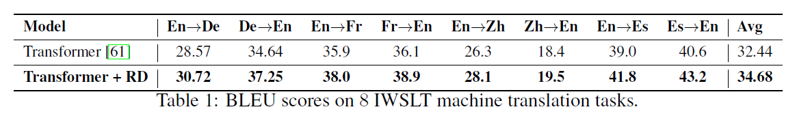

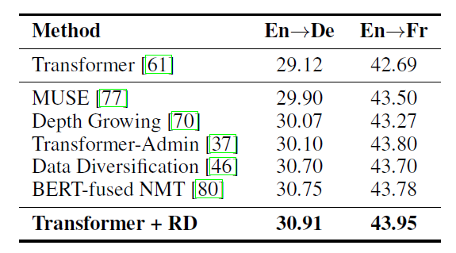

权重alpha设为5

如果将R-Drop应用到其它方法上，应该能得到更好地效果。

- MUSE：基本思想是, 通过将来自不同语言的句子映射到同一个隐空间下来进行句子翻译
- Data Diversification训练时用了很多翻译模型
- BERT-fused NMT使用了大规模的单语言语料

### Language Understanding

在NLU 语言理解任务上，R-Drop 在预训练 BERT-base [5] 以及 RoBERTa-large [6] 的骨架网络上进行微调之后，在 GLEU 基础数据集上轻松取得了超过1.2和0.8个点的平均分数提升：

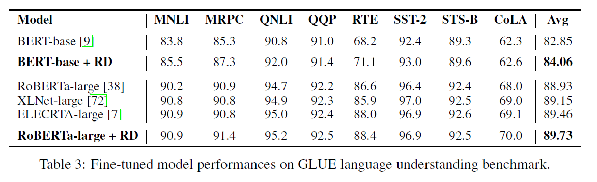

STS-B是回归任务，用的是MSE而不是KL散度


### Summarization

在文本摘要任务上，R-Drop 基于 BART [7] 的预训练模型，在 CNN/Daily Mail 数据上微调之后也取得了当前最优的结果：

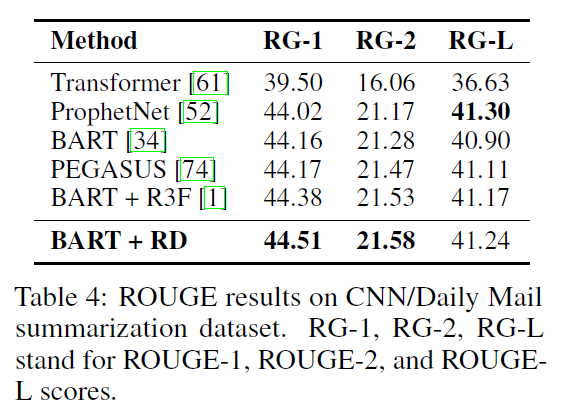

### Language Modeling

在语言模型任务上，基于原始 Transformer 以及 Adaptive Transformer [8]，R-Drop 的训练在 Wikitext-103 数据集上取得了1.79和0.80的 ppl 提升

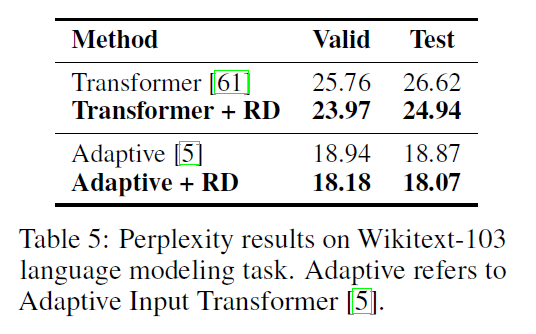

### Image Classification

在图像分类任务上，基于预训练好的 Vision Transformer（ViT）[4] 为骨架网络，R-Drop 在 CIFAR-100 数据集以及 ImageNet 数据集上微调之后，ViT-B/16 和 ViT-L/16 的模型均取得了明显的效果提升：

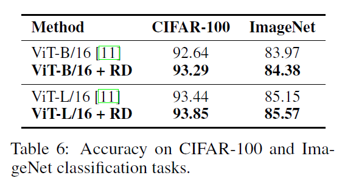

### 中文任务

苏神的实验

> **个人实现：https://github.com/bojone/r-drop**

有中文监督任务上，笔者实验了两个文本分类任务（CLUE榜单的IFLYTEK和TNEWS）

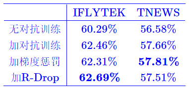


和一个文本生成任务（CSL标题生成，参考[《Seq2Seq中Exposure Bias现象的浅析与对策》](https://spaces.ac.cn/archives/7259)）：

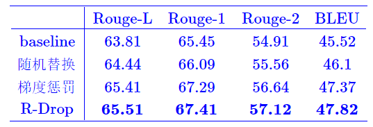


可以看到，R-Drop的结果足以PK在[《对抗训练浅谈：意义、方法和思考（附Keras实现）》](https://spaces.ac.cn/archives/7234)中介绍的著名正则化手段“对抗训练”和“梯度惩罚”了。

## 代码实现

```python
import torch.nn.functional as F

# define your task model, which outputs the classifier logits
model = TaskModel()

def compute_kl_loss(self, p, q pad_mask=None):
    
    p_loss = F.kl_div(F.log_softmax(p, dim=-1), F.softmax(q, dim=-1), reduction='none')
    q_loss = F.kl_div(F.log_softmax(q, dim=-1), F.softmax(p, dim=-1), reduction='none')
    
    # pad_mask is for seq-level tasks
    if pad_mask is not None:
        p_loss.masked_fill_(pad_mask, 0.)
        q_loss.masked_fill_(pad_mask, 0.)

    # You can choose whether to use function "sum" and "mean" depending on your task
    p_loss = p_loss.sum()
    q_loss = q_loss.sum()

    loss = (p_loss + q_loss) / 2
    return loss

# keep dropout and forward twice
logits = model(x)

logits2 = model(x)

# cross entropy loss for classifier
ce_loss = 0.5 * (cross_entropy_loss(logits, label) + cross_entropy_loss(logits2, label))

kl_loss = compute_kl_loss(logits, logits2)

# carefully choose hyper-parameters
loss = ce_loss + α * kl_loss


```

输入

```python
sample_concat_input = {
            'src_tokens': torch.cat([sample_input['src_tokens'], sample_input['src_tokens'].clone()], 0),
            'src_lengths': torch.cat([sample_input['src_lengths'], sample_input['src_lengths'].clone()], 0),
            'prev_output_tokens': torch.cat([sample_input['prev_output_tokens'], sample_input['prev_output_tokens'].clone()], 0),
        }
```


## 参考资料

[R-Drop：填补Dropout缺陷，简单又有效的正则方法](https://www.msra.cn/zh-cn/news/features/r-drop)

[又是Dropout两次！这次它做到了有监督任务的SOTA](https://spaces.ac.cn/archives/8496)


