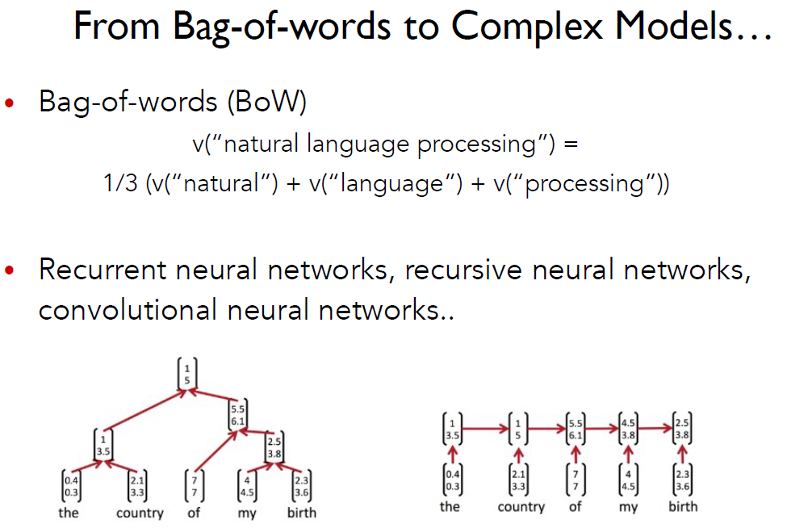
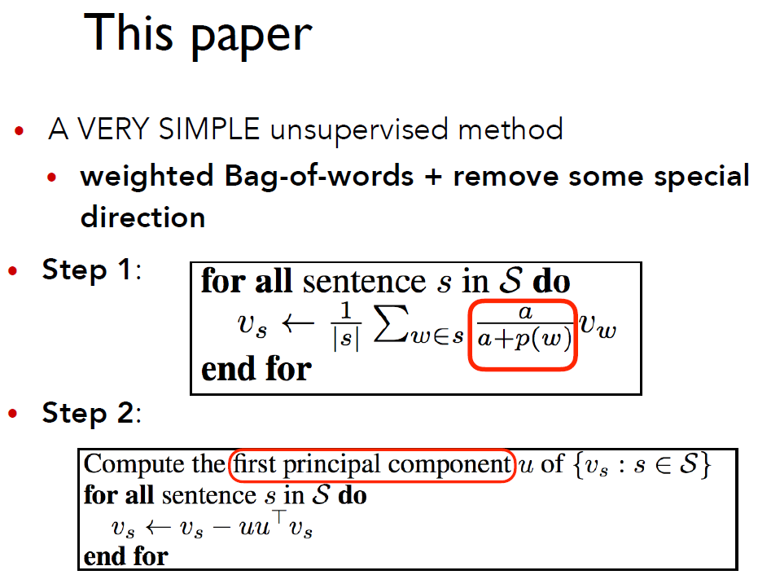
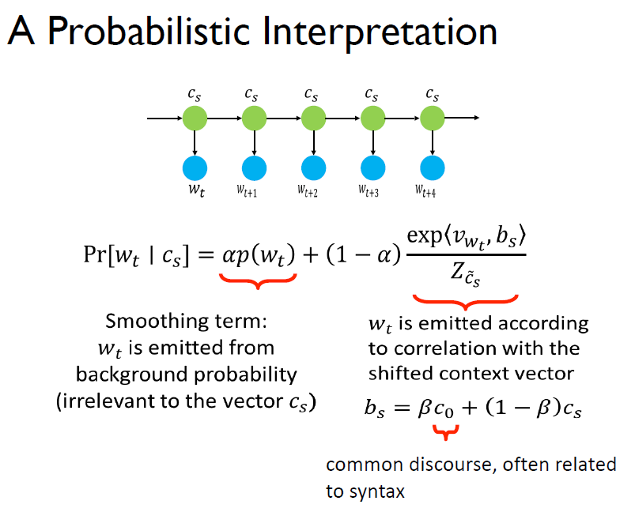
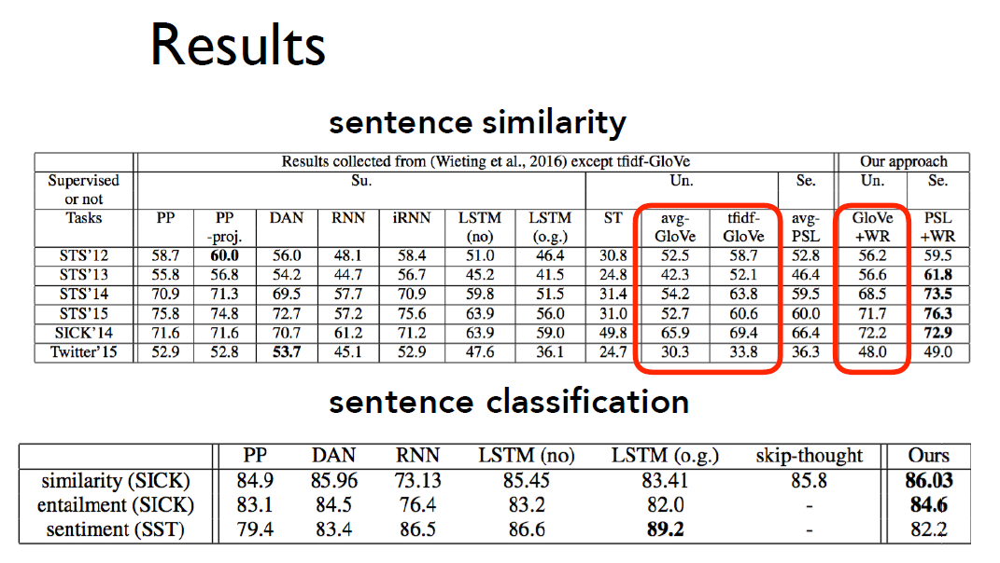

## 论文：A Simple but Tough-to-beat Baseline for Sentence Embeddings

A Simple but Tough-to-beat Baseline for Sentence Embeddings

Sanjeev Arora, Yingyu Liang, Tengyu Ma
Princeton University
In submission to ICLR 2017

虽然这节课一直在讲词向量可以编码词的意思，但自然语言处理真正关心的是整个句子的意思。

如果我们能够拿到句子的向量表示，则可以方便地用内积计算相似度

还可以在这些句子向量之上构建分类器做情感分析

具体怎么由词向量到句向量呢？有很多种方法，比如词袋模型中简单地线性运算，在后面的课程中，将会用recurrent neural network、recursive neural network，CNN来做同样的事情。

但今天要介绍的这篇普林斯顿大学的论文却剑走偏锋，采用了一种简单的无监督方法。这种方法简单到只有两步：

第一步，对句子中的每个词向量，乘以一个独特的权值。这个权值是一个常数α除以α与该词语频率的和，也就是说高频词的权值会相对下降。求和后得到暂时的句向量。

然后计算语料库所有句向量构成的矩阵的第一个主成分u，让每个句向量减去它在u上的投影（类似PCA）。其中，一个向量v在另一个向量u上的投影定义如下：

$Proj_uv=\frac{uuTv }{∥u∥^2}$

其原理是，给定上下文向量，一个词的出现概率由两项决定：作为平滑项的词频，以及上下文

其中第二项的意思是，有一个平滑变动的上下文随机地发射单词。

效果

在句子相似度任务上超过平均水平，甚至超过部分复杂的模型。在句子分类上效果也很明显，甚至是最好成绩。

2.Linear Algebraic Structure of Word Senses, with Applications to Polysemy

Sanjeev Arora, Yuanzhi Li, Yingyu Liang, Tengyu Ma, Andrej Risteski

3.Distributed Representations of Words and Phrases and their ComposiRonality (Mikolov et al. 2013)

4..GloVe: Global Vectors for Word Representation (Pennington et al. (2014)

Word Vector Analogies: SyntacRc and Semantic examples from
http://code.google.com/p/word2vec/source/browse/trunk/questionswords.txt

Word vector distances and their correlation with human judgments
Example dataset: WordSim353
http://www.cs.technion.ac.il/~gabr/resources/data/wordsim353/

5.Improving Word Representations Via Global Context And Multiple Word Prototypes (Huang et al.
2012)

1. Gather fixed size context windows of all occurrences of the word
   (for instance, 5 before and 5 after)
2. Each context is represented by a weighted average of the context
   words’ vectors (using idf-weighting)
3. Apply spherical k-means to cluster these context representations.
4. Finally, each word occurrence is re-labeled to its associated cluster
   and is used to train the word representation for that cluster.

6.Bag of Tricks for Efficient Text Classification
Armand Joulin, Edouard Grave, Piotr Bojanowski, Tomas Mikolov
Facebook AI Research

● fastText is often on par with deep learning classifiers
● fastText takes seconds, instead of days
● Can learn vector representations of words in different languages (with performance better than word2vec!)

