一次对话，就是一个会话的接入，语义理解就是理解人说话的内容，应答引擎就是根据理解的内容做出的应答。

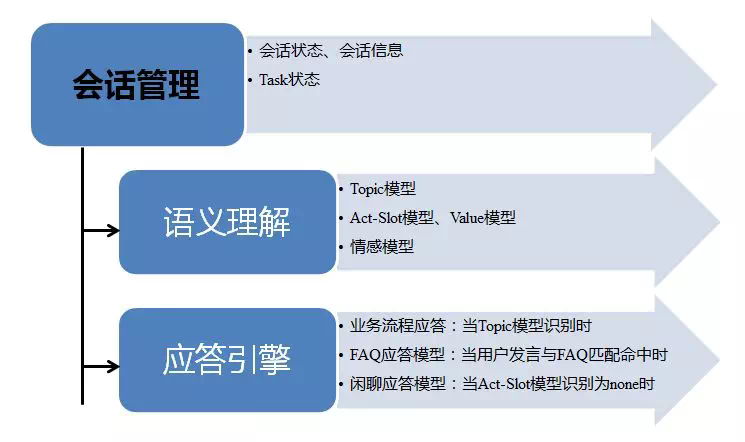

## 1、语义理解

因为人类语言的本质是为了传递人与人之间的信息（意思）。那么，我们可以定义出N种意思分类（意思的种类越多，机器人的理解能力越强）。所以，一个语言模型就是一个多标签的数学模型，把自然语言转成具有结构化的表达。有以下三个步骤：

1）文本预处理：切词、词向量、词义消解等（这里内容很大，不详细介绍）。

2）样本准备：抽取一些经典的发言，进行标注。

3）序列模型：多标签模型，如下图就是一种CNN与LSTM组合的神经网络方法。

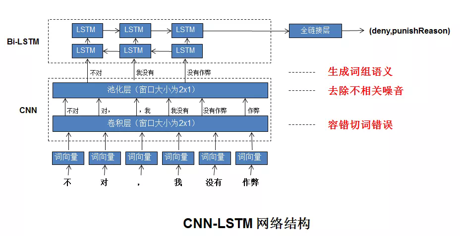

尽管已经在一个垂直的领域，而且看似简单的三步，但是要做一个好的语义理解模型，是非常难的，例如一个小改动导致预测结果差异，可分两种：

1）一种是句中的词语位置变了、辅助词变了，如：“这就是给我的回复？”与“你们就这么回复我？”。

2）一种是增加一些无关核心内容的词，如：“但是我后面没开挂都被制裁”与“但是我后面没开挂都被制裁我就想不通了”。

备注：增加更多有标注的样本量、基于大规模数据训练的模型（如BERT等）二次训练、神经网络增加attention、结合知识库等，都是一些优化的手段。

理解用户说话的意思，我们分为了三层：第一层，是理解当前聊天处于哪一个话题，有没有切换话题；第二层，是理解具体的内容，含有意图与实体；第三层，是理解当前发言的情感，跟踪用户的情绪变化。

**1） 话题模型（Topic模型）**

在我们系统中，它是一个分类模型，与后面的应答引擎是有对应的关系，根据不同的话题，进入不同的业务流程，所以模型的标签的业务的分类。

**2） 意图理解（Act-Slot模型、Value模型）**

**A.  Act-Slot模型**

在我们系统中，它是一个多标签模型，相同一句话，不同的角度，有不同的理解。所以，模型的标签是意图与实体类型，如下图的“inform,QQ”。

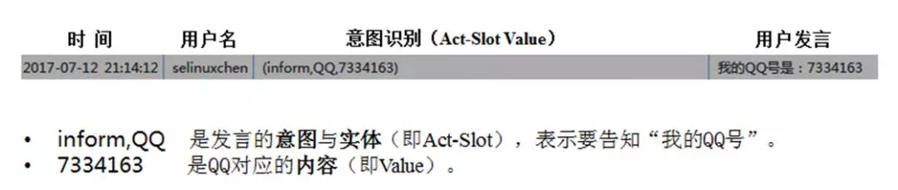

例如，在具体的项目中，我们定义了：

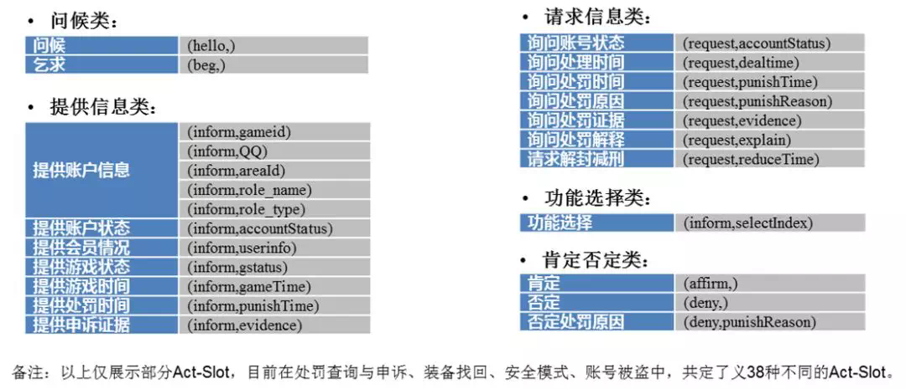

**B.   Value模型**

在我们系统中，获取到用户发言的Act-Slot之后，根据Act-Slot的意图，得到其相对应的实体值。总共设计了三种方法以获取不同类型的Value，方法如下：

- 正则表达式：如抽取时间、等级等有一定格式的实体。
- 词库对比：如安图恩等游戏专有词汇。
- LSTM模型：当句式中不明显表达实体时，将通过模型分到6类中：
  - ENV：涉及到电脑环境相关信息。
  -  MAPID：涉及到地图相关信息。
  - ROLE：涉及到角色相关信息。
  - TEAM：涉及到组队相关信息。
  -  LOGIN：涉及到登录相关信息。
  - EQUIP：涉及到装备相关信息。

备注：并非所有聊天机器人都这么设计，有些系统会把意图作为一个模型，实体与value作为一个模型。

**3） 情感模型**

在我们系统中，它是一个分类模型，把用户的发言分为了以下几种不同级别的情绪（标签）：脏话、生气、平和、赞扬。

### 话题意图识别

在我们的业务场景中，**意图细分成了2层的层级意图结构，也即话题意图以及在每个话题下的用户行为意图**，也可以理解为每种话题意图相当于一个Chatbot。所以，话题意图的识别效果对后续流程影响较大。    

**话题意图识别属于文本分类任务，在我们的游戏安全场景中，定义了7种话题类别，包括安全模式、被盗、失误、封号、信用、举报，以及常用性发言。**对于常用的文本分类任务，我们抽象出了一个通用的处理流程，从文本预处理，到寻找经典话术，也即是能覆盖到大部分用户发言的话术；然后基于经典话术人工打标，并根据文本相似性的方法来自动化扩展标签数据集，构成训练集合。这一构建监督训练数据集的方法，较适用于缺乏人力，又想更好地覆盖原始数据的分布的情况。最后，基于各种特征抽取器构建模型并调优。其具体流程结构如下图，其中虚线部分是从数据和模型两个层面不断优化分类效果，其中图中红色的2、3点是从数据层面来修正部分样本的标签以及获取更多的标签样本，红色的 1点是从模型结构来优化性能。

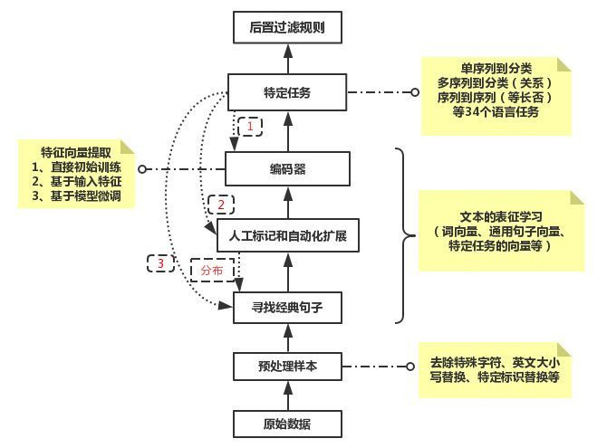

**上图中的抽取经典句子模块的目的是使得经典发言集合能够覆盖更多的用户发言集合，做到以经典话术代表绝大部分的语义。**主要做法是基于主题模型、基于句子向量的无监督聚类、基于文本向量相似性构建的图数据并结合PageRank和图连通分量等方法的集成，能够从上百万的用户发言中共同找出少量的代表性发言，其数量在几千到1万多。

**上图中的标签样本的自动化扩展模块主要是通过文本向量的相似性技术来做扩展**，主要是基于编辑距离、基于关键词权重的加权词向量、Seq2Seq-AutoEncoder和BERT的句子向量相似性并结合阈值的方式来扩展标签样本。然后通过过滤操作弃掉一些badcase，主要是基于否定词和关键词（主要是针对短句，相似对中差集中含有一些表达话题语义的关键词）做过滤，最后按照每条种子样本自动化标记的情况分层抽样一部分自动标记的数据，通过人工简单审核，视情况修正。对于没有标记上的发言样本，可以重复抽取经典发言然后再自动化标签扩展的步骤来不断迭代得到更加大量和多样化表达的标签语料集合。   

**上图中的编码器和特定任务部分，就是基于特定任务构建学习模型，对于神经网络来讲，是各种可以抽取文本语义表示的神经网络编码器。**下面将从样本处理、模型构建、模型效果优化等方面详细介绍下话题意图分类模块。首先，本话题意图原始数据是基于游戏中一段对话的场景来打标签的，训练集样本的标签准确度不高，因此需要对样本做标签修正的预处理来提纯样本标签。

### **1. 分类模块的具体构建流程**

- 数据预处理：通过基于关键词和短语结构的正则表达式、自动化标签扩展模块这2种方法，清理不纯样本和修正错误样本标签最终得到7 种topic类别（一般、安全模式、被盗、失误、封号、信用、举报）的数据， 约92w左右。
- 通过新词发现模块把游戏名、装备名、地区名等名词加入到Jieba词表中；然后做带词性的切词，同时把句子切词后含有的游戏专有名词和游戏地区名替换为GameName、AreaName等通配符。这个Trick是为了减弱无关词对分类的影响，因为这些专有名词会在被盗、封号等类别中经常出现，影响分类效果。
- 基于全量数据使用Word2vec算法来预训练词向量、词性向量。
- 输入词编号和词性编号，加载预训练好的Embedding向量参数，训练基于两层CNN+Highway结构的文本分类模型，保存验证集合中准确率最好的模型。
- 模型多标签分类预测时，取预测概率值最高的类别，但当所有类别的预测概率都小于0.3时，判定为common。经测试，此策略比单独取预测概率最高的类别返回，效果更好。因为话题模型是一个入口模型，决定着后续任务将交给哪一个类别的Chatbot处理，其中common类别是不触发具体的任务型Chatbot；所以采用宁可放过也不愿意错判的策略。

**注：各个topic单独设计基于正则表达式的前置过滤规则，可配置过滤badcase，便于安全运营，待积累一段时间的错判语料后，再更新线上的话题分类模型**

### **2. 模型结构介绍**

我们尝试了4、5种不同RNN、CNN以及Attention等组合结构的深度学习文本分类结构。从我们的应用场景出发，用户发言一般是短文本，长度大多在几十个字内，关键词和短语对分类显著的作用,同时基于处理效率和性能的考虑，最终采用CNN的模型结构。CNN结构具有位置平移不变和局部特征组合的特性，多层CNN能够扩大感受野，组合更长的局部短句，然后经过池化层获取需要的显著特征。**我们的模型是两层CNN结合Highway网络的结构。**在卷积层中，采用了1,2,3,4四种不同宽度的一维卷积核，同种卷积核操作会操作两次，也即两层CNN。池化层后再接一个Highway层。Highway层可以更大程度地池化后的重要特征。Highwigh网络层的公式如下：

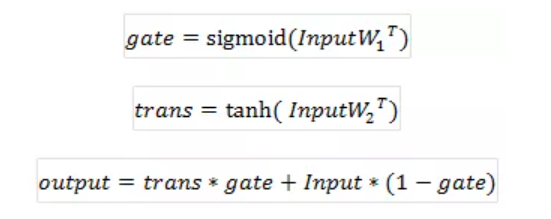

基于CNN分类模型的具体结构图如下：

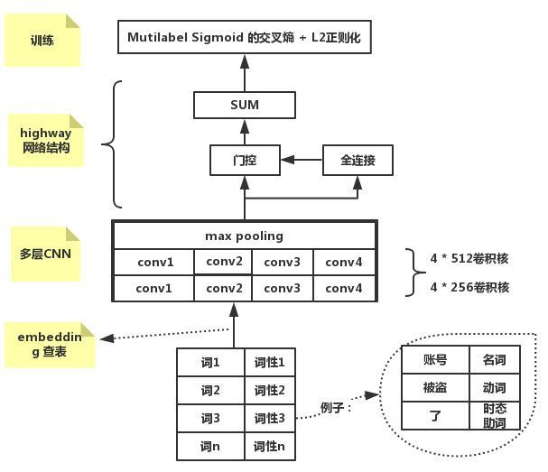

**效果评估：**

我们对比了是否使用Highway层以及1,2,3不同层CNN结构的效果差别，最终是上图的结构效果最好。由于是上年做的项目，不同模型的效果对比找不到了。下面只给最终的模型评估。从训练集合随机抽取的测试集合（27521条数据），模型预测并结合线上规则的预测结果, 采用微平均(micro-average)的整体评估指标值如下：

| Accuracy | Recall | F1_score |
| :------- | :----- | :------- |
| 0.986    | 0.982  | 0.984    |

**话题热词分析：**

对于抽取每个topic下的热词，可以使用传统的TF-IDF、词性、Text Rank、句子语法和语义结构等方法做热词抽取、过滤和重排等操作。也可以使用基于注意力机制的神经网络模型，或者两者做结合。我们是基于话题意图语料，利用RNN Attention模型在做分类预测的时候，得到每个词的注意力权重，然后根据权重值提取热词，具体做法如下：

（1）训练基于RNN-Attention结构的分类模型，流程同上。

（2）基于小天部分线上经典发言，利用注意力机制的分类模型做预测，然后取出网络结构中的权重层，最后累加各个词语的权重，排序得到各个topic下有显著特性的关键词。

（3）基于RNN-Attention模型结构图如下：

由于注意力机制层，采用了多重的Self-Attention，本模型中是设置了5个不同矩阵参数，所以学习到5种不同的表达特征，然后对发言中同一个词语的5种权重值做求和取平均操作，得到发言中各个词语的最终权重，这样既考虑了词语的出现次数和在句子中的重要性。单头Self-Attention是沿用早期翻译中的注意力机制原理，单头自注意力机制的公式如下, 其中H是输入向量：

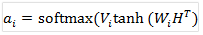

（4）各个话题抽取的热词效果如下：

- common（3777句）：什么, 你们, 没有, 为什么, 游戏, 人工, 承诺, 问题, 不是
- aqmode（782句）：安全, 模式, 解除, 冻结, 解冻, 微信, 失败,异常, 绑定, 密码
- beidao（134句）：被盗, 找回, 异地, 装备, 申诉, 登录, 被盗号,  账号, 安全, 密码, 角色, 盗号者,盗号
- shiwu（21句）：错误,失误, 赛利亚, 了解, 恢复, 跨错, 找回,回来, 误操作, 装备, 分解,看清楚,商店, 优先,小心
- fenghao（4062 句）：制裁,  解封,  减刑,  封号,  开挂,  申诉, 外挂,  处罚,  禁赛,  账号, 作弊
- xinyong（152句）：信用分, 信用, 信誉, 星级, 制裁, 积分, 信用等级, 查下, 帮忙, 为什么, 一下, 账号, 多少, 满星, 四颗星
- jubao(134句)：举报, 外挂, 举报人, 有人, 恶意, 辱骂, 开挂, 炸团, 人头, 封号, 挂机, 诈骗   

可以看到，完全数据驱动的方法得到的效果还可以，但是也有一些badcase，例如xinyong话题中热词出现了“制裁”，主要是问“游戏信用分话题“的发言中，存在一些“多少信用分能够解制裁”，“账号被制裁，多少信用分能解”之类的问题。后续可以根据业务需求增加后过滤处理操作。

### **话题意图模型的运营优化**

**1. 在运营优化方面，主要基于badcase来作分析**

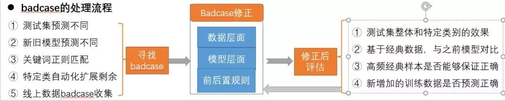

**2. Badcase的分类错误原因**

- 发言中含有部分常见词，在其他Topic中出现，本质是句子中存在片段的 交集，而且交集片段在不同topic中的统计分布 差异大。
- 训练集中的label标错了。
- 训练样本中没有出现过类似的样本。

**3. Badcase的修正**

（1）数据层（样本的整理）：

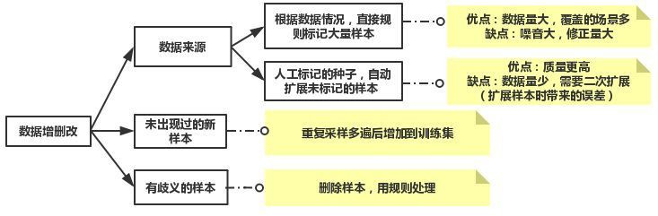

（2）模型层（时间性能和效果平衡）：

（3）规则层（规则粒度的大小（灵活性+维护成本））：

主要是解决模型很难识别的特殊样本，为每个分类话题分别配置正则过滤规则

**4. 构建更大量样本数据集方法介绍**

**基于集成模型的方法更快地构造更好、更多的标签样本集**

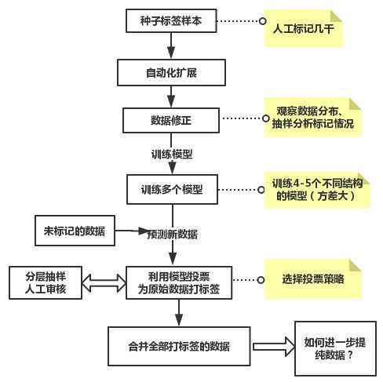

**在样本标签数据的扩展部分，除了可以使用自动化模块扩展外，还可以基于集成模型的方法来做而二次标签样本的扩展，**下面是使用一份情感数据做的尝试：

（1）**对9千多样本数据作为种子， 使用自动化标签扩展模块来进行样本标签的扩展并经过后过滤处理**，一共构造训练数据7w多条， 分布如下：

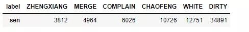

（2）**对训练数据， 构建并训练了4种不同结构的神经网络分类模型**，每种模型的准确率如下：

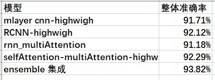

**然后对未标记90万左右数据做做二次样本扩展。**具体做法是：取出4个模型预测标签相同并且概率大于0.9的样本作为额外的新增标签样本和原训练样本合并并去重（避免出现不一致的样本标签），同时由于DIRTY和WHITE样本量过大，做了下采样操作， 其余类别做了重复采样操作。一共得到了24w左右的训练样本， 分布如下：

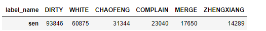

（3）**基于全量的训练数据，最后使用效果最好的第四个分类模型，** 也即完全基于注意力机制的网络结构（SelfAttention-multiAttention-Highway)，训练最终的分类模型。整体准确率是98.7%（为了样本平衡，部分类别的样本复制了多遍，所以评测有所偏差）

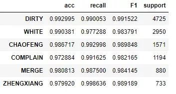

（4）**同时，对集成模型扩展后数据做进一步提纯过滤，也可以采用K折交叉验证的方法来找到并处理badcase。**具体是利用模型的差异性，使用投票等策略规则来更快找出可疑标签样本，然后抽取不同的数据做训练和预测，从而达到找到整个样本中的可疑标签样。对于可疑标签样本的处理可以人工或者规则自动处理，不断迭代优化模型的数据。其流程图如下：

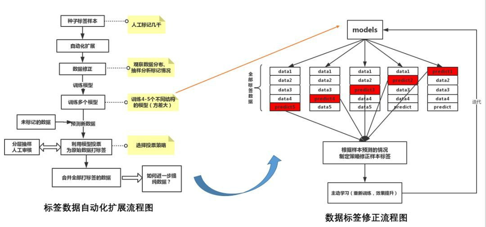

### **经验总结和展望**

\1. 训练集量少时，预训练全量数据word2vec或者使用字词结合的方式，减少未登录词。训练模型时，微调Word2vec，效果一般会更好 。

\2. CNN作为baseline会更快，多层使用batch-norm，以及结合highway层做尝试。

\3. 考虑样本分布，样本不平衡处理方法:

（1）对于少数样本重复采样（基于batch数据）、多数样本负采样

（2）调整阈值（抽样人工比较或者看PR曲线来设置）

（3）对于二分类修改Loss(代价敏感)，例如同时考虑难分样本和样本类别平衡性的focalloss。

（4）数据增强（随机打乱语序、同义词替换（同义词表）、模板修改、数据生成的方法(GAN) 

\4. 样本是否绝对互斥，否则用基于sigmoid的多标签损失函数，一般会收敛更快。

\5. 模型的效果进行多次迭代修正后，会导致数据更符合当前模型（即是使用复杂模型也不一定更好），所以要先选择好模型，再做迭代优化。

\6. 当只有小量数据集时，可以使用基于BERT的分类模型。随机取了训练集合中的2w数据作为训练和随机抽取2000条样本作为测试集。在同一CPU服务器上做测试，基于多层CNN分类模型，测试时间：18s，预测F1值：92.1% 。基于BERT的分类模型，测试时间：400s，差一个数量级,是5个样本1s，预测F1值：93.8%。对于BERT的性能优化，可以只利用前几层的结构做Finetune，或者借鉴google出品的Learn2Compress中的方法进行模型压缩优化等。

\7. 对于一些话题类别数据量少的识别冷启动问题，除了上面介绍扩展样本量的方法，还可以从一些小样本学习方法来考虑，例如Few-shot learning，具体有Induction Network等。

## **2、应答引擎**

**定义业务描述语言**

为了能快速接入各种服务，基于XML描述语言，定义了一套业务流程的描述语言。总共分为三层，最底层是基础流程控制单元，如分支if、循环while、顺序sequence、并行parallel；第二层，是每个话题都需要的通用组件，如询问QQ号、游戏名、情绪安抚等；最顶层是具体的业务应用服务，如装备找回流程、被盗处理流程等。

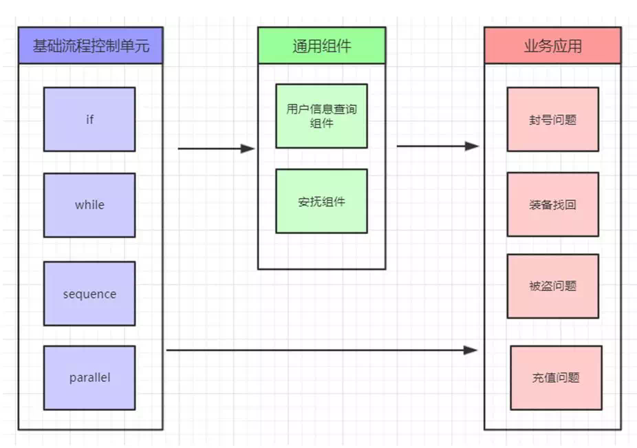

  例子：获取QQ号与大区号流程。

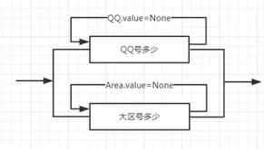

 

**业务流程控制引擎**

如下图所示，有Task1到Task5，共5个业务流程（业务应用），这些业务流程可以使用上述描述语言刻画出来。而下图中涉及到的为上述语言的解析过程。

**话题切换监听器**：作为旁路分类模型，用于跟踪聊天话题的切换。以用户发言为输入，输出1、2、3、4、5，分别代表Task1，Task2 …. Task5。（用户每次输入，都会有一次判断，反映话题是否有变化与切换到哪一个Task）

**会话信息**：表示在对话当抽取出来的上下文信息，局部信息表示在本Task可见，全局信息表示所有Task可见。

**状态**：表示Task运行状态。而流程中断的位置，并非所有位置都可以中断，如下图标记红点的是可被中断（当运行到有标记红的地方，就会请求“话题切换监听器”，当前是否有话题变化）。

-  挂起：表示当前流程暂停（如下图，P2表示Task1中的第二个点挂起）
- 未激活：“-”表示该Task没有启动过。
- 激活：Running表示正处于该Task的流程中。
- 结束：Close表示该Task已结束。

 

备注：每一个红点的地方，都可能由于用户发言导致切换到另一个Task流程中。会话开始时，会根据“起始问题识别”，得到需要走哪一个Task，作为起始Task。在起始Task流程中，如果遇到红点的地方，并且话题切换监听到需要转到另外的Task，刚切换到新的Task流程，新流程走完后再回到切换话题的断点处，继续原流程一直走完。

**一个业务流程例子**

例子：假设有四个业务流程Task，每个流程都根据流程控制单元画出相应的流程图。

- Task1为“处罚查询”流程。

- Task2为“处罚申诉”流程。

- Task3为“修改密码”流程。

- Task4为“实名验证”流程。

  

备注：每个Task都可以单独由“起始问题识别”触发，也可以如下例子嵌套对话。

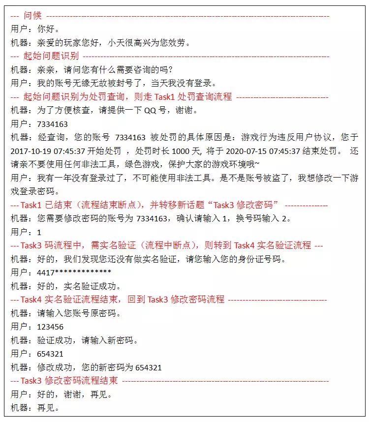

**TP小天**

对话是一种比网页或APP更自由的表达形式，用户有了主动表达诉求的空间，可以实现有别于网页或APP的一些特殊功能：用户安全教育、舆论监控、信息收集。

根据上述的机器人设计方法，我们设计了TP小天，用户可以通过游戏安全中心公众号，咨询游戏安全相关的信息。如下图所示，已经接入了处罚查询、申诉、举报、帐号冻结等游戏安全功能与话题。

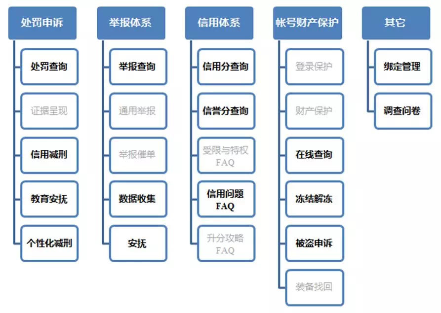

在实战中，一个可运营的聊天机器人，还会涉及到很多其它的内容，如何提升语义理解的丰富性、大样本推荐标注、FAQ应答、快速可配置修正、对话生成多样性、闲聊等等。

## 参考资料

[多轮对话机器人打造：](http://mp.weixin.qq.com/s?__biz=MzI2NDU4OTExOQ==&mid=2247487584&idx=1&sn=6d600a7944c35f0ca37d13927ba9a68f&chksm=eaab0a30dddc8326a2ddd984c658aafcecec4bc770d23d7aa8a563b4d583fbeb1fb441adc425&scene=21#wechat_redirect)[着手设计](http://mp.weixin.qq.com/s?__biz=MzI2NDU4OTExOQ==&mid=2247487584&idx=1&sn=6d600a7944c35f0ca37d13927ba9a68f&chksm=eaab0a30dddc8326a2ddd984c658aafcecec4bc770d23d7aa8a563b4d583fbeb1fb441adc425&scene=21#wechat_redirect)；

[多轮对话机器人打造：](http://mp.weixin.qq.com/s?__biz=MzI2NDU4OTExOQ==&mid=2247487590&idx=1&sn=8707836cbe6b2bf2565f24b6c9df7614&chksm=eaab0a36dddc8320011dddf5831223231b3b2b4577cceb57e91e7d7feecd2f100babb0d880f6&scene=21#wechat_redirect)[话题意图识别](http://mp.weixin.qq.com/s?__biz=MzI2NDU4OTExOQ==&mid=2247487590&idx=1&sn=8707836cbe6b2bf2565f24b6c9df7614&chksm=eaab0a36dddc8320011dddf5831223231b3b2b4577cceb57e91e7d7feecd2f100babb0d880f6&scene=21#wechat_redirect)；