## 意图识别

Domain/Intent Classification

**传统方法**：SVM、MaxEnt 。

这个就是用传统的SVM或MaxEnt，模型方面就是传统的MaxEnt或SVM(几个不同变种、几种不同核函数等)，特征主要就是用户的输入Utterance的句法、词法、词性等特征，分类的label集合是事先确定的，这方面paper也不少，不过比较久远了。

**DBN-Based** **(**[Sarikaya et al., 2011](https://link.zhihu.com/?target=https%3A//ieeexplore.ieee.org/abstract/document/5947649)**)**

这种方法基于Deep belief network，它是一种生成模型，由多个限制玻尔兹曼机（Restricted Boltzmann Machines）层组成，被“限制”为可视层和隐层，层间有连接，但层内的单元间不存在连接。隐层单元被训练去捕捉在可视层表现出来的高阶数据的相关性。

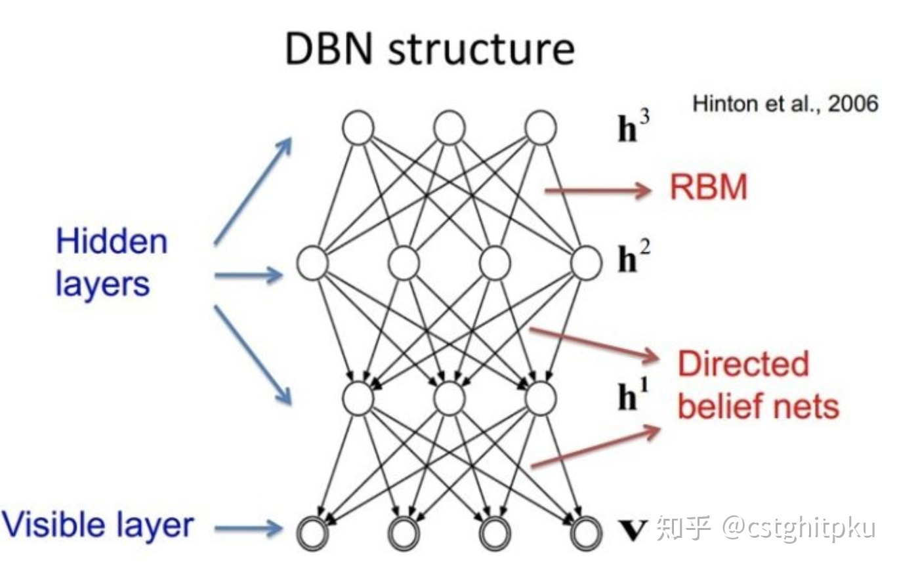

具体到这篇论文，主要思路：无监督训练权重，然后用BP做Fine-tuning。另外，还对比了与SVM、最大熵、boosting的效果。

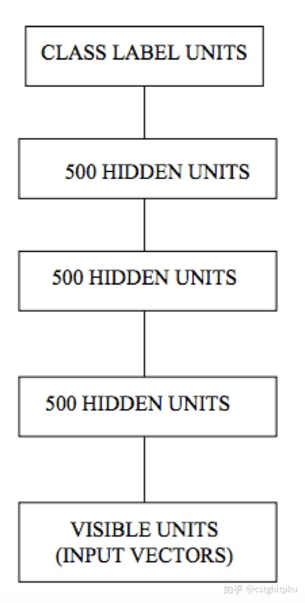

**DCN-Based （**[Tur et al., 2012](https://link.zhihu.com/?target=https%3A//ieeexplore.ieee.org/abstract/document/6289054)**）**

这是一种基于Deep convex network(一种可扩展的模式分类体系结构)做NLU，具体可以参考Li Deng大牛在2011的Interspeech的paper。

这个工作的主要思路：用n-grams对用户的Utterance做特征选择，然后把简单的分类器做**Stacking**，Stacking跟Bagging与Boosting一样，也是一种ensemble的方法。**Stacking**指训练一个模型用于组合其他各个模型，**在这里相当于二次分类**。首先训练多个不同的模型，然后把训练的各个模型的输出作为输入来训练一个模型以得到最终输出。

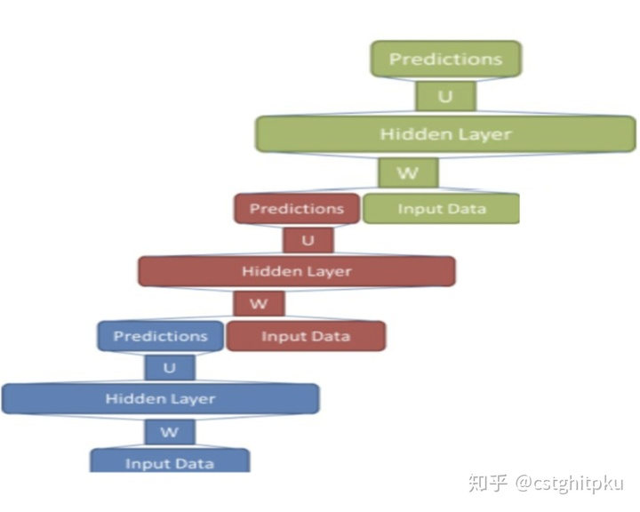

另外，基于DCN的方法还被扩展到kernel-DCN([Deng et al., 2012](https://link.zhihu.com/?target=http%3A//ieeexplore.ieee.org/abstract/document/6424224/)).

**RNN-Based(**[Ravuri et al., 2015](https://link.zhihu.com/?target=https%3A//www.microsoft.com/en-us/research/wp-content/uploads/2016/02/RNNLM_addressee.pdf))

这种方法使用了RNN和LSTM。最终结论是，输入完所有词再进行意图分类效果更好。

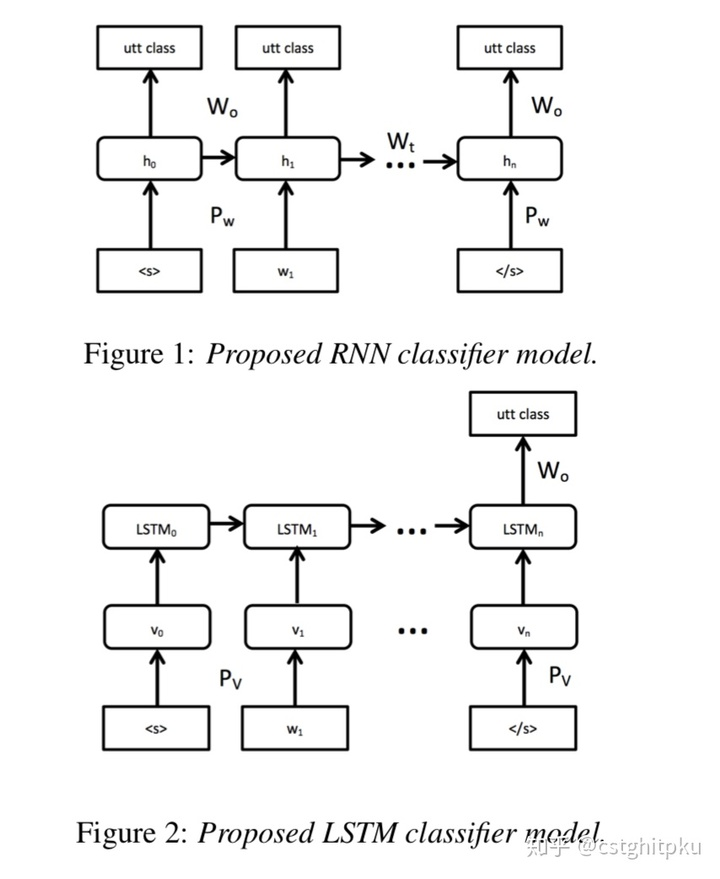

**RNN+CNN based（**[Lee et al,2016](https://link.zhihu.com/?target=https%3A//arxiv.org/pdf/1603.03827.pdf)**）**

这个方法是用RNN+CNN做对话的act分类，提出了基于RNN和CNN并融合preceding short texts的模型。短文本如果出现在一个序列中，使用preceding short texts可能提高分类效果，这就是本文的最大的动机和创新点，事实证明也确实达到了SOTA的效果。

本文的两部分：使用RNN/CNN把短文本变成向量表示，基于文本的向量表示和preceding short texts做act分类。

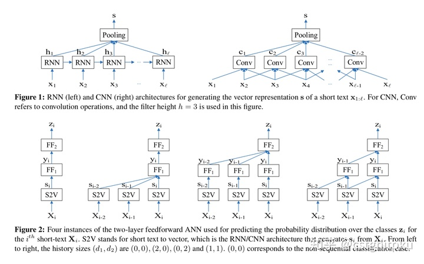

另外，还有rule-based的方法做Domain/Intent Classification，比如CFG、JSGF，感兴趣的可以看看。基于RNN的细分的话，还有RCNN(Lai et al., 2015)和C-LSTM(Zhou et al., 2015)两种方法

### 难点

- 输入不规范：错别字、堆砌关键词、非标准自然语言；
- 多意图：输入的语句信息量太少造成意图不明确，且有歧义。比如输入仙剑奇侠传，那么是想获得游戏下载、电视剧、电影、音乐还是小说下载呢；
- 意图强度：输入的语句好像即属于A意图，又属于B意图，每个意图的的得分都不高；
- 时效性：用户的意图是有较强时效性的，用户在不同时间节点的相同的query可能是属于不同意图的，比如query为“战狼”，在当前时间节点可能是想在线观看战狼1或者战狼2，而如果是在战狼3开拍的时间节点搜的话，可能很大概率是想了解战狼3的一些相关新闻了。

## 槽填充

槽填充一般是序列标注问题，因此在序列标注任务中广泛应用的CRF和RNN以及各种变种很自然的就可以用于槽填充。

**CRF （**[Wang and Acero,Interspeech 2006](https://link.zhihu.com/?target=https%3A//pdfs.semanticscholar.org/7449/72a9b58e1c92496c613e16a73fc64b107a32.pdf)**）（**[Raymond and Riccardi,Interspeech 2007](https://link.zhihu.com/?target=http%3A//www.irisa.fr/texmex/people/raymond/pub/Interspeech2007.pdf)**）**

**CRF+CNN** **(**[Puyang Xu and Ruhi Sarikaya 2013](https://link.zhihu.com/?target=https%3A//ieeexplore.ieee.org/document/6707709)**)**
这篇工作在ATIS数据集把意图识别跟槽填充联合起来做的，主要方法是CNN+ triangular CRF，意图识别的准确率为94.09%、槽填充的F1为95.42%，可以看出比起前面基于CRF的模型效果好不少。 triangular-CRF与CRF的主要区别是输入前先用前向网络得到每个标签的类别。下面分别介绍下意图识别和槽填充如何实现。

**意图识别：**

先得到隐藏层的特征h，再使用max pooling来获取整句的表示，最后用softmax做意图分类。

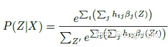

**槽填充：**

输入词向量到卷积层得到特征表示h，再用triangular-CRF打分。具体打分公式如下：

其中，t(Yi-1,Yi)为转移打分，hij为CNN得到的特征，每时刻的特征经过前向网络得到每个标签的概率，然后结合起来作为最终得分。

**RNN(n-grams)（**[Yao et al. 2013](https://link.zhihu.com/?target=https%3A//www.isca-speech.org/archive/archive_papers/interspeech_2013/i13_2524.pdf)**）（**[Mesnil et al, 2015](https://link.zhihu.com/?target=http%3A//www.iro.umontreal.ca/~lisa/pointeurs/taslp_RNNSLU_final_doubleColumn.pdf)**）**
这类基于RNN的模型使用了**n-grams**，也是在ATIS数据集做的实验

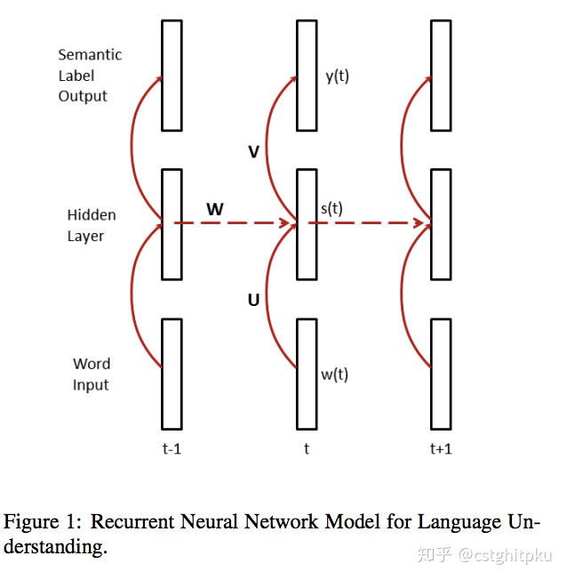

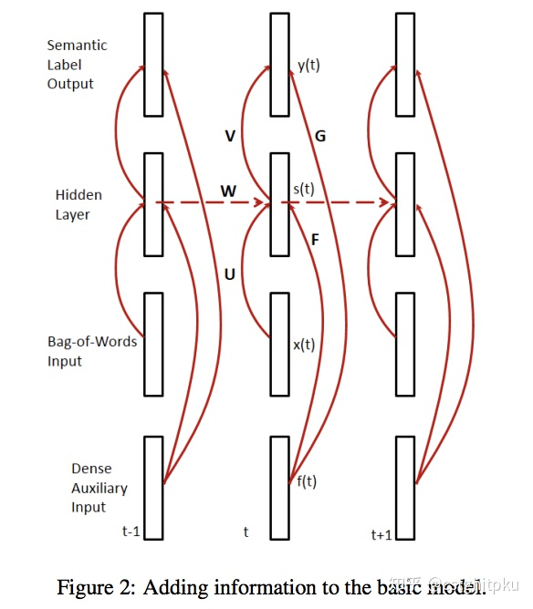

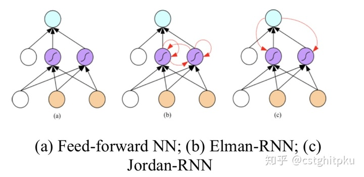

**RNN(encoder-decoder) (**[Kurata et al., EMNLP 2016](https://link.zhihu.com/?target=https%3A//arxiv.org/pdf/1601.01530.pdf)) （[Simonnet et al., NIPS 2015](https://link.zhihu.com/?target=http%3A//docs.wixstatic.com/ugd/b6d786_fb446f2938b24ea68d3b6821d0a7cee4.pdf)）
这类基于RNN的模型使用了**encoder-decoder**，第二篇还加入了Attention，Attention是根据ht 和st 用feed- forward 网络来计算的。也是在ATIS数据集做的实验。

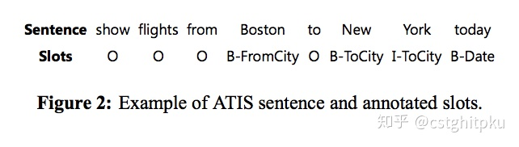

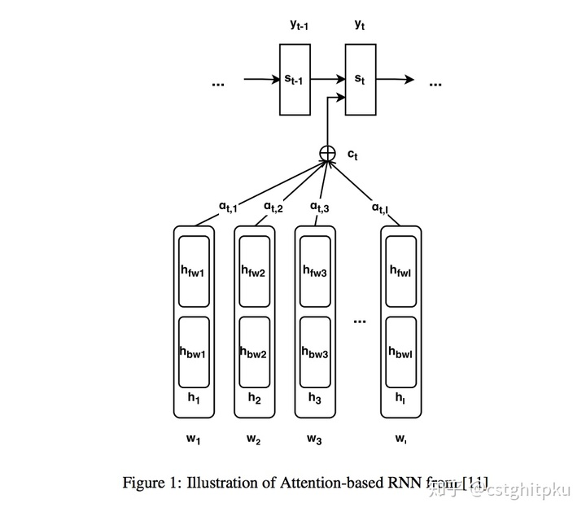

另外，基于Attention的RNN还有interspeech 2016的一篇工作（[Liu and Lane 2016](https://link.zhihu.com/?target=https%3A//arxiv.org/pdf/1609.01454.pdf)），本文也是把意图识别和槽填充结合起来做，主要提供两种思路和模型，下面具体说下。

思路一：采用encoder-decoder，encoder的最后输出+文本向量做意图分类。下面说下a、b、c三图的区别：图a隐层为非对齐attention的模型，decoder隐层为非对齐的方式；图b为隐层为对齐无attention的模型；图c隐层为对齐attention的模型。

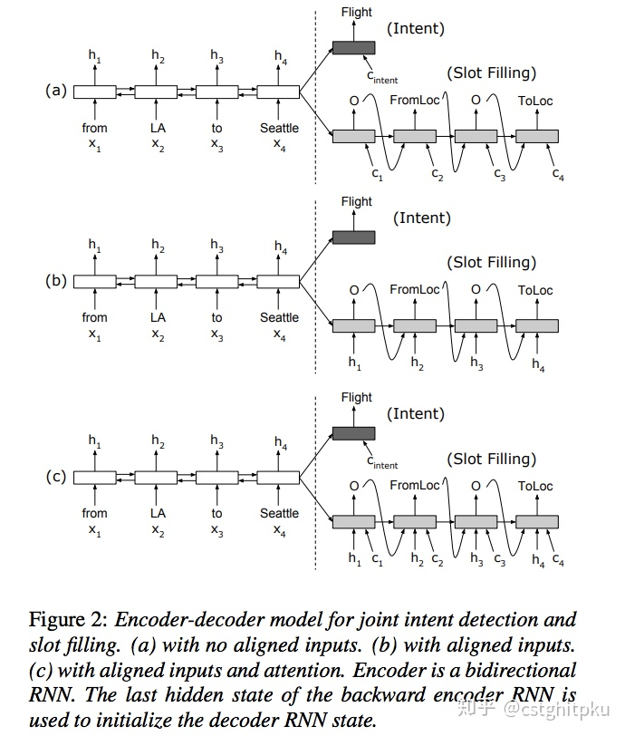

思路二：

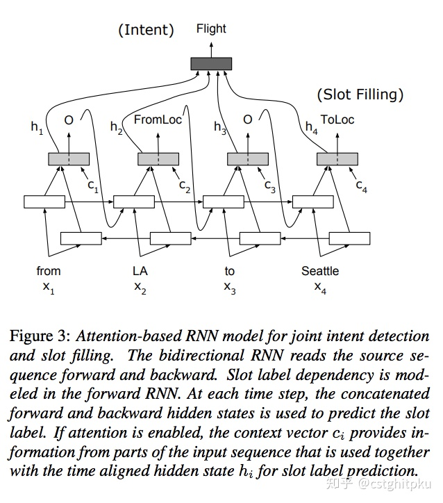

decoder的隐层输出加权得到最后的意图分类，BiRNN得到特征并与文本向量拼接后作为单层decoder的输入，然后识别槽位。

**LSTM（**[Yao et al. 2014](https://link.zhihu.com/?target=https%3A//groups.csail.mit.edu/sls/publications/2014/Zhang_SLT_2014.pdf)**） GRU（**[Zhang and Wang 2016](https://link.zhihu.com/?target=https%3A//www.ijcai.org/Proceedings/16/Papers/425.pdf)**）**
这部分的两类方法主要是RNN的两大最有名的变种LSTM和GRU。也是在ATIS数据集做的实验。

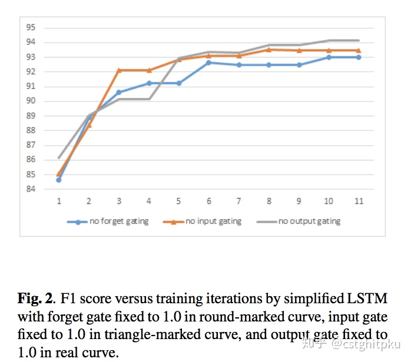

方法二也基于Attention，是2016年IJCAI的一篇paper，把意图识别和槽填充结合起来做的。输入词向量，使用双向GRU学习特征。基于学习的隐层特征，使用max pooling得到全句的表示，再用softmax进行意图分类；对隐层输入用前向网络得到每个标签的概率，再用CRF进行全局打分得到最优序列标注结果，根据序列标注结果完成槽填充。需要说明的一点是：联合损失函数为槽与意图的极大似然。也是在ATIS数据集做的实验。

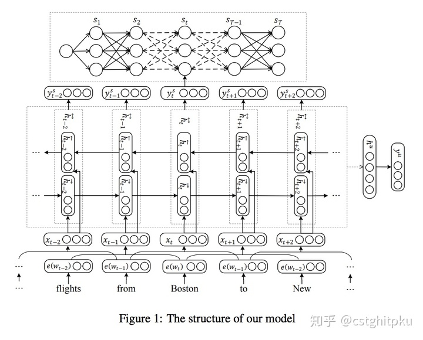

**Multi-task Learning**

这类方法是跨领域的多任务同时学习，主要思想是在数据较多的领域或任务训练模型，然后迁移到数据较少的领域或任务，以便于提升其效果。这类方法底层网络跨领域或任务都是共享的，高层网络因为任务或领域不同而不同。代表性的工作包括：

[Zhai et al., AAAI 2017](https://link.zhihu.com/?target=https%3A//arxiv.org/pdf/1701.04027.pdf)

这个工作主要是把 Segmentation 和 槽填充联合起来做的，对segments进行双向LSTM编码，再用LSTM解码并得到序列标注结果，最后就实现了槽填充。

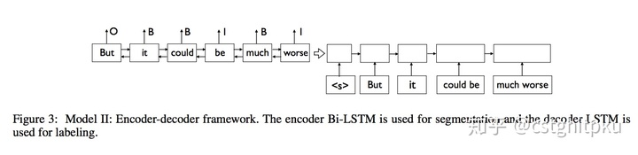

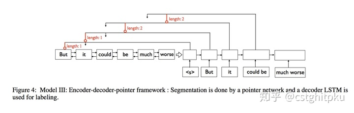

[Hakkani-Tur et al., Interspeech 2016](https://link.zhihu.com/?target=https%3A//www.microsoft.com/en-us/research/wp-content/uploads/2016/06/IS16_MultiJoint.pdf)

这篇工作是把 Semantic Frame Parsing 与 意图分类、槽填充 联合起来做。另外说句题外话，这篇文章的作者们都是任务型对话领域的一流学者。需要注意的是，意图分类和槽填充**在一个序列完成**，跟下一种方法不一样。

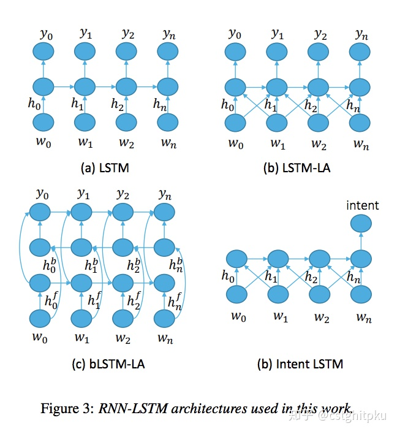

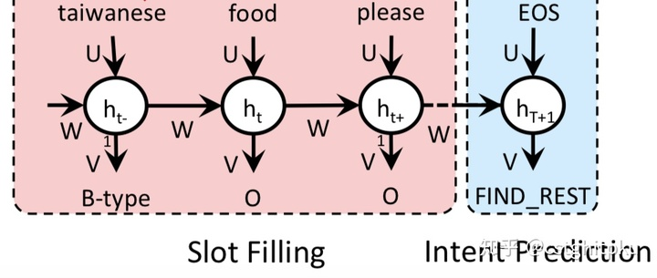

[Liu and Lane, Interspeech 2016](https://link.zhihu.com/?target=https%3A//arxiv.org/abs/1609.01454)

这篇工作是基于Attention的RNN，把意图识别与槽填充结合起来做，其实在上面**RNN(encoder-decoder)**的方法中已经介绍过这个方法。为了跟上一种方法对比，需要注意的是，意图分类和槽填充**不在同一个序列完成**，decoder的隐层输出加权得到最后的意图分类，BiRNN得到特征并与文本向量拼接后作为单层decoder的输入，然后识别槽位。

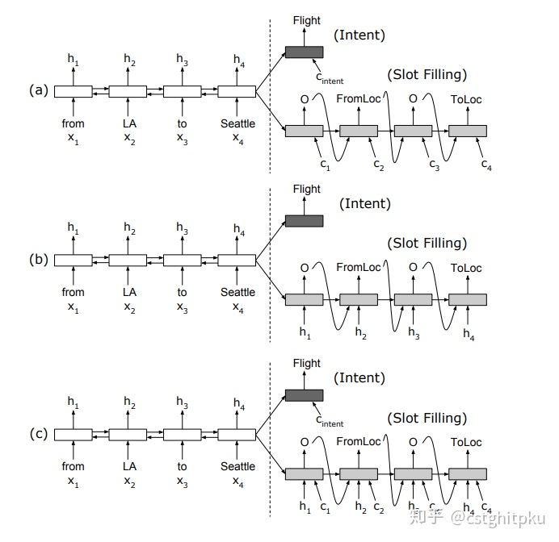

**Domain Adaptation** **Adaptation Adaptation** （[Jaech et al., Interspeech 2016 ](https://link.zhihu.com/?target=https%3A//arxiv.org/pdf%3C/u%3E/1604.00117.pdf)）

这个方法是迁移学习中的领域适配。领域适配解决这类任务的主要思路是：利用源领域与目标领域分布之间的KL散度对目标领域模型进行Regularize。

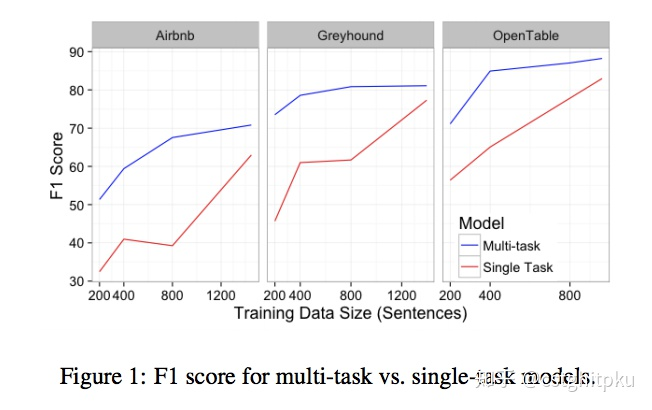

**Parameter transfer**（[Yazdani and Henderson 2015](https://link.zhihu.com/?target=http%3A//www.aclweb.org/anthology/D15-1027) ）
这个方法是迁移学习中的参数转移。参数转移解决这类任务的主要思路是：使用词嵌入向量和相似标签分类器之间的参数共享，因此相似的分类器具有相似的超平面。另外需要指出的是，这个方法还使用了Zero-Shot Learning（举例说明的话：假如训练数据没有斑马，但是要识别斑马，那么可以用马的外形+老虎的条纹+熊猫的黑白色来组合训练）。

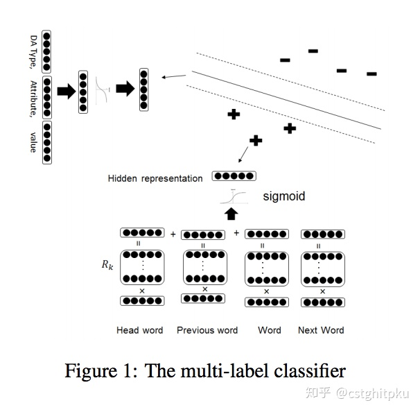

**Instance based transfer** (Tur 2006)
这个方法是迁移学习中的基于Instance的转移。在领域之间自动映射相似的类别，并跨领域传递相似的实例。方法比较久远，不再赘述。

**RecNN+Viterbi （**[Guo et al., 2014](https://link.zhihu.com/?target=https%3A//ieeexplore.ieee.org/document/7078634)**）**

这个方法也是基于ATIS数据集做的。输入为词向量，每个词性看作权重向量 ，每个词在其路径的运算为词向量与词性权重向量的点积运算。基于根节点的输出向量做意图分类；采用基于Viterbi进行全局优化，采用基于tri-gram语言模型极大化标注序列进行槽填充。

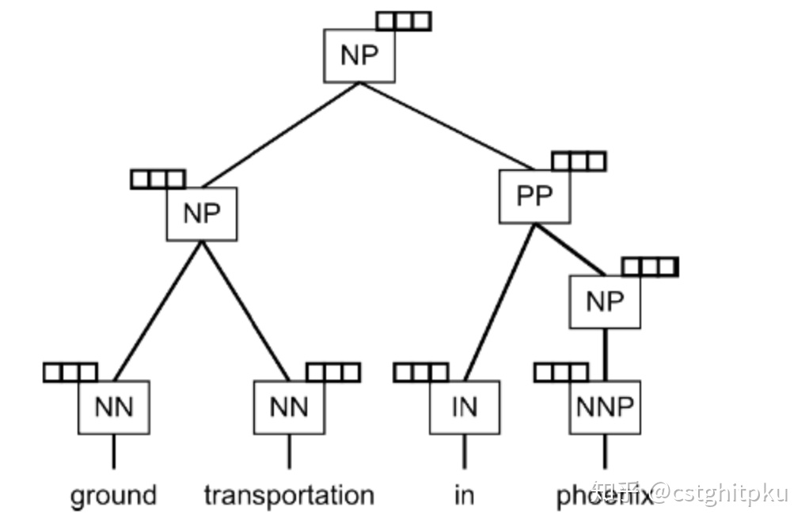

## 上下文LU

这是一类结合上下文来进行SLU的方法，这类方法的主要好处是：在**多轮对话**中，解决**歧义问题。**

**[Hori et al, 2015](https://link.zhihu.com/?target=https%3A//www.merl.com/publications/docs/TR2015-134.pdf)**

基于Seq2Seq模型对上下文建模，一次输入一个词，每句结束时输出标签。这种模型还具有对话者角色相关的LSTM层，并使用角色状态控制门来决定角色是不是active，而且角色状态随时间而线性传播，agent和client的角色也被加以区分。这种方法对上下文比较敏感，能解决多轮对话的歧义问题。

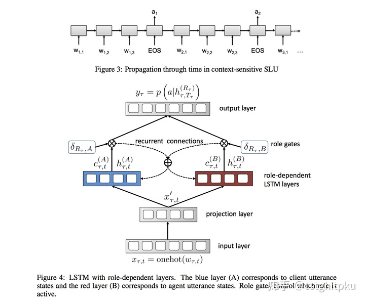

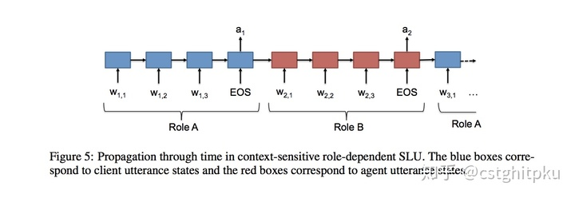

**[Chen et al., 2016](https://link.zhihu.com/?target=https%3A//www.microsoft.com/en-us/research/wp-content/uploads/2016/06/IS16_ContextualSLU.pdf)** 这篇论文的所有作者都是任务型对话领域的知名学者。

这种方法的主要idea是在作slot tagging时加入上下文知识， 然后以一种潜在的方式进行对话状态的追踪。

这是一种基于端到端的记忆网络携带Knowledge来做多轮对话中的上下文理解，将RNN和Memory Networks结合起来应用于SLU模块。具体分为4步：

1.记忆表示:为了存储前面对话轮中的知识，通过RNN将前面对话轮中的每个话语嵌入到连续的空间中，将每个话语转换成一个记忆向量；

2.知识注意力分布：在嵌入空间中，通过取内积然后softmax来计算当前输入和每个记忆向量间的匹配，该结果可以被看作是为了理解当前输入而建模知识传递的注意力分布；

3.知识编码表示：为了对来自历史的知识进行编码，历史向量是对由注意力分布加权的记忆嵌入的总和；

4.序列标注：提供携带的知识来提高序列标注的效果。

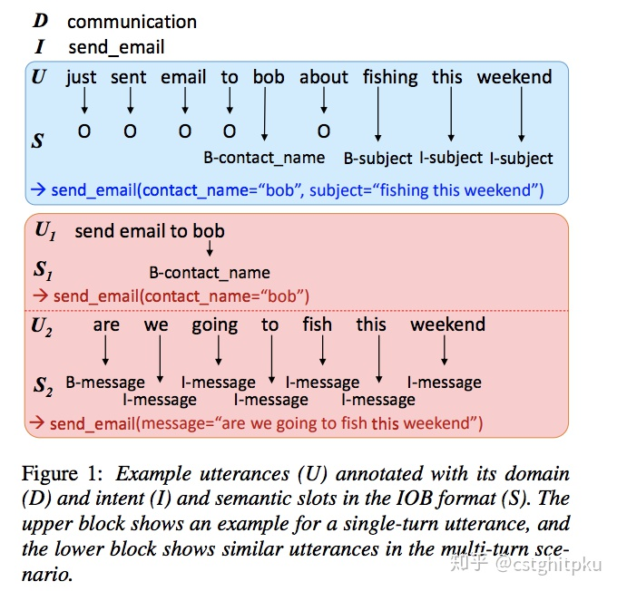

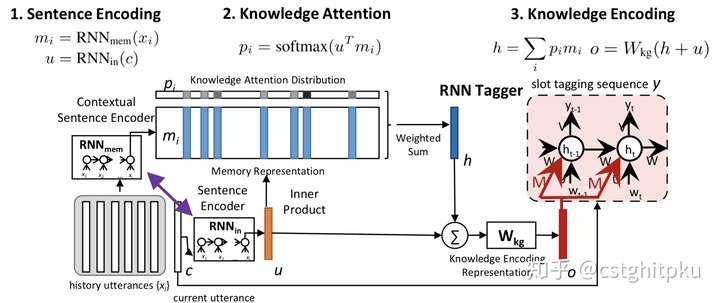

**[Bapna et.al., SIGDIAL 2017](https://link.zhihu.com/?target=http%3A//www.aclweb.org/anthology/W17-5514)** **对话**

使用RNN探索新的建模对话上下文的方法，提出了序列对话编码网络，它允许按时间顺序对来自对话历史的上下文编码。之前轮和当前轮的encodings被输入一个共享所有存储器权重的前馈网络。并将序列对话编码网络的性能与仅使用先前的上下文的模型、在memory网络中编码失去对话顺序的上下文的模型进行比较，在多域对话数据集上的实验表明，序列对话编码网络能减少歧义。

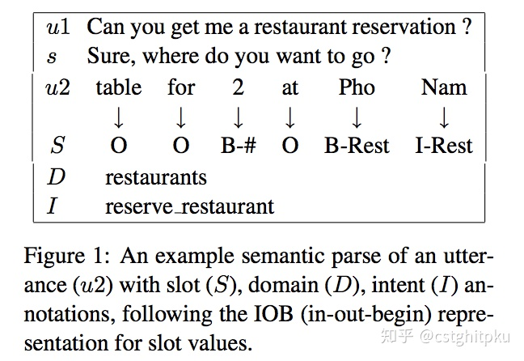

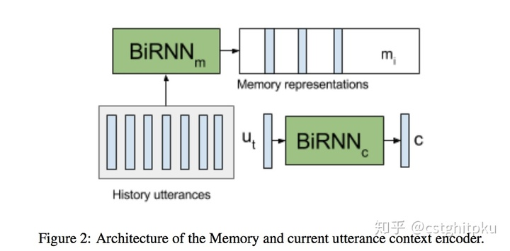

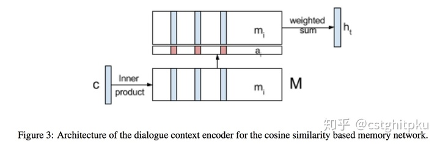

## **结构化LU**

**（**[Chen et al., 2016](https://link.zhihu.com/?target=https%3A//arxiv.org/abs/1609.03286)**）**

本文提出了K-SAN:用先验知识当作引导，句子结构知识当作menory来存储。这是**由先验知识引导的结构化注意力网络**，其实就是RNN+attention+先验知识，但是跟RNN不同的是：该模型充分利用自然语言丰富的、结构化的信息而不再是线性扁平链。

该模型的两大优势是：可从**少量数据**中获取重要的**子结构**，增强模型的泛化能力；针对给定句子，可自动找出对其语义标签至关重要的**显著子结构**，从而缓解测试集中的**unseen data**，进一步提升NLU的效果。并在ATIS数据上表明 K-SAN 可以使用注意力机制有效地从子结构中提取出显著的知识，达到SOTA的效果。

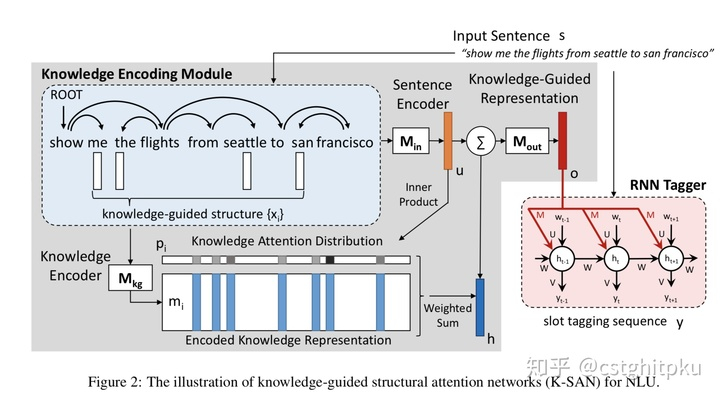

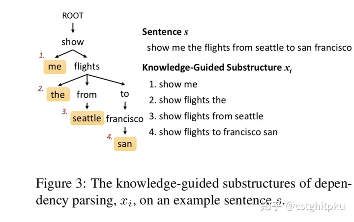

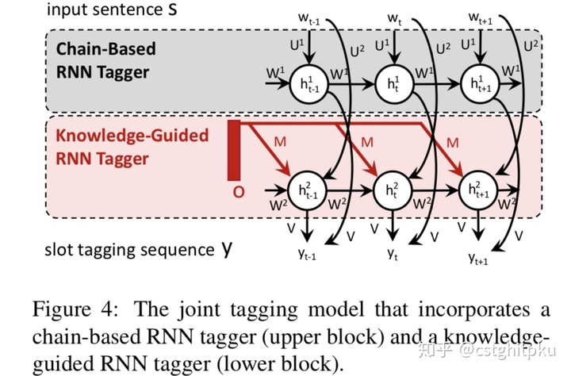

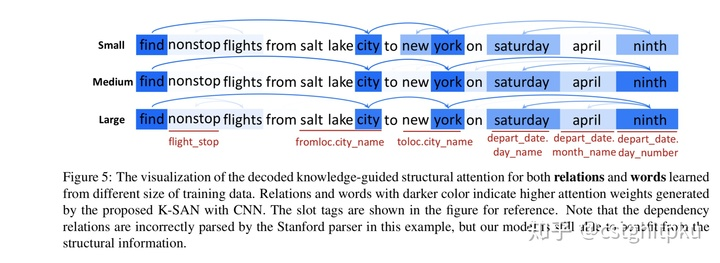

## 联合训练

[Intent Detection and Slot Filling](https://zhuanlan.zhihu.com/p/75228411)

## 参考资料

[总结|对话系统中的口语理解技术(SLU)（一）](https://zhuanlan.zhihu.com/p/50095779)

[总结|对话系统中的口语理解技术(SLU)（二）](https://zhuanlan.zhihu.com/p/50347509)

[总结|对话系统中的口语理解技术(SLU)（三）](https://zhuanlan.zhihu.com/p/50704090)

[一步到位解决SLU/NLU--意图识别和槽位填充联合训练模型理论和代码复现](https://zhuanlan.zhihu.com/p/358322284)（一些论文模型）
