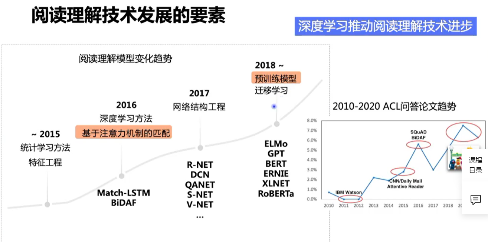
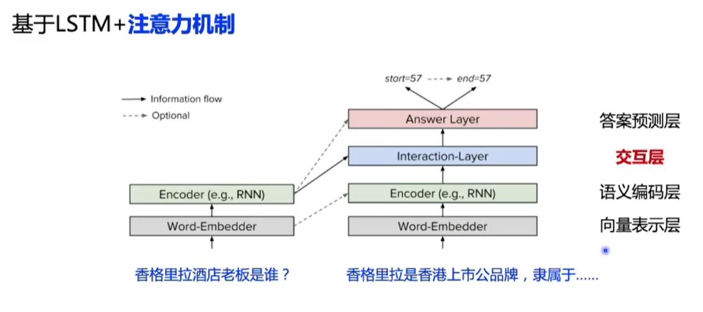
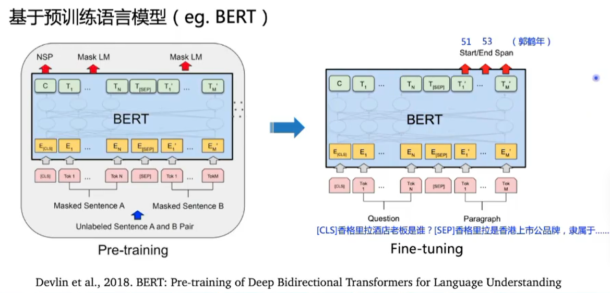
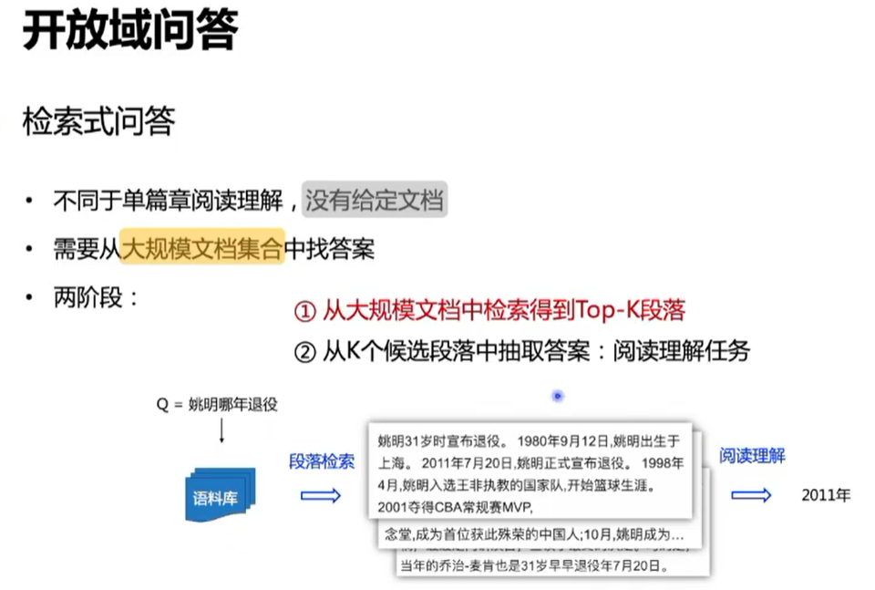
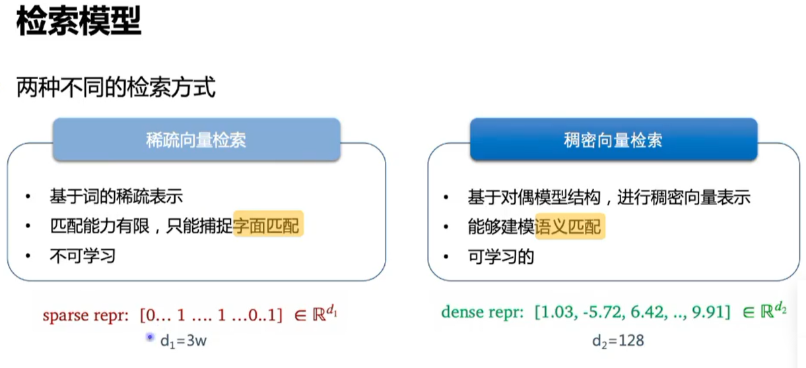
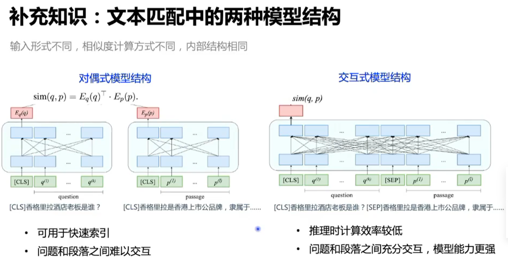
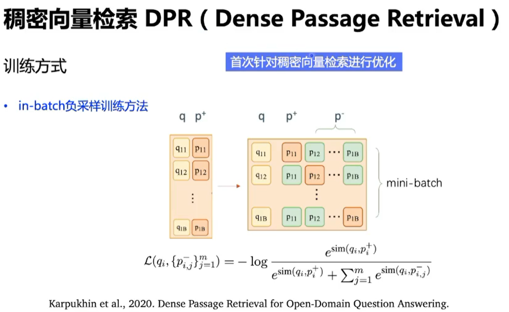
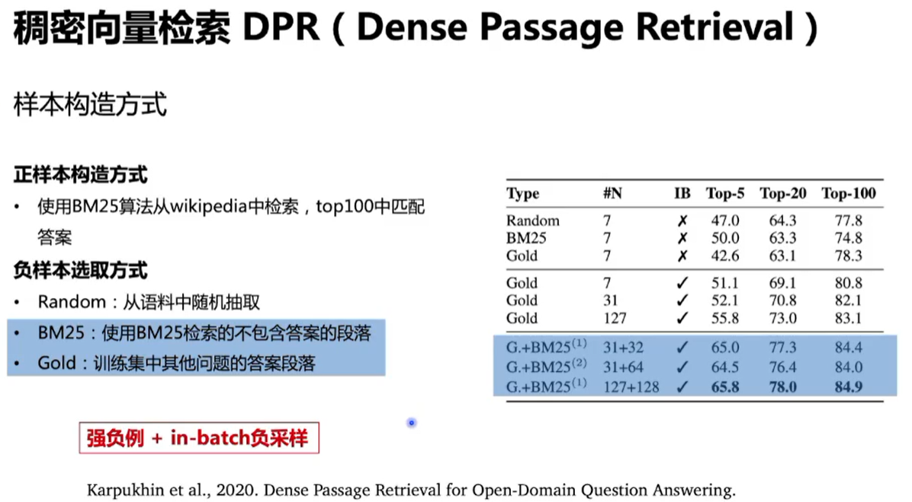
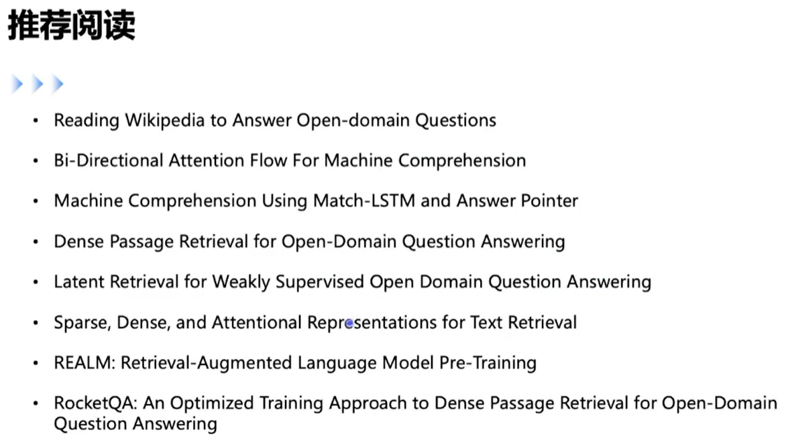

搜索场景下的问答系统

- 文本问答——阅读理解，如姚明哪年退役

- 知识库问答，如姚明的老婆是谁

- 表格问答，如日本古代首都

- 视频问答，如镜怎么玩连招技巧

开放域问答：不限定领域，从大规模语料库中查找答案

检索式问答

- 两阶段：Retriever——Reader，即段落检索和阅读理解。DrQA(2017)

## 机器阅读理解

任务类型

- 题目形式：选择题，填空题，**回答题**
- 答案是否在原文中：**抽取式**，生成式

评估方式

- EM(exact match)
- F1 score

数据集

- SQuAD(2016)，(passage, question, answer)
- DuReader(2017)，

### 抽取式阅读理解任务

任务定义

- 输入：给定篇章P和问题Q
- 输出：答案开始位置/结束位置

相关模型

- 基于LSTM+注意力机制

- 基于预训练语言模型

阅读理解模型存在的问题

解决了一个数据集不等于解决了一个任务

泛化性：在领域A迁移到领域B

- 通过多任务学习、迁移学习

鲁棒性

- 过稳定：不同的提问给出相同的答案
- 过敏感：相同语义的提问给出不同的答案
- 通过对抗样本生成、复述生成等方法
- DuReader-Robust，DuReader-Checklist

## 段落检索

## 参考资料

百度NLP打卡营
