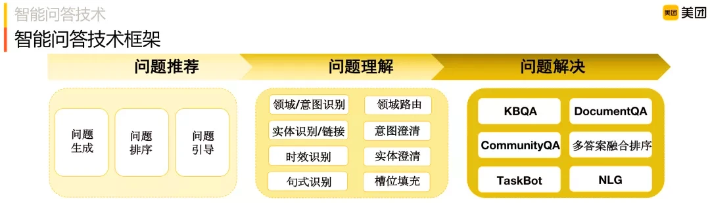

分类

- 文本问答——阅读理解，如姚明哪年退役

- 知识库问答，如姚明的老婆是谁

- 表格问答，如日本古代首都

- 视频问答，如镜怎么玩连招技巧

按照对话的智能程度，我们可以把智能问答分为5个阶段：**单轮问答、多轮会话、意图推理、个性化以及情感互动**，而从问答的种类来讲，我们又可以将其分为**Community QA、KBQA、TableQA、PassageQA、VQA**这5大类。

-   KBQA：基于知识图谱的问答，所有的知识被组织成三元组的形式，比如<姚明、妻子、叶莉>这个三元组是知识图谱里的一条知识，当用户询问“姚明的妻子是谁”的时候，问答模型会将答案定位到“叶莉”；
    
-   TableQA：知识是用表格的形式组织的，商家的产品信息用表格的形式存储，当用户询问关于某个产品的具体属性时，问答模型可以把用户的自然语言转化成SQL查询语句，直接从数据库里定位答案；
    
-   PassageQA：阅读理解，它是基于文档的问答，我们的问答模型会基于用户的问题，将答案定位在文档的某个段落、某句话甚至是某个短语。
    
-   VQA：基于图像或视频的问答，以上图为例，用户问“这个女孩儿的脸被什么挡住了”，问答模型会告诉我们答案是“香蕉”；
    
-   Community QA：从命名上来看，它是基于社区知识的问答，比如一个读书论坛，底下有人在交流值得一读的人工智能书籍，在母婴论坛有人在讨论宝宝发烧了怎么办？需要吃药吗？那么这些对话内容都可以沉淀为知识，我们定义的Community QA就来源于这些场景，在不同的领域，我们通过挖掘、或者收集、标注的方式沉淀了一批知识，用问答对的形式把它们组织起来，在这批知识集合下，用户提问一个领域相关的问题，问答模型会告诉我们答案到底是什么。

智能问答通常会涉及三方面问题：

-   问题推荐：当用户进入智能问答产品门户时，问答系统通常会根据用户信息推荐相关问题来帮助用户明确他的意图，以便很好的为他服务。这里通常涉及问题怎么来 ( 问题生成 )，推荐哪些问题 ( 问题排序 ) 和对话过程中还会问哪些问题，即多轮问题引导，问答系统通常会考虑问题之间的相关性，问题间的顺承关系给出相应的问题引导；
    
-   问题理解：当用户输入时，判断是不是问问题，是哪个领域/意图，有什么实体槽位，是不是时效性问题等等。如果问题可能属于多个领域，则需要领域路由澄清，如果意图不明确，则需进一步澄清等，如果一个实体名关联多个实体店，例如，七天酒店有很多门店，则需要澄清"你要问的是哪一个门店"；
    
-   问题解决：给出最终问题的答案，本文将重点介绍，包括基于阅读理解的问答 ( Document QA )、社区问答 ( Community QA ) 以及基于图谱的问答 ( KBQA )。另外针对有第三方 API 的问题，我们也会以 TaskBot 方式调用 API 来解决，本次主要介绍"自供给"形式的问题解决方案，TaskBot 暂不介绍。

## 参考资料

[美团智能问答技术探索与实践](https://www.infoq.cn/article/bvmbionj6xwgykuof3dq)（机器阅读理解是从原文中提取，社区问答利用“问大家”的数据）

https://github.com/BDBC-KG-NLP/QA-Survey（问答系统的总结）

[揭秘：对话机器人平台智能问答技术](https://segmentfault.com/a/1190000021414367)（Community QA在吾来的实践，检索式问答）

