## mixup介绍

paper: mixup: BEYOND EMPIRICAL RISK MINIMIZATION -- ICLR2018 

link: https://arxiv.org/pdf/1710.09412.pdf

该论⽂提出的Mixup的核⼼公式为：

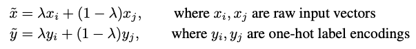

其中xi,yi和xj,yj都是从训练集中随机选择的，其中lambda取值于beta分布，范围为0-1。

y是one-hot标签，⽐如yi的标签为[0,0,1]，yj的标签为[1,0,0]，此时lambda为0.2，那么此时的标签就变为0.2*[0,0,1] + 0.8*[1,0,0] = [0.8,0,0.2]，其实Mixup的⽴意很简单，就是通过这种混合的模型来增强模型的泛化性

pytorch代码

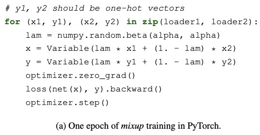

该论⽂仅仅在CV数据集上做了⼤量实验证明其有效性，⽽在NLP上并没有实验。

## wordMixup 和 senMixup

paper: Augmenting Data with Mixup for Sentence Classification: An Empirical Study -- 2019 arxiv

这篇论⽂估计验证了两种Mixup⽅法分别在word层⾯和sentence层⾯。

### wordMixup

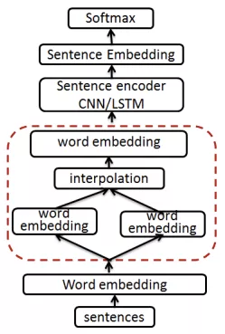

就是在word embedding之后，对本身copy⼀份并shuffle，词对应做处理：

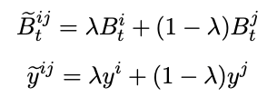

### senMixup

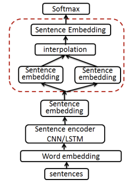

就是在信息整合后的sentence embedding之后，进⾏mixup：

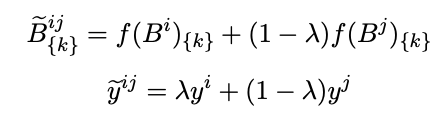

其中k为第k个维度。

### 实验

为了实验的充分，本⽂提出了四种embedding⽅法进⾏对⽐：

- RandomTune: 随机⽣成词向量且可以finetune 
- RandomFix: 随机⽣成词向量且不可以finetune 
- PretrainTune: 预训练词向量且可以finetune 
- PretrainFix: 预训练词向量且不可以finetune

⽆论怎样的配置，都是有效果的。

## Manifold Mixup

Manifold Mixup: Better Representations by Interpolating Hidden States -ICML2019 link: https://arxiv.org/pdf/1806.05236.pdf

code: https://github.com/vikasverma1077/manifold_mixup

该论⽂提出的⽅法其实主要就是四个步骤：

- 在包括输⼊层在内的所有层中随机选取⼀个k层；
- 使⽤两组不同的数据前向传播到k层，然后对这两组隐层进⾏Mixup得到新的融合向量和新的label；
- 对新的向量继续向后⾯的层传播，直到输出预测值；
- 计算预测值和合成的新的label的损失，反向传播。

Input Mixup为最原始的Mixup，即在输⼊端进⾏Mixup。

该作者也得出了⼀些结论：Manifold Mixup⽐Input Mixup更加容易收敛， 原因是Input Mixup会导致模型⽋拟合，⽽在更深层进⾏Mixup才能是训练更好的拟合。

## Mixup-Transformer

paper: Mixup-Transformer: Dynamic Data Augmentation for NLP Tasks -COLING2020

link: https://arxiv.org/pdf/2010.02394.pdf

这篇⽂章的主要贡献就是：

1. 第⼀次提出在基于transformer上做Mixup 
2. 得出数据量越⼩性能提⾼的幅度越⾼的结论

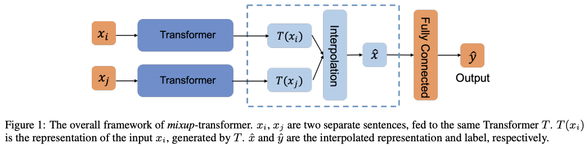

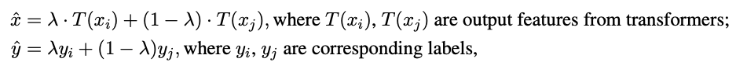

## TMix

paper: MixText: Linguistically-Informed Interpolation of Hidden Space for Semi-Supervised Text Classification -- ACL2021 

link: https://arxiv.org/pdf/2004.12239.pdf 

code: https://github.com/GT-SALT/MixText

这篇⽂章提出⼀种MixText⽅法⽤于半监督⽂本分类，其中使⽤的数据增强⽅法命名为TMix。

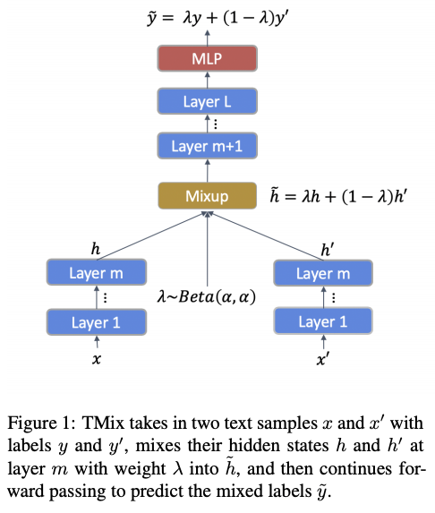

TMix就是通过两个不同的x经过m层隐层，然后通过Mixup的传统⽅法将两个hidden融合到⼀起，然后⼀起经过剩下的隐层，最终和融合后的标签y进⾏求loss。

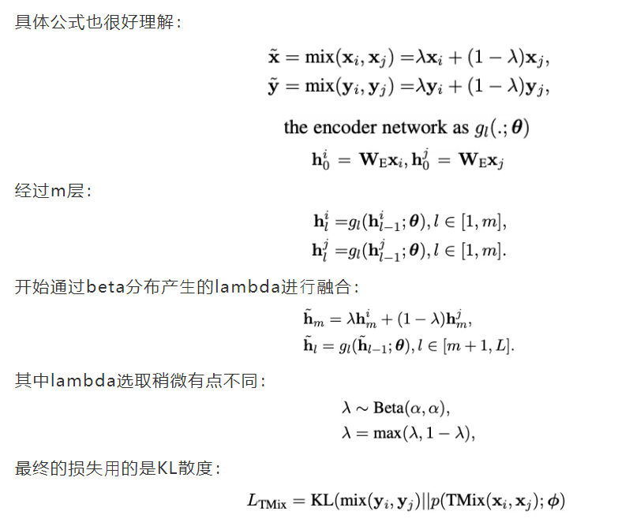

该⽂剩下的是TMix如何应⽤到半监督中（MixText）

## SeqMix

paper: SeqMix: Augmenting Active Sequence Labeling via Sequence Mixup -- EMNLP2020 

link: https://arxiv.org/pdf/2010.02322.pdf 

code: https://github.com/rz-zhang/SeqMix

之前的⽅法主要⽤在句⼦层⾯的分类，但是在其他基于字词or短语层⾯任务⽐如 NER上，就显现不出它的优势了，所以这篇⽂章主要解决了Mixup在subsequence的⼀种解决⽅案。

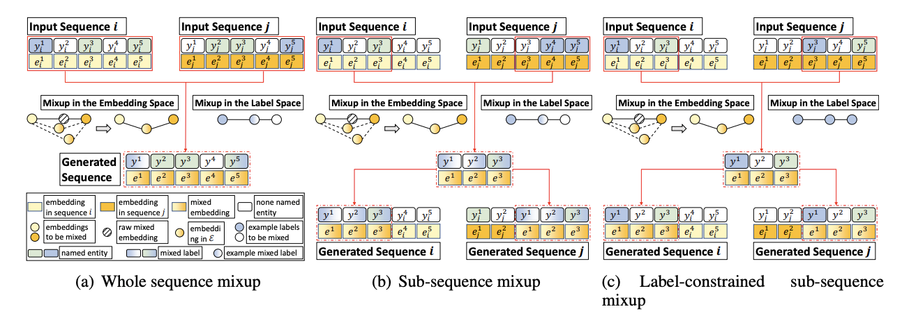

本⽂提出的⽅案是上述图中间的⽅法Sub-sequence Mixup。

其中，有⼏个重要的参数需要说明⼀下:

- s: sub-sequence的⻓度⼤⼩ 
- n: 该sub-sequence中有⽤标签（o为⽆意义标签）数据量 
- r: 选取数据集⽐例 
- alpha: Mixup的分布Beta参数

具体方法流程

1. 获取2个input: sequence i 和 j;
2. 通过设定的超参数，分别从2个sequence中获取两个⽚段；
3. 通过Beta分布获取融合参数lambda，通过Mixup⽅法并⽣成新的embedding以 及新的label；
4. 选取新的embedding附近距离最近的⼀个token作为新⽣成的sequence；
5. 分别将新⽣成的sequence替换回初始的2个sequence，通过句⼦困惑度判断哪个句⼦符合要求并放到训练集中参与训练。

## SSMix

SSMix: Saliency-Based Span Mixup for Text Classification -- ACL2021

link: https://arxiv.org/pdf/2106.08062.pdf

code: https://github.com/clovaai/ssmix

SSMix⽅法在⽂本input上通过巧妙的⽅法进⾏mixup，⽽不像前⾯⼤部分使⽤在 hidden层上。该⽅法在保留⼤部分重要token的前提下基于⼀些信息替换⼀个新的 span进来。如下图所示：

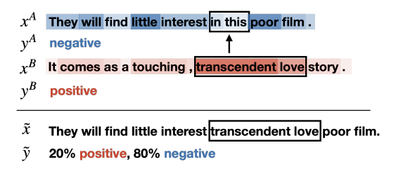

如何获取重要token的具体数值呢？本⽂采⽤的是2013年Simonyan结合2016年Li等提出的基于梯度(Gradient-based)的⽅法，这⾥就是通过计算input的embedding(e)的导数来表示该token的重要程度s(saliency scores)，这⾥采⽤的是L2计算⽅式：

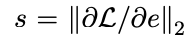

然后在sentence A中选取最不重要的⼀个span来被sentence B中最重要的相同的⻓ 度的span进⾏替换，这⾥使⽤两者必须要有相同⻓度的span是为了防⽌⼀系列不必要的麻烦。其中，该span⻓度的计算⽅法为（其中alpha为原始Mixup⾃带的）：

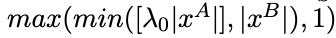

然⽽，新的label却是不⼀样的计算⽅法，这⾥设置alpha为：len(span_B) / len(\hat{x})，最终获得新的label：

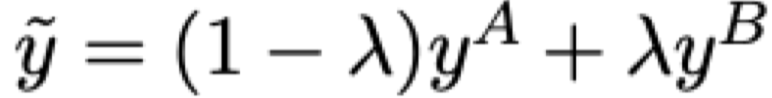

总体的计算公式为：

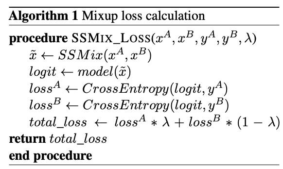

## 参考资料

[一种巧妙且简单的数据增强方法 - MixUp 小综述](https://mp.weixin.qq.com/s/7Q46FNPr30Fs4CElwfykYw)

