置信学习——自动找出哪些错误标注的样本

## **置信学习的定义**

那什么是置信学习呢？这个概念来自一篇由MIT和Google联合提出的paper：《[Confident Learning: Estimating Uncertainty in Dataset Labels](https://link.zhihu.com/?target=https%3A//arxiv.org/abs/1911.00068)[1] 》。论文提出的**置信学习**（confident learning，**CL**）**是一种新兴的、具有原则性的框架，以识别标签错误、表征标签噪声并应用于带噪学习**（noisy label learning）。

> 笔者注：笔者乍一听「置信学习」挺陌生的，但回过头来想想，好像干过类似的事情，比如：在某些场景下，对训练集通过交叉验证来找出一些可能存在错误标注的样本，然后交给人工去纠正。此外，神经网络的成功通常建立在大量、干净的数据上，标注错误过多必然会影响性能表现，**带噪学习**可是一个大的topic，有兴趣可参考这些文献 [https://github.com/subeeshvasu/Awesome-Learning-with-Label-Noise](https://link.zhihu.com/?target=https%3A//github.com/subeeshvasu/Awesome-Learning-with-Label-Noise)。


废话不说，首先给出这种置信学习框架的**优势**：

- 最大的优势：**可以用于发现标注错误的样本！**
- 无需迭代，**开源了相应的python包，方便快速使用！**在ImageNet中查找训练集的标签错误仅仅需要3分钟！
- 可直接估计噪声标签与真实标签的联合分布，**具有理论合理性**。
- 不需要超参数，只需使用交叉验证来获得样本外的预测概率。
- 不需要做随机均匀的标签噪声的假设（这种假设在实践中通常不现实）。
- 与模型无关，可以使用任意模型，不像众多带噪学习与模型和训练过程强耦合。

> 笔者注：置信学习找出的「标注错误的样本」，不一定是真实错误的样本，这是一种基于不确定估计的选择方法。

## **置信学习开源工具：cleanlab**

论文最令人惊喜的一点就是作者这个置信学习框架进行了开源，并命名为[cleanlab](https://link.zhihu.com/?target=https%3A//github.com/cgnorthcutt/cleanlab)，我们可以`pip install cleanlab`使用，具体文档说明在这里[cleanlab文档说明](https://link.zhihu.com/?target=https%3A//l7.curtisnorthcutt.com/cleanlab-python-package)。

```python
from cleanlab.pruning import get_noise_indices
# 输入
# s:噪声标签
# psx: n x m 的预测概率概率，通过交叉验证获得
ordered_label_errors = get_noise_indices(
    s=numpy_array_of_noisy_labels,
    psx=numpy_array_of_predicted_probabilities,
    sorted_index_method='normalized_margin', # Orders label errors
 )
```

如果你不只是想找到错误标注的样本，还想把这些标注噪音clean掉之后重新继续学习，那3行codes也可以搞定，这时候连交叉验证都省了～：

```python
from cleanlab.classification import LearningWithNoisyLabels
from sklearn.linear_model import LogisticRegression

# 其实可以封装任意一个你自定义的模型.
lnl = LearningWithNoisyLabels(clf=LogisticRegression()) 
lnl.fit(X=X_train_data, s=train_noisy_labels) 
# 对真实世界进行验证.
predicted_test_labels = lnl.predict(X_test)
```

> 笔者注：上面虽然只给出了CV领域的例子，但置信学习也适用于NLP啊～此外，`cleanlab`可以封装任意一个你自定义的模型，以下机器学习框架都适用：scikit-learn, PyTorch, TensorFlow, FastText。

## **置信学习的3个步骤**

一个完整的置信学习框架，需要完成以下三个步骤（如图1所示）：

1. **Count**：估计噪声标签和真实标签的联合分布；
2. **Clean**：找出并过滤掉错误样本；
3. **Re-Training**：过滤错误样本后，重新调整样本类别权重，重新训练；

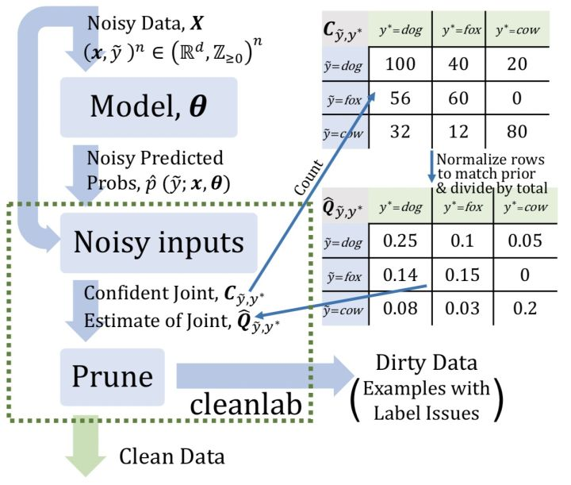

### **3.1 Count：估计噪声标签和真实标签的联合分布**

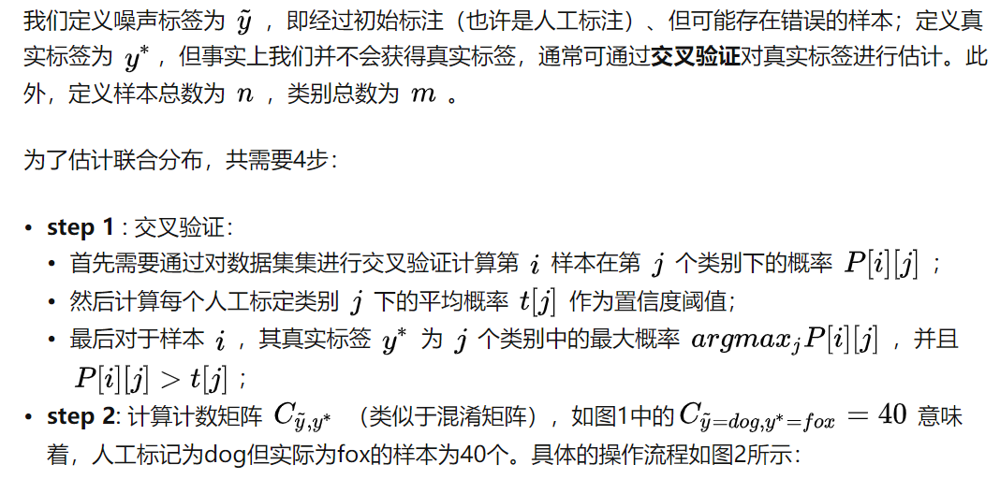

交叉验证：简单方法是训练三个（奇数且数量少）的模型进行投票这样比较硬的方法进行选择错误的数据。这个方法是交叉验证，最后得到一个结果就是图中的概率值，比如5个交叉验证，最后对5个模型的结果求平均值，得到概率，比较的soft。

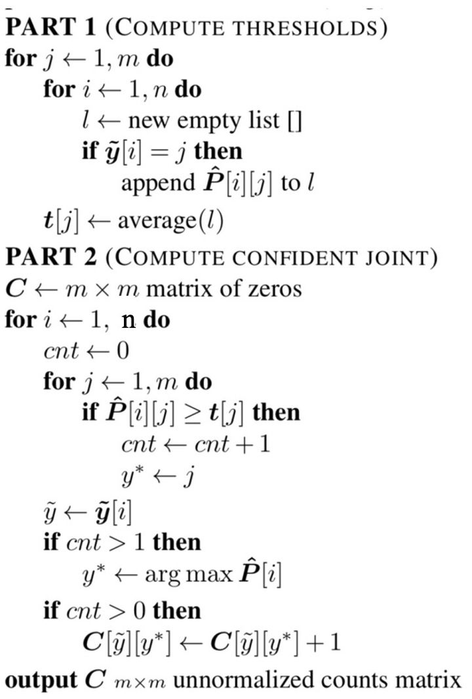

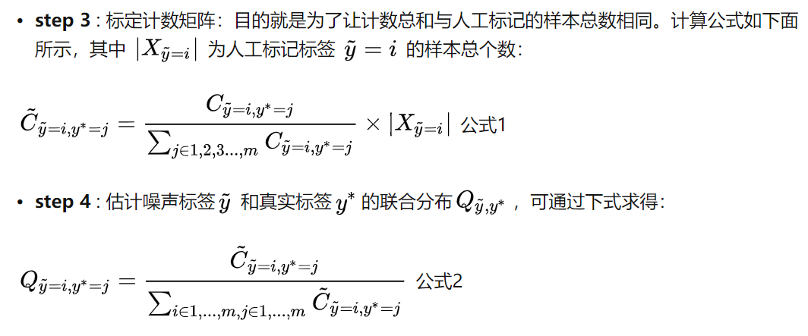

为什么要估计这个联合分布呢？其实这主要是为了下一步方便我们去clean噪声数据。此外，这个联合分布其实能充分反映真实世界中噪声（错误）标签和真实标签的分布，随着数据规模的扩大，这种估计方法与真实分布越接近。

举例说明

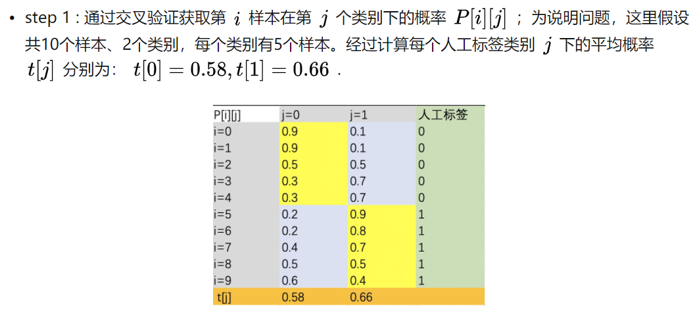

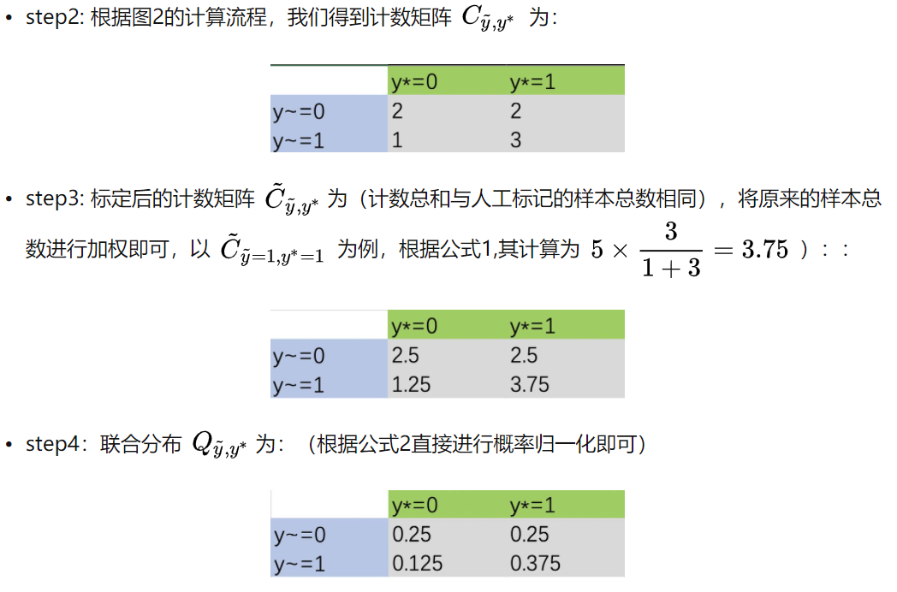

### **3.2 Clean：找出并过滤掉错误样本**

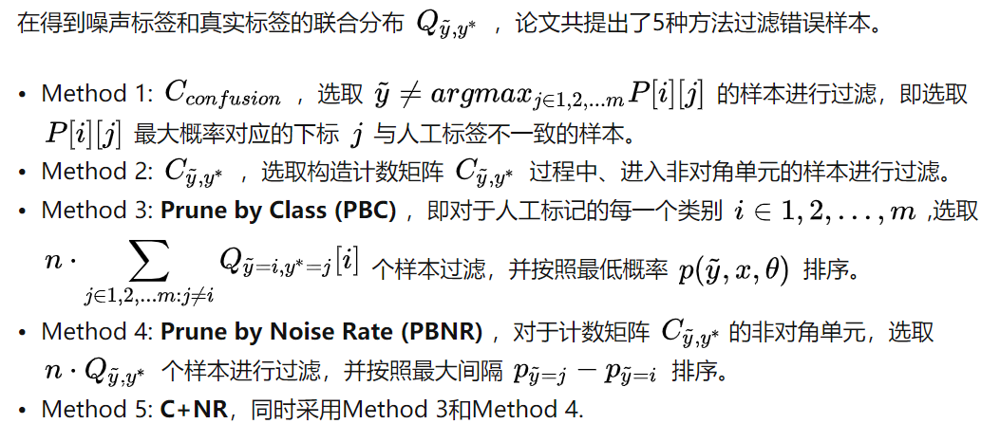

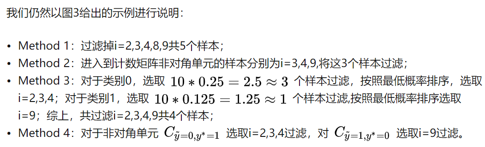

上述这些过滤样本的方法在`cleanlab`也有提供，我们只要提供2个输入、1行code即可clean错误样本：

```python
import cleanlab
# 输入
# s:噪声标签
# psx: n x m 的预测概率概率，通过交叉验证获得
# Method 3：Prune by Class (PBC)
baseline_cl_pbc = cleanlab.pruning.get_noise_indices(s, psx, prune_method='prune_by_class',n_jobs=1)
# Method 4：Prune by Noise Rate (PBNR)
baseline_cl_pbnr = cleanlab.pruning.get_noise_indices(s, psx, prune_method='prune_by_noise_rate',n_jobs=1)
# Method 5：C+NR
baseline_cl_both = cleanlab.pruning.get_noise_indices(s, psx, prune_method='both',n_jobs=1)
```

### **3.3 Re-Training：过滤错误样本后，重新训练**

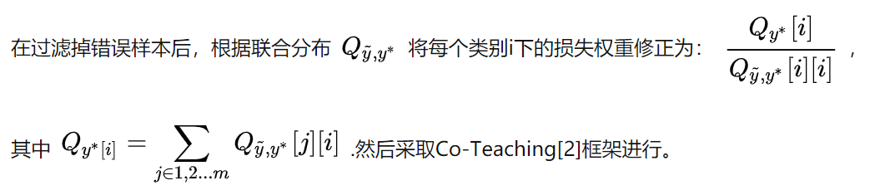

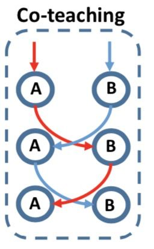

如图6所示，Co-teaching的基本假设是认为noisy label的loss要比clean label的要大，于是它并行地训练了两个神经网络A和B，在每一个Mini-batch训练的过程中，每一个神经网络把它认为loss比较小的样本，送给它其另外一个网络，这样不断进行迭代训练。

## **实验结果**

上面我们介绍完成置信学习的3个步骤，本小节我们来看看这种置信学习框架在实践中效果如何？在正式介绍之前，我们首先对**稀疏率**进行定义：稀疏率为联合分布矩阵、非对角单元中0所占的比率，这意味着真实世界中，总有一些样本不会被轻易错标为某些类别，如「老虎」图片不会被轻易错标为「汽车」。

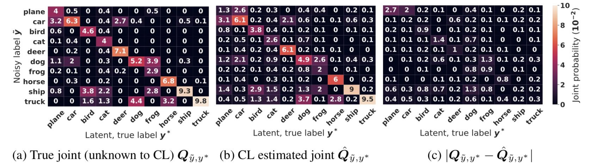

图7给出了CIFAR-10中，噪声率为40%和稀疏率为60%情况下，真实联合分布和估计联合分布之间的比较，可以看出二者之间很接近，可见论文提出的置信学习框架用来估计联合分布的有效性。

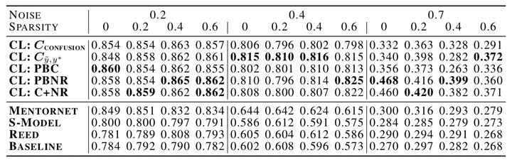

上图给出了CIFAR-10中不同噪声情况和稀疏性情况下，置信学习与其他SOTA方法的比较。例如在40%的噪声率下，置信学习比之前SOTA方法Mentornet的准确率平均提高34%。

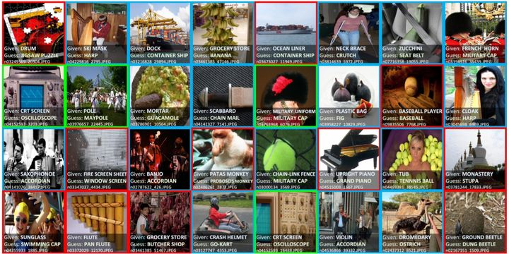

论文还将提出置信学习框架应用于真实世界的ImageNet数据集，利用CL:PBNR找出的TOP32标签问题如图9所示，置信学习除了可以找出标注错误的样本（红色部分），也可以发现多标签问题（蓝色部分，图像可以有多个标签），以及**本体论问题**：绿色部分，包括“是”（比如：将浴缸标记为桶）或 “有”（比如：示波器标记为CRT屏幕）两种关系。

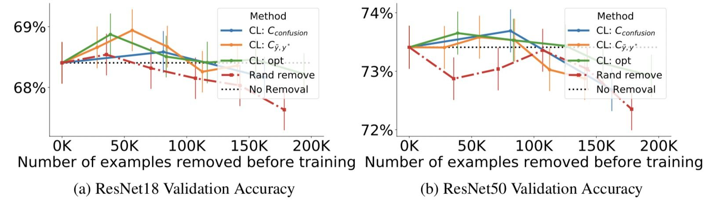

图10给出了分别去除20％，40％…，100％估计错误标注的样本后训练的准确性，最多移除200K个样本。可以看出，当移除小于100K个训练样本时，置信学习框架使得准确率明显提升，并优于随机去除。

## **总结**

- 本文介绍了一种用来刻画noisy label、找出错误标注样本的方法——置信学习，是弱监督学习和带噪学习的一个分支。
- 置信学习直接估计噪声标签和真实标签的联合分布，而不是修复噪声标签或者修改损失权重。
- 置信学习开源包`cleanlab`可以很快速的帮你找出那些错误样本！可在分钟级别之内找出错误标注的样本。

## 参考资料

[标注数据存在错误怎么办？MIT&Google提出用置信学习找出错误标注（附开源实现）](https://zhuanlan.zhihu.com/p/146557232)

- [1] Confident Learning: Estimating Uncertainty in Dataset Labels
- [2]Co-teaching: Robust Training of Deep Neural Networks with Extremely Noisy Labels

