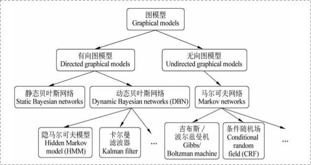
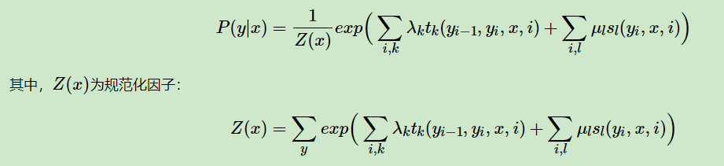
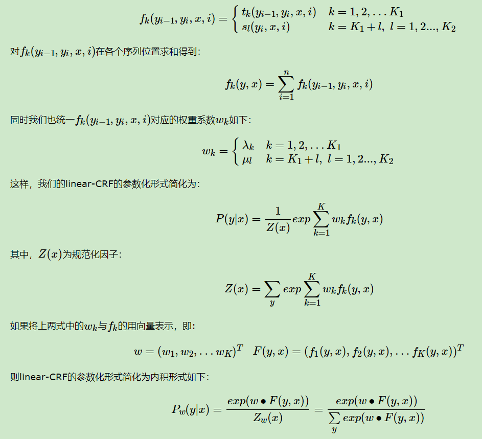
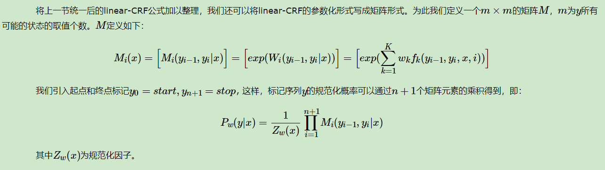

摘要：

## 概率图

贝叶斯网络（信念网络）都是有向的，马尔科夫网络无向。所以，贝叶斯网络适合为有单向依赖的数据建模，马尔科夫网络适合实体之间互相依赖的建模。

## 定义

条件随机场(Conditional Random Fields, 以下简称CRF)是给定一组输入序列条件下另一组输出序列的条件概率分布模型。**考虑相邻数据的标记信息**是普通的分类器难以做到的。而这一块，也是CRF比较擅长的地方。

**随机场是由若干个位置组成的整体，当给每一个位置中按照某种分布随机赋予一个值之后，其全体就叫做随机场。**

**马尔科夫随机场是随机场的特例，它假设随机场中某一个位置的赋值仅仅与和它相邻的位置的赋值有关，和与其不相邻的位置的赋值无关。**

CRF是马尔科夫随机场的特例，它假设马尔科夫随机场中只有X和Y两种变量，X一般是给定的，而Y一般是在给定X的条件下的输出。

**数学语言描述**：设X与Y是随机变量，P(Y|X)是给定X时Y的条件概率分布，若随机变量Y构成的是一个马尔科夫随机场，则称条件概率分布P(Y|X)是条件随机场。

为了建一个条件随机场，我们首先要定义一个**特征函数集**，每个特征函数都以整个句子s，当前位置i，位置i和i-1的标签为输入。然后为每一个特征函数赋予一个**权重**，然后针对每一个标注序列l，对所有的特征函数加权求和，必要的话，可以把求和的值转化为一个概率值。

## linear-CRF

注意在CRF的定义中，我们并没有要求X和Y有相同的结构。而实现中，我们一般都假设X和Y有相同的结构。X和Y有相同的结构的CRF就构成了**线性链条件随机场**(Linear chain Conditional Random Fields,以下简称 linear-CRF)。在十个词的句子的词性标记中，词有十个，词性也是十个，因此，如果假设它是一个马尔科夫随机场，那么它也就是一个linear-CRF。

在linear-CRF中，特征函数分为两类，第一类是定义在Y节点上的节点特征函数$s_l$，这类特征函数只和当前节点有关。第二类是定义在Y上下文的局部特征函数$t_k$，这类特征函数只和当前节点和上一个节点有关。之所以只有上下文相关的局部特征函数，没有不相邻节点之间的特征函数，是因为linear-CRF满足马尔科夫性。

无论是节点特征函数还是局部特征函数，它们的取值只能是0或者1。即满足特征条件或者不满足特征条件。同时，我们可以为每个特征函数赋予一个权值，用以表达我们对这个特征函数的信任度。

linear-CRF的参数化形式如下：

简化形式

假设我们在某一节点我们有K1个局部特征函数和K2个节点特征函数，总共有K=K1+K2个特征函数。我们用一个特征函数fk来统一表示如下:

矩阵形式

linear-CRF的三个基本问题

linear-CRF第一个问题是评估，即给定 linear-CRF的条件概率分布P(y|x), 在给定输入序列x和输出序列y时，计算条件概率P(yi|x)和P(yi−1，yi|x)以及对应的期望. 

linear-CRF第二个问题是学习，即给定训练数据集X和Y，学习linear-CRF的模型参数wk和条件概率Pw(y|x)，这个问题的求解比HMM的学习算法简单的多，普通的梯度下降法，拟牛顿法都可以解决。

linear-CRF第三个问题是解码，即给定 linear-CRF的条件概率分布P(y|x),和输入序列x, 计算使条件概率最大的输出序列y。类似于HMM，使用维特比算法可以很方便的解决这个问题。　

## LSTM+CRF

**CRF有两类特征函数，一类是针对观测序列与状态的对应关系（如“我”一般是“名词”），一类是针对状态间关系（如“动词”后一般跟“名词”）。在LSTM+CRF模型中，前一类特征函数的输出由LSTM的输出替代，后一类特征函数就变成了标签转移矩阵**。

## 参考资料

[如何用简单易懂的例子解释条件随机场（CRF）模型？它和HMM有什么区别？](https://www.zhihu.com/question/35866596)

刘建平笔记

- [条件随机场CRF(一)从随机场到线性链条件随机场](https://www.cnblogs.com/pinard/p/7048333.html)

- [条件随机场CRF(二) 前向后向算法评估标记序列概率](http://www.cnblogs.com/pinard/p/7055072.html)

- [条件随机场CRF(三) 模型学习与维特比算法解码](http://www.cnblogs.com/pinard/p/7068574.html)

[LSTM+CRF 解析（原理篇）](https://zhuanlan.zhihu.com/p/97829287)

