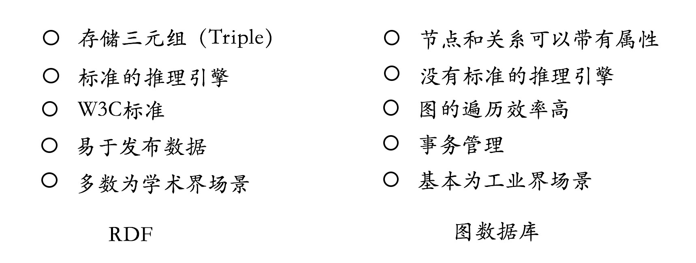
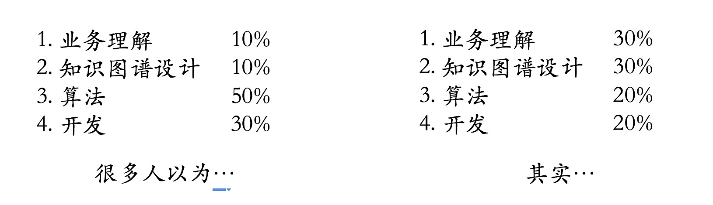
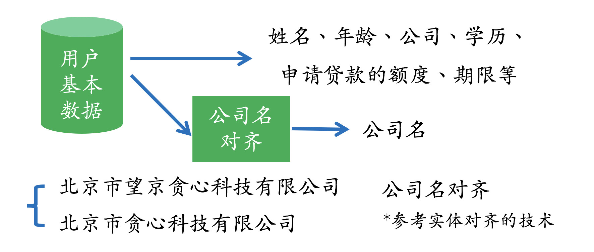
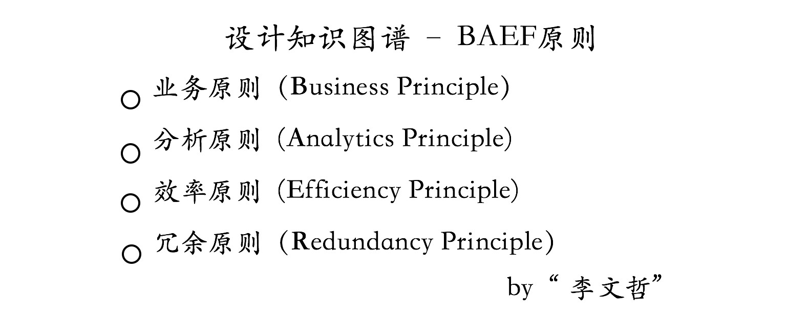
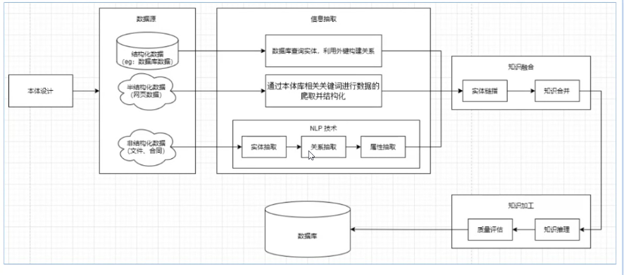

## 概念

知识图谱本质上是语义网络（Semantic Network）的知识库

可以简单地把知识图谱理解成多关系图（Multi-relational Graph）

## 知识图谱的表示

知识图谱应用的前提是已经构建好了知识图谱，也可以把它认为是一个知识库。 

## **知识抽取**

知识图谱的构建是后续应用的基础，而且构建的前提是需要把数据从不同的数据源中抽取出来。对于垂直领域的知识图谱来说，**它们的数据源主要来自两种渠道：一种是业务本身的数据，这部分数据通常包含在公司内的数据库表并以结构化的方式存储；另一种是网络上公开、抓取的数据，这些数据通常是以网页的形式存在所以是非结构化的数据。** 

在构建类似的图谱过程当中，主要涉及以下几个方面的自然语言处理技术：  

> a. 实体命名识别（Name Entity Recognition）    
>
> b. 关系抽取（Relation Extraction）    
>
> c. 实体统一（Entity Resolution）    
>
> d. 指代消解（Coreference Resolution）

实体统一和指代消解问题相对于前两个问题更具有挑战性。 

## **知识图谱的存储**

**知识图谱主要有两种存储方式：一种是基于RDF的存储；另一种是基于图数据库的存储。** 

首先需要说明的一点是，有可能不少人认为搭建一个知识图谱系统的重点在于算法和开发。但事实并不是想象中的那样，**其实最重要的核心在于对业务的理解以及对知识图谱本身的设计**，这就类似于对于一个业务系统，数据库表的设计尤其关键，而且这种设计绝对离不开对业务的深入理解以及对未来业务场景变化的预估。 

## **知识图谱的搭建**

一个完整的知识图谱的构建包含以下几个步骤：**1. 定义具体的业务问题  2. 数据的收集 & 预处理  3. 知识图谱的设计  4. 把数据存入知识图谱  5. 上层应用的开发，以及系统的评估。** 

**1 定义具体的业务问题** 

**2 数据收集 & 预处理** 

1. 我们已经有哪些数据？ 2. 虽然现在没有，但有可能拿到哪些数据？ 3.  其中哪部分数据可以用来降低风险？ 4. 哪部分数据可以用来构建知识图谱？ 

**3 知识图谱的设计** 

图谱的设计是一门艺术，不仅要对业务有很深的理解、也需要对未来业务可能的变化有一定预估，从而设计出最贴近现状并且性能高效的系统。在知识图谱设计的问题上，我们肯定会面临以下几个常见的问题：**1. 需要哪些实体、关系和属性？ 2.  哪些属性可以做为实体，哪些实体可以作为属性？ 3. 哪些信息不需要放在知识图谱中？** 

业务原则（Business Principle），它的含义是 “**一切要从业务逻辑出发，并且通过观察知识图谱的设计也很容易推测其背后业务的逻辑，而且设计时也要想好未来业务可能的变化**”。 

效率原则（Efficiency Principle）。 **效率原则让知识图谱尽量轻量化、并决定哪些数据放在知识图谱，哪些数据不需要放在知识图谱**。 **效率原则的核心在于把知识图谱设计成小而轻的存储载体。** 

**4 把数据存入知识图谱** 

存储上我们要面临存储系统的选择，但由于我们设计的知识图谱带有属性，图数据库可以作为首选。但至于选择哪个图数据库也要看业务量以及对效率的要求。如果数据量特别庞大，则Neo4j很可能满足不了业务的需求，这时候不得不去选择支持准分布式的系统比如OrientDB, JanusGraph等，或者通过效率、冗余原则把信息存放在传统数据库中，从而减少知识图谱所承载的信息量。 通常来讲，对于10亿节点以下规模的图谱来说Neo4j已经足够了。 

**5 上层应用的开发** 

等我们构建好知识图谱之后，接下来就要使用它来解决具体的问题。对于风控知识图谱来说，首要任务就是挖掘关系网络中隐藏的欺诈风险。**从算法的角度来讲，有两种不同的场景：一种是基于规则的；另一种是基于概率的**。鉴于目前AI技术的现状，基于规则的方法论还是在垂直领域的应用中占据主导地位，但随着数据量的增加以及方法论的提升，基于概率的模型也将会逐步带来更大的价值。 

**5.1 基于规则的方法论** 

**不一致性验证**

为了判断关系网络中存在的风险，一种简单的方法就是做不一致性验证，也就是通过一些规则去找出潜在的矛盾点。这些规则是以人为的方式提前定义好的，所以在设计规则这个事情上需要一些业务的知识。

**基于规则提取特征**

我们也可以基于规则从知识图谱中提取一些特征，而且这些特征一般基于深度的搜索比如2度，3度甚至更高维度。比如我们可以问一个这样的问题：“申请人二度关系里有多少个实体触碰了黑名单？”。等这些特征被提取之后，一般可以作为风险模型的输入。在此还是想说明一点，如果特征并不涉及深度的关系，其实传统的关系型数据库则足以满足需求。

**基于模式的判断**

这种方法比较适用于找出团体欺诈，它的核心在于通过一些模式来找到有可能存在风险的团体或者子图（sub-graph），然后对这部分子图做进一步的分析。

再比如，我们也可以从知识图谱中找出强连通图，并把它标记出来，然后做进一步风险分析。强连通图意味着每一个节点都可以通过某种路径达到其他的点，也就说明这些节点之间有很强的关系。 

**5.2 基于概率的方法** 

除了基于规则的方法，也可以使用概率统计的方法。 比如社区挖掘、标签传播、聚类等技术都属于这个范畴。 

相比规则的方法论，基于概率的方法的缺点在于：需要足够多的数据。如果数据量很少，而且整个图谱比较稀疏（Sparse），基于规则的方法可以成为我们的首选。尤其是对于金融领域来说，数据标签会比较少，这也是为什么基于规则的方法论还是更普遍地应用在金融领域中的主要原因。 

**5.3 基于动态网络的分析** 

dynamic network mining 

## **实践上的几点建议**

首先，知识图谱是一个比较新的工具，它的主要作用还是在于分析关系，尤其是深度的关系。所以在业务上，首先要确保它的必要性，其实很多问题可以用非知识图谱的方式来解决。

知识图谱领域一个最重要的话题是知识的推理。 而且知识的推理是走向强人工智能的必经之路。但很遗憾的，目前很多语义网络的角度讨论的推理技术（比如基于深度学习，概率统计）很难在实际的垂直应用中落地。其实目前最有效的方式还是基于一些规则的方法论，除非我们有非常庞大的数据集。

最后，还是要强调一点，**知识图谱工程本身还是业务为重心，以数据为中心。不要低估业务和数据的重要性。**

https://mp.weixin.qq.com/s/j94s-jQjJ11zXSDD_uEcAA

## 知识图谱介绍

本质：一种语义网络，将客观事实和经验沉淀在一个巨大的网络中。

包含内容：实体，概念，语义关系，属性。

本体 VS 实体

- 本体：人
- 实体：张三，小红

## 知识图谱的应用场景

业务应用场景

- 图结构消费场景
  - 图数据搜索
  - 路径分析
  - 关联分析
  - 图谱可视化
- 语义消费场景
  - 智能搜索，例如姚明的女儿是谁
  - 智能客服
  - 语义标注，例如远程监督标注数据。
  - 知识推理

数据场景

- 

从知识图谱的产品形式来说

- 基于百科和常识的通用型知识图谱
  - 特点：数据庞大
  - 问题：构建难
  - 例子：谷歌，百度等
- 基于垂直领域的知识图谱
  - 特点：针对具体的业务
  - 问题：具有一定的边界
  - 例子：金融、法律、医疗等
  - 应用介绍
    - 可以在营销方面做客户挖掘、需求挖掘
    - 在风控方面做反欺诈、反洗钱、内控等
    - 在预测应用方面可以预测行业风险等
- 知识图谱组件
  - 特点：围绕知识图谱的构建一些相关组件产品
  - 例子：本体编辑器，关系抽取器，垂直搜索等
  - 行业：大观数据
- 知识标准化
  - 知识图谱构建过程标准化、流程化、自动化
  - 落地难

## 如何构建知识图谱

### 知识图谱的逻辑架构

模式层（本体库构建）

- 特点：知识图谱的核心，是构建在数据层之上，定义通用概念为实体，实体间的关系
- 举例：实体-关系-实体，实体-属性-性值

数据层

### 构建流程

### 信息抽取

抽取实体、关系、属性等

方法路线

- pipeline信息抽取
  - 命名实体识别
  - 关系抽取
  - 属性抽取
  - 优点：独立数据集，不需要同时标注
  - 缺点：误差积累，实体冗余，交互缺失
- 实体关系联合抽取

### 知识融合

任务

- 新知识的融合
- 整合
- 判别同义
- 近义
- 消除歧义
- 矛盾

实体链接

- 实体消歧
- 共指消解

### 知识加工

## 知识图谱数据集

## 图数据库

Neo4j

Nebula

思知知识图谱，他有提供免费的开放知识图谱接口

