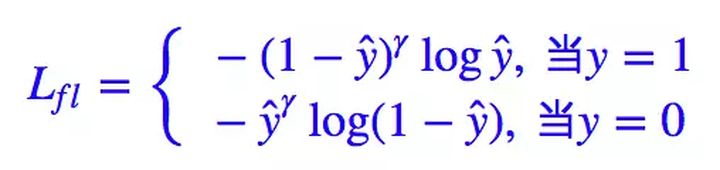

## Focal Loss

Focal Loss 是 Kaiming He 和 RBG 在 2017 年的 "Focal Loss for Dense Object Detection" 论文中所提出的一种新的 Loss Function，Focal Loss 主要是为了解决样本类别不均衡问题（也有人说实际上也是解决了 gradient 被 easy example dominant 的问题）。

### 普通的Cross Entropy


**「他不会划重点，对所有知识点 “一视同仁”」。**

### 改进一

每个【科目】的难度是不同的；你要花 30%的精力在四则运算，70%的精力在三角函数。

对应到公式中，就是针对每个类别赋予不同的权重：

$CE(p_t)=-a_tlog(p_t)$

$a_t$是平衡因子

### 改进二

每道【题目】的难度是不同的；你要根据以往刷类似题时候的正确率来合理分配精力。

CE中的pt反映了模型对这个样本的识别能力（即这个知识点掌握得有多好）；显然，对于pt越大的样本，我们越要打压它对loss的贡献。

因此得到Focal Loss

$FL(p_t)=-(1-p_t)^rlog(p_t)$

这里有个超参数gamma，直观来看，gamma越大，打压越重：


- 横轴是pt，纵轴是FL(pt)。

- 总体来说，所有曲线都是单调下降的，即 “掌握越好的知识点越省力”
- 当gamma=0时，FL退化成CE，即蓝色线条
- 当gamma很大时，线条逐步压低到绿色位置，即各样本对于总loss的贡献受到打压；中间靠右区段承压尤其明显

在log前面加上$(1-p_t)$是focal loss的核心。假设r设置为2。当$p_t$为0.9，说明网络已经将这个样本分的很好了，那么$(1-p_t)^2$为0.01，呈指数级降低了这个样本对损失函数的贡献。当$p_t$为0.1，说明网络对样本还不具有很好地分类能力，那么$(1-p_t)^2$为0.81。 简单言之，focal加大了对难分类样本的关注。

### 综合上述两者

$FL(p_t)=-\alpha_t(1-p_t)^rlog(p_t)$




### 代码

**基于keras的实现**

```python
from keras import backend as K

def focal_loss(alpha=0.75, gamma=2.0):
    """ 参考 https://blog.csdn.net/u011583927/article/details/90716942 """
    def focal_loss_fixed(y_true, y_pred):
        # y_true 是个一阶向量, 下式按照加号分为左右两部分
        # 注意到 y_true的取值只能是 0或者1 (假设二分类问题)，可以视为“掩码”
        # 加号左边的 y_true*alpha 表示将 y_true中等于1的槽位置为标量 alpha
        # 加号右边的 (ones-y_true)*(1-alpha) 则是将等于0的槽位置为 1-alpha
        ones = K.ones_like(y_true)
        alpha_t = y_true*alpha + (ones-y_true)*(1-alpha)

        # 类似上面，y_true仍然视为 0/1 掩码
        # 第1部分 `y_true*y_pred` 表示 将 y_true中为1的槽位置为 y_pred对应槽位的值
        # 第2部分 `(ones-y_true)*(ones-y_pred)` 表示 将 y_true中为0的槽位置为 (1-y_pred)对应槽位的值
        # 第3部分 K.epsilon() 避免后面 log(0) 溢出
        p_t = y_true*y_pred + (ones-y_true)*(ones-y_pred) + K.epsilon()

        # 就是公式的字面意思
        focal_loss = -alpha_t * K.pow((ones-p_t),gamma) * K.log(p_t)
    return focal_loss_fixed

model = ...
model.compile(..., loss=focal_loss(gamma=3, alpha=0.5))
```

**基于pytorch的实现**


```python
import torch
import torch.nn as nn
import torch.nn.functional as F

# 针对二分类任务的 Focal Loss
class FocalLoss(nn.Module):
    def __init__(self, alpha=0.25, gamma=2, size_average=True):
        super(FocalLoss, self).__init__()
        self.alpha = torch.tensor(alpha).cuda()
        self.gamma = gamma
        self.size_average = size_average

    def forward(self, pred, target):
        # 如果模型最后没有 nn.Sigmoid()，那么这里就需要对预测结果计算一次 Sigmoid 操作
        # pred = nn.Sigmoid()(pred)

        # 展开 pred 和 target,此时 pred.size = target.size = (BatchSize,1) 
        pred = pred.view(-1,1)
        target = target.view(-1,1)

        # 此处将预测样本为正负的概率都计算出来，此时 pred.size = (BatchSize,2)
        pred = torch.cat((1-pred,pred),dim=1)

        # 根据 target 生成 mask，即根据 ground truth 选择所需概率
        # 用大白话讲就是：
        # 当标签为 1 时，我们就将模型预测该样本为正类的概率代入公式中进行计算
        # 当标签为 0 时，我们就将模型预测该样本为负类的概率代入公式中进行计算
        class_mask = torch.zeros(pred.shape[0],pred.shape[1]).cuda()
        # 这里的 scatter_ 操作不常用，其函数原型为:
        # scatter_(dim,index,src)->Tensor
        # Writes all values from the tensor src into self at the indices specified in the index tensor. 
        # For each value in src, its output index is specified by its index in src for dimension != dim and by the corresponding value in index for dimension = dim.
        class_mask.scatter_(1, target.view(-1, 1).long(), 1.)

        # 利用 mask 将所需概率值挑选出来
        probs = (pred * class_mask).sum(dim=1).view(-1,1)
        probs = probs.clamp(min=0.0001,max=1.0)

        # 计算概率的 log 值
        log_p = probs.log()

        # 根据论文中所述，对 alpha　进行设置（该参数用于调整正负样本数量不均衡带来的问题）
        alpha = torch.ones(pred.shape[0],pred.shape[1]).cuda()
        alpha[:,0] = alpha[:,0] * (1-self.alpha)
        alpha[:,1] = alpha[:,1] * self.alpha
        alpha = (alpha * class_mask).sum(dim=1).view(-1,1)

        # 根据 Focal Loss 的公式计算 Loss
        batch_loss = -alpha*(torch.pow((1-probs), self.gamma))*log_p

         # Loss Function的常规操作，mean 与 sum 的区别不大，相当于学习率设置不一样而已
        if self.size_average:
            loss = batch_loss.mean()
        else:
            loss = batch_loss.sum()

        return loss

# 针对 Multi-Label 任务的 Focal Loss
class FocalLoss_MultiLabel(nn.Module):
    def __init__(self, alpha=0.25, gamma=2, size_average=True):
        super(FocalLoss_MultiLabel, self).__init__()
        self.alpha = alpha
        self.gamma = gamma
        self.size_average = size_average

    def forward(self, pred, target):
        criterion = FocalLoss(self.alpha,self.gamma,self.size_average)
        loss = torch.zeros(1,target.shape[1]).cuda()

        # 对每个 Label 计算一次 Focal Loss
        for label in range(target.shape[1]):
            batch_loss = criterion(pred[:,label],target[:,label])
            loss[0,label] = batch_loss.mean()

        # Loss Function的常规操作
        if self.size_average:
            loss = loss.mean()
        else:
            loss = loss.sum()

        return loss
```


针对多分类任务的CELoss 和 Focal Loss，可通过 use_alpha 参数决定是否使用 α 参数，并解决之前版本中所出现的 Loss变为 nan 的 bug（原因出自 log 操作，当对过小的数值进行 log 操作，返回值将变为 nan）。

```python
# 针对多分类任务的 CELoss 和　Focal Loss
import torch
import torch.nn as nn
import torch.nn.functional as F

class CELoss(nn.Module):
    def __init__(self, class_num, alpha=None, use_alpha=False, size_average=True):
        super(CELoss, self).__init__()
        self.class_num = class_num
        self.alpha = alpha
        if use_alpha:
            self.alpha = torch.tensor(alpha).cuda()

        self.softmax = nn.Softmax(dim=1)
        self.use_alpha = use_alpha
        self.size_average = size_average

    def forward(self, pred, target):
        prob = self.softmax(pred.view(-1,self.class_num))
        prob = prob.clamp(min=0.0001,max=1.0)

        target_ = torch.zeros(target.size(0),self.class_num).cuda()
        target_.scatter_(1, target.view(-1, 1).long(), 1.)

        if self.use_alpha:
            batch_loss = - self.alpha.double() * prob.log().double() * target_.double()
        else:
            batch_loss = - prob.log().double() * target_.double()

        batch_loss = batch_loss.sum(dim=1)

        # print(prob[0],target[0],target_[0],batch_loss[0])
        # print('--')

        if self.size_average:
            loss = batch_loss.mean()
        else:
            loss = batch_loss.sum()

        return loss

class FocalLoss(nn.Module):
    def __init__(self, class_num, alpha=None, gamma=2, use_alpha=False, size_average=True):
        super(FocalLoss, self).__init__()
        self.class_num = class_num
        self.alpha = alpha
        self.gamma = gamma
        if use_alpha:
            self.alpha = torch.tensor(alpha).cuda()

        self.softmax = nn.Softmax(dim=1)
        self.use_alpha = use_alpha
        self.size_average = size_average

    def forward(self, pred, target):
        prob = self.softmax(pred.view(-1,self.class_num))
        prob = prob.clamp(min=0.0001,max=1.0)

        target_ = torch.zeros(target.size(0),self.class_num).cuda()
        target_.scatter_(1, target.view(-1, 1).long(), 1.)

        if self.use_alpha:
            batch_loss = - self.alpha.double() * torch.pow(1-prob,self.gamma).double() * prob.log().double() * target_.double()
        else:
            batch_loss = - torch.pow(1-prob,self.gamma).double() * prob.log().double() * target_.double()

        batch_loss = batch_loss.sum(dim=1)

        if self.size_average:
            loss = batch_loss.mean()
        else:
            loss = batch_loss.sum()

        return loss
```

### 调参经验


## 参考资料

1. [[日常] 关于 Focal Loss（附实现代码）](https://zhuanlan.zhihu.com/p/75542467)（源码详解）
2. [详解Focal Loss以及PyTorch代码](https://blog.csdn.net/qq_34914551/article/details/105393989)
3. [何恺明大神的「Focal Loss」，如何更好地理解？](https://zhuanlan.zhihu.com/p/32423092)（苏剑林从自己构思的一个loss出发理解focal loss）
4. https://www.kaggle.com/thedrcat/focal-multilabel-loss-in-pytorch-explained/log
5. [Focal Loss --- 从直觉到实现](https://mp.weixin.qq.com/s/ndD-1b3tZBgZXSUoQpYXPg)
