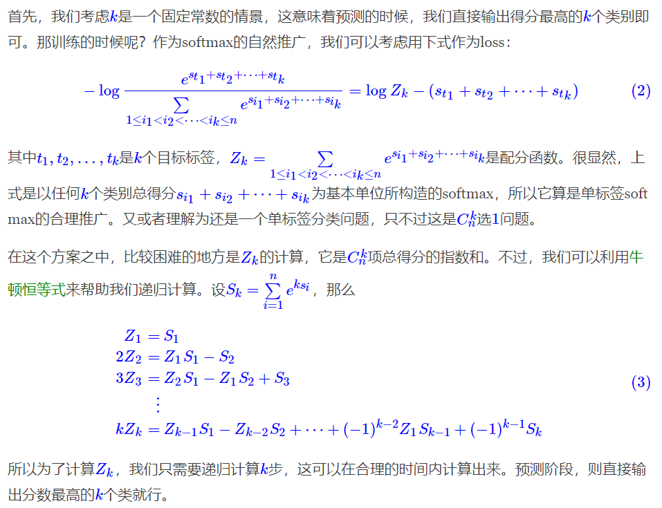
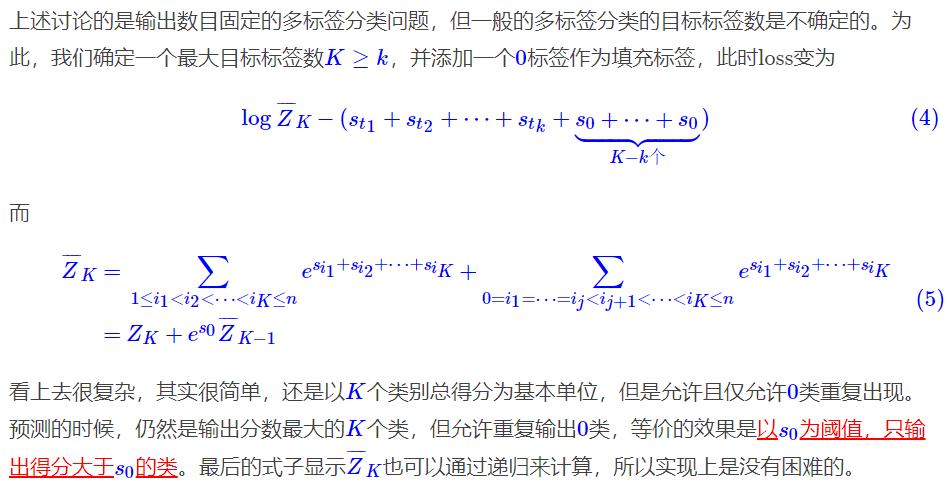
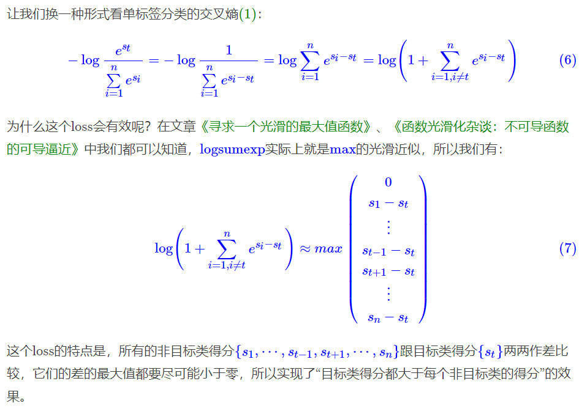
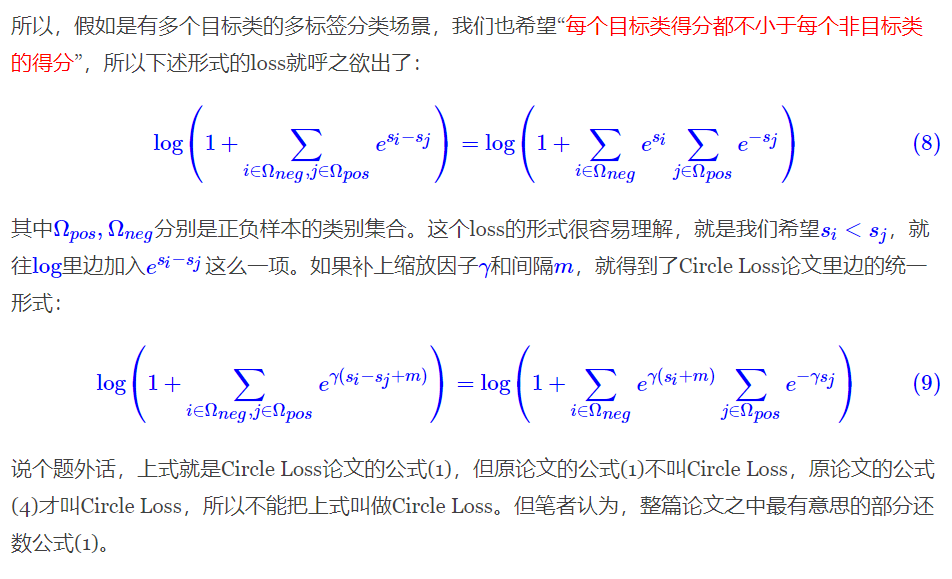
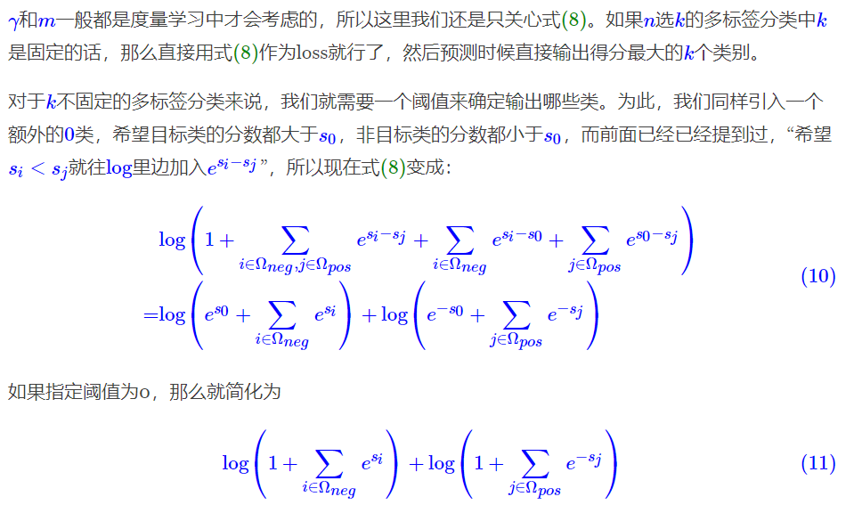

 #td 

## softmax+交叉熵的多标签分类版本

一般来说，多分类问题指的就是单标签分类问题，即从n个候选类别中选1个目标类别。loss一般是softmax+交叉熵

多标签分类问题，即从n个候选类别中选k个目标类别。这种情况下我们一种朴素的做法是用sigmoid激活，然后变成n个二分类问题，用二分类的交叉熵之和作为loss。

显然，当n≫kn≫k时，这种做法会面临着严重的类别不均衡问题，这时候需要一些平衡策略，比如手动调整正负样本的权重、[focal loss](https://kexue.fm/archives/4733)等。训练完成之后，还需要根据验证集来进一步确定最优的阈值。

构建组合形式的softmax来作为单标签softmax的推广。在这部分内容中，我们会先假设k是一个固定的常数，然后再讨论一般情况下k的自动确定方案，最后确实能得到一种有效的推广形式。

组合softmax



自动确定阈值



### 统一的loss形式(看这段就行了)

[Circle Loss](https://arxiv.org/abs/2002.10857)





用于多标签分类



这便是我们最终得到的Loss形式了——“softmax + 交叉熵”在多标签分类任务中的自然、简明的推广，它没有类别不均衡现象，因为它不是将多标签分类变成多个二分类问题，而是变成目标类别得分与非目标类别得分的两两比较，并且借助于logsumexp的良好性质，自动平衡了每一项的权重。

Keras下的参考实现

```python
def multilabel_categorical_crossentropy(y_true, y_pred):
    """多标签分类的交叉熵
    说明：y_true和y_pred的shape一致，y_true的元素非0即1，
         1表示对应的类为目标类，0表示对应的类为非目标类。
    警告：请保证y_pred的值域是全体实数，换言之一般情况下y_pred
         不用加激活函数，尤其是不能加sigmoid或者softmax！预测
         阶段则输出y_pred大于0的类。如有疑问，请仔细阅读并理解
         本文。
    """
    y_pred = (1 - 2 * y_true) * y_pred
    y_pred_neg = y_pred - y_true * 1e12
    y_pred_pos = y_pred - (1 - y_true) * 1e12
    zeros = K.zeros_like(y_pred[..., :1])
    y_pred_neg = K.concatenate([y_pred_neg, zeros], axis=-1)
    y_pred_pos = K.concatenate([y_pred_pos, zeros], axis=-1)
    neg_loss = K.logsumexp(y_pred_neg, axis=-1)
    pos_loss = K.logsumexp(y_pred_pos, axis=-1)
    return neg_loss + pos_loss
```

要提示的是，除了标准的多标签分类问题外，还有一些常见的任务形式也可以认为是多标签分类，比如基于0/1标注的序列标注，典型的例子是[“半指针-半标注”标注设计](https://kexue.fm/archives/6671)。因此，从这个角度看，能被视为多标签分类来测试式(11)的任务就有很多了，苏神也在之前的三元组抽取例子[task_relation_extraction.py](https://github.com/bojone/bert4keras/blob/master/examples/task_relation_extraction.py)中尝试了(11)，最终能取得跟[这里](https://kexue.fm/archives/7161#类别失衡)一致的效果。

当然，最后还是要说明一下，虽然理论上式(11)作为多标签分类的损失函数能自动地解决很多问题，但终究是不存在绝对完美、保证有提升的方案，所以当你用它替换掉你原来多标签分类方案时，也不能保证一定会有提升，尤其是当你原来已经通过精调权重等方式处理好类别不平衡问题的情况下，式(11)的收益是非常有限的。毕竟式(11)的初衷，只是让我们在不需要过多调参的的情况下达到大部分的效果。

## 参考资料

7. [将“softmax+交叉熵”推广到多标签分类问题](https://kexue.fm/archives/7359)
