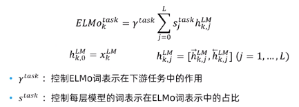

## 文本分类

**示例**：垃圾邮件过滤、影评情感分类(好评差评)、新闻主题分类(政治、体育、财经、娱乐)、作者判别、体裁识别、作品打分

### 文本表示

- 词(及其他符号)的序列
  - 需要使用序列模型进行处理
- 稀疏特征向量
  - 可用于大多数分类算法
  - 词袋(Bag of Words, BOW)
  - 常见的方法
    - 词频(term frequency)
    - 词存在(term presence)
    - 词频的变换，例如倒排文档频度(inverse document frequency, idf)
- 稠密特征向量
  - 由词嵌入计算得到
  - 例如：对句中词汇的词向量取平均，或对这些词向量跑LSTM

### 文本分类方法

- 生成式模型(建模p(x, y))(generative)
  - 朴素贝叶斯(Naive Bayes)
- 判别式模型(建模p(y|x))(discriminative)
  - 逻辑回归(logistic regression)
  - 支持向量机(support vector machines)
  - 神经网络(neural networks)
  - 决策树(decision tree)

### 评价指标

- 测试数据 Test Data：一组独立于训练数据，用作分类性能评价的数据。

- 准确率 Accuracy：分类正确的数据量/所有数据量
  - 存在的问题
    - 类别不均衡
    - 无法考虑类别简的相对重要性与不同误差的代价
    - 测试数据本身的随机性

- 精度与召回，假设目标类别为t
  - 精度(Precision)：分类器正确归类为t的数量/分类器归类为t的数量
  - 召回(Recall)：分类器正确归类为t的数量/实际类别为t的数量
  - F1 = 2 * P * R / (P + R)
  - 宏平均 Macroaveraging：计算分类器在每一类上的精度/召回，然后取平均
  - 微平均 Microaveraging：把分类器在各类别上的统计求和，然后计算精度/召回

## 词嵌入

### 词的表示——离散符号

- 在传统的自然语言处理中，我们把词视为离散的符号
- 词可以用独热编码（one-hot）向量表示
- q缺陷：向量相互正交，无法有效地表示词之间的相似性

### 词的表示——同义词词典

使用同义词词典来给出词之间的相似性，例如WordNet

缺陷：

- 制作和更新同义词词典的工作量庞大
- 部分词和词组不包含在词典中
- 同义词词典对于形容词和动词效果不好

### 词向量

向量表示

- 在向量空间里表示每一个词
- 意思相似的词用相似的向量表示
- 也被称为词嵌入(Word Embeddings)

稀疏向量表示

- 词共现矩阵(Word Co-occurrence Matrix)

稠密向量表示

- 奇异值分解
- 受神经网络启发的模型
  - Skip-grams
  - CBOW
- ELMO和BERT

**神经网络词嵌入的优点**

短的稠密向量

- 短的向量更便于机器学习使用，原因：需要学习的参数更少
- 稠密向量具有更好的泛化能力

利用监督信号

- 可以通过一些有监督任务的学习包含更丰富的含义
- 例如：情感无法从仅使用无监督学习的词嵌入中获取，但是可以从神经网络词嵌入中获取。

### Word2vec

Word2vec(Mikolov et al. 2013)是一种学习词嵌入的框架

基本思想

- 利用大量的文本语料
- 每一个词汇表中的词被表示为一个向量
- 在遍历文本的过程中，每一个当前位置上的词称为中心词，中心词周围的词称为上下文词
- 利用中心词和上下文词的相似性，计算中心词在给定上下文词后(或者相反)的概率
- 不断更新词向量使得上述概率最大化

**Skip-grams算法**

- 根据中心词预测周围窗口范围内的上下文词

- 目标函数：对于每一个位置t=1, 2, ..., T, 根据中心词$W_t$ 预测在窗口大小为m的上下文词
- 每一个词w用两个向量表示
  - 当词w作为中心词时用$v_w$表示
  - 当词w作为上下文词时用$u_w$表示
- 预测函数是一个softmax函数
- softmax函数把任意的$x_i$映射到一个概率分布p
  - max：放大最大值$x_i$的概率
  - soft：仍然会为小的$x_i$保留一定概率
- 在深度学习中常用

**最优化(Optimization)——梯度下降**

我们希望使损失函数(Cost Function) 尽可能小

梯度下降(Gradient Descent)是一种可以最小化损失函数的算法

基本过程：

- 对于当前的$\theta$，计算$J(\theta)$的梯度
- 把$\theta$沿负梯度方向更新一小步，$\theta=\theta-\alpha * 梯度$
- 不断重复以上过程

缺陷

- 我们需要对于文本中的所有窗口进行优化
- 更新一步就需要很长的时间

随即梯度下降(stochastic gradient descent)可以加速优化过程

- 不断采样窗口
- 用每一次采样得到的窗口进行更新

**问题**

Softmax中的归一化因子计算量太大

负采样

- 在Word2vec的实现中加入了负采样(negative sampling)来减少计算量
- 基本思想：针对一对正样本(中心词c+上下文词o)和多对负样本(中心词c+一个随机词)训练一个二元逻辑回归
- 使用了负采样的损失函数
- 我们选取了k个负样本(根据词出现的概率)
- 最大化真实出现在窗口中的词的概率，最小化选取的负样本的概率
  - $P(w)=U(w)^{3/4}/Z$
  - 词的出现频率分布的3/4次方
  - 3/4次方使得出现频率较低的词能够更频繁地被采样到

**词嵌入u和v**

- 对于每一个词$W_j$，我们有两个词嵌入$u_j$和$v_j$
- 我们可以用以下一种方式来使用词嵌入
  - 直接使用$v_j$
  - 将$u_j$和$v_j$相加
  - 把$u_j$和$v_j$拼接在一起获得一个双倍长度的词嵌入

**CBOW算法**

连续词袋算法(Continuous Bag of Words)

算法对比

- Skip-grams，根据中心词预测周围的词
- CBOW，根据周围的词预测中心词

### 评测词嵌入

- 内部任务评测(Intrinsic)和外部任务评测(Extrinsic)
- 内部任务评测
  - 用一个针对词嵌入的特定任务进行评测
  - 能够快速完成
  - 有助于对词嵌入特性的理解
  - 除非能和实际任务建立明确的联系，否则不能确定是否真的有用
  - 比如词嵌入类比，根据词嵌入加减后与另一个词嵌入之间的余弦距离是否符合直观的语义关系来评价词嵌入的好坏。男人：女人：：国王：？
- 外部任务评测
  - 在真实任务上进行评测
  - 需要较长时间获得结果
  - 如果效果不好，不能确定是否是因为词嵌入本身，还是因为词嵌入的使用方式
  - 如果用一套词嵌入替换另一套词嵌入可以提升整体性能，则替换后的词嵌入更有效

## 语言模型

### 概率语言模型

目标：计算一个句子（一串单词组成的序列）的概率

应用

- 在机器翻译里面，遴选更常见的词汇组合（根据概率大小）
- 应用于句子的拼写纠错（根据正确/错误组合的概率大小）
- 帮助语音识别（根据相似发音的组合的概率大小）
- 搜索引擎、输入法的词语提示（根据组合的概率大小）

方法

设计语言模型

- 最简单的概率语言模型设计
  - 直接统计这个句子在语料库里出现的概率
- 这种简单语言模型并不实用
  - 语句可能并没有出现于语料库中
  - 可能的句子太多了，语料库永远也无法涵盖所有合法的句子
- N-gram语言模型
  - 应用链式法则。每个单词出现的概率基于它之前的N-1个单词
- RNN语言模型
  - 使用循环神经网络，每个单词出现的概率基于神经网络根据之前所有单词所生成的隐向量
- 其他语言模型
  - 基于句法解析...

#### N-gram

**概率中的链式法则**

$P(x_1, x_2, ..., x_m) = \prod_i P(x_i|x_1, ..., x_{i-1})$

将链式法则用于语言模型。

**参数学习**

如何从数据中估计P(transparent | its water is so)

直接统计出现次数并归一化

但是可能的组合太多，语料库无法涵盖所有组合

**马尔科夫假设**

$P(x_i|x_1, ..., x_{i-1}) \sim P(x_i|x_{i-k}, ..., x_{i-1})$

按照马尔科夫假设，我们可以将P(transparent | its water is so)近似为P(transparent |is so)，或者P(transparent |so)，甚至是P(transparent)

n-gram模型

$P(x_1, x_2, ..., x_m) = \prod_i P(x_i|x_{n-1}, ..., x_{i-1})$

Unigram模型

- 最简单的n-gram模型是Unigram模型，即n=1
- 每个单词出现的概率是独立的
- 不考虑单词间的顺序关系(词袋模型，Bag-of-Words)

Bigram模型

- 每个单词的出现仅依赖于上一个单词，即n=2
- 以此类推，可以构建trigram, 4-gram, 5-gram模型等
- N-gram模型所做的马尔科夫假设忽视了语言中的长程依赖,但实用效果不错

**最大似然估计(MLE)**

似然度：训练数据在给定参数下的概率

最大化似然度 = 直接统计出现次数并归一化

$P(x_i|x_{i-1}) = \frac {count(x_i, x_{i-1})}{count(x_{i-1})}$

$P(x_i) = \frac {count(x_i)}{\#word}$

**MLE的问题**

数据稀疏：n较大时，绝大部分n-gram都是没有被观测到的，即便它们是合乎语法的

1.平滑方法(Smoothing)

最简单的方法：在归一化前，对每个计数加上一个很小的值$\lambda > 0$

扩展

- 最有效的方法：Modified Kneser-Ney (Chen and Goodman, 1998)
- 当不关心困惑度时：Stupid Backoff (Brants et al., 2007)

2.插值法(Interpolation)

设p, q各为一个语言模型，那么插值：$\alpha p + (1-\alpha) q, \alpha \in [0, 1]$

n-gram面临数据稀疏，所以使用(n-1)-gram, (n-2)-gram等进行插值：

$\hat P(x_i|x_{i-1}, x_{i-2}) = \alpha_1P(x_i|x_{i-1}, x_{i-2}) +  \alpha_2P(x_i|x_{i-1}) +  \alpha_3P(x_i)$

$(\alpha_1+\alpha_2+\alpha_3 = 1)$

超参数（如$\alpha$）的选择问题

- 把数据分为不相交的训练集、验证集、测试集
- 对每一组超参数取值
  - 在训练集上估算模型参数(n-gram的条件概率)
  - 在验证集上评价模型(困惑度)
- 选取验证集上表现最好的超参数取值

Google n-gram viewer

https://books.google.com/ngrams#

#### 循环神经网络

循环神经网络(Recurrent neural network, 简称RNN)是一类处理序列数据的神经网络

核心思想：每一时刻重复使用权重矩阵

**RNN语言模型**

词/独热编码向量$x^t \in R^{|V|}$

词嵌入：$e^t = Ex^t$

隐状态：$h^t=\sigma (W_hh^{t-1}+W_ee^t+b_1), h^0$是初始隐状态

输出分布：$\hat y^t=softmax(Uh^t+b_2) \in R^{|V|}$

优点

- RNN语言模型不再是一个n-gram（马尔可夫）模型，每一步的预测都基于之前所有的历史信息

- 模型大小比较适中，比典型的n-gram模型要小

训练

- 最大似然估计(Maxinum Likelihood Estimation)
- 第t步的损失函数是预测的概率分布$\hat y^t$和真实的第t+1个词$y^t$(即$x_{t+1}$独热编码)之间的交叉熵(Cross Entropy)
- 对每一步的损失函数求平均得到总的损失函数
- 优化方法：随机梯度下降(SGD)

**梯度消失**

当梯度回传路径越来越长，梯度变得越来越小

由于距离比较近的梯度信号数值比较大，距离比较远的梯度信号被忽略。模型参数的更新可能基本只受近距离依赖关系影响，而不考虑长距离依赖。

语言模型任务：The writer of the books _

正确答案：The writer of the books is here

句法近因(systactic recency)：The **writer** of the books is

顺序近因(sequential recency)：The writer of the **books** are

因为梯度消失问题的存在，RNN语言模型更容易学习到顺序近因，导致上述错误的出现。[Linzen et al, 2016]

**梯度爆炸**

梯度爆炸(gradient exploding)会导致更新过大，可能会导致参数到达一个非常差的区域(损失函数非常大)

在最差的情况下，可能会导致网络参数更新时出现inf或者NaN

梯度截断(Gradient clipping)是梯度爆炸的一种解决方法

- 如果计算得到的梯度的模长大于设定的阈值时，将梯度按比例收缩，使梯度模长小于阈值，然后进行梯度更新
- 直观解释：收缩后的梯度与原梯度方向一致，区别是步长更小

#### 长短期记忆网络(Long Short-Term Memory)

长短期记忆网络(LSTM)是一种Hochreiter和Schmidhuber在1997年提出的用于解决梯度消失的循环神经网络

在第t步，网络有一个隐状态(hiddent state)和一个单元状态(cell state)

- 两个状态都是长度为n的向量
- 单元(cell)中储存长期信息
- LSTM可以对单元中的信息进行消除、读取、写入操作

信息的消/读/写用三个对应的门控(gate)来控制

- 门控也是长度为n的向量
- 在每一步中，门控的元素可以是打开（1），关闭（0）或者处于两者之间
- 门控是动态改变的：它们的值是根据当前上下文计算得到的

我们有一个序列输入$x^t$，然后我们计算隐状态$h^t$和单元状态$c^t$的序列

第t步的计算公式：

遗忘门控：控制上一个单元状态中信息的保留和遗忘

$f^t = \sigma(W_fh^{t-1}+ U_fx^t + b_f)$

输入门控：控制新计算的单元内容哪一部分被写入单元状态

$i^t = \sigma(W_ih^{t-1}+ U_ix^t + b_i)$

输出门控：控制单元状态哪一部分被输出到隐状态中

$o^t = \sigma(W_oh^{t-1}+ U_ox^t + b_o)$

新单元内容：新计算得到的单元状态

$\tilde c^t=tanh(W_ch^{t-1}+U_cx^t+b_c)$

单元状态：遗忘上一个单元状态的一部分内容，输入一部分新单元内容（门控使用时按元素相乘）

$c^t= f^t · c^{t-1} + i^t ·\tilde c^t$

隐状态：从单元状态中输出一部分内容

$h^t= o^t·tanh\ c^t$

上述输出均为长度为n的向量

LSTM的结构使得循环神经网络能够更容易保存多步之前的信息

- 例如，如果遗忘门控被设置为每一步都记忆所有内容，则所有在单元中的信息都会被一直保存
- 普通的循环神经网络很难学习到一个可以保存隐状态中所有信息的权重矩阵$W_h$

LSTM不保证一定不会出现梯度爆炸或者梯度消失，但是它能让模型更容易学习长距离的依赖关系

 #### 门控循环单元(Gated Recurrent Units)

门控循环单元(GRU)是(Cho et al., 2014)提出的一种LSTM的简化替代

第t步，我们有输入$x^t$和隐状态$h^t$(没有单元状态)

更新门控： 控制隐藏状态内容的更新和保留

$u^t= \sigma(W_uh^{t-1} + U_ux^t + b_u)$

重置门控：控制上一个隐状态中的哪一部分内容被用来计算新的内容

$r^t= \sigma(W_rh^{t-1} + U_rx^t + b_r)$

新的隐状态内容：重置门控选择上一个隐状态中有用的部分，使用这部分和当前的输入计算新的隐状态内容

$\tilde h^t=tanh(W_h(r^t ·h^{t-1})+U_hx^t+b_h)$

隐状态：更新门控同时控制隐状态内容的保留和更新

$h^t = (1-u^t) · h^{t-1} + u^t · \tilde h^t$

#### 多层循环神经网络

第i层的输出是第i+1层的输入

#### 双向循环神经网络

从左往右，从右往左

双向(bidirectional)循环神经网络可以用于语言模型吗？

双向循环神经网络无法用于语言模型，因为每一个位置的双向表示均包含句子的所有信息

#### 循环神经网络的应用

序列标注(sequence labeling)

文本分类(text classification)

词和句子编码(word and sentence encoding)

句子生成(text generation)

### 未登录词

有时句子里面会出现“未登录词”(Out Of Vocabulary = OOV words)——这个单词没有在语料库里出现过

- 解决方案：创造一个专门表示未知单词的符号——\<UNK>
  - 训练前，先创建词汇表，然后将所有不存在于词汇表里的单词替换为\<UNK>。训练时，将所有\<UNK>作为一个常规单词处理。
  - 使用时，将未登录词替换为\<UNK>

- 替代方案：在字母层级而不是单词层级来建立语言模型

### 评价

#### 外部评价

- 外部评价法指将语言模型投入具体应用中，测试它们的表现
  - 例如将其用于拼写检查、语音识别、机器翻译等任务
  - 比较使用不同语言模型所得到的表现
    - 拼写检查准确率？翻译准确率？
- 缺点
  - 运行外部应用可能比较耗时
  - 不同应用的评价结果可能不一致

#### 困惑度(Perplexity)

- 直观上，语言模型对于(未见过的)真实的句子应当给出更高的概率
- 对于测试集中的所有句子x1,x2,...，将每个句子的概率做乘积，取log，然后平均每个单词的概率对数为$l=\frac1M\sum log_2P(x_i)$，M为测试集中单词的总数
- 困惑度=$2^{-l}$
- 语言模型赋予的概率越高，困惑度越低
- 困惑度越小，语言模型越好
- 如果语言模型对于测试集每个句子的概率都估算为1，困惑度=1（最好）
- 如果语言模型对于每个单词的概率都估算为1/V，困惑度=V
- 如果语言模型对于某个句子的概率估算为0，困惑度=正无穷（最坏）
- 注意：使用不同词表的语言模型，其困惑度不可比！
  - 极端例子：如果一个语言模型词表为空，把所有词汇都当作\<UNK>，那么该语言模型的困惑度一定会等于1（困惑度的最小值）

## 序列标注

已知：标签集合$C=\{c_1, c_2,..., c_j\}$

输入：文本$x=\{x_1, x_2,..., x_m\}$

输出：对x中每个单词$x_i$的一个预测标签$c_i\in C$

示例：

- 词性标注（NNP、CD、NNS、JJ）

- 中文分词（每个字是属于词的开始、中间、结束、单独成词的标签B、I、E、S）

- 命名实体识别：识别实体并给出实体所属的类型，命名实体是文本中具有特定意义或者指代性强的实体，如人名、地名等。B-PER，I-PER，E-PER，S-LOC，O

监督学习问题

最简单的方法

- 对每个词，选择它在训练数据中最频繁出现的标签
- 在词性标注上取得了90%的准确率
- **缺点：1.没有利用词的上下文信息；2.没有利用相邻标签间的关系**

 ### 隐马尔科夫模型

Hidden Markov Model, HMM可以解决缺点2，因为HMM是生成式模型，所以会做出独立性假设来确保易于推断

#### 一阶隐马尔科夫模型的图模型表示

- 状态(Y)代表标签
- 观测(X)代表单词，每个观测对应一个状态

参数（假设每个时刻参数不变）

- 转移（Transition）概率 $P(y_t|y_{t-1})$，N x N维矩阵
- 观测（Emission）概率$P(x_t|y_t)$，N x M维矩阵
- 先验概率$P(y_1)$：N维向量，可看作是从默认起始状态$Y_0=START$到$Y_1$的转移概率
- 另外可假设最后一个状态$Y_n$会转移到默认终止状态$Y_{n+1}=STOP$

HMM定义了一个联合概率分布

$P(Y_1, X_1, ..., Y_T, X_T)=\prod_{t=1:T}P(Y_t|Y_{t-1})P(X_t|Y_t)$

HMM的独立性假设

- 给定目前的状态，未来的状态与过去状态独立
- 给定目前的状态，目前观测与所有其他变量独立

#### 高阶隐马尔科夫模型

二阶隐马尔科夫模型，参数

- 转移概率$P(y^t|y^{t-1}, y^{t-2})$ ：N x N x N维张量
- 观测概率$P(x^t|y^t)$：N x M维矩阵

#### HMM解码

任务：预测句子中每个单词的标签

目标函数：$\hat y = argmax P(y|x, A, B)$，A和B分别是转移概率和观测概率矩阵。

算法

- 暴力枚举：考虑所有可能的标签序列，取可能性最大者；$O(N^{|x|})$

- 维特比（Viterbi）算法：动态规划；$O(|x|N^2)$

表格元素：第t时刻以标签i收尾的概率最大的序列的概率

初始：$v_i^1 = a_{START,i}b_{i,x^1}, i=1, ..., N$

递推：$v_j^t=(max_i v_i^{t-1} a_{ij})b_{j, x^t}, j=1, ..., N, t=2, ..., |x|-1$

终止：$v_{STOP}^{|x|+1} = max_i v_i^{|x|}a_{i, STOP}$

终止时，选择概率最高的标注路线

####隐马尔科夫模型的学习

**有监督学习**

- 目标：根据训练集学习转移概率和观测概率
- 训练语料库：正确标签序列已给出

最大似然估计

$max. P(D) = \prod_{i,j=1}^N a_{ij}^{C_T(i,j)}\prod_{i=1}^N\prod_{j=1}^M b_{ik}^{C_E(i,k)}$

其中，$C_T(i,j)$是标签j出现在标签i之后的次数，$C_E(i,k)$是标签i对应单词k的次数

上述目标等价于

$max.logP(D) = \sum_{i,j=1}^N C_T(i,j)log a_{ij}+\sum_{i=1}^N\sum_{j=1}^M C_E(i,k)log b_{ik}$

$s.t. \sum_{j=1}^N a_{ij}=1; \sum_{k=1}^Mb_{ik}=1, i=1, ..., N$

闭式解

$a_{ij}=\frac {C_T(i,j)}{\sum_{j'}C_T(i,j')}; b_{ik}=\frac {C_E(i,k)}{\sum_{k'}C_k(i,k')}$

最大似然解是$C_T(i,j)$和$C_E(i,k)$的次数统计归一化，可以使用平滑来防止0概率的出现。

**无监督学习**

目标：根据训练集学习转移概率和观测概率

训练语料库：正确标签序列未给出

EM算法

- E步骤-给定训练语料，计算状态（标签）序列的分布
  - 不可能枚举所有状态序列从而写出该分布。但是可以使用前向算法和后向算法来计算转移次数和观测次数基于该分布的期望值
- M步骤-根据E步骤计算的状态序列分布，更新参数来最大化对数似然期望（Expected Log Likelihood）
  - 存在闭式解：只需简单地将转移次数和观测次数期望值进行归一化
- 交换执行E步骤和M步骤直到收敛

该算法也被称作Baum-Welch算法

### 条件随机场

Conditional Random Fields，一种可以同时处理问题1和问题2的判别式模型

####最大熵马尔可夫模型(Max-Entropy Markov Models, MEMM)

方向和HMM相反，这里从可观测变量x指向状态变量y

$P(y_{1:n}|X_{1:n}, W) = P(y_1|x_1, W)\prod_{t=2}^n P(y_t|y_{t-1}, x_t, W)$

$P(y_t|y_{t-1}, x_t, W) = \frac{exp(W^Tf(y_{t-1}, y_t, x_t))}{Z(y_{t-1}, x_t)}$

改进：

$P(y_{1:n}|X_{1:n}, W) = P(y_1|x_{1:n}, W)\prod_{t=2}^n P(y_t|y_{t-1}, x_{1:n}, W)$

$P(y_t|y_{t-1}, x_{1:n}, W) = \frac{exp(W^Tf(y_{t-1}, y_t, x_{1:n}))}{Z(y_{t-1}, x_{1:n})}$

同时利用了词的上下文和相邻标签之间的关系

**问题：标注偏差问题(Label Bias Problem)**

概率最大的路径是1——1——1——1——1

尽管从局部来看，状态1倾向于转移到状态2，状态2倾向于留在状态2

状态1只有2个转移路径，状态2有5个转移路径，状态2的平均转移概率(0.2)比较小

偏好转移数量少的状态

解决方案

- 使用局部权重代替局部概率（不进行局部归一化）
- 转移路径少的状态不再有偏好优势

#### 条件随机场

CRF是一个判别式无向模型

$P(y_{1:n}|x_{1:n}, W) = \frac{1}{Z(x_{1:n}, W)}\prod_{t=1}^n exp(W^Tf(y_{t-1}, y_t, x_{1:n}))$

利用全局归一化替代局部归一化，克服了MEMM中的标注偏差问题

**推断**

给定参数W，找到使$P(y_{1:n}|x_{1:n})$最大的$y_{1:n}$

可忽略归一化项Z，$y_{1:n}^*=argmax_{y_{1:n}}exp(\sum_{t=1}^nW^Tf(y_{t-1}, y_t, x_{1:n}))$

使用维特比算法，但与HMM不同的是，条件随机场中使用的是权重而不是概率

**学习**

目标：优化条件概率

$P(y_{1:n}|x_{1:n}, W) = \frac{exp(W^T\sum_{t=1}^nf(y_{t-1}, y_t, x_{1:n}))}{Z(x_{1:n}, W)}$

$Z(x_{1:n}, W)=\sum_{y'_{1:n}}exp(W^T\sum_{t=1}^nf(y'_{t-1}, y'_t, x_{1:n}))$

使用梯度下降优化$L(W)=logP(y_{1:n}|x_{1:n},W)$

$\nabla L(W)=\sum_{l=1}^L(\sum_{t=1}^n f(y_{t-1}^{(l)}, y_t^{(l)}, x_{1:n}^{(l)}) - \nabla logZ(x^{(l)}, W))$

$=\sum_{l=1}^L\sum_{t=1}^n( f(y_{t-1}^{(l)}, y_t^{(l)}, x_{1:n}^{(l)}) - \sum_{y,y'}P(y_{t-1}=y, y_t=y' | x_{1:n}^{(l)}, W)f(y_{t-1}^{(l)}=y, y_t^{(l)}=y', x_{1:n}^{(l)}))$

其中$P(y_{t-1}=y, y_t=y' | x_{1:n}^{(l)}, W)$可以用动态规划计算（前向-后向算法）

**学习——结构化支持向量机**

另一种目标函数

$min_W\frac12 ||W||^2 + \frac CL\sum_{l=1}^L[max_y\Delta(y^{(l)},y)+W^T\sum_{t=1}^n f(y_{t-1}, y_t, x_{1:n}^{(l)})-W^T\sum_{t=1}^nf(y_{t-1}^{(l)},y_t^{(l)}, x_{1:n}^{(l)})]$

$\Delta(y^{(l)},y)$是预测为y而真实值为$y^{(l)}$时的损失函数

优化方法

- 随机次梯度优化(Stochastic Subgradient Descent)
- 二次规划(Quadratic Programming)

优点

- 考虑了损失函数
- 关注决策边界而不是整个分布

**扩展**

我们讨论了1维的链式CRF

- 推断可以精确求解（维特比算法、动态规划）

CRF可以是任意图结构

- 推断和学习可能变得更为困难
- 使用近似手段：MCMC采样，变分推断，循环信念传播

### 神经网络序列标注方法

最简单的神经网络方法：根据每个词的词嵌入预测标签，但是没有解决之前的2个问题

RNN序列标注（指广义的RNN，包括lstm和gru等变体）

- 根据单向RNN的隐状态预测标签，只解决了问题1（每个单词只利用了上文单词的信息）

- 双向RNN，将双向RNN隐变量拼接到一起预测标签

####双向RNN

在t时刻

- 前向RNN$\overrightarrow{h^t}=RNN_{FW}(\overrightarrow{h^{t-1}}, x^t)$
- 后向RNN$\overleftarrow{h^t}=RNN_{BW}(\overleftarrow{h^{t-1}}, x^t)$

- 双向RNN的输出——拼接后的隐状态$h^t=[\overrightarrow{h^t}, \overleftarrow{h^t}]$
- 前向RNN和后向RNN参数一般不同

多层双向RNN：根据最后一层的隐状态预测标签，提取到更丰富的上下文信息

条件随机场(CRF)：对每个状态和整个观测序列之间的依赖关系进行建模

**RNN+条件随机场（CRF）**

$P(Y_{1:n}|X_{1:n})=\frac{1}{Z(X_{1:n})}\prod_{t=1}^n\varphi(t_t, y_{t-1}, H_{1:n})$

将（多层双向）RNN提取的文本特征输入条件随机场

仍使用维特比算法进行预测

与仅使用CRF比较：自动抽取特征，准确度通常更高

**模型训练**

以上模型都可以使用随机梯度下降法进行训练

目标函数为条件似然

## 句法解析

句法(Syntax)

- 句法研究控制句子结构的规则和过程
- 句法仅与句子的结构有关，与含义无关
  - 一个合乎句法的句子可能在语义层面上是不合理的
  - 两个语义相同的句子可能有不同的句法结构，如主动和被动
- 两种句法表示方法
  - 成分句法解析
  - 依存句法解析

**成分句法解析树**

又称短语结构解析树

每个非叶子节点代表一个短语

- S：句子，NP：名词短语，VP：动词短语

**依存句法解析树**

每条弧代表两个单词之间的一条二元依存关系

依存关系可能有标签，例如：一条位于动词和名词间的弧可能有'Subject'标签

**解析树评分**

目标：为一个句子的每种解析树赋予一个概率或分数

为什么？消除歧义

歧义

- 一个句子可能对应多个解析树
- 歧义在自然语言中无处不在

常用方法

- 把一颗解析树分解成多个部分
- 每个部分赋予一个概率或分数
- 把所有概率或分数求和或求积

**句法解析**

目标：为给定句子找出分数最高的解析树

常用方法：

- 动态规划
- 贪心搜索/柱搜索

**从语料库中学习句法解析器**

有监督方法

- 需要为训练语料中的句子标注解析树（树库）

无监督方法（文法归纳）

- 从无标注训练语料中归纳出句法解析器

### 成分句法解析

####组成性(Constituency)

成分(Constituent)

- 句中的能作为独立单元(unit)的一组单词，例如：(The fox) (jumps (over (the dog)))
- 单元按照以下特征被分为多类
  - 内部结构
  - 与语言中其他（外部的）单元的关系
- 例如：名词短语类
  - 内部结构相似，如：限定词+修饰语+名词+修饰语
  - 与外界单元的关系相似，如：都能出现在动词之前

#### 文法(Grammar)

有哪些成分，这些成分可以如何组合

**上下文无关文法(CFGs)**（描述文法的多种理论之一）

- 又名：短语结构文法(Phrase structure grammars)
- 最简单和最基础的文法形式之一

包含4个部分：

- 终结符(terminal)集合$\Sigma$——单词
- 非终结符(nonterminal)集合N——短语
- 起始符(start symbol) $S\in N$
- 产生式规则(production rule)集合R
  - 描述由一个非终结符生成一串终结符和非终结符的方式

**序列生成**

可以使用文法进行序列生成

- 从只包含起始符S的序列开始
- 递归地按照规则重写序列
- 当序列中只包含终结符时停止

该生成过程给出了这个序列的语法结构（分析树（parse tree））

**句法分析(Sentence Parsing)**

以字符串和文法作为输入，输出该字符串的一个或多个分析树的过程

- 如果无法按照文法产生分析树，则该字符串不属于该文法对应的语言

算法

- CYK
- Earley
- ...

**概率文法(Probabilistic Grammars)**

又名随机文法(stochastic grammars)

为每条规则赋予一个概率$\alpha \rightarrow \beta：P(\alpha \rightarrow \beta | \alpha)$

句法树的出现概率为它包含的所有规则的概率之积

**歧义**

当一句话对应多个合法的分析树时，这句话是有歧义的，即这句话可能有多种解释

#### 成分句法解析算法

句法解析：使用上下文无关文法的句法解析(Parsing)是指对输入字符串赋予合理的解析树(Parse Trees)的任务

暴力搜索算法

- 枚举全部符合输入字符串的解析树
- 缺陷
  - 含n个叶子节点的二叉树的数量是卡特兰数(Catalan Number)$C_{n-1}$
  - 算法复杂度指数增长

动态规划算法

- 将原问题切分为若干个子问题
- 对较小的子问题的解可以在解决更大的子问题时复用
- 句法解析中的子问题：对位置i和j之间的子字符串进行句法解析

**Cocke-Younger-Kasami(CYK)算法**

一种自底向上的动态规划算法

应用于用CNF(Chomsky Normal Form, 乔姆斯基范式)表达的上下文无关文法

CNF仅有两种产生式规则(Production Rules)

- 非终结符A —> 2个非终结符B, C
- A —> 终结符w

如何应对文法不用CNF表示的情况？

- 任意的上下文无关文法均可自动地重写为CNF形式
  - 转化之后的文法与之前的文法对于相同的字符串是否符合该文法的判断是一致的
  - 生成的解析树则有所区别（CYK算法生成的一定是二叉树）

**CFG转化CNF**

- 消除一元产生式规则链，形如A —> B, B —> C, 将其转化为A —> C
- 在文法中引入新的中介非终结符来划分长度大于2的多元产生式规则
  - 形如S —> A B C可转化为S —> X C与X —> A B
  - X是在原文法中未出现的新的非终结符

**CYK算法的执行步骤**

CYK算法填写单元格时应当遵循自底向上，自左向右的顺序，确保后续问题分解时，子问题已被解决。

生成一个表格，使生成输入字符串中位置i到j子串的非终结符A放在表格中单元格[i-1, j]的位置

生成整个字符串的非终结符将位于单元[0, n]

- 特别地，若该字符串符合该文法中的完整句法构造，对应的非终结符则为S

基本情况：

- 当且仅当存在规则 A —> $w_i$时A填充在单元格[i-1, i]

递归

- 当且仅当存在规则 A —> B C与k使B在单元格[i, k]且C在单元格[k, j]时，A填充在单元格[i, j]

以上介绍的算法是一个句法解析器吗？

- 句法解析希望得到一个解析树，而非一个是非答案

解决方案

- 增加回溯指针，使每一个状态可以回溯其来源
- 在填表之后，（从起始符）递归地自顶向下解析句子成分

**歧义**

有多条文法

**概率句法解析**

- 对于概率文法，例如PCFG，找出对于输入字符串最大概率的解析树
- 对于输出表格的单元格[i-1, j]，对每一个非终结符A，附上以A为根节点，覆盖位置i到j的子字符串的最优解析树的概率
- 递归式：$P_{A, i, j}=max_{B,C,k}P(A\rightarrow B C)\times P_{B, i, k} \times P_{C, k, j}$

**成分句法解析的评价**

精度：Precision = 句法解析器结果中正确的成分数量/句法解析器结果中的成分数量

召回：Recall = 句法解析器结果中正确的成分数量/真实结果中的成分数量

标记精度(labeled precision)与标记召回(labeled recall)的计算中，需非终结结点上的标记正确才记为正确

F1是精度与召回的调和平均

F1=2 * Precision * Recall / (Precision + Recall)

#### 成分句法解析器的学习

有监督方法

树库(Treebank)

- 由大量句子及其（人工标注的）分析树组成的语料库
- 获取高质量树库非常困难
  - 需要大量劳动
  - 通常要求标注者具有语言学知识
  - 需要对标注者的详细指导
- 最著名的树库：宾州树库（Penn TreeBank）的华尔街日报部分
  - 数据选自1987-1989的华尔街日报，约由1百万个单词组成

从树库中学习随机文法

- 最大似然估计(Maximum likelihood estimation)
  - 最大化P(句子，分析树)
  - 规则的最大似然估计概率正比于该规则在语料库中的出现次数
  - 这种方式所得的文法也叫做“树库文法”
  - 问题：准确度欠佳
    - 主要原因：树库中的标准非终结符不能表示足够的信息

超越最大似然估计的有监督方法

细化非终结符

- 词化(Lexicalization)[Collins. 1997; Charniak. 2000]

- 标注(Tree Annotation)[Johnson. 1998; Klein et al. 2003]
- 缺陷
  - 数据稀疏性更强，平滑方法变得非常重要
  - 需要额外的标注或规则

隐变量文法[Matsuzaki et al. 2005; Petrov et al. 2007]

- 表示方式：
  - 每个非终结符被分为有限个子类别
  - 每个子类别产生式规则被赋予一个概率

判别式句法分析(Discriminative Parsing)

- 使用带权重的上下文无关文法，最大化条件概率P(分析树|句子)
- 给定一个句子，我们根据一条规则在句子中的特征估计该规则的权重
- 可能的特征
  - 规则标识A—> BC
  - 边界单词
  - 位于分割点的单词
- 参数可以通过梯度下降进行学习

无监督方法

使用无标注句子进行训练

- 实际中一般使用有词性标注的句子进行训练

两个子任务

- 结构搜索：找到最优的文法规则集合
- 参数学习：对给定的文法规则集合，学习集合中每条规则的概率

最大（边缘）似然估计

- 最大化P（句子），分析树被边缘化(Marginalized)

学习方法？

- 最大期望算法（EM）
  - E步：给ID那个训练集中的每个句子，计算分析树的概率分布
    - 不可能枚举所有分析树，但可以使用内部-外部(inside-outside algorithm)计算每条规则的期望使用次数
  - M步：根据分析树的概率分布，更新参数以最大化期望对数似然
    - 通过对期望使用次数做归一化得到闭式解

注：隐马尔科夫模型的无监督学习算法Baum-Welch算法可看作是该算法的一个特例

### 依存句法分析

依存句法解析树是一棵有向树

- 结点：句子中的词
  - 根结点（ROOT）：一个特殊的根结点
- 边：两个词之间的依存关系
  - 依存关系可能有标签

论元依赖、修饰符依赖

**优点**

- 能更好地处理语序更自由的语言
  - 例如：捷克语（Czech），土耳其语（Turkish）
- 解析速度比上下文无关文法更快
- 依存结构经常能直接反映下游应用中所需的句法关系
  - 基于上下文无关文法（CFG）的方法往往需要间接地从成分树中提取相同的信息

**依存性（Dependency）和组成性（Constituency）**

通常，我们可以从成分句法解析树(constituent parse)中提取出依存句法解析树(dependency parse)

**可投射性(Projectivity)**

定义：假设句子中的单词呈线性排列，所有的依存弧在单词之上，如果依存句法解析中不存在交叉依存弧，则称其满足可投射性。

根据CFG树提取出的依存句法树一定满足可投射性

依存理论通常允许非投射性结构。如果不用这些非投射性结构，将无法正确得到某些特定结构的语义。

**句法解析**

句法解析(Parsing)是指对输入字符串赋予（最佳的）解析树（Parse Trees）的任务

算法：

- 基于图的依存句法解析：MST，Eisner等。可以找到全局最优解
- 基于转移的依存句法解析：arc-standard，arc-eager，arc-hybrid。找到局部最优解，但速度更快

**依存句法解析评价指标**

无标记依存正确率(unlabeled attachment score，UAS)：测试集中找到其正确支配词的词（包括没有标注支配词的根结点）所占总词数的百分比

带标记依存正确率(labeled attachment score，LAS)：测试集中找到其正确支配词的词，并且依存关系类型也标注正确的词（包括没有标注支配词的根结点）占总词数的百分比

**有监督方法**

树库

- 通用依存树库(Universal Dependencies treebank)
- 截止2019年，UD中有超过100种树库，其中包括70多种不同语言

目标函数

- 条件概率函数：P(parse | sentence)
- 基于边际距离的目标函数(margin-based)

#### 基于图的依存句法解析

依存句法解析是一棵有向树

句法解析(Parsing)：输入字符串，输出最佳的分析树(Parse Trees)

**一阶图依存句法解析**

解析树分数

- 每条依存弧都有一个分数。所有依存弧的分数加起来就是解析树的分数
- 依存弧的分数由它连接的两个单词的特征计算得到
  - 可能的特征：POS标签，相邻的单词，由LSTM计算的包含语境信息的词嵌入(embeddings)

最大生成树

- 更准确的说法是生成树状图(spanning arborescence)

依存标签

- 对每一条依存弧，只考虑它分数最高的标签

**两类解析算法**

非投射依存句法解析

- 允许存在交叉依存弧(arc-crossing)
- Chu-Liu-Edmonds'算法
  - 为每个结点找到分数最高的入弧
  - 如果生成图是一棵树，我们就找到了最大生成树
  - 如果生成的图不是一棵树，寻找自环，并对环进行收缩
    - 重新计算入环和出环的所有弧的分数
    - 出环弧的分数：等于环内所有结点中出边分数最高的值
    - 入环弧的分数：等于包括传入弧的源点和环中的所有结点所构成的子图的最佳生成树的权重
    - 定理：收缩图的MST权值等于原图的MST权值
    - 因此，在新的图上递归调用算法
- 时间复杂度：最佳实现方式为O(n^2+nlogn)

投射依存句法解析

- 不允许存在交叉依存弧(arc-crossing)

- 可以使用类似上下文无关文法(CFG)的解析算法
  - 每个签名(signature)代表以词h为根涵盖从i到j所有单词的最佳生成树的权值
    - 在CYK算法中，我们有签名[i, j, C]，C是非终结符
    - 这里我们有签名[i, j, h]，h是短语的头部
  - 基础情况(base case)：h=i=j：权值=1
  - 目标：以root为根，涵盖从0到n所有单词的签名：[0, n, root]
  - 使用CYK，自底向上算法。首先处理长度为1的字符串，然后是长度为2的...
  - 新签名的权值[i, j, h]：$max_{i, h', k} w(A)+w(B)+w_{h, h'}^k$
  - 计算完成后，使用后向指针重建树(像CYK算法一样)
  - 时间复杂度：O(|L|n^5)
- Eisner's算法
  - 三角形：一棵子树，高边是根结点，其余单词均为其子孙结点，且它们的孩子均已在当前子树中
  - 梯形：一棵子树，高边是根结点，矮边是其孩子结点，且矮边结点在它这一边仍可能有新的孩子结点
  - 时间复杂度：O(n^3)

**二阶图依存句法解析**

解析树分数

- 每一条相连的弧都有一个分数
- 树的分数是弧对分数的总和

解析

- 时间复杂度：
  - 投射性依存句法解析：O(m^4)
  - 非投射性依存句法解析：NP-hard
- 存在近似算法

#### 基于转移的依存句法解析

依存树表示为一系列的转移(transitions)

转移(transitions)：在解析组态(parser configuration)上执行的简单动作

解析组态(parser configuration)：栈S(Stack)和缓存区B(Buffer)

- 初始组态：缓冲区包含待分析的字符串x，栈里只包含依存句法根ROOT
- 最终组态：缓冲区为空，栈里包含整棵解析树

在解析过程中，应用分类器决定下一个要执行的转移动作。贪心法：不回溯

arc-standard 转移机制

- 移进(SHIFT)：缓冲区B队首的单词进入栈S
- 右规约(RIGHT-ARC)：u=pop(S); v=pop(S); push(S, v->u)
- 左规约(LEFT-ARC)：u=pop(S); v=pop(S); push(S, v<-u)
- 对于带标签解析，在右规约和左规约动作中添加标签

在每次迭代中，从转移动作集合（移进，左规约，右规约）中选择一个执行

- 实际上，还有带有标签的变体左规约和变体右规约

特征(feature)通过S、B和历史动作H得到——可以由LSTM模型自动地从S、B、H中提取特征

训练数据：将正确的树转换为2n个<状态(state)，正确转移(correct transition)>的“oracle"转移序列

每个单词都会移进一次，再作为孩子结点参与一次规约

线性时间

除了”arc-standard"方法外，还有其它的方法如：“arc-eager", "arc-hybrid"

同样也能应用于短语结构句法的解析

作决策的算法不需要是贪婪的，考虑多个可能的转移。例如：beam search方法

潜在缺点：分类器通常在以前的分类决策都是正确的假设下进行训练

- 一个常用的解决方案是dynamic oracle

## 语义分析

语义分析(semantic parsing)解析输入句子的含义

### 语义表示(Meaning Representation)

专用语义表示：

- 数据库查询语言——用于数据探索和分析的数据库查询
- 机器人指令控制语言——用于机器人控制应用程序的自定义的过程语言
- 程序设计语言，如Python

通用语义表示：

- 形式逻辑
- 语义图

**通用表示：一阶逻辑(FOL, First Order Logic)**

项(term)：一个常量或者一个变量

公式(formula)的递归定义

- 若R是一个n元谓词，$t_1, ..., t_n$是项，则$R(t_1, ..., t_n)$是公式
- 若$\Phi$是公式，则它的否定$\neg\Phi$是公式
- 若$\Phi$和$\Psi$是公式，则通过二元逻辑连接词可以构造公式：$\Phi \bigwedge \Psi, \Phi \bigvee \Psi, \Phi \Rightarrow\Psi,...$
- 若$\Phi$是公式，$v$是变量，则$\forall v,\Phi$是公式；$\exists v, \Phi$是公式

例如：James is not happy的一阶逻辑表示是$\neg Happy(James)$

**通用表示：语义图**

方式1

- 点：单词

- 边：关系

- DM: DELPH-IN MRS双词依赖

- PSD：布拉格语义依赖

方式2

- 点：句子的任意部分（如sub-token, multi-token序列）
- 边：关系
- EDS：基本依赖结构

方式3

- 点：不一定对应于单词
- 边：关系
- AMR：抽象意义表示

### 语义分析

基于句法的方法

- 将句子解析为句法树，句法表示包括
  - 上下文无关文法(CFG)—>一阶逻辑表达式
    - 组合性原则：短语的含义由其子短语的含义决定，即语义源自语法。我们需要表达子短语的语义，然后将它们组合在一起。
    - λ演算
      - 如果$\Phi$是一个一阶逻辑公式，v是一个变量，则$\lambda v. \Phi$是一个$\lambda$项，表示一个从字符串到公式的函数
      - 如果我们有$\lambda v. \Phi$和$\Psi$，那么$[\lambda v. \Phi](\Psi)$规约为一个公式：用$\Psi$替换$\Phi$中v的每一次出现
      - $\lambda x.Likes(x, QJD)$表示一个映射：某些食物—>这些食物喜欢全聚德
      - $[\lambda x.Likes(x, QJD)](c)$规约为$Likes(c, QJD)$
      - $\lambda x.\lambda y.Friends(x,y)$表示从事物x到公式“$\lambda y.Friends(x,y)$”的映射，后者表示从事物y到公式“x和y是朋友”的映射，$[\lambda x.\lambda y.Friends(x,y)](b)$规约为$\lambda y.Friends(b,y)$。$[[\lambda x.\lambda y.Friends(x,y)](b)](a)$规约为$[\lambda y.Friends(b,y)](a)$，再规约为Friends(b, a)
    - CFG，有一系列规则（终结符或非终结符），对每一条规则都附上语义
  - 依存句法分析
  - 组合范畴语法(CCG)
- 基于句法树得到语义表示

神经网络方法：编码器-解码器模型

- 编码器通常是一个LSTM，输入：句子，输出：句子的嵌入表示
- 解码器：
  - LSTM解码器：输出句子的序列形式的语义表示（如逻辑表达式）或者线性化后的图语义表示（用序列唯一的表示图）
  - LSTM的树形扩展：基于句法树输出序列形式的语义表示
  - （对于图语义表示）首先生成一组结点，然后预测结点之间的边
  - ...（很多正在进行的研究）

学习方法：

- 基于句法的方法：需要学习语义规则，非常困难
- 基于神经网络的方法：
  - 监督学习：结构化预测。需要人工标注的语义表示，非常困难和昂贵；
  - 弱监督学习：不提供人工标注的语义表示，但表示的结果是已知的，例如一个问句的正确SQL未知，但正确的答案是已知的。方法：包含隐变量的监督学习，强化学习

## 语义角色标注

句法分析(syntactic parsing)解析句子的结构

语义分析(semantic parsing)解析句子的含义

语义角色标注(semantic role labeling, SRL)分析句子中的谓词(predicate)-论元(argument)结构

- 一种浅层语义分析方法
- 每个论元不包含详细语义含义
- 例: The police officer(**Agent**) detained(**Predicate**) the suspect(**Theme**) at the scene of the crime(**Location**)，对应Who did what to whom at where

**语义角色——题旨角色(Thematic Role)**

Sasha broke the window

Pat opened the door

Break和open的主体：Breaker和opener具有共同点：

- 意志行为者(volitional actors)
- 通常是有生命的
- 对他们的活动有直接的因果责任

题旨角色是捕捉Breaker和Opener之间语义共性的一种方法

Breaker和opener是施事者(Agent)

BrokenThing和OpenedThing是客体(Theme)

- 无生命的物体受到了行为的某种影响

题旨角色有Agent, Experiencer, Force, Theme, Result, Content, Instrument, Beneficiary, Source, Goal

其他形式

更粗粒度、更少角色：广义语义角色，基于原型角色(Dowty 1991)：

- 原施事者PROTO_AGENT
- 原受事者PROTO_PATIENT
- PropBank语料库：角色定义由谓语动词确定，与其他角色有关，arg0(PROTO_AGENT), arg1(PROTO_PATIENT), arg2, arg3(受益者，工具，属性）, arg4（终止点）

更细粒度、更多角色：根据每一类谓词定义特定的角色

- FrameNet语料库：角色根据框架(frame)定义；框架：定义一组被称为框架元素的特定语义角色的一个背景知识结构，每个框架包含了一组使用这些角色的谓词

语义角色标注SRL

- 输入：一个句子x
- 输出：一个谓词集合，每个谓词包含：
  - 一个标签，有时候叫做框架(frame)
  - 一个span
  - 一组论元。每个论元包含：一个标签，通常称为角色(role)；一个span
- span内部可以允许有间隔，但大多数设定下不允许有间隔

特征

- 路径特征(Path Feature)

常见的最终阶段：联合推理(joint inference)

重排序(Reranking)

第一阶段，SRL系统对每个成分产生多个可能的标签

第二阶段，分类器为每个成分选择最优的全局标签

通常分类器将获取所有的输入以及其它特征（标签序列）

一个谓词可以携带多个论元，表示与事件相关的不同对象

简单的语义角色标注算法步骤：（1）句法解析，（2）识别谓词，（3）局部分类，（4）重排序

## 信息抽取

信息抽取定义：从非结构化文本中抽取出结构化的相关信息，用固定形式（模版）表示

信息抽取应用：构建及扩展知识库KB、学术文献数据库、生物信息学（临床产出，基因相互作用）、情报分析等

信息检索(Information Retrieval, IR) vs 信息抽取IE

- 从输入到相关文本 vs 从输入到相关信息
- 方法：关键词匹配 vs 语言学分析
- 查询结果的广泛性：全部文本 vs 目标信息相关的文本

信息抽取分类：

- **关系抽取(Relation Extraction)**：抽取实体，抽取实体间的关系；

- **开放信息抽取**：使用描述性的关系（上百万种），避免构建大规模知识本体（ontologies）需要的昂贵代价

关系抽取方法

- 使用模式的关系抽取：某些语法模式对应某种关系
  - 优势：人工构建的规则在IE时通常有较高的精度；可根据不同的领域进行定制化的设计
  - 劣势：人工构建模式通常召回较低；考虑所有可能的模式代价昂贵；需要为每一种关系进行设计

- 监督学习关系抽取：
  - 选取一组要抽取的关系；
  - 选取一组相关的实体；
  - 选取数据并进行标注：选取有代表性的语料、在语料中标注相应的命名实体、标注出这些实体之间的关系、切分训练验证测试集；
  - 在训练集上训练相应的分类器
  - 优势：人工标注的数据机足够多时，且测试场景去训练场景相似时，通常可取得较高的准确率
  - 劣势：数据集代价昂贵，鲁棒性较低

- 半监督学习关系抽取：
  - 采用bootstrapping的方式
  - 适用于无标注数据集，拥有少量的的种子关系三元组，高精度的模式
  - 利用种子发现更多的模式和关系三元组
  - 收集一组种子实体对，实体对之间具备关系R
    - <马克吐温，葬于，埃尔迈拉>
  - 迭代以下过程
    - 找出包含这些实体对的句子
      - 马克吐温被埋葬在埃尔迈拉
      - 马克吐温的墓地在埃尔迈拉
      - 埃尔迈拉是马克吐温的安息地
    - 利用句子中对应实体对之间或附近的上下文关系创建模式
      - X被埋葬在Y
      - X的墓地在Y
      - Y是X的安息地
    - 使用这些模式寻找更多的实体对

- 远程监督(distant supervision)：结合bootstrapping和监督学习
  - 从数据库中直接获取海量的关系实例
  - 从这些实例中构建特征及训练数据
  - 利用训练数据训练一个分类器 
  - 同监督学习比较
    - 都使用大量特征训练一个分类器
    - 通过人工构建的知识库来做监督
    - 都无需迭代地扩展模式
  - 同无监督分类比较
    - 都使用大量的无标注数据
    - 对训练语料的格式类型不那么敏感

- 开放信息抽取(Open Information Extraction)：即无监督的关系抽取
  - 语法、语义、词汇条件的匹配、上下文分析、复合名词抽取、数值信息抽取

评价指标：

- 有监督信息抽取，对每一组关系计算精度P、召回R、F1
- 半监督/无监督不存在对应语料上关于关系的真实标注，无法直接计算P、R，可以对精度进行估计（从抽取出的结果中随机选取一部分，人工确认每一个结果是否正确），也可以对不同的召回程度估计相应的精度，但无法计算召回

## 文本生成

腾讯科技机器人

**基于统计的文本生成**

直接使用训练好的语言模型来实现文本生成，语言模型的目标是计算$P(w_m|w_1,...,w_{m-1})$

神经语言模型也可以据此生成文本

**非条件文本生成**

给出语料库，语言模型就可自动生成句子

**条件文本生成**

希望生成的文本满足一定要求，**机器翻译、文本摘要、阅读理**解都可以视为文本生成

### 机器翻译

机器翻译（Machine Translation，MT）是使用计算机程序将一种自然语言翻译成另一种自然语言的技术

机器翻译的研究最早开展于二十世纪50年代

- 受到冷战的影响，美国设计将俄语翻译为英语的机器
- 系统为基于规则的，使用一个俄语-英语词典将每一个俄语单词直接翻译成英语单词

1990-2010年间，统计机器翻译流派得到大量发展

以中文翻译为英文为例

- 给定中文句子x，需要找到最合适的英文语句y：$argmax_yP(y|x)$
- 根据贝叶斯定理，上式等价于$argmax_yP(x|y)P(y)$
- 其中P(x|y)为翻译模型，评价翻译的质量；P(y)为之前学过的语言模型，帮助生成更好的英文文本

统计机器翻译模型中的对齐

- 统计机器翻译模型一般需要解决“对齐机制”的问题，即在两种不同语言的平行语料中，如何建立单词间的映射
  - 为了方便，我们在下面的例子中将每一个中文汉字看成一个“单词”
  - 有时单词是一一对应的
  - 有时单词是一对多/多对一的
  - 有时单词在另一种语言中找不到对应的单词
  - 有时单词的对齐顺序非常复杂

统计机器翻译模型的发展

- 统计机器翻译（在过往）有非常广泛的研究和应用
- 统计机器翻译模型非常复杂
- 需要大量的语料资源和人类劳动

机器翻译模型的评价指标

目前，最常用的机器翻译评价指标为BLEU分数，全称一种自动评估机器翻译的方法

修正的n-gram

#### 基于神经网络的机器翻译(NMT)

相比于统计翻译模型，神经网络翻译有以下优点：

- 表现更好：句子更流畅、语言更接近人类的句子
- 模型简单：不需要复杂的规则
- 节省人力：不需要语言学标注的语料资源

最常见的NMT为sequence-to-sequence(SEQ2SEQ)

一般的sequence-to-sequence模型由两个RNN构成，一个为编码器(encoder)，一个为解码器(decoder)

以中文-英文翻译为例

- 编码器接受中文输入，将其编码为一个向量
- 解码器接受编码器生成的向量，然后进行英文生成的任务

SEQ2SEQ的训练方法和普通的语言模型基本一致，即使用MLE进行训练，唯一的区别它使用的是双语的平行语料

我们一般把使用SEQ2SEQ模型来翻译句子的过程称为推断(inference)

- 推断时，一种常见的做法为贪婪解码(greedy decoding)

####注意力机制

SEQ2SEQ做法有个明显的缺点：隐藏层需要记录整个句子的信息。而单个隐藏层向量的性能有限，这往往会成为瓶颈。

解决方案——注意力机制

核心idea：在解码过程中用上所有编码向量

在解码的每一步，利用当前的解码器隐藏层，和其他每个编码器隐藏层计算一个“注意力分数”，这个注意力分数用来判断翻译这个单词时，应该更注意原文里面的哪一个部分。

每一步，注意力得分往往使用向量内积来计算

$e^t=[s_t^Th_1, ..., s_t^Th_n]$

其中$s_t^T$为解码器隐藏层向量，$h_i$为第i个编码器隐藏层向量

之后，使用softmax函数对其归一化，得到注意力权重

$a^t=softmax(e^t)$

最终用于解码的向量为所有隐藏层向量的加权和以及解码器的输入

$a_t=\sum_i a_i^t h_i; [a_t; s_t]$

注意力机制的优点

- 显著提升了神经机器翻译的性能
- 解决了隐藏层向量的性能瓶颈
- 解决了梯度消失的问题
- 带来了许多解释性上的好处
  - 可以直观的观测解码器的“注意力”在哪里
  - 得到了对齐机制的解析——神经网络自己学会了对齐机制

###文本摘要

输入：文本X

输出：更短的摘要Y，Y包含了X的主要信息

分类：

- 单文本摘要：为一篇文本X给出摘要Y
- 多文本摘要：为多篇文本X1, X2, ..., Xn给出摘要Y
  - 多篇文本通常内容相关，如描述相同事件的多篇新闻

####抽取式文本摘要

- 抽取原文本中的内容（通常是句子）组成摘要

- 难度较低但不够灵活

- 流程包括内容选择、信息重排、句子修订三个步骤

  - 内容选择：选择从文本中抽取的句子
    - 无监督内容选择算法
      - 基于主题表示的方法
        - 获取主题表示
          - 通过tf-idf等算法为单词打分，以得分高的单词代表文本主题
          - 潜在语义分析
          - 贝叶斯主题模型
        - 选取包含了文本的重要主题的句子
      - 基于图的算法
        - 构建图：文章中的句子为图中的点；句子间的关系为图中的边，边权与句子相似度相关；
        - 选择图的中心节点对应的句子
    - 有监督内容选择算法
      - 数据：原文X={x1, x2, .., xn}及人给出的摘要Y，需要根据Y得到应选择的句子子集S
      - 学习目标：判别器f(X)，判断文中哪些句子应该被选择。计算每个句子的得分，根据得分选择句子
      - 特征：句子在文档中的位置、句长、句中大写字母开头的单词占比...
      - 方法：朴素贝叶斯，决策树，隐马尔科夫模型，条件随机场...
      - 神经网络方法：以原文本为输入，不需要特征工程
  - 信息重排：确定抽取的句子在摘要中的顺序（通常是保持句子在原文本中的顺序）
  - 句子修订：在保留主要含义的前提下简化句子（使用语法规则或保持原句）

  

####生成式文本摘要

- 通过文本生成方式，生成摘要概括原文信息
- 难度较高，但能更灵活的表达原文含义
- 使用seq2seq模型解决问题
  - 与翻译模型类似，将原文翻译成摘要
  - 利用注意力机制
- 研究者们的改进
  - 生成时从原文拷贝（部分）单词的机制（copy mechanism）
  - 将抽取式方法和生成时方法相结合
  - 使用强化学习算法直接优化文本摘要的评价指标

####评价标准

ROUGE

常用ROUGE：

- ROUGE-1：unigram重合
- ROUGE-2：bigram重合

##问答

**动机**

- 因为互联网上有大量的文档，直接返回相关的文档作用有限
- 我们通常希望直接得到问题的答案
- 数字助手产品需要返回答案

信息检索与问答

- 信息检索(IR)：关键字->文档

- 问答(QA)：问题->答案

**问答类型**

封闭式问答

封闭式(Closed-domain)问答只回答某个特定领域的问题

开放式问答

开放式(Open-domain)回答的问题不受领域限制

- 基于文本的(Text-based)问答
  - 回答步骤
    - 找到可能包含答案的文档，可以用传统的信息检索或者互联网搜索完成
    - 在文档或者段落中寻找答案，这个任务也被称为机器阅读理解(Machine Reading Comprehension)（给出关于一段文本的问题，在文本中寻找回答这个问题的答案）
    - 数据集：SQuAD
    - 机器阅读理解模型：
      - Stanford Attentive Reader：用2个双向LSTM分别对问题和文章编码，预测答案的开始和结束位置
      - BIDAF
        - 字符嵌入表示层(Character Embed Layer)：使用CNN对每个词中的字符进行编码获取一个词的字符表示向量
        - 词嵌入表示层(Word Embed Layer)：文本中的每一个词用预训练好的GLOVE词嵌入表示
        - 上下文嵌入层(Contextual Embed Layer)：利用单词周围的上下文信息进一步完善每一个词的表示。对问题(Query)和上下文(Context)分别进行编码
        - 注意力流层(Attention Flow Layer)：耦合问题和上下文向量，并为上下文中的每一个词生成一组包含问题信息的向量
          - 上下文到问题(Context2Query)注意力：对于每一个上下文中的词，哪些问题中的词最相关
          - 问题到上下文(Query2Context)注意力：对于问题来说，上下文中最重要词的加权和
        - 建模层(Modeling Layer)：使用RNN来扫描整个上下文
        - 输出层(Output Layer)：输出问题的答案
      - 词的上下文表示：如ELMO和BERT
- 基于知识库的(Knowledge base QA)问答
  - 需要大规模的知识图谱，包含大量实体、实体的属性以及实体之间的关系
  - 将问题解析，然后关联相关语义关系

斯坦福问答数据集(SQuAD)

- V1.0
  - 10万数据样本
  - 答案是文章中一段连续的文本（抽取式问答）
- V2.0
  - 在1.0版本中，答案一定会出现在文章中
  - 问答系统只需要对候选答案进行排序然后选择最好的
  - 而不需要确定选择的答案是否回答了问题
  - 在2.0版本中，文章中不存在部分问题的答案

##对话

对话系统(Dialogue System)

在历史上，人们曾尝试构建对话系统来证明AI程序能像人一样聊天

现在对话系统拥有了商业价值

类型：

- 面向特定任务的
- 社交对话

对话系统：方法

- 基于检索的(Retrieval based)方法
  - 对话输入->寻找相关索引->返回回应
  - 单轮对话：在预先收集的备选回应中检索出可能与输入相关的回应，选择一个最好的作为输出。
    - 序列到序列模型；注意力机制；双向建模
  - 多轮对话：在检索和挑选回应时，不仅要考虑到上一句话，还要考虑到之前的对话
    - 对话是一个包含多轮交互的连续过程，之前的对话作为上下文(Context)
    - 利用上下文，把对话历史中的所有句子拼在一起，连成一个长句，使用词袋模型(bag-of-words)
- 基于生成的(Generation based)方法
  - 对话输入->生成模型->返回回应
  - 上下文建模，把多句对话拼接起来，直接用循环神经网络建模。问题：难以捕获长距离依赖
  - 层次上下文建模：上层网络对每一个句子建模，下层网络对句子中的每个词建模
  - 使用Seq2Seq+Attention学习对话是一种直接的方法，但也存在许多问题
    - 通用/乏味的回应频繁出现
    - 不相关的回应（和上下文不密切相关）
    - 重复
    - 缺乏上下文信息（遗忘对话历史）
    - 表现出的人物形象不一致

对话：衍生主题

- 多样性：对话本身就具有一对多的属性（对于一句话有很多种回应）
- 引入内容：生成包含指定内容的句子
- 属性控制：控制生成的回应中的话题，情感等属性
- 人物信息：在对话中给出一些对话者的人物信息，并且保持一致

对话：评测

人工评测

- 单个评测(point-wise)
- 成对评测(pair-wise)

自动评测指标

- BLEU
- 信息论：perplexity
- 回应的平均长度

## transformer

Seq2Seq模型已经被成功应用到多个领域

但Seq2Seq也存在一些缺陷

- RNN难以并行
- RNN需要注意力机制(Attention)来处理长距离依赖

新的想法：不使用RNN，只使用注意力！——Transformer

2017年被提出，非循环(non-recurrent)的序列到序列编码器-解码器模型

任务：机器翻译

- 编码器处理输入句子
- 解码器依次预测输出句子的词

**点积注意力机制(Dot-Product Attention)**

输入：一个查询q，一个键-值(k-v)配对的集合，查询q、键k、值v都是向量

输出是所有值的加权求和

每一个值的权重基于查询和对应的键的点积

查询的维度和键的维度相等，都是$d_k$；值的维度是$d_v$

$A(q,K,V)=\sum_i\frac{e^{q·k_i}}{\sum_je^{q·k_j}}v_i$

当我们有多个查询q时，把它们堆成一个矩阵Q

$A(Q, K, V)=softmax(QK^T)V$

按行做softmax

$[|Q|, d_k] X [d_k, |K|] X [|K|, d_v] —> [|Q|, d_v]$

问题：当$d_k$变大，不同$q^Tk$的差异变大—>部分输入softmax的值较大—>softmax输出的分布趋于尖峰状—>回传的梯度变小

解决方法：根据$d_k$进行放缩

$A(Q, K, V)=softmax(\frac{QK^T}{\sqrt {d_k}})V$

**编码器中的自注意力(Self-attention)**

每个输入词的向量表示同时作为查询，键，值，把所有词的向量堆叠起来，就成为了Q, K, V的矩阵

输入句子中的词根据它们的向量表示进行相互关注

**多头注意力(Multi-head attention)**

前述自注意力机制的问题：词之间只有一种相互交互的方式

解决方法：多头注意力

- 先把Q，K，V通过矩阵W映射到多个低维度空间
- 在多个低维度空间分别应用注意力机制，然后把多个输出拼接起来，最后通过一个线性层

$MultiHead(Q, K, V)=Concat(head_1, ..., head_h)W^o$

where: $head_i=Attention(QW_i^Q, KW_i^K, VW_i^V)$

**Transformer组块**

每一个组块包含两个子层

- 多头注意力(Multi-head attention)
- 2层前向神经网络(使用ReLU)

每一个子层还包含残差连接(Residual connection)和层归一化(Layer Norm)

LayerNorm(x+Sublayer(x))

LayerNorm标准化输入的均值和方差

Layer Normalization

**位置编码**

前述编码器忽略了单词的位置信息

为了表示位置信息，在输入词向量上加上了位置编码(Positional Encoding)，使得相同词在不同位置的表示不相同

$PE_{(pos, 2i)} =sin(pos/10000^{2i/d_{model}})$

$PE_{(pos, 2i+i)} =cos(pos/10000^{2i/d_{model}})$

**Transformer的解码器**

解码器的组块有两个改变

- 解码器的掩盖(masked)自注意力：只看前面已经生成的部分序列
- 编码器-解码器的注意力机制：查询Q来自上一层解码器，键K和值V来自于编码器的输出

解码器的组块也是重复6次

**机器翻译上的表现**

相比于经典的Seq2Seq模型，Transformer具有以下优点

- 拥有相当甚至更高的BLEU成绩
- 并行程度更高，训练所需的时间更少

## 基于上下文的词表示

已学习的词表示：词嵌入。如word2vec

问题：1）每个词只有一个表示，但可能有多种词义；2）每个词的表示与它所处的上下文无关，但不同上下文可能使词义变化

解决方法

神经网络语言模型

- 将词嵌入输入LSTM，根据LSTM的隐状态预测下一个词
- LSTM的隐状态即上文相关的词表示

**ELMo**

- 来自多层双向语言模型的词表示
  - 训练时，分别训练前向和后向的多层语言模型
  - 在下游任务上使用时，将所有层的前后向LSTM的输出共同作为特征
- 得到词表示时考虑长距离上下文
  - 使用整个句子作为上下文，可以更长

语言模型架构与训练

- 设计目标：有效且高效的模型
- 两层双向LSTM，每层LSTM的输入维度为512，隐状态维度为4096
- 使用残差结构
- 使用字符粒度的CNN获取词嵌入
- 分别训练前向和后向的语言模型
- 前后向语言模型共享词嵌入，且将词嵌入作为输出投影层的参数

获取词表示

- 组合每层模型输出的词表示，组合方式与下游任务相关

  - 不同于仅使用最上层LSTM的隐状态的传统做法

  

在下游任务中使用ELMo

没有ELMo v.s. 引入ELMo的情况

- 输入：词嵌入 v.s. 词嵌入和ELMo的输出
- 中间产物：每个词的表示
- 输出：依任务决定

ELMo模型架构为LSTM

LSTM存在缺陷=>Transformer

利用Transformer获取词表示？

- GPT
- BERT：预训练的多层双向Transformer模型

BERT：语言模型的传统训练方式

条件语言模型

- 单向性：从左到右或从右到左
- 问题：语义理解需要用到上下文的信息
- 能否使用双向编码器预测单词？
  - 不能。待预测单词会被“看到”

遮挡语言模型(MLM)

做法：给定一个输入的句子，随机遮挡其中15%的单词（也可以不替换成[MASK]或者用随机选取的其他单词替换），预测被遮挡的单词

与从左至右的语言模型的比较：同时利用上下文信息预测被遮挡词

BERT：与ELMo的比较

ELMo

- 条件语言模型，单向
- 拼接两个单向模型的表示以获取双向信息
- 基于LSTM

BERT

- 遮挡语言模型，双向
- 单模型表示已包含双向信息
- 基于Transformer

BERT：训练方式

预测下一句子

- 目标：学习句子间的关系

- 给定两个句子A和B，预测B是否为文中在A之后的句子

BERT：输入方式

输入数据格式：[CLS] 句子A [SEP] 句子B [SEP]

输入编码方式：词嵌入 + 区段嵌入 + 位置嵌入

- 同一句子内所有词共享区段嵌入

BERT：模型训练

- 在Wikipedia和BookCorpus数据集上训练，两个数据集共包含约33亿单词
- 两种大小的模型
  - BERT-Base：层数-12，隐变量维度-768，多头注意力数目-12
  - BERT-Large：层数-24，隐变量维度-1024，多头注意力数目-16
- BERT-base需要在16个TPU芯片上训练4天

BERT：用于下游任务

在BERT后接一个全连接层分类器，在下游任务上微调(fine-tune)

