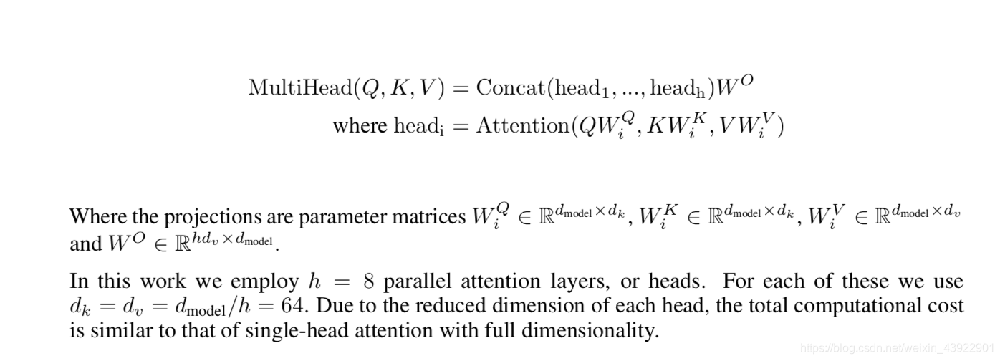
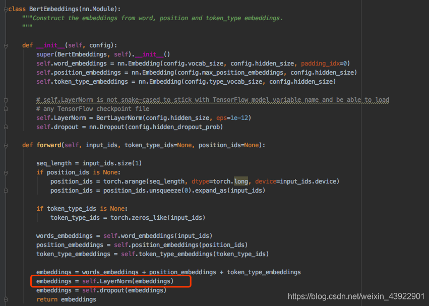
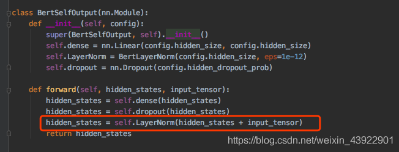
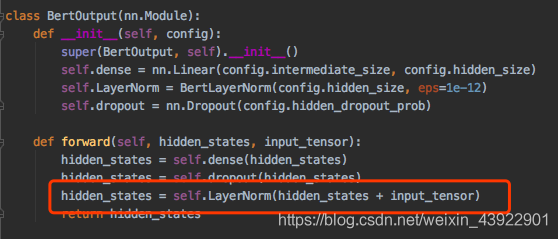
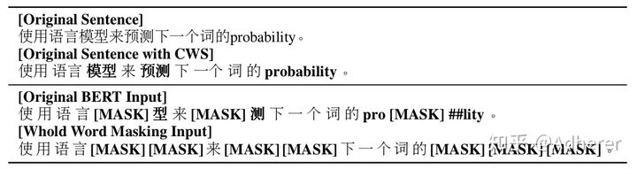

## **BERT 的MASK方式的优缺点？**

  答：BERT的mask方式：在选择mask的15%的词当中，80%情况下使用mask掉这个词，10%情况下采用一个任意词替换，剩余10%情况下保持原词汇不变。

  **优点：**1）被随机选择15%的词当中以10%的概率用任意词替换去预测正确的词，相当于文本纠错任务，为BERT模型赋予了一定的文本纠错能力；2）被随机选择15%的词当中以10%的概率保持不变，缓解了finetune时候与预训练时候输入不匹配的问题（预训练时候输入句子当中有mask，而finetune时候输入是完整无缺的句子，即为输入不匹配问题）。

  **缺点：**针对有两个及两个以上连续字组成的词，随机mask字割裂了连续字之间的相关性，使模型不太容易学习到词的语义信息。主要针对这一短板，因此google此后发表了BERT-WWM，国内的哈工大联合讯飞发表了中文版的BERT-WWM。

## BERT中的NSP任务是否有必要？

  答：在此后的研究（论文《Crosslingual language model pretraining》等）中发现，NSP任务可能并不是必要的，消除NSP损失在下游任务的性能上能够与原始BERT持平或略有提高。这可能是由于Bert以单句子为单位输入，模型无法学习到词之间的远程依赖关系。针对这一点，后续的RoBERTa、ALBERT、spanBERT都移去了NSP任务。

## BERT深度双向的特点，双向体现在哪儿？

BERT的预训练模型中，预训练任务是一个mask LM ，通过随机的把句子中的单词替换成mask标签， 然后对单词进行预测。

这里注意到，对于模型，输入的是一个被挖了空的句子， 而由于Transformer的特性， 它是会注意到所有的单词的，这就导致模型会根据挖空的上下文来进行预测， 这就实现了双向表示， 说明BERT是一个双向的语言模型。

BERT使用Transformer-encoder来编码输入，encoder中的Self-attention机制在编码一个token的时候同时利用了其上下文的token，其中‘同时利用上下文’即为双向的体现，而并非想Bi-LSTM那样把句子倒序输入一遍。

LSTM可以做这样的双向mask预测任务吗？

## BERT深度双向的特点，深度体现在哪儿？

  答：针对特征提取器，Transformer只用了self-attention，没有使用RNN、CNN，并且使用了残差连接有效防止了梯度消失的问题，使之可以构建更深层的网络，所以BERT构建了多层深度Transformer来提高模型性能。

## BERT中并行计算体现在哪儿？

  答：不同于RNN计算当前词的特征要依赖于前文计算，有时序这个概念，是按照时序计算的，而BERT的Transformer-encoder中的self-attention计算当前词的特征时候，没有时序这个概念，是同时利用上下文信息来计算的，一句话的token特征是通过矩阵并行‘瞬间’完成运算的，故，并行就体现在self-attention。

## BERT中Transformer中的Q、K、V存在的意义？

  答：在使用self-attention通过上下文词语计算当前词特征的时候，X先通过WQ、WK、WV线性变换为QKV，然后如下式右边部分使用QK计算得分，最后与V计算加权和而得。 

  倘若不变换为QKV，直接使用每个token的向量表示点积计算重要性得分，那在softmax后的加权平均中，该词本身所占的比重将会是最大的，使得其他词的比重很少，无法有效利用上下文信息来增强当前词的语义表示。而变换为QKV再进行计算，能有效利用上下文信息，很大程度上减轻上述的影响。

## BERT中Transformer中Self-attention后为什么要加前馈网络？

  答：由于self-attention中的计算都是线性了，为了提高模型的非线性拟合能力，需要在其后接上前馈网络。

## BERT中Transformer中的Self-attention多个头的作用？

  答：类似于cnn中多个卷积核的作用，使用多头注意力，能够从不同角度提取信息，提高信息提取的全面性。

## BERT参数量计算

**bert的参数主要可以分为四部分：embedding层的权重矩阵、multi-head attention、layer normalization、feed forward。**

```python3
BertModel(vocab_size=30522，
hidden_size=768，max_position_embeddings=512，
token_type_embeddings=2)
```

**一、embedding层**

embedding层有三部分组成：token embedding、segment embedding和position embedding。

token embedding：词表大小词向量维度就是对应的参数了，也就是30522*768

segment embedding：主要用01来区分上下句子，那么参数就是2*768

position embedding：文本输入最长为512，那么参数为512*768

因此embedding层的参数为(30522+2+512)*768=23835648

**二、multi-head attention**

Q，K，V就是我们输入的三个句子词向量，从之前的词向量分析可知，输出向量大小从len -> len x hidden_size，即len x 768。如果是self-attention，Q=K=V，如果是普通的attention，Q !=K=V。但是，不管用的是self-attention还是普通的attention，参数计算并不影响。因为在输入单头head时，对QKV的向量均进行了不同的线性变换，引入了三个参数，W1，W2，W3。其维度均为：768 x 64。

为什么是64呢，从下图可知，
Wi 的维度 ：dmodel x dk | dv | dq
而：dk | dv | dq = dmodle/h，h是头的数量，dmodel模型的大小，即h=12，dmodle=768；
所以：dk | dv | dq=768/12=64
得出：W1，W2，W3的维度为768 x 64




`每个head的参数为768*768/12，对应到QKV三个权重矩阵自然是768*768/12*3，12个head的参数就是768*768/12*3*12，拼接后经过一个线性变换，这个线性变换对应的权重为768*768。`

因此1层multi-head attention部分的参数为`768*768/12*3*12+768*768=2359296`

12层自然是`12*2359296=28311552`

**三、layer normalization**

文章其实并没有写出layernorm层的参数，但是在代码中有，分别为gamma和beta。有三个地方用到了layer normalization，分别是embedding层后、multi-head attention后、feed forward后
①词向量处



②多头注意力之后



③最后的全连接层之后



但是参数都很少，gamma和beta的维度均为768。因此总参数为768 * 2 + 768 * 2 * 2 * 12（层数）

这三部分的参数为`768*2+12*(768*2+768*2)=38400`

**四、feed forward**


以上是论文中全连接层的公式，其中用到了两个参数W1和W2，Bert沿用了惯用的全连接层大小设置，即4 * dmodle，为3072，因此，W1，W2大小为768 * 3072，2个为 2 * 768 * 3072。

`12*（768*3072+3072*768）=56623104`

**五、总结**

总的参数=embedding+multi-head attention+layer normalization+feed forward

=23835648+28311552+38400+56623104

=108808704

≈110M

另一种算法

- 词向量参数（包括layernorm） + 12 * （Multi-Heads参数 + 全连接层参数 + layernorm参数）= （30522+512 + 2）* 768 + 768 * 2 + 12 * （768 * 768 / 12 * 3 * 12 + 768 * 768 + 768 * 3072 * 2 + 768 * 2 * 2） = 108808704.0 ≈ 110M

PS：本文介绍的参数仅仅是encoder的参数，基于encoder的两个任务next sentence prediction 和 MLM涉及的参数（分别是768 * 2，768 * 768，总共约0.5M）并未加入，此外涉及的bias由于参数很少，本文也并未加入。


参考

- https://zhuanlan.zhihu.com/p/357353536
- https://blog.csdn.net/weixin_43922901/article/details/102602557
- https://github.com/google-research/bert/issues/656


## **为什么BERT比ELMo效果好？** 

从网络结构以及最后的实验效果来看，BERT比ELMo效果好主要集中在以下几点原因：

(1).LSTM抽取特征的能力远弱于Transformer

(2).拼接方式双向融合的特征融合能力偏弱(没有具体实验验证，只是推测)

(3).其实还有一点，BERT的训练数据以及模型参数均多余ELMo，这也是比较重要的一点

## **ELMo和BERT的区别是什么？** 

ELMo模型是通过语言模型任务得到句子中单词的embedding表示，以此作为补充的新特征给下游任务使用。因为ELMO给下游提供的是每个单词的特征形式，所以这一类预训练的方法被称为“Feature-based Pre-Training”。而BERT模型是“基于Fine-tuning的模式”，这种做法和图像领域基于Fine-tuning的方式基本一致，下游任务需要将模型改造成BERT模型，才可利用BERT模型预训练好的参数。

## BERT为什么意义重大

BERT相较于原来的RNN、LSTM可以做到并发执行，同时提取词在句子中的关系特征，并且能在多个不同层次提取关系特征，进而更全面反映句子语义。相较于word2vec，其又能根据句子上下文获取词义，从而避免歧义出现。同时缺点也是显而易见的，模型参数太多，而且模型太大，少量数据训练时，容易过拟合。

BERT的“里程碑”意义在于：证明了一个非常深的模型可以显著提高NLP任务的准确率，而这个模型可以从无标记数据集中预训练得到。

既然NLP的很多任务都存在数据少的问题，那么要从无标注数据中挖潜就变得非常必要。在NLP中，一个最直接的有效利用无标注数据的任务就是语言模型，因此很多任务都使用了语言模型作为预训练任务。但是这些模型依然比较“浅”，比如上一个大杀器，AllenNLP的[ELMO](https://link.zhihu.com/?target=https%3A//arxiv.org/abs/1802.05365)也就是三层的BiLSTM。

那么有没有可以胜任NLP任务的深层模型？有，就是transformer。这两年，transformer已经在机器翻译任务上取得了很大的成功，并且可以做的非常深。自然地，我们可以用transformer在语言模型上做预训练。因为transformer是encoder-decoder结构，语言模型就只需要decoder部分就够了。OpenAI的[GPT](https://link.zhihu.com/?target=https%3A//s3-us-west-2.amazonaws.com/openai-assets/research-covers/language-unsupervised/language_understanding_paper.pdf)就是这样。但decoder部分其实并不好。因为我们需要的是一个完整句子的encoder，而decoder的部分见到的都是不完整的句子。所以就有了BERT，利用transformer的encoder来进行预训练。但这个就比较“反直觉”，一般人想不到了。

**我们再来看下BERT有哪些“反直觉”的设置？**

ELMO的设置其实是最符合直觉的预训练套路，两个方向的语言模型刚好可以用来预训练一个BiLSTM，非常容易理解。但是受限于LSTM的能力，无法变深了。那如何用transformer在无标注数据行来做一个预训练模型呢？一个最容易想到的方式就是GPT的方式，事实证明效果也不错。那还有没有“更好”的方式？直观上是没有了。而BERT就用了两个反直觉的手段来找到了一个方法。

(1) 用比语言模型更简单的任务来做预训练。直觉上，要做更深的模型，需要设置一个比语言模型更难的任务，而BERT则选择了两个看起来更简单的任务：完形填空和句对预测。

(2) 完形填空任务在直观上很难作为其它任务的预训练任务。在完形填空任务中，需要mask掉一些词，这样预训练出来的模型是有缺陷的，因为在其它任务中不能mask掉这些词。而BERT通过随机的方式来解决了这个缺陷：80%加Mask，10%用其它词随机替换，10%保留原词。这样模型就具备了迁移能力。

感觉上，作者Jacob Devlin是拿着锤子找钉子。既然transformer已经证明了是可以handle大数据，那么就给它设计一种有大数据的任务，即使是“简单”任务也行。理论上BiLSTM也可以完成BERT里的两个任务，但是在大数据上BERT更有优势。

**3. 对NLP的影响**

总体上，BERT模型的成功还在于是一种表示学习，即通过一个深层模型来学习到一个更好的文本特征。这种非RNN式的模型是非[图灵完备](https://www.zhihu.com/question/USER_CANCEL)的，无法单独完成NLP中推理、决策等计算问题。当然，一个好的表示会使得后续的任务更简单。

BERT能否像ResNet那样流行还取决于其使用的便利性，包括模型实现、训练、可迁移性等，可能有好的模型出现，但类似的预训练模型会成为NLP任务的标配，就像Word2vec，Glove那样。

最后，BERT也打开了一个思路：可以继续在无标注数据上挖潜，而不仅仅限于语言模型。

## **BERT有什么局限性？** 

从XLNet论文中，提到了BERT的两个缺点，分别如下：

- BERT在第一个预训练阶段，假设句子中多个单词被Mask掉，这些被Mask掉的单词之间没有任何关系，是条件独立的，然而有时候这些单词之间是有关系的，比如”New York is a city”，假设我们Mask住”New”和”York”两个词，那么给定”is a city”的条件下”New”和”York”并不独立，因为”New York”是一个实体，看到”New”则后面出现”York”的概率要比看到”Old”后面出现”York”概率要大得多。

&ensp;&ensp;&ensp;&ensp;- 但是需要注意的是，这个问题并不是什么大问题，甚至可以说对最后的结果并没有多大的影响，因为本身BERT预训练的语料就是海量的(动辄几十个G)，所以如果训练数据足够大，其实不靠当前这个例子，靠其它例子，也能弥补被Mask单词直接的相互关系问题，因为总有其它例子能够学会这些单词的相互依赖关系。

- BERT的在预训练时会出现特殊的[MASK]，但是它在下游的fine-tune中不会出现，这就出现了预训练阶段和fine-tune阶段不一致的问题。其实这个问题对最后结果产生多大的影响也是不够明确的，因为后续有许多BERT相关的预训练模型仍然保持了[MASK]标记，也取得了很大的结果，而且很多数据集上的结果也比BERT要好。但是确确实实引入[MASK]标记，也是为了构造自编码语言模型而采用的一种折中方式。

另外还有一个缺点，是BERT在分词后做[MASK]会产生的一个问题，为了解决OOV的问题，我们通常会把一个词切分成更细粒度的WordPiece。BERT在Pretraining的时候是随机Mask这些WordPiece的，这就可能出现只Mask一个词的一部分的情况，例如：



probability这个词被切分成"pro"、”#babi”和”#lity”3个WordPiece。有可能出现的一种随机Mask是把”#babi” Mask住，但是”pro”和”#lity”没有被Mask。这样的预测任务就变得容易了，因为在”pro”和”#lity”之间基本上只能是”#babi”了。这样它只需要记住一些词(WordPiece的序列)就可以完成这个任务，而不是根据上下文的语义关系来预测出来的。类似的中文的词”模型”也可能被Mask部分(其实用”琵琶”的例子可能更好，因为这两个字只能一起出现而不能单独出现)，这也会让预测变得容易。

为了解决这个问题，很自然的想法就是词作为一个整体要么都Mask要么都不Mask，这就是所谓的Whole Word Masking。这是一个很简单的想法，对于BERT的代码修改也非常少，只是修改一些Mask的那段代码。

## **BERT应用于有空格丢失或者单词拼写错误等数据是否还是有效？有什么改进的方法？**

**BERT应用于有空格丢失的数据是否还是有效？**

按照常理推断可能会无效了，因为空格都没有的话，那么便成为了一长段文本，但是具体还是有待验证。而对于有空格丢失的数据要如何处理呢？一种方式是利用Bi-LSTM + CRF做分词处理，待其处理成正常文本之后，再将其输入BERT做下游任务。

**BERT应用于单词拼写错误的数据是否还是有效？**

如果有少量的单词拼写错误，那么造成的影响应该不会太大，因为BERT预训练的语料非常丰富，而且很多语料也不够干净，其中肯定也还是会含有不少单词拼写错误这样的情况。但是如果单词拼写错误的比例比较大，比如达到了30%、50%这种比例，那么需要通过人工特征工程的方式，以中文中的同义词替换为例，将不同的错字/别字都替换成同样的词语，这样减少错别字带来的影响。例如花被、花珼、花呗、花呗、花钡均替换成花呗。

## **BERT模型的mask相对于CBOW有什么异同点？**

**相同点：**CBOW的核心思想是：给定上下文，根据它的上文 Context-Before 和下文 Context-after 去预测input word。而BERT本质上也是这么做的，但是BERT的做法是给定一个句子，会随机Mask 15%的词，然后让BERT来预测这些Mask的词。

**不同点：**首先，在CBOW中，每个单词都会成为input word，而BERT不是这么做的，原因是这样做的话，训练数据就太大了，而且训练时间也会非常长。

其次，对于输入数据部分，CBOW中的输入数据只有待预测单词的上下文，而BERT的输入是带有[MASK] token的“完整”句子，也就是说BERT在输入端将待预测的input word用[MASK] token代替了。

另外，通过CBOW模型训练后，每个单词的word embedding是唯一的，因此并不能很好的处理一词多义的问题，而BERT模型得到的word embedding(token embedding)融合了上下文的信息，就算是同一个单词，在不同的上下文环境下，得到的word embedding是不一样的。

其实自己在整理这个问题时，萌生了新的问题，具体描述如下：

**为什么BERT中输入数据的[mask]标记为什么不能直接留空或者直接输入原始数据，在self-attention的Q K V计算中，不与待预测的单词做Q K V交互计算？**

这个问题还要补充一点细节，就是数据可以像CBOW那样，每一条数据只留一个“空”，这样的话，之后在预测的时候，就可以将待预测单词之外的所有单词的表示融合起来(均值融合或者最大值融合等方式)，然后再接上softmax做分类。

乍一看，感觉这个idea确实有可能可行，而且也没有看到什么不合理之处，但是需要注意的是，这样做的话，需要每预测一个单词，就要计算一套Q、K、V。就算不每次都计算，那么保存每次得到的Q、K、V也需要耗费大量的空间。总而言之，这种做法确实可能也是可行，但是实际操作难度却很大，从计算量来说，就是预训练BERT模型的好几倍(至少)，而且要保存中间状态也并非易事。其实还有挺重要的一点，如果像CBOW那样做，那么文章的“创新”在哪呢~

## **词袋模型到word2vec改进了什么？word2vec到BERT又改进了什么？**

**词袋模型到word2vec改进了什么？**

词袋模型(Bag-of-words model)是将一段文本（比如一个句子或是一个文档）用一个“装着这些词的袋子”来表示，这种表示方式不考虑文法以及词的顺序。**而在用词袋模型时，文档的向量表示直接将各词的词频向量表示加和**。通过上述描述，可以得出词袋模型的两个缺点：

- 词向量化后，词与词之间是有权重大小关系的，不一定词出现的越多，权重越大。
- 词与词之间是没有顺序关系的。

而word2vec是考虑词语位置关系的一种模型。通过大量语料的训练，将每一个词语映射成一个低维稠密向量，通过求余弦的方式，可以判断两个词语之间的关系，word2vec其底层主要采用基于CBOW和Skip-Gram算法的神经网络模型。

因此，综上所述，词袋模型到word2vec的改进主要集中于以下两点：

- 考虑了词与词之间的顺序，引入了上下文的信息
- 得到了词更加准确的表示，其表达的信息更为丰富

**word2vec到BERT又改进了什么？**

word2vec到BERT的改进之处其实没有很明确的答案，如同上面的问题所述，BERT的思想其实很大程度上来源于CBOW模型，如果从准确率上说改进的话，BERT利用更深的模型，以及海量的语料，得到的embedding表示，来做下游任务时的准确率是要比word2vec高不少的。实际上，这也离不开模型的“加码”以及数据的“巨大加码”。再从方法的意义角度来说，BERT的重要意义在于给大量的NLP任务提供了一个泛化能力很强的预训练模型，而仅仅使用word2vec产生的词向量表示，不仅能够完成的任务比BERT少了很多，而且很多时候直接利用word2vec产生的词向量表示给下游任务提供信息，下游任务的表现不一定会很好，甚至会比较差。

## 参考资料

[BERT面试8问8答](https://www.jianshu.com/p/56a621e33d34)

[关于BERT的若干问题整理记录](https://zhuanlan.zhihu.com/p/95594311)（BERT的基本原理是什么，BERT是怎么用Transformer的，BERT的训练过程是怎么样的，为什么BERT比ELMo效果好？ELMo和BERT的区别是什么，BERT的输入和输出分别是什么，针对句子语义相似度/多标签分类/机器翻译翻译/文本生成的任务，利用BERT结构怎么做fine-tuning，BERT应用于有空格丢失或者单词拼写错误等数据是否还是有效？有什么改进的方法，BERT的embedding向量如何的来的，BERT模型为什么要用mask？它是如何做mask的？其mask相对于CBOW有什么异同点，BERT的两个预训练任务对应的损失函数是什么，词袋模型到word2vec改进了什么？word2vec到BERT又改进了什么）

[如何评价 BERT 模型？](https://www.zhihu.com/question/298203515)