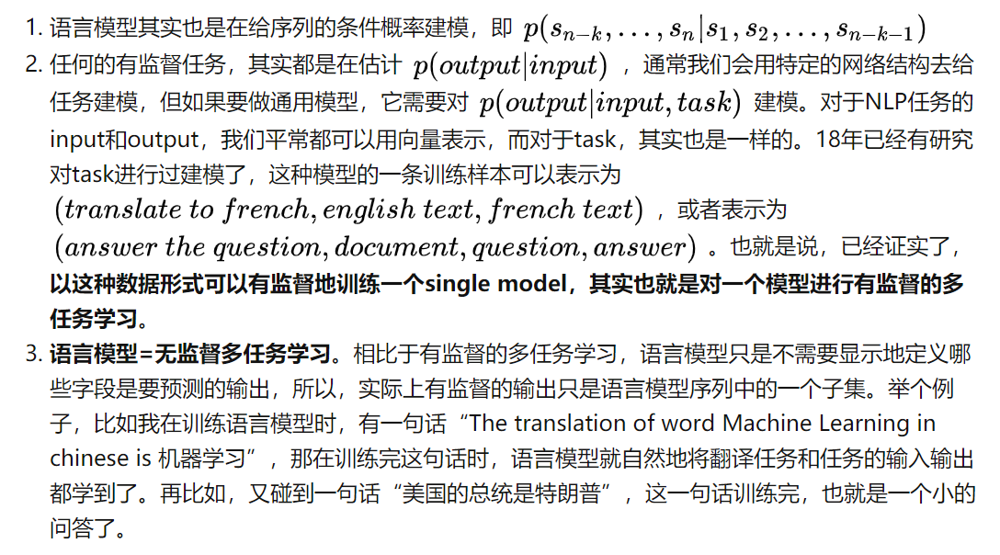

- **关键词:** 单向信息，NLU的pretrain-finetune差异

优化目标是单向(从左到右或者从右到左)建模序列的联合概率，是传统意义上的语言模型，后预测的词以先预测的词为条件，比较适合文本生成任务，但是缺陷是只使用了单向的语言表征信息，无法获取双向上下文信息表征，而文本理解任务中经常需要用到双向的上下文信息(比如，完形填空)，因此，这就带来了pre-train阶段和下游任务的不一致。

GPT2的核心思想就是认为**可以用无监督的预训练模型去做有监督任务**。GPT2模型的结构还是和GPT一样，如上图中间部分，它所适用的任务恰好是语言模型，这是大家再熟悉不过的公式。那为什么这个就能做有监督任务呢？平常的套路难道不是语言模型预训练+微调吗？

## 参考资料

[OpenAI GPT2原理解读（李rumor）](https://zhuanlan.zhihu.com/p/57251615)

[NLP：NLP领域没有最强，只有更强的模型——GPT-3的简介、安装、使用方法之详细攻略](https://blog.csdn.net/qq_41185868/article/details/107897654)

