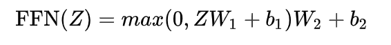
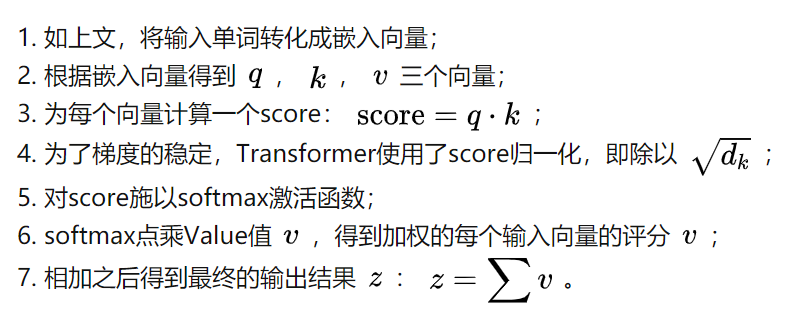
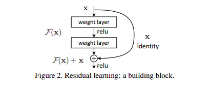

摘要：

- Transformer由且仅由self-Attenion和Feed Forward Neural Network组成。
- 

Transformer模型来自论文[Attention Is All You Need](https://arxiv.org/abs/1706.03762)。这个模型最初是为了提高机器翻译的效率，它的Self-Attention机制和Position Encoding可以替代RNN。

## 模型概览

作者采用Attention机制的原因是考虑到RNN（或者LSTM，GRU等）的计算限制为是顺序的，也就是说RNN相关算法只能从左向右依次计算或者从右向左依次计算，这种机制带来了两个问题：

1. **时间片t 的计算依赖t-1时刻的计算结果，这样限制了模型的并行能力；**
2. **顺序计算的过程中信息会丢失，尽管LSTM等门机制的结构一定程度上缓解了长期依赖的问题，但是对于特别长期的依赖现象,LSTM依旧无能为力。**

[Transformer](https://arxiv.org/abs/1706.03762) 是一个完全基于注意力机制（Attention mechanism）的模块，对比 RNN（Recurrent Neural Network），当输入的句子是长句子时，RNN 可能会遗忘之前句子中出现的字词，而 Transformer 的注意力机制使得句子中重要的字词的权重增大，从而保证不会被遗忘（将序列中的任意两个位置之间的距离缩小为一个常量）。并且 Transformer 另一个巨大的优势在于，它可以使用并行的方法运行计算，从而加快了速度。

Transformer 的具体结构如下图：


来自：https://doc.shiyanlou.com/courses/uid214893-20190806-1565074908805

对于机器翻译来说，它的输入是源语言(法语)的句子，输出是目标语言(英语)的句子。

**Transformer(或者任何的NMT系统)都可以分成Encoder和Decoder两个部分。**

再展开一点，Encoder由很多(6个)结构一样的Encoder堆叠(stack)而成，Decoder也是一样。

每一个Encoder的输入是下一层Encoder输出，最底层Encoder的输入是原始的输入(法语句子)；Decoder也是类似，但是最后一层Encoder的输出会输入给每一个Decoder层，这是Attention机制的要求。


每一层的Encoder都是相同的结构，它由一个Self-Attention层和一个前馈网络(全连接网络)组成。在 Encoder 中：

1. Input 经过 embedding 后，要做 positional encodings，
2. 然后是 Multi-head attention，
3. 再经过 position-wise Feed Forward，
4. 每个子层之间有残差连接。

每一层的Decoder也是相同的结构，它除了Self-Attention层和全连接层之外还多了一个普通的Attention层，这个Attention层使得Decoder在解码时会考虑最后一层Encoder所有时刻的输出。在 Decoder 中，

1. 如上图所示，也有 positional encodings，Multi-head attention 和 FFN，子层之间也要做残差连接，
2. 但比 encoder 多了一个 Masked Multi-head attention，
3. 最后要经过 Linear 和 softmax 输出概率。

## 结构分析

**输入的句子是一个词(ID)的序列，我们首先通过Embedding（Word2Vec等词嵌入方法）把它变成一个连续稠密的向量。**论文中使用的词嵌入的维度为512.

Embedding之后的序列会输入Encoder。在最底层的block中，x将直接作为Transformer的输入，而在其他层中，输入则是上一个block的输出。

- 首先经过Self-Attention层得到一个加权之后的特征向量Z
- 然后再经过全连接层Feed Forward Neural Network。这个全连接有两层，第一层的激活函数是ReLU，第二层是一个线性激活函数，可以表示为：




上图表示计算z1, z2, ...需要用到所有的x1, x2, ...，而计算r1只需要用到z1。

Decoder的结构如图所示，它和encoder的不同之处在于Decoder多了一个Encoder-Decoder Attention，两个Attention分别用于计算输入和输出的权值：

1. Self-Attention：**当前翻译和已经翻译的前文之间的关系**；
2. Encoder-Decoder Attention：**当前翻译和编码的特征向量之间的关系**。


## Self-Attention

Self-Attention用Encoder在编码一个词的时候会考虑句子中所有其它的词，从而确定怎么编码当前词。

**对于输入的每一个向量(第一层是词的Embedding，其它层是前一层的输出)，我们首先需要生成3个新的向量Q、K和V，分别代表查询(Query)向量、Key向量和Value向量，长度均为64。输入向量组成的矩阵乘以不同的矩阵变换就得到Q、K、V。三个矩阵的维度都是512x64.**

**Q表示为了编码当前词，需要去注意(attend to)其它(其实也包括它自己)的词，我们需要有一个查询向量。而Key向量可以认为是这个词的关键的用于被检索的信息，而Value向量是真正的内容。**

**Attention的计算方法：**



单个向量的计算分解：

- 取 Q 中一个行向量为例（也就是每一个输入样本中 xi 对应的 qi），用 qi 乘上每一个样本对应的 ki，再除以注意力头的维度（**为了梯度的稳定**），就得到每个样本对应的注意力值。接下来，再使用 Softmax 函数将值转换为和为 1 的概率值（向量形式）并乘上 V，得到经过注意力机制计算后的输出值。


实际中是基于矩阵的方法计算的：


注意每个Self-Attention层都会加一个残差连接（目的是解决深度学习中的退化问题），然后是一个LayerNorm层。

Query，Key，Value的概念取自于信息检索系统，举个简单的搜索的例子来说。当你在某电商平台搜索某件商品（年轻女士冬季穿的红色薄款羽绒服）时，你在搜索引擎上输入的内容便是Query，然后搜索引擎根据Query为你匹配Key（例如商品的种类，颜色，描述等），然后根据Query和Key的相似度得到匹配的内容（Value)。

self-attention中的Q，K，V也是起着类似的作用，**在矩阵计算中，点积是计算两个矩阵相似度的方法之一，因此式1中使用了$QK^T$进行相似度的计算。接着便是根据相似度进行输出的匹配，这里使用了加权匹配的方式，而权值就是query与key的相似度。**

## Multi-Head Attention

前面定义的一组Q、K和V可以让一个词attend to相关的词，我们可以定义多组Q、K和V，它们分别可以关注不同的上下文。多层叠加的 Self-Attention 组成了 Multi-Head Attention。

对于输入矩阵(time_step, num_input)，每一组Q、K和V都可以得到一个输出矩阵Z(time_step, num_features)。

但是后面的全连接网络需要的输入是一个矩阵而不是多个矩阵，因此我们可以把多个head输出的Z按照第二个维度拼接起来，但是这样的特征有一些多，**因此Transformer又用了一个线性变换(矩阵WO)对它进行了压缩。**


**Multi-Head Attention 通过多层的 Self-Attention 可以将输入语句映射到不同的子空间中，于是能够更好地理解到语句所包含的信息。**


## Decoder

Decoder和Encoder是类似的，如下图所示，区别在于它多了一个Encoder-Decoder Attention层。

Decoder的输入分为两类：

一种是训练时的输入，一种是预测时的输入。

训练时的输入就是已经准备好对应的target数据。例如翻译任务，Encoder输入"Tom chase Jerry"，Decoder输入"汤姆追逐杰瑞"。

预测时的输入，一开始输入的是起始符，然后每次输入是上一时刻Transformer的输出。例如，输入""，输出"汤姆"，输入"汤姆"，输出"汤姆追逐"，输入"汤姆追逐"，输出"汤姆追逐杰瑞"，输入"汤姆追逐杰瑞"，输出"汤姆追逐杰瑞"结束。

与Encoder的Multi-Head Attention计算原理一样，只是多加了一个mask码。mask 表示掩码，它对某些值进行掩盖，使其在参数更新时不产生效果。**Transformer 模型里面涉及两种 mask，分别是 padding mask 和 sequence mask。**为什么需要添加这两种mask码呢？

1.padding mask

什么是 padding mask 呢？因为每个批次输入序列长度是不一样的。也就是说，我们要对输入序列进行对齐。具体来说，就是给在较短的序列后面填充 0。但是如果输入的序列太长，则是截取左边的内容，把多余的直接舍弃。因为这些填充的位置，其实是没什么意义的，所以我们的attention机制不应该把注意力放在这些位置上，所以我们需要进行一些处理。

具体的做法是，把这些位置的值加上一个非常大的负数(负无穷)，这样的话，经过 softmax，这些位置的概率就会接近0！

2.sequence mask

sequence mask 是为了使得 decoder 不能看见未来的信息。对于一个序列，在 time_step 为 t 的时刻，我们的解码输出应该只能依赖于 t 时刻之前的输出，而不能依赖 t 之后的输出。因此我们需要想一个办法，把 t 之后的信息给隐藏起来。这在训练的时候有效，因为训练的时候每次我们是将target数据完整输入进decoder中地，预测时不需要，预测的时候我们只能得到前一时刻预测出的输出。

那么具体怎么做呢？也很简单：产生一个上三角矩阵，上三角的值全为0。把这个矩阵作用在每一个序列上，就可以达到我们的目的。

上面可能忘记说了，在Encoder中的Multi-Head Attention也是需要进行mask地，只不过Encoder中只需要padding mask即可，而Decoder中需要padding mask和sequence mask。OK除了这点mask不一样以外，其他的部分均与Encoder一样啦~

Add＆Normalize也与Encoder中一样，接下来就到了Decoder中第二个Multi-Head Attention，这个Multi-Head Attention又与Encoder中有一点点不一样。

**基于Encoder-Decoder 的Multi-Head Attention**

Encoder中的Multi-Head Attention是基于Self-Attention地，Decoder中的第二个Multi-Head Attention就只是基于Attention，它的输入Query来自于Masked Multi-Head Attention的输出，Keys和Values来自于Encoder中最后一层的输出。

**为啥Decoder中要搞两个Multi-Head Attention呢？**

我个人理解是第一个Masked Multi-Head Attention是为了得到之前已经预测输出的信息，相当于记录当前时刻的输入之间的信息的意思。第二个Multi-Head Attention是为了通过当前输入的信息得到下一时刻的信息，也就是输出的信息，是为了表示当前的输入与经过encoder提取过的特征向量之间的关系来预测输出。

经过了第二个Multi-Head Attention之后的Feed Forward Network与Encoder中一样，然后就是输出进入下一个decoder，如此经过6层decoder之后到达最后的输出层。


由于在机器翻译中，解码过程是一个顺序操作的过程，也就是当解码第k个特征向量时，我们只能看到第k-1及其之前的解码结果，论文中把这种情况下的multi-head attention叫做masked multi-head attention。

## 损失层

解码器解码之后，解码的特征向量经过一层激活函数为softmax的全连接层之后得到反映每个单词概率的输出向量。此时我们便可以通过CTC等损失函数训练模型了。


## 位置编码(Positional Encoding)

注意：这是Transformer原始论文使用的位置编码方法，而在BERT模型里，使用的是简单的可以学习的Embedding，和Word Embedding一样，只不过输入是位置而不是词而已。

我们的目的是用Self-Attention替代RNN，RNN能够记住过去的信息，这可以通过Self-Attention“实时”的注意相关的任何词来实现等价(甚至更好)的效果。RNN还有一个特定就是能考虑词的顺序(位置)关系，一个句子即使词完全是相同的但是语义可能完全不同，比如”北京到上海的机票”与”上海到北京的机票”

为了解决这个问题，我们需要引入位置编码，也就是t时刻的输入，除了Embedding之外(这是与位置无关的)，我们还引入一个向量，这个向量是与t有关的，我们把Embedding和位置编码向量加起来作为模型的输入。

位置编码有很多方法，其中需要考虑的一个重要因素就是需要它编码的是相对位置的关系。比如两个句子：”北京到上海的机票”和”你好，我们要一张北京到上海的机票”。显然加入位置编码之后，两个北京的向量是不同的了，两个上海的向量也是不同的了，但是我们期望Query(北京1)\*Key(上海1)却是等于Query(北京2)\*Key(上海2)的。


## LayerNorm

在神经网络进行训练之前，都需要对于输入数据进行Normalize归一化，目的有二：1，能够加快训练的速度。2.提高训练的稳定性。

Batch Normalization，这个技巧能够让模型收敛的更快。但是Batch Normalization有一个问题——它需要一个minibatch的数据，而且这个minibatch不能太小(比如1)。另外一个问题就是它不能用于RNN，因为同样一个节点在不同时刻的分布是明显不同的。当然有一些改进的方法使得可以对RNN进行Batch Normalization，比如论文[Recurrent Batch Normalization](https://arxiv.org/abs/1603.09025)

Transformer里使用了另外一种Normalization技巧，叫做Layer Normalization。

假设我们的输入是一个minibatch的数据，我们再假设每一个数据都是一个向量，则输入是一个矩阵，每一行是一个训练数据，每一列都是一个特征。**BatchNorm是对每个特征进行Normalization，而LayerNorm是对每个样本的不同特征进行Normalization，因此LayerNorm的输入可以是一行(一个样本)。**

BN是对于相同的维度进行归一化，但是咱们NLP中输入的都是词向量，一个300维的词向量，单独去分析它的每一维是没有意义地，在每一维上进行归一化也是适合地，因此这里选用的是LN。


因为LayerNorm的每个样本都是独立计算的，因此minibatch可以很小甚至可以是1。实验证明LayerNorm不仅在普通的神经网络中有效，而且对于RNN也非常有效。

BatchNorm看起来比较直观，我们在数据预处理也经常会把输入Normalize成均值为0，方差为1的数据，只不过它引入了可以学习的参数使得模型可以更加需要重新缓慢(不能剧烈)的调整均值和方差。而LayerNorm似乎有效奇怪，比如第一个特征是年龄，第二个特征是身高，把一个人的这两个特征求均值和方差似乎没有什么意义。论文里有一些讨论，都比较抽象。当然把身高和年龄平均并没有什么意义，但是对于其它层的特征，我们通过平均”期望”它们的取值范围大体一致，也可能使得神经网络调整参数更加容易，如果这两个特征实在有很大的差异，模型也可以学习出合适的参数让它来把取值范围缩放到更合适的区间。

## 残差连接

每个Self-Attention层都会加一个残差连接，然后是一个LayerNorm层。


下图展示了更多细节：输入x1,x2经self-attention层之后变成z1,z2，然后和残差连接的输入x1,x2加起来，然后经过LayerNorm层输出给全连接层。全连接层也是有一个残差连接和一个LayerNorm层，最后再输出给上一层。


加入残差块X的目的是为了防止在深度神经网络训练中发生退化问题，退化的意思就是深度神经网络通过增加网络的层数，Loss逐渐减小，然后趋于稳定达到饱和，然后再继续增加网络层数，Loss反而增大。

**为什么深度神经网络会发生退化？**

举个例子：假如某个神经网络的最优网络层数是18层，但是我们在设计的时候并不知道到底多少层是最优解，本着层数越深越好的理念，我们设计了32层，那么32层神经网络中有14层其实是多余地，我们要想达到18层神经网络的最优效果，必须保证这多出来的14层网络必须进行恒等映射，恒等映射的意思就是说，输入什么，输出就是什么，可以理解成F(x)=x这样的函数，因为只有进行了这样的恒等映射咱们才能保证这多出来的14层神经网络不会影响我们最优的效果。

但现实是神经网络的参数都是训练出来地，要想保证训练出来地参数能够很精确的完成F(x)=x的恒等映射其实是很困难地。多余的层数较少还好，对效果不会有很大影响，但多余的层数一多，可能结果就不是很理想了。这个时候大神们就提出了ResNet 残差神经网络来解决神经网络退化的问题。

**残差块是什么？**



上图就是构造的一个残差块，可以看到X是这一层残差块的输入，也称作F(X)为残差，X为输入值，F(X)是经过第一层线性变化并激活后的输出，该图表示在残差网络中，第二层进行线性变化之后激活之前，F(X)加入了这一层输入值X，然后再进行激活后输出。在第二层输出值激活前加入X，这条路径称作shortcut连接。

**为什么添加了残差块能防止神经网络退化问题呢？**

咱们再来看看添加了残差块后，咱们之前说的要完成恒等映射的函数变成什么样子了。是不是就变成h(X)=F(X)+X，我们要让h(X)=X，那么是不是相当于只需要让F(X)=0就可以了，这里就巧妙了！神经网络通过训练变成0是比变成X容易很多地，因为大家都知道咱们一般初始化神经网络的参数的时候就是设置的[0,1]之间的随机数嘛。所以经过网络变换后很容易接近于0。举个例子：


假设该网络只经过线性变换，没有bias也没有激活函数。我们发现因为随机初始化权重一般偏向于0，那么经过该网络的输出值为[0.6 0.6]，很明显会更接近与[0 0]，而不是[2 1]，相比与学习h(x)=x，模型要更快到学习F(x)=0。

并且ReLU能够将负数激活为0，过滤了负数的线性变化，也能够更快的使得F(x)=0。这样当网络自己决定哪些网络层为冗余层时，使用ResNet的网络很大程度上解决了学习恒等映射的问题，用学习残差F(x)=0更新该冗余层的参数来代替学习h(x)=x更新冗余层的参数。

这样当网络自行决定了哪些层为冗余层后，通过学习残差F(x)=0来让该层网络恒等映射上一层的输入，使得有了这些冗余层的网络效果与没有这些冗余层的网络效果相同，这样很大程度上解决了网络的退化问题。

## 优缺点

**优点**：（1）虽然Transformer最终也没有逃脱传统学习的套路，Transformer也只是一个全连接（或者是一维卷积）加Attention的结合体。但是其设计已经足够有创新，因为其抛弃了在NLP中最根本的RNN或者CNN并且取得了非常不错的效果，算法的设计非常精彩，值得每个深度学习的相关人员仔细研究和品位。（2）Transformer的设计最大的带来性能提升的关键是将任意两个单词的距离是1，这对解决NLP中棘手的长期依赖问题是非常有效的。（3）Transformer不仅仅可以应用在NLP的机器翻译领域，甚至可以不局限于NLP领域，是非常有科研潜力的一个方向。（4）算法的并行性非常好，符合目前的硬件（主要指GPU）环境。

**缺点**：（1）粗暴的抛弃RNN和CNN虽然非常炫技，但是它也使模型丧失了捕捉局部特征的能力，RNN + CNN + Transformer的结合可能会带来更好的效果。（2）Transformer失去的位置信息其实在NLP中非常重要，而论文中在特征向量中加入Position Embedding也只是一个权宜之计，并没有改变Transformer结构上的固有缺陷。

## 代码

```python
class EncoderDecoder(nn.Module):
	"""
	标准的Encoder-Decoder架构。这是很多模型的基础
	"""
	def __init__(self, encoder, decoder, src_embed, tgt_embed, generator):
		super(EncoderDecoder, self).__init__()
		# encoder和decoder都是构造的时候传入的，这样会非常灵活
		self.encoder = encoder
		self.decoder = decoder
		# 源语言和目标语言的embedding
		self.src_embed = src_embed
		self.tgt_embed = tgt_embed
		# generator后面会讲到，就是根据Decoder的隐状态输出当前时刻的词
		# 基本的实现就是隐状态输入一个全连接层，全连接层的输出大小是词的个数
		# 然后接一个softmax变成概率。
		self.generator = generator
	
	def forward(self, src, tgt, src_mask, tgt_mask):
		# 首先调用encode方法对输入进行编码，然后调用decode方法解码
		return self.decode(self.encode(src, src_mask), src_mask, tgt, tgt_mask)
	
	def encode(self, src, src_mask):
		# 调用encoder来进行编码，传入的参数embedding的src和src_mask
		return self.encoder(self.src_embed(src), src_mask)
	
	def decode(self, memory, src_mask, tgt, tgt_mask):
		# 调用decoder
		return self.decoder(self.tgt_embed(tgt), memory, src_mask, tgt_mask)
    
    
class Generator(nn.Module):
	# 根据Decoder的隐状态输出一个词
	# d_model是Decoder输出的大小，vocab是词典大小
	def __init__(self, d_model, vocab):
		super(Generator, self).__init__()
		self.proj = nn.Linear(d_model, vocab)
	
	# 全连接再加上一个softmax
	def forward(self, x):
		return F.log_softmax(self.proj(x), dim=-1)
    
    
def clones(module, N):
	# 克隆N个完全相同的SubLayer，使用了copy.deepcopy
	return nn.ModuleList([copy.deepcopy(module) for _ in range(N)])


class Encoder(nn.Module):
	"Encoder是N个EncoderLayer的stack"
	def __init__(self, layer, N):
		super(Encoder, self).__init__()
		# layer是一个SubLayer，我们clone N个
		self.layers = clones(layer, N)
		# 再加一个LayerNorm层
		self.norm = LayerNorm(layer.size)
	
	def forward(self, x, mask):
		"逐层进行处理"
		for layer in self.layers:
			x = layer(x, mask)
		# 最后进行LayerNorm，后面会解释为什么最后还有一个LayerNorm。
		return self.norm(x)
    
    
class LayerNorm(nn.Module):
	def __init__(self, features, eps=1e-6):
		super(LayerNorm, self).__init__()
		self.a_2 = nn.Parameter(torch.ones(features))
		self.b_2 = nn.Parameter(torch.zeros(features))
		self.eps = eps
	
	def forward(self, x):
		mean = x.mean(-1, keepdim=True)
		std = x.std(-1, keepdim=True)
		return self.a_2 * (x - mean) / (std + self.eps) + self.b_2
    
    
class SublayerConnection(nn.Module):
	"""
	LayerNorm + sublayer(Self-Attenion/Dense) + dropout + 残差连接
	为了简单，把LayerNorm放到了前面，这和原始论文稍有不同，原始论文LayerNorm在最后。
	"""
	def __init__(self, size, dropout):
		super(SublayerConnection, self).__init__()
		self.norm = LayerNorm(size)
		self.dropout = nn.Dropout(dropout)
	
	def forward(self, x, sublayer):
		"sublayer是传入的参数，参考DecoderLayer，它可以当成函数调用，这个函数的有一个输入参数"
		return x + self.dropout(sublayer(self.norm(x)))
    
    
class EncoderLayer(nn.Module):
	"EncoderLayer由self-attn和feed forward组成"
	def __init__(self, size, self_attn, feed_forward, dropout):
		super(EncoderLayer, self).__init__()
		self.self_attn = self_attn
		self.feed_forward = feed_forward
		self.sublayer = clones(SublayerConnection(size, dropout), 2)
		self.size = size

	def forward(self, x, mask):
		"Follow Figure 1 (left) for connections."
		x = self.sublayer[0](x, lambda x: self.self_attn(x, x, x, mask))
		return self.sublayer[1](x, self.feed_forward)
    
    
class Decoder(nn.Module): 
	def __init__(self, layer, N):
		super(Decoder, self).__init__()
		self.layers = clones(layer, N)
		self.norm = LayerNorm(layer.size)
	
	def forward(self, x, memory, src_mask, tgt_mask):
		for layer in self.layers:
			x = layer(x, memory, src_mask, tgt_mask)
		return self.norm(x)
    
    
class DecoderLayer(nn.Module):
	"Decoder包括self-attn, src-attn, 和feed forward "
	def __init__(self, size, self_attn, src_attn, feed_forward, dropout):
		super(DecoderLayer, self).__init__()
		self.size = size
		self.self_attn = self_attn
		self.src_attn = src_attn
		self.feed_forward = feed_forward
		self.sublayer = clones(SublayerConnection(size, dropout), 3)
	
	def forward(self, x, memory, src_mask, tgt_mask): 
		m = memory
		x = self.sublayer[0](x, lambda x: self.self_attn(x, x, x, tgt_mask))
		x = self.sublayer[1](x, lambda x: self.src_attn(x, m, m, src_mask))
		return self.sublayer[2](x, self.feed_forward)
    
    
def subsequent_mask(size):
	"Mask out subsequent positions."
	attn_shape = (1, size, size)
	subsequent_mask = np.triu(np.ones(attn_shape), k=1).astype('uint8')
	return torch.from_numpy(subsequent_mask) == 0


```

Attention

```python
def attention(query, key, value, mask=None, dropout=None):
	d_k = query.size(-1)
	scores = torch.matmul(query, key.transpose(-2, -1)) \
		/ math.sqrt(d_k)
	if mask is not None:
		scores = scores.masked_fill(mask == 0, -1e9)
	p_attn = F.softmax(scores, dim = -1)
	if dropout is not None:
		p_attn = dropout(p_attn)
	return torch.matmul(p_attn, value), p_attn


class MultiHeadedAttention(nn.Module):
	def __init__(self, h, d_model, dropout=0.1):
		super(MultiHeadedAttention, self).__init__()
		assert d_model % h == 0
		# We assume d_v always equals d_k
		self.d_k = d_model // h
		self.h = h
		self.linears = clones(nn.Linear(d_model, d_model), 4)
		self.attn = None
		self.dropout = nn.Dropout(p=dropout)
	
	def forward(self, query, key, value, mask=None): 
		if mask is not None:
			# 所有h个head的mask都是相同的 
			mask = mask.unsqueeze(1)
		nbatches = query.size(0)
		
		# 1) 首先使用线性变换，然后把d_model分配给h个Head，每个head为d_k=d_model/h 
		query, key, value = \
			[l(x).view(nbatches, -1, self.h, self.d_k).transpose(1, 2)	
				for l, x in zip(self.linears, (query, key, value))]
		
		# 2) 使用attention函数计算
		x, self.attn = attention(query, key, value, mask=mask, 
			dropout=self.dropout)
		
		# 3) 把8个head的64维向量拼接成一个512的向量。然后再使用一个线性变换(512,521)，shape不变。 
		x = x.transpose(1, 2).contiguous() \
			.view(nbatches, -1, self.h * self.d_k)
		return self.linears[-1](x)
```

全连接sublayer

```python
class PositionwiseFeedForward(nn.Module): 
	def __init__(self, d_model, d_ff, dropout=0.1):
		super(PositionwiseFeedForward, self).__init__()
		self.w_1 = nn.Linear(d_model, d_ff)
		self.w_2 = nn.Linear(d_ff, d_model)
		self.dropout = nn.Dropout(dropout)
	
	def forward(self, x):
		return self.w_2(self.dropout(F.relu(self.w_1(x))))
    
    
class Embeddings(nn.Module):
	def __init__(self, d_model, vocab):
		super(Embeddings, self).__init__()
		self.lut = nn.Embedding(vocab, d_model)
		self.d_model = d_model
	
	def forward(self, x):
		return self.lut(x) * math.sqrt(self.d_model)
    
    
    
class PositionalEncoding(nn.Module): 
	def __init__(self, d_model, dropout, max_len=5000):
		super(PositionalEncoding, self).__init__()
		self.dropout = nn.Dropout(p=dropout)
		
		# Compute the positional encodings once in log space.
		pe = torch.zeros(max_len, d_model)
		position = torch.arange(0, max_len).unsqueeze(1)
		div_term = torch.exp(torch.arange(0, d_model, 2) *
			-(math.log(10000.0) / d_model))
		pe[:, 0::2] = torch.sin(position * div_term)
		pe[:, 1::2] = torch.cos(position * div_term)
		pe = pe.unsqueeze(0)
		self.register_buffer('pe', pe)

	def forward(self, x):
		x = x + Variable(self.pe[:, :x.size(1)], requires_grad=False)
		return self.dropout(x)
```

完整模型

```python
def make_model(src_vocab, tgt_vocab, N=6, 
		d_model=512, d_ff=2048, h=8, dropout=0.1): 
	c = copy.deepcopy
	attn = MultiHeadedAttention(h, d_model)
	ff = PositionwiseFeedForward(d_model, d_ff, dropout)
	position = PositionalEncoding(d_model, dropout)
	model = EncoderDecoder(
		Encoder(EncoderLayer(d_model, c(attn), c(ff), dropout), N),
		Decoder(DecoderLayer(d_model, c(attn), c(attn), c(ff), dropout), N),
		nn.Sequential(Embeddings(d_model, src_vocab), c(position)),
		nn.Sequential(Embeddings(d_model, tgt_vocab), c(position)),
		Generator(d_model, tgt_vocab))
	
	# 随机初始化参数，这非常重要
	for p in model.parameters():
		if p.dim() > 1:
			nn.init.xavier_uniform(p)
	return model
```

## 参考资料

[Transformer图解（by李理）](http://fancyerii.github.io/2019/03/09/transformer-illustrated/)

[Transformer代码阅读（by李理）](http://fancyerii.github.io/2019/03/09/transformer-codes/)

[NLP预训练家族 | Transformer-XL及其进化XLNet](https://mp.weixin.qq.com/s/_xZpg5WDInqGKur1AGxI1Q)

[详解Transformer （Attention Is All You Need）](https://zhuanlan.zhihu.com/p/48508221)

[史上最小白之Transformer详解](https://blog.csdn.net/Tink1995/article/details/105080033)（小白友好）

[图解什么是 Transformer](https://www.jianshu.com/p/e7d8caa13b21)（大部分是很火的那篇英文文章内容）