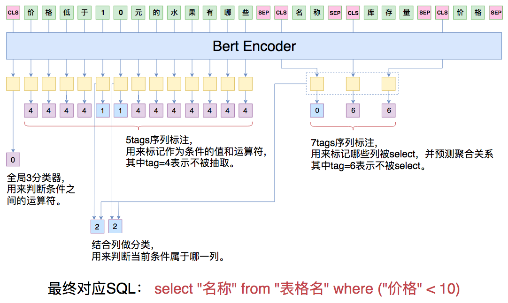

## 背景说明

文本转SQL，顾名思义，就是将文本转成SQL，这样不懂SQL的人也能够与数据库交互。这个技术可以简称为NL2SQL，或者Text2SQL。

2019年追一科技在天池数据平台举行了第一届中文NL2SQL挑战赛，使用金融以及通用领域的表格数据作为数据源，提供在此基础上标注的自然语言与SQL语句的匹配对，希望选手可以利用数据训练出可以准确转换自然语言到SQL的模型。

比赛地址：https://tianchi.aliyun.com/competition/entrance/231716/introduction

官方也开源了比赛中的数据集：https://github.com/ZhuiyiTechnology/TableQA

官方Baseline方案：https://github.com/ZhuiyiTechnology/nl2sql_baseline

赛题提供了4万条有标签数据作为训练集，1万条无标签数据作为测试集。其中，5千条测试集数据作为初赛测试集，对选手可见；5千条作为复赛测试集，对选手不可见。

提供的数据集主要由3个文件组成，以训练集为例，包括train.json、train.tables.json及train.db。

train.json文件中，每一行为一条数据样本。数据样例及字段说明例如下：

```json
{
     "table_id": "a1b2c3d4", # 相应表格的id
     "question": "世茂茂悦府新盘容积率大于1，请问它的套均面积是多少？", # 自然语言问句
    "sql":{ # 真实SQL
        "sel": [7], # SQL选择的列 
        "agg": [0], # 选择的列相应的聚合函数, '0'代表无
        "cond_conn_op": 0, # 条件之间的关系
        "conds": [
            [1,2,"世茂茂悦府"], # 条件列, 条件类型, 条件值，col_1 == "世茂茂悦府"
            [6,0,1]
        ]
    }
}
```

其中，SQL的表达字典说明如下：

```json
op_sql_dict = {0:">", 1:"<", 2:"==", 3:"!="}
agg_sql_dict = {0:"", 1:"AVG", 2:"MAX", 3:"MIN", 4:"COUNT", 5:"SUM"}
conn_sql_dict = {0:"", 1:"and", 2:"or"}
```

train.tables.json 文件中，每一行为一张表格数据。数据样例及字段说明例如下：

```json
{
    "id":"a1b2c3d4", # 表格id
    "name":"Table_a1b2c3d4", # 表格名称
    "title":"表1：2019年新开工预测 ", # 表格标题
    "header":[ # 表格所包含的列名
        "300城市土地出让",
        "规划建筑面积(万㎡)",
        ……
    ],
    "types":[ # 表格列所相应的类型
        "text",
        "real",
        ……
    ],
    "rows":[ # 表格每一行所存储的值
        [
            "2009年7月-2010年6月",
            168212.4,
            ……
        ]
    ]
}
```

tables.db为sqlite格式的数据库形式的表格文件。各个表的表名为tables.json中相应表格的name字段。为避免部分列名中的特殊符号导致无法存入数据库文件，表格中的列名为经过归一化的字段，col_1, col_2, …, col_n。

比赛的评分标准包括：
**Logic Form Accuracy**: 预测完全正确的SQL语句。其中，列的顺序并不影响准确率的计算。
**Execution Accuracy**: 预测的SQL的执行结果与真实SQL的执行结果一致。

这也是NL2SQL最常用的两个指标。全匹配率和执行匹配率。

## 苏神Baseline原理

看到NL2SQL这个场景，你能想到要怎么设计模型结构么？模型的输入是自然语言文本（Question）和表格数据（Table），要求预测出Question对应的SQL语句，即Select xxx From xxx Where ...这样的语句。

一般来说有两种思路。第一种是模板填充，因为SQL语句是比较规范的，都是Select xxx From xxx Where ...这样的结构，那么就可以抽取出Select的列、聚合函数、Where条件中的条件名、条件运算符、条件值以及条件之间的关系，把它们作为预测目标，每一个小目标可以视为一个分类问题或者序列标注问题。第二种是Seq2Seq的做法，输入文本，输出SQL，即让模型来学习如何生成规范的SQL。

第一种方案相对来说可控性更强，这里我们要讲解的Baseline也是采取的第一种思路。我们来看看苏神的Baseline。

苏神Baseline模型代码位于：https://github.com/bojone/bert_in_keras/blob/master/nl2sql_baseline.py

其实主办方已经将SQL语句做了清晰的格式化：

```json
{
     "table_id": "a1b2c3d4", # 相应表格的id
     "question": "世茂茂悦府新盘容积率大于1，请问它的套均面积是多少？", # 自然语言问句
    "sql":{ # 真实SQL
        "sel": [7], # SQL选择的列 
        "agg": [0], # 选择的列相应的聚合函数, '0'代表无
        "cond_conn_op": 0, # 条件之间的关系
        "conds": [
            [1,2,"世茂茂悦府"], # 条件列, 条件类型, 条件值，col_1 == "世茂茂悦府"
            [6,0,1]
        ]
    }
}
```


我们要预测的就是sql中的挑选的列(sel)，列上的聚合函数(agg)，筛选的条件(conds)，条件间的关系(cond_conn_op)。

- sel这个字段的预测其实就是一个多标签分类问题，只不过在不同的表里类别不一样（这里的类别就是对应数据表的列）

- agg则跟sel一一对应，且类别固定（不聚合，AVG，MAX，MIN，COUNT，SUM共6类）

- cond_conn_op就是一个分类问题（类别是没有连接符，and，or这3类）

- conds则相对复杂一些，需要预测条件列、条件运算符、条件值三个变量。可以看作是字标注和分类问题。详细的我们后面再讲。


模型示意图



首先将原始的 Label 做一个简单的变换，得到下面的形式

```json
agg_sql_dict = {0:"", 1:"AVG", 2:"MAX", 3:"MIN", 4:"COUNT", 5:"SUM", 6:"不被select"}
op_sql_dict = {0:">", 1:"<", 2:"==", 3:"!=", 4:"不被select"}
conn_sql_dict = {0:"", 1:"and", 2:"or"}
```

跟原来的结构比，这里改动了两个地方：

- 将 `agg` 与 `sel` 合并，`agg` 中对表格中每一列都做预测，新的类别 `NO_OP` 表明该列不被选中。空字符串表示选中了但不聚合，其它的类别表示选中该列且有聚合。形成7个类别。
- `cond_op`也加一个类别，表示不被选中。剩余的类别表示选中了且是对应的运算符。形成5个类别。

`conn`还是3个类别。剩余的条件值的预测是一个字标注问题，条件列类似于`agg`的预测，是一个多分类问题。

其实`cond_op`可以和条件值合并成一个序列标注问题，也可以和条件列合并成一个多分类问题。苏神的Baseline采取的是前者，而比赛的第三名方案则是采取后者。

现在来看模型结构。模型将question句子连同数据表的所有表头拼起来，一同输入到Bert模型中进行实时编码，其中每一个表头也视为一个句子，用[CLS]和[SEP]括住。这样我们就得到了一系列编码向量。

第一个[CLS]对应的向量可以认为是整个问题的句向量，可以用它来预测conds的连接符（3分类问题）。

后面的每个[CLS]对应的向量可以认为是每个表头的编码向量，用来预测该表头表示的列是否应该被select和agg（7分类问题）。

现在我们已经预测出select和agg，以及条件之间的关系conds了，剩下的就是conds，即where条件中的（条件列，运算符，条件值）了。

conds的预测分两步，第一步预测条件值和运算符，第二步预测条件列。

预测条件值和运算符其实就是一个序列标注问题，如同我们之前所说，条件值对应的运算符有4个，新增一类代表当前字不被选中，其它类别则是选中且对应某个运算符。

如何预测条件列呢？这里是将标注出来的值的字向量跟每个表头的向量一一算相似度，然后softmax。算相似度的方法就是直接将字向量和表头向量拼接起来，然后过一个全连接层后再接一个`Dense(1)`。

问题来了，条件值不一定出现在question中，它有可能是格式化后的结果，比如question里边是“16年”，那么条件值可能是格式化之后的“2016”。另外，主办方保证生成的sql是能够在对应数据表中执行并且出有效结果的，所以如果条件运算符是“==”的时候，那么条件值肯定会出现在数据表对应列的值之中。

如何用对question字标注的方法来抽取条件值呢？

苏神的方法是，如果条件值不出现在question，那么就对question分词，然后找出question的所有1gram、2gram、3gram，然后根据条件值找出一个最相近的ngram作为标注片段。而在预测的时候，如果找到了一个ngram作为条件值、并且运算符为==时，我们会判断这个ngram有没有在数据库出现过，如果有直接保留，如果没有则在数据库中找一个最相近的值。

在线下valid集上，这个模型生成的SQL全匹配率大概为58%左右。

## 苏神Baseline代码解析

数据集下载：https://github.com/ZhuiyiTechnology/TableQA

原始代码在：https://github.com/bojone/bert_in_keras/blob/master/nl2sql_baseline.py

环境是：`python 2.7 + tensorflow 1.13 + keras 2.2.4 + keras-bert 0.68.1`

我是用Python3的，所以对原来的代码做了一些修改，修改后的代码：https://github.com/LinglingGreat/StudySum/blob/master/StudyNLP/Text2SQL/nl2sql_baseline.py

注意如果你执行此代码报错，那么你可能需要修改一下Keras的`backend/tensorflow_backend.py`，将`sparse_categorical_crossentropy`函数中原本是

```python
logits = tf.reshape(output, [-1, int(output_shape[-1])])
```

的那一行改为

```python
logits = tf.reshape(output, [-1, tf.shape(output)[-1]])
```

还需要下载bert模型`chinese_wwm_L-12_H-768_A-12`，下载地址：https://github.com/ymcui/Chinese-BERT-wwm，找到**BERT-wwm-ext, Chinese**，下载TensorFlow版本即可。

下面我们来解析代码吧！

定义一些变量

```python
maxlen = 160  # 最大文本长度
num_agg = 7  # agg_sql_dict = {0:"", 1:"AVG", 2:"MAX", 3:"MIN", 4:"COUNT", 5:"SUM", 6:"不被select"}
num_op = 5  # {0:">", 1:"<", 2:"==", 3:"!=", 4:"不被select"}
num_cond_conn_op = 3  # conn_sql_dict = {0:"", 1:"and", 2:"or"}
learning_rate = 5e-5  # 学习率
min_learning_rate = 1e-5   # 最小学习率
```

首先是读取数据，这部分比较简单。

```python
def read_data(data_file, table_file):
    data, tables = [], {}
    with open(data_file, encoding='utf-8') as f:
        for l in f:
            data.append(json.loads(l))
    with open(table_file, encoding='utf-8') as f:
        for l in f:
            l = json.loads(l)
            d = {}
            d['headers'] = l['header']   # 标题行
            d['header2id'] = {j: i for i, j in enumerate(d['headers'])}   # 标题转id
            d['content'] = {}
            d['all_values'] = set()
            rows = np.array(l['rows'])   # 所有数据
            for i, h in enumerate(d['headers']):
                d['content'][h] = set(rows[:, i])   # 这一列的所有可能值
                d['all_values'].update(d['content'][h])   # 表的所有可能值
            d['all_values'] = set([i for i in d['all_values'] if hasattr(i, '__len__')])
            tables[l['id']] = d  # 表的id
    return data, tables


train_data, train_tables = read_data('./data/train/train.json', './data/train/train.tables.json')
valid_data, valid_tables = read_data('./data/val/val.json', './data/val/val.tables.json')
test_data, test_tables = read_data('./data/test/test.json', './data/test/test.tables.json')
```

然后是读取bert的vocab，自定义分词器tokenizer

```python
class OurTokenizer(Tokenizer):
    def _tokenize(self, text):
        R = []
        for c in text:
            if c in self._token_dict:
                R.append(c)
            elif self._is_space(c):
                R.append('[unused1]')  # space类用未经训练的[unused1]表示
            else:
                R.append('[UNK]')  # 剩余的字符是[UNK]
        return R
    
config_path = './model/chinese_wwm_L-12_H-768_A-12/bert_config.json'
paths = get_checkpoint_paths('./model/chinese_wwm_L-12_H-768_A-12')
checkpoint_path = paths.checkpoint
dict_path = '../model/chinese_wwm_L-12_H-768_A-12/vocab.txt'
model_path = './code/savemodel/baseline_best_model.h5'

token_dict = load_vocabulary(paths.vocab)
tokenizer = OurTokenizer(token_dict)
```

生成训练数据

```python
def seq_padding(X, padding=0, maxlen=None):
    if maxlen is None:
        L = [len(x) for x in X]
        ML = max(L)
    else:
        ML = maxlen
    return np.array([
        np.concatenate([x[:ML], [padding] * (ML - len(x))]) if len(x[:ML]) < ML else x for x in X
    ])

def most_similar(s, slist):
    """从词表中找最相近的词（当无法全匹配的时候）
    """
    if len(slist) == 0:
        return s
    scores = [editdistance.eval(s, t) for t in slist]
    return slist[np.argmin(scores)]


def most_similar_2(w, s):
    """从句子s中找与w最相近的片段，
    借助分词工具和ngram的方式尽量精确地确定边界。
    """
    sw = jieba.lcut(s)
    sl = list(sw)
    sl.extend([''.join(i) for i in zip(sw, sw[1:])])
    sl.extend([''.join(i) for i in zip(sw, sw[1:], sw[2:])])
    return most_similar(w, sl)

class data_generator:
    def __init__(self, data, tables, batch_size=32):
        self.data = data
        self.tables = tables
        self.batch_size = batch_size
        self.steps = len(self.data) // self.batch_size
        if len(self.data) % self.batch_size != 0:
            self.steps += 1
    def __len__(self):
        return self.steps
    def __iter__(self):
        while True:
            idxs = list(range(len(self.data)))
            np.random.shuffle(idxs)   # shuffle数据
            X1, X2, XM, H, HM, SEL, CONN, CSEL, COP = [], [], [], [], [], [], [], [], []
            for i in idxs:
                d = self.data[i]   # 数据
                t = self.tables[d['table_id']]['headers']   # 表格的标题
                x1, x2 = tokenizer.encode(d['question'])   # 问题分词，得到token_ids和segment_ids
                xm = [0] + [1] * len(d['question']) + [0]
                h = []
                for j in t:
                    _x1, _x2 = tokenizer.encode(j)   # 表格的标题分词
                    h.append(len(x1))
                    x1.extend(_x1)
                    x2.extend(_x2)
                hm = [1] * len(h)
                sel = []   # 存放select的每一列的聚合函数
                for j in range(len(h)):
                    if j in d['sql']['sel']:   # 是否是select的列
                        j = d['sql']['sel'].index(j)
                        sel.append(d['sql']['agg'][j])   # 该列对应的聚合函数
                    else:
                        sel.append(num_agg - 1)  # 不被select则被标记为num_agg-1
                conn = [d['sql']['cond_conn_op']]  # 条件之间的关系
                # 序列标注问题，该条件值对应着一个条件列和条件类型
                csel = np.zeros(len(d['question']) + 2, dtype='int32')  # 这里的0既表示padding，又表示第一列，padding部分训练时会被mask
                cop = np.zeros(len(d['question']) + 2, dtype='int32') + num_op - 1  # 不被select则被标记为num_op-1
                for j in d['sql']['conds']:  # j是(条件列，条件类型，条件值)
                    if j[2] not in d['question']:
                        j[2] = most_similar_2(j[2], d['question'])
                    if j[2] not in d['question']:
                        continue
                    k = d['question'].index(j[2])   # 找到问题中出现的条件值
                    csel[k + 1: k + 1 + len(j[2])] = j[0]   # 对应的条件列
                    cop[k + 1: k + 1 + len(j[2])] = j[1]   # 对应的条件类型
                if len(x1) > maxlen:
                    continue
                X1.append(x1)  # bert的输入, question和table的表头的tokenids
                X2.append(x2)  # bert的输入, question和table的表头的segementids
                XM.append(xm)  # 输入序列的mask
                H.append(h)  # 列名所在位置
                HM.append(hm)  # 列名mask
                SEL.append(sel)  # 被select的列
                CONN.append(conn)  # 连接类型
                CSEL.append(csel)  # 条件中的列
                COP.append(cop)  # 条件中的运算符（同时也是值的标记）
                if len(X1) == self.batch_size:
                    X1 = seq_padding(X1)
                    X2 = seq_padding(X2)
                    XM = seq_padding(XM, maxlen=X1.shape[1])
                    H = seq_padding(H)
                    HM = seq_padding(HM)
                    SEL = seq_padding(SEL)
                    CONN = seq_padding(CONN)
                    CSEL = seq_padding(CSEL, maxlen=X1.shape[1])
                    COP = seq_padding(COP, maxlen=X1.shape[1])
                    yield [X1, X2, XM, H, HM, SEL, CONN, CSEL, COP], None
                    X1, X2, XM, H, HM, SEL, CONN, CSEL, COP = [], [], [], [], [], [], [], [], []

train_D = data_generator(train_data, train_tables)

```

训练数据已经构造好了，接下来就是模型部分了。

```python
bert_model = load_trained_model_from_checkpoint(config_path, checkpoint_path, seq_len=None)

for l in bert_model.layers:
    l.trainable = True
    
model, train_model = create_model()

# 用于配置训练模型, 如果你只是载入模型并利用其predict，可以不用进行compile。在Keras中，compile主要完成损失函数和优化器的一些配置，是为训练服务的
train_model.compile(optimizer=Adam(learning_rate))
train_model.summary()   # 打印出模型概述内容
```

create_model函数就是我们的模型结构，来看看这个函数是什么样的

```python
def seq_gather(x):
    """seq是[None, seq_len, s_size]的格式，
    idxs是[None, n]的格式，在seq的第i个序列中选出第idxs[i]个向量，
    最终输出[None, n, s_size]的向量。
    """
    seq, idxs = x
    idxs = K.cast(idxs, 'int32')
    return K.tf.batch_gather(seq, idxs)

def create_model():
    # 定义输入变量
    x1_in = Input(shape=(None,), dtype='int32')
    x2_in = Input(shape=(None,))
    xm_in = Input(shape=(None,))
    h_in = Input(shape=(None,), dtype='int32')
    hm_in = Input(shape=(None,))
    sel_in = Input(shape=(None,), dtype='int32')
    conn_in = Input(shape=(1,), dtype='int32')
    csel_in = Input(shape=(None,), dtype='int32')
    cop_in = Input(shape=(None,), dtype='int32')

    x1, x2, xm, h, hm, sel, conn, csel, cop = (
        x1_in, x2_in, xm_in, h_in, hm_in, sel_in, conn_in, csel_in, cop_in
    )

    hm = Lambda(lambda x: K.expand_dims(x, 1))(hm)  # header的mask.shape=(None, 1, h_len)

    # 将question句子连同数据表的所有表头拼起来，一同输入到Bert模型中
    x = bert_model([x1_in, x2_in])
    x4conn = Lambda(lambda x: x[:, 0])(x)
    # 第一个[CLS]对应的向量，我们可以认为是整个问题的句向量，我们用它来预测conds的连接符
    pconn = Dense(num_cond_conn_op, activation='softmax')(x4conn)

    # 后面的每个[CLS]对应的向量，我们认为是每个表头的编码向量，我们把它拿出来，用来预测该表头表示的列是否应该被select。
    # agg一共有7个类别
    x4h = Lambda(seq_gather)([x, h])
    psel = Dense(num_agg, activation='softmax')(x4h)

    # 预测条件值的运算符，4个运算符+当前字不被标注
    pcop = Dense(num_op, activation='softmax')(x)

    # 直接将字向量和表头向量拼接起来，然后过一个全连接层后再接一个Dense(1)，来预测条件值对应的列
    x = Lambda(lambda x: K.expand_dims(x, 2))(x)
    x4h = Lambda(lambda x: K.expand_dims(x, 1))(x4h)
    pcsel_1 = Dense(256)(x)
    pcsel_2 = Dense(256)(x4h)
    pcsel = Lambda(lambda x: x[0] + x[1])([pcsel_1, pcsel_2])
    pcsel = Activation('tanh')(pcsel)
    pcsel = Dense(1)(pcsel)
    pcsel = Lambda(lambda x: x[0][..., 0] - (1 - x[1]) * 1e10)([pcsel, hm])
    pcsel = Activation('softmax')(pcsel)

    # 这里定义了一个model和一个train_model，虽然输入输出有一些不一样，但是部分相同的输入输出其实是共享的，训练train_model，model的参数也会随之改变。
    model = Model(
        [x1_in, x2_in, h_in, hm_in],
        [psel, pconn, pcop, pcsel]
    )

    train_model = Model(
        [x1_in, x2_in, xm_in, h_in, hm_in, sel_in, conn_in, csel_in, cop_in],
        [psel, pconn, pcop, pcsel]
    )

    xm = xm  # question的mask.shape=(None, x_len)
    hm = hm[:, 0]  # header的mask.shape=(None, h_len)
    cm = K.cast(K.not_equal(cop, num_op - 1), 'float32')  # conds的mask.shape=(None, x_len)

    # 损失函数
    psel_loss = K.sparse_categorical_crossentropy(sel_in, psel)
    psel_loss = K.sum(psel_loss * hm) / K.sum(hm)
    pconn_loss = K.sparse_categorical_crossentropy(conn_in, pconn)
    pconn_loss = K.mean(pconn_loss)
    pcop_loss = K.sparse_categorical_crossentropy(cop_in, pcop)
    pcop_loss = K.sum(pcop_loss * xm) / K.sum(xm)
    pcsel_loss = K.sparse_categorical_crossentropy(csel_in, pcsel)
    pcsel_loss = K.sum(pcsel_loss * xm * cm) / K.sum(xm * cm)
    loss = psel_loss + pconn_loss + pcop_loss + pcsel_loss

    train_model.add_loss(loss)

    return model, train_model
```

然后就可以开始训练了。

```python
evaluator = Evaluate()

# 训练
train_model.fit_generator(
    train_D.__iter__(),
    steps_per_epoch=len(train_D),
    epochs=15,
    callbacks=[evaluator]
)
```

这里训练的时候涉及到一个评估模型效果然后保存最好模型的步骤，所以自定义了callback函数，即Evaluate()。

```python
class Evaluate(Callback):
    def __init__(self):
        self.accs = []
        self.best = 0.
        self.passed = 0
        self.stage = 0
    def on_batch_begin(self, batch, logs=None):
        """第一个epoch用来warmup，第二个epoch把学习率降到最低
        """
        if self.passed < self.params['steps']:
            lr = (self.passed + 1.) / self.params['steps'] * learning_rate
            K.set_value(self.model.optimizer.lr, lr)
            self.passed += 1
        elif self.params['steps'] <= self.passed < self.params['steps'] * 2:
            lr = (2 - (self.passed + 1.) / self.params['steps']) * (learning_rate - min_learning_rate)
            lr += min_learning_rate
            K.set_value(self.model.optimizer.lr, lr)
            self.passed += 1
    def on_epoch_end(self, epoch, logs=None):
        acc = self.evaluate()  # 评估当前模型的效果
        self.accs.append(acc)
        if acc > self.best:  # 保存最好的模型
            self.best = acc
            train_model.save_weights(model_path)
        print('acc: %.5f, best acc: %.5f\n' % (acc, self.best))
    def evaluate(self):
        return evaluate(valid_data, valid_tables)
```

那怎么评估模型效果呢？

```python
def is_equal(R1, R2):
    """判断两个SQL字典是否全匹配
    """
    return (R1['cond_conn_op'] == R2['cond_conn_op']) &\
    (set(zip(R1['sel'], R1['agg'])) == set(zip(R2['sel'], R2['agg']))) &\
    (set([tuple(i) for i in R1['conds']]) == set([tuple(i) for i in R2['conds']]))
    
def evaluate(data, tables):
    right = 0.
    pbar = tqdm()
    F = open('evaluate_pred.json', 'w')
    for i, d in enumerate(data):
        # try:
        question = d['question']
        table = tables[d['table_id']]
        R = nl2sql(question, table)  #预测
        right += float(is_equal(R, d['sql']))  # 判断是否全匹配
        pbar.update(1)
        pbar.set_description('< acc: %.5f >' % (right / (i + 1)))
        print(R)
        d['sql_pred'] = R
        s = json.dumps(d, ensure_ascii=False, indent=4)
        F.write(s + '\n')
        # except:
        #     print(d)
    F.close()
    pbar.close()
    return right / len(data)
```


这里面又有一个模型预测的函数nl2sql

```python
def nl2sql(question, table, model):
    """预测，输入question和headers，转SQL
    """
    start = time.time()
    x1, x2 = tokenizer.encode(question)
    h = []
    for i in table['headers']:
        _x1, _x2 = tokenizer.encode(i)
        h.append(len(x1))
        x1.extend(_x1)
        x2.extend(_x2)
    print(time.time()- start)
    hm = [1] * len(h)
    # 预测得到选择的列，条件之间的关系，条件运算符，条件列
    start = time.time()
    psel, pconn, pcop, pcsel = model.predict([
        np.array([x1]),
        np.array([x2]),
        np.array([h]),
        np.array([hm])
    ])
    print(time.time() - start)
    start = time.time()
    R = {'agg': [], 'sel': []}
    for i, j in enumerate(psel[0].argmax(1)):
        if j != num_agg - 1:  # num_agg-1类是不被select的意思
            R['sel'].append(int(i))
            R['agg'].append(int(j))
    conds = []
    v_op = -1
    for i, j in enumerate(pcop[0, :len(question)+1].argmax(1)):
        # 这里结合标注和分类来预测条件
        if j != num_op - 1:
            if v_op != j:
                if v_op != -1:
                    v_end = v_start + len(v_str)
                    csel = pcsel[0][v_start: v_end].mean(0).argmax()
                    conds.append((csel, v_op, v_str))   # where条件
                v_start = i
                v_op = j
                v_str = question[i - 1]
            else:
                v_str += question[i - 1]
        elif v_op != -1:
            v_end = v_start + len(v_str)
            csel = pcsel[0][v_start: v_end].mean(0).argmax()
            conds.append((csel, v_op, v_str))
            v_op = -1
    # 预测条件值
    R['conds'] = set()
    for i, j, k in conds:
        if re.findall('[^\d\.]', k):
            j = 2  # 非数字只能用等号
        if j == 2:
            if k not in table['all_values']:
                # 等号的值必须在table出现过，否则找一个最相近的
                k = most_similar(k, list(table['all_values']))
            h = table['headers'][i]
            # 然后检查值对应的列是否正确，如果不正确，直接修正列名
            if k not in table['content'][h]:
                for r, v in table['content'].items():
                    if k in v:
                        i = table['header2id'][r]
                        break
        R['conds'].add((int(i), int(j), k))
    R['conds'] = list(R['conds'])
    if len(R['conds']) <= 1:  # 条件数少于等于1时，条件连接符直接为0
        R['cond_conn_op'] = 0
    else:
        R['cond_conn_op'] = 1 + int(pconn[0, 1:].argmax())  # 不能是0
    print(time.time() - start)
    return R
```

到这里，模型的训练就结束了，也保存好了训练过程中表现最好的模型。接下来就是测试了。测试和evaluate函数差不多，只是少了个评估测试集效果的步骤。

```python
def test(data, tables, outfile='result.json', model=None):
    pbar = tqdm()
    F = open(outfile, 'w')
    for i, d in enumerate(data):
        question = d['question']
        table = tables[d['table_id']]
        R = nl2sql(question, table, model)
        pbar.update(1)
        s = json.dumps(R, ensure_ascii=False)
        F.write(s + '\n')
    F.close()
    pbar.close()
    
train_model.load_weights(model_path)
test(test_data, test_tables)
```


注意我们之前保存的模型的权重，并没有把整个模型保存下来，所以在load_weights之前的定义模型的部分不能少。如果希望去掉构建模型的部分，直接load整个模型进而测试，可以这么做：

```python
# 先load_weights，再保存整个模型
train_model.load_weights(model_path)
train_model.save("single_baseline_best_model.h5")  # 保存
# 然后load整个模型
train_model = load_model("single_baseline_best_model.h5", custom_objects=get_custom_objects())
# 测试
test(test_data, test_tables)
```

## 参考资料

https://kexue.fm/archives/6771 


