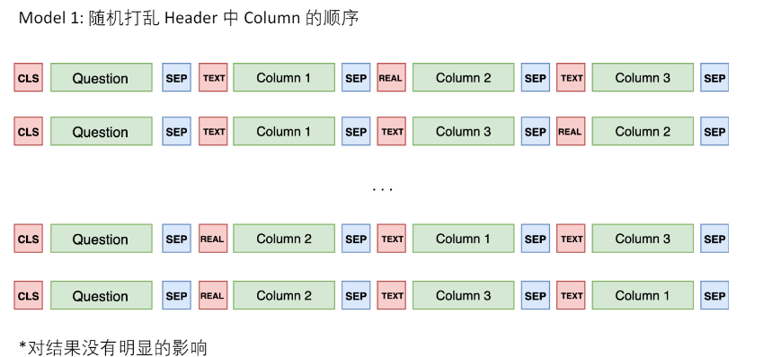
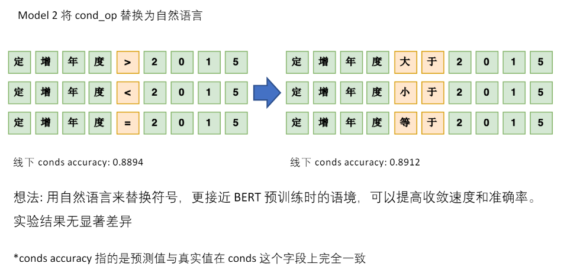

# Text2SQL

举例：什么是Text2SQL（NL2SQL）

例如我有一张“歌手”相关的表格，歌迷和狗仔队们

想知道：  

Q：“周杰伦和林俊杰最近的演唱会是什么时候？”

Text2SQL模型自动将问题转换为SQL语言：

A：“**SELECT**  近期演唱会 **FROM**  singer **WHERE**  姓名 = 周杰伦 **OR**  姓名 = 林俊杰”

再返回查询结果：“北京-01.08”和“上海-04.28”

## 数据集

比较有名的，包括有关机票订阅的ATIS数据集、有关地理信息查询的GeoQuery、基于维基百科的WikiSQL以及目前最复杂的多领域数据集Spider。在中文Text-to-SQL任务方面，西湖大学公布的CSpider数据集，追一科技在天池数据平台举行的第一届中文text2sql挑战赛。

根据每个数据库包含表的数量，数据集分为单表和多表模式。在多表模式中，SQL生成涉及到表格的选择。根据完整SQL生成所需轮数，数据集分为单轮和多轮。若SQL生成融进渐进式对话，则数据集增加“结合对话”标记。当前只有CoSQL数据集是融进对话的数据集。

AITS：机票订阅系统，单领域，上下文相关，[https://www.kaggle.com/siddhadev/ms-cntk-atis](https://www.kaggle.com/siddhadev/ms-cntk-atis)

GeoQuery：美国地理，单领域，上下文无关

WikiSQL：规模大，每个问题只涉及一个表格，[https://github.com/salesforce/WikiSQL](https://github.com/salesforce/WikiSQL)

Spider：目前最复杂的Text-to-SQL数据集，领域丰富，SQL语句更复杂。Spider相比WikiSQL，对模型的跨领域、生成复杂SQL的能力提出了新的要求，目前的最佳模型也只有60%左右的准确度。[https://yale-lily.github.io/spider](https://yale-lily.github.io/spider)

CSpider：Spider作为源数据集进行了问题的翻译，[https://taolusi.github.io/CSpider-explorer/](https://taolusi.github.io/CSpider-explorer/)

SParC：Spider的上下文相关版本。数据库基于Spider，模拟了用户进行数据库查询的过程：用户通过若干条相关的提问最后达到一个最终查询目的。[https://yale-lily.github.io/sparc](https://yale-lily.github.io/sparc)

追一科技的数据集官方Github上有TableQA：[https://github.com/ZhuiyiTechnology/TableQA](https://github.com/ZhuiyiTechnology/TableQA)

百度也有一个比赛：语义解析任务[https://aistudio.baidu.com/aistudio/competition/detail/30?isFromCcf=true](https://aistudio.baidu.com/aistudio/competition/detail/30?isFromCcf=true)，讨论区有人提供数据集

WikiTableQuestions：是斯坦福大学于 2015 年提出的一个针对维基百科中那些半结构化表格问答的数据集，包含了 22,033 条真实问句以及 2,108 张表格。[https://github.com/ppasupat/WikiTableQuestions](https://github.com/ppasupat/WikiTableQuestions)

[CHASE](https://xjtu-intsoft.github.io/chase/) 多轮交互中文Text2SQL **(ACL 2021)** ：2021年，微软亚研院和北航、西安交大联合提出的首个大规模上下文依赖的Text-to-SQL中文数据集。内容分为CHASE-C和CHASE-T两部分，CHASE-C从头标注实现，CHASE-T将Sparc从英文翻译为中；相比以往数据集，CHASE大幅增加了hard类型的数据规模，减少了上下文独立样本的数据量，弥补了Text2SQL多轮交互任务中文数据集的空白。[https://mp.weixin.qq.com/s/XSktVk6rxvLMKMjW0kDIEQ](https://mp.weixin.qq.com/s/XSktVk6rxvLMKMjW0kDIEQ)

现阶段的问题

- WikiSQL 数据集的数据形式和功能薄弱

- 条件的表达只支持最基础的 `>、<、=`

- 条件之间的关系只有 `and`

- 不支持聚组、排序、嵌套等其它众多常用的 SQL 语法

- 不需要联合多表查询答案，真实答案所在表格已知

- 这样的数据集并不符合真实的应用场景

- Query Structure中的元素不存在递归关系

- 天池TableQA（5w，中文），样本量少，且结构简单

如何更好地结合数据库信息来理解并表达用户语句的语义、如何编码及表达数据库的信息、如何生成复杂却有必要的 SQL 语句，此类挑战还有很多需要解决，它们都是非常值得探索的方向。

## 评价方法

精确匹配率（exact match , Accqm）：指预测得到的SQL与正确的SQL语句在SELECT、WHERE等模块达到字符串完全匹配，即整句匹配。

执行正确率（execution accuracy, Accex）：执行预测得到的SQL语句，数据库能够返回正确答案。

目前WikiSQL支持exactmatch和execution accuracy，Spider仅支持exact match。

## 模型介绍

Text-to-SQL任务。该任务包含两部分：Text-to-SQL解析器和SQL执行器。解析器的输入是给定的数据库和针对该数据库的问题，输出是问题对应的SQL查询语句，如图中红色箭头标示。SQL执行器在数据库上完成该查询语句的执行，及给出问题的最终答案。

根据SQL的构成，解析器需要完成两个任务，即“问题与数据库的映射”和“SQL生成”。在问题与数据库的映射中，需要找出问题依赖的表格以及具体的列。在SQL生成中，结合第一步识别结果以及问题包含信息，生成满足语法的SQL查询语句。

在当前深度学习研究背景下，Text-to-SQL任务可被看作是一个类似于神经机器翻译的序列到序列的生成任务，主要采用Seq2Seq模型框架。基线Seq2Seq模型加入注意力、拷贝等机制后，在单领域数据集上可以达到80%以上的准确率，但在多领域数据集上效果很差，准确率均低于25%。

从**编码** 和**解码** 两个方面进行原因分析。

在编码阶段，问题与数据库之间需要形成很好的对齐或映射关系，即问题中涉及了哪些表格中的哪些元素（包含列名和表格元素值）；同时，问题与SQL语法也需要进行映射，即问题中词语触发了哪些关键词操作（如Group、Order、Select、Where等）、聚合操作（如Min、Max、Count等）等；最后，问题表达的逻辑结构需要表示并反馈到生成的SQL查询语句上，逻辑结构包括嵌套、多子句等。

在解码阶段，SQL语言是一种有逻辑结构的语言，需要保证其语法合理性和可执行性。普通的Seq2Seq框架并不具备建模这些信息的能力。

### 模型主要方向

#### 模版与规则匹配

几乎90%的SQL语句都可以抽象成如下的模版片段：

AGG表示聚合函数，COLUMN表示需要查询的目标列，WOP表示多个条件之间的关联规则“与/或”，三元组 [COLUMN, OP, VALUE] 构成了查询条件，分别代表条件列、条件操作符、从问题中抽取出的文本片段。*表示目标列和查询条件不止一个！

有了SQL模版，可以先通过统计方法从语料中挖掘出一些高频实体，如人名、地名等，再根据规则填充到模版相应片段即可。

#### 端到端多任务架构

共享编码器+多任务解码的Seq2Seq架构。

共享编码器一般是用词向量或预训练语言模型，对query、table和column进行联合编码，捕捉其中隐含的链接关系。其中后两项（表名和列名）统称为数据库模式。例如使用BERT等语言模型时，习惯将输入拼接为 “[CLS] query [SEP] table [SEP] column1 [SEP] column2 [SEP] .... [SEP]”这样的长序列，经过多层Transformer编码，不同table和column对于问题query会有不同权重的相关性。

解码器根据SQL语法特点，设计多个不同的子网络。例如，针对SQL模版，可以设计6个子任务分别预测查询目标列、目标列的聚合函数等SQL片段，最终拼接出完整SQL。

多任务架构的优点在于针对不同SQL片段，可以设计有效的损失函数；同时在训练过程中子任务的准确率可以实时监控，便于落地。例如M-SQL。

主流模型的改进与后续工作主要围绕着以下几个方面展开：通过更强的表示（BERT、XLNet）、更好的结构（GNN）来显式地加强Encoder端的对齐关系及利用结构信息；通过树形结构解码、填槽类解码来减小搜索解空间，以增加SQL语句的正确性；通过中间表示等技术提高SQL语言的抽象性；通过定义新的对齐特征，利用重排序技术，对beamsearch得到的多条候选结果进行正确答案的挑选；以及非常有效的数据增强方法。

#### 端到端抽象语法树解码

这种方法的编码器与前一节类似，但是在解码时将SQL视作一棵抽象语法树，树中各个结点是SQL的关键字（SELECT、WHERE、AND...）或者表名和列名的候选值。生成SQL的过程相当于从树的根结点对语法树做一次深度优先搜索。

以节点“SELECT”为例，“SELECT”节点往下可能包含3个叶子节点：“Column”、“AGG”、“Distinct”，分别代表“选取某一列”、“增加聚合操作”、“对列去重”。从“SELECT”节点向下搜索相当于是3分类任务，根据真实路径和搜索路径依次计算各个节点的交叉熵并求和，作为总损失。

**抽象语法树的思想避免了设计各种各样的子网络，对于涉及跨表查询、嵌套查询的复杂数据集有很好的效果** 。在领域内权威比赛Spider上取得优异成绩的顶会模型IRNet（Towards complex text-to-SQL in cross-domain database with intermediate representation）、Rat-SQL（RAT-SQL: Relation-aware schema encoding and linking for text-to-SQL parsers），都充分借鉴了语法树思想。

其实语法树不仅仅可以生成SQL，还可以生成各种各样好玩的目标序列，例如Python/Java等编程语言，音乐音符等等。CMU的这篇论文（A Syntactic Neural Model for General-Purpose Code Generation）从文本生成了Python。

### 基于Pointer Network的改进

#### Pointer Network

传统的seq2seq模型的解码器部分所使用的单词表是固定的，即在生成序列中都是从固定的单词表中进行选取。但Text-to-SQL不同于一般的seq2seq任务，它的生成序列中可能出现：a）问句中的单词；b) SQL关键字；c)对应数据库中的表名、列名。

Pointer Network很好地解决了这一问题，其输出所用到的词表是随输入而变化的。具体做法是利用注意力机制，直接从输入序列中选取单词作为输出。

在Text-to-SQL任务中，可以考虑把用户的提问以及目标SQL语句可能出现的其他词作为输入序列 (列名单词序列；SQL的关键字表；问题的单词序列），利用PointerNetwork直接从输入序列中选取单词作为输出。在解码器的每一步，与编码器的每一个隐层状态计算注意力分数，取最大值作为当前的输出以及下一步的输入。

由于Pointer Network可以较好的满足具体数据库无关这一要求，在多领域数据集上的模型大多使用该网络，如Seq2SQL、STAMP、Coarse2Fine 、IRNet等模型。

#### Seq2SQL

Pointer Network虽然一定程度上解决了问题，但是它并没有利用到SQL语句固有的语法结构。Seq2SQL将生成的SQL语句分为三个部分：聚合操作：（SUM、COUNT、MIN、MAX等）、SELECT：选取列、WHERE：查询条件。每一部分使用不同的方法进行计算。

SELECT与聚合操作，均采用了注意力机制进行分类。WHERE子句可以利用前面介绍的Pointer Network进行训练，但是对于很多查询来说，WHERE子句的写法并不是唯一的，例如：

SELECT name FROM insurance WHERE age > 18 AND gender ="male";

SELECT name FROM insurance WHERE gender = "male"AND age > 18;

这可能导致原本正确的输出被判断为错误的。于是作者提出利用强化学习基于查询结果来进行优化。在解码器部分，对可能的输出进行采样，产生若干个SQL语句，每一句表示为y=[y1, y2 ... yT]，用打分函数对每一句进行打分：

### 基于Sequence-to-set的改进

#### SQLNet

为了解决Seq2SQL使用强化学习效果不明显的问题，SQLNet将SQL语句分成了SELECT和WHERE两个部分，每个部分设置了几个槽位，只需向槽位中填入相应的符号即可。

SELECT子句部分与Seq2SQL类似，不同地方在于WHERE子句，它使用了一种sequence-to-set（由序列生成集合）机制，基于所有的列预测其属于哪个关键词（即属于Select还是Where，在SQLNet模型中仅预测是否属于Where），针对SQL 中每一个关键词选择概率最高的前K个列（WHERE子句中的条件个数k是计算出来的）。最后通过注意力机制进行分类得到操作符和条件值。

该模式适用于SQL形式简单的数据集，在WikiSQL和NL2SQL这两个数据集合上使用较多，且衍生出很多相关模型，如TypeSQL、SQLova、X-SQL等。

#### TypeSQL

该模型基于SQLNet，使用模版填充的方法生成SQL语句。为了更好地建模文本中出现的罕见实体和数字，TypeSQL显式地赋予每个单词类型。

类型识别过程：将问句分割n-gram （n取2到6），并搜索数据库表、列。对于匹配成功的部分赋值column类型赋予数字、日期四种类型：INTEGER、FLOAT、DATE、YEAR。对于命名实体，通过搜索FREEBASE，确定5种类型：PERSON，PLACE，COUNTREY，ORGANIZATION，SPORT。这五种类型包括了大部分实体类型。当可以访问数据库内容时，进一步将匹配到的实体标记为具体列名（而不只是column类型）

SQLNet为模版中的每一种成分设定了单独的模型；TypeSQL对此进行了改进，对于相似的成分，例如SELECT_COL 和COND_COL以及#COND（条件数），这些信息间有依赖关系，通过合并为单一模型，可以更好建模。TypeSQL使用3个独立模型来预测模版填充值：

- MODEL_COL：SELECT_COL，#COND，COND_COL

- MODEL_AGG：AGG

- MODEL_OPVAL：OP, COND_VAL

#### SyntaxSQLNet

相比于之前decoder输出一段线性的文本，SyntaxSQLNet将解码的过程引入了结构性信息，即解码的对象为SQL语句构成的树结构。通过该技术，模型的精确匹配率提高了14.8%。

SyntaxSQLNet将SQL语句的预测分解为9个模块，每个模块对应了SQL语句中的一种成分。解码时由预定义的SQL文法确定这9个模块的调用顺序，从而引入结构信息。树的生成顺序为深度优先。分解出的9个模块有：

- IUEN模块：预测INTERCEPT、UNION、EXCEPT、NONE（嵌套查询相关）

- KW模块：预测WHERE、GROUP BY、ORDER BY、SELECT关键字

- COL模块：预测列名

- OP模块：预测>、<、=、LIKE等运算符

- AGG模块：预测MAX、MIN、SUM等聚合函数

- Root/Terminal模块：预测子查询或终结符

- Module模块：预测子查询或终结符

- AND/OR模块：预测条件表达式间的关系

- DESC/ASC/LIMIT模块：预测与ORDERBY相关联的关键字

- HAVING模块：预测与GROUPBY相关的Having从句

该工作同时提供了一种针对text2sql任务的数据增强方法，生成跨领域、更多样的训练数据。通过该技术，模型的精确匹配率提高了7.5%。

具体做法为：对SPIDER中的每条数据，将值和列名信息除去，得到一个模板；对处理后的SQL模版进行聚类，通过规则去除比较简单的模板，并依据模板出现的频率，挑选50个复杂SQL模板；人工核对SQL-问句对，确保SQL模板中每个槽在问句中都有对应类型的信息。

得到一一对应的模板后，应用于WikiSQL数据库：首先随机挑选10个模板，然后从库中选择相同类型的列，最后用列名和值填充SQL模板和问句模板。通过该方法，作者最终在18000的WikiSQL数据库上得到了新的98000组训练数据，同时在训练的时候也利用了WikiSQL数据集原有的训练数据。

### 基于TRANX（自顶向下文法生成）的改进

复杂问题对应的SQL查询语句形式也复杂，涉及到多关键词组合、嵌套、多子句等。并且，测试集合中的某些SQL查询语句形式在训练集合中没有见过，这就要求模型不仅对新数据库具有泛化能力，对新SQL查询语句形式也要有泛化能力。

针对这种情况，需要更多关注生成SQL的逻辑结构。为了保证SQL生成过程中语法合理，一些模型开始探索及使用语法树生成的方法。

TRANX框架借鉴了AST论文思想，根据目标语言的语法构建规约文法，基于该文法可以将生成目标表示为语法树（需要保证生成目标与语法树表示一一对应），然后实现了自顶向下的语法树生成系统，给出了该系统流程。

我们简单介绍一下基于该系统实现Text-to-SQL任务。

首先，根据SQL语法制定规约文法（对应下图中的ASDL Grammar），需要保证每一条SQL查询语句均可由该文法产出。

其次，设计动作集合用于转移系统（下图中的Transition System），基于该转移系统选择合理的规约文法生成语法树，该转移系统将语法树的生成转成动作序列的生成，即转成一系列文法的选择序列，文法在选择过程中保证了合理性（即孩子节点文法均在父节点允许的文法范围内）；该动作序列的生成可基于Seq2Seq等框架进行。

该框架在代码生成、SQL生成等任务上都已验证过，在Text-to-SQL任务上的模型包括IRNet、Global GNN、RATSQL等。

#### IRNet

与SyntaxSQLNet类似，IRNet定义了一系列的CFG文法，将SQL转发为语法树结构。可以将其看作一种自然语言与SQL语句间的中间表示（作者称之为SemQL），整个parsing的过程也是针对SemQL进行的。如图所示：

作者另一部分的改进主要在schemelinking，即如何找到问题中所提到的表格与列。他将问题中可能出现的实体分为3类：表格名、列名、表中的值。根据3类实体的不同，具体做法分为：a）表格名和列名：以n-gram的形式枚举问题中的span，然后和表格名、列名进行匹配。可以看到下图中的Question中对应的单词有的被标成了Column或者Table。b) 表中的值：将问题中以引号为开头结尾的span，送给ConceptNet进行查询，再将返回结果中的 ‘is a type of’/'related terms'关系的词与列名进行匹配。

#### Global-GNN

为了更好的利用关系型数据库的结构信息，BenBogin等研究人员提出使用图网络来建模表格名和列名。如下图所示：圆圈加粗的结点代表表格，不加粗的结点代表列名；双向边代表表格和列名的从属关系；红虚边和蓝虚边代表主外键关系。橙色节点代表与问题有关的结果，淡色为无关。

除此之外，该团队还提出了一种基于全局信息重排序的做法。首先先看下面这个例子，我们不知道name到底指向的是singer还是song，但是我们可以观察到nation只在singer中出现，[所以应该是singer.name](http://xn--singer-2x8iu48hx5g19jds8h.name)。这样做globalreasoning，就能减小歧义性。

#### RAT-SQL

该工作可以看作图网络GNN的后续工作，作者在Table、Column、Question三者之间定义了更多的边（共33种），是目前榜单上的最强模型。

Global-GNN只建模了Table和Column的联系，RAT-SQL在此基础上又在图中加入Question的节点，而且利用字符串匹配的方法丰富了边的类型。

表2 RAT SQL新定义的边关系

表3 模型效果比较（Acc ex: 执行结果；Acc em: SQL完全匹配；Acc qu: SQL无序匹配）

### XSQL

[https://arxiv.org/pdf/1908.08113](https://arxiv.org/pdf/1908.08113)

X-SQL是微软提出的NL2SQL模型，参考了SQLNet、SQLova等模型的思路.

X-SQL 的模型架构分为三层 (如下所示)：

&ensp;&ensp;&ensp;&ensp;- Encoder: 首先使用 bert 风格的预训练模型（MT-DNN） 对 Question 和 SQL 表格进行编码和特征提取， 得到上下文输出来增强结构模式表示，并结合类型信息;

&ensp;&ensp;&ensp;&ensp;- Context Reinforcing Layer: 该结构用于增强在 equence Encoder （序列编码器）得到的 H_[CTX]， 从而得到增强的语义表示 HCi ；

&ensp;&ensp;&ensp;&ensp;- Output Layer: 输出层完成 SQL 语句的生成，我们将其分为 6 个子任务（select-column, select-aggregation, where-number, where-column, where-operator, and where-value），这六个任务彼此之间相互结合，彼此制约。

**X-SQL模型—Encoder** 

X-SQL使用了一个BERT-Like模型MT-DNN作为Token Sequence Encoder，同时进行以下修改：

- 引入了一个特殊空列`[EMPTY]`的概念，并将其追加到每个Table Schema后面；

- BERT中的`Segment Embedding`被替换为`Type Embedding`，包括：Question 、Categorial Column、Numerical Column、Special Empty Column 这四种类型；

- 此外，单纯地将标志位`[CLS]`重命名为`[CTX]`

**X-SQL模型—Context Reinforcing Layer** 

- 对上一层Encoder的输出 H_[CTX] 进一步“强化”，从而为表的每一列学习新的表示h_Ci

- 这种强化体现在两方面：

&ensp;&ensp;&ensp;&ensp;- 由于Column Tokens的输出长短不一，所以需要对Column Embeddings进行“调整”；

&ensp;&ensp;&ensp;&ensp;- 此外为了加强Context的影响，在Alignment Model中会使用到Context Embedding的信息；

通过这种方式可以捕获到哪一个查询词与哪一列最相关，从而得到增强的语义表示 HCi 。它的计算过程如下所示： $s_{it}=f(Uh[CTX]/\sqrt d,VhCit/\sqrt d)$

$a_{it}=softmax(s_{it})$

$h_{C_i}=\sum_{t=1}^{ni}a_{it}h_{C_it}$

其中，f只是普通的点乘 (dot-product) 操作。最后，针对每一列 (schema representation h_Ci)，独立的使用下面的子网络结构得到使用融合 h_Ci 和 hctx 的 `rCi`，公式如下所示： $r_{C_i}=LayerNorm(U^ih_{[CTX]}+V^ih_{C_i})$

**X-SQL模型—Output Layer** 

Output层由六个子分类器构成：

- S-COL：查询表的哪一列

- S-AGG： 使用什么聚合函数

- **W-NUM** ： 查找where子句的数量（四个可能标签的分类，每个标签表示1~4 ）

- W-COL：选择表的哪几列

- W-OP： 对这几列的操作符

- W-VAL： 这几列的值

其中五个子模型的输出会被填到QueryStructure中。w-col、w-op 和 w-val 这三个任务是依赖 w-num 的，因为 w-num 决定了对几列进行约束，这样它们三个只需要取 softmax 最大的那几个。

每个子模型的说明：

在训练过程中，我们优化目标是所有单个子任务损失的总和。

### BERT

[Bridging Textual and Tabular Data for Cross-Domain Text-to-SQL Semantic Parsing](https://arxiv.org/pdf/2012.12627v2.pdf)

**开源代码：** *https://github.com/salesforce/TabularSemanticParsing* 

论文提出的模型BRIDGE采用了主流的Seq2Seq架构，把Text2SQL视作翻译问题（原序列：text，目标序列：SQL），包含编码器和解码器。

论文中将跨领域的text-to-SQL任务定义：给定**自然语言问句Q和关系型数据库模式** $S=<\Gamma,C>$，模型需要生成对应的SQL查询Y 。一个数据库中可能包含很多张表$t_i$，一张表又包含多个字段$c_{i,j}$

> 编码器

编码器的目的是**对Q和S分别做向量编码，同时对两者之间的关系充分交互** 。

论文中，作者将Q和S拼接为一个**混合的问题-模式序列**  ，作为编码器的输入：

每一个表名、字段名分别用字符[T]**和** [C]分隔。问题Q和S之间用字符[SEP]分隔。最后，在开始位置插入[CLS]字符。

**这样的序列既符合BERT的输入格式，从而优雅地编码跨模态信息，又能快速获取任意字段的编码向量** （提取[T]/[C]对应特征即可）。

 X首先输入BERT，随后经过一层双向LSTM获得序列的初始编码表示 $h_X$。$h_X$中的问题片段继续通过一层bi-LSTM获得Q的最终编码$h_Q$

> Meta-data Features

相比于表名，字段名多了主键、外键等属性。为了利用这些特征（meta-data），论文中用了一层前馈网络对表名、字段名进一步编码。

f分别表示各个字段的主键、外键、类型特征，$h_X^q$表示字段特征。将4个向量横向顺序拼接，经过函数g转化，得到每一个字段的最终向量表示。

表名没有额外特征，后三个维度均用零向量替代。各个表名、字段名都进行g函数转化，纵向拼接得到模式的最终编码$ h_S$。

> Bridging

截至目前，仅仅完成了Q和S的各自编码。交互在哪呢？

为了解决这个问题，作者使用锚文本（**anchor text** ）将问题Q中包含的单元值与数据库字段链接起来。

具体实现上，作者将问题Q中的每一个token，与数据库表中每一列的所有value值进行字符串模糊匹配，匹配上的value值将被插入到序列X中。

如上图所示，问题Q和表格“*Properties* ”、“*Reference Property Types* ”相关联。其中Q包含的两个单词“*houses* ”和“*apartments* ”与两张表中的同名字段“*Property type code* ”有**重合单元值** 。

字段名“*Property type code* ”本身没有在问题Q中出现，让模型直接推理出“*houses* ”、“*apartments* ”和“*Property type code* ”相关，难度很大。

**所以作者在**  X**中把和问题有关的单元值人为拼接在相应字段** 之后，相当于直接告诉**BERT** 哪些问题片段包含引用。

作者把这种方式称为“**bridging** ”，即模型BRIDGE的由来。

> 解码器

解码器的目的是从编码特征中还原出相应SQL。

相比于前人的工作（RAT-SQL、IRNet等），BRIDGE解码器设计非常简洁，仅使用了一层带多头注意力机制的LSTM指针生成网络。

在每一个step中，解码器从如下动作中选择1种：

> 1、从词汇表V中选择一个token（SQL关键字）  
2、从问题Q中复制一个token
3、从模式S中复制一个组件（字段名、表名、单元值）

## 追一科技NL2SQL比赛

追一科技的比赛相关：

- [https://github.com/ZhuiyiTechnology/nl2sql_baseline](https://github.com/ZhuiyiTechnology/nl2sql_baseline)（追一科技Baseline）

- [基于Bert的NL2SQL模型：一个简明的Baseline](https://kexue.fm/archives/6771)（苏剑林）

- [https://github.com/bojone/bert_in_keras/blob/master/nl2sql_baseline.py](https://github.com/bojone/bert_in_keras/blob/master/nl2sql_baseline.py)（苏剑林Baseline）

- [https://github.com/nudtnlp/tianchi-nl2sql-top1](https://github.com/nudtnlp/tianchi-nl2sql-top1)（冠军方案PPT，无代码）

- [https://www.qbitai.com/2019/10/7994.html](https://www.qbitai.com/2019/10/7994.html)（比赛相关报道，冠军方案简介）

- [https://tianchi.aliyun.com/forum/postDetail?spm=5176.21852664.0.0.255d379coxK40C&postId=78781](https://tianchi.aliyun.com/forum/postDetail?spm=5176.21852664.0.0.255d379coxK40C&postId=78781)（冠军方案攻略）

- [https://github.com/beader/tianchi_nl2sql](https://github.com/beader/tianchi_nl2sql)（第三名的方案，有代码）

- [https://tianchi.aliyun.com/forum/postDetail?spm=5176.12586969.1002.3.694d5fc6rFoWZD&postId=78855](https://tianchi.aliyun.com/forum/postDetail?spm=5176.12586969.1002.3.694d5fc6rFoWZD&postId=78855)（第二名）

- [https://github.com/eguilg/nl2sql](https://github.com/eguilg/nl2sql)（第六名）

- [https://tianchi.aliyun.com/forum/postDetail?spm=5176.12586969.1002.3.694d5fc6pF6RyJ&postId=78855](https://tianchi.aliyun.com/forum/postDetail?spm=5176.12586969.1002.3.694d5fc6pF6RyJ&postId=78855)（亚军比赛攻略）

首届中文NL2SQL挑战赛，使用金融以及通用领域的表格数据作为数据源，提供在此基础上标注的自然语言与SQL语句的匹配对，希望选手可以利用数据训练出可以准确转换自然语言到SQL的模型。

模型的输入为一个 Question + Table，输出一个 SQL 结构，该 SQL 结构对应一条 SQL 语句。示例如下图黄色部分，需要预测的有4部分：

- 挑选的列(sel)

- 列上的聚合函数(agg)

- 筛选的条件(conds)

- 条件间的关系(cond_conn_op)

任务数据

- 4万条有标签数据作为训练集

- 1万条无标签数据作为测试集

评价指标

- **全匹配率 (Logic Form Accuracy)** : 预测完全正确的SQL语句。其中，列的顺序并不影响准确率的计算。

- **执行匹配率 (Execution Accuracy)** : 预测的SQL的执行结果与真实SQL的执行结果一致。

官方的评估指标是 `(全匹配率 + 执行匹配率) / 2`，也就是说你有可能写出跟标注答案不同的SQL语句，但执行结果是一致的，这也算正确一半。

难点分析

- 不限制使用表格内容信息

- 存在conds value不能从question提取的样本

- select agg存在多项

- 没有conds缺失的样本

### 苏神baseline

[https://kexue.fm/archives/6771](https://kexue.fm/archives/6771)

作为一个SQL，最基本的是要决定哪些列会被select，而每个表的列的含义均不一样，所以我们要将question句子连同数据表的所有表头拼起来，一同输入到Bert模型中进行实时编码，其中每一个表头也视为一个句子，用[CLS]***[SEP]括住。经过Bert之后，我们就得到了一系列编码向量，然后就看我们怎么去用这些向量了。

第一个[CLS]对应的向量，我们可以认为是整个问题的句向量，我们用它来预测conds的连接符。后面的每个[CLS]对应的向量，我们认为是每个表头的编码向量，我们把它拿出来，用来预测该表头表示的列是否应该被select。注意，此处预测有一个技巧，就是前面说了除了预测sel外，还要预测对应的agg，其中agg一共有6个类别，代表不同的距离运算，既然如此，我们干脆多增加一个类别，第7个类别代表着此列不被select，这样一来，每一列都对应着一个7分类问题，如果分到前6类，那么代表着此类被select而且同时预测到了agg，如果分到了第7类，那意味着此类不被select。

现在就剩下比较复杂的conds了，就是`where col_1 == value_1`这样子的，col_1、value_1以及运算符==都要找出来。conds的预测分两步，第一步预测条件值，第二步预测条件列，预测条件值其实就是一个序列标注问题，而条件值对应的运算符有4个，我们同样新增一类变成5类，第5类代表着当前字不被标注，否则就被标注，这样我们就能预测出条件值和运算符了。剩下的就是预测条件值对应的列，我们将标注出来的值的字向量跟每个表头的向量一一算相似度，然后softmax。我这里算相似度的方法是最简单的，直接将字向量和表头向量拼接起来，然后过一个全连接层后再接一个`Dense(1)`。

其中我们说过条件值不一定出现在question中，那如何用对question字标注的方法来抽取条件值呢？

我的方法是，如果条件值不出现在question，那么我就对question分词，然后找出question的所有1gram、2gram、3gram，然后根据条件值找出一个最相近的ngram作为标注片段。而在预测的时候，如果找到了一个ngram作为条件值、并且运算符为==时，我们会判断这个ngram有没有在数据库出现过，如果有直接保留，如果没有则在数据库中找一个最相近的值。

[nl2sql_baseline.py](file/nl2sql_baseline.py)

### **第一名解决方案M-SQL** 

[MSQL.pdf](file/MSQL.pdf)

[M-SQL](M-SQL/M-SQL.md)

1. **将原始的 Label 做一个简单的变换** 

1. **对输入进行改造** 

将 Question 与 Header 顺序连接， 其中每一个表头也视为一个句子，用`[CLS]***[SEP]`括住。

1. **M-SQL 模型架构** 

第一个`[CLS]`对应的向量，我们可以认为是整个问题的句向量，我们用它来预测`XXX`的连接符。后面的每个[CLS]对应的向量，我们认为是每个表头的编码向量，我们把它拿出来，用来预测该表头表示的列是否应该被select . 现在就剩下比较复杂的conds了，就是`where col_1 == value_1`这样子的，col_1、value_1以及运算符==都要找出来。

**两个较特殊的改进：** 

- W-col-val模型

&ensp;&ensp;&ensp;&ensp;- 相较于X-SQL的W-VAL预测Value的首尾偏移量，W-col-val改用了序列标注的方式提取Where Value；

- W-val-match模型

&ensp;&ensp;&ensp;&ensp;- 提取各列的 Distinct Value Set，基于Matching的方式匹配最可能的【列-值】；

&ensp;&ensp;&ensp;&ensp;&ensp;&ensp;&ensp;&ensp;- 基于文本的匹配：rouge-L、编辑距离等；

&ensp;&ensp;&ensp;&ensp;&ensp;&ensp;&ensp;&ensp;- 基于语义的匹配：LR、MLP、相似度计算等

**M-SQL在X-SQL的基础上进行了调整和扩展** (对比)

- Encoder：

&ensp;&ensp;&ensp;&ensp;- 预训练模型更换（MT-DNN → Bert-wwm-ext）;

&ensp;&ensp;&ensp;&ensp;- Token/TokenType调整；

- Column Representation：基本和X-SQL一致；

- Sub-models：

&ensp;&ensp;&ensp;&ensp;- 增加S-num辅助任务

&ensp;&ensp;&ensp;&ensp;- 合并W-NUM和Reducer预测；

&ensp;&ensp;&ensp;&ensp;- 将原本的W-VAL换成了W-col-val和W-val-match；

&ensp;&ensp;&ensp;&ensp;- (待定) 把sel与agg结合，当作多分类问题

现在Bert可用的中文预训练权重有两个

- 一个是[官方版](https://github.com/google-research/bert)的

- 一个是[哈工大版](https://github.com/ymcui/Chinese-BERT-wwm)的

两个的最终效果差不多，但是哈工大版的收敛更快。

复现过程

**Part1: 预处理** 

首先对question进行了格式统一,具体如下:

1. 百分数转换，例如**百分之10** 转化为**10%** ,**百分之十** 转换为**10%** , 百分之一点五转化为**1.5%** 

2. 大写数字转阿拉伯数字，例如**十二** 转换为**12** ; **二十万** 转化为**200000** ; 一点二转化为**1.2** 

3. 年份转换，如将12年转换为2012年

4. 利用规则与编辑距离对query进行修正

5. query信息标记：[CLS] -> [XLS]

然后，SQL分析

- 常用的SQL模式分析

**Part2:模型介绍** 

- 预训练模型：Bert-wwm-ext，哈工大

- W-num，W-op融合

**Part3: 后处理** 

**Part4: 模型效果评估** 

**Part5: 网络/应用** 

通过云服务构建服务器后，构建可与各种DBMS链接的网页

### 第三名解决方案

我们将原始的 Label 做一个简单的变换

- 将 `agg` 与 `sel` 合并，`agg` 中对表格中每一列都做预测，新的类别 `NO_OP` 表明该列不被选中

- 将 `conds` 分为 `conds_ops` 与 `conds_vals` 两个部分，这么做的原因是想分两步进行预测。由一个模型先预测 `conds` 需要选取哪些列以及操作符，再由另一个模型预测所选取的列的比较值

Model 1 将 Question 与 Header 顺序连接，在每个 Column 之前添加一个特殊标记，`TEXT` 或 `REAL`，这两个特殊的 Token 可以从 BERT 预留的未训练过的 Token 中任选两个来代替。

Model 1 的架构如下:

[CLS]标记以及每个column对应的[TEXT|REAL]标记所在位置的向量表征，分别通过对应的Dense Layer，输出相应的类别。三个tasks均使用cross entropy error，整体的loss为各task loss之和。

Model 2 则负责 `cond_val` 的预测。我们的思路是根据 Model 1 选择的 `cond_col`，枚举 `cond_op` 与 `cond_val`，生成一系列的候选组合，将这些组合当成多个二分类问题来做

Model 2 的架构如下:

最后将 Model 2 对一些列候选组合的预测合并起来

一些探索尝试

这里conds_ops的预测融入agg的信息，即将模型对agg的输出拼接到conds_ops的输入中，让模型输出conds_ops时能结合agg的信息。Model 1的总体Accuracy从0.855提升到0.865.

调整Model 1 Loss Weight

#### 和苏神版的差异

第三名方案一开始是参考苏神版本的。

**分词器** 

苏重新定义了_tokenize方法，第三名除此之外，还自己定义了_pack，tokenize和encode方法，主要是为了处理多个句子（默认的只处理两个句子），把问题和table的header拼接起来。

SqlLabelEncoder：把sql处理成训练用的label

**数据生成** 

苏只生成了训练数据，测试数据和验证数据不需要生成，直接分词处理后预测。在数据生成时，进行分词，将问题的分词结果和table的header的分词结果拼接起来。并且得到label（select的列，条件之间的关系，条件列和条件运算符，条件值）。

模型的输入token_ids有一点不一样，header的左边，苏是CLS，三是根据header的类型决定是TEXT还是REAL。

苏：[CLS]+question+[SEP]+[CLS]+header1+[SEP]+[CLS]+header2+[SEP]+...

三：[CLS]+question+[SEP]+[TEXT]+textheader1+[SEP]+[REAL]+realheader2+[SEP]+...

模型的输入segment_ids都是一样，都是0

label：（假设表格的列数是num_cols）

op_sql_dict = {0: ">", 1: "<", 2: "==", 3: "!=", 4:"不被select"} 
agg_sql_dict = {0: "", 1: "AVG", 2: "MAX", 3: "MIN", 4: "COUNT", 5: "SUM", 6:"不被select"}  
conn_sql_dict = {0: "", 1: "and", 2: "or"}

（注意这里面不被select的数字三没有明确说明，但是在label设置里默认是不被select，然后根据真实标签修改）

- cond_conn_op_label都一样，就是连接符对应的数字0-2

- sel_agg_label，都是一个num_cols长度的列表，每个元素是0-6之间的数字

- cond_op_label，苏是一个长度为len(question)+2的列表，标注每个字对应的运算符数字（默认是4，不被select）；三是一个num_cols长度的列表，每个元素是0-4之间的数字。

- conds_vals，苏是一个长度为len(question)+2的列表，标注每个字对应的条件列数字（默认是0，第一列）；三是模型二多个二分类任务，提取的每个val值的标签是0或者1。

**模型** 

- 第一个CLS预测conds的连接符（and, or这些），cond_conn_op是一个单标签分类。

- 每个表头的CLS（或text,real）用来预测该表头是否被select（每一列对应一个7分类问题）。sel&agg的列看做多分类问题，每一列对应着一个标签，表示是否select或agg。

- 预测条件值：苏是将预测条件值和运算符放在一起，一个序列标注问题，分为5类（不标注或者标注且是某个运算符），问题的每个字对应一个标签。三是根据 Model 1 选择的 `cond_col`，枚举 `cond_op` 与 `cond_val`，生成一系列的候选组合，将这些组合当成多个二分类问题来做。（模型二的输入是question的文本作为first，例如列名='上海'作为second）

- 预测条件列：苏是将标注出来的值的字向量跟每个表头的向量一一算相似度（直接将字向量和表头向量拼接起来，然后过一个全连接层后再接一个Dense(1)），然后softmax。三是将预测条件列和运算符放在一起，将每个表头的text或real和模型对agg的输出拼接，然后softmax预测条件列对应的运算符。（但其实这个运算符在模型二也没用上）

### 第六名解决方案

[https://github.com/eguilg/nl2sql](https://github.com/eguilg/nl2sql)

## 百度对Text-to-SQL技术的研究

数据集DuSQL

时间计算：属于常数计算，引入常量TIME_NOW（表示当前时间），比如数据库Schema为“{公司名称, 成立年份, 员工数, …}”，问题为“XX公司成立多少年了”， SQL查询语句为“Select TIME_NOW – 成立年份 Where 公司名称=XX”。

模型DuParser

首先，“成分映射”模块完成问题中表格相关成分识别（图6黑色箭头表示的流程），用户提供的数据包括同义词、应用常见问题形式等，该部分可充分利用用户提供的数据进行效果优化。然后对识别的成分进行SQL关键词识别（图6紫色箭头表示的流程），该部分算法基于Sequence-to-set模型改进。

前两个过程将问题中被映射成功的词汇替换成相应的符号，输入到基于文法组合的解析算法中，该部分的替换使后面模块与具体数据库无关，这提升了模型对新数据库的泛化能力。

最后，在基于文法组合的语义解析阶段，通过改造CYK算法，DuParser构建了一个自下向上的解析框架（图6蓝色箭头表示的流程），并且，在文法组合过程中通过引入SQL片段与对应问题片段相似度匹配来选择最优文法。

**该框架有以下几个优点：**   

首先，与端到端的神经网络模型相比，它具有良好的可解释性和效果可控性，容易进行系统调试和针对性效果优化；其次，它可以充分利用用户提供的数据及反馈，在用户任务上快速启动且加快迭代优化速度；最后，该框架可以做到语言无关、领域无关，有很好的扩展能力。

该模型在单表数据集合上进行了效果验证，结果见表5（使用的预训练模型与对应的SOTA一致）。

Text-to-SQL技术主要的应用场景是基于数据库的问答。在实际的应用中，百度将该技术应用于ToB客服业务和搜索业务中。

当前模型在中间表示、树形解码、图网络建模数据库等方向均有探索，并取得了一定的成效，但对一些复杂操作的解决效果还不够好，可参见Spider数据集标注为“难”和“极难”的数据效果。同时，在实际应用中，还需要考虑以下问题：

- 表格的识别及规范化表示：表格默认以第一行为表头，但在实际挖掘表格中，有三种情况：以第一行为表头，以第一列为表头，或者第一行和第一列共同表示表格；挖掘的表格存在信息缺失问题，如表名缺失、表格值不全等；同时，面对多个表格时缺失表间链接关系。

- 外界知识的利用：有一些常识信息不包含在表格中，如排序操作的方向判断（列为“出生日期”，问题为“年龄最大的员工”）、表格值进制转换（列为“人口(亿)”，问题为“人口超5千万的城市”）等，这些信息需要引入外界知识来协助SQL生成。

- 融进渐进式对话：对于用户的歧义表达和模糊表达，需要有“提问-反馈-再提问”的过程，这类问题往往需要通过多轮对话解决，而用户的问题通常是上下文相关的，因此需要模型具备基于上下文的理解和分析能力。

## 百度“2020语言与智能技术竞赛”

百度语义解析比赛相关

- [直播回顾 | “2020语言与智能技术竞赛”三大NLP任务详解](https://mp.weixin.qq.com/s/Cm6zMtMc-aOoAYos_ACXiA)

- 百度比赛的冠军评测报告分享：[https://www.itdks.com/Home/Act/apply?id=5427&mUid=0](https://www.itdks.com/Home/Act/apply?id=5427&mUid=0)，或者[http://live.baidu.com/m/media/pclive/pchome/live.html?room_id=4008201814&source=h5pre](http://live.baidu.com/m/media/pclive/pchome/live.html?room_id=4008201814&source=h5pre)

1:06处开始

单表Text2SQL

- WikiSQL，模型：SQLNet草图（基于模板填充），X_SQL（优势方案）

- TableQA，模型：M-SQL模型

多表Text2SQL

- Spider，模型：Seq2Seq结构，Seq2Tree结构，IRNet模型

基于桥接填充的复杂多表SQL解析方法（B-SQL）

- 字段排序模型

- 基于桥接填充的SQL解析模型

数据预处理（错误修正）

## 参考资料

模型代码：

- SQLova：[https://github.com/naver/sqlova](https://github.com/naver/sqlova)

- SQLNet：[https://github.com/xiaojunxu/SQLNet](https://github.com/xiaojunxu/SQLNet)

- SyntaxSQL：[https://github.com/taoyds/syntaxsql](https://github.com/taoyds/syntaxsql)

其它相关资源：

- Text2SQL 资源汇总：[https://github.com/jkkummerfeld/text2sql-data](https://github.com/jkkummerfeld/text2sql-data)

- Text2SQL资源汇总2：[https://github.com/BaeSeulki/NL2LF](https://github.com/BaeSeulki/NL2LF)

- Text2SQL资源汇总3：[https://github.com/yechens/NL2SQL](https://github.com/yechens/NL2SQL)（领域的数据集、比赛什么的汇总）

- NLIDB 背景：[http://jonaschapuis.com/2017/12/natural-language-interfaces-to-databases-nlidb/](http://jonaschapuis.com/2017/12/natural-language-interfaces-to-databases-nlidb/)

- ACL Semantic Parsing Tutorial：[https://github.com/allenai/acl2018-semantic-parsing-tutorial](https://github.com/allenai/acl2018-semantic-parsing-tutorial)

- [2021年了，你还在手写SQL吗？](https://mp.weixin.qq.com/s/HiyTW3w5x801Lu5X0YZKvw)（大概的模型方向，规则、端到端多任务、语法树）

- [万万没想到，BERT学会写SQL了](https://mp.weixin.qq.com/s/YLStWLgFg_AtowJlKkfQ3Q)（BERT论文解析：Bridging Textual and Tabular Data for Cross-Domain Text-to-SQL Semantic Parsing）

- [百度语义解析 ( Text-to-SQL ) 技术研究及应用](https://mp.weixin.qq.com/s/2ub1qbLF7cRGE_E0TsSB4g)

- [一文了解Text-to-SQL](https://mp.weixin.qq.com/s/ismEI-YpgT_DxCsKKCoudg)（数据集介绍，评价方法，模型介绍）

- [追一科技的NL2SQL简述](https://cloud.tencent.com/developer/article/1442508)（主要介绍了数据集）

- [https://ningshixian.github.io/2019/12/30/NL2SQL/](https://ningshixian.github.io/2019/12/30/NL2SQL/) （数据集、XSQL、追一科技第一名比赛&复现）

- M-SQL的论文：[https://ieeexplore.ieee.org/stamp/stamp.jsp?tp=&arnumber=9020099](https://ieeexplore.ieee.org/stamp/stamp.jsp?tp=&arnumber=9020099)

- [从Spider榜单梳理Text2SQL技术演进的关键点](https://zhuanlan.zhihu.com/p/114331608)

- 百度的表格问答产品：[https://ai.baidu.com/forum/topic/show/957042](https://ai.baidu.com/forum/topic/show/957042)

- [Facebook提出全新交互式语义分析框架，自然语言生成SQL语句准确率提升10%](https://mp.weixin.qq.com/s/B3Rw-Rqy8b4-HtWPBtEI_w) （基于用户交互的语义解析，更偏向于落地实践。在生成sql后，通过自然语句生成来进一步要求用户进行意图澄清，从而对sql进行修正。）

- [表格问答完结篇：落地应用](https://mp.weixin.qq.com/s/0uEXOTfbEq86oIVnMrogRA)

- [表格问答2：模型](https://mp.weixin.qq.com/s?__biz=MzAxMDk0OTI3Ng==&mid=2247484103&idx=1&sn=73f37fbc1dbd5fdc2d4ad54f58693ef3&chksm=9b49c534ac3e4c222f6a320674b3728cf8567b9a16e6d66b8fdcf06703b05a16a9c9ed9d79a3&scene=21#wechat_redirect)（XSQL, HydraNet）

- [Text2Sql相关总结](https://blog.csdn.net/weixin_41797870/article/details/107671872)

