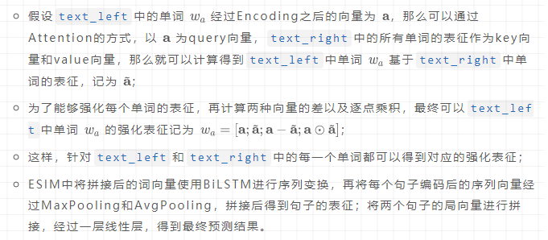

# 文本匹配和多轮检索

文本匹配任务分类

- **文本检索（ad-hoc）** 

- **释义识别（Paraphrase Identification）** 

- **自然语义推理（NLI）** 

- **问答匹配（QA）** 

## 文本匹配方法

**「基于特征的方式」** ，抽取两个文本tf-idf、BM25、词法等层面的特征，然后使用传统的机器学习模型（LR，SVM）等进行训练。虽然基于特征的方法可解释性较好，但是这种依赖于人工寻找特征和不断试错的方法，泛化能力就显得比较一般，而且由于特征数量的限制，导致参数量受到限制，模型的性能比较一般。

不同于传统基于特征的匹配方式，深度学习时代的文本匹配方法可以概括为两种类型：「基于表征（representation）的匹配和基于交互（interaction）的匹配」方式。

所谓基于表征的匹配方式，初始阶段对两个文本各自单独处理，通过深层的神经网络进行编码，得到文本的表征，然后基于得到的文本表征，采用相似度计算的函数得到两个文本的相似度。

而基于交互的匹配方式，则认为在最后阶段才计算文本的相似度会过于依赖表征的质量，同时也会丢失基础的文本特征（比如词法、句法等），所以提出尽可能早的对文本特征进行交互，捕获更基础的特征，最后在高层基于这些基础的特征进行匹配。

## 基于表征的文本匹配

### DSSM (2013)

首先基于bag-of-words得到文本的向量表征，再基于word-hashing方法降维，接着就是多层的线性层得到最终128维的文本Embedding，最后对两个文本Embedding计算cosine相似度得到相似度分数。

这篇论文也基本奠定了基于表征匹配的基本范式（paradigm），即「Embedding层->Encoding层->DNN层->Prediction层」。之后的基于表征的匹配大抵都是类似的流程。

### CDSSM (2014)

基本流程和DSSM完全一样，无非就是将MLP替换成了CNN模型，可以提取N-gram特征

基于表征的方式可创新的地方并不多，Embedding层是固定的，Encoding层无非在加上各种char-embedding，或者entity-embedding来引入先验知识；可以稍微有点创新的就只有DNN层，但是由于表征模型从头到尾对两个带匹配文本都是独立处理的，能做的只能是怎么得到更好的表征向量，很容易想到的就是把DNN替换为RNN型网络或者后来的Attention网络；Prediction层则是寻找不同的相似度计算函数，或者直接使用一层线性层代替。

2014年，华为也提出了一种基于表征的匹配模型 ARC I (2014)[4]，基本范式和上述结构一致。之后，还有一些基于表征的匹配方法，包括孪生网络Siamese Network (2016)[5]以及其变种，但是在2017年之后基本就没有基于表征的模型出现了。不过，就在最近，基于BERT的双塔模型被很多文章提及，也可以看做是基于表征的模型，是一个非常强的baseline。

## 基于交互的文本匹配

基于表征的方式简单有效，但是其缺点也非常明显。表征用来表示文本的高层语义特征，但是文本中单词的关系、句法的特征，高层的表征比较难捕获，很难判定一个表征是否能很好的表征一段文本。要想能够建模文本各个层级的匹配关系，最好能够尽早地让文本产生交互。通俗来讲就是，认识的越早，两个文本对彼此的了解就可能越多。

ARC II (2014)：首先，对输入语句得到每个单词的Embedding，然后经过一层的CNN得到两个句子N-gram级别的表征（这个使用多个不同大小的卷积核，得到多个N-gram级别表征）；接着计算基于每一个N-gram级别的表征计算交互矩阵（即一个句子中某一个位置的向量和另一个句子中其他位置的向量计算相似度，可以是点积或者cosine相似度），并在channel维度上进行拼接得到4层的张量；对上面得到的4层张量采用2D-CNN，再经过max-pooling得到最终的表征；Flatten之后经过MLP得到最终的匹配分数。

 从2014年开始，中科院郭嘉丰老师[7]团队开始在文本匹配领域发力，发表了多篇经典的论文，包括MV-LSTM (2015)[8]，MatchPyramid (2016)[9]，DRMM (2016)[10]，Match-SRNN (2016)[11]等等。前两者基本是对ARC II的补充，MV-LSTM主要是使用Bi-LSTM对Embedding进行强化编码，而MatchPyramid则提出了计算交互矩阵时多种匹配模式（**「Indicator, Cosine, Dot」** ）。

前面说过文本匹配中不同任务的模型大多是通用的，但针对不同任务的特点也可以有一些针对性的创新。上文提到的DRMM就是针对检索领域任务的特点进行了创新。传统的文本匹配大多考虑**「语义匹配（Semantic Matching）」**，而检索任务中的匹配通常是** 「相关性匹配（Relevance Matching）」**，关键词在其中起到至关重要的作用。DRMM在计算得到匹配矩阵之后，采用match histogram的方式将query中每个单词的相似度的值映射到不同的bin中，`[1, 1]`这个bin表示exact match，`[-1, 0)`区间均匀划分得到的每个bin都表示soft match；使用直方图中的计数作为向量中每一维的值，得到每个单词编码后的向量q_i ，在经过线性层得到每个单词的匹配分数；对于query中每个单词的向量，使用Term Gating网络计算权重，对上面单词的匹配分数进行加权得到最终匹配分数。

基于DRMM，CMU熊辰炎老师的团队又接连提出了KNRM (2017)[12]和Conv-KNRM (2018)[13]，采用核方法对直方图的匹配方式进行改进。2017年，郭老师团队的庞亮老师一篇文本匹配综述[14]对之前的工作进行了很好的总结。

2016年之后，随着Attention机制在各个领域的的普及，如何采用花式Attention技巧来强化单词向量表征，以及文本的交互矩阵成为之后文本匹配工作的核心。比较早期的网络有aNMM (2016)[15]，Match-LSTM (2016)[16]，Decomposable Attention (2016)[17]等。

Attention的使用方向主要集中在两点，一个是Embedding之后的Encoding层，通过Attention来得到强化单词的表征；一个是使用交互匹配矩阵得到两个文本align之后的Cross Attention。采用什么样的Attention函数，以及如何组合不同Attention之后的结果就成为导致各个模型性能不同的关键点。

2017年的论文BiMPM (2017) [18]可以说是对之前Attention的方式进行了一个汇总，也比较清晰地描述了基于交互的文本匹配模型的范式。该模型的结构分为「Word Representation层，Context Representation层，Matching层，Aggregation层以及Prediction层」。

- Word Representation层：有Word Embedding和Char Embedding经过LSTM之后的Word表征拼接得到单词表征；

- Context Representation层：使用一个BiLSTM对两个文本进行Encoding，得到每个word的前向和后向表征。

- **「Matching层」** ：

&ensp;&ensp;&ensp;&ensp;- **「Full Matching」** ：每个text中单词的前向Embedding和另一个text正向LSTM最后一个hidden state向量匹配得到  维向量，每个后向Embedding和另一个text反向LSTM的最后一个hidden进行匹配得到 m维向量。

&ensp;&ensp;&ensp;&ensp;- **「Maxpooling Matching」** ：每个text中单词的前向（后向）上下文Embedding和另一个text中单词的前向（后向）Embedding匹配，对匹配结果max-pooling，这样每个单词前向（后向）分别得到 m维向量；

&ensp;&ensp;&ensp;&ensp;- **「Attentive Matching」** ：计算一个text中单词前向（后向）Embedding和另一个句子中每个单词前向（后向）Embedding的相似度，取相似度值作为加权向量权重得到Attentive向量，然后使用Attentive向量和该text的对应单词向量进行匹配。

&ensp;&ensp;&ensp;&ensp;- **「Max-Attentive Matching」** ：取另一个句子每个维度最大值作为Attentive向量，按照上面的方式进行匹配。

- **「Aggregation层」** ：通过Matching层得到每个句子中单词的强化表征，对两个句子分别使用BiLSTM编码，将两个方向最后一个Hidden states拼接，得到最终向量。

- **「Prediction层」** ：将上面得到的向量，经过MLP输出最终的分数。

BiMPM中这种基于交互的文本匹配网络结构是对同一类网络很好的总结，即「Embedding层 -> Encoding层 -> Matching层 -> Aggregation层 -> Prediction层」。Embedding层获取单词的表征，Encoding层对单词表征进行强化编码，Matching层对带匹配的两个文本计算交互特征，Aggregation层对不同的交互策略进行融合，Prediction层基于融合的向量计算最终的概率。关于BiMPM的4种Matching策略，论文中有详细描述，这里不做过多赘述。

2017年的论文ESIM (2017)[19]也是文本匹配方向比较重要的一篇论文，笔者也是通过这篇论文第一次了解了Cross Attention，这里Attention计算方法以及计算两个表征差和点积的方式，在之后的论文中基本上随处可见。具体来说：

同年，ad-hoc子方向的一篇论文DeepRank (2017)[20]再次结合了文本检索任务的特点。由于文本检索任务中，`text_right`通常是倒排索引返回的document，属于长文本，之前的研究直接将其作为输入，一方面增加了计算复杂度，另一方面注入了很多无效信息。DeepRank考虑标注人员对文档相关性数据进行标注的流程，即相关位置检索->确定局部相关性->聚合局部相关性输出相关性标签，提出通过获取每一个query-term对应document中query-centric context，来避免过多无效信息和复杂计算。

2018年之前，不同的Attention函数，像Bi-linear Attention，Dot-Attention等在不同的论文中都各有运用，具体效果视不同任务有所差异。而随着Transformer (2017)[21]的出现，self Attention和multi-head Attention成了香饽饽，也成了后面很多模型默认采用的Attention策略。2018发表的MwAN (2018)[22]，SAN (2018)[23]，AF-DMN (2018)[24]等大多是对ESIM模型的补充和扩展。比较有意思的是HCRN (2018)[25]这篇论文，提出将复数域的Hermite矩阵的思想应用到相似度矩阵的计算中，即论文中所说的Hermitian Co-Attention。

 2018年年底，BERT (2018)[26]横空出世，预训练模型开始主导NLP战场，各个方向的SOTA几乎都被BERT刷了个遍，文本匹配自然也不例外。在这样的背景下，HCAN (2019)[27]提出在Matching层分别计算Relevance Matching和Semantic Matching，这样可以很好地解决信息检索中exact match和soft match的问题，论文才用了花式Attention和Pooling策略，但是即便如此，最终对比实验显示结果仍然略逊于BERT。

 2019年，刘知远老师团队的学生发了一篇小论文，探索BERT在信息检索中的应用Understanding the Behaviors of BERT in Ranking (2019)[28]，文中进行了几组实验，对比基于BERT几种不同融合策略的效果，结果显示与其对BERT输出的向量进行Interaction和Aggregation，还不如直接使用`[CLS]`输出向量分类效果好。笔者也做过类似的实验，不管是采用Pooling、Concat或者Attention，在不同的数据集上都会有一定的上下波动，即便向上波动也十分有限，直接使用`[CLS]`反而更加快捷方便。

 最近，阿里的两篇工作RE2 (2019)[29]和Enhanced-RCNN (2020)[30]都在尝试使用轻量级并且效果不逊色于BERT的模型，便于线上部署，取得了不错的结果。

 综上所述，BERT以及其衍生出来的预训练模型基本上统治了当下文本匹配数据集的SOTA榜单，相信未来会有更好的文本匹配模型对BERT形成冲击，但是可以预见的是BERT的统治还将持续相当一段时间，毕竟更容易上手。

## 关于多轮QA检索

多轮QA检索其实也属于文本匹配类型的任务，这个任务主要应用在对话场景中，在返回Answer时考虑多轮上文Query（下文称Utterance）。在人们的日常交谈中，通常会出现省略、代词等导致语义不明确的单轮Utterance，如果只考虑这单个文本，显然无法准确理解语义信息。所以，在进行对话检索时，为了能够更清楚地理解某个Utterance的含义，需要考虑之前轮次的Utterance，这也就是我们所要说的多轮检索（Multi-turn Retrieval）。相比于传统的文本匹配任务，多轮QA检索由于其任务的独特性，在BERT中并没有定义这样的输入，所以目前还不断有新的SOTA涌现。（注：百度的ERNIE 1.0定义了多轮对话的预训练任务，但是最多是两轮，即QQA）

笔者最先接触的多轮检索模型是2016年的这篇Multi-view (2016)[31]。文章的思想比较简单，主要分为**「Word-Sequence Model」**和** 「Utterance Sequence Model」**。

## 参考资料

[谈谈文本匹配和多轮检索](https://mp.weixin.qq.com/s/Ps1C0VZv12-hCnX6cD1O7w)

