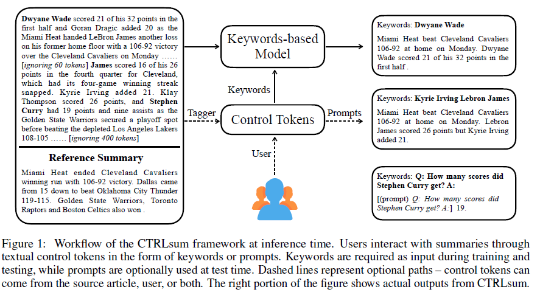
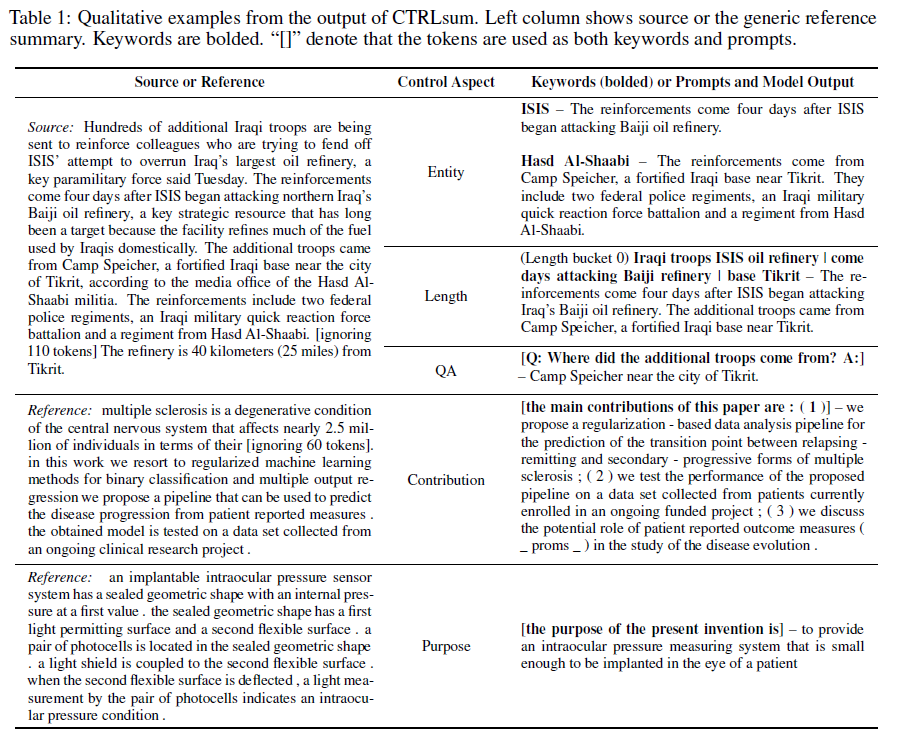
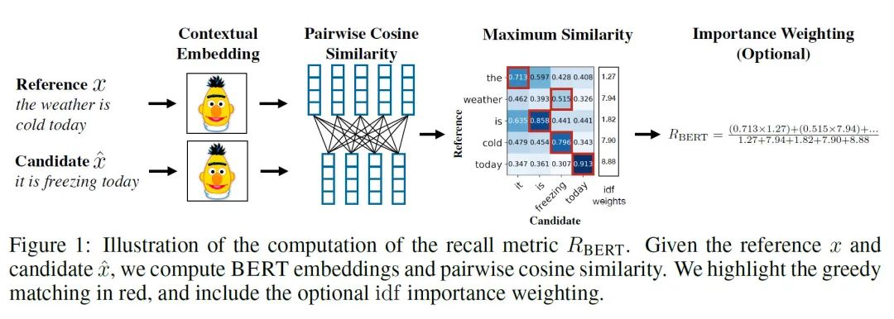
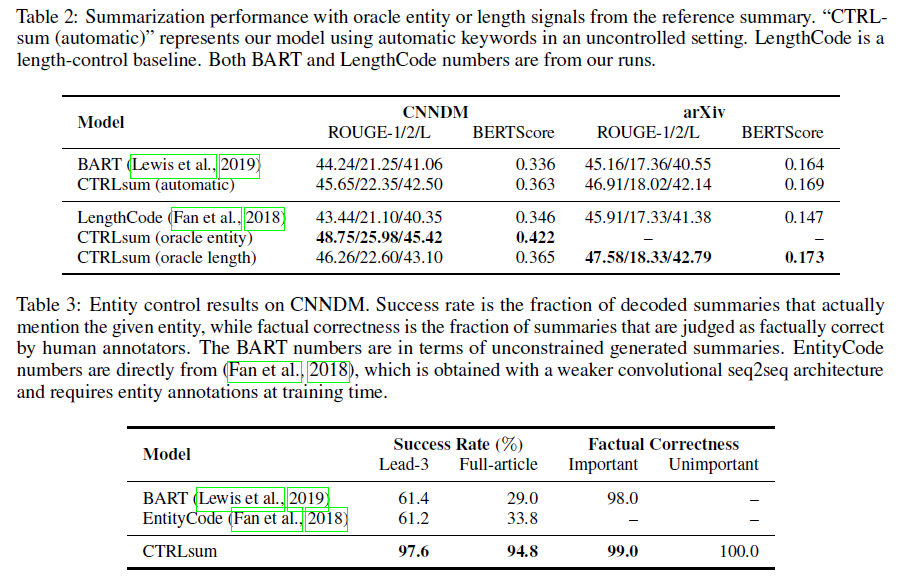
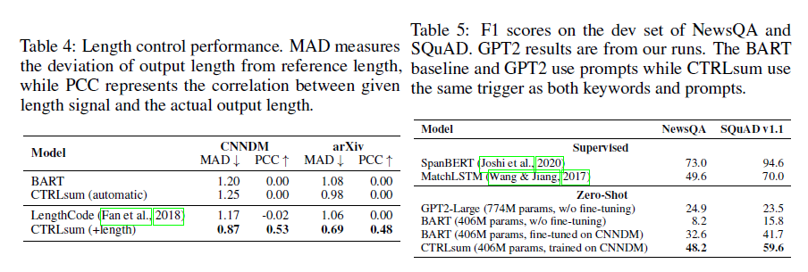
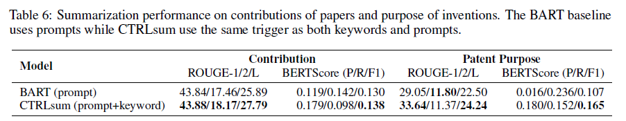
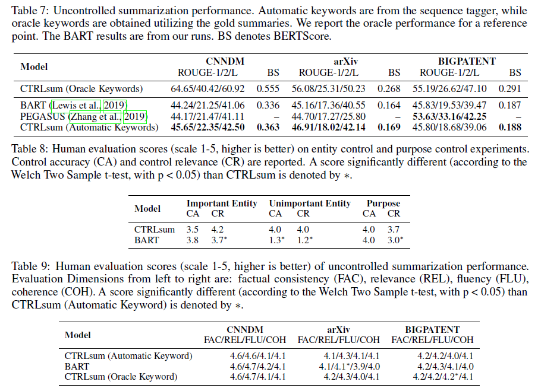

# [文本摘要][paper]CTRLSUM

论文题目：CTRLSUM: TOWARDS GENERIC CONTROLLABLE TEXT SUMMARIZATION

code：[https://github.com/salesforce/ctrl-sum](https://github.com/salesforce/ctrl-sum)

## 摘要

大多数摘要生成方法都只生成和用户偏好无关的一般化的摘要，本论文提出一个新的摘要生成方法，考虑用户的偏好。具体来说，用户可以输入一系列关键词或者描述性的提示语，来控制摘要的生成。

训练的时候，模型根据源文档和关键词来生成摘要，预测时，关键词可以来源于源文档或者用户输入，提示语则可有可无。

举例：

keywords是必须的，可以来源于User或者Tagger，Prompts是可选的。生成的摘要和Keywords相关。

## **自动抽取关键词** （**AUTOMATIC KEYWORD EXTRACTION** ）

训练阶段

- 从文档中贪心的选取最大化ROUGE分数（用参考摘要）的句子（[ROUGE-N = 每个n-gram在参考摘要和系统摘要中同现的最大次数之和 / 参考摘要中每个n-gram出现的次数之和](https://www.wolai.com/ezkEJrD7fy9wuN4bkzHgsZ)）

- 从句子中选出和参考摘要的最长公共子序列

- 去掉重复的词、停用词，剩下的就是关键词

测试阶段

- 视为一个序列标注任务。

- 用训练集的文档和关键词训练一个基于BERT的序列标注器

- 用标注器计算测试集文档中每个token的selection probability $q_j$

- 选出平均selection probability最高的$n_s$个句子，在这些句子中，选出$q_j>\epsilon$的词作为关键词，但是关键词的数量有一个上限$m_{max}$

- 这三个都是超参数，根据验证集的效果选取

## 摘要生成

训练阶段

- 在源文档前面加上关键字序列，并用特殊标记分离关键词和文档。

- 关键词的顺序和它们在文档中出现的顺序保持一致。

- 不同句子的关键词用特殊标记“|”分隔。在一些实验中，这个标记可以忽略，因为不知道句子边界。

- 在训练的时候随机去掉一些关键词，使得模型能够学习去依赖关键词，也能学习从文档中获取关键词中没有的重要信息。如果不这样做的话，模型可能过于依赖关键词而不去生成新的词。

预测阶段：只用关键词

- Entity Control：目的是生成的摘要focus在感兴趣的实体中。

- Length Control：把训练数据按摘要长度分成5个桶，每个桶有相同数量的样本。然后计算每个桶的平均的关键词个数$K_l$。测试的时候，用户可以指定长度$l\in \{0,1,2,3,4\}$，从而用标注器的打分选出分数最高的$K_l$个关键词。

预测阶段：用关键词和提示语

提示语可以作为关键词或者目标摘要的前缀，论文中两个地方都用了。

We find that using prompts as keywords besides prefix helps focus on **prompt-related content**  and **mitigate the over-generation issue of vanilla summarization models** 

- Summarizing Contributions：control tokens – “the main contributions of this paper are:(1)”

- Summarizing Invention Purpose：“the purpose of the present invention is”.

- Question-guided summarization：“Q: question text? A:” to trigger reading comprehension behaviour.

## 实验

数据集：CNN/Dailymail (CNNDM) news articles (Hermann et al., 2015), arXiv scientific papers (Cohan et al., 2018), and BIGPATENT patent articles (Sharma et al., 2019).

所有数据集的源文档都被裁剪成1024个token，目标摘要裁剪为256个token。

摘要模型是预训练BART(large)模型上微调得到的，关键词标注器是用预训练BERT（large）模型微调得到的。

评估指标是ROUGE分数，BERTScore.

BERTScore思路是非常简单的：即对两个生成句和参考句（word piece 进行 tokenize）分别用 bert 提取特征，然后对 2 个句子的每一个词分别计算内积，可以得到一个相似性矩阵。基于这个矩阵，我们可以分别对参考句和生成句做一个最大相似性得分的累加然后归一化，得到 bertscore 的 precision，recall 和 F1

BERTscore参考：

[https://blog.csdn.net/hwaust2020/article/details/106997321](https://blog.csdn.net/hwaust2020/article/details/106997321)

For control-related evaluation where we often do not have reference summaries, we (1) collect ground-truth summaries when possible, (2)examine whether summaries respect the control signal, or (3) resort to human evaluation.

### **ENTITY&Length CONTROL** 

We first simulate user preference by providing the model with oracle entities extracted from the ground-truth target.Then we compare it to the model using automatic keywords in a uncontrolled setting to show the effect of oracle entities. 前者利用了真实摘要。

采样100篇文档，重复地获取entity，然后生成摘要。计算Success Rate，即entity出现在输出的摘要中的比例。——检验不同的实体是不是会生成不同的摘要。

采样100篇文档，每篇文章随机抽一个“重要的”entity（出现在reference中），一个“不重要的”entity（reference和文档的前三个句子中都没有出现），来生成摘要。——为了测试不同重要程度的实体输入生成的摘要能否与文档保持一致（factually consistent with the document）

对于每一个(article, summary) pair，由3个标注者来判断该摘要是否能从文章中得出，选择投票最多的作为最终结果。

Table 2

- automatic和oracle entity比，ROUGE-2分数后者高出3.6分，说明CTRLsum能够利用给定的实体信息

- automatic和oracle length比，后者的分数只高出一点点。说明oracle lengths只传递了有限的额外信息去生成摘要。

Table 3

- 模型在Lead-3和Full-article都得到了很高的分数，而其它的模型对于不是出现在Lead-3的实体，很难将其包含在摘要里。

- 不管实体是重要的词还是不重要的，模型都能生成合适的摘要。

### CONTRIBUTION AND PURPOSE SUMMARIZATION

去掉contribution claims的Introduction部分作为源文档，正则表达式抽取出来的contribution作为参考摘要。

Purpose摘要的测试集由人工标注（选择一句话作为purpose）。

从P/R上看，BART倾向于生成更全面的摘要，因此Precision低，而CTRL倾向于生成和关键词有关的摘要，Precision高。

### QUESTION-GUIDED SUMMARIZATION

问答形式，Table5

zero-shot：迁移学习的一种极端形式，训练时没有该类别的样本。

- BART微调的效果比不微调好了很多

- 摘要或许对生成式阅读理解来说是一个合适的迁移任务——future work

### AUTOMATIC SUMMARIZATION

没有用户输入，使用自动抽取关键词机制来生成关键词。

Table 7

- CNNDM和arXiv上比BART和PEGASUS好很多。

- 另一个数据集的表现差很多。The reasons might be different dataset processing, sub-optimal learning schedule, or inherent difference between BART and PEGASUS.

### HUMAN EVALUATION

Controlled Summarization. 人工标注打分，1-5分, Table 8

- Control Accuracy (CA):摘要是否包括了主要信息

- Control Relevance (CR):摘要是否和control intent相关，如果有不相关的冗余信息会惩罚

Uncontrolled Summarization.. 人工标注打分，1-5分, Table 9

- Factual Consistency (FAC):摘要只能包含能从文档中得到的信息

- Relevance (REL):摘要只能包含文档的重要信息

- Fluency (FLU):摘要的每句话都应该流畅

- Coherence (COH):摘要的结构和组织应该是好的

[CTRLsum_Towards Generic Controllable Text Summarization.pdf](file/CTRLsum_Towards%20Generic%20Controllable%20Text%20Summarization.pdf)

被ICLR拒了😂[https://openreview.net/forum?id=ohdw3t-8VCY](https://openreview.net/forum?id=ohdw3t-8VCY)

