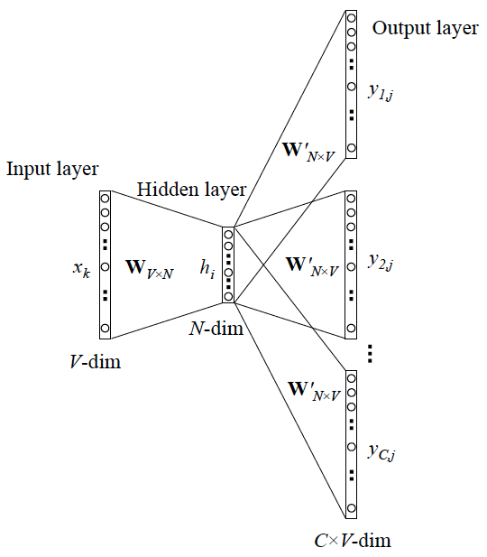

## 单词的表示

**WordNet**, 一个包含同义词集和上位词(“is a”关系) **synonym sets and hypernyms** 的列表的辞典

同义词：

```
from nltk.corpus import wordnet as wn
poses = { 'n':'noun', 'v':'verb', 's':'adj (s)', 'a':'adj', 'r':'adv'}
for synset in wn.synsets("good"):
    print("{}: {}".format(poses[synset.pos()],
                    ", ".join([l.name() for l in synset.lemmas()])))
```


上位词：

```
from nltk.corpus import wordnet as wn
panda = wn.synset("panda.n.01")
hyper = lambda s: s.hypernyms()
list(panda.closure(hyper))
```


存在的问题：

- 作为一个资源很好，但忽略了细微差别，比如"proficient"只在某些上下文和"good"是同义词
- 难以持续更新单词的新含义
- 主观的
- 需要人类劳动来创造和调整
- 无法计算单词相似度


在传统的自然语言处理中，我们把词语看作离散的符号，单词通过one-hot向量表示。所有向量是正交的，没有相似性概念，向量维度过大。

在Distributional semantics中，一个单词的意思是由经常出现在该单词附近的词(上下文)给出的，单词通过一个向量表示，称为word embeddings或者word representations，它们是分布式表示(distributed representation)


## word2vec

大部分的有监督机器学习模型，都可以归结为：f(x)->y

在 NLP 中，把 x 看做一个句子里的一个词语，y 是这个词语的上下文词语，那么这里的 f，便是 NLP 中经常出现的『语言模型』（language model），这个模型的目的，就是判断 (x,y) 这个样本，是否符合自然语言的法则，更通俗点说就是：词语x和词语y放在一起，是不是人话。

Word2vec 正是来源于这个思想，但它的最终目的，不是要把 f 训练得多么完美，而是只关心模型训练完后的副产物——模型参数（这里特指神经网络的权重），并将这些参数，作为输入 x 的某种向量化的表示，这个向量便叫做——词向量。

中心思想：给定大量文本数据，训练每个单词的向量，使得给定中心词c时，上下文词o的概率最大，而这个概率的衡量方式是c和o两个词向量的相似性。

c和o相似性的计算方法是：

$P(o|c)=\frac{exp(u^T_ov_c)}{\sum_{w\in V}exp(u^T_wv_c)}$

每个词有两个向量：作为中心词的向量u和作为上下文词的v

这里用了$softmax(x_i)$函数，放大了最大的概率(max)，仍然为较小的xi赋予了一定概率(soft)

## Skip-gram 和 CBOW 模型

- 如果是用一个词语作为输入，来预测它周围的上下文，那这个模型叫做『Skip-gram 模型』
- 而如果是拿一个词语的上下文作为输入，来预测这个词语本身，则是 『CBOW 模型』

### 简单情形

y 是 x 的上下文，所以 y 只取上下文里一个词语的时候，语言模型就变成：用当前词 x 预测它的下一个词 y。

一般的数学模型只接受数值型输入，这里的输入x就是**one-hot encoder**。

Skip-gram 的网络结构：


x 就是上面提到的 one-hot encoder 形式的输入，y 是在这 V 个词上输出的概率，我们希望跟真实的 y 的 one-hot encoder 一样。

**隐层的激活函数其实是线性的**，相当于没做任何处理（这也是 Word2vec 简化之前语言模型的独到之处），我们要训练这个神经网络，用**反向传播算法**，本质上是*链式求导*

当模型训练完后，最后得到的其实是**神经网络的权重**，比如现在输入一个 x 的 one-hot encoder: [1,0,0,…,0]，对应词语『吴彦祖』，则在输入层到隐含层的权重里，只有对应 1 这个位置的权重被激活，这些权重的个数，跟隐含层节点数是一致的，从而这些权重组成一个向量 vx 来表示x，而因为每个词语的 one-hot encoder 里面 1 的位置是不同的，所以，这个向量 vx 就可以用来唯一表示 x。

输出 y 也是用 V 个节点表示的，对应V个词语，所以其实，我们把输出节点置成 [1,0,0,…,0]，它也能表示『吴彦祖』这个单词，但是激活的是隐含层到输出层的权重，这些权重的个数，跟隐含层一样，也可以组成一个向量 vy，跟上面提到的 vx 维度一样，并且可以看做是**词语『吴彦祖』的另一种词向量**。而这两种词向量 vx 和 vy，正是 Mikolov 在论文里所提到的，『输入向量』和『输出向量』，一般我们用『输入向量』。

需要提到一点的是，这个词向量的维度（与隐含层节点数一致）一般情况下要远远小于词语总数 V 的大小，所以 Word2vec 本质上是一种**降维**操作——把词语从 one-hot encoder 形式的表示降维到 Word2vec 形式的表示。

### Skip-gram 更一般的情形

上面讨论的是最简单情形，即 y 只有一个词，当 y 有多个词时，网络结构如下：



可以看成是 单个x->单个y 模型的并联，cost function 是单个 cost function 的累加（取log之后）

和CBOW类似，只是交换了x和y

- 生成中心词的one-hot向量x
- 得到中心词的词嵌入向量$v_c=Vx$
- 生成分数向量$z=Uv_c$
- 将分数向量转化为概率$\hat y=softmax(z)$，$\hat y_{c-m},...,\hat y_{c-1}, \hat y_{c+1},...,\hat y_{c+m}$是每个上下文词观察到的概率
- 希望生成的概率向量匹配真实概率$y_{c-m},...,y_{c-1},y_{c+1},...,y_{c+m}$，one-hot向量是实际的输出。


与CBOW模型不同的是，引用了朴素贝叶斯假设来拆分概率，即给定中心词，所有输出的词是完全独立的。
$$
\begin{aligned} 
\text { minimize } J&=-\log P\left(w_{c-m}, \ldots, w_{c-1}, w_{c+1}, \ldots, w_{c+m} | w_{c}\right) \\
&=-\log \prod_{j=0, j \neq m}^{2 m} P\left(w_{c-m+j} | w_{c}\right) \\ 
&=-\log \prod_{j=0, j \neq m}^{2 m} P\left(u_{c-m+j} | v_{c}\right) \\ 
&=-\log \prod_{j=0, j \neq m}^{2 m} \frac{\exp \left(u_{c-m+j}^{T} v_{c}\right)}{\sum_{k=1}^{|V|} \exp \left(u_{k}^{T} v_{c}\right)} \\ 
&=-\sum_{j=0, j \neq m}^{2 m} u_{c-m+j}^{T} v_{c}+2 m \log \sum_{k=1}^{|V|} \exp \left(u_{k}^{T} v_{c}\right) 
\end{aligned}
$$


### CBOW 更一般的情形

跟 Skip-gram 相似，只不过:Skip-gram 是预测一个词的上下文，而 CBOW 是用上下文预测这个词


更 Skip-gram 的模型并联不同，这里是输入变成了多个单词，所以要对输入处理下（一般是求和然后平均），输出的 cost function 不变

对于模型中的每个单词，需要学习两个向量：

- v (输入向量) 当词在上下文中
- u (输出向量) 当词是中心词

对应地有两个矩阵：

$V\in R^{n\times |V|}$是输入词矩阵，第i列是词$w_i$的n维嵌入向量，定义为$v_i$

$U\in R^{|V|\times n}$是输出词矩阵，第i行是词$w_i$的n维嵌入向量，定义为$u_i$

模型步骤：

- 对于大小为m的输入上下文，每个词生成一个one-hot词向量$x^i, i=c-m, c-m+1,...,c-1,c+1,...,c+m$
- 从上下文矩阵$V$中得到每个词的嵌入词向量$v_i=Vx^i$
- 对上述向量求平均值得到$\hat v$
- 生成一个分数向量$z=U\hat v \in R^{|V|}$，相似向量的点积越高，就会令相似的词更为靠近，从而获得更高的分数。将分数转换为概率$\hat y=softmax(z)$
- 希望生成的概率$\hat y$和实际概率$y$相匹配，使得实际的词刚好就是这个one-hot向量

损失函数：

$H(\hat y, y)=-\sum_{j=1}^{|V|}y_j log(\hat y_j)$

上述公式中的$y_j$是one-hot向量，因此损失函数可以简化为

$H(\hat y, y)=-y_c log(\hat y_c)$

c是正确词的one-hot向量的索引。

优化目标函数的公式为：

$$
\begin{align}
\text {minimize} J &=-\log P\left(w_{c} | w_{c-m}, \ldots, w_{c-1}, w_{c+1}, \ldots, w_{c+m}\right) \\
&=-\log P\left(u_{c} | \hat{v}\right) \\
&=-\log \frac{\exp \left(u_{c}^{T} \hat{v}\right)}{\sum_{j=1}^{|V|} \exp \left(u_{j}^{T} \hat{v}\right)} \\
&=-u_{c}^{T} \hat{v}+\log \sum_{j=1}^{|V|} \exp \left(u_{j}^{T} \hat{v}\right)
\end{align}
$$


## Word2vec 的训练trick

Word2vec 本质上是一个语言模型，它的输出节点数是 V 个，对应了 V 个词语，本质上是一个多分类问题，但实际当中，词语的个数非常非常多，会给计算造成很大困难，所以需要用技巧来加速训练。

- hierarchical softmax——本质是把 N 分类问题变成 log(N)次二分类。通过使用一个有效的树结构来计算所有词的概率来定义目标

- negative sampling——本质是预测总体类别的一个子集。通过抽取负样本来定义目标

### Hierarchical Softmax

论文：《Distributed Representations of Words and Phrases and their Compositionality.》

**在实际中，hierarchical softmax 对低频词往往表现得更好，负采样对高频词和较低维度向量表现得更好**。

Hierarchical Softmax是一种为了解决词汇表过大导致计算维度过大问题的解决方案，借助树结构的层次性来缓解维度过大的问题，按照出现时间来看其实方法本身的提出甚至早于word2vector本身，它的实质是构建一棵二叉树，每个单词都挂在叶子节点上，对于大小为 `V`的词库，非叶子节点则对应有 `V-1`个，由于树本身无环的特性（在离散数学中，树的定义是连通但无回路的图），每个单词都能通过从根节点开始的唯一一条路径进行表示。


首先是，这棵树怎么建立的。这棵树的实质是一棵Huffman树（给定n个权值作为n个叶子结点，构造一棵二叉树，若该树的带权路径长度达到最小，称这样的二叉树为最优二叉树，也称为Huffman树），而这棵Huffman树的权重则来源于每个单词出现的频率，根据每个单词的出现频率即可构建出Huffman树。至于原因，可以比较简单的理解为，更为经常出现的单词，在训练的时候经常会出现，快点找到他更有利于进行后续的计算，因此深度可以浅一些，相反不经常出现的单词弱化存在感问题不大，所以建造这样的Huffman树有利于提升效率。

关于哈夫曼树？ #td 

那么，建立这棵树之后，是怎么应用和计算呢。此时在word2vec中，使用的就转为分层二分类逻辑斯蒂回归，从根节点出发，分为负类则向左子树走，分为正类则向右子树走，分类的依据来源于每个非叶子节点上所带有的内部节点向量。

说完应用，就需要回头说怎么训练，训练的原理其实和一般地word2vector非常类似，就是使用基于梯度的方式，如SGD进行更新，值得注意的是，对于树内的每个分类模型，对应的权重也需要更新。

那么此处，我想要提炼的两个trick就是：

- 多分类问题，可以转化为多个二分类进行计算。
- 多个二分类问题，可以通过树结构，尤其是Huffman树进行，能进一步提升计算效率。

经过证明，使用Hierarchical Softmax的搜索复杂度是对数级的，而不使用则是线性级的，虽然复杂度都不是很高但是在与如此大的词库场景下，这个提升绝对有必要。

在这个模型中，没有词的输出表示。相反，图的每个节点（根节点和叶结点除外）与模型要学习的向量相关联。单词作为输出单词的概率定义为从根随机游走到单词所对应的叶的概率。计算成本变为 O(log(|V|))而不是 O(|V|) 。

### Negative Sampling

论文：《Distributed Representations of Words and Phrases and their Compositionality.》

目标函数中对|V|的求和计算量是非常大的，任何的更新或者对目标函数的评估都要花费O(|V|)的时间复杂度。一个简单的想法是不去直接计算，而是求近似值。

在每一个训练步骤中，不去遍历整个词汇表，而仅仅抽取一些负样例，对噪声分布$P_n(w)$抽样，这个概率是和词频的排序相匹配的。

考虑一对中心词和上下文词$(w,c)$，通过$P(D=1|w,c)$表示该词对来自语料库，$P(D=0|w,c)$表示不是来自语料库。对$P(D=1|w,c)$用sigmoid函数建模。

建立一个新的目标函数，如果词对确实在语料库中，就最大化概率$P(D=1|w,c)$，否则最大化概率$P(D=0|w,c)$，对这两个概率采用简单的极大似然估计方法
$$
\begin{aligned} \theta &=\underset{\theta}{\operatorname{argmax}} \prod_{(w, c) \in D} P(D=1 | w, c, \theta) \prod_{(w, c) \in \widetilde{D}} P(D=0 | w, c, \theta) \\ 
&=\underset{\theta}{\operatorname{argmax}} \prod_{(w, c) \in D} P(D=1 | w, c, \theta) \prod_{(w, c) \in \widetilde{D}}(1-P(D=1 | w, c, \theta)) \\ 
&=\underset{\theta}{\operatorname{argmax}} \sum_{(w, c) \in D} \log P(D=1 | w, c, \theta)+\sum_{(w, c) \in \widetilde{D}} \log (1-P(D=1 | w, c, \theta)) \\ 
&=\arg \max _{\theta} \sum_{(w, c) \in D} \log \frac{1}{1+\exp \left(-u_{w}^{T} v_{c}\right)}+\sum_{(w, c) \in \widetilde{D}} \log \left(1-\frac{1}{1+\exp \left(-u_{w}^{T} v_{c}\right)}\right) \\ 
&=\arg \max _{\theta} \sum_{(w, c) \in D} \log \frac{1}{1+\exp \left(-u_{w}^{T} v_{c}\right)}+\sum_{(w, c) \in \widetilde{D}} \log \left(\frac{1}{1+\exp \left(u_{w}^{T} v_{c}\right)}\right) 
\end{aligned}
$$
最大化似然函数等价于最小化负对数似然。

抽样分布从实际效果来看最好的是指数为3/4的Unigram模型。举例：
$$
\begin{eqnarray}  is: 0.9^{3/4} = 0.92 \nonumber \\ Constitution: 0.09^{3/4}= 0.16 \nonumber \\ bombastic:0.01^{3/4}= 0.032 \nonumber \end{eqnarray}
$$
“Bombastic”现在被抽样的概率是之前的三倍，而“is”只比之前的才提高了一点点。


负采样需要解决的是每次迭代的过程中都需要更新大量向量的问题，它的核心思想就是“既然要更新这么多，那就更新一部分呗”。在实际应用中，是需要正负样本输入的，正样本（输出的上下文单词）当然需要保留下来，而负样本（不对的样本）同样需要采集，但是肯定不能是词库里面的所有其他词，因此我们需要采样，这个采样被就是所谓的Negative Sampling，抽样要根据一定的概率，而不是简单地随机，而是可以根据形式的分布。

这个分布估计是这一小块方向下研究最多的，里面谈到很多，如果看单词在语料库中出现的频次，则停止词出现的会很多，当然还可能会有一些由于文本领域产生的特殊词汇，如果平均分配，则采样并没有特别意义，区分度不大，因此根据经验，如下形式似乎得到较多人认可：


其中f表示计算对应词汇的词频，这是一个抽样的概率，当然了，还有很多诸如考虑共现概率等构建的指标也有，但是目前似乎没有得到普遍认可，不再赘述。

那么此处能够提炼的关键就是：

- 样本不平衡或者更新复杂的情况下可以考虑仅使用部分样本进行计算和更新

这个技巧其实在推荐系统中也非常常见，尤其是CTR预估一块，大部分场景下负样本并不少，此时需要一定的负采样。

## 实现

### gensim

```python
from gensim.models import Word2Vec

sentences = [["cat", "say", "meow"], ["dog", "say", "woof"]]
model = Word2Vec(sentences, min_count=1)
```


## QA

Q1. gensim 和 google的 word2vec 里面并没有用到onehot encoder，而是初始化的时候直接为每个词随机生成一个N维的向量，并且把这个N维向量作为模型参数学习；所以word2vec结构中不存在文章图中显示的将V维映射到N维的隐藏层。

A1. 其实，本质是一样的，加上 one-hot encoder 层，是为了方便理解，因为这里的 N 维随机向量，就可以理解为是 V 维 one-hot encoder 输入层到 N 维隐层的权重，或者说隐层的输出（因为隐层是线性的）。每个 one-hot encoder 里值是 1 的那个位置，对应的 V 个权重被激活，其实就是『从一个V*N的随机词向量矩阵里，抽取某一行』。学习 N 维向量的过程，也就是优化 one-hot encoder 层到隐含层权重的过程


Q2. hierarchical softmax 获取词向量的方式和原先的其实基本完全不一样，我初始化输入的也不是一个onehot，同时我是直接通过优化输入向量的形式来获取词向量？如果用了hierarchical 结构我应该就没有输出向量了吧？

A2. 初始化输入依然可以理解为是 one-hot，同上面的回答；确实是只能优化输入向量，没有输出向量了。具体原因，我们可以梳理一下不用 hierarchical (即原始的 softmax) 的情形：

> 隐含层输出一个 N 维向量 x, 每个x 被一个 N 维权重 w 连接到输出节点上，有 V 个这样的输出节点，就有 V 个权重 w，再套用 softmax 的公式，变成 V 分类问题。这里的类别就是词表里的 V 个词，所以一个词就对应了一个权重 w，从而可以用 w 作为该词的词向量，即文中的输出词向量。
>
> PS. 这里的 softmax 其实多了一个『自由度』，因为 V 分类只需要 V-1 个权重即可

我们再看看 hierarchical softmax 的情形：

> 隐含层输出一个 N 维向量 x, 但这里要预测的目标输出词，不再是用 one-hot 形式表示，而是用 huffman tree 的编码，所以跟上面 V 个权重同时存在的原始 softmax 不一样， 这里 x 可以理解为先接一个输出节点，即只有一个权重 w1 ，输出节点输出 1/1+exp(-w*x)，变成一个二分类的 LR，输出一个概率值 P1，然后根据目标词的 huffman tree 编码，将 x 再输出到下一个 LR，对应权重 w2，输出 P2，总共遇到的 LR 个数（或者说权重个数）跟 huffman tree 编码长度一致，大概有 log(V) 个，最后将这 log(V) 个 P 相乘，得到属于目标词的概率。但注意因为只有 log(V) 个权重 w 了，所以跟 V 个词并不是一一对应关系，就不能用 w 表征某个词，从而失去了词向量的意义
>
> PS. 但我个人理解，这 log(V) 个权重的组合，可以表示某一个词。因为 huffman tree 寻找叶子节点的时候，可以理解成是一个不断『二分』的过程，不断二分到只剩一个词为止。而每一次二分，都有一个 LR 权重，这个权重可以表征该类词，所以这些权重拼接在一起，就表示了『二分』这个过程，以及最后分到的这个词的『输出词向量』。
>
> 我举个例子：
>
> 假设现在总共有 (A,B,C)三个词，huffman tree 这么构建：
> 第一次二分： (A,B), (C)
> 假如我们用的 LR 是二分类 softmax 的情形（比常见 LR 多了一个自由度），这样 LR 就有俩权重，权重 w1_1 是属于 (A,B) 这一类的，w1_2 是属于 (C) 的, 而 C 已经到最后一个了，所以 C 可以表示为 w1_2
>
> 第二次二分： (A), (B)
> 假设权重分别对应 w2_1 和 w2_2，那么 A 就可以表示为 [w1_1, w2_1], B 可以表示为 [w1_1, w2_2]
>
> 这样， A,B,C 每个词都有了一个唯一表示的词向量（此时他们长度不一样，不过可以用 padding 的思路，即在最后补0）
>
> 当然了，一般没人这么干。。。开个脑洞而已


Q3. 是否一定要用Huffman tree?

A3. 未必，比如用完全二叉树也能达到O(log(N))复杂度。但 Huffman tree 被证明是更高效、更节省内存的编码形式，所以相应的权重更新寻优也更快。 举个简单例子，高频词在Huffman tree中的节点深度比完全二叉树更浅，比如在Huffman tree中深度为3，完全二叉树中深度为5，则更新权重时，Huffmantree只需更新3个w，而完全二叉树要更新5个，当高频词频率很高时，算法效率高下立判


一个单词的向量是一行；

得到的概率分布不区分上下文的相对位置；

每个词和and, of等词共同出现的概率都很高

为什么需要两个向量？——数学上更简单(中心词和上下文词分开考虑),最终是把2个向量平均。也可以每个词只用一个向量。


## 参考资料

[[NLP] 秒懂词向量Word2vec的本质](https://zhuanlan.zhihu.com/p/26306795)

[《word2vec Parameter Learning Explained》论文学习笔记](https://blog.csdn.net/lanyu_01/article/details/80097350)

[NLP.TM | 再看word2vector](https://mp.weixin.qq.com/s/Yp9tXTj1npgS4yrQ3vNdjQ)

word2vector论文：Distributed Representations of Words and Phrases and their Compositionality

- [DeeplearningAI笔记]序列模型2.7负采样Negative sampling：有关负采样的文章，比较容易理解：https://blog.csdn.net/u013555719/article/details/82190917
- Hierarchical softmax(分层softmax)简单描述。有关Hierarchical softmax的解释：https://cloud.tencent.com/developer/article/1387413

[https://looperxx.github.io/CS224n-2019-01-Introduction%20and%20Word%20Vectors/](https://looperxx.github.io/CS224n-2019-01-Introduction and Word Vectors/)

[理解 Word2Vec 之 Skip-Gram 模型](https://zhuanlan.zhihu.com/p/27234078) #td 

