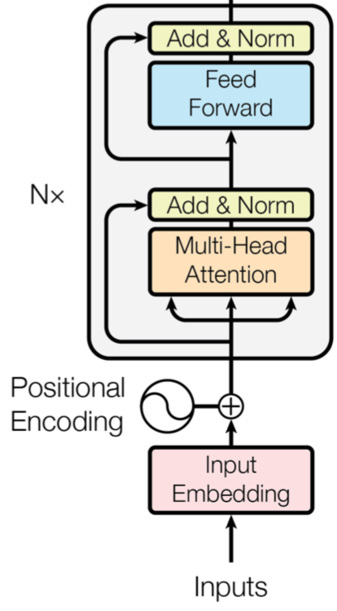
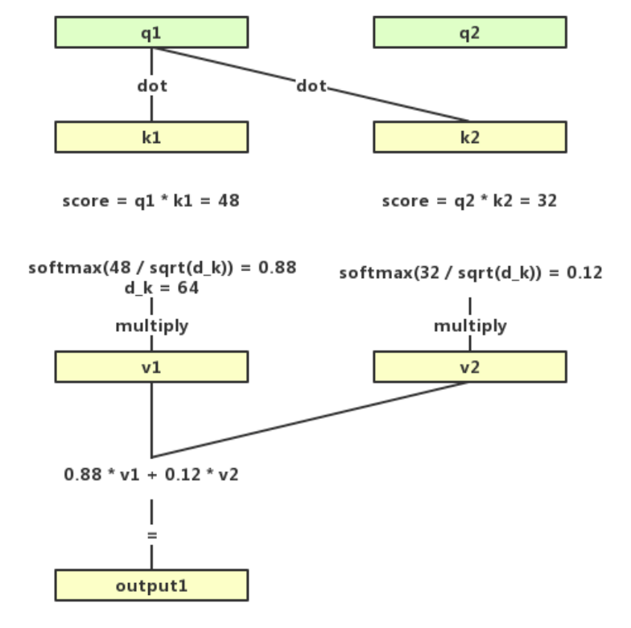
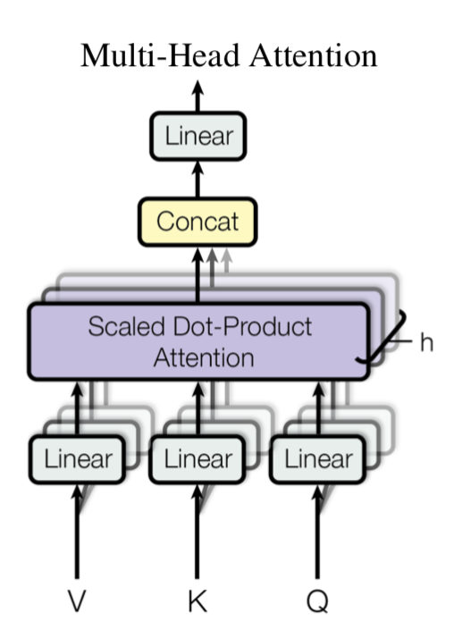

# Transformer

[Transformer](https://arxiv.org/abs/1706.03762) 是一个完全基于注意力机制（Attention mechanism）的模块，对比 RNN（Recurrent Neural Network），当输入的句子是长句子时，RNN 可能会遗忘之前句子中出现的字词，而 Transformer 的注意力机制使得句子中重要的字词的权重增大，从而保证不会被遗忘。并且 Transformer 另一个巨大的优势在于，它可以使用并行的方法运行计算，从而加快了速度。

Transformer 的具体结构如下图：

[https://doc.shiyanlou.com/courses/uid214893-20190806-1565074908805](https://doc.shiyanlou.com/courses/uid214893-20190806-1565074908805)

现在来介绍 Transformer 结构的重点：Multi-Head Attention。

Multi-Head Attention 的组成因子是 Self-Attention，顾名思义，Self-Attention 就是自注意力，即语句对自身计算注意力权重。公式表示为：

取 QQ 中一个行向量为例（也就是每一个输入样本中 xi 对应的 qi），用 qi 乘上每一个样本对应的 ki，再除以注意力头的维度，就得到每个样本对应的注意力值。接下来，再使用 Softmax 函数将值转换为和为 1 的概率值（向量形式）并乘上 V，得到经过注意力机制计算后的输出值。

该流程也可以参考下图：

可以看出，Bidirection 特性就在 Self-Attention 机制中得到了体现，即计算句子中的注意力对某个词的分布时，既考虑了在该词左侧的词，也考虑了在该词右侧的词。

现在我们已经了解了 Self-Attention，Multi-Heah Attention 实际上就是多个 Self-Attention 的堆叠。如下图，多层叠加的 Self-Attention 组成了 Multi-Head Attention。不过因为多层的缘故，最后所有 Self-Attention 会生成多个大小相同的矩阵，处理方式是把这些矩阵拼接起来，然后通过乘上一个参数矩阵得到最后的计算结果。

Multi-Head Attention 通过多层的 Self-Attention 可以将输入语句映射到不同的子空间中，于是能够更好地理解到语句所包含的信息。

待续

## 参考资料

[NLP预训练家族 | Transformer-XL及其进化XLNet](https://mp.weixin.qq.com/s/_xZpg5WDInqGKur1AGxI1Q)

