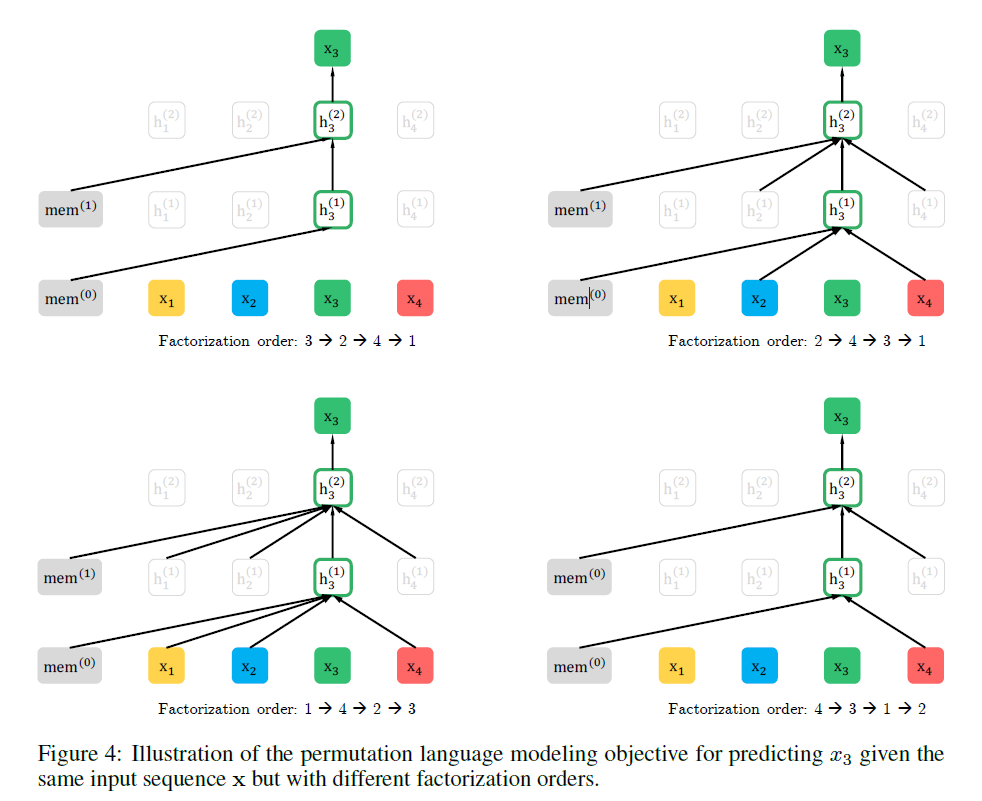
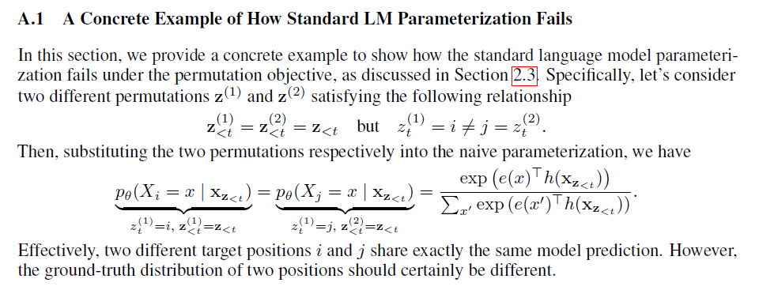
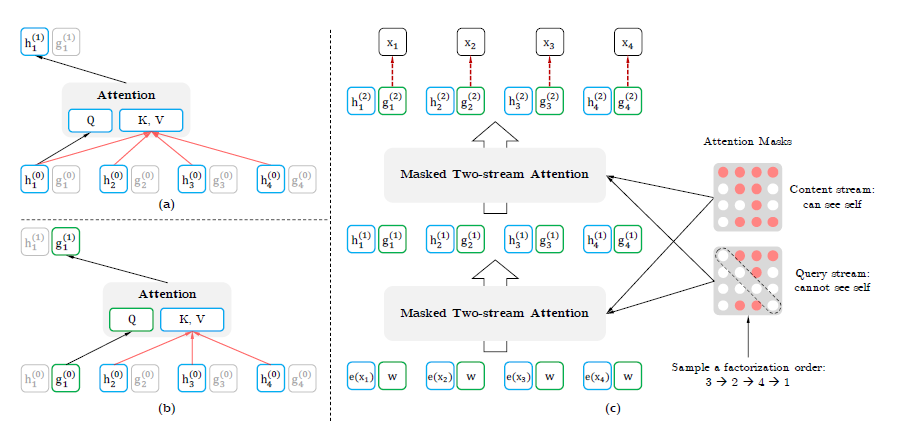

XLNet: Generalized Autoregressive Pretraining for Language Understanding

作者来自CMU，谷歌AI大脑团队

代码地址：https://github.com/zihangdai/xlnet


### 背景(AR vs AE)

**autoregressive (AR) language modeling**：目的是用自回归模型估计文本语料的概率分布。（也就是语言模型：首先根据概率分布生成第一个词，然后根据第一个词生成第二个词，然后根据前两个词生成第三个词，……，直到生成整个句子。）

给定一个文本序列$X=(x_1, ..., x_T)$，AR语言模型用一个前向连乘或者后向连乘来建模：

$p(x)=\prod_{t=1}^Tp(x_t|x_{<t})$

$p(x)=\prod_{t=T}^1p(x_t|x_{>t})$

训练一个参数化模型（比如神经网络）来建模每个条件分布。

AR语言模型只能编码单向的上下文。

**autoencoding (AE) based pretraining**的目的是通过缺失的输入来重建原始的数据。比如BERT。给定输入的token序列，一部分token会被特殊标记[MASK]替代，然后训练模型来通过缺失的数据恢复出原始的数据。


文本序列$X=(x_1, ..., x_T)$

AR语言模型公式（1），最大化似然函数
$$
max_{\theta}logp_{\theta}(x)=\sum_{t=1}^Tlogp_{\theta}(x_t|x_{<t})=\sum_{t=1}^Tlog\frac{exp(h_{\theta}(x_{1:t-1})^Te(x_t))}{\sum_{x'}exp(h_{\theta}(x_{1:t-1})^Te(x'))}
$$
$h_{\theta}(x_{1:t-1})$是上下文的向量表示（神经网络模型输出，RNN或Transformer），$e(x)$是x的embedding。

BERT公式（2），根据上下文恢复原始值
$$
max_{\theta}logp_{\theta}(\overline x | \hat x)\approx \sum_{t=1}^Tm_tlogp_{\theta}(x_t|\hat x)=\sum_{t=1}^Tm_tlog\frac{exp(H_{\theta}(\hat x)_t^Te(x_t))}{\sum_{x'}exp(H_{\theta}(\hat x)_t^Te(x'))}
$$
$\hat x$是被mask后的带噪声版本，$m_t=1$代表$x_t$被mask了，$H_{\theta}$是一个Transformer，将长度为T的文本序列x变成一个隐向量序列$H_{\theta}(x)=[H_{\theta}(x)_1, H_{\theta}(x)_2, ..., H_{\theta}(x)_T]$。

这两个模型的优缺点：

- 独立假设Independence Assumption。公式(2)的约等于。BERT假设被mask的token之间是独立的。AR没有这个问题。
- 输入噪声Input noise。人为设置的[MASK]标记在下游fine-tuning任务中不会出现，导致pretrain-finetune discrepancy不匹配。将[MASK]替换成token也不好，因为只有一部分token可以使用，否则上面的式子很难优化（没理解这是啥意思）。AR没有这个问题。
- 双向上下文Context dependency。BERT可以使用双向的上下文信息。AR模型不能利用双向上下文的信息。（1:t-1）

XLNet想综合两者的优点

### Objective: Permutation Language Modeling

思想来源于NADE(Neural autoregressive distribution estimation)，一种生成模型。

对于一个长度为T的序列x，有T!个可能的排列

比如假设$x=x_1x_2x_3$，那么总共用3!=6种分解方法：

$p(x)=p(x_1)p(x_2|x_1)p(x_3|x_1x_2) \Rightarrow 1\rightarrow2\rightarrow3$

$p(x)=p(x_1)p(x_2|x_1x_3)p(x_3|x_1) \Rightarrow 1\rightarrow3\rightarrow2$

$p(x)=p(x_1|x_2)p(x_2)p(x_3|x_1x_2) \Rightarrow 2\rightarrow1\rightarrow3$

$p(x)=p(x_1|x_2x_3)p(x_2)p(x_3|x_2) \Rightarrow 2\rightarrow3\rightarrow1$

$p(x)=p(x_1|x_3)p(x_2|x_1x_3)p(x_3) \Rightarrow 3\rightarrow1\rightarrow2$

$p(x)=p(x_1|x_2x_3)p(x_2|x_3)p(x_3) \Rightarrow 3\rightarrow2\rightarrow1$

注意$p(x_2|x_1x_3)$指的是第一个词是$x_1$并且第三个词是$x_3$的条件下第二个词是$x_2$的概率。也就是说原来词的顺序是保持的。如果理解为第一个词是$x_1$并且第二个词是$x_3$的条件下第三个词是$x_2$，那么就不对了。

如果我们的语言模型遍历T!种分解方法，并且模型的参数是共享的，那么这个模型应该就能(必须)学习到各种上下文。排列语言模型会学习各种顺序的生成句子的方法，比如$3\rightarrow2\rightarrow1$就是先生成第三个词，然后根据第三个词生成第二个词，最后根据第二个和第三个词生成第一个词。

$Z_T$代表长度为T的索引序列[1, 2, ..., T]的所有可能的排列组成的集合，$z\in Z_T$是一种排列方法，$z_t$和$z_{<t}$分别代表**排列**的第t个元素以及排列的前t-1个元素。论文提出的排列语言模型(permutation language modeling)的目标函数是：公式（3）
$$
max_{\theta}E_{z\sim Z_T}[\sum_{t=1}^Tlogp_{\theta}(x_{z_t}|x_{z_{<t}})]
$$
从所有的排列中采样一种，然后根据这个排列来分解联合概率成条件概率的乘积，然后加起来。（比如上面的例子）

因为训练的时候模型的参数在所有的因式中都是共享的，因此期望上，$x_t$在序列中看见了所有$x_i\neq x_t$的元素，因此能够捕捉双向的信息。而且由于这个目标函数符合AR的框架，自然就避免了independence assumption和pretrain-finetune
discrepancy问题。

注意，上面的模型只会遍历概率的分解顺序，并不会改变原始词的顺序。实现是通过Transformers中的attention mask来对应不同的分解方法。比如$p(x_1|x_3)p(x_2|x_1x_3)p(x_3)$，我们可以在用Transformer编码$x_1$时候让它可以Attend to $x_3$，而把$x_2$Mask掉；编码$x_3$的时候把$x_1,x_2$都Mask掉。因为模型在finetuning的时候只会遇到自然顺序的文本序列，所以这一步是必要的。

Appendix A.7 with Figure 4




### Architecture: Two-Stream Self-Attention for Target-Aware Representations

不能用标准的Transformer参数化模型来实现上述的目标函数，标准的Transfomer实现的话：
$$
p_{\theta}(X_{z_t}=x|x_{z<t})=\frac{exp(e(x)^Th_{\theta}(x_{z_{<t}}))}{\sum_{x'}exp(e(x')^Th_{\theta}(x_{z_{<t}}))}
$$
$h_{\theta}(x_{z_{<t}})$是经过mask后的Transformer输出的$x_{z_{<t}}$的隐层表示，这个表示的问题在于，它与要预测的位置即$z_t$无关。(A.1有例子)



新的target position aware的预测下一个token的分布公式（4）
$$
p_{\theta}(X_{z_t}=x|x_{z<t})=\frac{exp(e(x)^Tg_{\theta}(x_{z_{<t}}, z_t))}{\sum_{x'}exp(e(x')^Tg_{\theta}(x_{z_{<t}}, z_t))}
$$
（1）预测$x_{z_t}$的时候，$g_{\theta}(x_{z_{<t}}, z_t))$只能用位置信息$z_t$不能用content信息$x_{z_t}$。即你预测一个词的时候不能知道要预测的是什么词。

（2）预测$x_{z_j}, j>t$的时候（即预测$z_t$之后的词），$g_{\theta}(x_{z_{<t}}, z_t)$还应该用到content信息$x_{z_t}$。

上面两点要求对于普通的Transformer来说是矛盾的无法满足的。

假设输入的句子还是”I like New York”，并且一种排列为z=[1, 3, 4, 2]，假设t=2，我们现在是在计算$g_θ(x_{z<t},z_t)$，也就是给定第一个位置的词为I预测第三个位置为New的概率，显然我们不能使用New本身的而只能根据第一个位置的I来预测。假设我们非常幸运的找到了一很好的函数g，它可以能够比较好的预测这个概率$g_θ(x_1,z_2)$。现在我们又需要计算t=3，也就是根据$g_θ(x_1,z_2)$和$z_t$来预测York，显然知道第三个位置是New对于预测第四个位置是York会非常有帮助，但是$g_θ(x_1,z_2)$并没有New这个词的信息。读者可能会问：你不是说g可以比较好的根据第一个词I预测第三个词New的概率吗？这里有两点：I后面出现New的概率并不高；在预测York时我们是知道第三个位置是New的，只不过模型的限制我们没有重复利用这信息。

为了解决这个问题，论文引入了两个Stream，也就是两个隐层表示：

- content表示$h_{\theta}(x_{z_{<t}}))$，简写为$h_{z_t}$，和Transformer中的标准隐藏层是类似的功能。这个表示包括了context上下文信息和$x_{z_t}$本身的信息。
- query表示$g_{\theta}(x_{z_{<t}}, z_t))$，简写为$g_{z_t}$，只能有context信息$x_{z<t}$和位置信息$z_t$，没有content信息$x_{z_t}$。

第0层的$g_i^{(0)}=w, h_i^{(0)}=e(x_i)$，即query层初始化为一个可训练的向量，content层初始化为相应的词向量。对于每个self-attention层m=1, ..., M：
$$
g_{z_t}^{(m)}\leftarrow Attention(Q=g_{z_t}^{(m-1)}, KV=h_{z<t}^{(m-1)};\theta) \\
h_{z_t}^{(m)}\leftarrow Attention(Q=h_{z_t}^{(m-1)}, KV=h_{z\leq t}^{(m-1)};\theta)
$$


Transformer(-XL)的一些细节在A.2

在finetuning的时候，去掉query部分，只用content部分作为一个标准的Transformer(-XL)。用最后一层的query表示来计算公式（4）



收敛速度慢，为了降低优化的难度，只预测句子后面的一些词，因为后面的词的上下文比较多，可能的选择会少一些。把z分成non-target的序列$z_{\leq c}$以及target序列$z_{\gt c}$， c是cutting point。目标是最大化给定non-target序列的条件下target序列的似然概率：公式（5）
$$
max_{\theta}E_{z\sim Z_T}[logp_{\theta}(x_{z_{\gt c}}|x_{z_{\leq c}})]=E_{z\sim Z_T}[\sum_{t=c+1}^{|z|}logp_{\theta}(x_{z_t}|x_{z<t})]
$$
超参数K，$|z|/(|z|-c)\approx K$，大约1/K的tokens被选来预测（因为不一定整除，所以是约等于）。选择的标准是it possesses the longest context in the sequence。

### Incorporating Ideas from Transformer-XL

relative positional encodings

鉴了Transformer-XL的优点。为了处理很长的上下文。

recurrence mechanism

假设从一个长序列s抽取2个segments,$\tilde x=s_{1:T}, x=s_{T+1:2T}$.$\tilde z$和$z$分别代表[1...T]和[T+1...2T]的排列。

基于$\tilde z$，处理第一个segment，然后缓存获取到的每一层的content表示$\tilde h^{(m)}$, 然后，对于下一个segment x，attention的更新可以写成：

$h_{z_t}^{(m)}\leftarrow Attention(Q=h_{z_t}^{(m-1)},KV=[\tilde h^{(m-1)},h^{(m-1)}_{z_{\leq t}}];\theta)$

也需要attend to 缓存的上一个segment的所有第m-1层的隐状态。

positional encodings only depend on the actual positions in the original sequence

因此一旦获取到$\tilde h^{(m)}$，上述attention的更新就可以进行了，并不需要知道是哪个排列$\tilde z$。

This allows caching and reusing the memory without knowing the factorization order of the previous segment

### Modeling Multiple Segments

许多下游任务有多个input segments，例如一个question和一个context paragraph。对于这样的任务，在训练阶段，跟BERT一样，随机采样2个segments（是否来自相同的context），然后将2个segments连接起来作为一个序列输入到模型中。只重用属于相同context的内存。模型的输入和BERT一样：[CLS, A, SEP, B, SEP]。XLNet-Large没有预测下一个句子的目标函数（因为没有明显的效果提升）

Relative Segment Encodings

给定序列中的位置对i和j，如果i和j是来自同一个segment，用 $s_{i, j}=s_+$作为segment encoding，否则用$s_{i, j}=s_-$。$s_+, s_-$是每个attention head的可学习的模型参数。也就是说，我们只考虑两个position是否是同一个segment，而不考虑他们来自哪个segment。

当i attends to j, segment encoding会被用来计算attention weight $a_{i,j}=(q_i+b)^Ts_{i,j}$。

使用relative segment encodings有两个好处：

First, the inductive bias of relative encodings improves generalization

Second, it opens the possibility of finetuning on tasks that have more than two input segments, which is not possible using absolute segment encodings.


实验（看论文）


代码

```
This is the first sentence.
This is the second sentence and also the end of the paragraph.<eop>
Another paragraph.

Another document starts here.
```

总共有两篇文档，第一篇3个句子，第二篇1个句子。而第一篇的三个句子又分为两个段落，前两个句子是一个段落，最后一个句子又是一个段落。

```python
python data_utils.py \
 --bsz_per_host=8 \
 --num_core_per_host=1 \
 --seq_len=128 \
 --reuse_len=64 \
 --input_glob=pretrain.txt \
 --save_dir=traindata \
 --num_passes=20 \
 --bi_data=True \
 --sp_path=/home/lili/data/xlnet_cased_L-24_H-1024_A-16/spiece.model \
 --mask_alpha=6 \
 --mask_beta=1 \
 --num_predict=21
```

- bsz_per_host 每个host的batch大小，这里是8。
  - 因为它是多个TPU同时训练，所以可能有多个host，我们这里只有一个host。
- num_core_per_host 每个host的TPU的个数，我这里用CPU，只能是1。
  - 注意：在Tensorflow(和很多深度学习框架)里，即使主板上插了多个CPU，也只能算一个设备，因为CPU对于软件来说是透明的，软件很难控制进程调度再那个CPU的那个核上。但是一个主板上插两个GPU，那么就是两个设备。
- seq_len 序列长度，这里改成较小的128
- reuse_len cache的长度，这里是64
- input_glob 输入的训练数据，可以用*这样的通配符
- save_dir 输出目录
- num_passes 生成多少趟(因为随机排列，所以每次都不同)
- bi_data 是否双向的batch，参考前面的理论部分
- sp_path sentencepiece的模型，模型下载后自带了一个
- mask_alpha
- mask_beta
- num_predict 预测多少个词

### data_utils.py：预处理，生成训练数据

main()——create_data()——_create_data()

#### 1.处理每一个文件，拼接

**使用sentence-piece分词，切分成WordPiece，然后变成id，放到数组input_data里。另外还有一个sent_ids，通过交替的True和False来告诉我们句子的边界。**

- 空行表示一个新的Document的开始，可能会加一个特殊的Token EOD_ID（参数FLAGS.use_eod控制）。
- 如果一个WordPiece以”▁”开始，则表明它是一个词的开始，而不以”▁”开始的表明它是接着前面的。

**把每一个文件都变成一个(input_data, sent_ids)pair，放到input_shards这个list里。打乱文件顺序，拼接所有文件的input_data和sent_ids，注意sent_ids不能直接拼接，如果上一个文件的最后的sent_id和这个文件的开始的sent_id相同，那么就得把当前这个文件的sent_id反过来。**

#### 2.调用create_tfrecords函数

把input_data和sent_ids分成batch个部分(batch=bsz_per_host // num_core_per_host)，不能整除的最后几个扔掉，reshape成(batch, len//batch)（名为data），sent_ids也是一样的。（batchify函数）

- 如果是双向的，先均分成batch/2个部分，然后将每个部分反向，合并得到batch个部分。


while循环每次移动64(reuse_len)，首先固定64个作为cache。然后从i+reuse_len位置开始不断寻找句子，直到这些句子的Token数大于tot_len61(128-64-3)。（_split_a_and_b函数）

假设找到3个句子，这三个句子的Token数大于61了。以50%的概率选择如下两种方案生成A和B：

- label=1，即A和B是连续的，从3个句子里随机的选择前面几个句子作为A，剩下的作为B。比如有可能前两个句子是A，后一个是B。
- label=0，即A和B不连续，从3个句子里随机的选择前面几个句子作为A，比如前两个句子，接着随机的从整个data里寻找一个句子作为B。

如果长度超过tot_len了，那么需要从A或者B的末尾删除一部分（删长的句子）


对这128个Token进行”Mask”（_sample_mask函数）。首先对前64个memory进行Mask，然后对后面64个也进行Mask。

- 首先随机选择n-gram的n，n的范围是[1,5]，这里假设n为2

- 然后计算上下文 “ctx_size = (n * FLAGS.mask_alpha) // FLAGS.mask_beta” 这里为2*6=12

- 然后随机的ctx_size(12)切分成l_ctx和r_ctx，假设为5和7

- 然后下标后移5(l_ctx)，因为后移5之后可能不是一个词，因此持续后移直到遇到词的开始(以”▁”开始的Token)，作为n-gram开始的位置

- 从n-gram开始的位置寻找n个词(n个词可能多于n个Token)，这n个词作为mask，是需要预测的词。

  

然后从n-gram结束的地方后移7(r_ctx)个位置，开始下一次的寻找。

如果mask的数量没有达到预期，再随机选择一部分作为mask。


生成的每一个数据是这样的：


最终得到的数据是feature字典，里面有

- input：长度为128的输入，前64个是mem，后面64个是A和B(加上2个SEP一个CLS)
- tgt：长度128，除了最后两个是CLS，前面126是input对应的下一个目标值
- label：1表示A和B是连续的句子
- seg_id：表示输入input的segment，mem+A+SEP是0，B+SEP是1，最后一个CLS是2
- is_masked：表示这128个里哪些位置是Mask的

最终这5个变量都会作为features放到一个tf.train.Example写到TFRecord文件里。features是feature组成的列表，长度等于batch大小。


### train_gpu.py在TPU上训练的代码

```python
python train_gpu.py \
   --record_info_dir=traindata/tfrecords \
   --train_batch_size=8 \
   --seq_len=128 \
   --reuse_len=64 \
   --mem_len=96 \
   --perm_size=32 \
   --n_layer=6 \
   --d_model=1024 \
   --d_embed=1024 \
   --n_head=16 \
   --d_head=64 \
   --d_inner=4096 \
   --untie_r=True \
   --mask_alpha=6 \
   --mask_beta=1 \
   --num_predict=21 \
   --model_dir=mymodel\
   --uncased=true \
   --num_core_per_host=1
```

主要是调用函数train，它大致可以分为3部分：

- 调用data_utils.get_input_fn得到train_input_fn
- 调用single_core_graph构造XLNet网络
- 使用session运行fetches进行训练


#### data_utils.get_input_fn

get_input_fn函数：遍历目录下的json文件，然后找到对应的tfrecord文件，放到record_info里，同时返回input_fn函数，如果执行input_fn函数，则它会调用get_dataset函数返回Dataset

get_dataset函数主要就是parser函数

[http://fancyerii.github.io/2019/07/14/xlnet-codes2/#get_dataset%E5%87%BD%E6%95%B0](http://fancyerii.github.io/2019/07/14/xlnet-codes2/#get_dataset函数)

定义了怎么读取我们在第一部分代码里生成的tfrecord文件，然后进行排列打散（_local_perm函数），最后把处理的结果放到example里。接着使用parse_files_to_dataset来得到Dataset

**_local_perm函数**

[http://fancyerii.github.io/2019/07/14/xlnet-codes2/#_local_perm%E5%87%BD%E6%95%B0](http://fancyerii.github.io/2019/07/14/xlnet-codes2/#_local_perm函数)

```python
import tensorflow as tf
# 开启Eager Execution
tf.enable_eager_execution()
seq_len = 16
reuse_len = 8
perm_size = 8
inputs=tf.constant([10,13,15,20,21,22,4,16,33,34,35,36,37,38,4,3])
targets=tf.constant([13,15,20,21,22,4,16,33,34,35,36,37,38,10,3,3])
is_masked=tf.constant([False, False, False, False, True, True,False,
                   False, False,False, False, False,
                   True, True, False, False])
_local_perm(inputs,targets, is_masked, perm_size, seq_len)
```

把长度为seq_len(=16)的向量(0-15的数字组成)分成seq_len/perm_size(=2)段，每段进行随机打散。

[4  6  7  2  3  5  0  1 12 14 15 10 11 13  8  9]

non_func_tokens是指SEP和CLS之外的”正常”的Token，SEP和CLS为False，其他为True

[True  True  True  True  True  True False  True  True  True  True  True True  True False False]

non_mask_tokens指的是”正常”的并且没有被Mask的Token。

[True  True  True  True False False False  True  True  True  True  True False False False False]

masked_or_func_tokens，它和non_mask_tokens相反，包括Masked的Token和SEP与CLS。

[False False False False True True True False False False False False True True True True]

rev_index为：如果某个位置是非Mask的，则其值为-1；反之如果某个位置是Mask(5,6,13,14)或者为特殊的SEP/CLS(7,15,16)，则值为前面随机生成的下标。把非Mask(也不是CLS和SEP)的Token的排列下标设置为最小的-1，这样： (1) 它们可以被所有其它的位置看到   (2) 它们看不到Masked位置，从而不会有信息泄露

[-1 -1 -1 -1  3  5  0 -1 -1 -1 -1 -1 11 13  8  9]

target_mask是"普通"的并且被Masked的Token。值为1代表使用mask作为输入并且计算loss，0代表使用token(或者SEP/CLS)作为输入并且不计算loss

[0. 0. 0. 0. 1. 1. 0. 0. 0. 0. 0. 0. 1. 1. 0. 0.]

self_rev_index

[0  0  0  0  3  5  1  0  0  0  0  0 11 13  9 10]

perm_mask：表示经过重新排列后第i个token能否attend to 第j个token

perm_mask = tf.logical_and( self_rev_index[:, None] <= rev_index[None, :], masked_or_func_tokens)

- 如果i <= j并且j不是非masked(masked或者特殊的SEP/CLS)则不能attend，因此值为1
- 如果i > j或者j非masked，则为0

[[0. 0. 0. 0. 1. 1. 1. 0. 0. 0. 0. 0. 1. 1. 1. 1.] 

[0. 0. 0. 0. 1. 1. 1. 0. 0. 0. 0. 0. 1. 1. 1. 1.] 

[0. 0. 0. 0. 1. 1. 1. 0. 0. 0. 0. 0. 1. 1. 1. 1.] 

[0. 0. 0. 0. 1. 1. 1. 0. 0. 0. 0. 0. 1. 1. 1. 1.] 

[0. 0. 0. 0. 1. 1. 0. 0. 0. 0. 0. 0. 1. 1. 1. 1.] 

[0. 0. 0. 0. 0. 1. 0. 0. 0. 0. 0. 0. 1. 1. 1. 1.] 

[0. 0. 0. 0. 1. 1. 0. 0. 0. 0. 0. 0. 1. 1. 1. 1.] [0. 0. 0. 0. 1. 1. 1. 0. 0. 0. 0. 0. 1. 1. 1. 1.] [0. 0. 0. 0. 1. 1. 1. 0. 0. 0. 0. 0. 1. 1. 1. 1.] [0. 0. 0. 0. 1. 1. 1. 0. 0. 0. 0. 0. 1. 1. 1. 1.] [0. 0. 0. 0. 1. 1. 1. 0. 0. 0. 0. 0. 1. 1. 1. 1.] [0. 0. 0. 0. 1. 1. 1. 0. 0. 0. 0. 0. 1. 1. 1. 1.] [0. 0. 0. 0. 0. 0. 0. 0. 0. 0. 0. 0. 1. 1. 0. 0.] [0. 0. 0. 0. 0. 0. 0. 0. 0. 0. 0. 0. 0. 1. 0. 0.] [0. 0. 0. 0. 0. 0. 0. 0. 0. 0. 0. 0. 1. 1. 0. 1.] [0. 0. 0. 0. 0. 0. 0. 0. 0. 0. 0. 0. 1. 1. 0. 0.]]

随机打散的结果：[4  6  7  2  3  5  0  1 12 14 15 10 11 13  8  9] 这些数字相当于每个token的打散后的新的位置

例如perm_mask(3,4)=1，因为第3个Token的排列下标是2，第4个的排列下标是3，所以满足”2<3”。且第4个token是masked。

perm_mask(5,4)=perm_mask(5,6)=0，因为5>3,5>0

**也就是说，一个词可以attend to它前面的所有词，也可以attend to它自己及后面非masked的词。**

非Mask的词互相都可以attend to但是非Mask的词不能attend to Mask的词。Mask的词可以attend to 非Mask的词而且后面的Mask的词也能attend to 前面的Mask的词。

论文是先排列再选择mask的值，代码是先选择mask的值再排列

对于常规的语言模型来说，我们是预测下一个词，而XLNet是根据之前的状态和当前的位置预测被MASK的当前词。所以真正的new_targets要前移一个。

[10 13 15 20 21 22  4 16 33 34 35 36 37 38 10 3]

inputs_k = inputs

inputs_q = target_mask

返回值 perm_mask, new_targets, target_mask, inputs_k, inputs_q

- perm_mask，64x64，表示经过重新排列后第i个token能否attend to 第j个token，1表示不能attend
- target，64，表示真实的目标值，之前生成的target是预测下一个词，但是XLNet是预测当前词
- target_mask，64，哪些地方是Mask的(需要预测的)
- input_k, 64，content stream的初始值
- input_q, 64, 哪些位置是需要计算loss的，如果不计算loss，也就不计算Query Stream。


#### single_core_graph

构建XLNet计算图，它调用get_model_fn得到model function，然后调用这个函数返回total_loss, new_mems, grads_and_vars这3个Operation。

- get_model_fn主要是调用function_builder.get_loss得到total_loss, new_mems，然后计算梯度并且返回。function_builder.get_loss又调用two_stream_loss函数

xlnet.XLNetModel

- xlnet_config: XLNetConfig，XLNet模型结构的超参数，比如层数，head数量等等
- run_config: RunConfig，运行时的超参数，包括dropout、初始范围等等。
- input_ids: int32 Tensor，shape是[len, bsz], 输入token的ID
- seg_ids: int32 Tensor，shape是[len, bsz], 输入的segment ID
- input_mask: float32 Tensor，shape是[len, bsz], 输入的mask，0是真正的tokens而1是padding的
- mems: list，每个元素是float32 Tensors，shape是[mem_len, bsz, d_model], 上一个batch的memory
- perm_mask: float32 Tensor，shape是[len, len, bsz]。
  - 如果perm_mask[i, j, k] = 0，则batch k的第i个Token可以attend to j
  - 如果perm_mask[i, j, k] = 1, 则batch k的第i个Token不可以attend to j
  - 如果是None，则每个位置都可以attend to 所有其它位置(包括自己)
- target_mapping: float32 Tensor，shape是[num_predict, len, bsz]
  - 如果target_mapping[i, j, k] = 1，则batch k的第i个要预测的是第j个Token，这是一种one-hot表示
  - 只是在pretraining的partial prediction时使用，finetuning时设置为None
- inp_q: float32 Tensor，shape是[len, bsz]
  - 需要计算loss的(Mask的位置)为1，不需要的值为0，只在pretraining使用，finetuning时应为None

\__init__函数的核心：(self.output, self.new_mems, self.lookup_table) = modeling.transformer_xl(**tfm_args)

transformer_xl函数

[http://fancyerii.github.io/2019/07/14/xlnet-codes2/#transformer_xl%E6%9E%84%E9%80%A0%E5%87%BD%E6%95%B0](http://fancyerii.github.io/2019/07/14/xlnet-codes2/#transformer_xl构造函数)

#### model_utils.get_train_op

训练


### 参考资料

代码解析参考：

http://fancyerii.github.io/2019/06/30/xlnet-codes/

https://blog.csdn.net/ljp1919/article/details/94200457

https://zhuanlan.zhihu.com/p/70257427

