[TOC]

## **状态建模和实例说明**

何谓对话状态？其实状态St是一种**包含0时刻到t时刻的对话历史、用户目标、意图和槽值对的数据结构**，这种数据结构可以供DPL阶段学习策略（比如定机票时，是询问出发地还是确定订单？）并完成NLG阶段的回复。

对话状态追踪DST：作用是根据领域(domain)/意图(intention) 、曹植对(slot-value pairs)、之前的状态以及之前系统的Action等来追踪当前状态。它的**输入是Un（n时刻的意图和槽值对，也叫用户Action）、An-1（n-1时刻的系统Action）和Sn-1（n-1时刻的状态），输出是Sn（n时刻的状态）**。

S = {Gn,Un,Hn}，Gn是用户目标、Un同上、Hn是聊天的历史，Hn= {U0, A0, U1, A1, ... , U −1, A −1}，S =f(S −1,A −1,U )。

DST涉及到两方面内容：**状态表示、状态追踪**。另外为了解决领域数据不足的问题，DST还有很多迁移学习(Transfer Learning)方面的工作。比如基于特征的迁移学习、基于模型的迁移学习等。

## **状态表示**

通过前面的建模和实例化，不难看出对话状态数跟意图和槽值对的数成**指数关系**，维护所有状态的一个分布非常非常浪费资源，因此需要比较好的状态表示法来减少状态维护的资源开销（相当于特定任务下，更合理的数据结构设计，好的数据结构带来的直接影响就是算法开销变小）。

常见的状态表示法包括两种：

**1 隐藏信息状态模型 Hidden Information State Model (HIS)**

这种方法就是：使用**状态分组**和**状态分割**减少跟踪复杂度。其实就是类似于二分查找、剪枝。

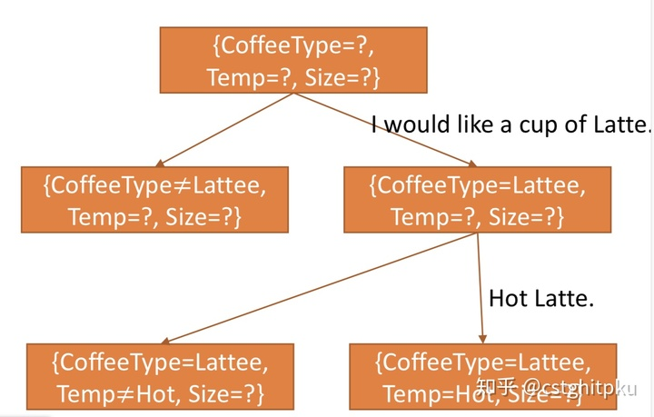

**2 对话状态的贝叶斯更新 Bayesian Update of Dialogue States (BUDS)**

这种方法就是：假设不同槽值的转移概率是相互独立的，或者具有非常简单的依赖关系。这样就将状态数从意图和槽值数的**指数**减少到了**线性**。

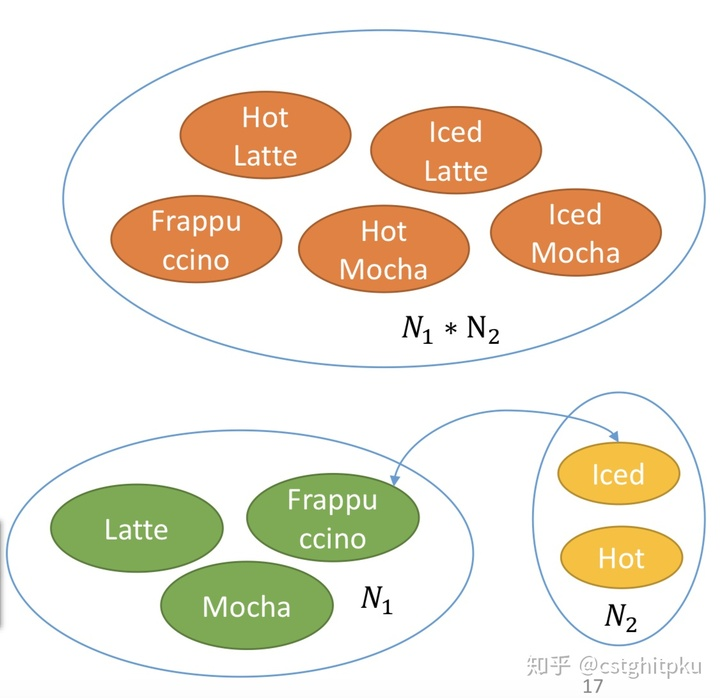

下面简单对比下两种不同状态表示法的优缺点：

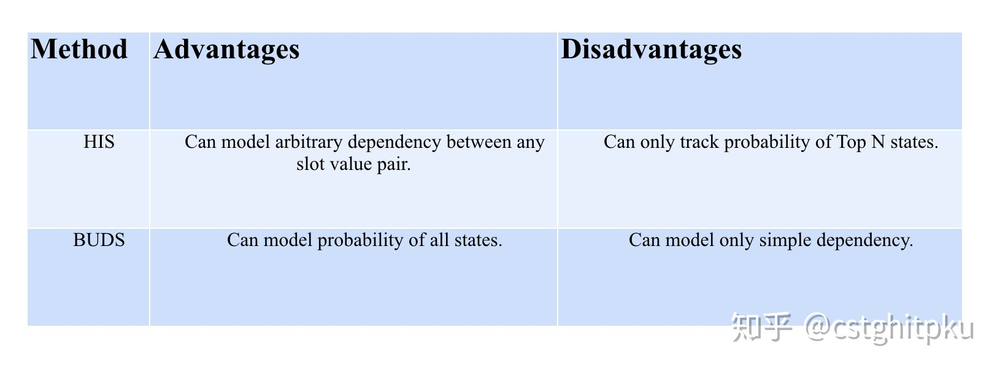

## **DSTC**

讲到DST就不得不讲DSTC，DSTC是[Dialog System Technology Challenge](https://link.zhihu.com/?target=https%3A//www.microsoft.com/en-us/research/event/dialog-state-tracking-challenge/)，主要包括6个Challenge。DSTC对DST的作用就相当于目标函数对机器学习任务的作用，真正起到了评估DST技术以及促进DST技术发展的作用。之所以在DST前先说DSTC是因为后面的很多DST的方法是在某个DSTC（大多是DSTC2、DSTC3、DSTC4、DSTC5）上做的。

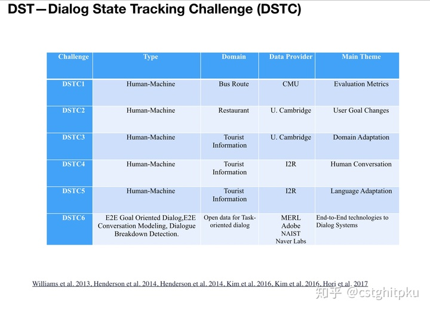

## **DST**

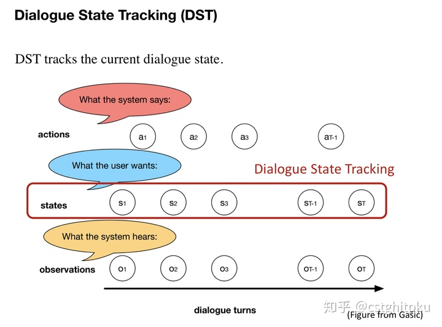

**CRF（[Lee, SIGDIAL 2013](https://link.zhihu.com/?target=http%3A//www.aclweb.org/anthology/W13-4069)）（[Kim et al., 2014](https://link.zhihu.com/?target=http%3A//www.aclweb.org/anthology/W14-4345)）**

从BUDS中对不同槽值的转移概率是相互独立的假设（是不是很像马尔可夫假设？）以及St的预测需要Un、An-1和Sn-1（转移概率和发射概率），是不是想到了HMM和CRF？没错，前期的基于统计的DST就是用了很多CRF。 n = （S −1, A −1, U ）。

[Lee, SIGDIAL 2013](https://link.zhihu.com/?target=http%3A//www.aclweb.org/anthology/W13-4069)的主要思想如下：

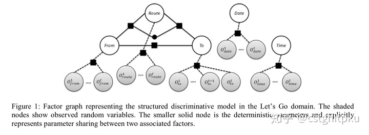

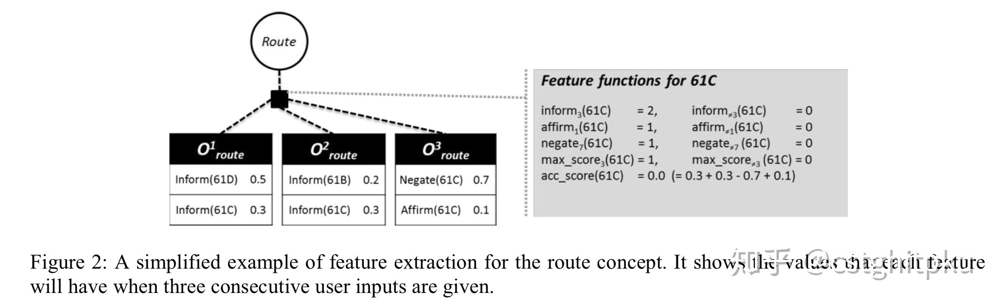

[Kim et al., 2014](https://link.zhihu.com/?target=http%3A//www.aclweb.org/anthology/W14-4345)的主要思想如下：

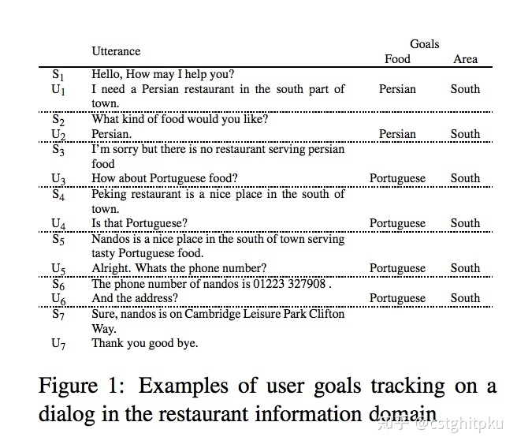

**NN-Based （**[Mrkšić et al., ACL 2015](https://link.zhihu.com/?target=https%3A//arxiv.org/abs/1506.07190)**）（**[Henderson et al., 2013](https://link.zhihu.com/?target=http%3A//www.anthology.aclweb.org/W/W13/W13-4073.pdf)**）（**[Henderson et al., 2014](https://link.zhihu.com/?target=http%3A//svr-ftp.eng.cam.ac.uk/~sjy/papers/htyo14.pdf)**）（**[Zilka el al., 2015](https://link.zhihu.com/?target=https%3A//arxiv.org/abs/1507.03471)**）**

关于神经网络的介绍、神经网络的好处和坏处，不再赘述，已经烂大街。基于神经网络的很多方法是在DSTC上做的，这里选取了几篇有针对性的经典论文简单介绍下。

[Mrkšić et al., ACL 2015](https://link.zhihu.com/?target=https%3A//arxiv.org/abs/1506.07190)是ACL2015的一篇论文，它是用RNN进行多领域的对话状态追踪，主要贡献是证明：利用多个领域的数据来训练一个通用的状态追踪模型比利用单领域数据训练追踪模型效果要好。

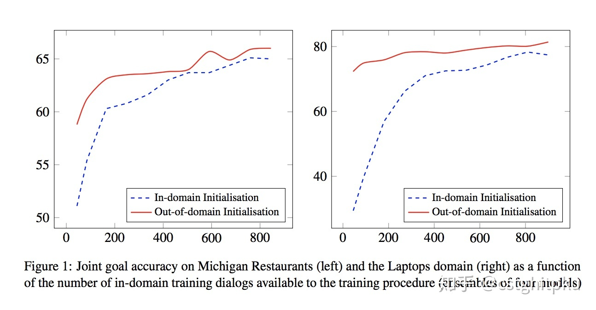

[Henderson et al., 2013](https://link.zhihu.com/?target=http%3A//www.anthology.aclweb.org/W/W13/W13-4073.pdf) 是利用DNN来解决DSTC，它把DST当分类问题，输入时间窗口内对话轮次提取的特征，输出slot值的概率分布。该方法不太容易过拟合，领域迁移性很好。模型结构图如下：

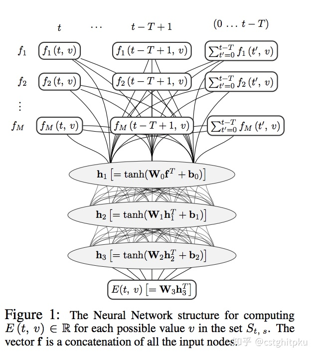

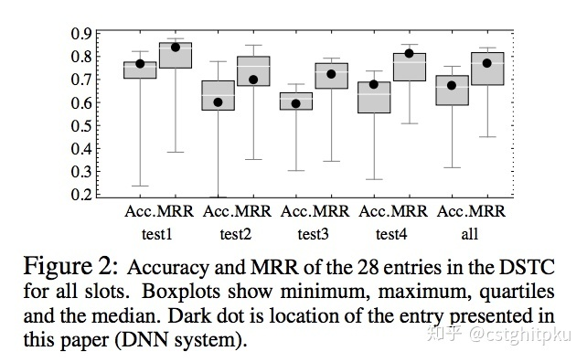

[Henderson et al., 2014](https://link.zhihu.com/?target=http%3A//svr-ftp.eng.cam.ac.uk/~sjy/papers/htyo14.pdf) ，基于DRNN和无监督的自适应的对话状态鲁棒性跟踪，从论文名字就能看出因为使用DRNN和无监督的自适应导致DST**鲁棒性很好**。

先来看看特征提取的办法：主要提取f，fs，fv三种特征，f是针对原始输入提取，fs和fv是对原始输入中的词做Tag替换得到**泛化特征**。

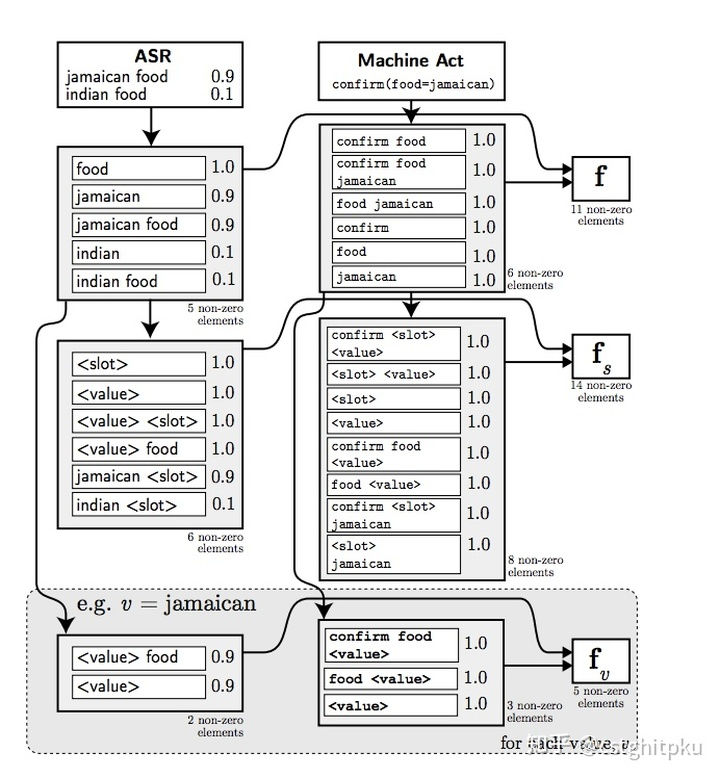

再来看下模型结构：对slot训练一个模型，利用无监督的自适应学习，将模型泛化到新的domain以便于提高模型的泛化能力。

[Zilka el al., 2015](https://link.zhihu.com/?target=https%3A//arxiv.org/abs/1507.03471)，基于增量LSTM在DSTC2做对话状态追踪，具体思想如下：

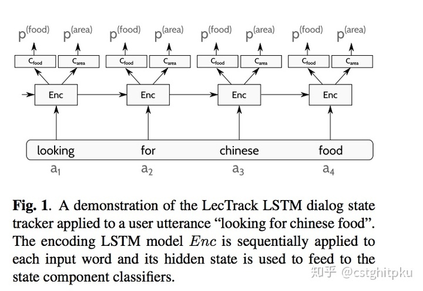

**基于迁移学习做DST （**[Williams 2013](https://link.zhihu.com/?target=http%3A//www.aclweb.org/anthology/W13-4068)**）（**[Mrkšic, ACL 2015](https://link.zhihu.com/?target=https%3A//arxiv.org/abs/1506.07190)**）**

[Williams 2013](https://link.zhihu.com/?target=http%3A//www.aclweb.org/anthology/W13-4068)，这是通过**多领域学习与泛化**来做对话状态追踪，比较好的解决了数据目标领域数据不足的问题。

[Mrkšic, ACL 2015](https://link.zhihu.com/?target=https%3A//arxiv.org/abs/1506.07190)，这是ACL 2015的一篇paper，基于RNN做多领域的对话状态追踪，主要贡献是证明：利用多个领域的数据来训练一个通用的状态追踪模型比利用单领域数据训练追踪模型效果要好。顺便说一句，这篇论文涵盖了很多任务型对话领域比较高产的学者。

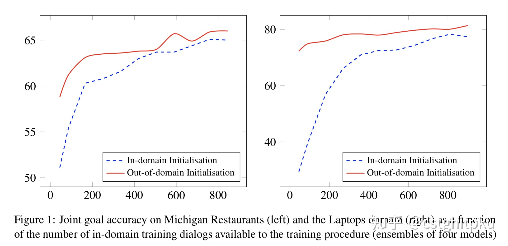

**Multichannel Tracker （**[Shietal., 2016](https://link.zhihu.com/?target=https%3A//arxiv.org/abs/1701.06247)**）**

[Shietal., 2016](https://link.zhihu.com/?target=https%3A//arxiv.org/abs/1701.06247)，基于**多通道卷积神经网络**做**跨语言**的对话状态跟踪。为每一个slot训练一个多通道CNN（中文character CNN、中文word CNN、英文word CNN），然后跨语言做对话状态追踪

先来看看方法的整体结构：

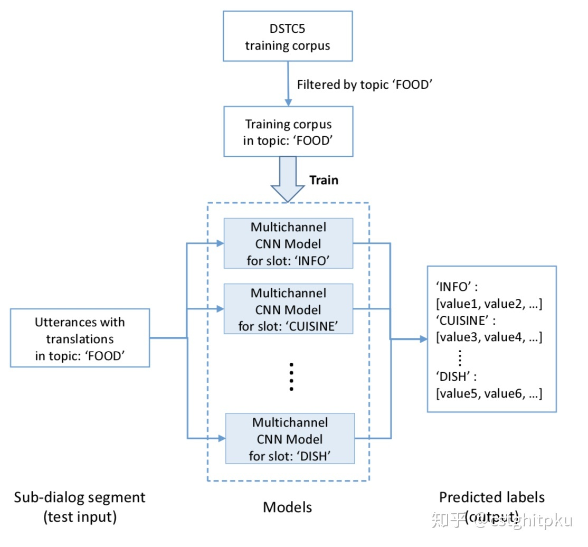

再来看看多通道CNN的结构图：

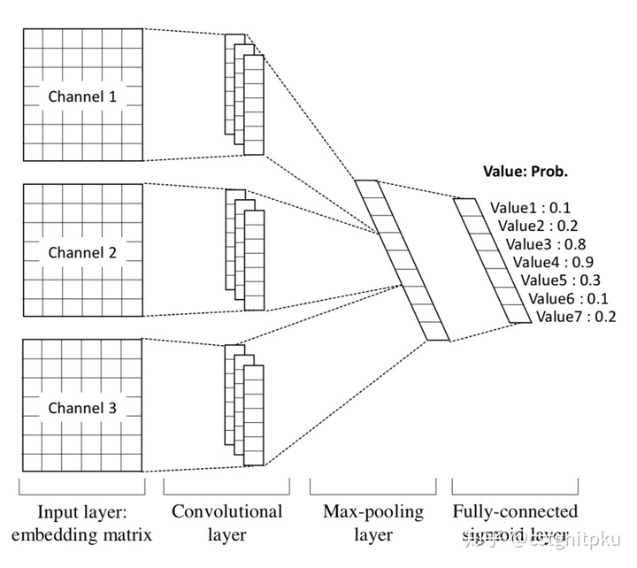

最后看看输入之前的预处理：

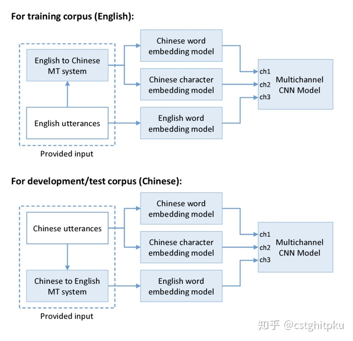

**Neural Belief Tracker （**[Mrkšić et al., ACL 2017](https://link.zhihu.com/?target=https%3A//arxiv.org/abs/1606.03777)**）**

先来看一下基于word2vec的表示学习模型，本文提出两种架构：NBT-DNN、NBT+CNN，结构图如下：

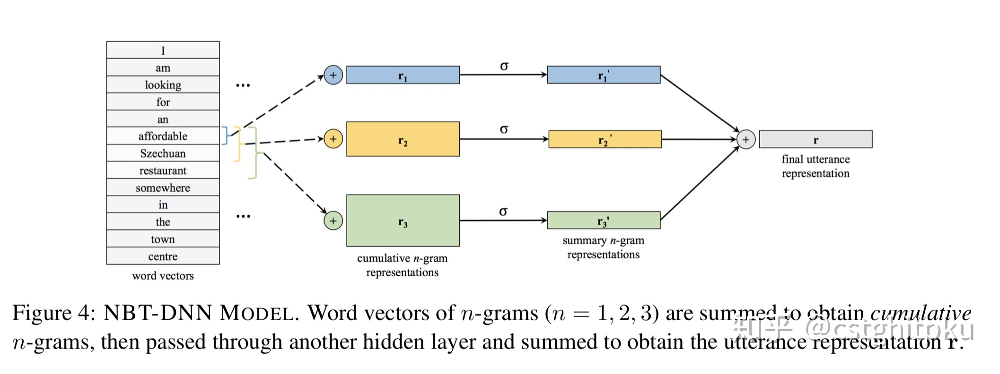

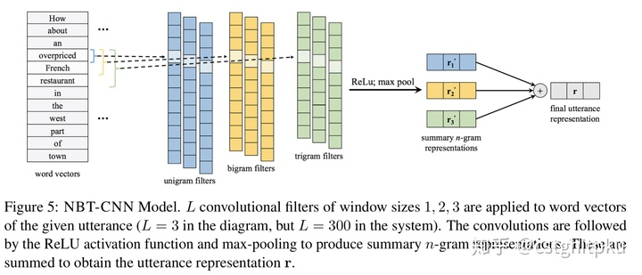

再来看看整个模型的结构图，它包含语义解码和上下文建模两部分：语义解码：判断槽值对是否出现在当前query；上下文建模：解析上一轮系统Act，系统询问（tq）+ 系统确认（ts+tv）。

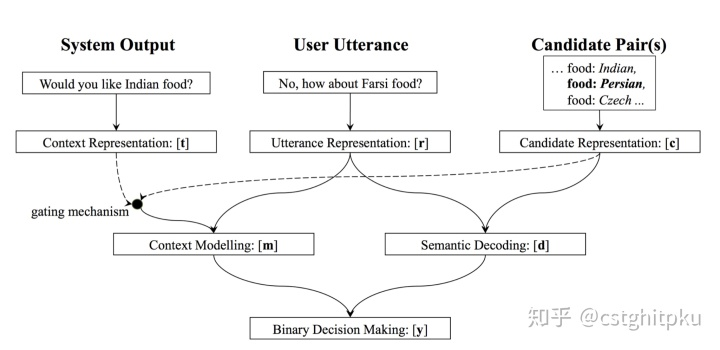

模型还有一部分：二元决策器，用来判定当前轮的槽值对的状态。本文的状态更新机制采用简单的基于规则的状态更新机制。

另外，ACL 2018在本文的基础上提出完全NBT（**Fully NBT）**，主要变动是修改基于规则的状态更新机制，把更新机制融合到模型来做**联合训练**。具体更新状态的机制包括One-Step Markovian Update（ 一步马尔科夫更新，使用两个矩阵学习当前状态和前一时刻状态间的更新关系和系数）和Constrained Markovian Update（约束马尔科夫更新，利用对角线和非对角线来构建前一种方法中的矩阵，对角线学习当前状态和前一时刻状态间的关系，非对角线学习不同value间如何相互影响）。总之，这个工作扩展的比较细致。

**其他方法**

其实还有很多种对话状态追踪的方法，比如基于贝叶斯网络做DST、基于POMDP（部分可观测马尔可夫决策过程）做DST等，因为时间相对比较久远，这里不再赘述。

## 参考资料

[一文看懂任务型对话系统中的状态追踪（DST）](https://zhuanlan.zhihu.com/p/51476362)