# 多标签分类(Multi-label Classification)

## 数据分析

it is important to understand the structure of label co-occurence in your data, explore them a little, build a graph.What is the **structure of label relationships** ? Only then you can decide if hamming loss (which ignores label correlations) is a good measure of generalization quality, maybe jaccard or 0-1 accuracy are better.What does it mean for your problem to **miss a label out of a set of labels** ? Is **it more important to recall relevant documents or maybe it's important to have a high precision** . Is a proportion of properly assigned labels to all assigned important? What is the cost of **making a mistake in your classification in real life** ? **Which cost is the highest** , it will be different in classifying patients with syndromes in medicine and in classification journalism texts for publishing.

来自：

[Multi-label classification problem: choosing the right threshold value for y = 1](https://stats.stackexchange.com/questions/261756/multi-label-classification-problem-choosing-the-right-threshold-value-for-y-1)

### 统计指标

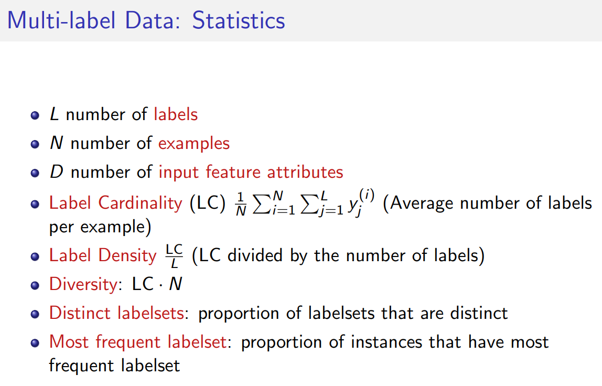

标签基数LC即样本的平均标签数。

标签多样性，即数据集中不同的标签集合数。

### **多标签分类数据中标签的依赖性** 

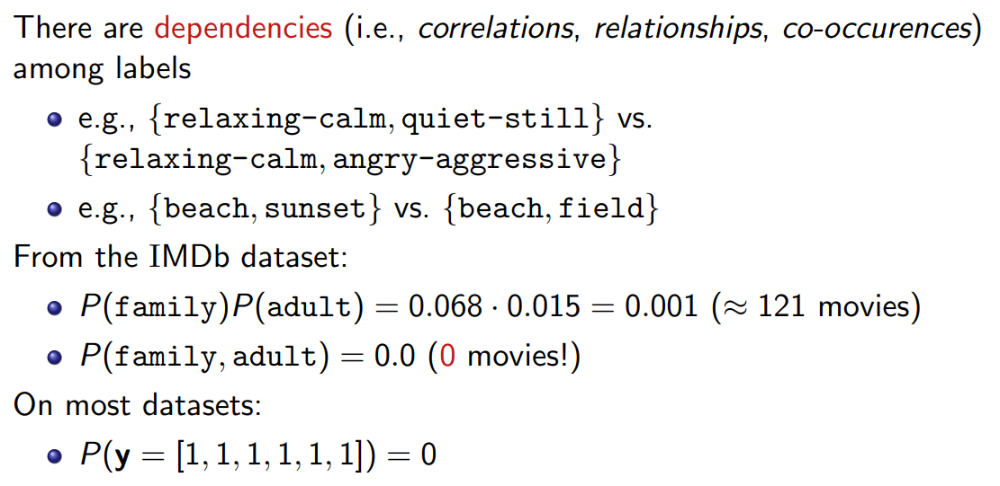

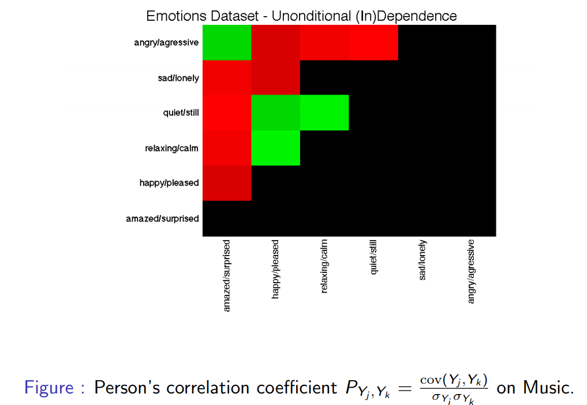

- 一阶(first-order)策略: 多标签分类用一个标签一个标签的(label-by-label)方式处理，那么就忽略了其他标签的共存性，比如将多标签学习分解为若干个独立的二分类问题。一阶策略的主要价值在于概念上简单、效率高。另一方面。结果的有效性可能不是最好的。

- 二阶策略：用标签之间的成对关系来处理。比如在相关和不相关的标签之间排序，或者任意两个标签之间的互动。结果可以取得不错的泛化表现。然而，有一些现实世界的问题的标签相互关系超越了二阶假设。

- 高阶策略：考虑标签之间的高阶关系，比如将所有其他标签的影响施加到每个标签上，或寻找随机标签子集之间的关系，等等。高阶策略计算量大，可扩展性低。

## 难点

model label dependencies and do this efficiently

## 相关任务

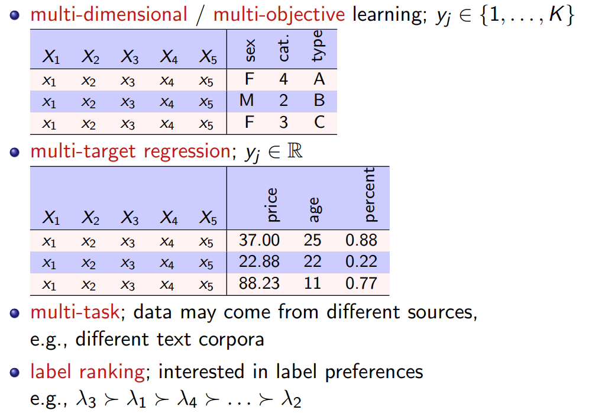

## 多标签分类的方法

Problem Transformation Methods

- 把多标签问题转换成单标签(single-label)问题

- 用现有的单标签分类器来完成

- i.e., Adapt your data to the algorithm调整数据以适应算法

Algorithm Adaptation Methods

- 调整单标签算法，以产生多标签的输出

- Benefit from specific classifier advantages (e.g., efficiency)

- i.e., Adapt your algorithm to the data调整算法以适应数据

Many methods involve a mix of both approaches

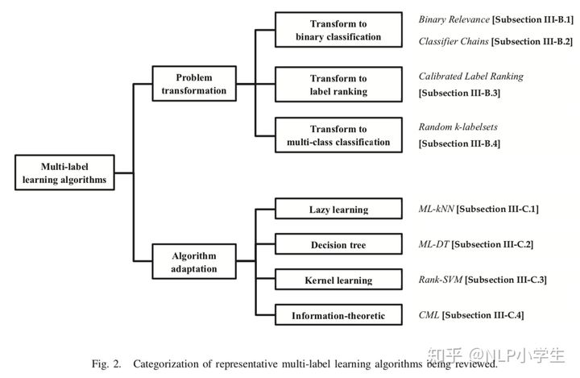

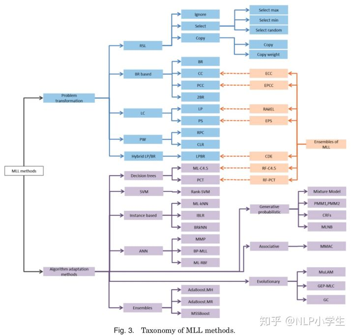

### Problem Transformation

**Binary Relevance（BR）** 

- L个二分类问题，每个类和剩余类看成二分类（one vs. all）

- 缺点：（1）没有建模标签之间的依赖性（2）类别不均衡

- 改进：Stacked BR(2BR)[Godbole and Sarawagi, 2004]：在上层堆叠另一个BR，预测$\hat y = h^2(h^1(\tilde x))$

- 改进：Chain Classifier(CC)[Cheng et al., 2010, Read et al., 2011]：类似BR，L个二分类问题，但是把之前的预测作为特征的一部分

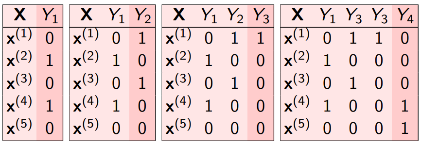

**Lable Powerset（LP）** 

- 一个有 $2^L$ 个类的多分类问题，即把每种标签组合的可能性作为一个类

- 缺点：（1）complexity：很多类（2）imbalance：每个类没有多少样本（3）overfitting：如何预测新的类？

- 改进：Ensembles of RAndom k-labEL subsets（RAkEL）[Tsoumakas and Vlahavas, 2007]：

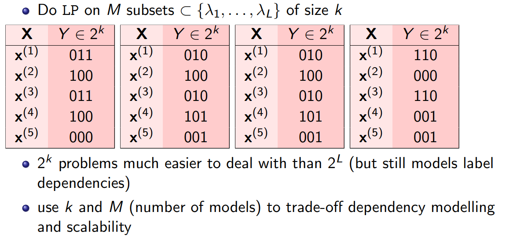

- 改进：Ensembles of Pruned Sets（EPS）[Read et al., 2008]：

- Ensemble methods (e.g., RAkEL, EPS) make prediction via a voting scheme.例如majority vote，weighted vote, threshold等。

- more predictive power (ensemble effect)；can predict new label combinations

**Pairwise Binary（PW）** 

- $\frac{L(L-1)}{2}$个二分类问题，每2个类看成二分类（all vs. all）。每个模型的训练是基于那些只属于2类里其中一个类的样本。

- 问题：（1）this produces pairwise rankings, how to get a labelset?（2）how much sense does it make to find a decision boundary between overlapping labels?（3）can be expensive in terms of numbers of classifiers $(L(L−1)/2)$

- Calibrated Label Ranking CLR ([F¨urnkranz et al., 2008]):

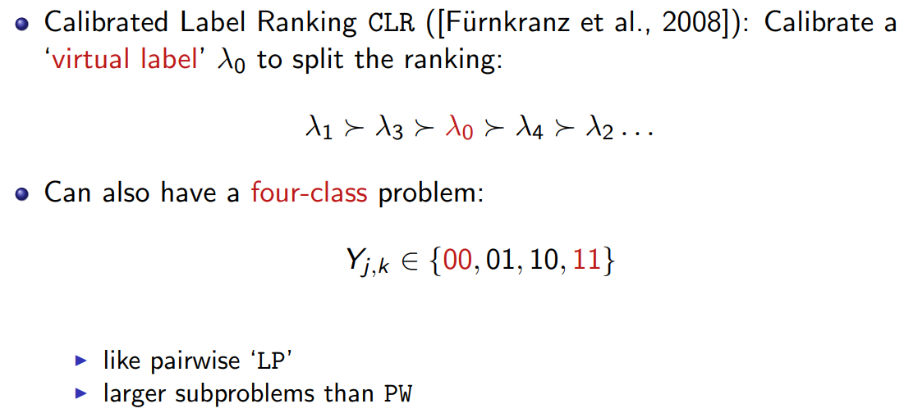

**Copy-Weight Classifier（CW）** 

- 一个有L个类的多分类问题

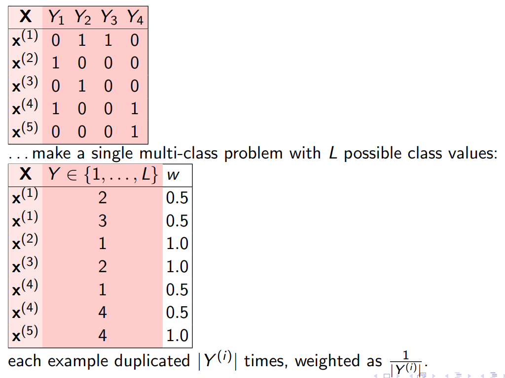

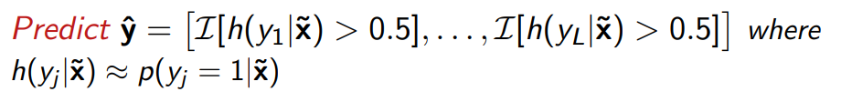

- 问题：（1）decision boundary for identical instances / different classes?（2）transformed dataset grows large (N) with high label cardinality （3）no obvious way to model dependencies (like BR)

### Algorithm Adaptation

**k-Nearest Neighbours** 

- KNN：x的类别是它的k个最近邻居的大多数类别

- MLKNN[Zhang and Zhou, 2007]：x的类别是它的k个最近邻居的最常见的类别（most common labels）

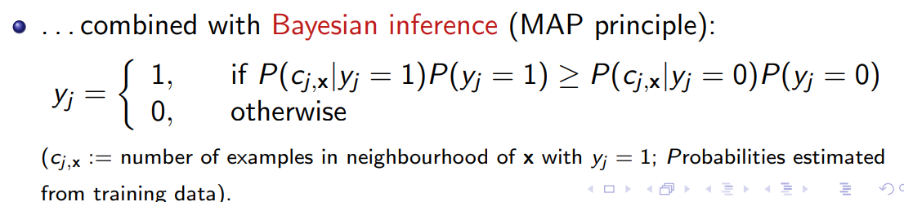

**Decision Trees** 

- Multi-label C4.5 [Clare and King, 2001]：C4.5决策树算法的扩展，多标签交叉熵（multi-label entropy）

- 结构和C4.5一样；允许叶子节点有多个类；在ensemble / random forest中表现很好

**Support Vector Machines** 

- RankSVM, a Maximum Margin approach [Elisseeff and Weston, 2002]

**Neural Networks** 

- BPMLL [Zhang and Zhou, 2006]

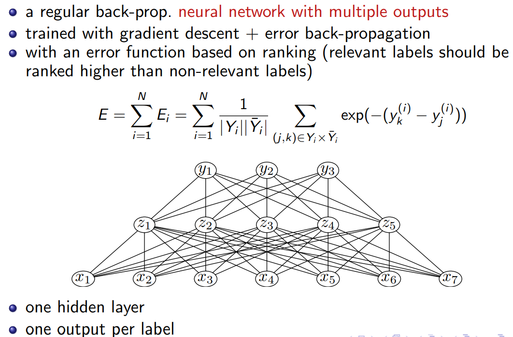

哪个方法更好？取决于问题本身

- For efficiency / speed: Decision Tree-based

- For flexibility: problem transformation methods, esp. BR-based

- For predictive power? Use ensembles (most modern methods)

An extensive empirical study by [Madjarov et al., 2012] recommends:

- RT-PCT: Random Forest of Predictive Clustering Trees (Algorithm Adaptation, Decision Tree based)

- HOMER: Hierarchy Of Multilabel ClassifiERs (Problem Transformation, LP-based (original presentation))

- CC: Classifier Chains (Problem Transformation, BR-based)

## 损失函数

[损失函数](https://www.notion.so/177fb42631a44f41872f3703e89f2052)

## 阈值选择

Threshold Selection

- 一些方法输出的是实值，例如概率值等。如何将其转换成二元的结果？

- Use ad-hoc threshold, e.g., 0.5，但是怎么知道选哪个

- Select a threshold from an internal validation test, e.g.,∈ {0.1, 0.2, . . . , 0.9}，但是慢

- 为每个样本设置一个返回标签数量

- Calibrate a threshold such that LCard(Y) ≈ LCard($\hat Y$)。

&ensp;&ensp;&ensp;&ensp;- 例如训练数据的label cardinality是1.7，那么设置一个阈值，使得测试数据的label cardinality尽可能接近1.7。

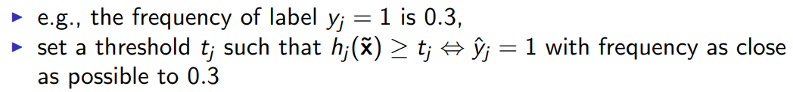

&ensp;&ensp;&ensp;&ensp;- stacking-style的步骤可以用来决定阈值函数。

## 评估方法

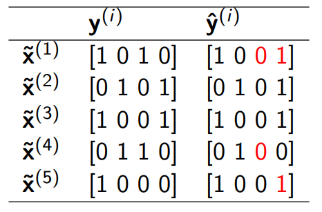

Hamming loss

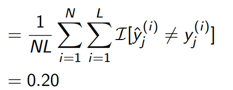

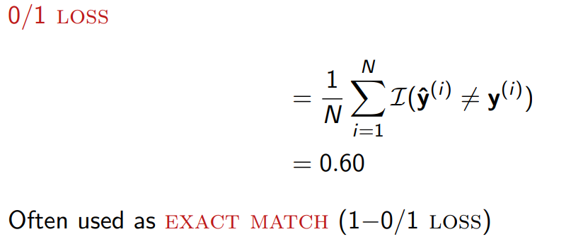

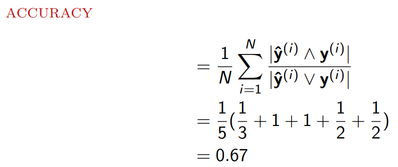

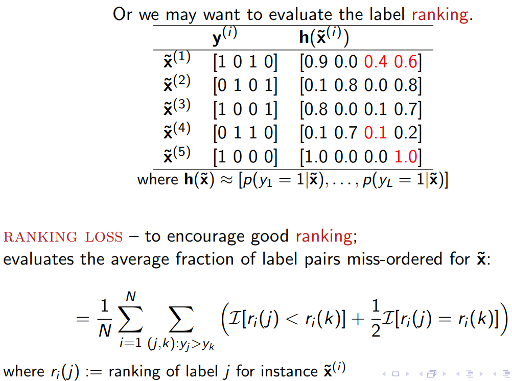

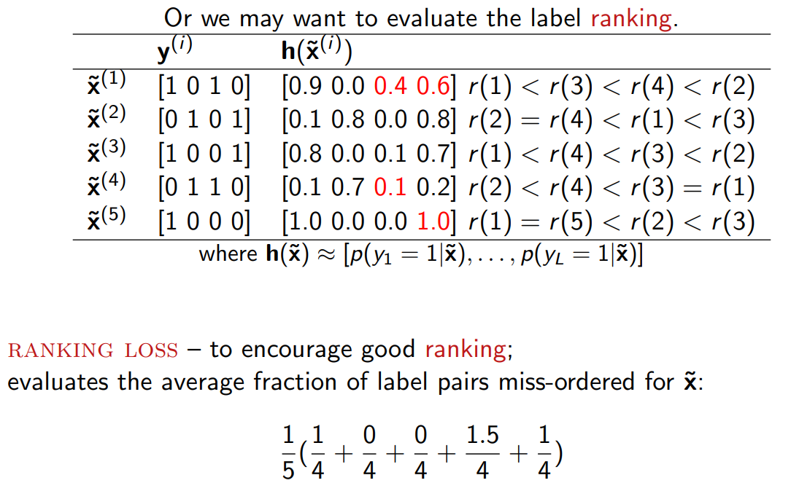

Other metrics used in the literature:

- one error – if top ranked label is not in set of true labels

- coverage – average “depth” to cover all true labels

- precision

- recall

- macro-averaged F1 (ordinary averaging of a binary measure)

- micro-averaged F1 (labels as different instances of a ‘global’ label)

- precision vs. recall curves

0/1 loss vs. Hamming loss

- Hamming loss can in principal be minimized without taking label dependence into account.

- For 0/1 loss label dependence must be taken into account.

- Usually not be possible to minimize both at the same time!

- For general evaluation, use multiple and contrasting evaluation measures!

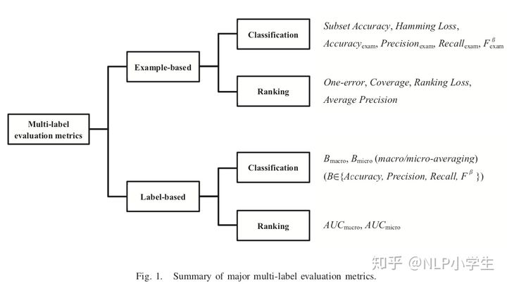

1.基于样例的指标

1.1 子集准确率

子集准确率衡量正确分类的样例的比例，即，预测标签集和真实标签集完全一样的比例。子集准确率可以看做传统准确率在多标签场景下的对应。一般来说这个指标过于严苛，尤其是标签空间很大的时候。

1.2 汉明损失

预测集合和真实集合中每个标签不一样的比例。

1.3 Accuracy, Precision, Recall, F

1.4 排序指标

- One-error衡量排名第一的标签不是相关标签的比例。

- Coverage衡量了在排序标签列表上需要从头走多少步，才能覆盖全部相关的标签。

- Ranking Loss排序损失衡量了排序相反的比例，即不相关的标签排在相关标签之前。

- Average Precision均精确度衡量了相关标签排在一个特定标签之上的平均比例。

2.基于标签的指标

2.1 分类指标

TP, FP, TN, FN, Accuracy, Precision, Recall, F，宏观平均，微观平均

宏观平均在标签上假设权重相等，微观平均在样例上假设权重相等。

2.2 排序指标

宏观平均AUC，微观平均AUC

不同指标衡量模型的不同方面。多标签模型应该用多种不同的指标综合评估。

## 相关软件/工具

### MEKA: A Multi-label Extension to WEKA

[http://meka.sourceforge.net/](http://meka.sourceforge.net/)

### Python

sklearn.multiclass.OneVsRestClassifier ← Baseline BR

sklearn.multioutput.ClassifierChain ← Classifier Chains

[scikit-multilearn](http://scikit.ml/userguide.html)

## 参考资料

1. [Multi-label Classification](https://jmread.github.io/talks/Multilabel-Part01.pdf)（PPT）

&ensp;&ensp;&ensp;&ensp;[Multilabel-Part01.pdf](https://s3-us-west-2.amazonaws.com/secure.notion-static.com/bfcb0b10-7b1d-4852-bf3b-8d905c581356/Multilabel-Part01.pdf)

2. [https://jmread.github.io/talks](https://jmread.github.io/talks)（这个人有蛮多多标签分类的talk）

3. 包括EDA、简单的sklearn模型应用等：

[Deep dive into multi-label classification..! (With detailed Case Study)](https://towardsdatascience.com/journey-to-the-center-of-multi-label-classification-384c40229bff)

1. [多标签学习的新趋势（2020 Survey）](https://zhuanlan.zhihu.com/p/266749365)（只是简单的综述趋势，没有详细的讲解，现阶段还看不懂ε=(´ο｀*))) @Ling Li ）

2. [将“softmax+交叉熵”推广到多标签分类问题](https://zhuanlan.zhihu.com/p/138117543)（苏剑林，softmax损失函数）

3. [多标签分类：定义、思想和算法](https://zhuanlan.zhihu.com/p/183957063)（从定义到指标到算法，比较全面）

4. [多标签、类别不均衡分类问题](https://blog.csdn.net/weixin_46133588/article/details/108755600)（列举了一些资料）

5. [深度学习：如何在多标签分类问题中考虑标签间的相关性？](https://zhuanlan.zhihu.com/p/39535198)（标签相关性文献总结）

6. [周志华团队：深度森林挑战多标签学习，9大数据集超越传统方法](https://zhuanlan.zhihu.com/p/92818017)（深度森林，但是无源码，看不懂）

7. [如何用 Python 和 BERT 做多标签（multi-label）文本分类？](https://zhuanlan.zhihu.com/p/66440354)（王树义老师，fast-bert，Colab，直接把多标签问题封装了）

8. [多标签文本分类介绍，以及对比训练](https://zhuanlan.zhihu.com/p/152140983)（ALBERT、ALBERT+TextCNN、ALBERT+Seq2Seq+Attention和ALBERT+Denses，tensorflow）

9. [NLP（二十八）多标签文本分类](https://blog.csdn.net/jclian91/article/details/105386190)（2020语言与智能技术竞赛：事件抽取任务，模型结构：ALBERT + 双向GRU + Attention + FC）

10. [基于深度学习的大规模多标签文本分类任务总结](https://blog.csdn.net/Irving_zhang/article/details/78273486)（知乎话题标签分类，介绍了fasttext, TextCNN, TextRNN等模型）

11. [用深度学习（CNN RNN Attention）解决大规模文本分类问题 - 综述和实践](https://zhuanlan.zhihu.com/p/25928551)（淘宝商品类目预测，介绍了fasttext, TextCNN, TextRNN等+Attention模型，keras）

12. [300万知乎多标签文本分类任务经验分享（附源码）](https://blog.csdn.net/tMb8Z9Vdm66wH68VX1/article/details/78679672)（知乎话题标签分类第一名）[https://zhuanlan.zhihu.com/p/28923961](https://zhuanlan.zhihu.com/p/28923961)

13. [标签分布不均衡，如何训练？](https://blog.csdn.net/weixin_36378508/article/details/105512585)（分布不均衡下可以采取的各种方案）

14. [3.3. 模型评估:对模型的预测进行量化考核](https://sklearn.apachecn.org/docs/master/32.html)（sklearn，多标签指标计算）

15. [TextCNN多标签分类：我喜欢的样子你都有](https://mp.weixin.qq.com/s/LxXW-ulp9_0q0zhsEbjK_w)，[TextCNN多标签分类：我喜欢的样子你都有(中)](https://mp.weixin.qq.com/s/o6MgXtd_mUiffGzWK_WT1A)，[TextCNN多标签分类：我喜欢的样子你都有(下)](https://mp.weixin.qq.com/s/qqhKAPS0tu3TW-RChIp5lw)

16. [多标签图像分类任务的评价方法-mAP](https://zhuanlan.zhihu.com/p/33372046)

未读论文：

- Threshold optimisation for multi-label classifiers（2013，引用53）

- [A Study on Threshold Selection for Multi-label Classification](https://www.csie.ntu.edu.tw/~cjlin/papers/threshold.pdf)（2007，引用146）

- On label dependence and loss minimization in multi-label classification（2012，引用303）

- How Is a Data-Driven Approach Better than Random Choice in Label Space Division for Multi-Label Classification?（2016，引用33）

- [Efficient Multi-label Classification with Many Labels](https://www.cse.ust.hk/~jamesk/papers/icml13a.pdf)(2013，引用186）（选择一个标签子集来训练，讨论如何选择的问题）

[Efficient Multi-label Classification with Many Labels.pdf](https://s3-us-west-2.amazonaws.com/secure.notion-static.com/4dcda2db-7f1a-4df5-8b15-18811ec765e2/Efficient_Multi-label_Classification_with_Many_Labels.pdf)

- A Review on Multi-Label Learning Algorithms（2013，引用1974）（文章[多标签分类：定义、思想和算法](https://zhuanlan.zhihu.com/p/183957063) 已经翻译地比较全了）

[A Review on Multi-Label Learning Algorithms - 2013.pdf](https://s3-us-west-2.amazonaws.com/secure.notion-static.com/e31dd599-9a51-409c-8229-cec7ff1c7ab4/A_Review_on_Multi-Label_Learning_Algorithms_-_2013.pdf)

- MAGNET: Multi-Label Text Classification using Attention-based Graph Neural Network（2020，引用1）

[https://github.com/DunZhang/LM-MLC](https://github.com/DunZhang/LM-MLC)

