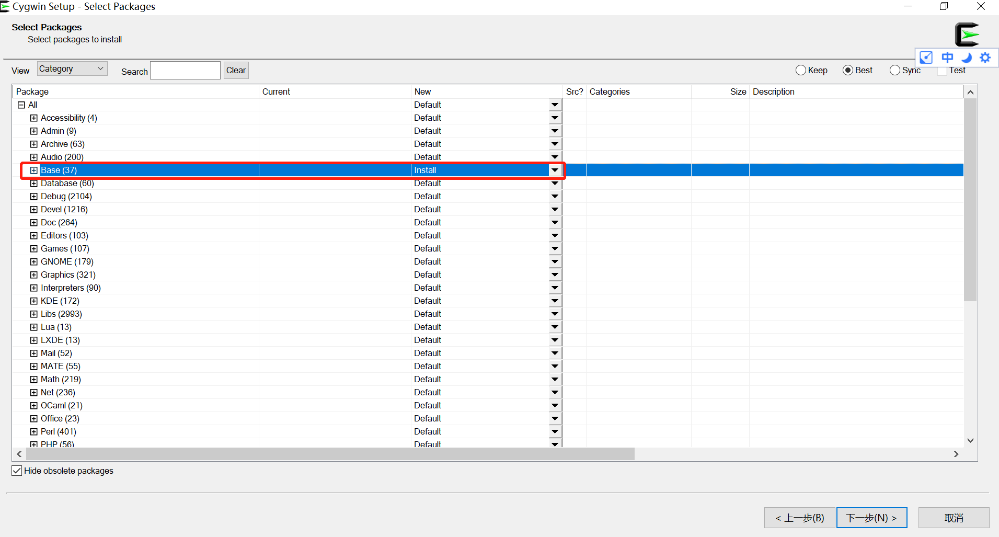
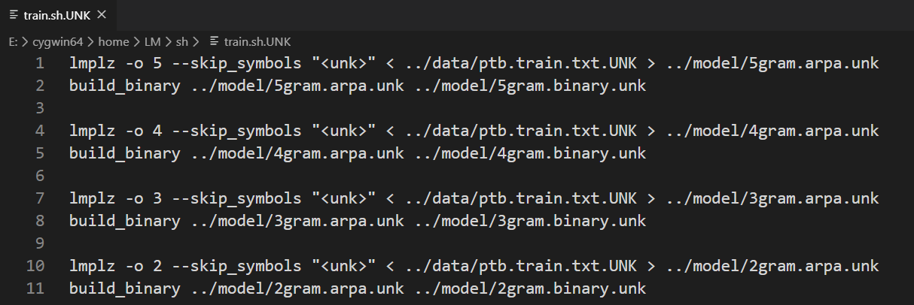
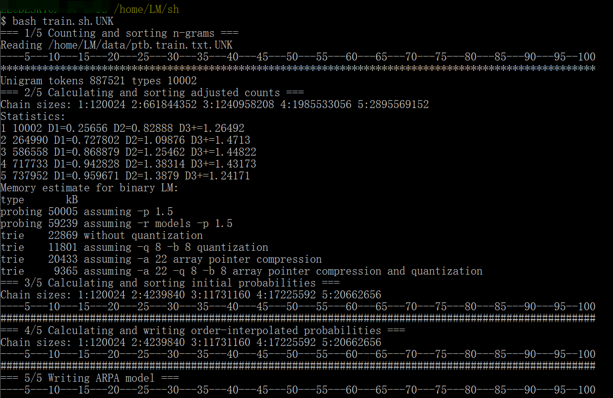
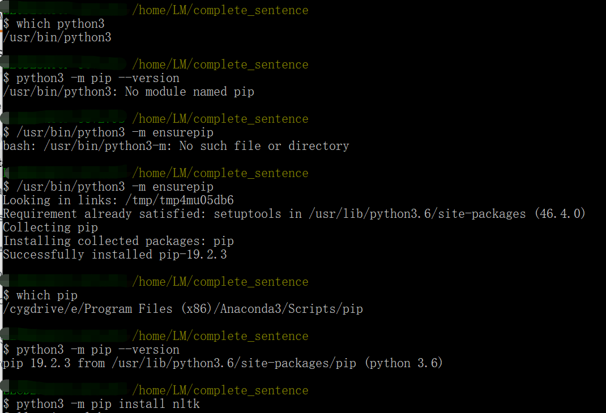
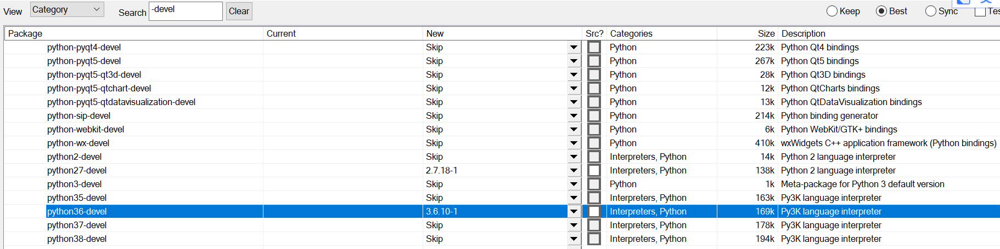

上一篇文章中，我们从零开始实现了一个简单的N-gram模型，完成了训练、预测的过程。今天我们来介绍一个工具KenLM，它是用C++写的，速度快，对内存友好。它是一个可以用来训练N-gram语言模型的工具。所以本文使用它再来走一遍训练N-gram模型并做完形填空的流程。

KenLM的网站：https://kheafield.com/code/kenlm

环境搭建过程中需要用到的软件或文件我已整理好，后台回复`ngram`获取。

### Linux环境准备

由于训练模型只能在Linux系统上操作，所以首先需要有一个Linux环境。

如果实在没有Linux环境，也可以在Windows下安装Cygwin软件，模拟Linux环境：

从官网http://www.cygwin.com/下载Cygwin的安装软件，双击下载安装。安装过程很简单，保持默认选项，一直“下一步”即可。有几点可能需要修改的：

1. 选安装目录时可以用默认的也可以重新选择，我选的是E:/cygwin64这个路径。
2. 选择下载站点(Choose A Download Site)时，为了下载快，可以在User URL处添加(Add)镜像http://mirrors.163.com/cygwin/或http://mirrors.aliyun.com/cygwin/
3. 选择需要下载安装的组件包(Select Packages)，如下图所示：



选择Base，点击右边的倒三角，将其选为`Install`，就表示我们要安装`Base`下面的所有组件，当然你也可以展开`Base`，只选择部分组件安装。我这里为了省事，就选了整个。同样的方法，选择Base，Devel，Libs，Net，System，Utils几个模块。其中Devel包括了我们开发需要用到的组件。

选好之后，一直点击下一步，就会进入安装状态，等待它安装完成即可。

安装完成之后，可以选择创建桌面快捷方式。如果你像我一样忘了创建快捷方式的话，可以通过在安装目录下双击`Cygwin.bat`打开Cygwin。

安装目录下其实就是模拟了Linux环境，所以打开Cygwin的效果和你打开Linux系统的终端是一样的。相当于在Windows里内嵌了一个简易的Linux系统，是不是超棒！

更详细的安装步骤可以查看参考资料[1]。

### 安装kenlm

打开终端，进入home，创建一个目录，用来存放kenlm环境(也可以直接放在当前目录下)。依次执行下列命令：

```
wget -O - http://kheafield.com/code/kenlm.tar.gz |tar xz
cd kenlm
mkdir -p build
cd build
cmake ..
make -j 4
```

这样kenlm就搭建好了。

还有一步必不可少的是设置环境变量，否则后面训练时的命令就无法执行。.bashrc是系统的环境变量文件，我们需要修改它：

```
vim ~/.bashrc
```

如果报错vim命令找不到，可以改成vi

输入i进入编辑模式，然后添加一行，注意这个路径要跟你的kenlm路径保持一致：

```
export PATH=$PATH:/home/kenlm/build/bin
```

然后按`esc`键退出编辑模式，输入`:wq`保存并退出。

注意还没结束，还需要执行`source ~/.bashrc`命令使配置生效。

### 训练模型

接下来就可以训练模型了，我们将训练用到的文件都放在LM文件夹下，然后将文件夹放在home下。训练用到的文件是`train.sh.UNK`，在LM/sh文件夹里：



我们需要训练5gram, 4gram, 3gram, 2gram，训练数据放在`../data/ptb.train.txt.UNK`里，上一篇文章已经介绍过了。原本的数据集中未知词是用`<unk>`表示的，而kenlm遇到`<unk>`会报错，所以我们将其替换成了`UNK`，替换后的数据集就是我们这里要用到的`../data/ptb.train.txt.UNK`。训练后的模型会保存在`../model`文件夹里。

在终端通过cd命令进入sh目录，执行命令`bash train.sh.UNK`就开始训练了。



训练完成很快，大概就1分钟。

### 做完形填空

模型训练好之后，我们就可以测试了，那么怎么预测呢？先来看看代码吧~

首先是import我们要用到的包，并读取测试集、选项、答案，跟上一篇文章中是一样的。

```python
import nltk
import sys
import kenlm

def load_sentences():
    fn = "./sentences.txt"
    with open(fn) as f:
        line = f.read()
        words = nltk.tokenize.word_tokenize(line)
        words = [x.lower() for x in words]
    return words

def load_options():
    f = open("./options.txt")
    options = []
    for line in f: 
        ll = line.split()
        words = []
        for s in ll:
            word = s.split(".")[-1].lower()
            words.append(word)
        options.append(words)
    f.close()
    return options

def load_answers():
    f = open("./answers.txt")
    line = f.readline().strip()
    f.close()
    return line
```

不过还缺少一步，将测试集中的不在训练集中的单词替换成UNK。

```python
def unk_it(words, vocab):
    blank_ids = [str(n) for n in range(1, 21)]
    for i in range(len(words)):
        if words[i] in blank_ids:
            continue
        if not words[i] in vocab:
            words[i] = "UNK"
    return words
```

接下来是预测，和之前类似，只不过句子的概率是通过模型预测出来的。

```python
def predict(words, options, lm, right_answers):
    """
    根据历史进行一个词的预测。
    Params:
        words: 待预测的句子组成的列表。
        options: 所有候选词构成的列表。
        lm：训练好的ngram模型
    Returns:
        预测结果
    """
    n = lm.order   # ngram的n值
    all_words = lm
    blank_ids = [str(n) for n in range(1, 21)]
    bid = 0
    answers = ""
    for i in range(len(words)):
        if words[i] in blank_ids:
            print("Blank ", words[i])
            
            pre_sentence = words[i-(n-1):i]
            post_sentence = words[i+1:i + n]
            max_score = -float('inf')
            choice = -1
            for j in range(len(options[bid])):
                option = options[bid][j]
                if not option in all_words:
                    option = "UNK"
                seq = pre_sentence + [option] + post_sentence
                seq = " ".join(seq)
                # 直接用模型预测句子的概率，不需要考虑句子开头有bos和结尾有eos符号
                score = lm.score(seq, bos=False, eos=False)
                print(score, seq)
                if score > max_score:
                    max_score = score
                    choice = j
            print("Choose: ", 'ABCD'[choice], "Correct: ", right_answers[bid])
            answers += 'ABCD'[choice]
            bid += 1 

    return answers
```

然后是计算准确率的函数

```python
def accuracy(answers,choices):
    n = len(answers)
    c = 0
    for i in range(len(answers)):
        if answers[i] == choices[i]:
            c += 1
    return c*1.0/n
```

将上述过程整合：

```python
def main():
    lm = kenlm.Model(sys.argv[1])

    words = load_sentences()  # 加载测试集
    options = load_options()  # 加载选项
    answers = load_answers()  # 加载正确答案

    print(" ".join(words))

    words = unk_it(words, lm)  # 替换未知词
    print(" ".join(words))

    choices = predict(words, options, lm, answers)  # 预测
    print(choices)
    print(answers)
    
    a = accuracy(answers, choices)  # 计算准确率
    print(a)


if __name__ == "__main__":
    main()
```

上述代码都放在文件main.py里，cd到当前目录，运行main.py，注意要输入模型文件的路径：

```
python main.py ../model/4gram.arpa.unk
```

这部分Linux或者Windows环境下都可以完成。

1.如果是在Windows环境下运行，记得安装好需要的包，例如kenlm的安装：

```
pip install https://github.com/kpu/kenlm/archive/master.zip
```

安装之前需要先安装Visual C++，否则中间会报错“microsoft visual c++ 14.0 is required”。下载Visual C++文件，双击傻瓜式安装即可。

如果上述命令执行后报错，仍旧无法安装，可以先将路径对应的zip包下载下来，然后到zip包所在目录下，用命令`pip install kenlm-master.zip`安装。

亲测可行。

在Windows环境下运行还要注意一点，**模型文件所在路径不能包含中文**，否则会报错“No such file or directory”。

2.如果是Linux环境，建议直接使用Linux系统。因为我用Cygwin没有运行成功╮(╯▽╰)╭。下面简单记录一下我遇到的错误类型。

（1）直接运行命令，报错“No moduled named kenlm”，试图`cd kenlm`（就是之前kenlm解压的目录）并且`python setup.py install`还会报错“‘strerror_r’ was not declared in this scope”，目前还没找到解决方案。

（2）Cygwin下nltk的安装也比较麻烦。由于自身不带pip，需要先安装：



这样直接安装nltk可能会报错“ #include "Python.h"  command 'gcc' failed with exit status 1”。

需要运行之前的Cygwin安装包，下载python-devel，再运行install nltk才能安装成功。



用训练得到的模型去做完形填空，2gram、3gram、4gram、5gram的准确率都是0.4，还不如上一篇文章中实现的简单模型（准确率0.55）呢╮(╯▽╰)╭


### 参考资料

[1] Cygwin安装教程

https://blog.csdn.net/u010356768/article/details/90756742

[2] Linux环境变量配置全攻略

https://www.cnblogs.com/youyoui/p/10680329.html

[3] python | 高效统计语言模型kenlm：新词发现、分词、智能纠错

https://zhuanlan.zhihu.com/p/84470460

[4] https://github.com/shixing/xing_nlp/tree/master/LM


